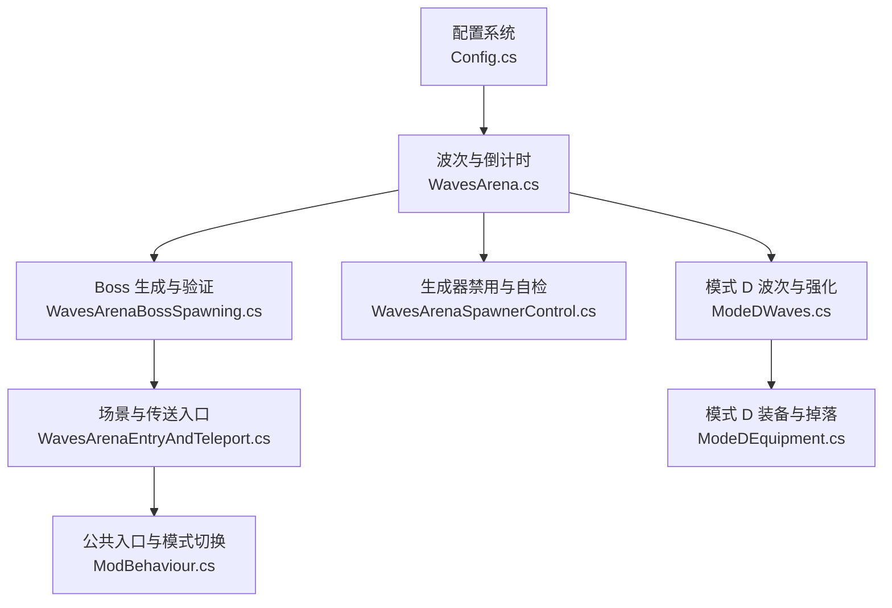
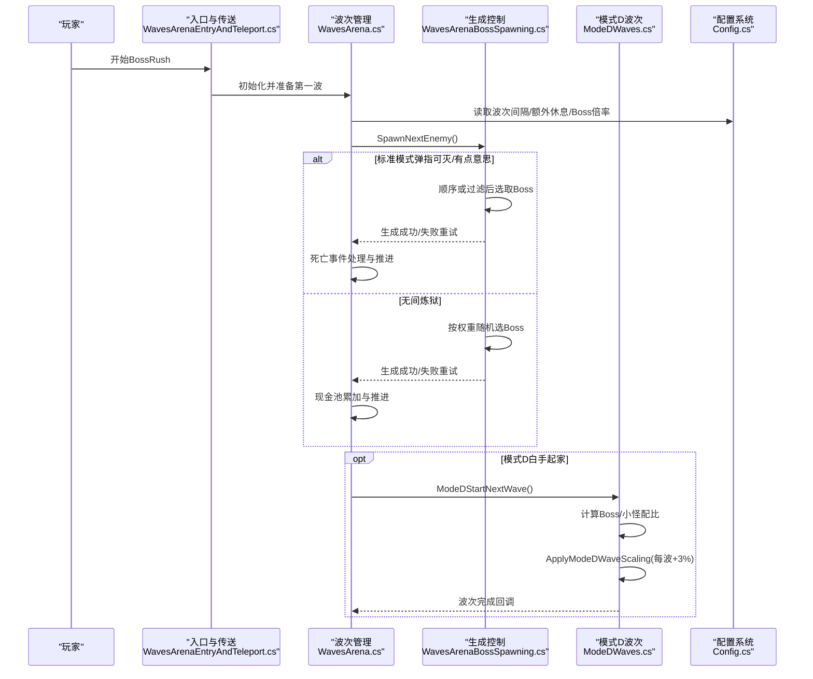
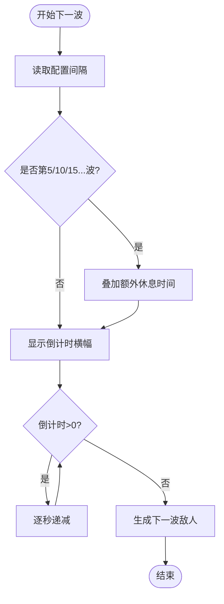
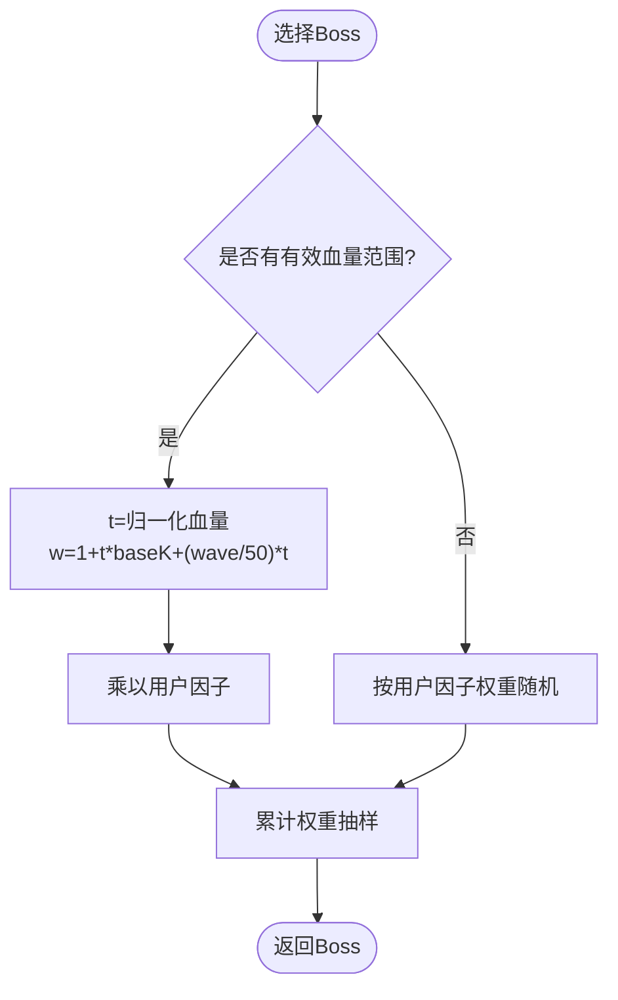
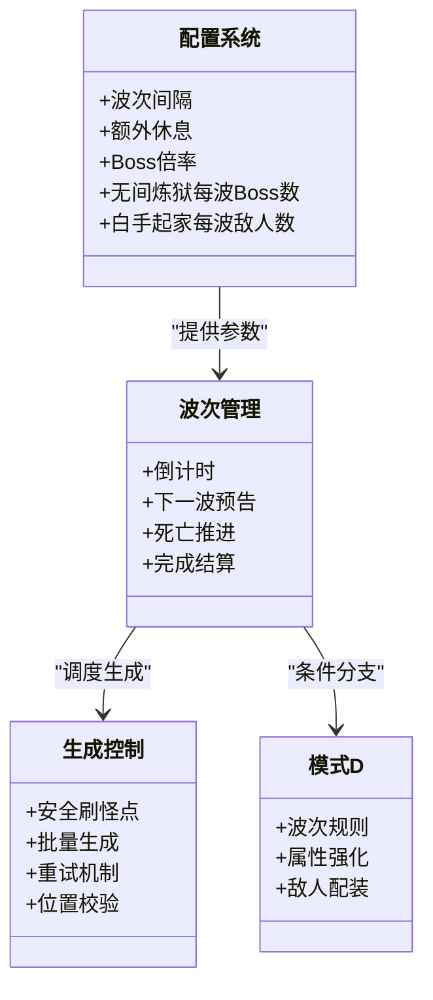
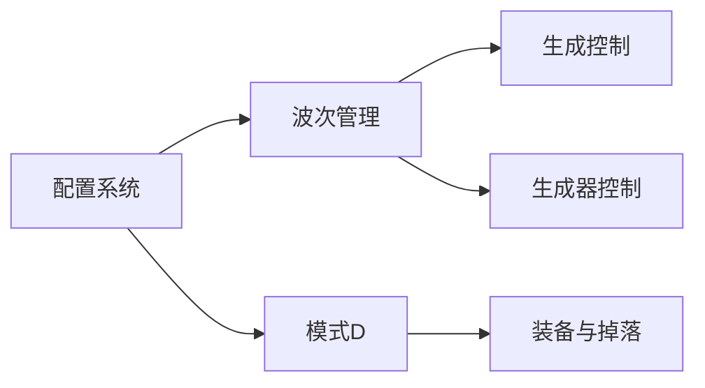

# 难度级别系统

<cite>
**本文引用的文件**
- [Config.cs](file://Config/Config.cs)
- [WavesArena.cs](file://WavesArena/WavesArena.cs)
- [WavesArenaBossSpawning.cs](file://WavesArena/WavesArenaBossSpawning.cs)
- [WavesArenaEntryAndTeleport.cs](file://WavesArena/WavesArenaEntryAndTeleport.cs)
- [ModeDWaves.cs](file://ModeD/ModeDWaves.cs)
- [ModeDEquipment.cs](file://ModeD/ModeDEquipment.cs)
- [WavesArenaSpawnerControl.cs](file://WavesArena/WavesArenaSpawnerControl.cs)
- [ModBehaviour.cs](file://ModBehaviour.cs)
</cite>

## 目录
1. [简介](#简介)
2. [项目结构](#项目结构)
3. [核心组件](#核心组件)
4. [架构总览](#架构总览)
5. [详细组件分析](#详细组件分析)
6. [依赖关系分析](#依赖关系分析)
7. [性能考量](#性能考量)
8. [故障排查指南](#故障排查指南)
9. [结论](#结论)
10. [附录](#附录)

## 简介
本文件系统化说明 BossRush 模式的三种难度体验：弹指可灭、有点意思、无间炼狱。内容覆盖波次间隔、Boss 强度调节、奖励倍率、难度切换逻辑、动态难度调整算法、配置格式与自定义方法，以及各难度的推荐玩家等级与装备要求、平衡性分析与调试工具使用。所有机制均以仓库内实现为依据，并提供代码级图示与来源定位。

## 项目结构
BossRush 的难度与波次由“配置系统 + 波次竞技场 + 模式 D（白手起家）+ 生成控制”共同构成：
- 配置系统：集中管理波次间隔、每5波额外休息、Boss全局数值倍率、无间炼狱每波Boss数、白手起家每波敌人数等关键参数。
- 波次竞技场：负责倒计时、下一波预告、多Boss同波生成、死亡推进、完成结算。
- 模式 D（白手起家）：独立波次规则、敌人配装与掉落、渐进式属性强化。
- 生成控制：安全刷怪点选择、批量生成与重试、位置校验与修复、卡关自检。

图表来源
- [Config.cs:31-81](file://Config/Config.cs#L31-L81)
- [WavesArena.cs:108-184](file://WavesArena/WavesArena.cs#L108-L184)
- [WavesArenaBossSpawning.cs:17-108](file://WavesArena/WavesArenaBossSpawning.cs#L17-L108)
- [WavesArenaEntryAndTeleport.cs:16-226](file://WavesArena/WavesArenaEntryAndTeleport.cs#L16-L226)
- [WavesArenaSpawnerControl.cs:141-251](file://WavesArena/WavesArenaSpawnerControl.cs#L141-L251)
- [ModeDWaves.cs:41-137](file://ModeD/ModeDWaves.cs#L41-L137)
- [ModeDEquipment.cs:469-623](file://ModeD/ModeDEquipment.cs#L469-L623)
- [ModBehaviour.cs:237-282](file://ModBehaviour.cs#L237-L282)

章节来源
- [Config.cs:31-81](file://Config/Config.cs#L31-L81)
- [WavesArena.cs:108-184](file://WavesArena/WavesArena.cs#L108-L184)
- [WavesArenaBossSpawning.cs:17-108](file://WavesArena/WavesArenaBossSpawning.cs#L17-L108)
- [WavesArenaEntryAndTeleport.cs:16-226](file://WavesArena/WavesArenaEntryAndTeleport.cs#L16-L226)
- [WavesArenaSpawnerControl.cs:141-251](file://WavesArena/WavesArenaSpawnerControl.cs#L141-L251)
- [ModeDWaves.cs:41-137](file://ModeD/ModeDWaves.cs#L41-L137)
- [ModeDEquipment.cs:469-623](file://ModeD/ModeDEquipment.cs#L469-L623)
- [ModBehaviour.cs:237-282](file://ModBehaviour.cs#L237-L282)

## 核心组件
- 配置系统（Config.cs）
  - 提供波次间隔、每5波额外休息、Boss全局数值倍率、无间炼狱每波Boss数、白手起家每波敌人数、Boss池筛选与权重等。
  - 支持本地 JSON 配置文件与 ModConfig 运行时热更新。
- 波次竞技场（WavesArena.cs）
  - 倒计时、下一波横幅、多Boss同波计数、死亡推进、完成结算。
  - 前20波强力Boss排除，保证新手友好。
- Boss 生成（WavesArenaBossSpawning.cs）
  - 单/多Boss生成、安全距离外刷怪点分配、异步重试、失败修正。
  - 无间炼狱按权重随机选取Boss。
- 入口与传送（WavesArenaEntryAndTeleport.cs）
  - 启动流程、预热缓存、场景加载、返回交互点创建。
- 生成器控制（WavesArenaSpawnerControl.cs）
  - 禁用场景原生刷怪、分帧销毁根节点、卡关自检与自动推进。
- 模式 D（ModeDWaves.cs / ModeDEquipment.cs）
  - 波次规则（1-5全小怪，6-10含Boss，11-15双Boss，16+全Boss）。
  - 每波3%属性递增、敌人配装与掉落品质随波次提升。

章节来源
- [Config.cs:31-81](file://Config/Config.cs#L31-L81)
- [WavesArena.cs:42-104](file://WavesArena/WavesArena.cs#L42-L104)
- [WavesArenaBossSpawning.cs:343-473](file://WavesArena/WavesArenaBossSpawning.cs#L343-L473)
- [WavesArenaEntryAndTeleport.cs:16-226](file://WavesArena/WavesArenaEntryAndTeleport.cs#L16-L226)
- [WavesArenaSpawnerControl.cs:21-81](file://WavesArena/WavesArenaSpawnerControl.cs#L21-L81)
- [ModeDWaves.cs:140-177](file://ModeD/ModeDWaves.cs#L140-L177)
- [ModeDEquipment.cs:469-623](file://ModeD/ModeDEquipment.cs#L469-L623)

## 架构总览
下图展示从进入竞技场到波次推进的完整调用链，并标注三种难度下的差异点。

图表来源
- [WavesArenaEntryAndTeleport.cs:16-226](file://WavesArena/WavesArenaEntryAndTeleport.cs#L16-L226)
- [WavesArena.cs:108-184](file://WavesArena/WavesArena.cs#L108-L184)
- [WavesArenaBossSpawning.cs:343-473](file://WavesArena/WavesArenaBossSpawning.cs#L343-L473)
- [ModeDWaves.cs:41-137](file://ModeD/ModeDWaves.cs#L41-L137)
- [Config.cs:1052-1100](file://Config/Config.cs#L1052-L1100)

## 详细组件分析

### 配置系统与难度参数
- 波次间隔时间（秒）
  - 默认值与范围：默认约15秒，范围2-60秒；可在运行时通过 ModConfig 修改并即时生效。
  - 影响：倒计时长度与节奏；在倒计时中修改会静默重算当前倒计时。
- 每5波额外休息时间（秒）
  - 默认约30秒，范围0-120秒；在第5/10/15…波完成后追加。
- Boss 全局数值倍率
  - 默认1.0，范围0.1-10.0；用于整体调高/降低Boss基础属性。
- 无间炼狱每波Boss数量
  - 默认3，范围1-10；在无间炼狱模式下优先采用该配置。
- 白手起家每波敌人数
  - 默认3，范围1-10；决定每波总敌人数（Boss+小怪）。
- Boss 池筛选与权重
  - 支持禁用Boss与为每个Boss设置无间炼狱出现权重因子（默认1.0）。
  - 权重参与随机抽取，影响不同Boss的出现概率。

章节来源
- [Config.cs:31-81](file://Config/Config.cs#L31-L81)
- [Config.cs:155-232](file://Config/Config.cs#L155-L232)
- [Config.cs:234-407](file://Config/Config.cs#L234-L407)
- [Config.cs:409-582](file://Config/Config.cs#L409-L582)
- [Config.cs:877-997](file://Config/Config.cs#L877-L997)
- [Config.cs:1052-1100](file://Config/Config.cs#L1052-L1100)

### 波次间隔与倒计时
- 倒计时计算
  - 基础间隔来自配置；若当前是第5/10/15…波且额外休息开启，则叠加额外休息时间。
  - 倒计时结束即生成下一波；若间隔<=0则立即生成。
- 下一波预告
  - 非无间炼狱显示即将出现的Boss名称；无间炼狱不显示具体Boss。
- 配置变更响应
  - 波次间隔在倒计时中修改会重新计算剩余时间；其他配置项保存并应用。

图表来源
- [WavesArena.cs:108-184](file://WavesArena/WavesArena.cs#L108-L184)
- [Config.cs:1052-1100](file://Config/Config.cs#L1052-L1100)

章节来源
- [WavesArena.cs:108-184](file://WavesArena/WavesArena.cs#L108-L184)
- [Config.cs:1052-1100](file://Config/Config.cs#L1052-L1100)

### Boss 强度调节与动态难度调整
- 全局数值倍率
  - 通过配置项统一放大/缩小Boss基础属性，适用于所有模式。
- 模式 D 渐进强化
  - 每波敌人属性提升3%（线性叠加），通过添加 MaxHealth 修饰符实现。
  - 伤害倍率归一化：将枪械/近战伤害倍率统一为1，避免高倍率Boss过强。
- 无间炼狱权重随机
  - 根据Boss基础血量与波次线性加权，再乘以用户设置的权重因子进行抽样。
  - 无有效血量范围时退化为仅按因子权重随机。

图表来源
- [WavesArena.cs:643-742](file://WavesArena/WavesArena.cs#L643-L742)
- [ModeDWaves.cs:733-781](file://ModeD/ModeDWaves.cs#L733-L781)

章节来源
- [WavesArena.cs:643-742](file://WavesArena/WavesArena.cs#L643-L742)
- [ModeDWaves.cs:733-781](file://ModeD/ModeDWaves.cs#L733-L781)

### 奖励倍率与掉落机制
- 标准/白手起家
  - 启用“Boss掉落随机化（时间加成）”时，Boss掉落受时间加成影响；关闭则回归原版掉落流。
  - 可选“战利品原版概率掉落”，以兼容旧版概率模型。
- 无间炼狱
  - 击杀Boss按最大生命值折算现金池（例如 maxHp×10），用于后续奖励发放。
- 模式 D 敌人掉落
  - 敌人携带装备，品质随波次与血量提升；Boss保留原头盔护甲。
  - 配件安装有限次数抽样，减少实例化开销。

章节来源
- [Config.cs:31-81](file://Config/Config.cs#L31-L81)
- [WavesArena.cs:348-441](file://WavesArena/WavesArena.cs#L348-L441)
- [ModeDEquipment.cs:469-623](file://ModeD/ModeDEquipment.cs#L469-L623)

### 难度切换逻辑与模式区分
- 模式标识
  - 普通模式（弹指可灭/有点意思）：按预设列表顺序或过滤后顺序推进；前20波排除强力Boss。
  - 无间炼狱：每波按权重随机选Boss，支持多Boss同波，配置项控制每波Boss数量。
  - 白手起家（模式 D）：独立波次规则与强化曲线，敌人配装与掉落自成体系。
- 切换入口
  - 通过公共入口与配置项切换模式；无间炼狱优先使用配置的每波Boss数。

图表来源
- [Config.cs:31-81](file://Config/Config.cs#L31-L81)
- [WavesArena.cs:108-184](file://WavesArena/WavesArena.cs#L108-L184)
- [WavesArenaBossSpawning.cs:343-473](file://WavesArena/WavesArenaBossSpawning.cs#L343-L473)
- [ModeDWaves.cs:41-137](file://ModeD/ModeDWaves.cs#L41-L137)
- [ModBehaviour.cs:237-282](file://ModBehaviour.cs#L237-L282)

章节来源
- [WavesArena.cs:42-104](file://WavesArena/WavesArena.cs#L42-L104)
- [WavesArenaBossSpawning.cs:343-473](file://WavesArena/WavesArenaBossSpawning.cs#L343-L473)
- [ModeDWaves.cs:41-137](file://ModeD/ModeDWaves.cs#L41-L137)
- [ModBehaviour.cs:237-282](file://ModBehaviour.cs#L237-L282)

### 游戏体验差异与建议
- 弹指可灭
  - 特点：低压力入门，前20波排除强力Boss；适合新手熟悉机制。
  - 建议：适当缩短波次间隔以提升节奏；保持默认Boss倍率。
- 有点意思
  - 特点：适度挑战，仍受前20波保护；适合有一定经验的玩家。
  - 建议：微调Boss倍率至1.2-1.5；利用每5波额外休息调整节奏。
- 无间炼狱
  - 特点：无限波次、权重随机、多Boss同波；适合追求极限与重复挑战的玩家。
  - 建议：合理设置每波Boss数（1-3起步）；为特定Boss调权以定制体验。

章节来源
- [WavesArena.cs:42-104](file://WavesArena/WavesArena.cs#L42-L104)
- [WavesArenaBossSpawning.cs:343-473](file://WavesArena/WavesArenaBossSpawning.cs#L343-L473)
- [Config.cs:877-997](file://Config/Config.cs#L877-L997)

## 依赖关系分析
- 配置系统对波次管理与模式 D 的影响
  - 波次间隔与额外休息直接影响节奏；Boss倍率影响强度；无间炼狱每波Boss数影响同屏压力。
- 波次管理与生成的耦合
  - 波次管理负责状态推进，生成控制负责落位与重试；两者通过回调与计数协同。
- 模式 D 的独立性
  - 拥有独立的波次规则、强化曲线与掉落系统，但仍受全局配置影响。

图表来源
- [Config.cs:31-81](file://Config/Config.cs#L31-L81)
- [WavesArena.cs:108-184](file://WavesArena/WavesArena.cs#L108-L184)
- [WavesArenaBossSpawning.cs:343-473](file://WavesArena/WavesArenaBossSpawning.cs#L343-L473)
- [WavesArenaSpawnerControl.cs:141-251](file://WavesArena/WavesArenaSpawnerControl.cs#L141-L251)
- [ModeDWaves.cs:41-137](file://ModeD/ModeDWaves.cs#L41-L137)
- [ModeDEquipment.cs:469-623](file://ModeD/ModeDEquipment.cs#L469-L623)

章节来源
- [Config.cs:31-81](file://Config/Config.cs#L31-L81)
- [WavesArena.cs:108-184](file://WavesArena/WavesArena.cs#L108-L184)
- [WavesArenaBossSpawning.cs:343-473](file://WavesArena/WavesArenaBossSpawning.cs#L343-L473)
- [WavesArenaSpawnerControl.cs:141-251](file://WavesArena/WavesArenaSpawnerControl.cs#L141-L251)
- [ModeDWaves.cs:41-137](file://ModeD/ModeDWaves.cs#L41-L137)
- [ModeDEquipment.cs:469-623](file://ModeD/ModeDEquipment.cs#L469-L623)

## 性能考量
- 预扫描与缓存
  - 进入竞技场前预热角色预设缓存，避免进图时全内存扫描造成卡顿。
- 分帧处理
  - 禁用场景原生刷怪后，分帧销毁根节点并保留灯光，避免帧尖刺。
- 生成优化
  - 多Boss批量生成串行执行，失败重试时分批重试；安全刷怪点复用与排序减少冲突。
- 内存与GC
  - 模式 D 配件安装有限次数抽样，避免大量实例化与销毁；列表复用减少分配。

章节来源
- [WavesArenaEntryAndTeleport.cs:35-43](file://WavesArena/WavesArenaEntryAndTeleport.cs#L35-L43)
- [WavesArenaSpawnerControl.cs:21-81](file://WavesArena/WavesArenaSpawnerControl.cs#L21-L81)
- [WavesArenaBossSpawning.cs:521-661](file://WavesArena/WavesArenaBossSpawning.cs#L521-L661)
- [ModeDEquipment.cs:409-459](file://ModeD/ModeDEquipment.cs#L409-L459)

## 故障排查指南
- 常见问题
  - Boss池为空：检查Boss筛选器是否误禁用全部Boss；打开 Ctrl+F10 面板确认。
  - 卡关无Boss存活：系统会自检并强制推进下一波，避免死锁。
  - 生成失败：自动重试最多3次；若全部失败则跳过本波并修正计数。
- 调试要点
  - 查看日志中的“SpawnNextEnemy”“OnEnemyDied”“TryFixStuckWaveIfNoBossAlive”等关键字。
  - 检查配置项是否越界或被覆盖；必要时重置本地配置文件。
  - 模式 D 下关注“ApplyModeDWaveScaling”与“NormalizeDamageMultiplier”日志，确认强化与伤害归一化生效。

章节来源
- [WavesArenaBossSpawning.cs:343-473](file://WavesArena/WavesArenaBossSpawning.cs#L343-L473)
- [WavesArenaSpawnerControl.cs:141-251](file://WavesArena/WavesArenaSpawnerControl.cs#L141-L251)
- [ModeDWaves.cs:733-781](file://ModeD/ModeDWaves.cs#L733-L781)

## 结论
BossRush 的难度系统通过配置驱动与模块化设计，实现了三种差异化体验：弹指可灭与有点意思侧重循序渐进与可控节奏，无间炼狱强调无限挑战与权重调控，白手起家则以独立波次与成长曲线为核心。借助配置热更新、权重随机、渐进强化与完善的生成/自检机制，系统在可玩性与稳定性之间取得良好平衡。

## 附录

### 配置文件格式与自定义方法
- 配置文件路径：StreamingAssets/BossRushModConfig.txt（JSON 格式，首次运行自动生成）。
- 主要键名与含义
  - waveIntervalSeconds：波次间隔（秒），范围2-60。
  - milestoneRestBonusSeconds：每5波额外休息（秒），范围0-120。
  - bossStatMultiplier：Boss全局数值倍率，范围0.1-10。
  - infiniteHellBossesPerWave：无间炼狱每波Boss数，范围1-10。
  - modeDEnemiesPerWave：白手起家每波敌人数，范围1-10。
  - disabledBosses：禁用的Boss名称列表。
  - bossInfiniteHellFactors：无间炼狱各Boss权重因子字典。
- 自定义方法
  - 直接编辑 JSON 文件；或通过 ModConfig 界面修改并实时同步到本地文件。
  - 通过 Ctrl+F10 打开 Boss 筛选器，禁用Boss或调整权重。

章节来源
- [Config.cs:155-232](file://Config/Config.cs#L155-L232)
- [Config.cs:877-997](file://Config/Config.cs#L877-L997)

### 各难度推荐玩家等级与装备要求
- 弹指可灭
  - 推荐：新手或刚接触BossRush的玩家；无需特定装备，利用开局随机装备即可。
  - 策略：前5波搜刮升级，合理利用每5波额外休息。
- 有点意思
  - 推荐：有一定战斗经验；建议具备基础生存与输出能力。
  - 策略：适度提高Boss倍率，利用Boss掉落与时间加成获取资源。
- 无间炼狱
  - 推荐：熟练玩家；建议掌握多Boss应对与走位技巧。
  - 策略：合理设置每波Boss数与权重，优先清理高威胁目标。

章节来源
- [WavesArena.cs:42-104](file://WavesArena/WavesArena.cs#L42-L104)
- [ModeDWaves.cs:140-177](file://ModeD/ModeDWaves.cs#L140-L177)
- [Config.cs:877-997](file://Config/Config.cs#L877-L997)

### 平衡性分析与调试工具
- 平衡性
  - 前20波强力Boss排除保障新手体验；模式 D 的3%线性强化确保长期挑战曲线平滑。
  - 无间炼狱权重随机避免固定序列导致的疲劳感；多Boss同波提升紧张度。
- 调试工具
  - 日志关键字：SpawnNextEnemy、OnEnemyDied、TryFixStuckWaveIfNoBossAlive、ApplyModeDWaveScaling。
  - 配置热更新：在运行时调整波次间隔与Boss倍率，观察效果并记录日志。
  - Boss 筛选器：Ctrl+F10 快速调整Boss池与权重，验证不同组合的可行性。

章节来源
- [WavesArena.cs:108-184](file://WavesArena/WavesArena.cs#L108-L184)
- [WavesArenaSpawnerControl.cs:141-251](file://WavesArena/WavesArenaSpawnerControl.cs#L141-L251)
- [ModeDWaves.cs:733-781](file://ModeD/ModeDWaves.cs#L733-L781)
- [Config.cs:877-997](file://Config/Config.cs#L877-L997)