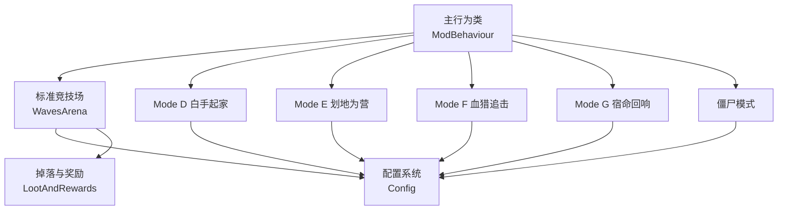
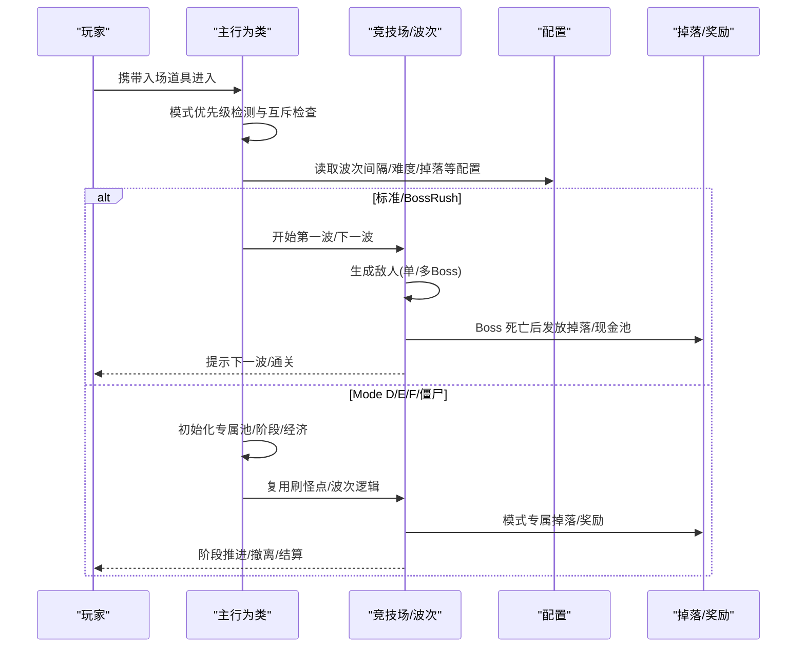
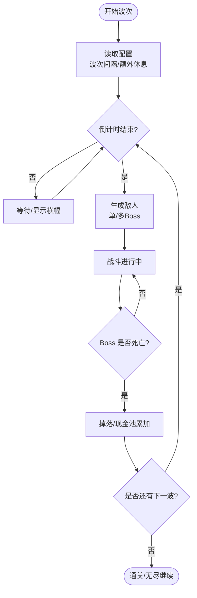
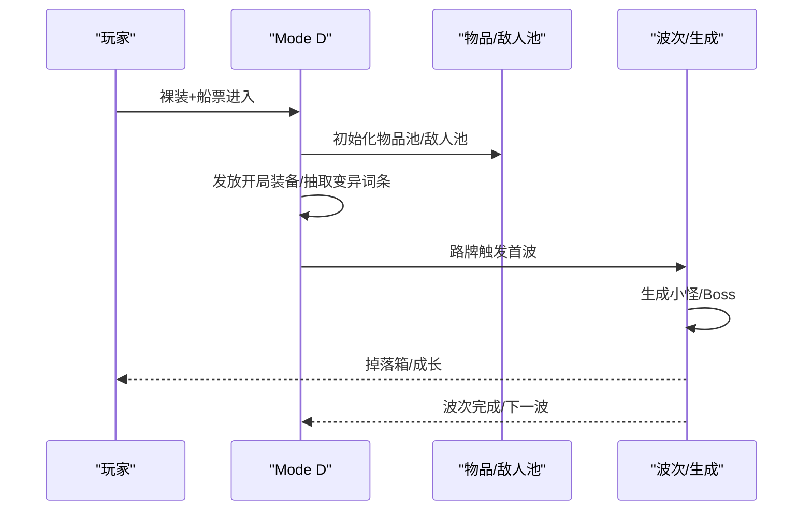
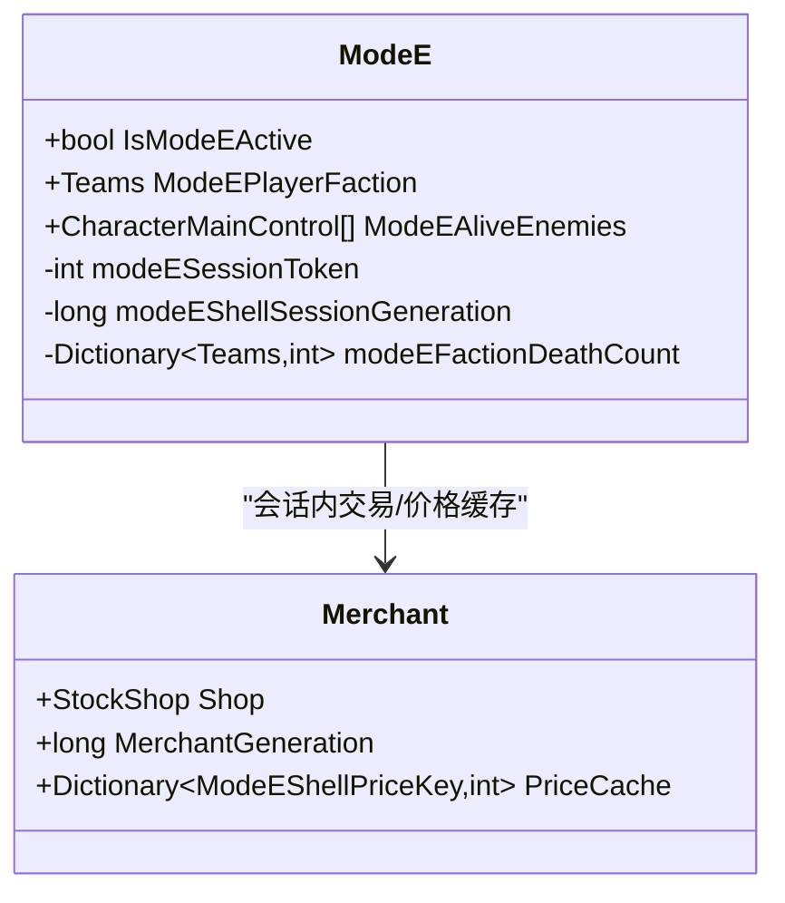
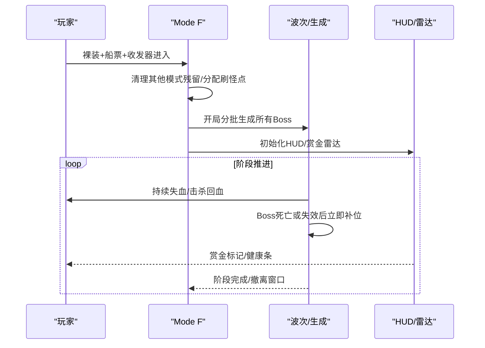
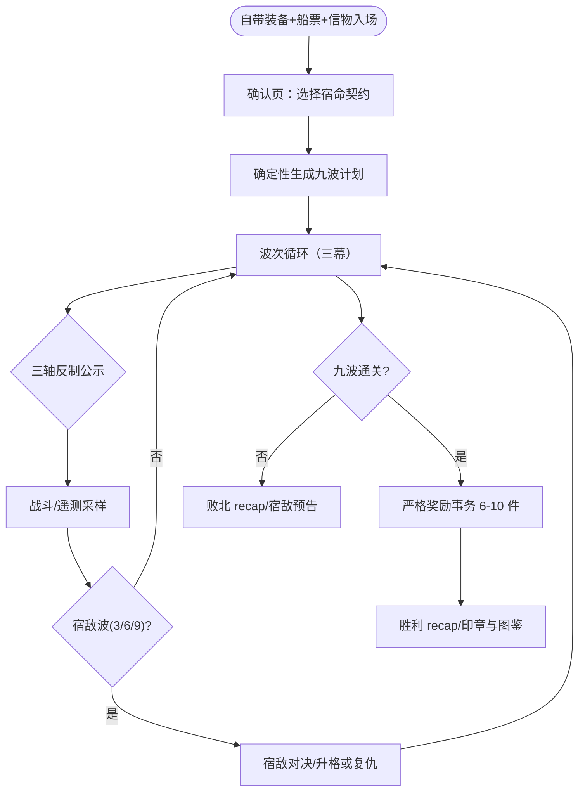
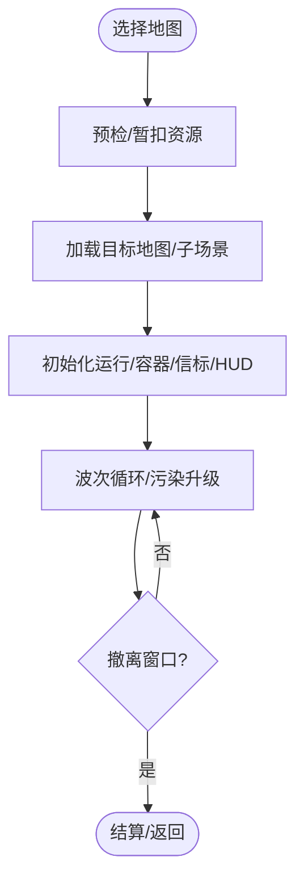
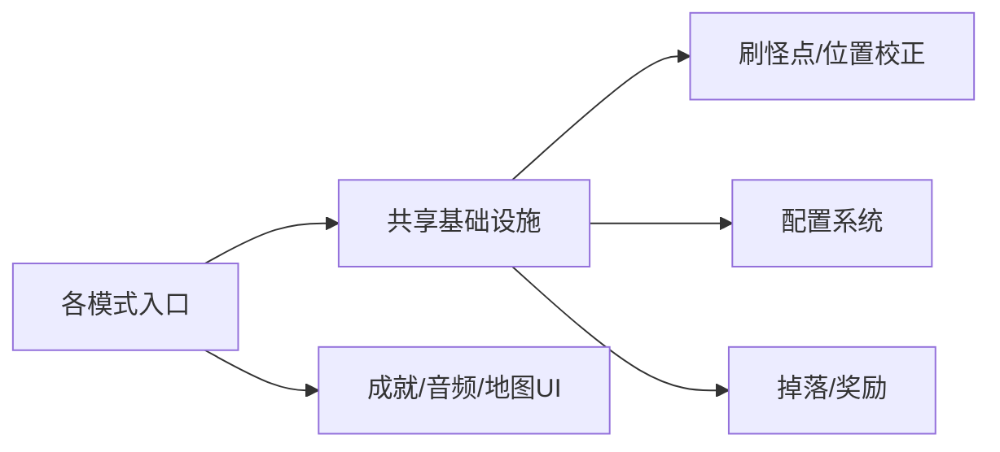

# 游戏模式系统

<cite>
**本文引用的文件**
- [README.md](file://README.md)
- [WavesArena.cs](file://WavesArena/WavesArena.cs)
- [WavesArenaBossSpawning.cs](file://WavesArena/WavesArenaBossSpawning.cs)
- [ModeD.cs](file://ModeD/ModeD.cs)
- [ModeE.cs](file://ModeE/ModeE.cs)
- [ModeFEntry.cs](file://ModeF/ModeFEntry.cs)
- [ModeGRuntimeModule.cs](file://ModeG/ModeGRuntimeModule.cs)
- [ModeGEntry.cs](file://ModeG/ModeGEntry.cs)
- [ModeGWavePlan.cs](file://ModeG/ModeGWavePlan.cs)
- [ZombieModeEntry.cs](file://ZombieMode/ZombieModeEntry.cs)
- [Config.cs](file://Config/Config.cs)
</cite>

## 目录
1. [简介](#简介)
2. [项目结构](#项目结构)
3. [核心组件](#核心组件)
4. [架构总览](#架构总览)
5. [详细组件分析](#详细组件分析)
6. [依赖关系分析](#依赖关系分析)
7. [性能与难度调节](#性能与难度调节)
8. [故障排查指南](#故障排查指南)
9. [结论](#结论)
10. [附录：模式对比与选择建议](#附录模式对比与选择建议)

## 简介
本文件系统化梳理 BossRushMod 的七大玩法模式：标准 BossRush（弹指可灭、有点意思、无间炼狱）、Mode D（白手起家）、Mode E（划地为营）、Mode F（血猎追击）、Mode G（宿命回响）以及僵尸模式。内容覆盖进入方式、核心规则、独特机制、波次管理、敌人生成、难度调节、奖励系统等关键实现，并给出可视化流程图与时序图，帮助不同技术背景的读者快速理解与上手。

## 项目结构
- 入口与全局状态由主行为类承载，各模式以独立目录组织，便于职责分离与扩展。
- 通用能力集中在 WavesArena、Common、Utilities、LootAndRewards、Config 等模块。
- 地图与刷怪点通过配置系统与运行时缓存协同工作，保证多模式复用。

图表来源
- [WavesArena.cs:1-120](file://WavesArena/WavesArena.cs#L1-L120)
- [Config.cs:1-120](file://Config/Config.cs#L1-L120)

章节来源
- [README.md:15-55](file://README.md#L15-L55)
- [WavesArena.cs:1-120](file://WavesArena/WavesArena.cs#L1-L120)
- [Config.cs:1-120](file://Config/Config.cs#L1-L120)

## 核心组件
- 波次与竞技场管理：负责波次倒计时、敌人生成、死亡判定、通关推进与无尽模式现金池。
- 模式入口与校验：按优先级检测入场道具，确保互斥与资源消耗原子性。
- 配置系统：统一加载本地文件与 ModConfig 动态配置，提供难度、节奏、掉落等可调参数。
- 掉落与奖励：Boss 击杀掉落箱、无尽模式现金池、里程碑奖励、扫箱令等。

章节来源
- [WavesArena.cs:108-207](file://WavesArena/WavesArena.cs#L108-L207)
- [WavesArenaBossSpawning.cs:18-107](file://WavesArena/WavesArenaBossSpawning.cs#L18-L107)
- [Config.cs:36-81](file://Config/Config.cs#L36-L81)
- [README.md:123-149](file://README.md#L123-L149)

## 架构总览
整体流程从“模式检测”开始，进入对应模式的初始化、波次/阶段管理、敌人生成与掉落处理，最终结算或继续下一波。

图表来源
- [WavesArena.cs:108-207](file://WavesArena/WavesArena.cs#L108-L207)
- [WavesArenaBossSpawning.cs:346-473](file://WavesArena/WavesArenaBossSpawning.cs#L346-L473)
- [Config.cs:158-232](file://Config/Config.cs#L158-L232)

## 详细组件分析

### 标准 BossRush（弹指可灭、有点意思、无间炼狱）
- 进入方式：携带 BossRush 船票进入；在路牌可选择标准或无间炼狱。
- 核心规则：
  - 弹指可灭：每波 1 个 Boss，适合新手体验。
  - 有点意思：每波 3 个 Boss，标准多目标战斗。
  - 无间炼狱：无限波次，每波 Boss 数可配置，Boss 随波次增强，无掉落箱，改为现金池自动吸附。
- 波次管理：倒计时 + 里程碑额外休息（每 5 波），支持手动交互开启下一波。
- 敌人生成：支持单/多 Boss 同波生成，带安全距离与重试机制，失败时修正计数避免卡波。
- 难度调节：全局数值倍率、每波强度递增（无尽）、Boss 权重随机（无尽）。
- 奖励系统：标准模式掉落箱；无尽模式现金池 + 里程碑奖励（每 5 波高价值物品，每 100 波皇冠+巨额现金）。

图表来源
- [WavesArena.cs:108-207](file://WavesArena/WavesArena.cs#L108-L207)
- [WavesArenaBossSpawning.cs:346-473](file://WavesArena/WavesArenaBossSpawning.cs#L346-L473)
- [Config.cs:158-232](file://Config/Config.cs#L158-L232)

章节来源
- [WavesArena.cs:108-207](file://WavesArena/WavesArena.cs#L108-L207)
- [WavesArenaBossSpawning.cs:18-107](file://WavesArena/WavesArenaBossSpawning.cs#L18-L107)
- [WavesArenaBossSpawning.cs:346-473](file://WavesArena/WavesArenaBossSpawning.cs#L346-L473)
- [Config.cs:158-232](file://Config/Config.cs#L158-L232)
- [README.md:29-39](file://README.md#L29-L39)

### Mode D：白手起家
- 进入方式：裸装 + BossRush 船票。
- 核心规则：随机开局装备，独立小怪池与 Boss 池，逐波成长，无限波次。
- 独特机制：
  - 物品池按 Tag 预建（武器/护甲/头盔/弹药/医疗/近战/图腾/面具/背包），排除商人与宠物类型。
  - 每波敌人数可配置，首波由路牌触发。
  - 变异词条开局抽取，影响敌人增益。
- 波次管理：独立波次索引与存活敌人列表，结案计数防重复开波。
- 奖励系统：击杀掉落箱，逐步获取更强装备。

图表来源
- [ModeD.cs:128-195](file://ModeD/ModeD.cs#L128-L195)
- [ModeD.cs:267-421](file://ModeD/ModeD.cs#L267-L421)
- [ModeD.cs:577-800](file://ModeD/ModeD.cs#L577-L800)

章节来源
- [ModeD.cs:128-195](file://ModeD/ModeD.cs#L128-L195)
- [ModeD.cs:267-421](file://ModeD/ModeD.cs#L267-L421)
- [ModeD.cs:577-800](file://ModeD/ModeD.cs#L577-L800)

### Mode E：划地为营
- 进入方式：裸装 + 营旗（随机/指定/爷的营旗独狼）。
- 核心规则：多阵营沙盒混战，地图刷怪点平均分配给参战阵营，一次性生成各阵营 Boss，同阵营互不伤害，跨阵营自动敌对。
- 独特机制：
  - 个人层数按“出生时死亡基线”计算，每层生命/伤害 +5%（各阵营独立累计）。
  - 会话令牌与交易门保护，防止异步对象污染。
  - 商人经济与价格缓存，支持删除互动与一键清箱。
- 波次管理：一次性生成 Boss，后续按存活与清理快照推进。
- 奖励系统：仅敌方阵营 Boss 掉落箱，配合扫箱令提升效率。

图表来源
- [ModeE.cs:65-328](file://ModeE/ModeE.cs#L65-L328)

章节来源
- [ModeE.cs:65-328](file://ModeE/ModeE.cs#L65-L328)

### Mode F：血猎追击
- 进入方式：裸装 + BossRush 船票 + 血猎收发器（无营旗）。
- 核心规则：四阶段大逃杀（准备→赏金→猎杀风暴→撤离），持续失血，击杀回血与成长，赏金标记追踪，工事系统。
- 独特机制：
  - 会话令牌与场景绑定，启动时清理其他模式残留状态。
  - 复用 Mode D 物品池与刷怪点分配，开局分批生成所有 Boss；Boss 死亡或失效后从准备阶段起持续逐只补位，单生成任务在途，不无限叠加总量。
  - 初始最大生命值快照，用于回血与 HUD 反馈。
- 波次管理：阶段状态机驱动，UI 与雷达展示赏金与血量。
- 奖励系统：阶段推进与撤离结算，结合工事修复奖励。

图表来源
- [ModeFEntry.cs:65-164](file://ModeF/ModeFEntry.cs#L65-L164)
- [ModeFEntry.cs:262-396](file://ModeF/ModeFEntry.cs#L262-L396)

章节来源
- [ModeFEntry.cs:65-164](file://ModeF/ModeFEntry.cs#L65-L164)
- [ModeFEntry.cs:262-396](file://ModeF/ModeFEntry.cs#L262-L396)

### Mode G：宿命回响
- 进入方式：携带自己的装备、BossRush 船票与宿命回响信物（TypeID 500057），且无营旗、无血猎收发器；进入方式复用 Mode F 的自动检测，但必须先打开契约二选一确认页。地图 UI 已预扣的船票在取消、确认页打开失败或启动前预检失败时会立即退回；竞技场清场只在确认与付款所有权转移后执行，所以取消既不扣物品，也不会留下空竞技场。
- 核心规则：固定九波三幕的循环对抗。每局波次计划在开局时由 runSeed 确定性生成，Active 阶段只读；第 1/4/7 波记录可信 terminal distance，第 2/5/8 波记录有界弹药威胁，第 3/6/9 波执行弹药禁令，属性轴与 Last Stand 也统一使用同一直接伤害分类器。
- 独特机制：
  - 三轴反制：距离回声、弹药点名（禁用上一学习波高威胁弹种）、属性封锁，每波横幅公示当前轴；破解反制可获得 Resolve。学习波前最后 2 秒开火会重置停火门，生成期预射会让该学习样本 fail-closed；禁令从休整期公布时立即武装。
  - HUD（规格 §15，2026-08-27 补齐）：显示本波唯一反制目标的可操作细节——距离方向、被点名弹药与违禁状态、被封锁武器系与所需相反系、双门槛进度（占比/总血贡献）、宿敌名称与 Rank、本局契约短标题；休整期预告下一波反制。进度与破解结算共用同一口径且百分比向下取整；污染/缓存溢出显示「本波挑战无效」，无新弹药候选显示「宿敌未学会新弹药」，不显示假进度。
  - Last Stand 只在多 Boss 波（第 2/5/8 波）触发，全局最多 3 次，与 Last Stand 的 Resolve 上限 3 一致。
  - 直接伤害口径：只接受玩家来源、有限正伤害、normal、非 Buff/effect、`fromWeaponItemID > 0` 且 metadata 明确为 Gun/Melee 的伤害。幽灵女巫镰刀领域使用 exact-Health telemetry suppression，不改变实际伤害与其它模式。
  - 宿敌追猎：第 3/6/9 波为宿敌波；击败你的 Boss 会升格为宿敌（R1-R3）并跨局记忆。持久宿敌临时不可用时只在本局挂起，临时替补不会覆盖原 key/Rank；复仇击败后结算面板给出宿敌预告与图鉴/印章进度。
  - 宿命契约：入场前从适应/处决/节奏/风格四族中选择契约，达成后铭刻印章并计入契约连胜。
  - 严格奖励事务：胜利从现有 Boss 战利品池的 Q5-Q8 候选中发放 6-10 件，件数由 Resolve 分档（0-2→6 件，逐档至 10-11→10 件），物品按价格分位数分带（<P75 基础带、P75-P95 高级带、>P95 不进槽）。信物先可靠返还，普通奖励再逐帧物化；背包、仓库缓冲与地面 agent 依次兜底，非胜利终局会失效 nonce 并取消后续发奖。
  - 复玩记录层：总场次、胜利数、最佳波次、宿敌图鉴里程碑均为纯荣誉展示，不参与任何数值计算。宿敌与 profile 分别 typed Save/关键字段回读，再由共享 coordinator 按存档槽每批最多一次落盘；两个 key 的未知 schema 写屏障互不连坐，切槽、保存繁忙、宿主销毁最终 flush 和故障均 fail-closed。
- 波次管理：固定节拍 1/2/1宿敌/1/3/1宿敌/1/3/1宿敌，休整普通 8 秒、第 3/6 波后 20 秒；署名槽位于第 1/4/7 波，首胜优先覆盖三个托管署名，复战优先保留 2 署名 + 1 官方 wildcard。单个署名不可用时只替换该槽；每个生成槽冻结一个同波互斥官方 reserve，官方 draw bag 允许跨波复用。
- 奖励系统：胜利结算发放分带奖励；败北不发奖励，但保留宿敌/记录进度，以复仇钩子驱动下一局。

当前发布状态：2026-08-17 owner 已批准现有过滤 Boss 池与地图选择 UI 全部有效地图，`IsProductionReady=true`；开发直入和 raw PNG fallback 仍关闭。普通官方池至少需要 1 个唯一 stable key；6 个是完整 primary/reserve 编排目标，1-5 个时从已有 key 按 runSeed 确定性复制。地图必须能从当前 UI 配置解析 exact scene pair 与非空刷新点，否则不消费入场物品并 fail-closed。

图表来源
- [ModeGWavePlan.cs:32-60](file://ModeG/ModeGWavePlan.cs#L32-L60)
- [ModeGRewardTransaction.cs:42-50](file://ModeG/ModeGRewardTransaction.cs#L42-L50)

章节来源
- [ModeGEntry.cs:1-80](file://ModeG/ModeGEntry.cs#L1-L80)
- [ModeGWavePlan.cs:32-60](file://ModeG/ModeGWavePlan.cs#L32-L60)
- [ModeGRewardTransaction.cs:42-50](file://ModeG/ModeGRewardTransaction.cs#L42-L50)
- [ModeGNemesisPersistence.cs:1-38](file://ModeG/ModeGNemesisPersistence.cs#L1-L38)
- [ModeGRecapPanel.cs:1-37](file://ModeG/ModeGRecapPanel.cs#L1-L37)
- [ModeGCombatTelemetry.cs:1-680](file://ModeG/ModeGCombatTelemetry.cs#L1-L680)
- [ModeGPersistenceFlushCoordinator.cs:1-130](file://ModeG/ModeGPersistenceFlushCoordinator.cs#L1-L130)

### 僵尸模式
- 进入方式：使用丧尸潮邀请函进入，独立于上述六种模式。
- 核心规则：Roguelite 生存，空手入场，无尽尸潮 + 污染升级 + 净化点经济，可选安全区与临时 NPC 服务。
- 独特机制：
  - 两阶段地图选择与资源暂扣（邀请函/现金），失败回滚。
  - 运行期暂停计时与场景切换保护，确保初始化稳定。
  - 信标发放、容器初始化、事件监听与 HUD 创建。
- 波次管理：波次控制器驱动，污染等级与压力值影响难度。
- 奖励系统：净化点消费换取强化选项，阶段性撤离机会。

图表来源
- [ZombieModeEntry.cs:147-177](file://ZombieMode/ZombieModeEntry.cs#L147-L177)
- [ZombieModeEntry.cs:312-424](file://ZombieMode/ZombieModeEntry.cs#L312-L424)
- [ZombieModeEntry.cs:589-635](file://ZombieMode/ZombieModeEntry.cs#L589-L635)

章节来源
- [ZombieModeEntry.cs:147-177](file://ZombieMode/ZombieModeEntry.cs#L147-L177)
- [ZombieModeEntry.cs:312-424](file://ZombieMode/ZombieModeEntry.cs#L312-L424)
- [ZombieModeEntry.cs:589-635](file://ZombieMode/ZombieModeEntry.cs#L589-L635)

## 依赖关系分析
- 模式间互斥：Mode E/F/D/G/僵尸与其他 BossRush 模式存在互斥检测（Mode G 另通过 `ModeGRuntimeGates` 提供只读门控查询），避免并发冲突。
- 共享基础设施：
  - 刷怪点与位置校正：WavesArenaBossSpawning 提供安全距离与重试。
  - 配置系统：Config 为所有模式提供统一参数源。
  - 掉落与奖励：LootAndRewards 被标准与 Mode D/E/F 复用。
- 外部集成：成就、音频、地图缩略图等通过 Common/Integration 注入。

图表来源
- [WavesArenaBossSpawning.cs:110-201](file://WavesArena/WavesArenaBossSpawning.cs#L110-L201)
- [Config.cs:158-232](file://Config/Config.cs#L158-L232)

章节来源
- [WavesArenaBossSpawning.cs:110-201](file://WavesArena/WavesArenaBossSpawning.cs#L110-L201)
- [Config.cs:158-232](file://Config/Config.cs#L158-L232)

## 性能与难度调节
- 波次节奏：可通过 waveIntervalSeconds 调整节奏；useInteractBetweenWaves 启用手动控制。
- 难度曲线：bossStatMultiplier 全局倍率；无尽模式每波 +2% 强度；Mode D 每波敌人数可调。
- 刷新策略：多 Boss 同波生成采用安全距离外最近点排序与去重，失败重试最多 3 次。
- 里程碑休息：每 5 波额外休息时间可按配置增减。

章节来源
- [Config.cs:158-232](file://Config/Config.cs#L158-L232)
- [WavesArenaBossSpawning.cs:346-473](file://WavesArena/WavesArenaBossSpawning.cs#L346-L473)
- [README.md:123-149](file://README.md#L123-L149)

## 故障排查指南
- 模式无法启动：检查入场道具与互斥条件（如 Mode F 需无营旗且裸装）。
- 波次卡住：确认 Boss 生成失败时的计数修正逻辑是否生效；查看日志中 OnBossSpawnFailed 记录。
- 掉落异常：核对配置 enableRandomBossLoot/useLegacyBossLootProbabilities；检查掉落箱掩体设置。
- 无尽模式卡顿：降低 infiniteHellBossesPerWave；关闭额外休息或调低波次间隔。

章节来源
- [WavesArena.cs:508-549](file://WavesArena/WavesArena.cs#L508-L549)
- [WavesArenaBossSpawning.cs:475-519](file://WavesArena/WavesArenaBossSpawning.cs#L475-L519)
- [Config.cs:672-704](file://Config/Config.cs#L672-L704)

## 结论
BossRushMod 通过统一的波次与配置框架，将七大模式有机整合：标准 BossRush 强调挑战与成长，Mode D 提供从零开始的赌狗体验，Mode E 打造多阵营混战的沙盒乐趣，Mode F 带来高压大逃杀的紧张节奏，Mode G 以跨局宿敌记忆与三轴反制构建“越玩越针对你”的复仇循环，僵尸模式则构建独立的 Roguelite 生存循环。各模式共享刷怪点、掉落与配置体系，既保证了稳定性，又便于扩展与调优。

## 附录：模式对比与选择建议
- 新手入门：选择弹指可灭，单 Boss 友好，熟悉机制后再进阶。
- 多目标挑战：有点意思，三 Boss 同波，考验走位与集火。
- 极限生存：无间炼狱，无限波次与现金池，适合追求高分与丰厚奖励。
- 从零起步：Mode D，随机开局与独立池，适合喜欢成长与配装的玩家。
- 混战沙盒：Mode E，多阵营对抗与个人层数缩放，适合社交与策略。
- 高压追击：Mode F，四阶段与持续失血，适合硬核与团队配合。
- 宿命复仇：Mode G，九波三幕与跨局宿敌追猎，适合喜欢针对性反制与长线记录的玩家。
- 独立生存：僵尸模式，污染与经济驱动，适合偏好 Roguelite 的玩家。

章节来源
- [README.md:29-39](file://README.md#L29-L39)
- [wiki-site/docs/en/game-modes/index.md:1-33](file://wiki-site/docs/en/game-modes/index.md#L1-L33)
