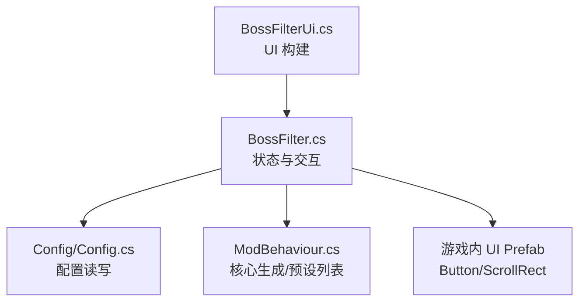
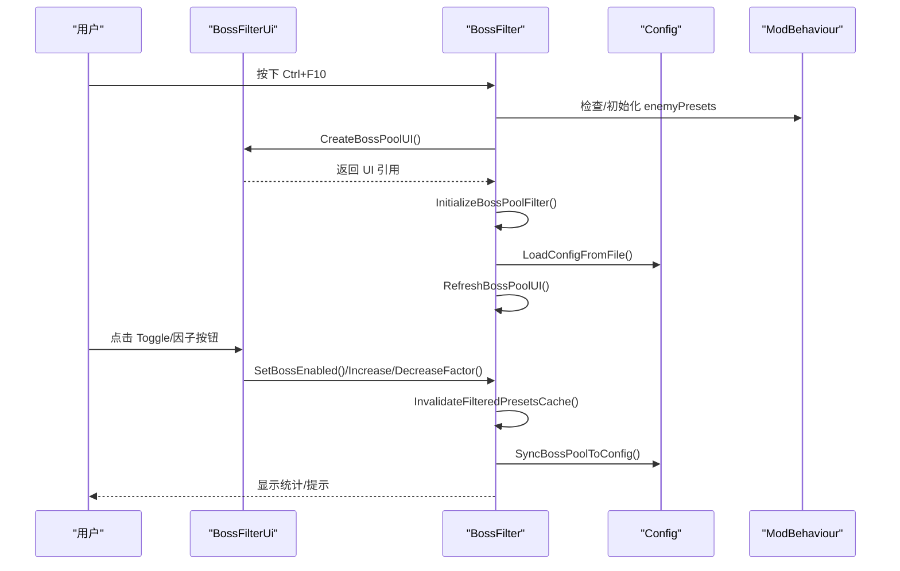
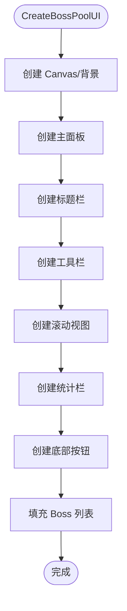
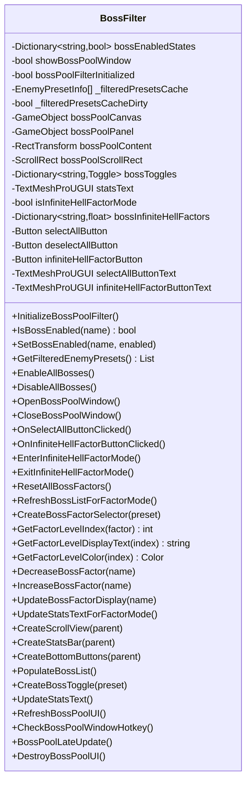
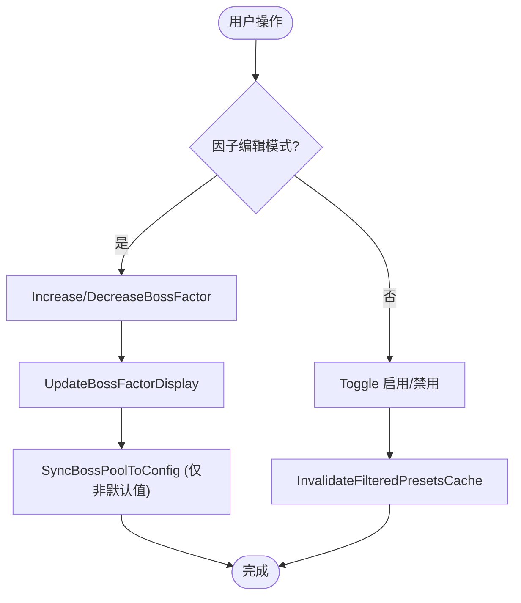
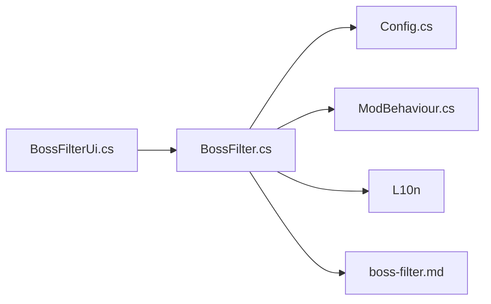

# BossFilter 界面

<cite>
**本文引用的文件**
- [BossFilter/BossFilterUi.cs](file://BossFilter/BossFilterUi.cs)
- [BossFilter/BossFilter.cs](file://BossFilter/BossFilter.cs)
- [Config/Config.cs](file://Config/Config.cs)
- [ModBehaviour.cs](file://ModBehaviour.cs)
- [wiki-site/docs/en/systems/boss-filter.md](file://wiki-site/docs/en/systems/boss-filter.md)
</cite>

## 目录
1. [简介](#简介)
2. [项目结构](#项目结构)
3. [核心组件](#核心组件)
4. [架构总览](#架构总览)
5. [详细组件分析](#详细组件分析)
6. [依赖关系分析](#依赖关系分析)
7. [性能考量](#性能考量)
8. [故障排查指南](#故障排查指南)
9. [结论](#结论)
10. [附录：配置与自定义方法](#附录：配置与自定义方法)

## 简介
本文件面向 BossRush 模组的 BossFilter 界面，系统性说明 BossFilterUi 类的实现与 BossFilter 核心逻辑的集成方式。内容涵盖：
- Boss 池筛选界面的创建与管理（Canvas、面板、工具栏、滚动列表、统计栏、底部按钮）
- 权重调整机制（无间炼狱因子等级与颜色编码）
- 实时预览与数据绑定（Toggle 切换即时生效、缓存失效与刷新）
- 配置保存与加载（禁用 Boss 列表与每个 Boss 的无间炼狱因子）
- 与核心生成逻辑的集成点（过滤后的 Boss 列表、权重读取）
- 自定义 Boss 类型与权重的配置方法（通过配置文件或 ModConfig UI）

## 项目结构
BossFilter 界面由两个主要文件组成：
- BossFilter/BossFilterUi.cs：负责 UI 构建（标题栏、工具栏、滚动视图、统计栏、底部按钮等）
- BossFilter/BossFilter.cs：负责状态管理、UI 交互、权重编辑、配置持久化以及与核心生成逻辑的对接

图表来源
- [BossFilter/BossFilterUi.cs:14-183](file://BossFilter/BossFilterUi.cs#L14-L183)
- [BossFilter/BossFilter.cs:89-158](file://BossFilter/BossFilter.cs#L89-L158)
- [Config/Config.cs:158-232](file://Config/Config.cs#L158-L232)
- [ModBehaviour.cs:252-282](file://ModBehaviour.cs#L252-L282)

章节来源
- [BossFilter/BossFilterUi.cs:14-183](file://BossFilter/BossFilterUi.cs#L14-L183)
- [BossFilter/BossFilter.cs:89-158](file://BossFilter/BossFilter.cs#L89-L158)
- [Config/Config.cs:158-232](file://Config/Config.cs#L158-L232)

## 核心组件
- BossFilterUi：负责创建 Boss 池 UI，包括 Canvas、背景、主面板、标题栏、工具栏（全选/全不选/无间炼狱因子）、滚动列表、统计信息、底部按钮（保存并关闭）。
- BossFilter：维护 Boss 启用状态字典、无间炼狱因子字典、UI 引用、模式切换（普通/因子编辑），提供初始化、打开/关闭窗口、全选/全不选、保存配置、刷新 UI、快捷键检测等功能。
- Config：提供 BossRush 配置数据结构与本地文件读写（JSON），包含 disabledBosses 与 bossInfiniteHellFactors。
- ModBehaviour：承载全局上下文，持有 enemyPresets、config 等，BossFilter 与其紧密协作以获取 Boss 预设列表和进行生成流程控制。

章节来源
- [BossFilter/BossFilterUi.cs:14-183](file://BossFilter/BossFilterUi.cs#L14-L183)
- [BossFilter/BossFilter.cs:29-83](file://BossFilter/BossFilter.cs#L29-L83)
- [Config/Config.cs:38-81](file://Config/Config.cs#L38-L81)
- [ModBehaviour.cs:252-282](file://ModBehaviour.cs#L252-L282)

## 架构总览
BossFilter 界面采用“UI 构建 + 状态管理 + 配置持久化”的分层设计：
- UI 层（BossFilterUi）：使用官方 UI Prefab 动态创建 Canvas、Panel、ScrollRect、Button 等元素，布局清晰，层级合理。
- 状态层（BossFilter）：维护启用状态与因子字典，处理用户交互，驱动 UI 刷新与配置同步。
- 配置层（Config）：将禁用列表与因子映射持久化为 JSON，支持首次运行自动生成与后续更新覆盖。
- 核心集成（ModBehaviour）：BossFilter 通过 ModBehaviour 提供的 enemyPresets 与 GetFilteredEnemyPresets 等方法参与生成流程。

图表来源
- [BossFilter/BossFilter.cs:355-408](file://BossFilter/BossFilter.cs#L355-L408)
- [BossFilter/BossFilter.cs:89-158](file://BossFilter/BossFilter.cs#L89-L158)
- [BossFilter/BossFilter.cs:923-958](file://BossFilter/BossFilter.cs#L923-L958)
- [Config/Config.cs:158-232](file://Config/Config.cs#L158-L232)

## 详细组件分析

### BossFilterUi 类：界面创建与管理
- 创建 Canvas：设置渲染模式为屏幕空间叠加，排序层级降低以避免遮挡鼠标；添加 CanvasScaler 与 GraphicRaycaster，确保 UI 可交互。
- 背景与主面板：半透明黑色背景，居中面板尺寸加大以提升可读性。
- 标题栏：标题文本居中，右上角关闭按钮使用官方 Button prefab，点击调用 CloseBossPoolWindow。
- 工具栏：水平布局，包含全选、全不选、分隔空间、无间炼狱因子按钮；按钮宽度与高度统一，文本使用本地化键。
- 滚动视图：优先使用官方 ScrollRect prefab；若不可用则回退手动创建 Viewport 与 Content，并配置垂直滚动、惯性、拖拽等参数。
- 统计栏：显示已启用数量与总数，当全部禁用时给出警告提示。
- 底部按钮：保存并关闭，点击后执行配置同步并关闭窗口。

图表来源
- [BossFilter/BossFilterUi.cs:14-183](file://BossFilter/BossFilterUi.cs#L14-L183)
- [BossFilter/BossFilter.cs:776-890](file://BossFilter/BossFilter.cs#L776-L890)
- [BossFilter/BossFilter.cs:892-958](file://BossFilter/BossFilter.cs#L892-L958)

章节来源
- [BossFilter/BossFilterUi.cs:14-183](file://BossFilter/BossFilterUi.cs#L14-L183)
- [BossFilter/BossFilter.cs:776-890](file://BossFilter/BossFilter.cs#L776-L890)
- [BossFilter/BossFilter.cs:892-958](file://BossFilter/BossFilter.cs#L892-L958)

### BossFilter 核心逻辑：状态管理与交互
- 初始化：从 enemyPresets 构建启用状态字典，默认全部启用；从配置加载禁用列表与无间炼狱因子；为未配置的 Boss 设置默认因子 1.0。
- 启用状态管理：IsBossEnabled/SetBossEnabled 提供查询与设置；GetFilteredEnemyPresets 返回过滤后的 Boss 列表，使用缓存并在状态变化时标记脏位。
- 全选/全不选：批量修改启用状态，触发缓存失效与 UI 刷新。
- 配置同步：SyncBossPoolToConfig 将禁用列表与因子映射写入配置，仅保存非默认值（因子不为 1.0）的条目，随后保存到本地文件。
- 无间炼狱因子编辑：Enter/ExitInfiniteHellFactorMode 切换模式，RefreshBossListForFactorMode 重建列表为因子选择器；Decrease/IncreaseBossFactor 调整因子等级；UpdateBossFactorDisplay 实时更新显示文本与颜色。
- 窗口控制：Open/CloseBossPoolWindow 管理窗口生命周期，禁用/恢复输入，重置滚动位置；CheckBossPoolWindowHotkey 监听 Ctrl+F10；BossPoolLateUpdate 在窗口打开时暂停时间并显示光标。

图表来源
- [BossFilter/BossFilter.cs:29-83](file://BossFilter/BossFilter.cs#L29-L83)
- [BossFilter/BossFilter.cs:89-158](file://BossFilter/BossFilter.cs#L89-L158)
- [BossFilter/BossFilter.cs:164-232](file://BossFilter/BossFilter.cs#L164-L232)
- [BossFilter/BossFilter.cs:355-511](file://BossFilter/BossFilter.cs#L355-L511)
- [BossFilter/BossFilter.cs:529-773](file://BossFilter/BossFilter.cs#L529-L773)
- [BossFilter/BossFilter.cs:776-1174](file://BossFilter/BossFilter.cs#L776-L1174)

章节来源
- [BossFilter/BossFilter.cs:89-158](file://BossFilter/BossFilter.cs#L89-L158)
- [BossFilter/BossFilter.cs:164-232](file://BossFilter/BossFilter.cs#L164-L232)
- [BossFilter/BossFilter.cs:355-511](file://BossFilter/BossFilter.cs#L355-L511)
- [BossFilter/BossFilter.cs:529-773](file://BossFilter/BossFilter.cs#L529-L773)
- [BossFilter/BossFilter.cs:776-1174](file://BossFilter/BossFilter.cs#L776-L1174)

### 权重调整机制与颜色编码系统
- 因子等级定义：极低(0.2)、低(0.5)、中(1.0)、高(1.5)、极高(2.0)。
- 颜色编码：极低灰色、低绿色、中白色、高橙色、极高红色，便于直观识别难度梯度。
- 交互方式：左右箭头按钮增减因子等级，文本与颜色实时更新；重置按钮将所有因子恢复为默认值。
- 持久化：仅保存非默认值（不等于 1.0）的因子映射，减少配置体积。

图表来源
- [BossFilter/BossFilter.cs:664-704](file://BossFilter/BossFilter.cs#L664-L704)
- [BossFilter/BossFilter.cs:709-762](file://BossFilter/BossFilter.cs#L709-L762)
- [BossFilter/BossFilter.cs:275-327](file://BossFilter/BossFilter.cs#L275-L327)

章节来源
- [BossFilter/BossFilter.cs:664-704](file://BossFilter/BossFilter.cs#L664-L704)
- [BossFilter/BossFilter.cs:709-762](file://BossFilter/BossFilter.cs#L709-L762)
- [BossFilter/BossFilter.cs:275-327](file://BossFilter/BossFilter.cs#L275-L327)

### 实时预览与数据绑定
- Toggle 绑定：每个 Boss 对应一个 Toggle，onValueChanged 回调立即调用 SetBossEnabled，并更新统计文本。
- 缓存失效：SetBossEnabled 调用 InvalidateFilteredPresetsCache，使下一次 GetFilteredEnemyPresets 重新计算过滤结果。
- 统计栏：实时显示已启用数量与总数，当全部禁用时给出警告提示，防止无 Boss 可用的情况。
- 因子模式：进入因子编辑模式后，列表切换为因子选择器，统计栏清空以避免误导。

章节来源
- [BossFilter/BossFilter.cs:1003-1073](file://BossFilter/BossFilter.cs#L1003-L1073)
- [BossFilter/BossFilter.cs:1078-1093](file://BossFilter/BossFilter.cs#L1078-L1093)
- [BossFilter/BossFilter.cs:767-773](file://BossFilter/BossFilter.cs#L767-L773)

### 配置保存与加载
- 数据结构：BossRushConfig 包含 disabledBosses（禁用 Boss 名称列表）与 bossInfiniteHellFactors（Boss 名称到因子的映射）。
- 加载：LoadConfigFromFile 从 StreamingAssets/BossRushModConfig.txt 读取 JSON，若不存在则自动生成；同时支持从 ModConfig 模组加载（反射调用 OptionsManager_Mod.Load）。
- 保存：SaveConfigToFile 将当前配置序列化为 JSON 并写入文件；SyncBossPoolToConfig 在保存前合并禁用列表与因子映射。
- 运行时更新：OnModConfigOptionsChanged 监听 ModConfig 变更，应用后立即保存并触发相应行为（如波次间隔重算）。

章节来源
- [Config/Config.cs:38-81](file://Config/Config.cs#L38-L81)
- [Config/Config.cs:158-232](file://Config/Config.cs#L158-L232)
- [Config/Config.cs:235-407](file://Config/Config.cs#L235-L407)
- [Config/Config.cs:588-704](file://Config/Config.cs#L588-L704)
- [BossFilter/BossFilter.cs:275-327](file://BossFilter/BossFilter.cs#L275-L327)

### 与 BossFilter 核心逻辑的集成方式
- 过滤列表：GetFilteredEnemyPresets 基于 enemyPresets 与 bossEnabledStates 生成可用 Boss 列表，供生成流程使用。
- 权重读取：GetBossInfiniteHellFactor 提供单个 Boss 的无间炼狱因子，用于调整出现概率。
- 模式影响：禁用 Boss 不仅影响标准 BossRush，还影响白手起家、阵营战争、猎杀等模式的 Boss 池；无间炼狱仍支持每 Boss 权重倍率。
- 预设清理：运行时临时生成的非 Boss 预设会被自动排除，避免污染筛选列表；特殊 Boss（如龙裔、龙王）保留。

章节来源
- [BossFilter/BossFilter.cs:197-232](file://BossFilter/BossFilter.cs#L197-L232)
- [BossFilter/BossFilter.cs:329-346](file://BossFilter/BossFilter.cs#L329-L346)
- [wiki-site/docs/en/systems/boss-filter.md:1-34](file://wiki-site/docs/en/systems/boss-filter.md#L1-L34)

### 自定义 Boss 类型与权重的配置方法
- 配置文件：首次运行生成 BossRushModConfig.txt，可直接编辑 disabledBosses 与 bossInfiniteHellFactors。
- 游戏内设置：若安装 ModConfig 模组，可在游戏内设置界面修改相关选项，支持滑块与开关，更改后即时生效并写回本地文件。
- 权重范围：因子等级为固定档位（0.2/0.5/1.0/1.5/2.0），可通过界面按钮调整；0 等价于禁用。
- 注意事项：仅保存非默认值（不等于 1.0）的因子映射，避免冗余配置。

章节来源
- [Config/Config.cs:158-232](file://Config/Config.cs#L158-L232)
- [Config/Config.cs:235-407](file://Config/Config.cs#L235-L407)
- [wiki-site/docs/en/systems/boss-filter.md:20-33](file://wiki-site/docs/en/systems/boss-filter.md#L20-L33)

## 依赖关系分析
- UI 依赖：BossFilterUi 依赖 Unity UI 组件（Image、TextMeshProUGUI、Button、ScrollRect、LayoutGroup）与官方 GameplayDataSettings.UIPrefabs。
- 状态依赖：BossFilter 依赖 ModBehaviour 提供的 enemyPresets 与 config，以及 L10n 本地化工具。
- 配置依赖：Config 依赖 JsonUtility 进行序列化/反序列化，路径基于 Application.streamingAssetsPath。
- 外部集成：BossFilter 与 Wiki 文档保持一致的行为描述，确保用户预期一致。

图表来源
- [BossFilter/BossFilterUi.cs:14-183](file://BossFilter/BossFilterUi.cs#L14-L183)
- [BossFilter/BossFilter.cs:89-158](file://BossFilter/BossFilter.cs#L89-L158)
- [Config/Config.cs:158-232](file://Config/Config.cs#L158-L232)
- [wiki-site/docs/en/systems/boss-filter.md:1-34](file://wiki-site/docs/en/systems/boss-filter.md#L1-L34)

章节来源
- [BossFilter/BossFilterUi.cs:14-183](file://BossFilter/BossFilterUi.cs#L14-L183)
- [BossFilter/BossFilter.cs:89-158](file://BossFilter/BossFilter.cs#L89-L158)
- [Config/Config.cs:158-232](file://Config/Config.cs#L158-L232)

## 性能考量
- 过滤缓存：GetFilteredEnemyPresets 使用 _filteredPresetsCache 与 _filteredPresetsCacheDirty 标志，仅在状态变化时重新计算，避免每帧遍历。
- UI 刷新：仅在必要时机（Toggle 变更、全选/全不选、因子调整）刷新 UI，减少不必要的对象销毁与重建。
- 滚动优化：ScrollRect 设置 movementType=Clamped、inertia=true、decelerationRate=0.135f，提升滚动体验并降低卡顿。
- 内存管理：DestroyBossPoolUI 清理所有 UI 引用与子对象，防止内存泄漏。

章节来源
- [BossFilter/BossFilter.cs:197-232](file://BossFilter/BossFilter.cs#L197-L232)
- [BossFilter/BossFilter.cs:776-890](file://BossFilter/BossFilter.cs#L776-L890)
- [BossFilter/BossFilter.cs:1147-1169](file://BossFilter/BossFilter.cs#L1147-L1169)

## 故障排查指南
- 窗口无法打开：检查 enemyPresets 是否为空，若为空则先初始化；确认 InputManager.DisableInput 正确调用。
- Toggle 无效：确认 onValueChanged 回调已绑定，SetBossEnabled 是否被调用；检查 bossEnabledStates 字典是否包含该 Boss。
- 配置未保存：确认 SyncBossPoolToConfig 是否被调用；检查文件路径是否存在且可写；查看日志中的错误信息。
- 因子颜色异常：确认 GetFactorLevelIndex 与 GetFactorLevelColor 逻辑是否正确；检查因子值是否在预定义范围内。
- 统计栏警告：当全部 Boss 禁用时会显示警告，需至少启用一个 Boss 才能正常游戏。

章节来源
- [BossFilter/BossFilter.cs:355-408](file://BossFilter/BossFilter.cs#L355-L408)
- [BossFilter/BossFilter.cs:1067-1073](file://BossFilter/BossFilter.cs#L1067-L1073)
- [BossFilter/BossFilter.cs:275-327](file://BossFilter/BossFilter.cs#L275-L327)
- [BossFilter/BossFilter.cs:664-704](file://BossFilter/BossFilter.cs#L664-L704)
- [BossFilter/BossFilter.cs:1078-1093](file://BossFilter/BossFilter.cs#L1078-L1093)

## 结论
BossFilter 界面通过清晰的 UI 分层与稳健的状态管理，提供了直观的 Boss 池筛选与权重调整能力。其核心优势包括：
- 使用官方 UI Prefab，保证兼容性与一致性
- 实时预览与数据绑定，提升用户体验
- 灵活的权重调整机制与颜色编码，便于快速识别难度
- 完善的配置持久化，支持本地文件与 ModConfig UI
- 与核心生成逻辑深度集成，确保筛选与权重生效

建议在实际使用中：
- 定期备份 BossRushModConfig.txt，避免配置丢失
- 合理使用禁用与权重调整，平衡挑战性与效率
- 关注统计栏警告，确保至少启用一个 Boss

## 附录：配置与自定义方法
- 配置文件路径：StreamingAssets/BossRushModConfig.txt（JSON 格式）
- 关键配置项：
  - disabledBosses：禁用 Boss 名称列表
  - bossInfiniteHellFactors：Boss 名称到因子的映射（仅保存非默认值）
- 自定义步骤：
  1. 打开 Boss 池界面（Ctrl+F10）
  2. 在普通模式下禁用不需要的 Boss
  3. 进入因子编辑模式，调整各 Boss 的无间炼狱因子
  4. 点击“保存并关闭”，配置自动写入文件
- 高级用法：直接编辑配置文件或使用 ModConfig UI 滑块调整其他参数（如波次间隔、掉落随机化等）

章节来源
- [Config/Config.cs:158-232](file://Config/Config.cs#L158-L232)
- [wiki-site/docs/en/getting-started/installation.md:22-24](file://wiki-site/docs/en/getting-started/installation.md#L22-L24)
- [README.md:123-128](file://README.md#L123-L128)