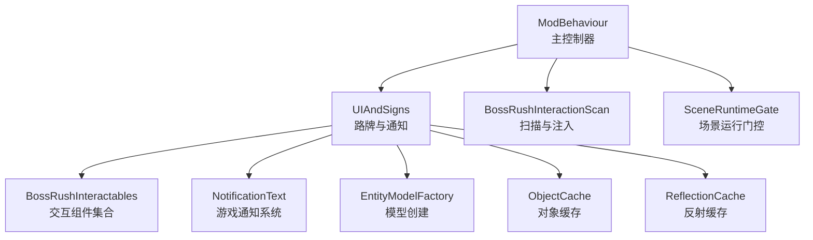
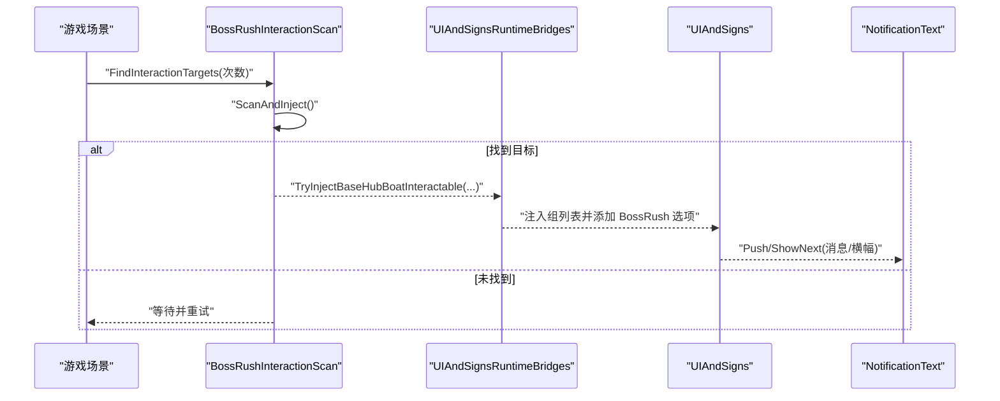
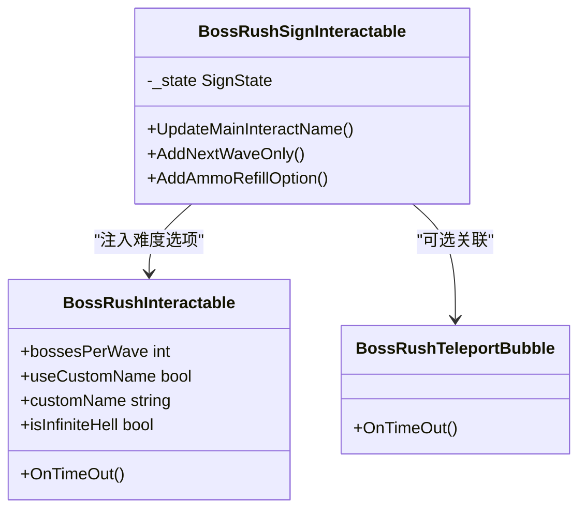
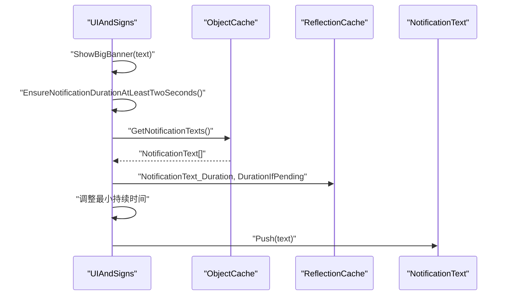
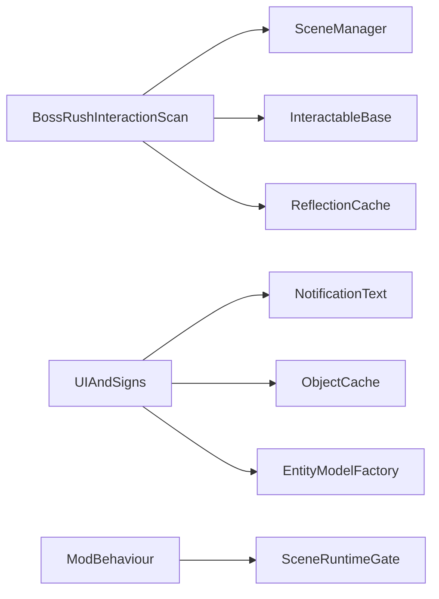

# UI 系统集成

<cite>
**本文引用的文件**
- [BossRushInteractionScan.cs](file://UIAndSigns/BossRushInteractionScan.cs)
- [UIAndSigns.cs](file://UIAndSigns/UIAndSigns.cs)
- [UIAndSignsRuntimeBridges.cs](file://UIAndSigns/UIAndSignsRuntimeBridges.cs)
- [BossRushInteractables.cs](file://Interactables/BossRushInteractables.cs)
- [ModBehaviour.cs](file://ModBehaviour.cs)
- [ObjectCache.cs](file://Common/Infrastructure/ObjectCache.cs)
- [ReflectionCache.cs](file://Common/Infrastructure/BossRushEagerReflectionCache.cs)
</cite>

## 目录
1. [简介](#简介)
2. [项目结构](#项目结构)
3. [核心组件](#核心组件)
4. [架构总览](#架构总览)
5. [详细组件分析](#详细组件分析)
6. [依赖关系分析](#依赖关系分析)
7. [性能与内存优化](#性能与内存优化)
8. [故障排查指南](#故障排查指南)
9. [结论](#结论)
10. [附录：自定义 UI 元素开发指南](#附录自定义-ui-元素开发指南)

## 简介
本模块为 BossRush 模组的 UI 系统集成层，负责在游戏内动态创建与管理路牌、横幅、提示框等 UI 元素，并通过扫描机制自动发现并激活可交互对象。同时提供运行时桥接以处理场景切换与 UI 生命周期管理，确保在不同场景中稳定显示与交互。文档涵盖扫描机制、运行时桥接、性能优化、内存管理与跨平台兼容性要点，并提供扩展自定义 UI 元素的实践指南。

## 项目结构
UI 系统由以下关键部分组成：
- 扫描与注入：在基地入口附近自动查找并注入 BossRush 交互点
- 路牌与交互：创建路牌模型、垃圾桶、传送气泡等可交互对象
- UI 通知：通过游戏通知系统显示消息与大横幅
- 运行时桥接：封装 UI 创建与扫描的调用入口，配合主循环调度
- 缓存与反射：对高频 UI 对象与反射结果进行缓存，降低开销

图表来源
- [ModBehaviour.cs:380-440](file://ModBehaviour.cs#L380-L440)
- [UIAndSigns.cs:42-120](file://UIAndSigns/UIAndSigns.cs#L42-L120)
- [BossRushInteractionScan.cs:16-100](file://UIAndSigns/BossRushInteractionScan.cs#L16-L100)
- [BossRushInteractables.cs:41-238](file://Interactables/BossRushInteractables.cs#L41-L238)
- [ObjectCache.cs:17-172](file://Common/Infrastructure/ObjectCache.cs#L17-L172)
- [ReflectionCache.cs:15-87](file://Common/Infrastructure/BossRushEagerReflectionCache.cs#L15-L87)

章节来源
- [ModBehaviour.cs:380-440](file://ModBehaviour.cs#L380-L440)
- [UIAndSigns.cs:42-120](file://UIAndSigns/UIAndSigns.cs#L42-L120)
- [BossRushInteractionScan.cs:16-100](file://UIAndSigns/BossRushInteractionScan.cs#L16-L100)

## 核心组件
- BossRushInteractionScan：负责在特定场景（基地入口）中扫描 InteractableBase 并注入 BossRush 选项，支持多次重试并在成功时立即停止
- UIAndSigns：负责创建路牌、垃圾桶、传送气泡；显示消息与大横幅；根据波次与模式生成敌人方位或包围提示
- BossRushInteractables：定义各类交互组件（难度选择、下一波、弹药补给、传送气泡、清理箱子等），实现交互状态机与本地化名称
- ModBehaviour：统一入口，暴露 ShowMessage、ShowBigBanner、StartBossRushFromInteraction 等方法，协调 UI 与扫描流程
- ObjectCache / ReflectionCache：缓存 UI 对象与反射结果，避免重复 FindObjectsOfType 与反射调用，提升性能

章节来源
- [BossRushInteractionScan.cs:16-100](file://UIAndSigns/BossRushInteractionScan.cs#L16-L100)
- [UIAndSigns.cs:285-466](file://UIAndSigns/UIAndSigns.cs#L285-L466)
- [BossRushInteractables.cs:41-238](file://Interactables/BossRushInteractables.cs#L41-L238)
- [ModBehaviour.cs:1521-1557](file://ModBehaviour.cs#L1521-L1557)
- [ObjectCache.cs:17-172](file://Common/Infrastructure/ObjectCache.cs#L17-L172)
- [ReflectionCache.cs:15-87](file://Common/Infrastructure/BossRushEagerReflectionCache.cs#L15-L87)

## 架构总览
BossRush 的 UI 集成采用“扫描 + 注入 + 运行时桥接”的分层设计：
- 扫描层：在合适的场景（基地入口）中按规则筛选目标 InteractableBase，计算距离与路径，尝试注入 BossRush 选项
- 注入层：将 BossRush 交互项加入 InteractableBase 的 group 列表，设置交互标记与可见性
- 展示层：通过 NotificationText 推送消息与大横幅，使用本地化键与去重策略减少冗余
- 桥接层：对外暴露统一方法，内部委托到具体实现，便于在主循环或事件回调中调用

图表来源
- [BossRushInteractionScan.cs:16-100](file://UIAndSigns/BossRushInteractionScan.cs#L16-L100)
- [UIAndSignsRuntimeBridges.cs:8-26](file://UIAndSigns/UIAndSignsRuntimeBridges.cs#L8-L26)
- [UIAndSigns.cs:747-800](file://UIAndSigns/UIAndSigns.cs#L747-L800)
- [UIAndSigns.cs:432-466](file://UIAndSigns/UIAndSigns.cs#L432-L466)

## 详细组件分析

### 扫描机制：BossRushInteractionScan
- 扫描流程：
  - 获取当前活动场景名，判断是否为基础枢纽场景或竞技场场景
  - 遍历所有 InteractableBase，过滤掉已注入的 BossRushInteractable
  - 基于 GameObject 路径与名称匹配“Boat”与主交互点，计算距离选取最近候选
  - 调用注入方法成功后立即停止扫描，避免重复工作
- 错误处理：捕获异常并记录日志，保证扫描鲁棒性
- 反射访问：通过 ReflectionCache 获取 InteractableBase 的私有 group 列表

图表来源
- [BossRushInteractionScan.cs:16-100](file://UIAndSigns/BossRushInteractionScan.cs#L16-L100)
- [BossRushInteractionScan.cs:105-141](file://UIAndSigns/BossRushInteractionScan.cs#L105-L141)

章节来源
- [BossRushInteractionScan.cs:16-100](file://UIAndSigns/BossRushInteractionScan.cs#L16-L100)
- [BossRushInteractionScan.cs:105-141](file://UIAndSigns/BossRushInteractionScan.cs#L105-L141)

### 路牌与交互：UIAndSigns 与 BossRushInteractables
- 路牌创建：
  - 使用 EntityModelFactory 创建路牌模型，移除刚体并将 Collider 设为 Trigger，确保玩家可穿过
  - 添加 BoxCollider 作为触发器，挂载 BossRushSignInteractable 作为主交互
  - 在路牌旁边创建垃圾桶，位置根据地图类型调整（右侧或前方）
- 交互状态机：
  - BossRushSignInteractable 维护 EntryAndDifficulty、Cheer、NextWave、Victory 四种状态
  - 根据状态更新主交互名称与可用选项（难度、下一波、弹药补给）
  - 难度选项通过 BossRushInteractable 注入，支持自定义名称与本地化键
- 传送气泡：
  - 在救援点创建 BossRushTeleportBubble，点击后移动玩家至默认位置并保持相机偏移
  - 使用后销毁自身，避免残留

图表来源
- [BossRushInteractables.cs:585-737](file://Interactables/BossRushInteractables.cs#L585-L737)
- [BossRushInteractables.cs:403-506](file://Interactables/BossRushInteractables.cs#L403-L506)
- [UIAndSigns.cs:122-200](file://UIAndSigns/UIAndSigns.cs#L122-L200)
- [UIAndSigns.cs:235-283](file://UIAndSigns/UIAndSigns.cs#L235-L283)

章节来源
- [UIAndSigns.cs:122-200](file://UIAndSigns/UIAndSigns.cs#L122-L200)
- [UIAndSigns.cs:235-283](file://UIAndSigns/UIAndSigns.cs#L235-L283)
- [BossRushInteractables.cs:585-737](file://Interactables/BossRushInteractables.cs#L585-L737)
- [BossRushInteractables.cs:403-506](file://Interactables/BossRushInteractables.cs#L403-L506)

### 通知与横幅：UIAndSigns
- 消息提示：
  - UpdateMessage_UIAndSigns 维护计时器，调用 NotificationText.ShowNext 显示短消息
- 大横幅：
  - ShowBigBanner_UIAndSigns 使用 NotificationText.Push 推送横幅
  - 包含动态内容（颜色标签、数字）时不进行去重，静态文本在窗口期内去重
  - EnsureNotificationDurationAtLeastTwoSeconds 通过反射调整 NotificationText 的 duration 字段，确保至少 2 秒显示
- 敌人生成横幅：
  - ShowEnemyBanner_UIAndSigns 根据单 Boss 或多 Boss 模式显示方向或“包围”提示
  - 支持无限波次显示（∞）与波次索引计算

图表来源
- [UIAndSigns.cs:432-466](file://UIAndSigns/UIAndSigns.cs#L432-L466)
- [UIAndSigns.cs:367-427](file://UIAndSigns/UIAndSigns.cs#L367-L427)
- [ObjectCache.cs:161-172](file://Common/Infrastructure/ObjectCache.cs#L161-L172)
- [ReflectionCache.cs:23-36](file://Common/Infrastructure/BossRushEagerReflectionCache.cs#L23-L36)

章节来源
- [UIAndSigns.cs:285-300](file://UIAndSigns/UIAndSigns.cs#L285-L300)
- [UIAndSigns.cs:307-365](file://UIAndSigns/UIAndSigns.cs#L307-L365)
- [UIAndSigns.cs:432-466](file://UIAndSigns/UIAndSigns.cs#L432-L466)

### 运行时桥接：UIAndSignsRuntimeBridges
- 对外暴露 CreateRescueTeleportBubble、TryCreateArenaDifficultyEntryPoint、EnsureArenaEntryPointCreated 等方法
- 内部委托到对应 _UIAndSigns 后缀的实现，便于在主循环或事件回调中统一调用
- 与 ModBehaviour 的 Update 和 OnGUI 流程集成，确保在正确时机执行

章节来源
- [UIAndSignsRuntimeBridges.cs:8-26](file://UIAndSigns/UIAndSignsRuntimeBridges.cs#L8-L26)
- [ModBehaviour.cs:622-645](file://ModBehaviour.cs#L622-L645)

## 依赖关系分析
- 扫描与注入依赖：
  - SceneManager 获取当前场景
  - FindObjectsOfType 查找 InteractableBase
  - ReflectionCache 访问私有字段
- UI 展示依赖：
  - NotificationText 推送消息与横幅
  - ObjectCache 缓存 UI 对象数组
  - L10n 提供本地化文本
- 模型创建依赖：
  - EntityModelFactory 创建路牌与垃圾桶模型
- 场景门控依赖：
  - SceneRuntimeGate 判断是否允许运行游戏逻辑

图表来源
- [BossRushInteractionScan.cs:16-100](file://UIAndSigns/BossRushInteractionScan.cs#L16-L100)
- [UIAndSigns.cs:432-466](file://UIAndSigns/UIAndSigns.cs#L432-L466)
- [ObjectCache.cs:17-172](file://Common/Infrastructure/ObjectCache.cs#L17-L172)
- [ReflectionCache.cs:15-87](file://Common/Infrastructure/BossRushEagerReflectionCache.cs#L15-L87)
- [ModBehaviour.cs:380-440](file://ModBehaviour.cs#L380-L440)

章节来源
- [BossRushInteractionScan.cs:16-100](file://UIAndSigns/BossRushInteractionScan.cs#L16-L100)
- [UIAndSigns.cs:432-466](file://UIAndSigns/UIAndSigns.cs#L432-L466)
- [ObjectCache.cs:17-172](file://Common/Infrastructure/ObjectCache.cs#L17-L172)
- [ReflectionCache.cs:15-87](file://Common/Infrastructure/BossRushEagerReflectionCache.cs#L15-L87)
- [ModBehaviour.cs:380-440](file://ModBehaviour.cs#L380-L440)

## 性能与内存优化
- 对象缓存：
  - ObjectCache 缓存 BoxCollider、NotificationText、StockShop、TMP_FontAsset 等对象数组，按场景自动失效，避免每帧 FindObjectsOfType
  - ForceRefresh 与 ResetStaticCaches 用于强制刷新与卸载时清理，防止内存泄漏
- 反射缓存：
  - ReflectionCache 缓存常用 FieldInfo 与 MethodInfo，减少反射开销
  - 初始化失败时记录日志并标记 IsInitialized，调用方需检查可用性
- 横幅去重：
  - 静态文本在短时间窗口内去重，动态内容（颜色标签、数字）跳过去重，避免误判
- 碰撞与渲染优化：
  - 移除刚体并将 Collider 设为 Trigger，确保玩家可穿过路牌与垃圾桶
  - 后备模型检测（名称含 _Fallback 或缺少 MeshRenderer）时降级处理

章节来源
- [ObjectCache.cs:17-172](file://Common/Infrastructure/ObjectCache.cs#L17-L172)
- [ReflectionCache.cs:15-87](file://Common/Infrastructure/BossRushEagerReflectionCache.cs#L15-L87)
- [UIAndSigns.cs:432-466](file://UIAndSigns/UIAndSigns.cs#L432-L466)
- [UIAndSigns.cs:65-103](file://UIAndSigns/UIAndSigns.cs#L65-L103)

## 故障排查指南
- 扫描失败：
  - 检查场景名是否为基础枢纽场景
  - 确认 InteractableBase 是否存在且未被其他 Mod 修改
  - 查看日志中的异常信息与堆栈
- 横幅不显示：
  - 确认 NotificationText 实例存在且 duration 字段可写
  - 检查动态内容是否导致去重被跳过
- 路牌不可交互：
  - 验证 BoxCollider 是否为 Trigger 且大小合适
  - 确认 BossRushSignInteractable 已正确挂载
- 内存泄漏：
  - 确保在场景切换或 Mod 卸载时调用 ResetStaticCaches
  - 避免持有已销毁对象的引用

章节来源
- [BossRushInteractionScan.cs:95-100](file://UIAndSigns/BossRushInteractionScan.cs#L95-L100)
- [UIAndSigns.cs:367-427](file://UIAndSigns/UIAndSigns.cs#L367-L427)
- [ObjectCache.cs:65-72](file://Common/Infrastructure/ObjectCache.cs#L65-L72)

## 结论
BossRush 的 UI 系统集成通过扫描与注入机制，实现了在基地入口自动添加 BossRush 选项的能力；结合路牌、横幅与提示框的动态管理，提供了流畅的玩家交互体验。运行时桥接确保了场景切换时的稳定性，缓存与反射优化提升了性能。遵循本文档的实践指南，可以安全地扩展自定义 UI 元素并集成到现有系统中。

## 附录：自定义 UI 元素开发指南
- 创建交互组件：
  - 继承 InteractableBase，重写 Awake、Start、IsInteractable、OnTimeOut
  - 设置 InteractName 与 overrideInteractName，使用本地化键避免显示异常
  - 配置 interactCollider 与 MarkerActive，控制交互范围与标记可见性
- 注入到组列表：
  - 使用 ReflectionCache.InteractableBase_OtherInterablesInGroup 获取私有列表
  - 添加新交互项并设置父节点与局部坐标
- 显示通知：
  - 使用 NotificationText.Push 或 ShowNext 显示消息与横幅
  - 通过 ObjectCache.GetNotificationTexts 获取实例并调整属性
- 模型创建：
  - 使用 EntityModelFactory 创建路牌与垃圾桶，移除刚体并设置 Trigger
  - 检测后备模型并降级处理
- 生命周期管理：
  - 在场景切换或 Mod 卸载时清理对象与缓存
  - 避免在热路径中进行昂贵操作，使用缓存与异步任务

章节来源
- [BossRushInteractables.cs:41-238](file://Interactables/BossRushInteractables.cs#L41-L238)
- [UIAndSigns.cs:122-200](file://UIAndSigns/UIAndSigns.cs#L122-L200)
- [ObjectCache.cs:17-172](file://Common/Infrastructure/ObjectCache.cs#L17-L172)
- [ReflectionCache.cs:15-87](file://Common/Infrastructure/BossRushEagerReflectionCache.cs#L15-L87)