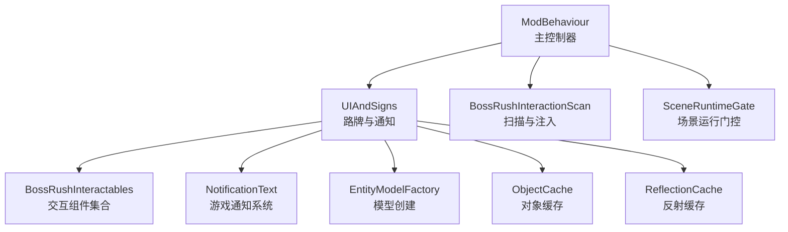
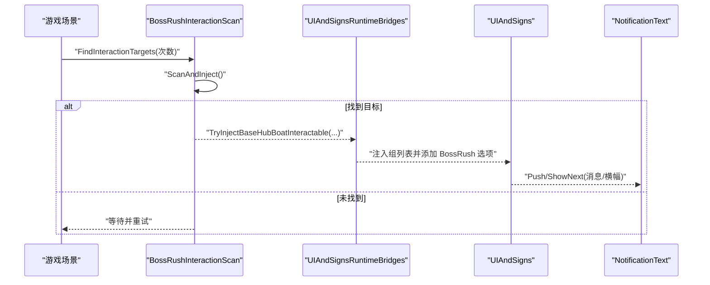
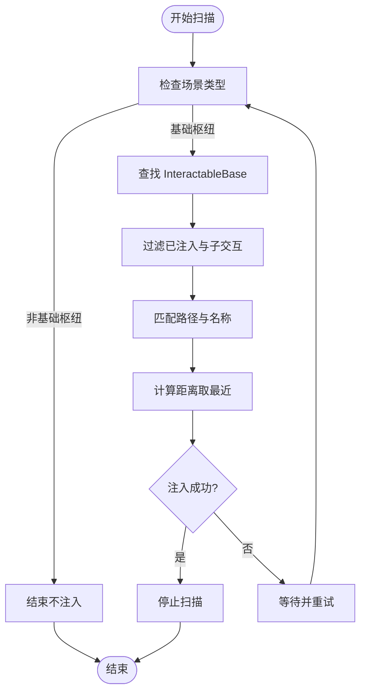
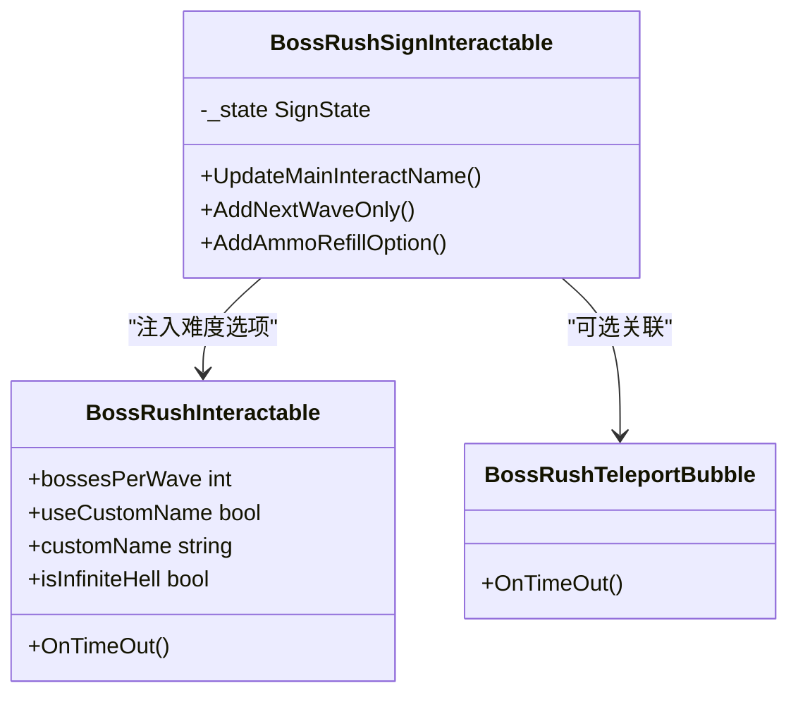
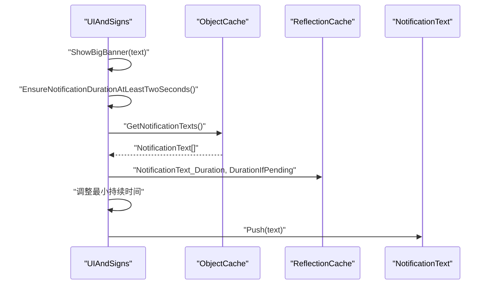
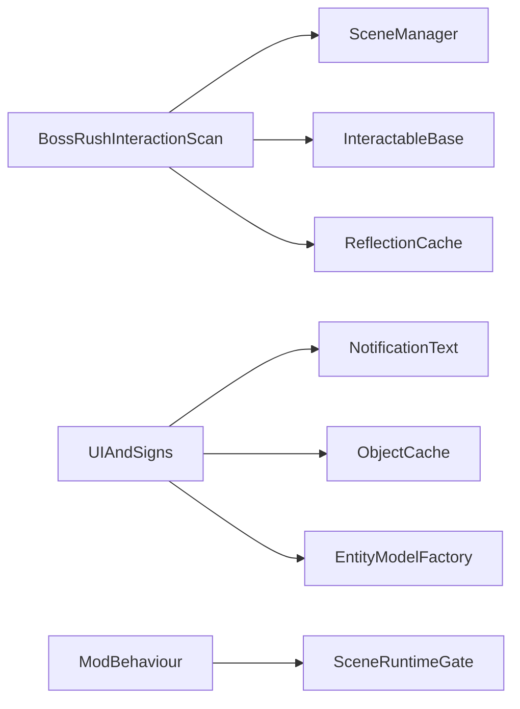

# UI 系统集成

<cite>
**本文引用的文件**
- [BossRushInteractionScan.cs](file://UIAndSigns/BossRushInteractionScan.cs)
- [UIAndSigns.cs](file://UIAndSigns/UIAndSigns.cs)
- [UIAndSignsRuntimeBridges.cs](file://UIAndSigns/UIAndSignsRuntimeBridges.cs)
- [BossRushInteractables.cs](file://Interactables/BossRushInteractables.cs)
- [ModBehaviour.cs](file://ModBehaviour.cs)
- [ObjectCache.cs](file://Common/Infrastructure/ObjectCache.cs)
- [ReflectionCache.cs](file://Common/Infrastructure/BossRushEagerReflectionCache.cs)
- [BossRushUI.cs](file://Common/UI/BossRushUI.cs)
- [MutatorUI.cs](file://Integration/Mutators/MutatorUI.cs)
</cite>

## 目录
1. [简介](#简介)
2. [项目结构](#项目结构)
3. [核心组件](#核心组件)
4. [架构总览](#架构总览)
5. [详细组件分析](#详细组件分析)
6. [依赖关系分析](#依赖关系分析)
7. [性能与内存优化](#性能与内存优化)
8. [故障排查指南](#故障排查指南)
9. [结论](#结论)
10. [附录：自定义 UI 元素开发指南](#附录自定义-ui-元素开发指南)

## 简介
本模块为 BossRush 模组的 UI 系统集成层，负责在游戏内动态创建与管理路牌、横幅、提示框等 UI 元素，并通过扫描机制自动发现并激活可交互对象。同时提供运行时桥接以处理场景切换与 UI 生命周期管理，确保在不同场景中稳定显示与交互。文档涵盖扫描机制、运行时桥接、性能优化、内存管理与跨平台兼容性要点，并提供扩展自定义 UI 元素的实践指南。

## 项目结构
UI 系统由以下关键部分组成：
- 扫描与注入：在基地入口附近自动查找并注入 BossRush 交互点
- 路牌与交互：创建路牌模型、垃圾桶、传送气泡等可交互对象
- UI 通知：通过游戏通知系统显示消息与大横幅
- 运行时桥接：封装 UI 创建与扫描的调用入口，配合主循环调度
- 缓存与反射：对高频 UI 对象与反射结果进行缓存，降低开销



图表来源
- [ModBehaviour.cs:380-440](file://ModBehaviour.cs#L380-L440)
- [UIAndSigns.cs:42-120](file://UIAndSigns/UIAndSigns.cs#L42-L120)
- [BossRushInteractionScan.cs:16-100](file://UIAndSigns/BossRushInteractionScan.cs#L16-L100)
- [BossRushInteractables.cs:41-238](file://Interactables/BossRushInteractables.cs#L41-L238)
- [ObjectCache.cs:17-172](file://Common/Infrastructure/ObjectCache.cs#L17-L172)
- [ReflectionCache.cs:15-87](file://Common/Infrastructure/BossRushEagerReflectionCache.cs#L15-L87)

章节来源
- [ModBehaviour.cs:380-440](file://ModBehaviour.cs#L380-L440)
- [UIAndSigns.cs:42-120](file://UIAndSigns/UIAndSigns.cs#L42-L120)
- [BossRushInteractionScan.cs:16-100](file://UIAndSigns/BossRushInteractionScan.cs#L16-L100)

## 核心组件
- BossRushInteractionScan：负责在特定场景（基地入口）中扫描 InteractableBase 并注入 BossRush 选项，支持多次重试并在成功时立即停止
- UIAndSigns：负责创建路牌、垃圾桶、传送气泡；显示消息与大横幅；根据波次与模式生成敌人方位或包围提示
- BossRushInteractables：定义各类交互组件（难度选择、下一波、弹药补给、传送气泡、清理箱子等），实现交互状态机与本地化名称
- ModBehaviour：统一入口，暴露 ShowMessage、ShowBigBanner、StartBossRushFromInteraction 等方法，协调 UI 与扫描流程
- ObjectCache / ReflectionCache：缓存 UI 对象与反射结果，避免重复 FindObjectsOfType 与反射调用，提升性能

章节来源
- [BossRushInteractionScan.cs:16-100](file://UIAndSigns/BossRushInteractionScan.cs#L16-L100)
- [UIAndSigns.cs:285-466](file://UIAndSigns/UIAndSigns.cs#L285-L466)
- [BossRushInteractables.cs:41-238](file://Interactables/BossRushInteractables.cs#L41-L238)
- [ModBehaviour.cs:1521-1557](file://ModBehaviour.cs#L1521-L1557)
- [ObjectCache.cs:17-172](file://Common/Infrastructure/ObjectCache.cs#L17-L172)
- [ReflectionCache.cs:15-87](file://Common/Infrastructure/BossRushEagerReflectionCache.cs#L15-L87)

## 架构总览
BossRush 的 UI 集成采用“扫描 + 注入 + 运行时桥接”的分层设计：
- 扫描层：在合适的场景（基地入口）中按规则筛选目标 InteractableBase，计算距离与路径，尝试注入 BossRush 选项
- 注入层：将 BossRush 交互项加入 InteractableBase 的 group 列表，设置交互标记与可见性
- 展示层：通过 NotificationText 推送消息与大横幅，使用本地化键与去重策略减少冗余
- 桥接层：对外暴露统一方法，内部委托到具体实现，便于在主循环或事件回调中调用



图表来源
- [BossRushInteractionScan.cs:16-100](file://UIAndSigns/BossRushInteractionScan.cs#L16-L100)
- [UIAndSignsRuntimeBridges.cs:8-26](file://UIAndSigns/UIAndSignsRuntimeBridges.cs#L8-L26)
- [UIAndSigns.cs:747-800](file://UIAndSigns/UIAndSigns.cs#L747-L800)
- [UIAndSigns.cs:432-466](file://UIAndSigns/UIAndSigns.cs#L432-L466)

## 详细组件分析

### 扫描机制：BossRushInteractionScan
- 扫描流程：
  - 获取当前活动场景名，判断是否为基础枢纽场景或竞技场场景
  - 遍历所有 InteractableBase，过滤掉已注入的 BossRushInteractable
  - 基于 GameObject 路径与名称匹配“Boat”与主交互点，计算距离选取最近候选
  - 调用注入方法成功后立即停止扫描，避免重复工作
- 错误处理：捕获异常并记录日志，保证扫描鲁棒性
- 反射访问：通过 ReflectionCache 获取 InteractableBase 的私有 group 列表



图表来源
- [BossRushInteractionScan.cs:16-100](file://UIAndSigns/BossRushInteractionScan.cs#L16-L100)
- [BossRushInteractionScan.cs:105-141](file://UIAndSigns/BossRushInteractionScan.cs#L105-L141)

章节来源
- [BossRushInteractionScan.cs:16-100](file://UIAndSigns/BossRushInteractionScan.cs#L16-L100)
- [BossRushInteractionScan.cs:105-141](file://UIAndSigns/BossRushInteractionScan.cs#L105-L141)

### 路牌与交互：UIAndSigns 与 BossRushInteractables
- 路牌创建：
  - 使用 EntityModelFactory 创建路牌模型，移除刚体并将 Collider 设为 Trigger，确保玩家可穿过
  - 添加 BoxCollider 作为触发器，挂载 BossRushSignInteractable 作为主交互
  - 在路牌旁边创建垃圾桶，位置根据地图类型调整（右侧或前方）
- 交互状态机：
  - BossRushSignInteractable 维护 EntryAndDifficulty、Cheer、NextWave、Victory 四种状态
  - 根据状态更新主交互名称与可用选项（难度、下一波、弹药补给）
  - 难度选项通过 BossRushInteractable 注入，支持自定义名称与本地化键
- 传送气泡：
  - 在救援点创建 BossRushTeleportBubble，点击后移动玩家至默认位置并保持相机偏移
  - 使用后销毁自身，避免残留



图表来源
- [BossRushInteractables.cs:585-737](file://Interactables/BossRushInteractables.cs#L585-L737)
- [BossRushInteractables.cs:403-506](file://Interactables/BossRushInteractables.cs#L403-L506)
- [UIAndSigns.cs:122-200](file://UIAndSigns/UIAndSigns.cs#L122-L200)
- [UIAndSigns.cs:235-283](file://UIAndSigns/UIAndSigns.cs#L235-L283)

章节来源
- [UIAndSigns.cs:122-200](file://UIAndSigns/UIAndSigns.cs#L122-L200)
- [UIAndSigns.cs:235-283](file://UIAndSigns/UIAndSigns.cs#L235-L283)
- [BossRushInteractables.cs:585-737](file://Interactables/BossRushInteractables.cs#L585-L737)
- [BossRushInteractables.cs:403-506](file://Interactables/BossRushInteractables.cs#L403-L506)

### 通知与横幅：UIAndSigns
- 消息提示：
  - UpdateMessage_UIAndSigns 维护计时器，调用 NotificationText.ShowNext 显示短消息
- 大横幅：
  - ShowBigBanner_UIAndSigns 使用 NotificationText.Push 推送横幅
  - 包含动态内容（颜色标签、数字）时不进行去重，静态文本在窗口期内去重
  - EnsureNotificationDurationAtLeastTwoSeconds 通过反射调整 NotificationText 的 duration 字段，确保至少 2 秒显示
- 敌人生成横幅：
  - ShowEnemyBanner_UIAndSigns 根据单 Boss 或多 Boss 模式显示方向或“包围”提示
  - 支持无限波次显示（∞）与波次索引计算



图表来源
- [UIAndSigns.cs:432-466](file://UIAndSigns/UIAndSigns.cs#L432-L466)
- [UIAndSigns.cs:367-427](file://UIAndSigns/UIAndSigns.cs#L367-L427)
- [ObjectCache.cs:161-172](file://Common/Infrastructure/ObjectCache.cs#L161-L172)
- [ReflectionCache.cs:23-36](file://Common/Infrastructure/BossRushEagerReflectionCache.cs#L23-L36)

章节来源
- [UIAndSigns.cs:285-300](file://UIAndSigns/UIAndSigns.cs#L285-L300)
- [UIAndSigns.cs:307-365](file://UIAndSigns/UIAndSigns.cs#L307-L365)
- [UIAndSigns.cs:432-466](file://UIAndSigns/UIAndSigns.cs#L432-L466)

### 运行时桥接：UIAndSignsRuntimeBridges
- 对外暴露 CreateRescueTeleportBubble、TryCreateArenaDifficultyEntryPoint、EnsureArenaEntryPointCreated 等方法
- 内部委托到对应 _UIAndSigns 后缀的实现，便于在主循环或事件回调中统一调用
- 与 ModBehaviour 的 Update 和 OnGUI 流程集成，确保在正确时机执行

章节来源
- [UIAndSignsRuntimeBridges.cs:8-26](file://UIAndSigns/UIAndSignsRuntimeBridges.cs#L8-L26)
- [ModBehaviour.cs:622-645](file://ModBehaviour.cs#L622-L645)

### 共享 UI 库：BossRushUI（2026-08-27 全项目 UI 收口）
全 Mod 界面统一收口到 `Common/UI/BossRushUI.cs`，新建或改动界面必须走共享库（AGENTS.md §4.14）：

- **Canvas 层级表 `BossRushUILayers`**：全项目 sortingOrder 唯一事实源，严格递增。常规界面区（HudOverlay 1200 / Panel 2000 / Modal 3000 / ModalConfirm 3200 / Toast 4000）、ModeG 三档（900/940/950）、独立模式区（ZombieMode 28000~30500、婚礼过场 32000）。历史上 10~1001 与 28000~32000 两个孤岛的魔法数字已全部改为引用常量，其中成就界面（10→2000）、快递员确认框（10→3200）等低层级界面被抬入正确档位。
- **设计 token `BossRushUIColors`**：遮罩统一 `Backdrop`，不再允许第二套 `(0,0,0,0.7)`；按钮态经 `ApplyButtonColors` 推导。
- **程序化圆角九宫格 `ApplyPanelSkin`**：运行时生成、按半径缓存共享的圆角底图；将来换美术图集时通过 `BossRushUISkin` 注入，调用方零改动（规格见 `docs/制作教程/BossRushUI_图集规格.md`）。
- **字体**：`ApplyGameFont` / `GetLegacyChineseFont()` 统一取游戏字体，源码禁止再出现内置 Arial（渲染不了中文）；`CanvasScaler` 必须经 `ZombieModeUIHelper.ConfigureCanvasScaler` 配置。
- **生命周期**：程序化贴图带 `HideFlags.DontSave`，由 `BossRushUI.ResetStaticCaches` 在 `ModBehaviour.OnDestroy` 路径显式销毁。
- **变异词条 overlay**：`MutatorUI` 已从 IMGUI（OnGUI）迁为 uGUI Canvas（HudOverlay 层），由 `ModBehaviour.Update` 的 `Tick()` 驱动，抑制契约（判定早于显示、抑制期清悬停、异常按抑制处理）不变。

结构由 `tests/BossRushUISharedLibraryGuard.py` 守卫：层级表严格递增、已迁移界面不得回退裸数值或第二套遮罩色、全仓禁止手写 `uiScaleMode` 赋值与内置 Arial。

章节来源
- [BossRushUI.cs](file://Common/UI/BossRushUI.cs)
- [MutatorUI.cs](file://Integration/Mutators/MutatorUI.cs)
- [BossRushUISharedLibraryGuard.py](file://tests/BossRushUISharedLibraryGuard.py)

## 依赖关系分析
- 扫描与注入依赖：
  - SceneManager 获取当前场景
  - FindObjectsOfType 查找 InteractableBase
  - ReflectionCache 访问私有字段
- UI 展示依赖：
  - NotificationText 推送消息与横幅
  - ObjectCache 缓存 UI 对象数组
  - L10n 提供本地化文本
- 模型创建依赖：
  - EntityModelFactory 创建路牌与垃圾桶模型
- 场景门控依赖：
  - SceneRuntimeGate 判断是否允许运行游戏逻辑



图表来源
- [BossRushInteractionScan.cs:16-100](file://UIAndSigns/BossRushInteractionScan.cs#L16-L100)
- [UIAndSigns.cs:432-466](file://UIAndSigns/UIAndSigns.cs#L432-L466)
- [ObjectCache.cs:17-172](file://Common/Infrastructure/ObjectCache.cs#L17-L172)
- [ReflectionCache.cs:15-87](file://Common/Infrastructure/BossRushEagerReflectionCache.cs#L15-L87)
- [ModBehaviour.cs:380-440](file://ModBehaviour.cs#L380-L440)

章节来源
- [BossRushInteractionScan.cs:16-100](file://UIAndSigns/BossRushInteractionScan.cs#L16-L100)
- [UIAndSigns.cs:432-466](file://UIAndSigns/UIAndSigns.cs#L432-L466)
- [ObjectCache.cs:17-172](file://Common/Infrastructure/ObjectCache.cs#L17-L172)
- [ReflectionCache.cs:15-87](file://Common/Infrastructure/BossRushEagerReflectionCache.cs#L15-L87)
- [ModBehaviour.cs:380-440](file://ModBehaviour.cs#L380-L440)

## 性能与内存优化
- 对象缓存：
  - ObjectCache 缓存 BoxCollider、NotificationText、StockShop、TMP_FontAsset 等对象数组，按场景自动失效，避免每帧 FindObjectsOfType
  - ForceRefresh 与 ResetStaticCaches 用于强制刷新与卸载时清理，防止内存泄漏
- 反射缓存：
  - ReflectionCache 缓存常用 FieldInfo 与 MethodInfo，减少反射开销
  - 初始化失败时记录日志并标记 IsInitialized，调用方需检查可用性
- 横幅去重：
  - 静态文本在短时间窗口内去重，动态内容（颜色标签、数字）跳过去重，避免误判
- 碰撞与渲染优化：
  - 移除刚体并将 Collider 设为 Trigger，确保玩家可穿过路牌与垃圾桶
  - 后备模型检测（名称含 _Fallback 或缺少 MeshRenderer）时降级处理

章节来源
- [ObjectCache.cs:17-172](file://Common/Infrastructure/ObjectCache.cs#L17-L172)
- [ReflectionCache.cs:15-87](file://Common/Infrastructure/BossRushEagerReflectionCache.cs#L15-L87)
- [UIAndSigns.cs:432-466](file://UIAndSigns/UIAndSigns.cs#L432-L466)
- [UIAndSigns.cs:65-103](file://UIAndSigns/UIAndSigns.cs#L65-L103)

## 故障排查指南
- 扫描失败：
  - 检查场景名是否为基础枢纽场景
  - 确认 InteractableBase 是否存在且未被其他 Mod 修改
  - 查看日志中的异常信息与堆栈
- 横幅不显示：
  - 确认 NotificationText 实例存在且 duration 字段可写
  - 检查动态内容是否导致去重被跳过
- 路牌不可交互：
  - 验证 BoxCollider 是否为 Trigger 且大小合适
  - 确认 BossRushSignInteractable 已正确挂载
- 内存泄漏：
  - 确保在场景切换或 Mod 卸载时调用 ResetStaticCaches
  - 避免持有已销毁对象的引用

章节来源
- [BossRushInteractionScan.cs:95-100](file://UIAndSigns/BossRushInteractionScan.cs#L95-L100)
- [UIAndSigns.cs:367-427](file://UIAndSigns/UIAndSigns.cs#L367-L427)
- [ObjectCache.cs:65-72](file://Common/Infrastructure/ObjectCache.cs#L65-L72)

## 结论
BossRush 的 UI 系统集成通过扫描与注入机制，实现了在基地入口自动添加 BossRush 选项的能力；结合路牌、横幅与提示框的动态管理，提供了流畅的玩家交互体验。运行时桥接确保了场景切换时的稳定性，缓存与反射优化提升了性能。遵循本文档的实践指南，可以安全地扩展自定义 UI 元素并集成到现有系统中。

## 附录：自定义 UI 元素开发指南
- 创建交互组件：
  - 继承 InteractableBase，重写 Awake、Start、IsInteractable、OnTimeOut
  - 设置 InteractName 与 overrideInteractName，使用本地化键避免显示异常
  - 配置 interactCollider 与 MarkerActive，控制交互范围与标记可见性
- 注入到组列表：
  - 使用 ReflectionCache.InteractableBase_OtherInterablesInGroup 获取私有列表
  - 添加新交互项并设置父节点与局部坐标
- 显示通知：
  - 使用 NotificationText.Push 或 ShowNext 显示消息与横幅
  - 通过 ObjectCache.GetNotificationTexts 获取实例并调整属性
- 模型创建：
  - 使用 EntityModelFactory 创建路牌与垃圾桶，移除刚体并设置 Trigger
  - 检测后备模型并降级处理
- 生命周期管理：
  - 在场景切换或 Mod 卸载时清理对象与缓存
  - 避免在热路径中进行昂贵操作，使用缓存与异步任务

章节来源
- [BossRushInteractables.cs:41-238](file://Interactables/BossRushInteractables.cs#L41-L238)
- [UIAndSigns.cs:122-200](file://UIAndSigns/UIAndSigns.cs#L122-L200)
- [ObjectCache.cs:17-172](file://Common/Infrastructure/ObjectCache.cs#L17-L172)
- [ReflectionCache.cs:15-87](file://Common/Infrastructure/BossRushEagerReflectionCache.cs#L15-L87)

## 2026-09-07 界面可读性与视觉整理（COMPAT）

共享层 `Common/UI/BossRushUI.cs` / `ZombieMode/ZombieModeUIHelper.cs` 现在统一以下表现约定：

- CanvasScaler 使用 1920×1080 参考尺寸与 Expand；`GetReferenceViewportSize()` 提供同口径逻辑视口，成就/图鉴的尺寸计算不再直接使用物理屏幕像素。
- 共享按钮的底色只有一个来源：`ColorBlock` 的绝对色，`Graphic` 恒为白。`CreateButton` 与 `ApplyButtonColors` 走同一条路径，三态由 `BossRushUI.GetHoverColor / GetPressedColor / GetDisabledColor` 派生。**不要用大于 1 的中性乘色做悬停**——`CanvasRenderer` 的 tint 存的是 32 位色，超过 1 会被夹回白色，悬停与常态完全一致。要改已有按钮的底色一律走 `ZombieModeUIHelper.SetButtonBaseColor`，直接写 `Image.color` 会与 ColorTint 相乘。`ApplyButtonColors` 会顺带把名为 `Text` 的共享标签刷成对应深浅。
- 标签内边距只取 `size` 与 `textSize` 的实际差值，不套下限，避免窄按钮的标签反而比调用方要的更窄。
- 亮底判定阈值是 `BossRushUI.LightBackgroundLuminance`（相对亮度 0.30），只有明确的亮底才用深字，中间带一律回落白字。阈值刻意远离 Warning(≈0.160)、Success(≈0.180)、Accent(≈0.378) 这几个常用 token；`UILayoutReadabilityGuard` 会从源码重算每个 token 的余量并要求 ≥20%，改配色时别把它挤到刀刃上。
- `Image.Type.Filled` / `Tiled` **必须**赋 sprite（`BossRushUI.GetSolidSprite()`）：`sprite` 为 null 时 `Image.OnPopulateMesh` 直接退回基类整块矩形，`type` 与 `fillAmount` 被完全忽略，进度条会永远满格。注意不能用 `ApplyPanelSkin` 代替，它会把 `type` 改回 `Sliced`。守卫扫描全部生产源码。
- 遮罩有两个 token：面板级 `Backdrop`(0.62) 与全屏正片用的 `BackdropStrong`(0.90)。根上已经有 Backdrop 时，页面必须用 `CreateModalSurface(..., createBackdrop: false)`，否则两张 0.62 合成 0.856。
- `SuccessText` / `WarningText` / `DangerText` 是深色面板上的状态文字，原 Success/Warning/Danger 继续作为承托文字的背景色。
- `MeasureTextHeight` 只用于低频创建的可增长内容：固定字号、测量换行高度，调用方必须把高度计入卡片与 ScrollRect。固定 HUD 仍保留限高/省略，不能随意开放 Overflow。
- `ConfigureScrollRect` 补齐空白区域滚轮命中、纵向拖动滑块及 Clamped 滚动；已存在的官方滑块继续复用。调用方为右侧滚动条预留 20px。
- Mode H 的模态页与恢复壳都在根上建 Backdrop，因此两者都传 `createBackdrop: false`；其它调用的默认行为不变。默认程序化皮肤保留实际圆角半径；是否走程序化由 `BossRushUISkin.HasInjectedPanelSprite / HasInjectedButtonSprite` 决定，注入图集后一张程序化贴图都不再生成。

`UILayoutReadabilityGuard` 检查容器边界、内容/动作避让、画布坐标、重复乘色、`Type.Filled` 的 sprite、按钮乘色上限与设计 token 的阈值余量，并含 11 个内存反向检查。它与 Windows 正式编译均不能代替 Unity 内的字体、滚动、悬停、分辨率与过图实测。

`PetNest/PetNestUI.cs` 继续使用唯一输入租约和原有四页入口。标题收回面板左边界；卡片文字从左上统一留白向下排，操作独立右列，长正文以 18 号字测高并撑开卡片。内容区与操作区留 32px 间隔，两个列表均有可拖动滚动条；无底部动作时把空间还给正文。当前页签用亮底/粗体标识，失败和风险用专用亮色文字。切页重建前先停用旧节点，避免帧末销毁前参与布局；刷新后回到列表顶部。资产选择、死亡率提示和动作回调语义保持不变。实机滚动、长名称与中英文换行待验。

`ModeH/ModeHUI.cs` 的三条观战状态按 y=64/0/-64 排入原 560×220 背景，计时文字宽度按 320×96 的计时背景计算。拍铃底色走 `SetButtonBaseColor`，口令窗倒计时条补了纯色 sprite（此前 `fillAmount` 无效、条子恒满）。押品格滚动区也接入了共享滚轮/滑块设置。`ModeHUIPages.cs` 将卡片标题/副标题/正文拆成互不交叠的区段；战报行固定字号测高后滚动，赔率明细与押品选择器各占一列。战报与战痕卡同时出现时使用上下独立阅读区；底部按钮换行后，各阅读区按同一个 `GetActionBandReserve` 让位。滚动容器继续优先复用官方 ScrollRect，并使用共享滚轮/滑块设置。模态页只保留根遮罩一次，拍铃文字按实际底色配深浅。层段、冻结面板尺寸、唯一模态租约及真实押品/恢复命令不变；实机长战报、五席/32席、多行动作和滚轮待验。

`Campaign/CampaignBoardView.cs` 改为 1040×840 公告板：标题和关闭入口固定，六章正文放入带滑块的独立 ScrollRect。每条目标另起一行，18 号正文按实际高度扩展卡片，标题、目标与右侧动作互相让位；不再把整章目标压进固定 40px 高度。公告板和 `Integration/BackMountain/ShowcaseUI.cs` 的标题背景都锚到面板左右两端，修复旧版只占右半边导致的偏移。章节状态、接约/交付/放弃与登记奖励不变；实机操作和双语文本待验。

`Integration/Affinity/AffinityUIManager.cs` 的关系提示采用共享深色皮肤、320×104 留白和 20/16 号文字，原有心形图标保留；名称、等级、进度条分区，装饰与文字均透传点击。`Integration/UI/ImageViewerUI.cs` 的图片通过锚点和 preserveAspect 自动适配画布，上下各留 110px，避免 4K 二次放大；标题/提示绑定游戏字体。资源失败时明确提示“图片暂不可用”，不再创建大渐变占位图或无限显示“加载中”。`Integration/Codex/CodexView.cs` 的高度使用共享逻辑视口。原输入与资源归属流程保持不变；高清屏、长标题、加载失败与重开待实机复测。


## 附录二：共享 UI 库的皮肤分档与描边（2026-09-13）

`Common/UI/BossRushUI.cs` 这一轮加了两件全 Mod 共享的东西，新建界面时直接用，不要各写各的。

### 皮肤分档 `BossRushUISkinPart`

`Assets/ui/bossrush_ui_skin` 里有六张九宫格图，但同一个 `radius` 对应的不是同一张：

| 分档 | Auto 触发 | 注入后用哪张 |
| --- | --- | --- |
| `Hairline` | `radius <= 3` | **一律程序化** |
| `Rule` | 显式传 | `divider`（横向分隔线） |
| `Button` | `4 <= radius <= 11` | `button_normal` |
| `Card` | 显式传 | `panel_raised`（卡片、列表行） |
| `Panel` | `radius >= 12` | `panel_surface` |
| `ScrollHandle` | 显式传 | `scroll_handle` |

```csharp
BossRushUI.ApplyPanelSkin(image, 10);                                   // Auto -> Button
BossRushUI.ApplyPanelSkin(image, 10, BossRushUISkinPart.Card);          // 卡片 / 列表行
BossRushUI.ApplyPanelSkin(rule, 2, BossRushUISkinPart.Rule);            // 分隔线，rect 高度必须 >= 5
```

两条会咬人的细节：

- **3px 上任何图都会糊。** Unity 的 `Image.GetAdjustedBorders` 在 rect 小于 border 之和时会把 border
  等比压下去并把中心区压到 0。3px 宽的强调竖条穿 32×32 / border 10 的按钮图，画出来是按钮圆角的
  一道糊痕，**比程序化半径还差**——所以 `Hairline` 一律走程序化。
- **`divider` 的亮带在可拉伸的中心区。** rect 高度 1 时上下 border 各分到 0.5px、中心区归零，
  整条线画不出来。生产里用 8。

### 描边 `ApplyPanelStroke`

**深色 UI 上，图集里烤进去的描边会被 `Image.color` 乘没。** 实算：`panel_surface` 的描边像素与
填充像素灰度差 49/255，乘上 `BossRushUIColors.Surface(0.045,0.055,0.065)` 之后，屏幕上只剩
**2.9/255** 的通道差（`SurfaceRaised` 上 4.9/255），是 8bit 量化底噪级别。
亮底（`Accent`）上还剩 35.3/255——所以「图集有描边」这件事只在亮底上成立。

要让深色面板有边，描边必须是**独立 Image + 独立亮色 token**：

```csharp
BossRushUI.ApplyPanelSkin(surface, 18, BossRushUISkinPart.Panel);
BossRushUI.ApplyPanelStroke(surface, 18, BossRushUISkinPart.Panel, BossRushUIColors.Stroke);
```

`ApplyPanelStroke` 生成一张「只有环、中心透明」的圆角九宫格，**圆角按图集实际的 border 取**
（`GetSkinCornerRadius`：注入图集后面板的圆角是 16，不是你传的 18；按传入值画会露出一道错位的弧）。
描边 `raycastTarget=false`，不吃点击。

`BossRushUIColors.Stroke` = `Divider` 同色相、alpha 0.78。为什么不直接用 `Divider`：它自带 0.32，
铺成描边对面板底只有 **1.54:1**，低于 WCAG 1.4.11 对非文本的 3:1，画了等于没画。
0.78 在亮云海到暗地形的整个区间里都稳在 3.1:1 以上。

**列表行尤其不能省**：`SurfaceRaised` 对 `Surface` 只有 **1.03:1**，不画边的话玩家看到的
不是「一个可点的区域」，只是几行浮着的字。

### 缓动

`BossRushUI.EaseOut`（二次 ease-out）与 `BossRushUI.SmoothStep` 是全 Mod 仅有的两条曲线。
**位移用 EaseOut**（元素飞进屏幕时模拟自然停稳），**原地淡入用 SmoothStep**（两头都收）。
退场不套曲线，线性即可。子元素错峰入场用 `BossRushUIEntranceAnimation.Play(go, delay, duration, rise)`，
它只改 CanvasGroup.alpha 与 anchoredPosition，**不碰 `interactable`**——动效绝不能变成输入延迟。
两者都走 unscaled 时间，所以都自带 `BossRushUI.IsGamePaused()` 门。

**不引入 DOTween / PrimeTween**：Mod 每多一个依赖就多一个分发与版本面，而这两条曲线各一行。


### 面板底铺图的两条坑（2026-09-13）

天空岛剧情面板把整块面板底换成了区域插图。两条踩过的坑，别的界面要铺图时直接抄：

1. **横图不能直接 cover 到竖面板上。** 面板 880 × 约 940（0.94:1），横幅 1024×288（3.56:1），
   cover 要放大 **3.26 倍**、只看得见原图中间 26% 的宽度，平滑渐变会出现带状阶梯。
   正解是出一张**为模糊而生**的小图（220×236 + 高斯模糊），模糊之后分辨率就不重要了。
   派生脚本：`tools/gen_sky_island_panel_backgrounds.py`（纯 Pillow，不调生图 API）。

2. **压暗 / 渐隐要放到文字所在的位置，不是放到好看的位置。**
   `SkyIslandUiArt.GetBannerFade()` 是 `alpha = t²`，不透明度全堆在底边；
   标题上沿离底边 123 px、渐隐 153 px 时那里 alpha 只有 0.19，等于没压。
   正解是「实底带罩住文字 + 带子上方再淡出到全透」——带子按**文字的实际上沿**算高度，
   渐变整体乘上和带子相同的 alpha，接缝处才不露亮缝。
   （区域大标题的压暗底是同一类 bug 的另一个实例，见 `SkyIslandUiArt.GetTitleScrim`。）

另外，**圆角面板铺图必须用 `Mask`**（模板取面板同一张九宫格、`showMaskGraphic=false`），
并把容器内缩 1px：模板是二值的，切出来是硬边，留 1px 让面板自己那圈带抗锯齿的圆角露在外面。

## 附录三：官方界面能用就别自绘；选项先判断再挂（2026-09-13 第三轮）

### 先问一句「官方有没有，我们自己是不是已经封装过」

天空岛做到第三轮才发现：**官方对话与官方图鉴我们自己早就封装好了，天空岛两处都零调用**。

| 能力 | 官方 | 我们的封装 | 谁在用 |
| --- | --- | --- | --- |
| 剧情对话 | `Dialogues.DialogueUI` + NodeCanvas `DialogueTree` | `Integration/Dialogue/DialogueManager` + `DialogueActorFactory` | 征程、快递员 |
| 图鉴条目 | `Duckov.NoteIndexs.NoteIndex` | 范例 `Campaign/CampaignNoteBridge.cs` | 征程 |

自绘了一套之后的代价是具体的：长台词只能一次糊在正文位（最长一段 156 个中文字符），
自建图鉴一趟结束就翻不到，还多出 20 行 `□ …（尚未收录）` 的空占位。

**新增子系统的界面，先照这张表过一遍。** 口径进了 `AGENTS.md` §4.14，
由 `tests/SkyIslandOfficialApiReuseGuard.py` 守卫。

### 自绘面板什么时候才该保留——理由必须写进文件头

官方 `DialogueUI` 只给「台词 + 纯文本选项」，**给不了 `timeScale = 0` 的模态**。
天空岛面板里挂着回血（苔药）与整备，没有模态门它就是战斗中的免费暂停 + 回血站——
**这就是保留它的唯一理由**，现在写在 `SkyIslandStoryPresentation.cs` 的文件头。

这条此前只存在于本 wiki，代码里一个字没有，所以 owner 直接问了出来「有没有用原版的 api」。
**凡是「官方有但我们不用」的地方，理由都要写在代码里，并且配一条断言它还在的守卫。**

### 混合架构的接法

叙事走官方、功能留自绘时，有三个坑：

1. **fail-open 必须覆盖每一条失败路径**（拿不到 actor、抛异常、玩家中途退出）。
   跟 NPC 说不上话不能变成「接不了委托」。天空岛的实现里 `openPanel()` 出现在 4 个分支上。
2. **面板的「重开」不能指回对话入口**。指回去的话，每点一个功能项都要把整段台词重听一遍。
3. **官方对话不压 `timeScale`**。要么接受对话中受击（与快递员同口径），
   要么自己在会话侧挡（天空岛用 `BlockedByCombat()` 挡住战斗中开口）。

### 选项：先判断再挂，不要挂灰项

旧写法是选项一律先挂上、前置判断全丢进 `Select` 回调，于是玩家看到的是**一屏点不动的按钮**。
正确的形状：

- 「能不能挂」与「点了会不会被拒」**共用同一份判据**（天空岛是 `SkyIslandStoryRules.Describe`），
  否则迟早分叉。
- 做不了就**整条不挂**——**不要挂灰掉的占位项**，灰项和挂满一样吵，玩家还是会去点。
- 前置没满足时把「还差什么」收进正文当引导；**已经做完则什么都不留**
  （「这段已经完成」不是引导，是噪声）。
- 同一页超过 3–4 项就分二级子菜单。**不需要新建框架**：每个开面板的方法把「重开」指向自己，
  「进子页」就是调另一个开面板的方法，「返回」就是子页里的一个选项。

由 `tests/SkyIslandChoiceGateGuard.py` 守卫（11 个反向检查）。

### 抠图立绘不要再套底板

`SkyIslandUiArt` 的六张居民立绘是 512×512 RGBA **真抠图**（四角 alpha=0、透明像素占 35–50%），
此前却被「圆角底板 + 描边 + 内缩 5px」三层装回了框里。抠图就该直接站在插图上；
边缘会糊的问题用**脚下落影**解决（一张程序化径向柔光，`SkyIslandUiArt.GetRadialGlow()`），
不是用一块黑底板解决。
