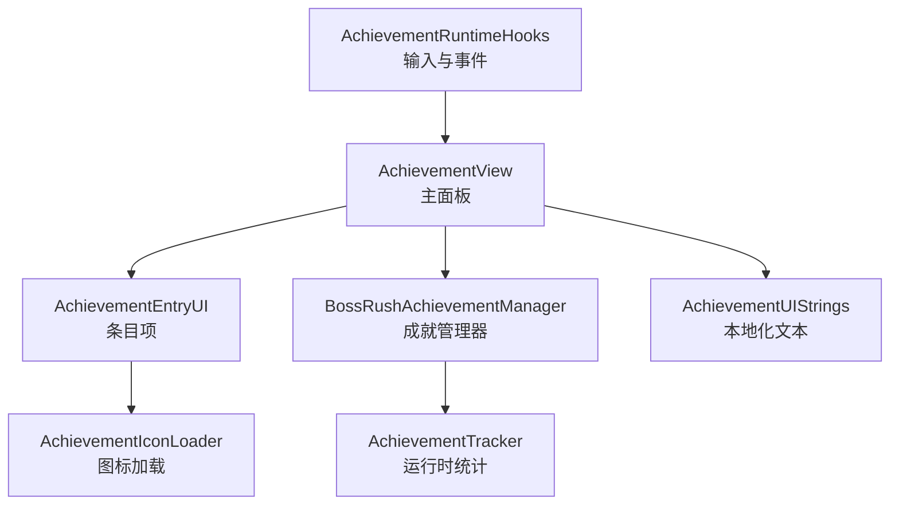
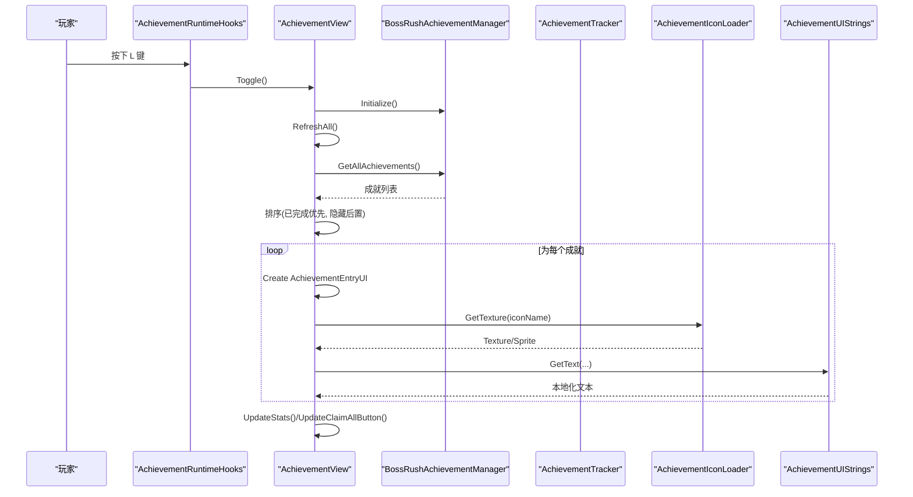
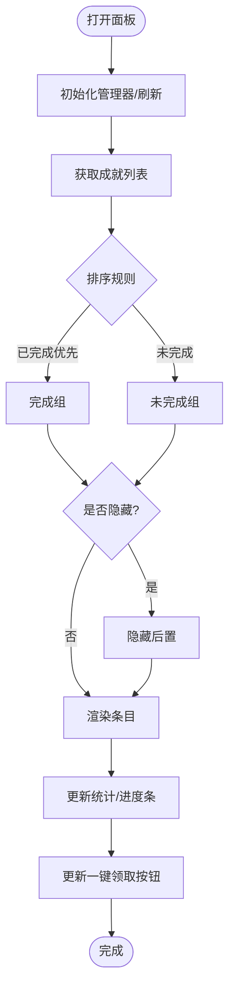
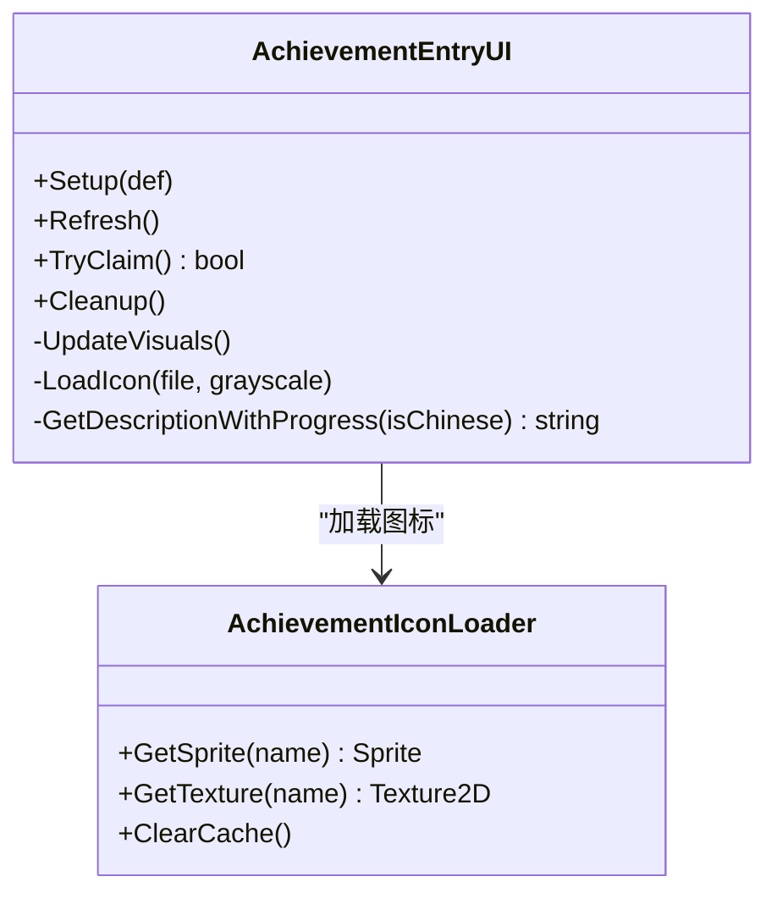
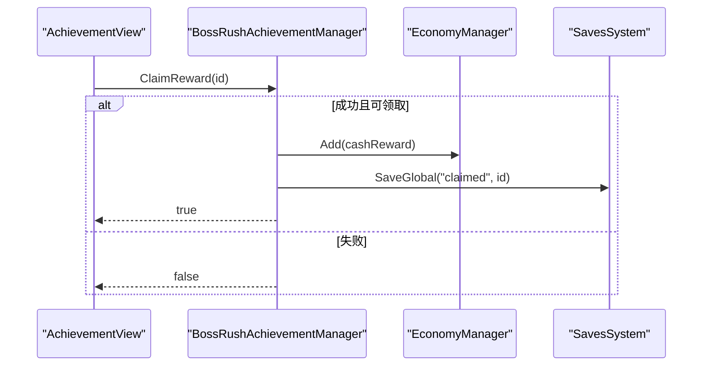
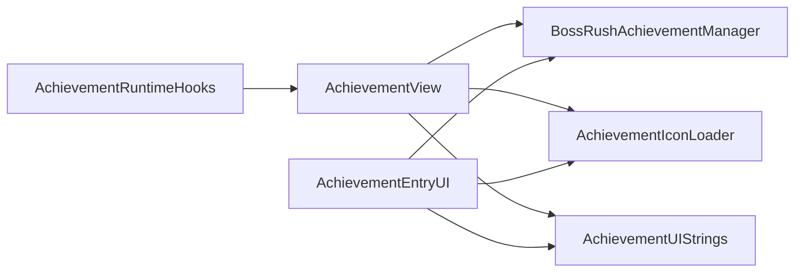

# 成就面板界面

<cite>
**本文引用的文件**
- [AchievementView.cs](file://Achievement/AchievementView.cs)
- [AchievementEntryUI.cs](file://Achievement/AchievementEntryUI.cs)
- [BossRushAchievementManager.cs](file://Achievement/BossRushAchievementManager.cs)
- [AchievementTracker.cs](file://Achievement/AchievementTracker.cs)
- [BossRushAchievementDef.cs](file://Achievement/BossRushAchievementDef.cs)
- [AchievementUIStrings.cs](file://Achievement/AchievementUIStrings.cs)
- [AchievementIconLoader.cs](file://Achievement/AchievementIconLoader.cs)
- [AchievementRuntimeHooks.cs](file://Achievement/AchievementRuntimeHooks.cs)
</cite>

## 目录
1. [简介](#简介)
2. [项目结构](#项目结构)
3. [核心组件](#核心组件)
4. [架构总览](#架构总览)
5. [详细组件分析](#详细组件分析)
6. [依赖关系分析](#依赖关系分析)
7. [性能考量](#性能考量)
8. [故障排查指南](#故障排查指南)
9. [结论](#结论)
10. [附录](#附录)

## 简介
本文件面向“成就面板界面”的实现与使用，聚焦 AchievementView 主面板的创建、布局管理、响应式设计；成就列表渲染机制与排序（已完成优先、隐藏成就后置）；滚动区域管理；UI 生命周期与事件处理；统计栏与进度条更新；一键领取逻辑；以及 EntryUI 自定义与扩展方法。同时给出关键流程图与时序图，帮助快速理解并扩展该模块。

## 项目结构
成就面板相关代码集中在 Achievement 目录下，围绕以下职责划分：
- 视图层：AchievementView（主面板）、AchievementEntryUI（条目项）
- 数据与状态：BossRushAchievementManager（成就定义/解锁/奖励）、AchievementTracker（运行时累计统计）
- 资源与本地化：AchievementIconLoader（图标加载与缓存）、AchievementUIStrings（多语言文本）
- 运行时钩子：AchievementRuntimeHooks（快捷键输入、弹窗通知）

图表来源
- [AchievementView.cs:148-601](file://Achievement/AchievementView.cs#L148-L601)
- [AchievementEntryUI.cs:106-298](file://Achievement/AchievementEntryUI.cs#L106-L298)
- [BossRushAchievementManager.cs:46-235](file://Achievement/BossRushAchievementManager.cs#L46-L235)
- [AchievementTracker.cs:70-164](file://Achievement/AchievementTracker.cs#L70-L164)
- [AchievementIconLoader.cs:17-124](file://Achievement/AchievementIconLoader.cs#L17-L124)
- [AchievementUIStrings.cs:18-84](file://Achievement/AchievementUIStrings.cs#L18-L84)
- [AchievementRuntimeHooks.cs:8-39](file://Achievement/AchievementRuntimeHooks.cs#L8-L39)

章节来源
- [AchievementView.cs:148-601](file://Achievement/AchievementView.cs#L148-L601)
- [AchievementEntryUI.cs:106-298](file://Achievement/AchievementEntryUI.cs#L106-L298)
- [BossRushAchievementManager.cs:46-235](file://Achievement/BossRushAchievementManager.cs#L46-L235)
- [AchievementTracker.cs:70-164](file://Achievement/AchievementTracker.cs#L70-L164)
- [AchievementIconLoader.cs:17-124](file://Achievement/AchievementIconLoader.cs#L17-L124)
- [AchievementUIStrings.cs:18-84](file://Achievement/AchievementUIStrings.cs#L18-L84)
- [AchievementRuntimeHooks.cs:8-39](file://Achievement/AchievementRuntimeHooks.cs#L8-L39)

## 核心组件
- AchievementView：主面板容器，负责 Canvas/背景/头部/统计栏/滚动区/底部按钮的创建与布局；提供打开/关闭/刷新/一键领取等能力。
- AchievementEntryUI：单个成就条目，封装图标、名称、描述、奖励金额、领取按钮的状态与交互。
- BossRushAchievementManager：注册成就定义、维护解锁与已领取集合、发放奖励、查询统计。
- AchievementTracker：记录本局与累计统计数据（如击杀数、通关次数、最高波次等），支持自动存档。
- AchievementIconLoader：统一加载成就图标 Sprite/Texture，带缓存与 AssetBundle 管理。
- AchievementUIStrings：多语言字符串与语言检测。
- AchievementRuntimeHooks：监听 L 键（或配置热键）切换面板，并在解锁时弹出 Steam 成就提示。

章节来源
- [AchievementView.cs:22-126](file://Achievement/AchievementView.cs#L22-L126)
- [AchievementEntryUI.cs:18-99](file://Achievement/AchievementEntryUI.cs#L18-L99)
- [BossRushAchievementManager.cs:13-39](file://Achievement/BossRushAchievementManager.cs#L13-L39)
- [AchievementTracker.cs:11-49](file://Achievement/AchievementTracker.cs#L11-L49)
- [AchievementIconLoader.cs:14-33](file://Achievement/AchievementIconLoader.cs#L14-L33)
- [AchievementUIStrings.cs:15-84](file://Achievement/AchievementUIStrings.cs#L15-L84)
- [AchievementRuntimeHooks.cs:8-39](file://Achievement/AchievementRuntimeHooks.cs#L8-L39)

## 架构总览
成就面板采用“视图-数据-资源”分层：
- 视图层：AchievementView 与 AchievementEntryUI 负责 UI 构建与交互。
- 数据层：BossRushAchievementManager 提供成就定义、解锁/领取状态与统计；AchievementTracker 提供累计数据源。
- 资源层：AchievementIconLoader 统一管理图标资源；AchievementUIStrings 提供本地化文本。
- 运行时：AchievementRuntimeHooks 将输入事件桥接到视图，触发面板开关与弹窗。

图表来源
- [AchievementRuntimeHooks.cs:17-33](file://Achievement/AchievementRuntimeHooks.cs#L17-L33)
- [AchievementView.cs:607-669](file://Achievement/AchievementView.cs#L607-L669)
- [AchievementView.cs:742-794](file://Achievement/AchievementView.cs#L742-L794)
- [AchievementIconLoader.cs:40-96](file://Achievement/AchievementIconLoader.cs#L40-L96)
- [AchievementUIStrings.cs:55-84](file://Achievement/AchievementUIStrings.cs#L55-L84)

## 详细组件分析

### AchievementView 主面板
- 面板创建与布局
  - 动态创建 Canvas、半透明背景、主面板、头部标题与关闭按钮、统计栏（含进度条）、滚动区域（VerticalLayoutGroup + ContentSizeFitter）、底部区域（总额显示与一键领取按钮）。
  - 通过锚点与偏移实现响应式尺寸：面板宽高按屏幕比例计算并限制在最小/最大范围内。
- 滚动区域管理
  - 尝试使用官方 ScrollRect 预制件，若不可用则手动创建 Viewport、Content、布局与自适应组件。
  - 设置垂直滚动、弹性运动，内容容器使用 VerticalLayoutGroup 与 ContentSizeFitter 自动撑高。
- 列表渲染与排序
  - 获取所有成就后执行排序：已完成优先、隐藏成就后置，同组内按分类枚举值与难度评级排序。
  - 为每个成就创建 AchievementEntryUI，并绑定刷新逻辑。
- 统计栏与进度条
  - 统计栏左侧显示“已解锁 X/Y”，右侧进度条填充比例基于已解锁/总数。
  - 底部显示“已领取奖励总额”。
- 一键领取
  - 收集所有可领取条目，逐个调用管理器领取奖励，更新条目与统计，推送通知。
- 生命周期与事件
  - Open/Close/Toggle 控制可见性与输入禁用/恢复。
  - RefreshAll 统一刷新文本、条目、统计与按钮状态。

图表来源
- [AchievementView.cs:742-794](file://Achievement/AchievementView.cs#L742-L794)
- [AchievementView.cs:329-386](file://Achievement/AchievementView.cs#L329-L386)
- [AchievementView.cs:514-601](file://Achievement/AchievementView.cs#L514-L601)
- [AchievementView.cs:663-727](file://Achievement/AchievementView.cs#L663-L727)

章节来源
- [AchievementView.cs:148-601](file://Achievement/AchievementView.cs#L148-L601)
- [AchievementView.cs:607-727](file://Achievement/AchievementView.cs#L607-L727)
- [AchievementView.cs:742-794](file://Achievement/AchievementView.cs#L742-L794)

### AchievementEntryUI 条目组件
- 结构与状态
  - 包含图标、名称、描述、奖励金额、领取按钮。
  - 四种状态：未解锁、隐藏未解锁、已解锁未领取、已解锁已领取。
- 视觉更新
  - 根据状态切换背景色、边框色、文字颜色、按钮可用性与文案。
  - 描述文本对累计类成就追加实时进度（如击杀数/通关次数）。
- 图标加载
  - 通过 AchievementIconLoader 获取 Texture/Sprite，失败回退到默认占位。
- 交互
  - 点击领取按钮调用管理器领取，成功后刷新状态并触发事件。

图表来源
- [AchievementEntryUI.cs:106-298](file://Achievement/AchievementEntryUI.cs#L106-L298)
- [AchievementEntryUI.cs:307-356](file://Achievement/AchievementEntryUI.cs#L307-L356)
- [AchievementEntryUI.cs:370-474](file://Achievement/AchievementEntryUI.cs#L370-L474)
- [AchievementIconLoader.cs:40-96](file://Achievement/AchievementIconLoader.cs#L40-L96)

章节来源
- [AchievementEntryUI.cs:106-298](file://Achievement/AchievementEntryUI.cs#L106-L298)
- [AchievementEntryUI.cs:307-356](file://Achievement/AchievementEntryUI.cs#L307-L356)
- [AchievementEntryUI.cs:370-474](file://Achievement/AchievementEntryUI.cs#L370-L474)

### BossRushAchievementManager 成就管理器
- 成就定义注册：集中注册基础通关、累计、无间炼狱、无伤、速通、Boss 击杀、特殊挑战、收藏类、终极成就等。
- 解锁与领取：维护解锁集合与已领取集合，发放现金/物品奖励，触发事件。
- 统计查询：提供解锁数量、总奖励、已领取奖励等查询接口。
- 持久化：保存/加载解锁与领取状态。

图表来源
- [BossRushAchievementManager.cs:311-349](file://Achievement/BossRushAchievementManager.cs#L311-L349)
- [BossRushAchievementManager.cs:377-407](file://Achievement/BossRushAchievementManager.cs#L377-L407)

章节来源
- [BossRushAchievementManager.cs:46-235](file://Achievement/BossRushAchievementManager.cs#L46-L235)
- [BossRushAchievementManager.cs:311-349](file://Achievement/BossRushAchievementManager.cs#L311-L349)
- [BossRushAchievementManager.cs:377-407](file://Achievement/BossRushAchievementManager.cs#L377-L407)

### AchievementTracker 运行时追踪器
- 本局状态：受伤、拾取、治疗、Boss 击杀标记、进入时间等。
- 持久化统计：累计击杀、通关次数、龙王击杀、最高波次、收藏掉落集、图腾使用、逆鳞触发等。
- 自动存档：定期保存，避免频繁 IO。

章节来源
- [AchievementTracker.cs:23-49](file://Achievement/AchievementTracker.cs#L23-L49)
- [AchievementTracker.cs:70-164](file://Achievement/AchievementTracker.cs#L70-L164)
- [AchievementTracker.cs:281-356](file://Achievement/AchievementTracker.cs#L281-L356)

### 本地化与图标加载
- 本地化：根据当前语言返回对应文本，用于标题、按钮文案、隐藏成就占位等。
- 图标加载：AssetBundle 单例加载，Sprite/Texture 双缓存，失败回退默认图标。

章节来源
- [AchievementUIStrings.cs:18-84](file://Achievement/AchievementUIStrings.cs#L18-L84)
- [AchievementIconLoader.cs:17-124](file://Achievement/AchievementIconLoader.cs#L17-L124)
- [AchievementIconLoader.cs:130-280](file://Achievement/AchievementIconLoader.cs#L130-L280)

### 输入与生命周期
- 输入：默认 L 键（可通过配置覆盖），仅在无活动视图时切换成就面板。
- 生命周期：Awake 中确保实例存在并创建 UI；Open/Close 控制可见性与输入；OnDestroy 清理引用。

章节来源
- [AchievementRuntimeHooks.cs:8-39](file://Achievement/AchievementRuntimeHooks.cs#L8-L39)
- [AchievementView.cs:104-143](file://Achievement/AchievementView.cs#L104-L143)
- [AchievementView.cs:607-661](file://Achievement/AchievementView.cs#L607-L661)

## 依赖关系分析
- AchievementView 依赖：
  - BossRushAchievementManager：获取成就列表、检查解锁/领取状态、领取奖励。
  - AchievementIconLoader：加载条目图标。
  - AchievementUIStrings：本地化文本。
  - AchievementTracker：间接通过管理器提供累计数据。
- AchievementEntryUI 依赖：
  - AchievementIconLoader：图标加载。
  - BossRushAchievementManager：检查状态与领取。
  - AchievementUIStrings：本地化文案。
- 运行时：
  - AchievementRuntimeHooks 订阅事件并驱动视图切换。

图表来源
- [AchievementView.cs:607-727](file://Achievement/AchievementView.cs#L607-L727)
- [AchievementEntryUI.cs:307-356](file://Achievement/AchievementEntryUI.cs#L307-L356)
- [AchievementRuntimeHooks.cs:8-39](file://Achievement/AchievementRuntimeHooks.cs#L8-L39)

章节来源
- [AchievementView.cs:607-727](file://Achievement/AchievementView.cs#L607-L727)
- [AchievementEntryUI.cs:307-356](file://Achievement/AchievementEntryUI.cs#L307-L356)
- [AchievementRuntimeHooks.cs:8-39](file://Achievement/AchievementRuntimeHooks.cs#L8-L39)

## 性能考量
- 列表渲染
  - 使用 VerticalLayoutGroup 与 ContentSizeFitter 自动布局，减少手动测量开销。
  - 排序仅按分类与难度进行轻量比较，避免复杂计算。
- 资源加载
  - AchievementIconLoader 使用 AssetBundle 与内存缓存，避免重复加载。
  - 失败回退默认图标，保证 UI 稳定性。
- 存档频率
  - AchievementTracker 采用自动间隔保存，降低 IO 压力。
- 交互节流
  - 一键领取使用 isClaimingAll 标志防止重复触发。

[本节为通用性能建议，不直接分析具体文件]

## 故障排查指南
- 面板无法打开
  - 检查是否已有活动视图阻止切换（仅在无活动视图时切换）。
  - 确认 AchievementView.EnsureInstance 已调用。
- 列表为空
  - 确认 BossRushAchievementManager.Initialize 已执行。
  - 检查 GetAllAchievements 返回值是否为空。
- 图标不显示
  - 检查 AchievementIconLoader 是否正确加载 AssetBundle。
  - 查看日志中的 Bundle 内容与路径。
- 一键领取无效
  - 确认条目 CanClaim 为真。
  - 检查管理器 ClaimReward 是否成功并保存。
- 统计栏异常
  - 核对 IsUnlocked/IsRewardClaimed 状态是否与存档一致。
  - 验证 GetStats/GetTotalRewardCash/GetClaimedRewardCash 的计算。

章节来源
- [AchievementRuntimeHooks.cs:17-33](file://Achievement/AchievementRuntimeHooks.cs#L17-L33)
- [AchievementView.cs:607-661](file://Achievement/AchievementView.cs#L607-L661)
- [AchievementView.cs:742-794](file://Achievement/AchievementView.cs#L742-L794)
- [AchievementIconLoader.cs:130-280](file://Achievement/AchievementIconLoader.cs#L130-L280)
- [BossRushAchievementManager.cs:311-349](file://Achievement/BossRushAchievementManager.cs#L311-L349)

## 结论
成就面板以 AchievementView 为核心，结合 AchievementEntryUI 条目组件、BossRushAchievementManager 数据管理与 AchievementTracker 统计追踪，实现了完整的成就展示、排序、领取与统计功能。通过 AchievementIconLoader 与 AchievementUIStrings 提供稳定的资源与本地化支持，AchievementRuntimeHooks 将输入事件无缝接入。整体设计清晰、可扩展性强，便于后续新增成就类型与 UI 定制。

[本节为总结性内容，不直接分析具体文件]

## 附录

### 常用 API 与扩展点
- 视图
  - AchievementView.Open/Close/Toggle/RefreshAll/ClaimAllRewards
  - AchievementEntryUI.Setup/Refresh/TryClaim/Cleanup
- 数据
  - BossRushAchievementManager.Initialize/GetAllAchievements/IsUnlocked/IsRewardClaimed/ClaimReward/GetStats/GetTotalRewardCash/GetClaimedRewardCash
  - AchievementTracker.OnBossKilled/OnClear/OnInfiniteHellWaveComplete/ForceSave
- 资源与本地化
  - AchievementIconLoader.GetSprite/GetTexture/ClearCache
  - AchievementUIStrings.GetText/IsChinese

章节来源
- [AchievementView.cs:607-727](file://Achievement/AchievementView.cs#L607-L727)
- [AchievementEntryUI.cs:307-356](file://Achievement/AchievementEntryUI.cs#L307-L356)
- [BossRushAchievementManager.cs:355-371](file://Achievement/BossRushAchievementManager.cs#L355-L371)
- [AchievementTracker.cs:127-164](file://Achievement/AchievementTracker.cs#L127-L164)
- [AchievementIconLoader.cs:40-96](file://Achievement/AchievementIconLoader.cs#L40-L96)
- [AchievementUIStrings.cs:55-84](file://Achievement/AchievementUIStrings.cs#L55-L84)