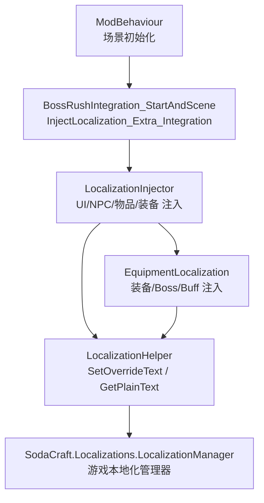
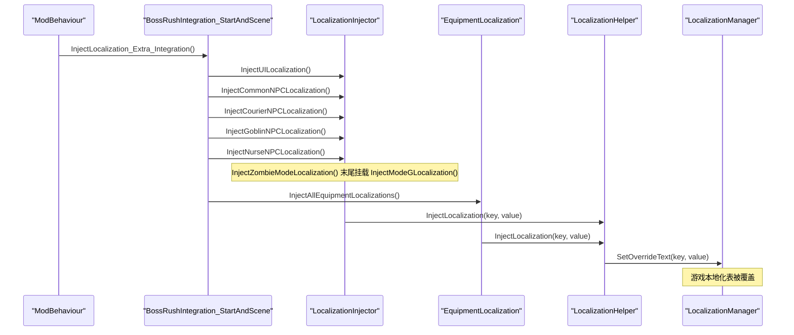
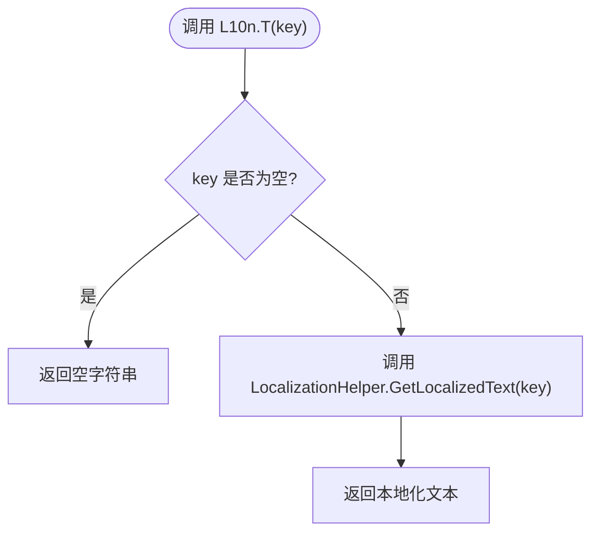
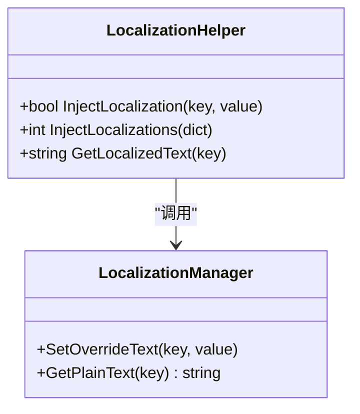
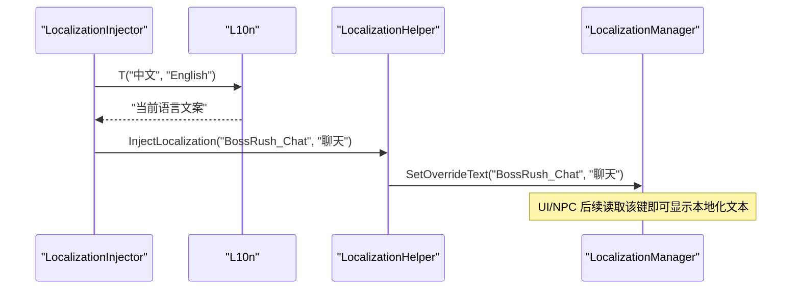
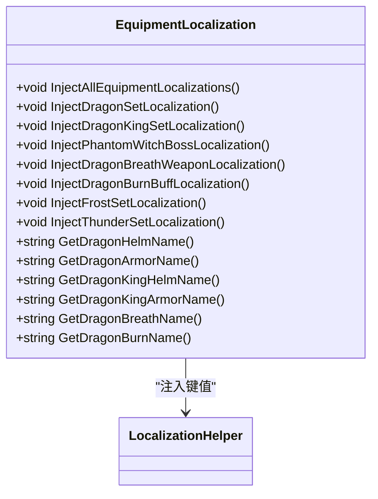
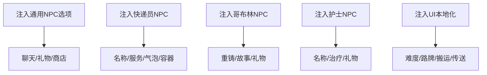
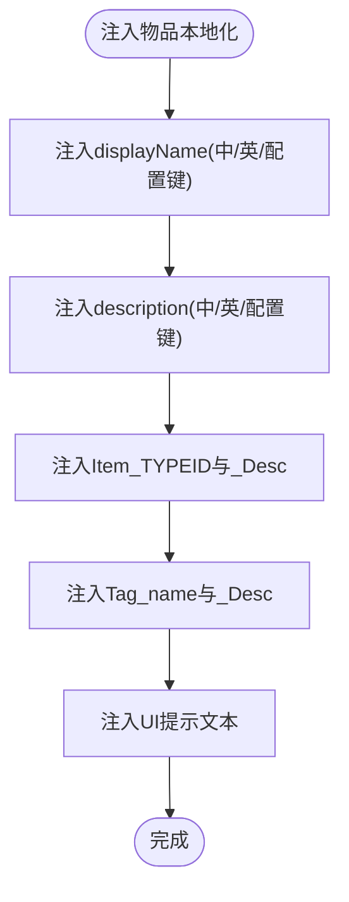
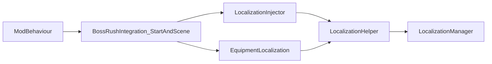

# 本地化系统

<cite>
**本文引用的文件**
- [L10n.cs](file://Localization/L10n.cs)
- [LocalizationHelper.cs](file://Localization/LocalizationHelper.cs)
- [LocalizationInjector.cs](file://Localization/LocalizationInjector.cs)
- [LocalizationInjector_NpcUiAndItems.cs](file://Localization/LocalizationInjector_NpcUiAndItems.cs)
- [EquipmentLocalization.cs](file://Localization/EquipmentLocalization.cs)
- [BossRushIntegration_StartAndScene.cs](file://Integration/BossRushIntegration_StartAndScene.cs)
- [ModBehaviour.cs](file://ModBehaviour.cs)
</cite>

## 目录
1. [简介](#简介)
2. [项目结构](#项目结构)
3. [核心组件](#核心组件)
4. [架构总览](#架构总览)
5. [详细组件分析](#详细组件分析)
6. [依赖关系分析](#依赖关系分析)
7. [性能考量](#性能考量)
8. [故障排查指南](#故障排查指南)
9. [结论](#结论)
10. [附录：添加新语言与翻译的工作流程](#附录添加新语言与翻译的工作流程)

## 简介
本模块为 BossRush Mod 提供完整的本地化能力，覆盖 UI、NPC 对话、物品描述、装备套装、Buff、地图名称等。其核心目标包括：
- 多语言支持：基于游戏内 LocalizationManager 的键值覆盖机制，实现运行时文本替换。
- 动态加载策略：在集成启动阶段集中注入所有本地化键值，确保 UI/NPC/物品等显示时可直接读取。
- 语言切换：通过检测当前游戏语言（中文/英文）选择对应文案；若未来需要运行时切换语言，可在现有键值体系上叠加覆盖。
- 统一 API：L10n 类提供便捷的多语言文本获取方法；LocalizationHelper 封装底层注入与读取；各 Injector 负责按领域批量注册键值。

## 项目结构
本地化子系统位于 Localization 目录，配合 Integration 层的启动编排，形成“定义—注入—使用”的分层结构：
- L10n.cs：语言判断与双语文案选择，暴露 T() 等便捷 API。
- LocalizationHelper.cs：对游戏官方 LocalizationManager 的薄封装，提供 InjectLocalization/GetLocalizedText。
- LocalizationInjector*.cs：按功能域（UI、NPC、物品、装备等）组织注入逻辑。
- EquipmentLocalization.cs：统一管理装备、Boss、Buff 的本地化注入。
- 启动入口：BossRushIntegration_StartAndScene.cs 在 Start_Integration 中调用 InjectLocalization_Extra_Integration，最终由 ModBehaviour 触发。

**图表来源**
- [ModBehaviour.cs:805-811](file://ModBehaviour.cs#L805-L811)
- [BossRushIntegration_StartAndScene.cs:20-50](file://Integration/BossRushIntegration_StartAndScene.cs#L20-L50)
- [LocalizationHelper.cs:21-40](file://Localization/LocalizationHelper.cs#L21-L40)

**章节来源**
- [BossRushIntegration_StartAndScene.cs:20-50](file://Integration/BossRushIntegration_StartAndScene.cs#L20-L50)
- [ModBehaviour.cs:805-811](file://ModBehaviour.cs#L805-L811)

## 核心组件
- L10n：语言检测与文案选择，提供 T(cn, en)、T(key)、Direction 等方法。
- LocalizationHelper：封装 SetOverrideText 与 GetPlainText，提供单条与批量注入。
- LocalizationInjector：按功能域组织注入逻辑，包含 UI、NPC、物品、地图名等。
- EquipmentLocalization：装备/Boss/Buff 的本地化集中管理。

**章节来源**
- [L10n.cs:20-115](file://Localization/L10n.cs#L20-L115)
- [LocalizationHelper.cs:16-80](file://Localization/LocalizationHelper.cs#L16-L80)
- [LocalizationInjector_NpcUiAndItems.cs:9-168](file://Localization/LocalizationInjector_NpcUiAndItems.cs#L9-L168)
- [EquipmentLocalization.cs:16-123](file://Localization/EquipmentLocalization.cs#L16-L123)

## 架构总览
本地化系统的运行流程如下：
1. 游戏启动后，ModBehaviour 在场景初始化时调用 InjectLocalization。
2. 实际注入委托给 BossRushIntegration_StartAndScene.InjectLocalization_Extra_Integration。
3. 该方法依次调用 LocalizationInjector 的各注入方法，以及 EquipmentLocalization 的统一注入。Mode G 的 `BossRush_ModeG_*` key 由 `InjectModeGLocalization()` 注入，挂载在运行时注入链成员 `InjectZombieModeLocalization()` 末尾（并在 `InjectAll` 中同步调用）。
4. 所有注入均通过 LocalizationHelper 调用游戏 LocalizationManager.SetOverrideText 完成键值覆盖。
5. 运行时任何地方通过 L10n.T(key) 或 LocalizationHelper.GetLocalizedText(key) 获取当前语言的文本。

**图表来源**
- [ModBehaviour.cs:805-811](file://ModBehaviour.cs#L805-L811)
- [BossRushIntegration_StartAndScene.cs:20-50](file://Integration/BossRushIntegration_StartAndScene.cs#L20-L50)
- [LocalizationHelper.cs:21-40](file://Localization/LocalizationHelper.cs#L21-L40)

## 详细组件分析

### L10n 类 API 与行为
- IsChinese：通过 LocalizationManager.CurrentLanguage 判断是否为中文（含简体/繁体）。
- T(cn, en)：根据当前语言返回中文或英文文案；支持空值保护。
- T(key)：通过 LocalizationHelper.GetLocalizedText 获取已注入的键值文本。
- Direction(cnDirection)：将中文方位映射为英文方向词，便于 UI 显示。

**图表来源**
- [L10n.cs:82-90](file://Localization/L10n.cs#L82-L90)
- [LocalizationHelper.cs:62-79](file://Localization/LocalizationHelper.cs#L62-L79)

**章节来源**
- [L10n.cs:42-115](file://Localization/L10n.cs#L42-L115)

### LocalizationHelper 注入与读取
- InjectLocalization(key, value)：调用 LocalizationManager.SetOverrideText 进行覆盖。
- InjectLocalizations(dict)：批量注入，统计成功数量。
- GetLocalizedText(key)：调用 LocalizationManager.GetPlainText 获取当前语言文本，失败时回退到 key。

**图表来源**
- [LocalizationHelper.cs:21-40](file://Localization/LocalizationHelper.cs#L21-L40)
- [LocalizationHelper.cs:42-79](file://Localization/LocalizationHelper.cs#L42-L79)

**章节来源**
- [LocalizationHelper.cs:16-80](file://Localization/LocalizationHelper.cs#L16-L80)

### LocalizationInjector 工作原理
- 职责：按功能域组织本地化键值注入，确保 UI、NPC、物品等在渲染前已有可用文本。
- 典型流程：
  - 使用 L10n.T(cn, en) 生成当前语言文案。
  - 调用 LocalizationHelper.InjectLocalization 将键值写入游戏本地化表。
  - 针对 NPC 首次见面、随机对话、容器标题、按钮文字等进行批量注入。
  - 为兼容不同来源的键（如原始 displayName、Item_ID、Tag_name），同时注册多个键。

**图表来源**
- [LocalizationInjector_NpcUiAndItems.cs:143-168](file://Localization/LocalizationInjector_NpcUiAndItems.cs#L143-L168)
- [LocalizationHelper.cs:21-40](file://Localization/LocalizationHelper.cs#L21-L40)

**章节来源**
- [LocalizationInjector_NpcUiAndItems.cs:9-168](file://Localization/LocalizationInjector_NpcUiAndItems.cs#L9-L168)

### 装备本地化的特殊处理
- EquipmentLocalization 统一管理龙套装、龙王套装、幽灵女巫、龙息武器、龙焰灼烧 Buff、冰霜/雷霆套装等的本地化。
- 注入策略：
  - 为每个装备/Boss/Buff 注册多组键：原始 displayName、配置键、Item_ID、Tag_name 等，确保不同来源都能正确显示。
  - 对套装效果、Buff 描述也进行本地化注入。
  - 提供 GetXxxName/GetXxxDescription 等便捷方法供其他模块使用。

**图表来源**
- [EquipmentLocalization.cs:16-123](file://Localization/EquipmentLocalization.cs#L16-L123)
- [EquipmentLocalization.cs:167-388](file://Localization/EquipmentLocalization.cs#L167-L388)
- [EquipmentLocalization.cs:460-560](file://Localization/EquipmentLocalization.cs#L460-L560)
- [EquipmentLocalization.cs:602-698](file://Localization/EquipmentLocalization.cs#L602-L698)

**章节来源**
- [EquipmentLocalization.cs:16-123](file://Localization/EquipmentLocalization.cs#L16-L123)
- [EquipmentLocalization.cs:167-388](file://Localization/EquipmentLocalization.cs#L167-L388)
- [EquipmentLocalization.cs:460-560](file://Localization/EquipmentLocalization.cs#L460-L560)
- [EquipmentLocalization.cs:602-698](file://Localization/EquipmentLocalization.cs#L602-L698)

### NPC 对话与 UI 本地化
- 通用 NPC 交互选项（聊天、赠送礼物、商店）：注入 BossRush_Chat/GiveGift/NPCShop 等键，并做二次自映射以避免显示 *Chat* / *聊天*。
- 快递员 NPC：注入名称、服务选项、气泡对话、容器标题、寄存服务等。
- 哥布林 NPC：重铸服务、故事对话、礼物容器 UI。
- 护士 NPC：名称、交互选项、礼物容器 UI、故事对话。
- UI 本地化：难度选项、路牌状态、搬运选项、传送、清理箱子、加油站、删除、下一波等。

**图表来源**
- [LocalizationInjector_NpcUiAndItems.cs:143-168](file://Localization/LocalizationInjector_NpcUiAndItems.cs#L143-L168)
- [LocalizationInjector_NpcUiAndItems.cs:12-138](file://Localization/LocalizationInjector_NpcUiAndItems.cs#L12-L138)
- [LocalizationInjector_NpcUiAndItems.cs:170-304](file://Localization/LocalizationInjector_NpcUiAndItems.cs#L170-L304)
- [LocalizationInjector_NpcUiAndItems.cs:306-345](file://Localization/LocalizationInjector_NpcUiAndItems.cs#L306-L345)
- [LocalizationInjector_NpcUiAndItems.cs:469-554](file://Localization/LocalizationInjector_NpcUiAndItems.cs#L469-L554)

**章节来源**
- [LocalizationInjector_NpcUiAndItems.cs:12-168](file://Localization/LocalizationInjector_NpcUiAndItems.cs#L12-L168)
- [LocalizationInjector_NpcUiAndItems.cs:170-345](file://Localization/LocalizationInjector_NpcUiAndItems.cs#L170-L345)
- [LocalizationInjector_NpcUiAndItems.cs:469-554](file://Localization/LocalizationInjector_NpcUiAndItems.cs#L469-L554)

### 物品描述的多语言支持
- 冷淬液、砖石、钻石、钻石戒指、安神滴剂、平安护身符等物品：
  - 注入 displayName/description 的中文/英文键。
  - 注入 Item_TYPEID 键及其 _Desc 键，确保游戏通过 ID 查找时能正确显示。
  - 注入 Tag_name 与 Tag_name_Desc，用于标签展示。
  - 注入 UI 提示文本（锁定提示、无液体提示、锁定成功提示等）。

**图表来源**
- [LocalizationInjector_NpcUiAndItems.cs:627-661](file://Localization/LocalizationInjector_NpcUiAndItems.cs#L627-L661)
- [LocalizationInjector_NpcUiAndItems.cs:663-717](file://Localization/LocalizationInjector_NpcUiAndItems.cs#L663-L717)
- [LocalizationInjector_NpcUiAndItems.cs:719-742](file://Localization/LocalizationInjector_NpcUiAndItems.cs#L719-L742)
- [LocalizationInjector_NpcUiAndItems.cs:744-765](file://Localization/LocalizationInjector_NpcUiAndItems.cs#L744-L765)
- [LocalizationInjector_NpcUiAndItems.cs:767-788](file://Localization/LocalizationInjector_NpcUiAndItems.cs#L767-L788)

**章节来源**
- [LocalizationInjector_NpcUiAndItems.cs:627-788](file://Localization/LocalizationInjector_NpcUiAndItems.cs#L627-L788)

## 依赖关系分析
- 启动依赖：ModBehaviour -> BossRushIntegration_StartAndScene -> LocalizationInjector/EquipmentLocalization。
- 运行时依赖：L10n -> LocalizationHelper -> LocalizationManager。
- 耦合度：
  - L10n 与 LocalizationHelper 低耦合，仅通过静态方法协作。
  - LocalizationInjector 与 EquipmentLocalization 解耦，分别负责不同领域。
  - 所有注入最终汇聚到 LocalizationManager，避免重复实现。

**图表来源**
- [ModBehaviour.cs:805-811](file://ModBehaviour.cs#L805-L811)
- [BossRushIntegration_StartAndScene.cs:20-50](file://Integration/BossRushIntegration_StartAndScene.cs#L20-L50)
- [LocalizationHelper.cs:21-40](file://Localization/LocalizationHelper.cs#L21-L40)

**章节来源**
- [BossRushIntegration_StartAndScene.cs:20-50](file://Integration/BossRushIntegration_StartAndScene.cs#L20-L50)
- [LocalizationHelper.cs:21-40](file://Localization/LocalizationHelper.cs#L21-L40)

## 性能考量
- 注入时机：在 Start_Integration 阶段集中注入，避免运行时频繁查找与解析。
- 批量注入：LocalizationHelper.InjectLocalizations 减少多次调用开销。
- 键值复用：为同一文本注册多个键（如原始 displayName、Item_ID、Tag_name），减少重复计算。
- 异常保护：注入与读取过程均有 try/catch，失败时记录日志并回退，避免阻塞主流程。

[本节为通用指导，不直接分析具体文件]

## 故障排查指南
- 注入失败：检查 LocalizationHelper.InjectLocalization 是否抛出异常，查看日志输出。
- 文本未显示：确认键值是否在注入阶段被正确注册；检查 UI/NPC/物品是否使用了正确的键。
- 语言不正确：确认 L10n.IsChinese 是否正确识别当前语言；必要时检查 LocalizationManager.CurrentLanguage。
- 运行时切换语言：如需运行时切换，可在语言变更事件后重新调用注入逻辑，覆盖旧键值。

**章节来源**
- [LocalizationHelper.cs:21-40](file://Localization/LocalizationHelper.cs#L21-L40)
- [LocalizationHelper.cs:62-79](file://Localization/LocalizationHelper.cs#L62-L79)
- [L10n.cs:42-64](file://Localization/L10n.cs#L42-L64)

## 结论
本本地化系统通过分层设计实现了清晰的职责划分：L10n 提供便捷 API，LocalizationHelper 封装底层注入，LocalizationInjector 与 EquipmentLocalization 按领域组织注入逻辑。启动阶段集中注入确保了 UI/NPC/物品的即时显示，键值复用与异常保护提升了稳定性与可维护性。未来扩展新语言或新增内容时，只需遵循现有模式注册键值即可。

[本节为总结，不直接分析具体文件]

## 附录：添加新语言与翻译的工作流程
- 新增文案：
  - 在 L10n.T(cn, en) 中添加双语文案，或使用 L10n.T(key) 从已注入键值获取。
  - 对于 UI/NPC/物品，使用 LocalizationHelper.InjectLocalization 注册键值。
- 新增内容：
  - 在对应的 Injector 或 EquipmentLocalization 中添加注入方法，注册 displayName、description、Item_ID、Tag_name 等键。
- 验证：
  - 启动游戏后检查 UI/NPC/物品是否正确显示。
  - 切换语言后确认文本更新。
- 运行时切换（可选）：
  - 监听语言变更事件，重新调用注入逻辑以覆盖旧键值。

[本节为操作指导，不直接分析具体文件]