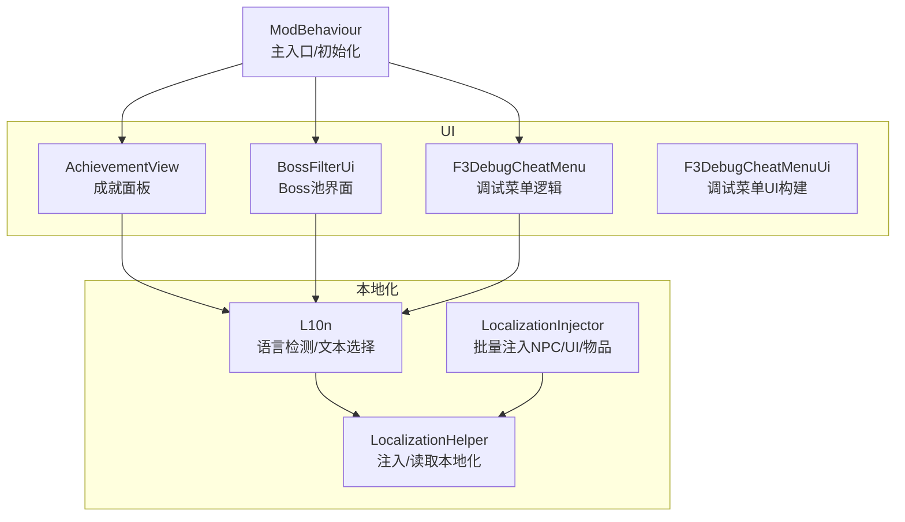
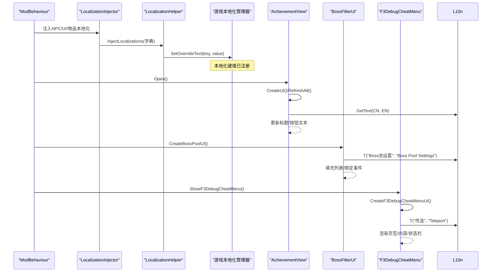
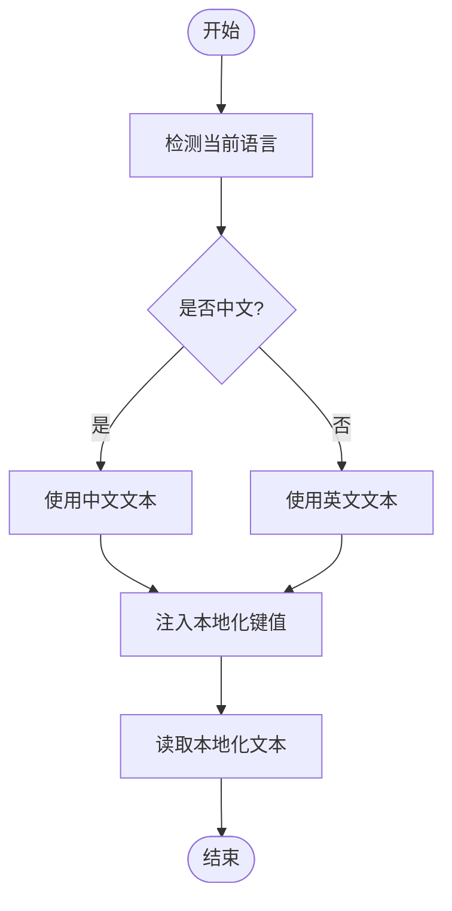
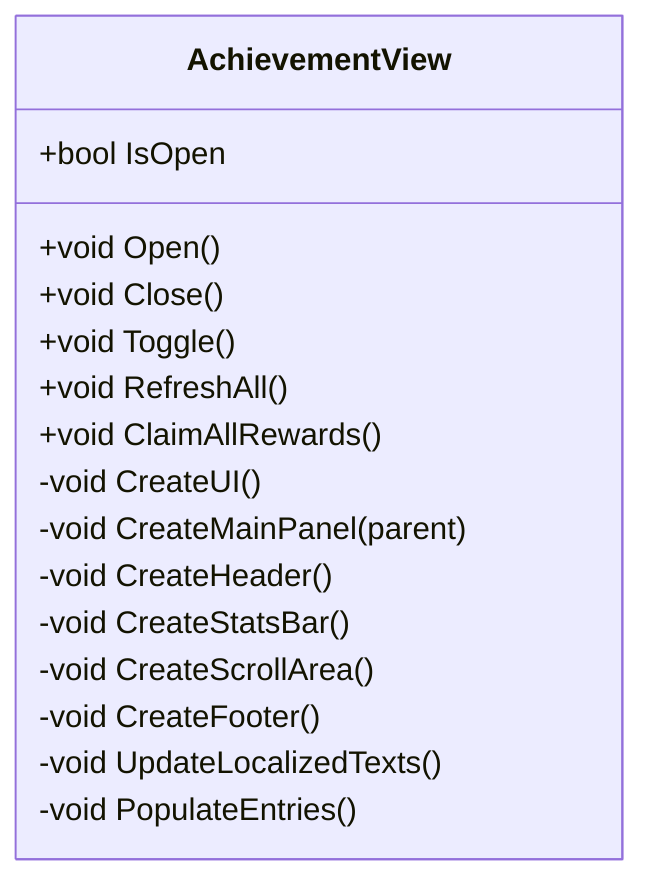
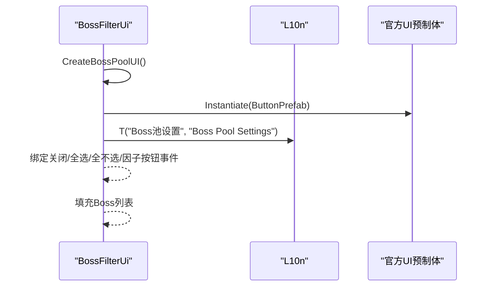
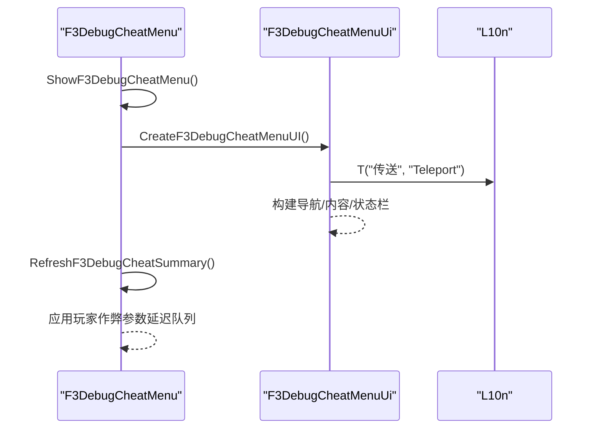
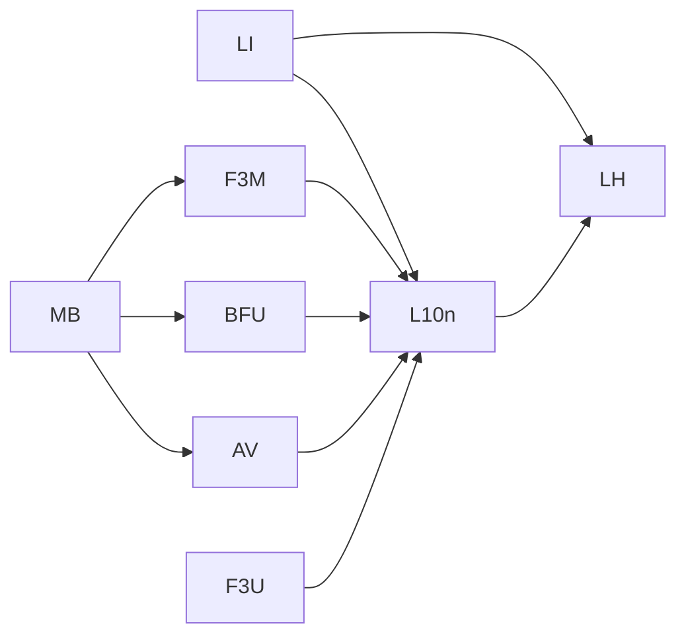

# 用户界面与本地化

<cite>
**本文引用的文件**
- [L10n.cs](file://Localization/L10n.cs)
- [LocalizationHelper.cs](file://Localization/LocalizationHelper.cs)
- [LocalizationInjector_NpcUiAndItems.cs](file://Localization/LocalizationInjector_NpcUiAndItems.cs)
- [AchievementView.cs](file://Achievement/AchievementView.cs)
- [AchievementUIStrings.cs](file://Achievement/AchievementUIStrings.cs)
- [BossFilterUi.cs](file://BossFilter/BossFilterUi.cs)
- [F3DebugCheatMenu.cs](file://DebugAndTools/F3DebugCheatMenu.cs)
- [F3DebugCheatMenuUi.cs](file://DebugAndTools/F3DebugCheatMenuUi.cs)
- [ModBehaviour.cs](file://ModBehaviour.cs)
</cite>

## 目录
1. [简介](#简介)
2. [项目结构](#项目结构)
3. [核心组件](#核心组件)
4. [架构总览](#架构总览)
5. [详细组件分析](#详细组件分析)
6. [依赖关系分析](#依赖关系分析)
7. [性能考虑](#性能考虑)
8. [故障排查指南](#故障排查指南)
9. [结论](#结论)
10. [附录：开发与扩展指南](#附录开发与扩展指南)

## 简介
本模块文档聚焦于游戏内 UI 集成方案与本地化系统，覆盖成就面板、BossFilter 界面、调试菜单的实现；详细说明多语言支持机制、文本替换系统、动态加载策略；解释 UI 组件生命周期管理、事件处理、响应式设计；并给出本地化文件的组织结构、翻译工作流程与语言切换机制，以及 UI 扩展和本地化的开发指南。

## 项目结构
围绕 UI 与本地化的关键目录与职责如下：
- Localization：提供统一的本地化工具与注入器，负责将键值注入到游戏官方本地化管理器中，并提供便捷的语言检测与文本获取方法。
- Achievement：实现成就系统的 UI 视图与字符串资源，包含页面容器、滚动列表、统计栏、一键领取等。
- BossFilter：实现 Boss 池筛选界面的创建与交互（Canvas、面板、工具栏、滚动列表、底部按钮）。
- DebugAndTools：实现 F3 调试作弊菜单的完整 UI 与逻辑控制（多页签、输入框、状态栏、场景调试等）。
- ModBehaviour：作为主入口，负责初始化各运行时模块与 UI 相关流程。

**图表来源**
- [L10n.cs:23-90](file://Localization/L10n.cs#L23-L90)
- [LocalizationHelper.cs:21-79](file://Localization/LocalizationHelper.cs#L21-L79)
- [LocalizationInjector_NpcUiAndItems.cs:469-554](file://Localization/LocalizationInjector_NpcUiAndItems.cs#L469-L554)
- [AchievementView.cs:148-193](file://Achievement/AchievementView.cs#L148-L193)
- [BossFilterUi.cs:14-73](file://BossFilter/BossFilterUi.cs#L14-L73)
- [F3DebugCheatMenu.cs:184-232](file://DebugAndTools/F3DebugCheatMenu.cs#L184-L232)
- [F3DebugCheatMenuUi.cs:22-200](file://DebugAndTools/F3DebugCheatMenuUi.cs#L22-L200)
- [ModBehaviour.cs:598-620](file://ModBehaviour.cs#L598-L620)

**章节来源**
- [ModBehaviour.cs:598-620](file://ModBehaviour.cs#L598-L620)

## 核心组件
- 本地化工具层
  - L10n：提供 IsChinese、T(cn, en)、Direction 等方法，封装当前语言判断与双语文本选择。
  - LocalizationHelper：通过游戏官方 API 注入和读取本地化键值，提供单条与批量注入能力。
  - LocalizationInjector：集中注入 NPC、UI、物品等大量本地化键值，确保显示文本统一由本地化系统管理。
- UI 视图层
  - AchievementView：成就面板主视图，负责 Canvas、面板、头部、统计栏、滚动区域、底部区域的创建与刷新。
  - BossFilterUi：Boss 池设置界面，使用官方 Prefab 复用 Button/ScrollRect，构建半透明背景、标题栏、工具栏、滚动列表、统计信息、底部按钮。
  - F3DebugCheatMenu / F3DebugCheatMenuUi：调试菜单逻辑与 UI 构建分离，支持多页签导航、输入框、状态栏、摘要刷新、场景调试。
- 入口与生命周期
  - ModBehaviour：Awake 中注册运行时模块、初始化调试工具与成就系统，OnGUI/Update 中驱动 UI 与运行时逻辑。

**章节来源**
- [L10n.cs:23-90](file://Localization/L10n.cs#L23-L90)
- [LocalizationHelper.cs:21-79](file://Localization/LocalizationHelper.cs#L21-L79)
- [LocalizationInjector_NpcUiAndItems.cs:469-554](file://Localization/LocalizationInjector_NpcUiAndItems.cs#L469-L554)
- [AchievementView.cs:148-193](file://Achievement/AchievementView.cs#L148-L193)
- [BossFilterUi.cs:14-73](file://BossFilter/BossFilterUi.cs#L14-L73)
- [F3DebugCheatMenu.cs:184-232](file://DebugAndTools/F3DebugCheatMenu.cs#L184-L232)
- [F3DebugCheatMenuUi.cs:22-200](file://DebugAndTools/F3DebugCheatMenuUi.cs#L22-L200)
- [ModBehaviour.cs:598-620](file://ModBehaviour.cs#L598-L620)

## 架构总览
本地化与 UI 的协作遵循“数据与展示分离”的原则：
- 本地化数据通过 LocalizationInjector 在启动阶段注入到游戏本地化管理器。
- UI 组件通过 L10n.T 或 AchievementUIStrings.GetText 获取当前语言对应的文本。
- UI 构建时优先使用官方 Prefab（Button、ScrollRect），保证风格一致性与可维护性。
- 调试菜单采用“逻辑与 UI 构建解耦”，便于扩展与维护。

**图表来源**
- [LocalizationInjector_NpcUiAndItems.cs:469-554](file://Localization/LocalizationInjector_NpcUiAndItems.cs#L469-L554)
- [LocalizationHelper.cs:21-79](file://Localization/LocalizationHelper.cs#L21-L79)
- [AchievementView.cs:607-669](file://Achievement/AchievementView.cs#L607-L669)
- [BossFilterUi.cs:14-73](file://BossFilter/BossFilterUi.cs#L14-L73)
- [F3DebugCheatMenu.cs:184-232](file://DebugAndTools/F3DebugCheatMenu.cs#L184-L232)
- [F3DebugCheatMenuUi.cs:22-200](file://DebugAndTools/F3DebugCheatMenuUi.cs#L22-L200)

## 详细组件分析

### 本地化子系统
- 语言检测与文本选择
  - L10n.IsChinese：基于游戏 LocalizationManager.CurrentLanguage 判断是否为中文。
  - L10n.T(cn, en)：根据当前语言返回对应文本；当任一为空时回退到非空项。
  - L10n.Direction：方位名称映射，英文环境下自动转换为英文方向名。
- 本地化注入与读取
  - LocalizationHelper.InjectLocalization：调用游戏官方 API 注入单个键值。
  - LocalizationHelper.InjectLocalizations：批量注入，返回成功数量。
  - LocalizationHelper.GetLocalizedText：读取本地化文本，未找到时返回键本身。
- 批量注入组织
  - LocalizationInjector 提供多个 InjectXxx 方法，按 NPC、UI、物品分类注入，确保所有显示文本走统一本地化通道。

**图表来源**
- [L10n.cs:42-90](file://Localization/L10n.cs#L42-L90)
- [LocalizationHelper.cs:21-79](file://Localization/LocalizationHelper.cs#L21-L79)
- [LocalizationInjector_NpcUiAndItems.cs:469-554](file://Localization/LocalizationInjector_NpcUiAndItems.cs#L469-L554)

**章节来源**
- [L10n.cs:23-90](file://Localization/L10n.cs#L23-L90)
- [LocalizationHelper.cs:21-79](file://Localization/LocalizationHelper.cs#L21-L79)
- [LocalizationInjector_NpcUiAndItems.cs:469-554](file://Localization/LocalizationInjector_NpcUiAndItems.cs#L469-L554)

### 成就面板（AchievementView）
- 生命周期
  - EnsureInstance：单例创建与持久化。
  - Awake：计算面板尺寸、创建 UI、默认关闭。
  - OnDestroy：清理单例引用。
- UI 构建
  - CreateUI：创建 Canvas、背景、主面板、头部、统计栏、滚动区域、底部区域。
  - CreateScrollArea：优先使用官方 ScrollRect prefab，否则手动创建 Viewport/Content/布局组件。
- 交互与刷新
  - Open/Close/Toggle：打开/关闭/切换面板，禁用/恢复输入。
  - RefreshAll：更新本地化文本、填充条目、更新统计、更新一键领取按钮状态。
  - ClaimAllRewards：遍历可领取成就，调用管理器领取奖励，反馈通知并刷新。

**图表来源**
- [AchievementView.cs:104-193](file://Achievement/AchievementView.cs#L104-L193)
- [AchievementView.cs:607-727](file://Achievement/AchievementView.cs#L607-L727)

**章节来源**
- [AchievementView.cs:104-193](file://Achievement/AchievementView.cs#L104-L193)
- [AchievementView.cs:607-727](file://Achievement/AchievementView.cs#L607-L727)

### BossFilter 界面（BossFilterUi）
- 创建流程
  - CreateBossPoolUI：创建 Canvas、背景、主面板、标题栏、工具栏、滚动列表、统计信息、底部按钮，并填充 Boss 列表。
  - CreateTitleBar：标题文本使用 L10n.T，关闭按钮使用官方 Button prefab。
  - CreateToolbar：全选/全不选/无间炼狱因子按钮，均使用官方 Button prefab，并绑定点击事件。
- 响应式与布局
  - 使用 RectTransform 锚点与偏移进行居中与自适应。
  - 使用 HorizontalLayoutGroup 排列工具栏元素。

**图表来源**
- [BossFilterUi.cs:14-73](file://BossFilter/BossFilterUi.cs#L14-L73)
- [BossFilterUi.cs:78-125](file://BossFilter/BossFilterUi.cs#L78-L125)
- [BossFilterUi.cs:127-183](file://BossFilter/BossFilterUi.cs#L127-L183)

**章节来源**
- [BossFilterUi.cs:14-73](file://BossFilter/BossFilterUi.cs#L14-L73)
- [BossFilterUi.cs:78-125](file://BossFilter/BossFilterUi.cs#L78-L125)
- [BossFilterUi.cs:127-183](file://BossFilter/BossFilterUi.cs#L127-L183)

### 调试菜单（F3DebugCheatMenu / F3DebugCheatMenuUi）
- 逻辑控制（F3DebugCheatMenu）
  - CheckF3DebugCheatMenuHotkey：监听 F3 键切换菜单可见性。
  - TickF3DebugCheatMenu：ESC 隐藏、摘要定时刷新、玩家作弊参数应用队列。
  - Show/Hide：捕获/恢复呈现状态（时间缩放、光标可见性、锁定状态），禁用/启用输入。
- UI 构建（F3DebugCheatMenuUi）
  - CreateF3DebugCheatMenuUI：创建 Canvas、背景、面板、标题、关闭按钮、摘要、导航面板、内容区、状态栏。
  - BuildF3*Page：按页签构建不同功能区域（传送、玩家属性、资源与物品、战斗流程、NPC/剧情、场景调试）。
  - 输入与操作：InputField、预设按钮、动作按钮，全部使用本地化文本。

**图表来源**
- [F3DebugCheatMenu.cs:107-142](file://DebugAndTools/F3DebugCheatMenu.cs#L107-L142)
- [F3DebugCheatMenu.cs:184-232](file://DebugAndTools/F3DebugCheatMenu.cs#L184-L232)
- [F3DebugCheatMenuUi.cs:22-200](file://DebugAndTools/F3DebugCheatMenuUi.cs#L22-L200)
- [F3DebugCheatMenuUi.cs:256-298](file://DebugAndTools/F3DebugCheatMenuUi.cs#L256-L298)

**章节来源**
- [F3DebugCheatMenu.cs:107-142](file://DebugAndTools/F3DebugCheatMenu.cs#L107-L142)
- [F3DebugCheatMenu.cs:184-232](file://DebugAndTools/F3DebugCheatMenu.cs#L184-L232)
- [F3DebugCheatMenuUi.cs:22-200](file://DebugAndTools/F3DebugCheatMenuUi.cs#L22-L200)
- [F3DebugCheatMenuUi.cs:256-298](file://DebugAndTools/F3DebugCheatMenuUi.cs#L256-L298)

## 依赖关系分析
- 本地化依赖
  - L10n 依赖游戏 LocalizationManager 获取当前语言。
  - LocalizationHelper 依赖游戏官方 API 注入/读取本地化。
  - LocalizationInjector 依赖 L10n 与 LocalizationHelper 完成批量注入。
- UI 依赖
  - AchievementView、BossFilterUi、F3DebugCheatMenuUi 均依赖 L10n 获取本地化文本。
  - UI 构建优先使用官方 Prefab（Button、ScrollRect），降低样式不一致风险。
- 入口依赖
  - ModBehaviour 在 Awake 中初始化成就系统与调试工具，驱动 UI 生命周期。

**图表来源**
- [L10n.cs:23-90](file://Localization/L10n.cs#L23-L90)
- [LocalizationHelper.cs:21-79](file://Localization/LocalizationHelper.cs#L21-L79)
- [LocalizationInjector_NpcUiAndItems.cs:469-554](file://Localization/LocalizationInjector_NpcUiAndItems.cs#L469-L554)
- [AchievementView.cs:148-193](file://Achievement/AchievementView.cs#L148-L193)
- [BossFilterUi.cs:14-73](file://BossFilter/BossFilterUi.cs#L14-L73)
- [F3DebugCheatMenu.cs:184-232](file://DebugAndTools/F3DebugCheatMenu.cs#L184-L232)
- [F3DebugCheatMenuUi.cs:22-200](file://DebugAndTools/F3DebugCheatMenuUi.cs#L22-L200)
- [ModBehaviour.cs:598-620](file://ModBehaviour.cs#L598-L620)

**章节来源**
- [L10n.cs:23-90](file://Localization/L10n.cs#L23-L90)
- [LocalizationHelper.cs:21-79](file://Localization/LocalizationHelper.cs#L21-L79)
- [LocalizationInjector_NpcUiAndItems.cs:469-554](file://Localization/LocalizationInjector_NpcUiAndItems.cs#L469-L554)
- [AchievementView.cs:148-193](file://Achievement/AchievementView.cs#L148-L193)
- [BossFilterUi.cs:14-73](file://BossFilter/BossFilterUi.cs#L14-L73)
- [F3DebugCheatMenu.cs:184-232](file://DebugAndTools/F3DebugCheatMenu.cs#L184-L232)
- [F3DebugCheatMenuUi.cs:22-200](file://DebugAndTools/F3DebugCheatMenuUi.cs#L22-L200)
- [ModBehaviour.cs:598-620](file://ModBehaviour.cs#L598-L620)

## 性能考虑
- 本地化注入时机
  - 建议在启动阶段批量注入，避免运行时频繁调用 SetOverrideText。
  - 使用批量注入接口减少多次 API 调用开销。
- UI 构建优化
  - 优先使用官方 Prefab，减少自定义样式带来的渲染差异与额外组件。
  - 使用 LayoutGroup 与 ContentSizeFitter 自动适配内容高度，减少手动计算。
  - 滚动区域使用官方 ScrollRect prefab，并确保 Mask 与 Viewport 正确配置以避免裁剪问题。
- 调试菜单
  - 摘要刷新使用 unscaledTime 间隔，避免卡顿影响。
  - 玩家作弊参数应用采用延迟队列，避免每帧重复计算。

[本节为通用指导，无需具体文件来源]

## 故障排查指南
- 本地化未生效
  - 检查是否在启动阶段调用了 LocalizationInjector 的注入方法。
  - 确认键值是否正确且唯一，避免覆盖冲突。
  - 使用 LocalizationHelper.GetLocalizedText 验证读取结果。
- UI 无法显示或交互异常
  - 检查 Canvas 的 renderMode 与 sortingOrder，确保位于合适层级。
  - 确认 Button/ScrollRect 等官方 Prefab 可用，若不可用则回退到手动创建。
  - 检查事件绑定是否成功，必要时添加日志输出。
- 调试菜单打开失败
  - 检查 DevModeEnabled 标志，仅在开发者模式下允许打开。
  - 捕获异常并恢复呈现状态（时间缩放、光标可见性、锁定状态）。
  - 确认 InputManager 的禁用/启用逻辑正确执行。

**章节来源**
- [LocalizationHelper.cs:21-79](file://Localization/LocalizationHelper.cs#L21-L79)
- [AchievementView.cs:148-193](file://Achievement/AchievementView.cs#L148-L193)
- [BossFilterUi.cs:14-73](file://BossFilter/BossFilterUi.cs#L14-L73)
- [F3DebugCheatMenu.cs:184-232](file://DebugAndTools/F3DebugCheatMenu.cs#L184-L232)

## 结论
该项目的 UI 与本地化系统以“数据与展示分离”为核心，通过统一的本地化工具层与批量注入机制，确保所有显示文本在多语言环境下一致且可维护。UI 组件采用官方 Prefab 与响应式布局，提升兼容性与可维护性。调试菜单将逻辑与 UI 构建解耦，便于扩展与维护。整体架构清晰、职责明确，适合进一步扩展新的 UI 功能与本地化内容。

[本节为总结，无需具体文件来源]

## 附录：开发与扩展指南
- 新增本地化文本
  - 在 LocalizationInjector 中添加新的 InjectXxx 方法，使用 L10n.T 生成双语文本并批量注入。
  - 确保键值命名规范，避免与现有键冲突。
- 新增 UI 组件
  - 优先使用官方 Prefab（Button、ScrollRect），并通过 RectTransform 进行布局。
  - 使用 L10n.T 或 AchievementUIStrings.GetText 获取本地化文本。
  - 在 Awake/Start 中创建 UI，并在 OnDestroy 中清理资源。
- 事件处理与生命周期
  - 使用 Unity 的事件系统（onClick 等）绑定交互。
  - 在 Open/Close 中禁用/启用输入，避免与游戏输入冲突。
  - 使用单例模式管理全局 UI（如 AchievementView），确保唯一实例。
- 响应式设计
  - 使用 CanvasScaler 的 ScaleWithScreenSize 模式，参考分辨率设置为 1920x1080。
  - 使用 LayoutGroup 与 ContentSizeFitter 自动适配内容大小。
  - 对于复杂滚动区域，确保 Mask 与 Viewport 正确配置，避免内容被裁剪。

[本节为通用指导，无需具体文件来源]