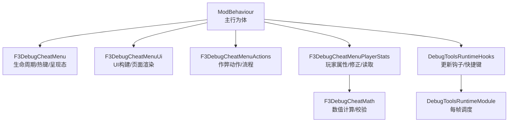
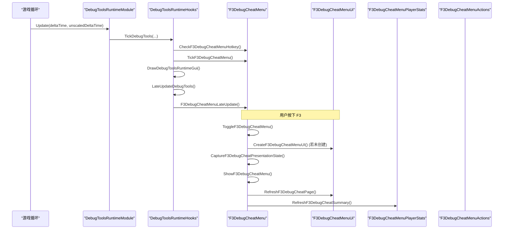
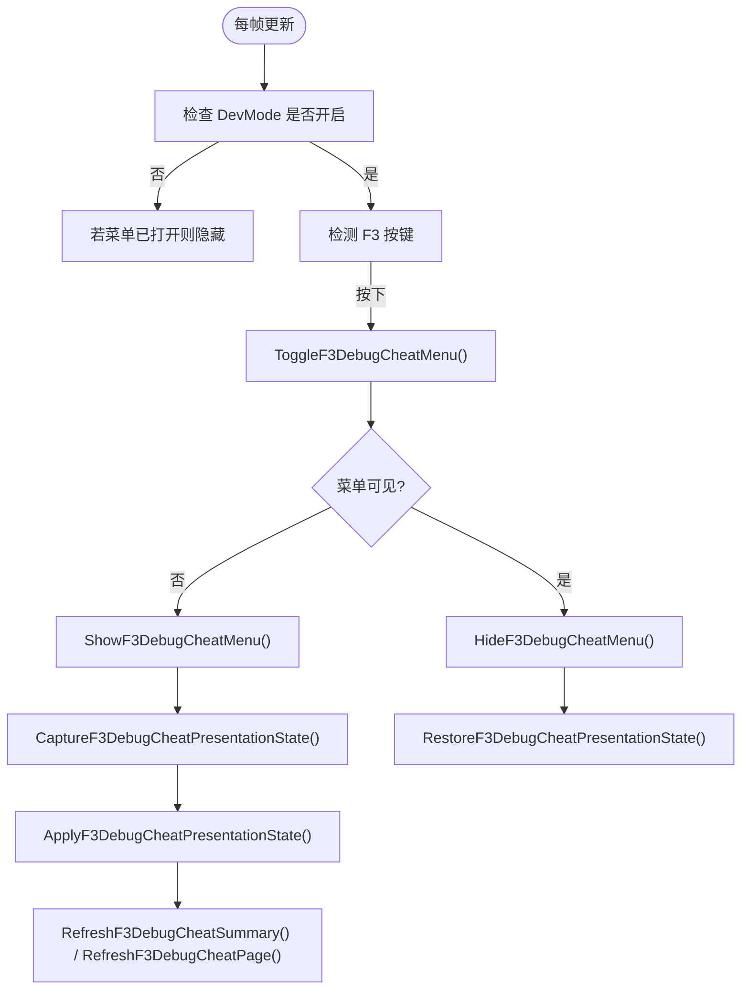
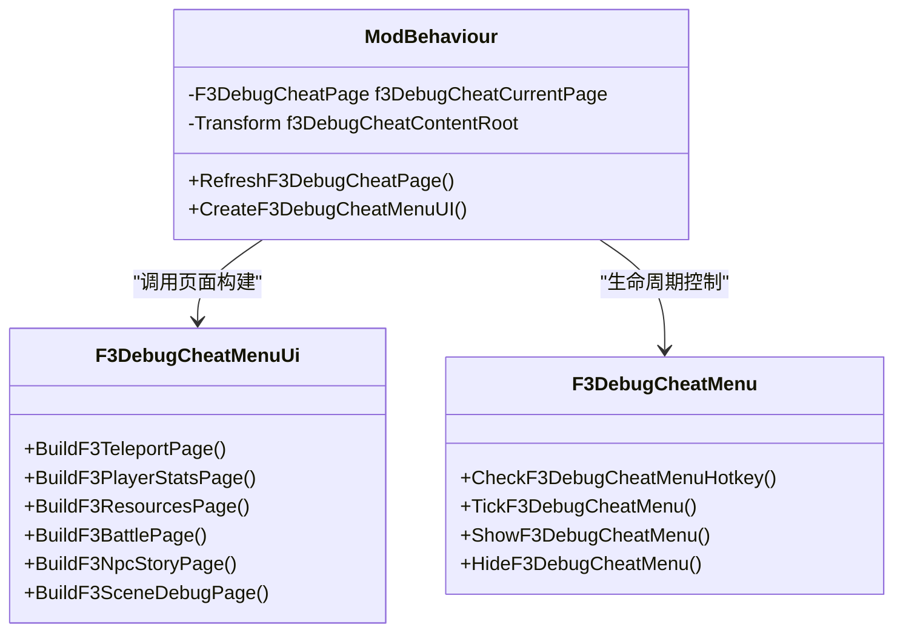
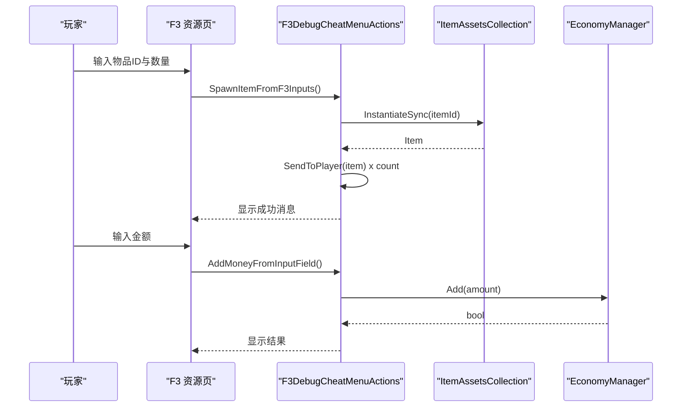
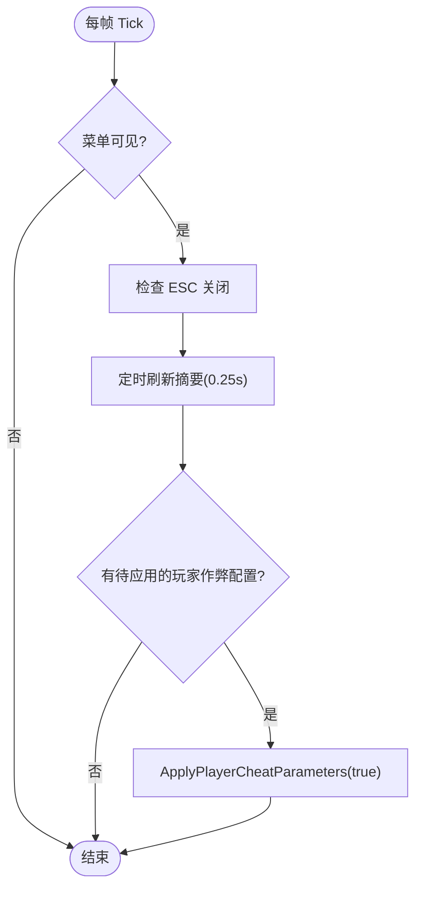
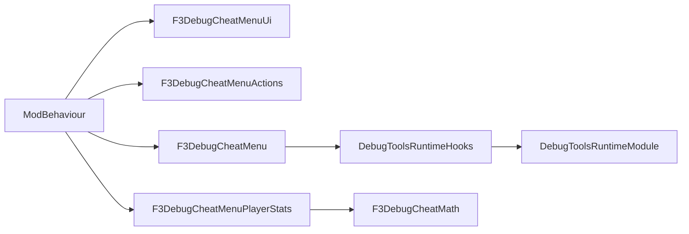

# 调试菜单系统

<cite>
**本文引用的文件**
- [F3DebugCheatMenu.cs](file://DebugAndTools/F3DebugCheatMenu.cs)
- [F3DebugCheatMenuActions.cs](file://DebugAndTools/F3DebugCheatMenuActions.cs)
- [F3DebugCheatMenuPlayerStats.cs](file://DebugAndTools/F3DebugCheatMenuPlayerStats.cs)
- [F3DebugCheatMenuUi.cs](file://DebugAndTools/F3DebugCheatMenuUi.cs)
- [DebugToolsRuntimeHooks.cs](file://DebugAndTools/DebugToolsRuntimeHooks.cs)
- [DebugToolsRuntimeModule.cs](file://DebugAndTools/DebugToolsRuntimeModule.cs)
- [F3DebugCheatMath.cs](file://Utilities/F3DebugCheatMath.cs)
</cite>

## 目录
1. [简介](#简介)
2. [项目结构](#项目结构)
3. [核心组件](#核心组件)
4. [架构总览](#架构总览)
5. [详细组件分析](#详细组件分析)
6. [依赖关系分析](#依赖关系分析)
7. [性能考量](#性能考量)
8. [故障排查指南](#故障排查指南)
9. [结论](#结论)
10. [附录：开发者扩展指南](#附录开发者扩展指南)

## 简介
本文件系统化说明 F3 调试菜单的整体架构与实现，覆盖菜单注册、页面切换、输入处理、作弊功能（物品生成、状态修改、性能监控）、玩家统计显示与实时更新机制、UI 构建与样式定制、响应式布局，以及开发者添加新调试功能的最佳实践。该调试菜单以运行时动态 UI 形式存在，通过快捷键 F3 打开，并在 DevMode 开启时生效。

## 项目结构
调试菜单相关代码集中在 DebugAndTools 目录下，按职责拆分为多个 partial 类与工具类：
- 生命周期与热键：F3DebugCheatMenu.cs、DebugToolsRuntimeHooks.cs、DebugToolsRuntimeModule.cs
- UI 构建与页面：F3DebugCheatMenuUi.cs
- 作弊动作与流程控制：F3DebugCheatMenuActions.cs
- 玩家属性与数值修正：F3DebugCheatMenuPlayerStats.cs
- 数学工具：F3DebugCheatMath.cs

图表来源
- [F3DebugCheatMenu.cs:16-105](file://DebugAndTools/F3DebugCheatMenu.cs#L16-L105)
- [F3DebugCheatMenuUi.cs:22-199](file://DebugAndTools/F3DebugCheatMenuUi.cs#L22-L199)
- [F3DebugCheatMenuActions.cs:24-195](file://DebugAndTools/F3DebugCheatMenuActions.cs#L24-L195)
- [F3DebugCheatMenuPlayerStats.cs:22-126](file://DebugAndTools/F3DebugCheatMenuPlayerStats.cs#L22-L126)
- [DebugToolsRuntimeHooks.cs:23-38](file://DebugAndTools/DebugToolsRuntimeHooks.cs#L23-L38)
- [DebugToolsRuntimeModule.cs:17-35](file://DebugAndTools/DebugToolsRuntimeModule.cs#L17-L35)
- [F3DebugCheatMath.cs:5-18](file://Utilities/F3DebugCheatMath.cs#L5-L18)

章节来源
- [F3DebugCheatMenu.cs:16-105](file://DebugAndTools/F3DebugCheatMenu.cs#L16-L105)
- [DebugToolsRuntimeHooks.cs:23-38](file://DebugAndTools/DebugToolsRuntimeHooks.cs#L23-L38)
- [DebugToolsRuntimeModule.cs:17-35](file://DebugAndTools/DebugToolsRuntimeModule.cs#L17-L35)

## 核心组件
- 生命周期与呈现态管理：负责 F3 热键检测、菜单显示/隐藏、暂停游戏时间、光标锁定、输入拦截与恢复。
- UI 构建与页面：动态创建 Canvas、面板、导航按钮、滚动内容区；根据当前页渲染不同功能区。
- 作弊动作：提供传送、满血、发物品、加钱、清冷却、强制清场、触发通关、地图选择、放置模式切换等。
- 玩家属性与修正：读取并展示当前玩家属性，支持对 MaxHealth、GunDamageMultiplier、MeleeDamageMultiplier、HeadArmor、BodyArmor 的倍率或绝对值覆盖，并通过运行时 Stat Modifier 应用。
- 运行时钩子：在 Update/LateUpdate 中统一调度调试工具逻辑，包括 FPS 计数、场景调试、F3 菜单热键检查与 tick。
- 数学工具：对倍率进行安全裁剪，计算加法修正量。

章节来源
- [F3DebugCheatMenu.cs:107-152](file://DebugAndTools/F3DebugCheatMenu.cs#L107-L152)
- [F3DebugCheatMenuUi.cs:22-199](file://DebugAndTools/F3DebugCheatMenuUi.cs#L22-L199)
- [F3DebugCheatMenuActions.cs:24-195](file://DebugAndTools/F3DebugCheatMenuActions.cs#L24-L195)
- [F3DebugCheatMenuPlayerStats.cs:22-126](file://DebugAndTools/F3DebugCheatMenuPlayerStats.cs#L22-L126)
- [DebugToolsRuntimeHooks.cs:23-38](file://DebugAndTools/DebugToolsRuntimeHooks.cs#L23-L38)
- [F3DebugCheatMath.cs:5-18](file://Utilities/F3DebugCheatMath.cs#L5-L18)

## 架构总览
F3 调试菜单采用“单例行为体 + 多 partial 类”的组织方式，将生命周期、UI、动作、属性修正解耦到不同文件，便于维护与扩展。运行时由 DebugToolsRuntimeModule 每帧调用 ModBehaviour 的调试更新方法，集中处理热键与菜单 tick。

图表来源
- [DebugToolsRuntimeModule.cs:17-35](file://DebugAndTools/DebugToolsRuntimeModule.cs#L17-L35)
- [DebugToolsRuntimeHooks.cs:23-38](file://DebugAndTools/DebugToolsRuntimeHooks.cs#L23-L38)
- [F3DebugCheatMenu.cs:107-152](file://DebugAndTools/F3DebugCheatMenu.cs#L107-L152)
- [F3DebugCheatMenuUi.cs:22-199](file://DebugAndTools/F3DebugCheatMenuUi.cs#L22-L199)
- [F3DebugCheatMenuPlayerStats.cs:37-71](file://DebugAndTools/F3DebugCheatMenuPlayerStats.cs#L37-L71)

## 详细组件分析

### 菜单注册与生命周期
- 热键检测：每帧检查是否按下 F3，仅在 DevModeEnabled 时允许打开/关闭菜单。
- 呈现态捕获与恢复：打开菜单时冻结 Time.timeScale、显示光标、解锁鼠标；关闭时恢复之前的呈现态。
- 输入拦截：使用 InputManager 禁用/启用游戏内输入，避免菜单与游戏操作冲突。
- 场景加载回调：场景加载后移除玩家作弊修饰符并排队应用参数，确保状态一致性。

图表来源
- [F3DebugCheatMenu.cs:107-152](file://DebugAndTools/F3DebugCheatMenu.cs#L107-L152)
- [F3DebugCheatMenu.cs:172-291](file://DebugAndTools/F3DebugCheatMenu.cs#L172-L291)

章节来源
- [F3DebugCheatMenu.cs:107-152](file://DebugAndTools/F3DebugCheatMenu.cs#L107-L152)
- [F3DebugCheatMenu.cs:172-291](file://DebugAndTools/F3DebugCheatMenu.cs#L172-L291)
- [DebugToolsRuntimeHooks.cs:23-38](file://DebugAndTools/DebugToolsRuntimeHooks.cs#L23-L38)

### 页面切换与导航
- 导航页枚举：Teleport、PlayerStats、Resources、Battle、NpcStory、SceneDebug。
- 导航按钮：左侧垂直布局，点击切换 f3DebugCheatCurrentPage，并刷新内容区。
- 内容区：ScrollRect + Mask + ContentSizeFitter，自动高度适配，支持纵向滚动。
- 页面构建：每个页面通过 BuildF3XxxPage 方法动态创建 Section、Row、Button、InputField 等控件。

图表来源
- [F3DebugCheatMenu.cs:18-84](file://DebugAndTools/F3DebugCheatMenu.cs#L18-L84)
- [F3DebugCheatMenuUi.cs:239-298](file://DebugAndTools/F3DebugCheatMenuUi.cs#L239-L298)

章节来源
- [F3DebugCheatMenuUi.cs:239-298](file://DebugAndTools/F3DebugCheatMenuUi.cs#L239-L298)
- [F3DebugCheatMenu.cs:18-84](file://DebugAndTools/F3DebugCheatMenu.cs#L18-L84)

### 输入处理与交互
- 输入字段：为物品 ID、数量、金额、倍率、护甲覆盖等提供 InputField，带占位提示与文本对齐。
- 预设按钮：快速设置常用倍率或护甲值，减少手动输入。
- 按钮动作：每个按钮绑定 UnityAction，执行对应作弊动作或流程。
- 输入验证：TryReadPositiveInt、TryReadFloatInput、TryReadOptionalFloatInput 保证数值合法性。

章节来源
- [F3DebugCheatMenuUi.cs:618-771](file://DebugAndTools/F3DebugCheatMenuUi.cs#L618-L771)
- [F3DebugCheatMenuActions.cs:297-343](file://DebugAndTools/F3DebugCheatMenuActions.cs#L297-L343)
- [F3DebugCheatMenuPlayerStats.cs:577-632](file://DebugAndTools/F3DebugCheatMenuPlayerStats.cs#L577-L632)

### 作弊功能实现
- 物品生成：通过 ItemAssetsCollection.InstantiateSync 创建物品，并使用 ItemUtilities.SendToPlayer 发放给玩家；支持批量发放与快捷测试项。
- 状态修改：对玩家 MaxHealth、GunDamageMultiplier、MeleeDamageMultiplier 使用倍率修正；对 HeadArmor、BodyArmor 使用绝对值覆盖；通过 Stat.AddModifier 注入运行时修正。
- 性能监控：FPS 计数器在 DrawDebugToolsRuntimeGui 中绘制，并在 TickDebugTools 中更新。
- 其他流程：强制清场、触发通关、发送船票并打开地图、切换放置模式、重置尸潮模式、清理星愿冷却等。

图表来源
- [F3DebugCheatMenuActions.cs:152-195](file://DebugAndTools/F3DebugCheatMenuActions.cs#L152-L195)
- [F3DebugCheatMenuActions.cs:308-343](file://DebugAndTools/F3DebugCheatMenuActions.cs#L308-L343)

章节来源
- [F3DebugCheatMenuActions.cs:152-195](file://DebugAndTools/F3DebugCheatMenuActions.cs#L152-L195)
- [F3DebugCheatMenuActions.cs:308-343](file://DebugAndTools/F3DebugCheatMenuActions.cs#L308-L343)
- [F3DebugCheatMenuPlayerStats.cs:289-381](file://DebugAndTools/F3DebugCheatMenuPlayerStats.cs#L289-L381)

### 玩家统计信息显示与实时更新
- 摘要区域：显示 DevMode 开关、当前场景、SubScene、玩家坐标、BossRush/ModeE/ModeF 激活状态、作弊状态与当前玩家属性。
- 实时刷新：每 0.25 秒刷新一次摘要，避免每帧重绘造成性能压力。
- 属性读取：从 CharacterMainControl.CharacterItem 或装备中读取 Stat，兼容头盔/护甲两种目标。
- 参数应用：当玩家或 CharacterItem 未就绪时，队列延迟应用，直到可用再重试。

图表来源
- [F3DebugCheatMenu.cs:124-142](file://DebugAndTools/F3DebugCheatMenu.cs#L124-L142)
- [F3DebugCheatMenuPlayerStats.cs:37-71](file://DebugAndTools/F3DebugCheatMenuPlayerStats.cs#L37-L71)
- [F3DebugCheatMenuPlayerStats.cs:289-347](file://DebugAndTools/F3DebugCheatMenuPlayerStats.cs#L289-L347)

章节来源
- [F3DebugCheatMenu.cs:124-142](file://DebugAndTools/F3DebugCheatMenu.cs#L124-L142)
- [F3DebugCheatMenuPlayerStats.cs:37-71](file://DebugAndTools/F3DebugCheatMenuPlayerStats.cs#L37-L71)
- [F3DebugCheatMenuPlayerStats.cs:289-347](file://DebugAndTools/F3DebugCheatMenuPlayerStats.cs#L289-L347)

### UI 构建、样式定制与响应式布局
- 根容器：Canvas 使用 ScreenSpaceOverlay，排序层较高，确保覆盖游戏画面。
- 缩放策略：CanvasScaler 基于 1920x1080 参考分辨率，按比例缩放。
- 面板布局：标题栏、关闭按钮、摘要区、左侧导航、右侧滚动内容区、底部状态栏。
- 滚动区：Viewport 使用 Mask 并隐藏图形本身，仅用于裁剪；Content 使用 VerticalLayoutGroup 与 ContentSizeFitter 自适应高度。
- 样式：深色主题，按钮颜色区分功能类别，输入框带占位提示与高亮边框。

章节来源
- [F3DebugCheatMenuUi.cs:22-199](file://DebugAndTools/F3DebugCheatMenuUi.cs#L22-L199)
- [F3DebugCheatMenuUi.cs:576-771](file://DebugAndTools/F3DebugCheatMenuUi.cs#L576-L771)

## 依赖关系分析
- 模块耦合：ModBehaviour 作为中心协调者，持有菜单状态、UI 引用与运行时绑定；各 partial 类分别负责单一职责。
- 外部依赖：
  - 场景与加载：SceneManager、SceneLoader、MultiSceneCore。
  - 经济与物品：EconomyManager、ItemAssetsCollection、ItemUtilities。
  - 角色与属性：CharacterMainControl、CharacterItem、Stat、Modifier。
  - UI 框架：Canvas、ScrollRect、Mask、VerticalLayoutGroup、ContentSizeFitter。
- 潜在循环：无直接循环依赖；通过 ModBehaviour 聚合调用，保持松耦合。

图表来源
- [DebugToolsRuntimeModule.cs:17-35](file://DebugAndTools/DebugToolsRuntimeModule.cs#L17-L35)
- [DebugToolsRuntimeHooks.cs:23-38](file://DebugAndTools/DebugToolsRuntimeHooks.cs#L23-L38)
- [F3DebugCheatMenuPlayerStats.cs:289-381](file://DebugAndTools/F3DebugCheatMenuPlayerStats.cs#L289-L381)
- [F3DebugCheatMath.cs:5-18](file://Utilities/F3DebugCheatMath.cs#L5-L18)

章节来源
- [DebugToolsRuntimeModule.cs:17-35](file://DebugAndTools/DebugToolsRuntimeModule.cs#L17-L35)
- [DebugToolsRuntimeHooks.cs:23-38](file://DebugAndTools/DebugToolsRuntimeHooks.cs#L23-L38)
- [F3DebugCheatMenuPlayerStats.cs:289-381](file://DebugAndTools/F3DebugCheatMenuPlayerStats.cs#L289-L381)

## 性能考量
- 摘要刷新节流：每 0.25 秒刷新一次摘要，降低 UI 重绘频率。
- 懒加载 UI：首次打开菜单时才创建 UI 对象，避免启动开销。
- 运行时修饰符：仅在必要时添加/移除 Stat Modifier，并在场景加载或菜单销毁时清理，防止内存泄漏。
- 滚动与遮罩：Viewport 使用 Mask 但隐藏图形，避免多余渲染；ContentSizeFitter 按需测量，减少布局计算。
- 日志输出：调试日志仅在异常或关键路径输出，避免频繁 I/O。

[本节为通用性能建议，不直接分析具体文件]

## 故障排查指南
- 菜单创建失败：检查 Resources.GetBuiltinResource("Arial.ttf") 是否可用；确认 Canvas 与 GraphicRaycaster 正确挂载。
- 打开失败：捕获异常后恢复呈现态并禁用输入；查看 DevLog 中的错误信息。
- 物品生成失败：确认 itemId 有效且 ItemAssetsCollection 可实例化；检查 ItemUtilities.SendToPlayer 返回值。
- 加钱失败：检查 EconomyManager.Add 返回布尔；确认金额大于零。
- 玩家属性应用失败：若玩家或 CharacterItem 未就绪，会延迟重试；查看 QueuePlayerCheatApply 的原因。
- 场景调试输出为空：确认场景中确实存在 InteractableBase 或 CharacterMainControl；检查玩家位置与距离阈值。

章节来源
- [F3DebugCheatMenu.cs:184-231](file://DebugAndTools/F3DebugCheatMenu.cs#L184-L231)
- [F3DebugCheatMenuActions.cs:152-195](file://DebugAndTools/F3DebugCheatMenuActions.cs#L152-L195)
- [F3DebugCheatMenuActions.cs:308-343](file://DebugAndTools/F3DebugCheatMenuActions.cs#L308-L343)
- [F3DebugCheatMenuPlayerStats.cs:289-347](file://DebugAndTools/F3DebugCheatMenuPlayerStats.cs#L289-L347)
- [DebugToolsRuntimeHooks.cs:358-372](file://DebugAndTools/DebugToolsRuntimeHooks.cs#L358-L372)

## 结论
F3 调试菜单通过清晰的模块化设计与完善的运行时钩子，提供了强大的开发期调试能力。其 UI 构建灵活、页面切换直观、输入处理健壮，作弊功能覆盖物品、经济、战斗流程与玩家属性修正。结合性能节流与错误恢复机制，能够在复杂场景中稳定运行。开发者可依据本文档的扩展指南，便捷地添加新的调试功能。

[本节为总结性内容，不直接分析具体文件]

## 附录：开发者扩展指南
- 新增页面
  - 在 F3DebugCheatPage 枚举中添加新页。
  - 在 RefreshF3DebugCheatPage 的 switch 中添加分支，调用新的 BuildF3XxxPage。
  - 在 BuildF3XxxPage 中使用 CreateF3Section、CreateF3Row、CreateActionButton、CreateF3LabeledInputRow 等工具方法构建 UI。
- 新增作弊动作
  - 在 F3DebugCheatMenuActions 中添加新方法，封装业务逻辑与异常处理。
  - 在 UI 页面中通过 CreateActionButton 绑定 UnityAction 调用该方法。
- 新增玩家属性修正
  - 在 F3DebugCheatMenuPlayerStats 中添加对应的输入字段与解析逻辑。
  - 使用 ApplyCharacterMultiplierModifier 或 ApplyArmorOverrideModifier 注入 Stat Modifier。
  - 在 RemovePlayerCheatRuntimeModifiers 中清理新增的修饰符。
- 新增快捷键
  - 在 DebugToolsRuntimeHooks 的 TickDebugToolsAfterModalGate 中添加按键检测与处理逻辑。
  - 确保仅在 DevModeEnabled 时生效，并记录日志以便排查。
- 最佳实践
  - 所有外部调用包裹 try/catch，避免崩溃。
  - 使用 SetF3DebugCheatStatus 反馈用户操作结果。
  - 对耗时操作进行节流或异步处理，避免阻塞主线程。
  - 使用 F3DebugCheatMath 进行数值安全计算，防止非法倍率导致异常。

章节来源
- [F3DebugCheatMenuUi.cs:239-298](file://DebugAndTools/F3DebugCheatMenuUi.cs#L239-L298)
- [F3DebugCheatMenuActions.cs:24-195](file://DebugAndTools/F3DebugCheatMenuActions.cs#L24-L195)
- [F3DebugCheatMenuPlayerStats.cs:289-381](file://DebugAndTools/F3DebugCheatMenuPlayerStats.cs#L289-L381)
- [DebugToolsRuntimeHooks.cs:40-234](file://DebugAndTools/DebugToolsRuntimeHooks.cs#L40-L234)
- [F3DebugCheatMath.cs:5-18](file://Utilities/F3DebugCheatMath.cs#L5-L18)