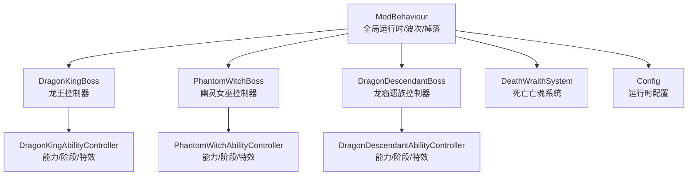
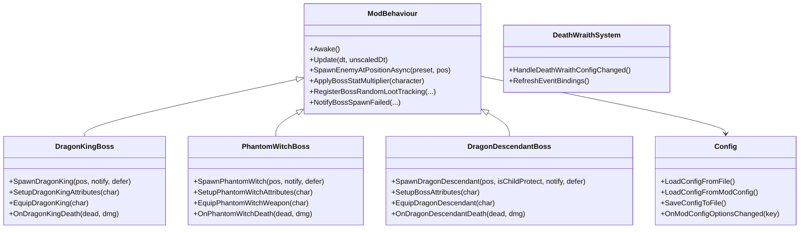
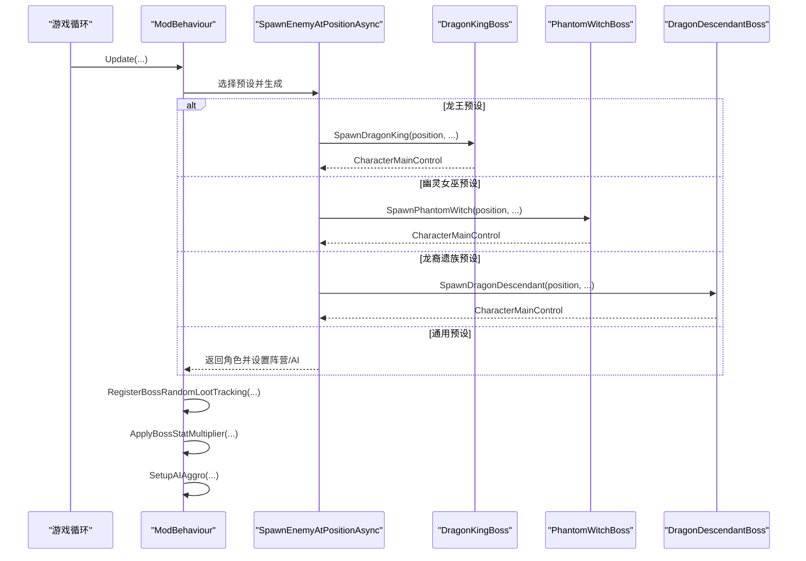
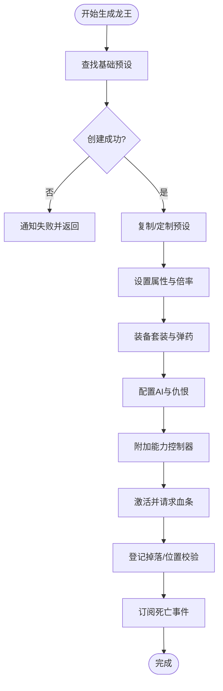
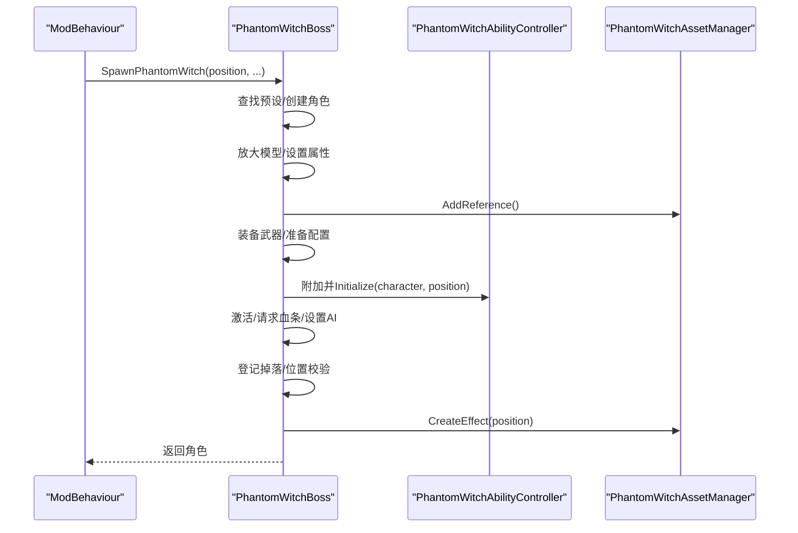
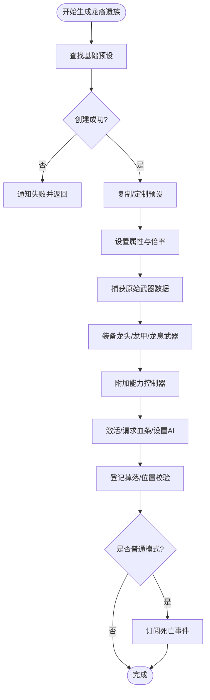
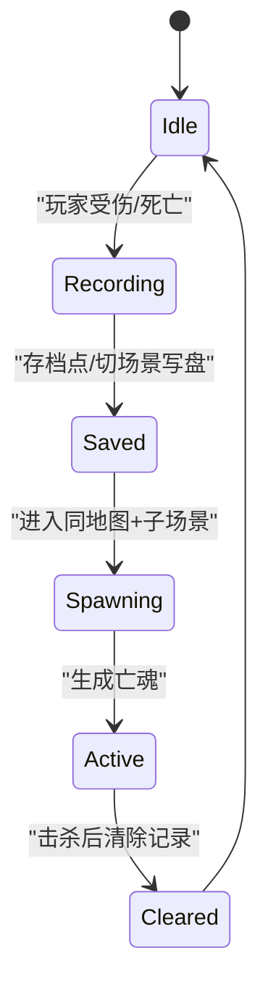
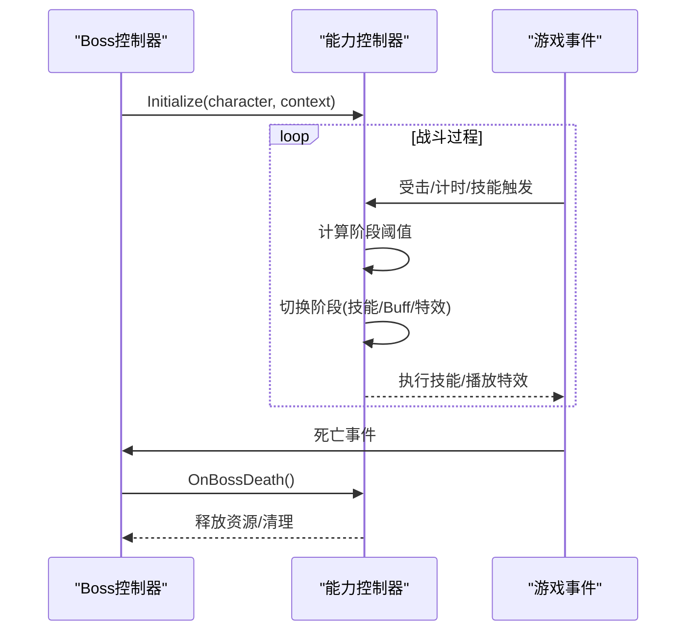
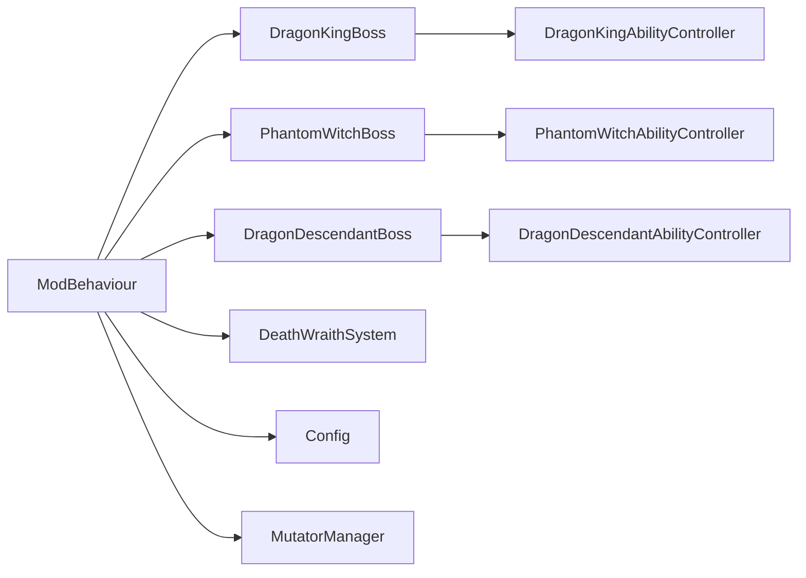

# Boss 框架设计

<cite>
**本文引用的文件**
- [ModBehaviour.cs](file://ModBehaviour.cs)
- [Config.cs](file://Config\Config.cs)
- [DragonKingBoss.cs](file://Integration\DragonKing\DragonKingBoss.cs)
- [PhantomWitchBoss.cs](file://Integration\PhantomWitch\PhantomWitchBoss.cs)
- [DragonDescendantBoss.cs](file://Integration\DragonDescendant\DragonDescendantBoss.cs)
- [DeathWraithSystem.cs](file://Integration\DeathWraith\DeathWraithSystem.cs)
</cite>

## 目录
1. [简介](#简介)
2. [项目结构](#项目结构)
3. [核心组件](#核心组件)
4. [架构总览](#架构总览)
5. [详细组件分析](#详细组件分析)
6. [依赖关系分析](#依赖关系分析)
7. [性能考量](#性能考量)
8. [故障排查指南](#故障排查指南)
9. [结论](#结论)
10. [附录：新增 Boss 开发指南](#附录新增-boss-开发指南)

## 简介
本文件系统性梳理 BossRush Mod 的 Boss 框架设计，覆盖基类架构、生命周期管理、能力系统接口、阶段转换机制、生成流程、装备系统、属性设置、AI 仇恨管理、与游戏系统的集成方式、事件处理与状态同步，并提供“如何添加新 Boss”的最佳实践。该框架以 ModBehaviour 为统一宿主，通过 partial class 将各 Boss 控制器（龙王、幽灵女巫、龙裔遗族、死亡亡魂）作为扩展模块接入，形成高内聚、低耦合的可插拔体系。

## 项目结构
- 根级 ModBehaviour 承担全局运行时、模式切换、波次调度、通用掉落/回血/清理等横切逻辑。
- Integration 目录下按 Boss 分模块：每个 Boss 拥有独立的控制器与能力子系统，遵循统一的生成、配置、事件订阅与清理约定。
- Config 提供可热更新的运行期配置项，贯穿 Boss 数值倍率、波次间隔、系统开关等。
- 其他子模块（成就、音频、地图、掉落、UI、调试工具等）与 Boss 框架通过事件或 API 协作。

图表来源
- [ModBehaviour.cs:598-694](file://ModBehaviour.cs#L598-L694)
- [DragonKingBoss.cs:209-371](file://Integration\DragonKing\DragonKingBoss.cs#L209-L371)
- [PhantomWitchBoss.cs:140-340](file://Integration\PhantomWitch\PhantomWitchBoss.cs#L140-L340)
- [DragonDescendantBoss.cs:61-235](file://Integration\DragonDescendant\DragonDescendantBoss.cs#L61-L235)
- [DeathWraithSystem.cs:122-246](file://Integration\DeathWraith\DeathWraithSystem.cs#L122-L246)
- [Config.cs:34-81](file://Config\Config.cs#L34-L81)

章节来源
- [ModBehaviour.cs:598-694](file://ModBehaviour.cs#L598-L694)
- [Config.cs:34-81](file://Config\Config.cs#L34-L81)

## 核心组件
- 基类与宿主：ModBehaviour 作为全局单例，负责 Awake/Update 生命周期、模式门控、波次推进、Boss 池追踪、掉落随机化、变异词条回血、场景退出清理等。
- Boss 控制器：每个 Boss 在 ModBehaviour 中以 partial class 形式实现 SpawnXxx、SetupXxxAttributes、EquipXxx、OnXxxDeath 等方法，并维护实例字典与静态缓存。
- 能力控制器：各 Boss 的能力控制器（如 DragonKingAbilityController、PhantomWitchAbilityController、DragonDescendantAbilityController）负责技能编排、阶段切换、特效与 Buff 管理。
- 配置系统：Config.cs 提供 JSON/ModConfig 双通道配置加载与热更新，影响波次间隔、Boss 倍率、系统开关等。
- 死亡亡魂系统：记录玩家死亡快照并在下次进入相同子场景时于死亡点生成对应强度的亡魂。

章节来源
- [ModBehaviour.cs:598-694](file://ModBehaviour.cs#L598-L694)
- [DragonKingBoss.cs:209-371](file://Integration\DragonKing\DragonKingBoss.cs#L209-L371)
- [PhantomWitchBoss.cs:140-340](file://Integration\PhantomWitch\PhantomWitchBoss.cs#L140-L340)
- [DragonDescendantBoss.cs:61-235](file://Integration\DragonDescendant\DragonDescendantBoss.cs#L61-L235)
- [DeathWraithSystem.cs:122-246](file://Integration\DeathWraith\DeathWraithSystem.cs#L122-L246)
- [Config.cs:34-81](file://Config\Config.cs#L34-L81)

## 架构总览
Boss 框架采用“宿主 + 插件式控制器”的分层架构：
- 宿主（ModBehaviour）提供统一入口与公共能力（生成、属性、掉落、回血、清理）。
- 控制器（各 Boss 的 partial class）专注自身生成、装备、AI 仇恨、能力控制器装配与生命周期。
- 能力控制器（各 Boss 的 *AbilityController）封装阶段、技能、特效与资源管理。
- 配置（Config）集中管理可调参数，支持运行时变更。

图表来源
- [ModBehaviour.cs:598-694](file://ModBehaviour.cs#L598-L694)
- [DragonKingBoss.cs:209-371](file://Integration\DragonKing\DragonKingBoss.cs#L209-L371)
- [PhantomWitchBoss.cs:140-340](file://Integration\PhantomWitch\PhantomWitchBoss.cs#L140-L340)
- [DragonDescendantBoss.cs:61-235](file://Integration\DragonDescendant\DragonDescendantBoss.cs#L61-L235)
- [DeathWraithSystem.cs:122-246](file://Integration\DeathWraith\DeathWraithSystem.cs#L122-L246)
- [Config.cs:158-232](file://Config\Config.cs#L158-L232)

## 详细组件分析

### 基类与生命周期管理（ModBehaviour）
- 启动与轮询：Awake 中注册运行时模块、初始化引导与常驻逻辑；Update 中分发到各模式与系统 Tick，包含 Boss 回血、掉落跟踪、波次倒计时等。
- Boss 池与追踪：currentBoss、currentWaveBosses 用于多 Boss 模式；对非敌对预设进行阵营兜底修正，确保 AI 追踪与伤害生效。
- 生成管线：SpawnEnemyAtPositionAsync 根据预设类型路由到专用生成方法（龙王、幽灵女巫、龙裔遗族），否则走通用预设生成路径。
- 掉落与回血：为每个生成的 Boss 登记掉落跟踪；根据模式（D/E/F）将存活 Boss 喂入 MutatorManager 进行回血 Tick。
- 清理：场景退出或 Arena 离开时，遍历 tracked characters 调用 OnBossDeath、注销事件、释放资源、重置 currentBoss。

图表来源
- [ModBehaviour.cs:998-1198](file://ModBehaviour.cs#L998-L1198)
- [DragonKingBoss.cs:209-371](file://Integration\DragonKing\DragonKingBoss.cs#L209-L371)
- [PhantomWitchBoss.cs:140-340](file://Integration\PhantomWitch\PhantomWitchBoss.cs#L140-L340)
- [DragonDescendantBoss.cs:61-235](file://Integration\DragonDescendant\DragonDescendantBoss.cs#L61-L235)

章节来源
- [ModBehaviour.cs:598-694](file://ModBehaviour.cs#L598-L694)
- [ModBehaviour.cs:998-1198](file://ModBehaviour.cs#L998-L1198)

### 龙王（Dragon King）
- 生成流程：查找基础预设 -> 异步创建角色 -> 复制/定制预设 -> 设置 Health 与显示血条 -> 应用全局倍率 -> 装备套装 -> 禁用/保留原版 AI -> 附加能力控制器 -> 激活并请求血条 -> 设置 AI 仇恨 -> 位置校验与恢复锚点 -> 订阅死亡事件 -> 播放 BGM。
- 属性设置：通过 ItemStatsSystem 修改 MaxHealth、GunDamageMultiplier、MeleeDamageMultiplier，并 SetHealth 到满。
- 装备系统：按 TypeID/名称查找并装备头盔与护甲，刷新模型，加载最高级子弹。
- AI 仇恨：在非 Mode E 下设置 AI 目标为玩家主伤害接收者，保证战斗行为。
- 能力与阶段：由 DragonKingAbilityController 管理技能与阶段；Boss 死亡回调中触发成就检测、BGM 重置、能力控制器清理、事件解绑、资源释放。
- 多实例支持：使用 Dictionary<CharacterMainControl, AbilityController> 管理多龙王实例；全局事件仅注册一次，活跃 Health 集合快速过滤。

图表来源
- [DragonKingBoss.cs:209-371](file://Integration\DragonKing\DragonKingBoss.cs#L209-L371)
- [DragonKingBoss.cs:414-511](file://Integration\DragonKing\DragonKingBoss.cs#L414-L511)
- [DragonKingBoss.cs:559-634](file://Integration\DragonKing\DragonKingBoss.cs#L559-L634)

章节来源
- [DragonKingBoss.cs:209-371](file://Integration\DragonKing\DragonKingBoss.cs#L209-L371)
- [DragonKingBoss.cs:414-511](file://Integration\DragonKing\DragonKingBoss.cs#L414-L511)
- [DragonKingBoss.cs:559-634](file://Integration\DragonKing\DragonKingBoss.cs#L559-L634)

### 幽灵女巫（Phantom Witch）
- 生成流程：查找基础预设（优先 Cname_Ghost，回退 Cname_Boss_Red）-> 异步创建角色 -> 放大模型 -> 设置属性与倍率 -> 装备武器（正式镰刀或占位武器）-> 附加能力控制器（独立 GameObject）-> 激活并请求血条 -> 设置 AI 仇恨 -> 登记掉落与位置校验 -> 订阅死亡事件 -> 出场特效。
- 能力与阶段：PhantomWitchAbilityController 管理闪烁、隐身、诅咒领域、镰刀横扫、召唤等技能与三阶段阈值。
- 资源管理：PhantomWitchAssetManager 负责特效与资源引用计数，异常路径确保释放。
- 预设与图标：通过反射设置 characterIconType 为 boss，使 UI 显示 Boss 标识。

图表来源
- [PhantomWitchBoss.cs:140-340](file://Integration\PhantomWitch\PhantomWitchBoss.cs#L140-L340)
- [PhantomWitchBoss.cs:384-514](file://Integration\PhantomWitch\PhantomWitchBoss.cs#L384-L514)
- [PhantomWitchBoss.cs:578-623](file://Integration\PhantomWitch\PhantomWitchBoss.cs#L578-L623)

章节来源
- [PhantomWitchBoss.cs:140-340](file://Integration\PhantomWitch\PhantomWitchBoss.cs#L140-L340)
- [PhantomWitchBoss.cs:384-514](file://Integration\PhantomWitch\PhantomWitchBoss.cs#L384-L514)
- [PhantomWitchBoss.cs:578-623](file://Integration\PhantomWitch\PhantomWitchBoss.cs#L578-L623)

### 龙裔遗族（Dragon Descendant）
- 生成流程：查找基础预设（Cname_Boss_Red 或 ???）-> 异步创建角色 -> 可选不加入波次追踪（孩儿护我召唤）-> 复制/定制预设 -> 设置属性与倍率 -> 捕获原始武器数据（用于二阶段射击）-> 装备龙头/龙甲/龙息武器 -> 附加能力控制器 -> 激活并请求血条 -> 设置 AI 仇恨 -> 登记掉落与位置校验 -> 订阅死亡事件（普通模式）。
- 能力与阶段：DragonDescendantAbilityController 管理龙息攻击、弹幕、火焰特效与阶段切换。
- 武器数据：从已装备武器反射获取子弹预制体、枪口特效、射速、伤害、射程等，用于第二阶段发射原始武器弹幕。

图表来源
- [DragonDescendantBoss.cs:61-235](file://Integration\DragonDescendant\DragonDescendantBoss.cs#L61-L235)
- [DragonDescendantBoss.cs:464-566](file://Integration\DragonDescendant\DragonDescendantBoss.cs#L464-L566)
- [DragonDescendantBoss.cs:571-676](file://Integration\DragonDescendant\DragonDescendantBoss.cs#L571-L676)

章节来源
- [DragonDescendantBoss.cs:61-235](file://Integration\DragonDescendant\DragonDescendantBoss.cs#L61-L235)
- [DragonDescendantBoss.cs:464-566](file://Integration\DragonDescendant\DragonDescendantBoss.cs#L464-L566)
- [DragonDescendantBoss.cs:571-676](file://Integration\DragonDescendant\DragonDescendantBoss.cs#L571-L676)

### 死亡亡魂（Death Wraith）
- 功能概述：记录玩家死亡时的外观、装备、语音、步态材质、近战绑定快照等信息，下次进入同一地图与子场景时在死亡位置生成对应强度的亡魂。
- 强度等级：基于携带物品价值占总财富比例分为弱、均衡、强三档，分别调整血量、移速与攻击倍率。
- 持久化：内存列表缓存 + ES3 延迟落盘（借官方存档收集点去抖写入），避免死亡帧卡顿。
- 事件绑定：订阅 Health.OnHurt/OnDead 与 SavesSystem.OnCollectSaveData，支持配置开关动态启用/关闭。

图表来源
- [DeathWraithSystem.cs:34-120](file://Integration\DeathWraith\DeathWraithSystem.cs#L34-L120)
- [DeathWraithSystem.cs:122-246](file://Integration\DeathWraith\DeathWraithSystem.cs#L122-L246)

章节来源
- [DeathWraithSystem.cs:34-120](file://Integration\DeathWraith\DeathWraithSystem.cs#L34-L120)
- [DeathWraithSystem.cs:122-246](file://Integration\DeathWraith\DeathWraithSystem.cs#L122-L246)

### 阶段转换机制与能力系统接口
- 阶段定义：各 Boss 的能力控制器内部维护阶段枚举与阈值（例如幽灵女巫三阶段 HP 阈值），在受击或时间驱动时切换阶段。
- 能力接口：能力控制器暴露 Initialize、OnBossDeath、Tick/Update 等接口，由 Boss 控制器在生成/销毁时调用。
- 阶段触发：通常通过受击回调、计时器或技能包调度器触发阶段变化，同时切换技能集、特效、Buff 与音效。
- 资源管理：能力控制器持有共享资源引用计数，在最后一个实例销毁时释放静态缓存。

图表来源
- [DragonKingBoss.cs:288-330](file://Integration\DragonKing\DragonKingBoss.cs#L288-L330)
- [PhantomWitchBoss.cs:260-283](file://Integration\PhantomWitch\PhantomWitchBoss.cs#L260-L283)
- [DragonDescendantBoss.cs:157-184](file://Integration\DragonDescendant\DragonDescendantBoss.cs#L157-L184)

章节来源
- [DragonKingBoss.cs:288-330](file://Integration\DragonKing\DragonKingBoss.cs#L288-L330)
- [PhantomWitchBoss.cs:260-283](file://Integration\PhantomWitch\PhantomWitchBoss.cs#L260-L283)
- [DragonDescendantBoss.cs:157-184](file://Integration\DragonDescendant\DragonDescendantBoss.cs#L157-L184)

## 依赖关系分析
- ModBehaviour 与各 Boss 控制器通过 partial class 组合，保持单一职责与可扩展性。
- 各 Boss 控制器依赖各自的能力控制器与资产管理器，形成“控制器-能力-资源”三层结构。
- 配置系统通过反射与 ModConfig 交互，提供运行时热更新。
- 掉落与回血系统通过 MutatorManager 与 BossRush 掉落跟踪模块协作。

图表来源
- [ModBehaviour.cs:598-694](file://ModBehaviour.cs#L598-L694)
- [Config.cs:158-232](file://Config\Config.cs#L158-L232)

章节来源
- [ModBehaviour.cs:598-694](file://ModBehaviour.cs#L598-L694)
- [Config.cs:158-232](file://Config\Config.cs#L158-L232)

## 性能考量
- 预设缓存：各 Boss 控制器缓存基础预设与资源，避免重复 Resources 扫描。
- 分帧与 Yield：生成流程中使用 UniTask.Yield 分摊首帧开销，降低卡顿。
- 引用计数：能力控制器与资产管理器使用引用计数，仅在最后实例销毁时释放静态缓存。
- 快速过滤：龙王套装效果通过活跃 Health 集合快速判断，减少全局事件遍历。
- 掉落与回血：复用临时列表，避免每帧分配；Mode 分支优化 Boss 回血 Tick。

[本节为通用指导，无需具体文件引用]

## 故障排查指南
- 生成失败：检查预设查找逻辑与 fallback 方案；确认 NotifyBossSpawnFailed 被调用并查看日志。
- 非敌对问题：若预设 team 为中立即强制改为 wolf，确保 AI 追踪与伤害生效。
- 资源泄漏：确保 OnBossDeath 中正确解绑事件、移除实例字典、释放资产引用。
- 配置失效：检查 ModConfig 键名映射与范围校验；确认 OnModConfigOptionsChanged 触发保存与应用。
- 死亡亡魂未出现：确认系统开关开启、事件绑定正常、子场景匹配与落盘去抖逻辑。

章节来源
- [ModBehaviour.cs:1098-1116](file://ModBehaviour.cs#L1098-L1116)
- [DragonKingBoss.cs:637-650](file://Integration\DragonKing\DragonKingBoss.cs#L637-L650)
- [PhantomWitchBoss.cs:667-678](file://Integration\PhantomWitch\PhantomWitchBoss.cs#L667-L678)
- [Config.cs:588-670](file://Config\Config.cs#L588-L670)
- [DeathWraithSystem.cs:187-246](file://Integration\DeathWraith\DeathWraithSystem.cs#L187-L246)

## 结论
Boss 框架以 ModBehaviour 为核心，通过 partial class 将各 Boss 控制器模块化，结合能力控制器与资产管理器，实现了高内聚、易扩展的 Boss 生态。统一的生成、属性、装备、AI、事件与清理流程确保了稳定性与可维护性；配置系统提供灵活调参与热更新；死亡亡魂系统丰富了玩法维度。新增 Boss 只需遵循既定约定即可无缝接入。

[本节为总结，无需具体文件引用]

## 附录：新增 Boss 开发指南
- 继承与组织
  - 在 Integration 下新建文件夹，创建 Boss 控制器（partial class ModBehaviour），命名规范参考现有实现。
  - 创建能力控制器（*AbilityController）管理阶段、技能与特效。
  - 创建配置类（*Config）集中管理名称、血量、倍率、消息等常量。
- 必要接口与流程
  - 实现 SpawnXxx(position, notify, defer)：查找预设、创建角色、复制/定制预设、设置 Health 与血条、应用倍率、装备、附加能力控制器、激活、请求血条、设置 AI 仇恨、登记掉落与位置校验、订阅死亡事件。
  - 实现 SetupXxxAttributes(character)：通过 ItemStatsSystem 设置 MaxHealth、伤害倍率等。
  - 实现 EquipXxx(character)：按 TypeID/名称装备护甲/武器，刷新模型，加载弹药。
  - 实现 OnXxxDeath(dead, dmg)：触发成就、重置 BGM、能力控制器清理、事件解绑、资源释放、清理预设与追踪。
- 配置参数
  - 在 Config 中添加 Boss 相关开关或数值（如 enableXXX、bossStatMultiplier 等），并通过 ModConfig 反射加载与热更新。
- 最佳实践
  - 使用预设缓存与引用计数，避免重复扫描与资源泄漏。
  - 使用 UniTask.Yield 分摊首帧开销。
  - 在非 Mode E 下设置 AI 仇恨为目标玩家，确保战斗行为。
  - 登记掉落跟踪与位置校验，确保波次推进与回收。
  - 异常路径统一 catch 并记录日志，必要时调用 NotifyBossSpawnFailed。

章节来源
- [DragonKingBoss.cs:209-371](file://Integration\DragonKing\DragonKingBoss.cs#L209-L371)
- [PhantomWitchBoss.cs:140-340](file://Integration\PhantomWitch\PhantomWitchBoss.cs#L140-L340)
- [DragonDescendantBoss.cs:61-235](file://Integration\DragonDescendant\DragonDescendantBoss.cs#L61-L235)
- [Config.cs:158-232](file://Config\Config.cs#L158-L232)