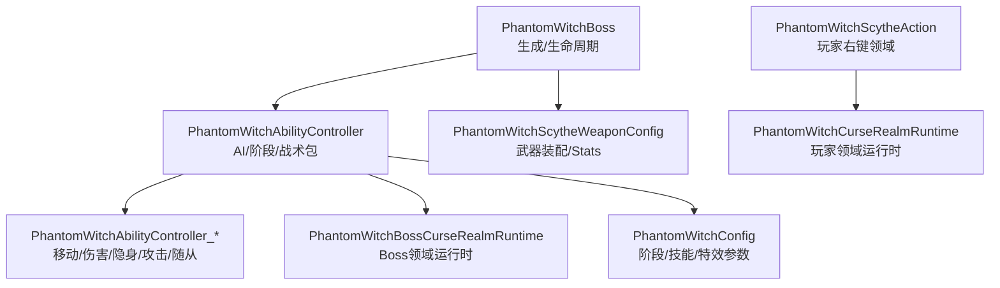
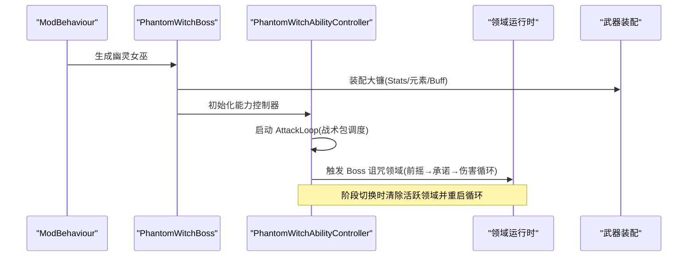
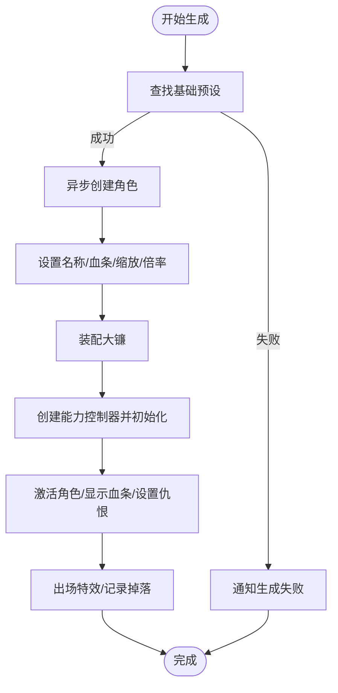
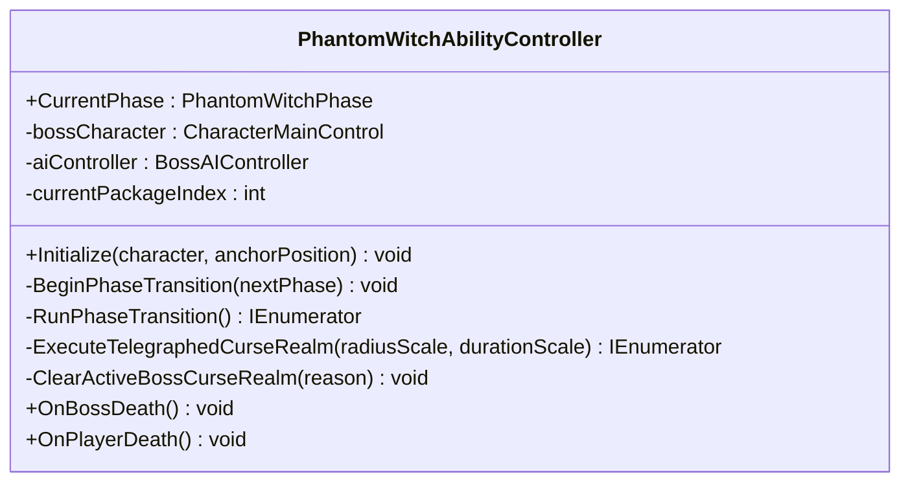
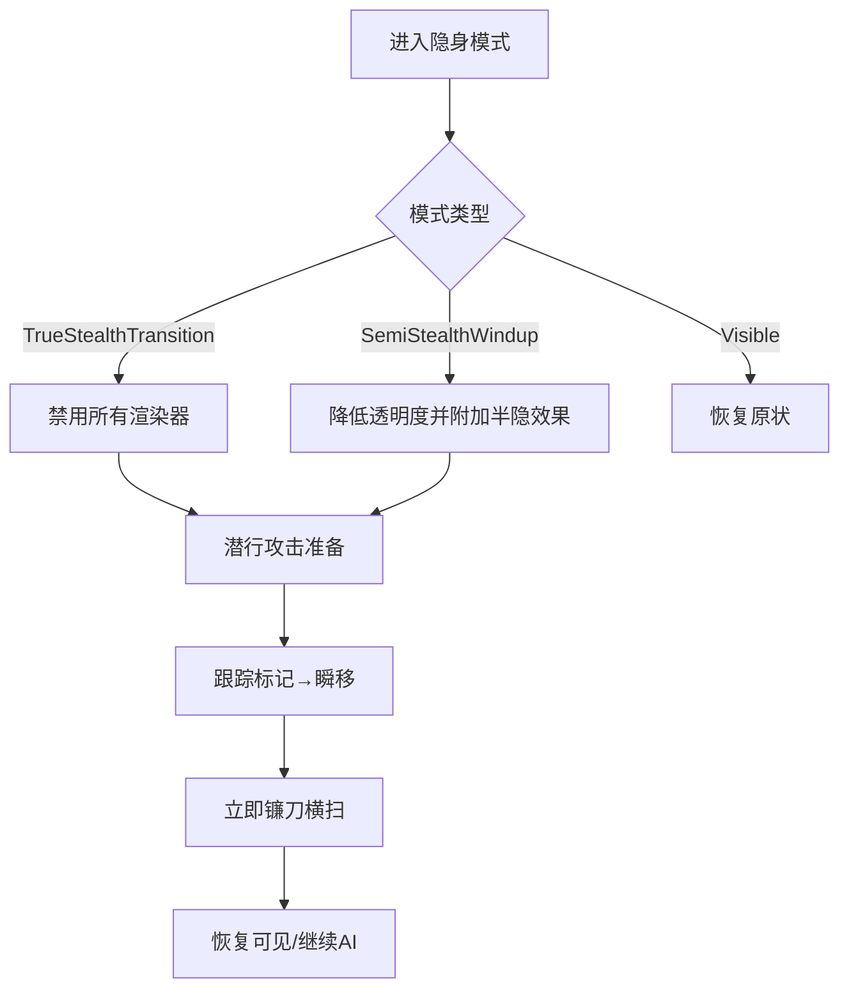
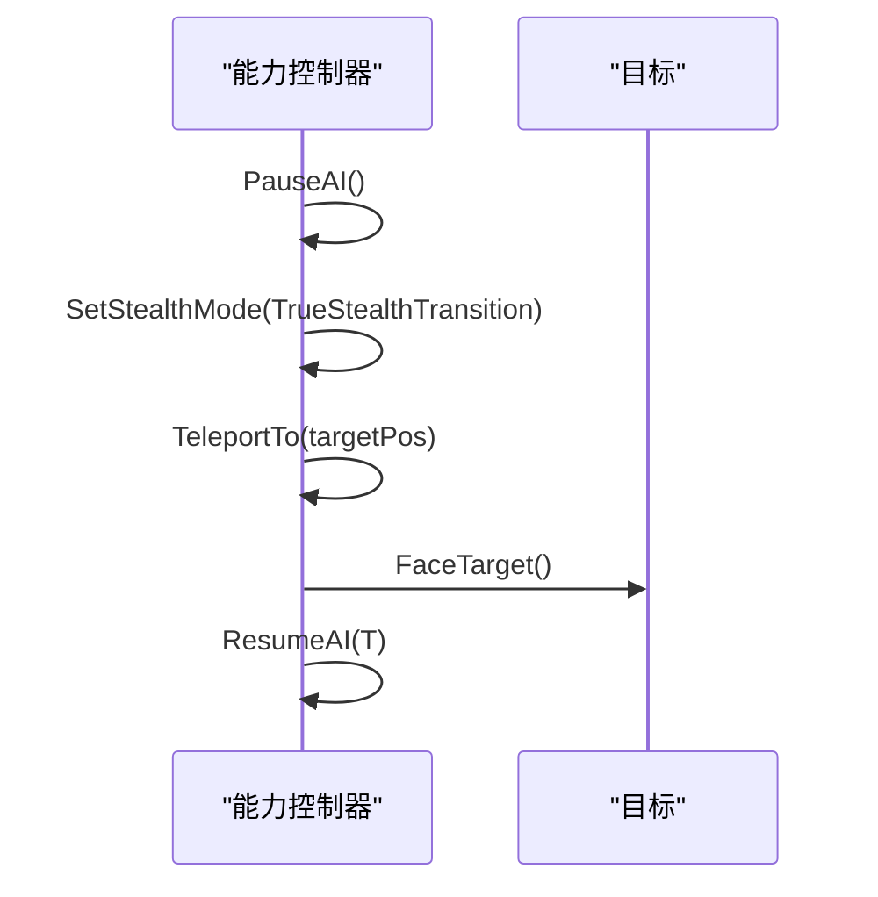
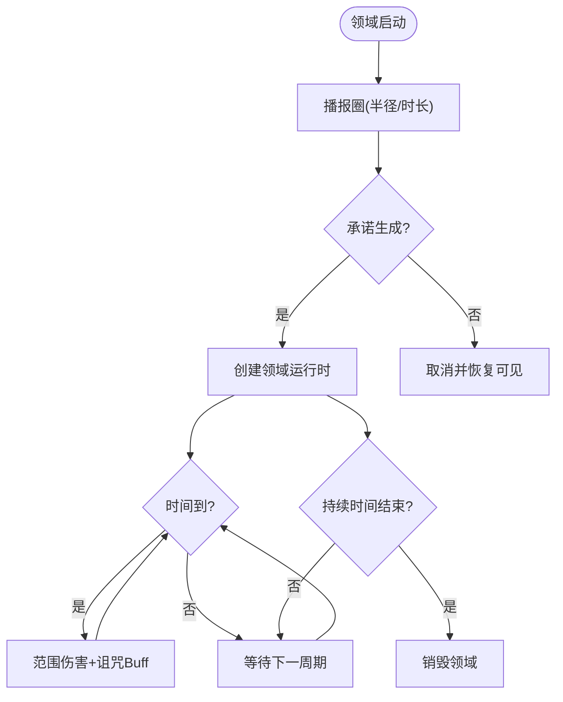
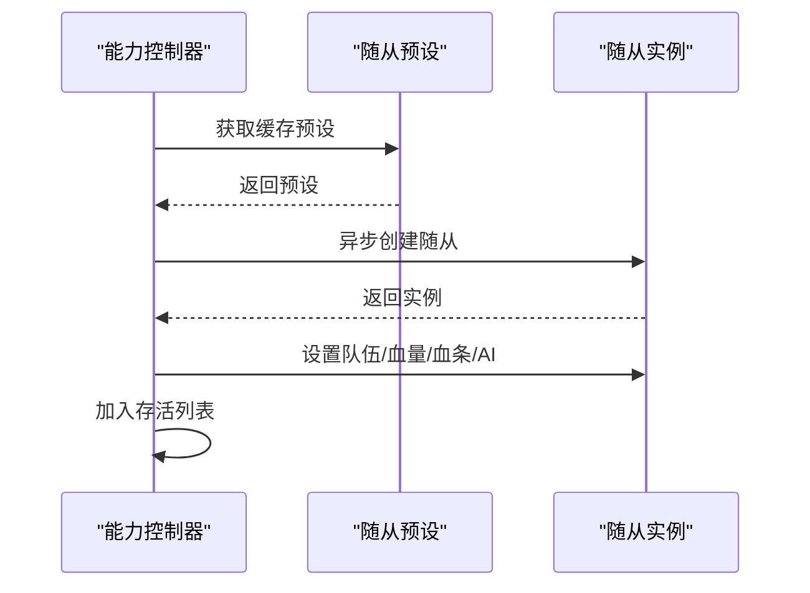
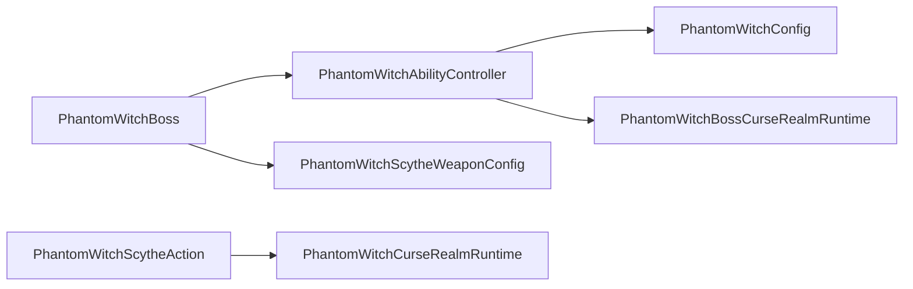

# 幽灵女巫 Boss

<cite>
**本文引用的文件**
- [PhantomWitchBoss.cs](file://Integration/PhantomWitch/PhantomWitchBoss.cs)
- [PhantomWitchAbilityController.cs](file://Integration/PhantomWitch/PhantomWitchAbilityController.cs)
- [PhantomWitchConfig.cs](file://Integration/PhantomWitch/PhantomWitchConfig.cs)
- [PhantomWitchScytheWeaponConfig.cs](file://Integration/PhantomWitch/PhantomWitchScytheWeaponConfig.cs)
- [PhantomWitchAbilityController_PhaseAndLifecycle.cs](file://Integration/PhantomWitch/PhantomWitchAbilityController_PhaseAndLifecycle.cs)
- [PhantomWitchAbilityController_StealthAndAttacks.cs](file://Integration/PhantomWitch/PhantomWitchAbilityController_StealthAndAttacks.cs)
- [PhantomWitchAbilityController_Minions.cs](file://Integration/PhantomWitch/PhantomWitchAbilityController_Minions.cs)
- [PhantomWitchAbilityController_MovementAndDamage.cs](file://Integration/PhantomWitch/PhantomWitchAbilityController_MovementAndDamage.cs)
- [PhantomWitchBossCurseRealmRuntime.cs](file://Integration/PhantomWitch/PhantomWitchBossCurseRealmRuntime.cs)
- [PhantomWitchScytheAction.cs](file://Integration/PhantomWitch/PhantomWitchScytheAction.cs)
</cite>

## 目录
1. [简介](#简介)
2. [项目结构](#项目结构)
3. [核心组件](#核心组件)
4. [架构总览](#架构总览)
5. [详细组件分析](#详细组件分析)
6. [依赖关系分析](#依赖关系分析)
7. [性能考量](#性能考量)
8. [故障排查指南](#故障排查指南)
9. [结论](#结论)
10. [附录](#附录)

## 简介
本文件为“幽灵女巫”Boss 的完整技术文档，聚焦以下主题：隐身机制、诅咒领域、召唤系统、镰刀武器系统、相位转换、潜行攻击、生存与伤害减免、范围攻击、AI 行为模式、技能组合、特效系统，以及应对策略与性能优化建议。内容基于仓库中 PhantomWitch 模块的实现进行梳理与可视化说明，帮助策划、程序与测试人员快速掌握该 Boss 的设计与运行方式。

## 项目结构
幽灵女巫相关代码集中在 Integration/PhantomWitch 目录下，采用“主控制器 + 能力控制器（分部分文件）+ 配置 + 武器配置 + 领域运行时 + 动作”的分层组织方式：
- 生成与生命周期：PhantomWitchBoss.cs
- AI 状态机与战术包调度：PhantomWitchAbilityController.cs 及其多个 partial 文件
- 数值与阶段参数：PhantomWitchConfig.cs
- 武器装配与属性：PhantomWitchScytheWeaponConfig.cs
- Boss 诅咒领域运行时：PhantomWitchBossCurseRealmRuntime.cs
- 玩家右键技能（诅咒领域）：PhantomWitchScytheAction.cs

图表来源
- [PhantomWitchBoss.cs:140-340](file://Integration/PhantomWitch/PhantomWitchBoss.cs#L140-L340)
- [PhantomWitchAbilityController.cs:221-250](file://Integration/PhantomWitch/PhantomWitchAbilityController.cs#L221-L250)
- [PhantomWitchAbilityController_PhaseAndLifecycle.cs:19-103](file://Integration/PhantomWitch/PhantomWitchAbilityController_PhaseAndLifecycle.cs#L19-L103)
- [PhantomWitchAbilityController_StealthAndAttacks.cs:19-88](file://Integration/PhantomWitch/PhantomWitchAbilityController_StealthAndAttacks.cs#L19-L88)
- [PhantomWitchAbilityController_MovementAndDamage.cs:74-131](file://Integration/PhantomWitch/PhantomWitchAbilityController_MovementAndDamage.cs#L74-L131)
- [PhantomWitchAbilityController_Minions.cs:19-83](file://Integration/PhantomWitch/PhantomWitchAbilityController_Minions.cs#L19-L83)
- [PhantomWitchBossCurseRealmRuntime.cs:28-87](file://Integration/PhantomWitch/PhantomWitchBossCurseRealmRuntime.cs#L28-L87)
- [PhantomWitchScytheAction.cs:59-117](file://Integration/PhantomWitch/PhantomWitchScytheAction.cs#L59-L117)
- [PhantomWitchScytheWeaponConfig.cs:109-171](file://Integration/PhantomWitch/PhantomWitchScytheWeaponConfig.cs#L109-L171)

章节来源
- [PhantomWitchBoss.cs:140-340](file://Integration/PhantomWitch/PhantomWitchBoss.cs#L140-L340)
- [PhantomWitchAbilityController.cs:221-250](file://Integration/PhantomWitch/PhantomWitchAbilityController.cs#L221-L250)
- [PhantomWitchConfig.cs:60-185](file://Integration/PhantomWitch/PhantomWitchConfig.cs#L60-L185)

## 核心组件
- 生成与生命周期管理：负责查找基础预设、创建角色、装备武器、设置血条、订阅死亡事件、清理资源等。
- 能力控制器：维护当前阶段、战术包序列、AI 暂停/恢复、传送、隐身、范围伤害、召唤随从、阶段切换、领域控制、统计与看门狗。
- 配置中心：定义阶段阈值、技能参数、特效配色、Buff ID、战术包序列等。
- 武器装配：为 Boss 装配专属大镰，注入 Stats、元素、诅咒 Buff、本地化与渲染修复。
- 领域运行时：Boss 与玩家的诅咒领域分别由独立运行时处理，周期伤害并施加诅咒 Buff。
- 玩家右键技能：在脚下生成领域，持续期间周期性伤害与叠加诅咒。

章节来源
- [PhantomWitchBoss.cs:140-340](file://Integration/PhantomWitch/PhantomWitchBoss.cs#L140-L340)
- [PhantomWitchAbilityController.cs:221-250](file://Integration/PhantomWitch/PhantomWitchAbilityController.cs#L221-L250)
- [PhantomWitchConfig.cs:60-185](file://Integration/PhantomWitch/PhantomWitchConfig.cs#L60-L185)
- [PhantomWitchScytheWeaponConfig.cs:109-171](file://Integration/PhantomWitch/PhantomWitchScytheWeaponConfig.cs#L109-L171)
- [PhantomWitchBossCurseRealmRuntime.cs:28-87](file://Integration/PhantomWitch/PhantomWitchBossCurseRealmRuntime.cs#L28-L87)
- [PhantomWitchScytheAction.cs:59-117](file://Integration/PhantomWitch/PhantomWitchScytheAction.cs#L59-L117)

## 架构总览
幽灵女巫以“生成器 + 能力控制器”为核心，能力控制器通过“战术包调度器”驱动不同阶段的技能组合；阶段切换时执行传送、清领域、播放过渡特效并重启循环。诅咒领域由独立运行时对象承载，按区间对范围内敌人造成伤害并叠加诅咒 Buff。玩家右键技能同样生成独立领域，与 Boss 共享同一套视觉与伤害逻辑。

图表来源
- [PhantomWitchBoss.cs:140-340](file://Integration/PhantomWitch/PhantomWitchBoss.cs#L140-L340)
- [PhantomWitchAbilityController_PhaseAndLifecycle.cs:19-103](file://Integration/PhantomWitch/PhantomWitchAbilityController_PhaseAndLifecycle.cs#L19-L103)
- [PhantomWitchBossCurseRealmRuntime.cs:28-87](file://Integration/PhantomWitch/PhantomWitchBossCurseRealmRuntime.cs#L28-L87)
- [PhantomWitchScytheWeaponConfig.cs:109-171](file://Integration/PhantomWitch/PhantomWitchScytheWeaponConfig.cs#L109-L171)

## 详细组件分析

### 生成与生命周期（PhantomWitchBoss）
- 生成流程：查找基础预设 → 异步创建角色 → 设置名称/血条/缩放 → 应用全局倍率 → 装备武器 → 创建能力控制器 → 激活角色 → 显示血条 → 设置仇恨 → 登记回收锚点 → 订阅死亡事件 → 出场特效 → 记录掉落追踪。
- 失败回滚：捕获异常后释放资产引用、清理预设、移除波次列表、销毁实例。
- 死亡回调：播放死亡特效、通知能力控制器、清理追踪与预设。

图表来源
- [PhantomWitchBoss.cs:140-340](file://Integration/PhantomWitch/PhantomWitchBoss.cs#L140-L340)
- [PhantomWitchBoss.cs:381-514](file://Integration/PhantomWitch/PhantomWitchBoss.cs#L381-L514)

章节来源
- [PhantomWitchBoss.cs:140-340](file://Integration/PhantomWitch/PhantomWitchBoss.cs#L140-L340)
- [PhantomWitchBoss.cs:381-514](file://Integration/PhantomWitch/PhantomWitchBoss.cs#L381-L514)

### 能力控制器与阶段系统（PhantomWitchAbilityController）
- 阶段枚举：Phase1/Phase2/Phase3/Transitioning/Dead。
- 战术包序列：每阶段有固定包序列，如 Phase1 包含侧翼压力、中距挽歌、幽灵轨迹观察等；Phase2/Phase3 引入诅咒陷阱、残局召唤、撤退等。
- 阶段切换：暂停 AI、清除活跃领域、传送至目标附近、播放过渡特效、更新环境气息、重置包索引、恢复 AI 并重启循环。
- 目标解析：优先从 AI 搜索目标获取有效战斗目标，否则回退到主玩家。

图表来源
- [PhantomWitchAbilityController.cs:221-250](file://Integration/PhantomWitch/PhantomWitchAbilityController.cs#L221-L250)
- [PhantomWitchAbilityController_PhaseAndLifecycle.cs:19-103](file://Integration/PhantomWitch/PhantomWitchAbilityController_PhaseAndLifecycle.cs#L19-L103)

章节来源
- [PhantomWitchAbilityController.cs:221-250](file://Integration/PhantomWitch/PhantomWitchAbilityController.cs#L221-L250)
- [PhantomWitchAbilityController_PhaseAndLifecycle.cs:19-103](file://Integration/PhantomWitch/PhantomWitchAbilityController_PhaseAndLifecycle.cs#L19-L103)

### 隐身机制与潜行攻击
- 隐身模式：TrueStealthTransition（完全隐藏）、SemiStealthWindup（半隐前摇，降低透明度并附加效果）、Visible（可见）。
- 实现要点：缓存渲染器与材质块，切换时统一修改 alpha；支持检测是否可调制 alpha，不可用时降级为可见；进入/退出隐身均上报遥测。
- 潜行攻击：跟踪传送打击在播报期持续刷新标记位置，最终瞬移至标记处并立即执行镰刀横扫；横扫前会强制播放攻击动画并调整朝向。

图表来源
- [PhantomWitchAbilityController_StealthAndAttacks.cs:19-88](file://Integration/PhantomWitch/PhantomWitchAbilityController_StealthAndAttacks.cs#L19-L88)
- [PhantomWitchAbilityController_StealthAndAttacks.cs:271-343](file://Integration/PhantomWitch/PhantomWitchAbilityController_StealthAndAttacks.cs#L271-L343)
- [PhantomWitchAbilityController_MovementAndDamage.cs:514-574](file://Integration/PhantomWitch/PhantomWitchAbilityController_MovementAndDamage.cs#L514-L574)

章节来源
- [PhantomWitchAbilityController_StealthAndAttacks.cs:19-88](file://Integration/PhantomWitch/PhantomWitchAbilityController_StealthAndAttacks.cs#L19-L88)
- [PhantomWitchAbilityController_StealthAndAttacks.cs:271-343](file://Integration/PhantomWitch/PhantomWitchAbilityController_StealthAndAttacks.cs#L271-L343)
- [PhantomWitchAbilityController_MovementAndDamage.cs:514-574](file://Integration/PhantomWitch/PhantomWitchAbilityController_MovementAndDamage.cs#L514-L574)

### 传送与位移
- 传送过程：短暂无敌、隐藏、移动到目标位、取消无敌、播放进出场特效；若目标位与当前位置几乎一致则跳过主体移动避免“原地卡住”。
- 目标选择：围绕目标随机角度与距离采样 NavMesh，失败时尝试目标后方或靠近目标的回退点；全部失败时使用锚点或最近可行点。
- 面向目标：计算水平方向并平滑对齐，避免频繁旋转。

图表来源
- [PhantomWitchAbilityController_MovementAndDamage.cs:74-131](file://Integration/PhantomWitch/PhantomWitchAbilityController_MovementAndDamage.cs#L74-L131)
- [PhantomWitchAbilityController_MovementAndDamage.cs:196-273](file://Integration/PhantomWitch/PhantomWitchAbilityController_MovementAndDamage.cs#L196-L273)
- [PhantomWitchAbilityController_MovementAndDamage.cs:337-367](file://Integration/PhantomWitch/PhantomWitchAbilityController_MovementAndDamage.cs#L337-L367)

章节来源
- [PhantomWitchAbilityController_MovementAndDamage.cs:74-131](file://Integration/PhantomWitch/PhantomWitchAbilityController_MovementAndDamage.cs#L74-L131)
- [PhantomWitchAbilityController_MovementAndDamage.cs:196-273](file://Integration/PhantomWitch/PhantomWitchAbilityController_MovementAndDamage.cs#L196-L273)
- [PhantomWitchAbilityController_MovementAndDamage.cs:337-367](file://Integration/PhantomWitch/PhantomWitchAbilityController_MovementAndDamage.cs#L337-L367)

### 诅咒领域（Boss 与玩家）
- Boss 领域：前摇播报圈→承诺生成独立运行时→按区间对范围内敌人造成幽能伤害并叠加诅咒 Buff；阶段切换或 Boss 死亡时强制清除。
- 玩家领域：右键技能在地面生成领域，持续期间周期性伤害与叠加诅咒；视觉多层叠加（地面染色、黑烟、冲击波、符文环、五芒星、光晕、上升粒子等），并根据性能档位自适应细节。
- 伤害过滤：使用层掩码与接收者去重，仅对敌方单位生效，避免自伤与重复伤害。

图表来源
- [PhantomWitchAbilityController_PhaseAndLifecycle.cs:105-171](file://Integration/PhantomWitch/PhantomWitchAbilityController_PhaseAndLifecycle.cs#L105-L171)
- [PhantomWitchBossCurseRealmRuntime.cs:28-87](file://Integration/PhantomWitch/PhantomWitchBossCurseRealmRuntime.cs#L28-L87)
- [PhantomWitchScytheAction.cs:59-117](file://Integration/PhantomWitch/PhantomWitchScytheAction.cs#L59-L117)

章节来源
- [PhantomWitchAbilityController_PhaseAndLifecycle.cs:105-171](file://Integration/PhantomWitch/PhantomWitchAbilityController_PhaseAndLifecycle.cs#L105-L171)
- [PhantomWitchBossCurseRealmRuntime.cs:28-87](file://Integration/PhantomWitch/PhantomWitchBossCurseRealmRuntime.cs#L28-L87)
- [PhantomWitchScytheAction.cs:59-117](file://Integration/PhantomWitch/PhantomWitchScytheAction.cs#L59-L117)

### 召唤系统（随从）
- 职责分工：Sustain（治疗型）与 Harass（骚扰型）两种角色，成对生成于 Boss 左右两侧。
- 生成流程：计算偏移位置→采样 NavMesh→播放生成特效→异步创建随从→设置队伍/血量/血条→配置 AI→加入存活列表。
- 死亡处理：监听任意实体死亡，若为随从则从列表移除并上报遥测；Phase3 首次随从被击杀时记录关键节点。

图表来源
- [PhantomWitchAbilityController_Minions.cs:19-83](file://Integration/PhantomWitch/PhantomWitchAbilityController_Minions.cs#L19-L83)
- [PhantomWitchAbilityController_Minions.cs:126-141](file://Integration/PhantomWitch/PhantomWitchAbilityController_Minions.cs#L126-L141)
- [PhantomWitchAbilityController_Minions.cs:143-174](file://Integration/PhantomWitch/PhantomWitchAbilityController_Minions.cs#L143-L174)

章节来源
- [PhantomWitchAbilityController_Minions.cs:19-83](file://Integration/PhantomWitch/PhantomWitchAbilityController_Minions.cs#L19-L83)
- [PhantomWitchAbilityController_Minions.cs:126-141](file://Integration/PhantomWitch/PhantomWitchAbilityController_Minions.cs#L126-L141)
- [PhantomWitchAbilityController_Minions.cs:143-174](file://Integration/PhantomWitch/PhantomWitchAbilityController_Minions.cs#L143-L174)

### 镰刀武器系统
- 装配流程：优先正式镰刀 TypeID，缺失时回退断界戟占位；注入近战 Stats（伤害、攻速、范围、穿透、暴击等）、Ghost 元素、诅咒 Buff 绑定、标签与本地化；修复运动模糊与 Shader/Layer。
- 实战影响：Boss 近战攻击附带 Ghost 元素与诅咒 Buff 概率触发；横扫与重斩根据 Boss 缩放调整视觉范围但保持判定范围稳定。

章节来源
- [PhantomWitchBoss.cs:414-514](file://Integration/PhantomWitch/PhantomWitchBoss.cs#L414-L514)
- [PhantomWitchScytheWeaponConfig.cs:109-171](file://Integration/PhantomWitch/PhantomWitchScytheWeaponConfig.cs#L109-L171)
- [PhantomWitchScytheWeaponConfig.cs:196-231](file://Integration/PhantomWitch/PhantomWitchScytheWeaponConfig.cs#L196-L231)
- [PhantomWitchScytheWeaponConfig.cs:468-550](file://Integration/PhantomWitch/PhantomWitchScytheWeaponConfig.cs#L468-L550)

### 范围攻击与伤害处理
- 扇形/圆形范围：横扫与重斩使用扇形判定（半径、半角、前向偏移），结合 Boss 朝向与目标方向计算攻击前向；命中后构造 DamageInfo 并调用 Hurt，同时可选施加诅咒 Buff。
- 领域伤害：按区间对球体范围内敌人造成伤害与叠加诅咒，使用层掩码与接收者去重，确保仅对敌方生效。
- 伤害减免与生存：Boss 在传送期间短暂无敌；领域伤害与近战伤害均通过标准伤害系统处理，受游戏内护甲/抗性影响；Boss 血量由配置设定并在生成时设置。

章节来源
- [PhantomWitchAbilityController_MovementAndDamage.cs:369-489](file://Integration/PhantomWitch/PhantomWitchAbilityController_MovementAndDamage.cs#L369-L489)
- [PhantomWitchBossCurseRealmRuntime.cs:89-162](file://Integration/PhantomWitch/PhantomWitchBossCurseRealmRuntime.cs#L89-L162)
- [PhantomWitchBoss.cs:381-412](file://Integration/PhantomWitch/PhantomWitchBoss.cs#L381-L412)

### AI 行为模式与技能组合
- 战术包调度：每阶段有固定包序列，按间隔轮播；Phase1 侧重游走与中距压制，Phase2 增加诅咒陷阱与双发中距，Phase3 强调残局召唤与撤退。
- 技能组合：闪现贴身 + 诅咒范围技 + 镰刀重斩 + 二阶段召唤；Phase3 更倾向短距漂移压力与最后站立召唤。
- 看门狗：防止协程被 Unity 静默中断导致 Boss 卡死；当攻击循环长时间未推进时触发恢复逻辑。

章节来源
- [PhantomWitchConfig.cs:282-303](file://Integration/PhantomWitch/PhantomWitchConfig.cs#L282-L303)
- [PhantomWitchAbilityController.cs:205-219](file://Integration/PhantomWitch/PhantomWitchAbilityController.cs#L205-L219)
- [PhantomWitchAbilityController.cs:102-113](file://Integration/PhantomWitch/PhantomWitchAbilityController.cs#L102-L113)

### 特效系统
- 颜色体系：紫罗兰/银灰/血玫/幽灵呼吸等多色系，用于传送环、诅咒领域、横扫弧、重斩、召唤阵、阶段过渡、伤害命中等。
- 领域视觉：多层叠加（地面染色、黑烟、冲击波、符文环、五芒星、光晕、上升粒子、轨道火花），并按性能档位自适应段数与发射率。
- 半隐效果：半隐前摇时附加临时效果，增强施法前摇的可读性。

章节来源
- [PhantomWitchConfig.cs:186-271](file://Integration/PhantomWitch/PhantomWitchConfig.cs#L186-L271)
- [PhantomWitchScytheAction.cs:369-471](file://Integration/PhantomWitch/PhantomWitchScytheAction.cs#L369-L471)
- [PhantomWitchAbilityController_StealthAndAttacks.cs:74-81](file://Integration/PhantomWitch/PhantomWitchAbilityController_StealthAndAttacks.cs#L74-L81)

## 依赖关系分析
- 生成依赖：PhantomWitchBoss 依赖预设查找、物品工厂、场景管理器与 ModBehaviour 的全局服务。
- 能力依赖：能力控制器依赖 AI 控制器、环境气息组件、资产管理器、配置中心与伤害系统。
- 领域依赖：Boss 与玩家领域均依赖伤害接收者层掩码、Buff 系统与视觉构建工具。
- 武器依赖：武器装配依赖 StatCollection、ItemAgent、本地化与渲染修复工具。

图表来源
- [PhantomWitchBoss.cs:140-340](file://Integration/PhantomWitch/PhantomWitchBoss.cs#L140-L340)
- [PhantomWitchAbilityController.cs:221-250](file://Integration/PhantomWitch/PhantomWitchAbilityController.cs#L221-L250)
- [PhantomWitchConfig.cs:60-185](file://Integration/PhantomWitch/PhantomWitchConfig.cs#L60-L185)
- [PhantomWitchBossCurseRealmRuntime.cs:28-87](file://Integration/PhantomWitch/PhantomWitchBossCurseRealmRuntime.cs#L28-L87)
- [PhantomWitchScytheAction.cs:59-117](file://Integration/PhantomWitch/PhantomWitchScytheAction.cs#L59-L117)
- [PhantomWitchScytheWeaponConfig.cs:109-171](file://Integration/PhantomWitch/PhantomWitchScytheWeaponConfig.cs#L109-L171)

章节来源
- [PhantomWitchBoss.cs:140-340](file://Integration/PhantomWitch/PhantomWitchBoss.cs#L140-L340)
- [PhantomWitchAbilityController.cs:221-250](file://Integration/PhantomWitch/PhantomWitchAbilityController.cs#L221-L250)
- [PhantomWitchConfig.cs:60-185](file://Integration/PhantomWitch/PhantomWitchConfig.cs#L60-L185)
- [PhantomWitchBossCurseRealmRuntime.cs:28-87](file://Integration/PhantomWitch/PhantomWitchBossCurseRealmRuntime.cs#L28-L87)
- [PhantomWitchScytheAction.cs:59-117](file://Integration/PhantomWitch/PhantomWitchScytheAction.cs#L59-L117)
- [PhantomWitchScytheWeaponConfig.cs:109-171](file://Integration/PhantomWitch/PhantomWitchScytheWeaponConfig.cs#L109-L171)

## 性能考量
- 分帧与缓冲：生成与武器装配过程中多次 await UniTask.Yield 以降低出场尖峰；技能协程使用 WaitForSeconds 复用常量减少分配。
- 静态缓存：预设、随从预设、特效材质/网格等静态缓存，场景切换时集中清理。
- 碰撞与重叠：使用 OverlapSphereNonAlloc 与静态缓冲区减少 GC；接收者去重避免重复伤害。
- 视觉细节自适应：领域与特效按性能档位调整段数与粒子数量，最小档关闭噪声与光源。
- 隐身渲染优化：缓存渲染器与材质块，批量修改 alpha，避免逐帧反射查找。

章节来源
- [PhantomWitchBoss.cs:183-258](file://Integration/PhantomWitch/PhantomWitchBoss.cs#L183-L258)
- [PhantomWitchAbilityController.cs:31-43](file://Integration/PhantomWitch/PhantomWitchAbilityController.cs#L31-L43)
- [PhantomWitchBossCurseRealmRuntime.cs:9-11](file://Integration/PhantomWitch/PhantomWitchBossCurseRealmRuntime.cs#L9-L11)
- [PhantomWitchScytheAction.cs:395-419](file://Integration/PhantomWitch/PhantomWitchScytheAction.cs#L395-L419)
- [PhantomWitchAbilityController_StealthAndAttacks.cs:90-120](file://Integration/PhantomWitch/PhantomWitchAbilityController_StealthAndAttacks.cs#L90-L120)

## 故障排查指南
- 生成失败：检查基础预设是否存在、物品资源是否加载、异常日志中的错误堆栈；确认 ModBehaviour 的全局服务可用。
- 武器装配失败：确认 TypeID 与基础名匹配、StatCollection 字典失效是否执行、本地化键是否注入。
- 领域不生效：检查层掩码、接收者是否为敌方、Buff 是否可用、视觉创建是否成功；关注阶段切换时的强制清除。
- 隐身异常：确认 alpha 支持检测、渲染器缓存是否有效、半隐效果是否创建；必要时降级为可见。
- AI 卡死：查看看门狗日志，确认 AttackLoop 是否推进；必要时重启循环或恢复 AI。

章节来源
- [PhantomWitchBoss.cs:319-379](file://Integration/PhantomWitch/PhantomWitchBoss.cs#L319-L379)
- [PhantomWitchScytheWeaponConfig.cs:166-171](file://Integration/PhantomWitch/PhantomWitchScytheWeaponConfig.cs#L166-L171)
- [PhantomWitchBossCurseRealmRuntime.cs:164-182](file://Integration/PhantomWitch/PhantomWitchBossCurseRealmRuntime.cs#L164-L182)
- [PhantomWitchAbilityController_StealthAndAttacks.cs:60-66](file://Integration/PhantomWitch/PhantomWitchAbilityController_StealthAndAttacks.cs#L60-L66)
- [PhantomWitchAbilityController.cs:102-113](file://Integration/PhantomWitch/PhantomWitchAbilityController.cs#L102-L113)

## 结论
幽灵女巫以“三阶段战术包调度 + 隐身/传送 + 诅咒领域 + 召唤随从”的组合形成高机动、强压制的 Boss 体验。其实现注重性能与稳定性：分帧生成、静态缓存、非分配碰撞、视觉自适应与看门狗保护。玩家应对时应重点关注领域预警、隐身前摇与传送落点，合理规避范围伤害并利用阶段间隙输出。

## 附录
- 阶段阈值与包间隔：Phase2/Phase3 血量阈值与包间隔在配置中定义，便于调参与平衡。
- 诅咒 Buff：共享 Buff ID 与层数限制，确保多来源叠加可控。
- 武器 Stats：攻速、范围、穿透、暴击等数值位于武器配置，便于后续平衡调整。