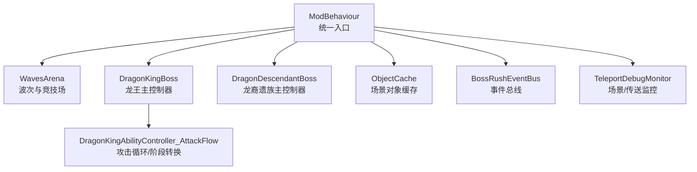
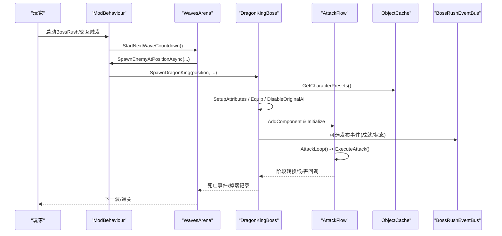
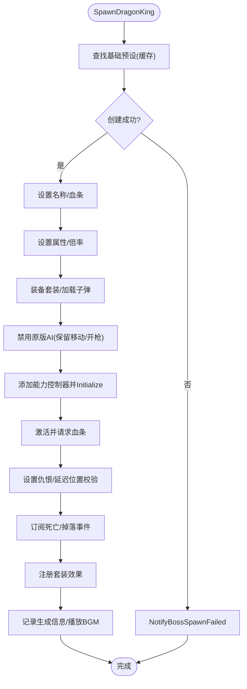
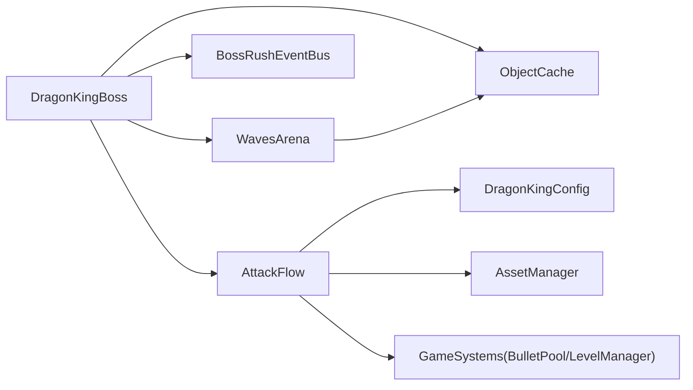

# 核心架构与生命周期

<cite>
**本文引用的文件**
- [DragonKingBoss.cs](file://Integration/DragonKing/DragonKingBoss.cs)
- [DragonDescendantBoss.cs](file://Integration/DragonDescendant/DragonDescendantBoss.cs)
- [WavesArena.cs](file://WavesArena/WavesArena.cs)
- [ObjectCache.cs](file://Common/Infrastructure/ObjectCache.cs)
- [BossRushEventBus.cs](file://Common/Events/BossRushEventBus.cs)
- [DragonKingAbilityController_AttackFlow.cs](file://Integration/DragonKing/DragonKingAbilityController_AttackFlow.cs)
- [TeleportDebugMonitor.cs](file://TeleportDebugMonitor.cs)
- [ModBehaviour.cs](file://ModBehaviour.cs)
</cite>

## 目录
1. [简介](#简介)
2. [项目结构](#项目结构)
3. [核心组件](#核心组件)
4. [架构总览](#架构总览)
5. [详细组件分析](#详细组件分析)
6. [依赖关系分析](#依赖关系分析)
7. [性能考量](#性能考量)
8. [故障排除指南](#故障排除指南)
9. [结论](#结论)
10. [附录：扩展开发指南](#附录：扩展开发指南)

## 简介
本文件面向“焚天龙皇”（龙王）及其相关 Boss 的核心架构与生命周期，系统性说明多实例支持、资源缓存、生成流程、属性设置、装备系统、AI 配置、静态缓存管理、事件订阅机制、内存优化策略、多 Boss 模式、场景切换处理与性能监控。文档同时提供扩展开发与故障排除建议，帮助开发者在不破坏现有稳定性的前提下进行二次开发。

## 项目结构
- Boss 主控制器以 partial class 形式挂载在 ModBehaviour 上，按 Boss 类型拆分实现：
  - 龙王：Integration/DragonKing/DragonKingBoss.cs
  - 龙裔遗族：Integration/DragonDescendant/DragonDescendantBoss.cs
- 波次与竞技场管理：WavesArena/WavesArena.cs
- 通用基础设施：
  - 对象缓存：Common/Infrastructure/ObjectCache.cs
  - 事件总线：Common/Events/BossRushEventBus.cs
  - 运行时模块基类：Common/Lifecycle/BossRushRuntimeModuleBase.cs
- 能力与控制流：
  - 龙王攻击循环与阶段转换：Integration/DragonKing/DragonKingAbilityController_AttackFlow.cs
- 调试与监控：
  - 传送调试监控：TeleportDebugMonitor.cs
- 入口与统一行为：
  - ModBehaviour.cs（含 BossRush 启动、传送、敌人生成等）

**图表来源**
- [ModBehaviour.cs:992-1116](file://ModBehaviour.cs#L992-L1116)
- [WavesArena.cs:1-120](file://WavesArena/WavesArena.cs#L1-L120)
- [DragonKingBoss.cs:20-95](file://Integration/DragonKing/DragonKingBoss.cs#L20-L95)
- [DragonDescendantBoss.cs:20-65](file://Integration/DragonDescendant/DragonDescendantBoss.cs#L20-L65)
- [ObjectCache.cs:11-63](file://Common/Infrastructure/ObjectCache.cs#L11-L63)
- [BossRushEventBus.cs:10-136](file://Common/Events/BossRushEventBus.cs#L10-L136)
- [TeleportDebugMonitor.cs:129-165](file://TeleportDebugMonitor.cs#L129-L165)

**章节来源**
- [ModBehaviour.cs:992-1116](file://ModBehaviour.cs#L992-L1116)
- [WavesArena.cs:1-120](file://WavesArena/WavesArena.cs#L1-L120)

## 核心组件
- 龙王主控制器（DragonKingBoss）
  - 负责龙王生成、属性设置、装备、AI 配置、事件订阅、多实例跟踪与清理。
- 龙裔遗族主控制器（DragonDescendantBoss）
  - 负责龙裔遗族生成、属性设置、装备、能力控制器初始化、预设缓存与清理。
- 波次与竞技场（WavesArena）
  - 负责开始挑战、传送、波次倒计时、敌人生成、死亡处理、多 Boss 模式推进。
- 对象缓存（ObjectCache）
  - 集中缓存场景对象与预设，按场景自动失效，避免频繁 FindObjectsOfTypeAll。
- 事件总线（BossRushEventBus）
  - 轻量级发布/订阅，支持重入保护与异常隔离，用于跨模块通知。
- 龙王攻击循环（DragonKingAbilityController_AttackFlow）
  - 控制攻击序列、阶段转换、自定义射击、特效与位置校验。

**章节来源**
- [DragonKingBoss.cs:20-95](file://Integration/DragonKing/DragonKingBoss.cs#L20-L95)
- [DragonDescendantBoss.cs:20-65](file://Integration/DragonDescendant/DragonDescendantBoss.cs#L20-L65)
- [WavesArena.cs:108-184](file://WavesArena/WavesArena.cs#L108-L184)
- [ObjectCache.cs:11-63](file://Common/Infrastructure/ObjectCache.cs#L11-L63)
- [BossRushEventBus.cs:10-136](file://Common/Events/BossRushEventBus.cs#L10-L136)
- [DragonKingAbilityController_AttackFlow.cs:17-132](file://Integration/DragonKing/DragonKingAbilityController_AttackFlow.cs#L17-L132)

## 架构总览
整体采用“主控制器 + 能力控制器 + 波次管理器 + 基础设施”的分层设计：
- 主控制器负责 Boss 的创建、配置、事件绑定与生命周期管理。
- 能力控制器专注 AI 行为、技能释放、阶段转换与特效。
- 波次管理器协调多 Boss 模式、波次推进、失败回退与结算。
- 基础设施提供缓存、事件、场景监控等横切关注点。

**图表来源**
- [ModBehaviour.cs:992-1116](file://ModBehaviour.cs#L992-L1116)
- [WavesArena.cs:108-184](file://WavesArena/WavesArena.cs#L108-L184)
- [DragonKingBoss.cs:209-371](file://Integration/DragonKing/DragonKingBoss.cs#L209-L371)
- [DragonKingAbilityController_AttackFlow.cs:17-132](file://Integration/DragonKing/DragonKingAbilityController_AttackFlow.cs#L17-L132)
- [ObjectCache.cs:150-159](file://Common/Infrastructure/ObjectCache.cs#L150-L159)
- [BossRushEventBus.cs:60-113](file://Common/Events/BossRushEventBus.cs#L60-L113)

## 详细组件分析

### 龙王主控制器（DragonKingBoss）
- 多实例支持
  - 使用字典维护 CharacterMainControl 到能力控制器的映射，支持同屏多龙王。
  - 为每个实例独立注册掉落与死亡事件委托，避免共享监听导致的误触发或泄漏。
  - 活跃 Health 引用集合用于快速判断全局事件是否命中当前龙王。
- 生命周期管理
  - 生成：查找基础预设 → 异步创建角色 → 设置名称/血条 → 设置属性 → 应用倍率 → 装备套装 → 禁用原版AI → 添加能力控制器 → 激活并请求显示血条 → 设置仇恨 → 延迟位置校验与恢复锚点 → 订阅死亡事件 → 注册套装效果 → 记录生成信息 → 播放BGM。
  - 清理：离开竞技场时遍历跟踪字典，调用 OnBossDeath、注销事件、移除引用、销毁运行时预设、释放资源（引用计数）。
- 资源缓存机制
  - 静态缓存龙王基础预设与搜索标记，减少重复扫描。
  - 场景切换时调用 ClearDragonKingStaticCache 清理资源管理器与能力控制器缓存，重置BGM状态。
- 生成流程与属性设置
  - 通过 CharacterRandomPreset.CreateCharacterAsync 异步生成；若失败则统一上报生成失败。
  - 设置 MaxHealth、GunDamageMultiplier、MeleeDamageMultiplier，并恢复满血。
- 装备系统
  - 根据配置查找并装备头盔与护甲，刷新模型，加载最高级子弹。
- AI 配置
  - 保留原版AI走路与开枪逻辑，仅在技能释放时收枪；Mode E 下不强制设置仇恨目标。
- 事件订阅与内存优化
  - 使用命名委托与局部变量捕获，确保每个实例正确取消订阅。
  - 火焰伤害免疫通过全局事件 + 活跃 Health 集合快速过滤，降低热路径开销。

**图表来源**
- [DragonKingBoss.cs:209-371](file://Integration/DragonKing/DragonKingBoss.cs#L209-L371)
- [DragonKingBoss.cs:414-511](file://Integration/DragonKing/DragonKingBoss.cs#L414-L511)
- [DragonKingBoss.cs:517-551](file://Integration/DragonKing/DragonKingBoss.cs#L517-L551)
- [DragonKingBoss.cs:706-765](file://Integration/DragonKing/DragonKingBoss.cs#L706-L765)

**章节来源**
- [DragonKingBoss.cs:20-95](file://Integration/DragonKing/DragonKingBoss.cs#L20-L95)
- [DragonKingBoss.cs:209-371](file://Integration/DragonKing/DragonKingBoss.cs#L209-L371)
- [DragonKingBoss.cs:414-511](file://Integration/DragonKing/DragonKingBoss.cs#L414-L511)
- [DragonKingBoss.cs:517-551](file://Integration/DragonKing/DragonKingBoss.cs#L517-L551)
- [DragonKingBoss.cs:706-765](file://Integration/DragonKing/DragonKingBoss.cs#L706-L765)

### 龙裔遗族主控制器（DragonDescendantBoss）
- 生成流程
  - 查找基础预设（优先 Cname_Boss_Red，后备任意 showName=true 非玩家预设），异步创建角色。
  - 非孩儿护我召唤时设置为 currentBoss 并加入当前波列表；否则跳过波次追踪但保留掉落。
  - 创建独立预设副本以避免修改原版预设；设置血条显示。
  - 设置属性与倍率；在替换武器前抓取原始武器数据（用于二阶段射击）。
  - 装备龙头/龙甲与龙息武器，刷新模型，加载高级子弹；添加能力控制器并初始化。
  - 激活后请求血条，设置仇恨，延迟位置校验与恢复锚点；订阅死亡事件与套装效果。
- 预设与物品缓存
  - 缓存基础预设、后备预设、物品与武器配置，场景切换时清理静态缓存。
- 性能优化
  - 使用 ObjectCache.GetCharacterPresets 替代 Resources.FindObjectsOfTypeAll。
  - 通过 ItemAssetsCollection 获取预制体，减少反射与遍历开销。

**章节来源**
- [DragonDescendantBoss.cs:56-235](file://Integration/DragonDescendant/DragonDescendantBoss.cs#L56-L235)
- [DragonDescendantBoss.cs:262-426](file://Integration/DragonDescendant/DragonDescendantBoss.cs#L262-L426)
- [DragonDescendantBoss.cs:460-566](file://Integration/DragonDescendant/DragonDescendantBoss.cs#L460-L566)
- [DragonDescendantBoss.cs:568-676](file://Integration/DragonDescendant/DragonDescendantBoss.cs#L568-L676)
- [DragonDescendantBoss.cs:678-743](file://Integration/DragonDescendant/DragonDescendantBoss.cs#L678-L743)

### 波次与竞技场（WavesArena）
- 波次推进
  - StartNextWaveCountdown 计算间隔与里程碑休息，显示倒计时横幅，超时后 SpawnNextEnemy。
  - 死亡处理 HandleBossDeath 支持多 Boss 模式：从当前波列表中移除已死 Boss，全部击杀后 ProceedAfterWaveFinished。
  - 生成失败 OnBossSpawnFailed 修正计数并推进波次，保证流程健壮性。
- 敌人预设初始化
  - 动态发现敌人类型，过滤玩家/中立阵营与低血量单位，排序后注册自定义 Boss（龙裔、龙王、幽灵女巫）。
  - 计算 Boss 池基础血量范围，用于后续权重选择。
- 无间炼狱模式
  - 按权重随机选取敌人预设，权重基于基础血量与波次线性放大，并叠加用户因子。

**章节来源**
- [WavesArena.cs:108-184](file://WavesArena/WavesArena.cs#L108-L184)
- [WavesArena.cs:209-441](file://WavesArena/WavesArena.cs#L209-L441)
- [WavesArena.cs:443-549](file://WavesArena/WavesArena.cs#L443-L549)
- [WavesArena.cs:551-641](file://WavesArena/WavesArena.cs#L551-L641)
- [WavesArena.cs:643-742](file://WavesArena/WavesArena.cs#L643-L742)

### 对象缓存（ObjectCache）
- 场景对象缓存
  - 缓存 BoxCollider、NotificationText、CharacterSpawnerRoot、StockShop、TMP_FontAsset、CharacterRandomPreset 等。
  - 按场景名自动失效，提供 ForceRefresh 与 ResetStaticCaches。
- 热路径优化
  - 提供 GetSceneObjectsByType 与 InvalidateSceneObjectsByType，避免每帧扫描。
  - 检查 Unity 对象数组存活，防止空引用。

**章节来源**
- [ObjectCache.cs:11-63](file://Common/Infrastructure/ObjectCache.cs#L11-L63)
- [ObjectCache.cs:74-159](file://Common/Infrastructure/ObjectCache.cs#L74-L159)
- [ObjectCache.cs:161-201](file://Common/Infrastructure/ObjectCache.cs#L161-L201)

### 事件总线（BossRushEventBus）
- 发布/订阅
  - 类型化事件字典，支持 Subscribe/Unsubscribe/Publish。
  - 发布时使用共享缓冲快照，支持嵌套发布（publishDepth），异常隔离。
- 生命周期
  - 提供 ClearRuntimeSubscribers 与 ResetStaticCaches，配合场景切换与卸载。

**章节来源**
- [BossRushEventBus.cs:10-136](file://Common/Events/BossRushEventBus.cs#L10-L136)

### 龙王攻击循环（DragonKingAbilityController_AttackFlow）
- 攻击主循环
  - 等待初始化与启动延迟，循环执行攻击序列，阶段转换或孩儿护我期间暂停。
  - Mode E 下无仇恨目标时跳过本轮，等待原版AI搜索目标。
- 阶段转换
  - 半血触发 Transitioning，立即禁用 Boss、停止协程与射击、清理特效、隐藏模型、播放特效、传送至地面有效位置、播放冲击波、恢复可见性与AI、重启攻击循环。
- 自定义射击
  - 移除 Boss 武器并禁止 AI 拿枪，启动自定义射击循环，按阶段发射不同数量子弹，偏移范围随阶段变化。
- 伤害回调与无敌保护
  - 孩儿护我与阶段转换中回补伤害，确保不会提前死亡；ShouldClampLethalHealthDuringHurt 提供钩子。

**章节来源**
- [DragonKingAbilityController_AttackFlow.cs:17-132](file://Integration/DragonKing/DragonKingAbilityController_AttackFlow.cs#L17-L132)
- [DragonKingAbilityController_AttackFlow.cs:136-287](file://Integration/DragonKing/DragonKingAbilityController_AttackFlow.cs#L136-L287)
- [DragonKingAbilityController_AttackFlow.cs:417-478](file://Integration/DragonKing/DragonKingAbilityController_AttackFlow.cs#L417-L478)
- [DragonKingAbilityController_AttackFlow.cs:483-741](file://Integration/DragonKing/DragonKingAbilityController_AttackFlow.cs#L483-L741)

## 依赖关系分析
- 主控制器依赖：
  - 波次管理器：生成与推进波次。
  - 对象缓存：预设与场景对象查找。
  - 事件总线：跨模块通知（如成就解锁）。
  - 能力控制器：AI 行为与技能释放。
- 波次管理器依赖：
  - 主控制器：具体 Boss 生成与失败处理。
  - 对象缓存：预设初始化与过滤。
- 能力控制器依赖：
  - 配置常量：阶段阈值、攻击间隔、特效资源。
  - 资产管理器：特效复用与释放。
  - 游戏系统：BulletPool、LevelManager、Health、AICharacterController。

**图表来源**
- [DragonKingBoss.cs:209-371](file://Integration/DragonKing/DragonKingBoss.cs#L209-L371)
- [WavesArena.cs:551-641](file://WavesArena/WavesArena.cs#L551-L641)
- [DragonKingAbilityController_AttackFlow.cs:136-287](file://Integration/DragonKing/DragonKingAbilityController_AttackFlow.cs#L136-L287)

**章节来源**
- [DragonKingBoss.cs:209-371](file://Integration/DragonKing/DragonKingBoss.cs#L209-L371)
- [WavesArena.cs:551-641](file://WavesArena/WavesArena.cs#L551-L641)
- [DragonKingAbilityController_AttackFlow.cs:136-287](file://Integration/DragonKing/DragonKingAbilityController_AttackFlow.cs#L136-L287)

## 性能考量
- 静态缓存与场景失效
  - ObjectCache 按场景自动失效，避免跨场景持有已销毁对象引用。
  - 龙王与龙裔遗族在场景切换时清理静态缓存，防止资源泄漏。
- 热路径优化
  - 使用 ObjectCache.GetCharacterPresets 替代 Resources.FindObjectsOfTypeAll。
  - 事件发布使用共享缓冲与快照，减少分配与 GC。
  - 龙王攻击循环复用 WaitForSeconds 对象，避免每帧分配。
- 内存优化策略
  - 多实例事件委托独立注册与取消，避免匿名闭包泄漏。
  - 火焰伤害免疫通过活跃 Health 集合快速过滤，降低事件处理成本。
  - 能力控制器在阶段转换时停止协程与特效，及时释放资源。
- 性能监控
  - TeleportDebugMonitor 监听 SceneLoaded/Unloaded 与 MultiSceneTeleporter，辅助定位场景切换问题。

**章节来源**
- [ObjectCache.cs:11-63](file://Common/Infrastructure/ObjectCache.cs#L11-L63)
- [DragonKingBoss.cs:77-95](file://Integration/DragonKing/DragonKingBoss.cs#L77-L95)
- [DragonKingAbilityController_AttackFlow.cs:122-132](file://Integration/DragonKing/DragonKingAbilityController_AttackFlow.cs#L122-L132)
- [BossRushEventBus.cs:60-113](file://Common/Events/BossRushEventBus.cs#L60-L113)
- [TeleportDebugMonitor.cs:129-165](file://TeleportDebugMonitor.cs#L129-L165)

## 故障排除指南
- 生成失败
  - 检查基础预设是否存在（龙王/龙裔遗族），确认预设缓存是否被清理。
  - 查看 NotifyBossSpawnFailed 调用路径，确认错误日志。
- 多 Boss 模式推进异常
  - 检查 currentWaveBosses 列表是否正确添加与移除。
  - 确认 OnEnemyDiedWithDamageInfo 与 HandleBossDeath 的多 Boss 分支逻辑。
- 场景切换导致崩溃
  - 确保调用 ClearDragonKingStaticCache 与 ClearDragonDescendantStaticCache。
  - 验证 ObjectCache.ResetStaticCaches 是否在卸载时调用。
- 事件泄漏
  - 检查死亡与掉落事件委托是否正确 RemoveListener 与 -=。
  - 使用 BossRushEventBus.ClearRuntimeSubscribers 清理运行时订阅。
- 性能问题
  - 避免在热路径中使用 Resources.FindObjectsOfTypeAll，改用 ObjectCache。
  - 检查攻击循环与自定义射击是否因阶段转换未正确停止。

**章节来源**
- [DragonKingBoss.cs:636-650](file://Integration/DragonKing/DragonKingBoss.cs#L636-L650)
- [WavesArena.cs:209-441](file://WavesArena/WavesArena.cs#L209-L441)
- [ObjectCache.cs:65-72](file://Common/Infrastructure/ObjectCache.cs#L65-L72)
- [BossRushEventBus.cs:126-136](file://Common/Events/BossRushEventBus.cs#L126-L136)
- [DragonKingAbilityController_AttackFlow.cs:156-287](file://Integration/DragonKing/DragonKingAbilityController_AttackFlow.cs#L156-L287)

## 结论
本架构通过主控制器与能力控制器分离、波次管理器协调、基础设施提供缓存与事件支持，实现了高内聚、低耦合的可扩展设计。多实例支持、静态缓存管理、事件订阅机制与内存优化策略确保了在高负载下的稳定性与性能。场景切换处理与性能监控为调试与维护提供了有力支撑。扩展开发应遵循现有模式，谨慎管理生命周期与资源，避免引入性能瓶颈与内存泄漏。

## 附录：扩展开发指南
- 新增 Boss 类型
  - 在主控制器中实现生成、属性设置、装备、AI 配置与事件订阅。
  - 在波次管理器中注册预设与过滤规则。
  - 使用 ObjectCache 与 BossRushEventBus 进行资源与事件管理。
- 扩展事件系统
  - 定义新的事件结构，通过 BossRushEventBus.Publish 发布。
  - 在需要处 Subscribe/Unsubscribe，确保生命周期匹配。
- 性能优化建议
  - 避免在热路径中进行昂贵操作，使用缓存与批量处理。
  - 合理使用协程与定时器，避免过多并发导致卡顿。
- 调试与测试
  - 使用 TeleportDebugMonitor 监控场景切换与传送。
  - 编写单元测试与守护脚本，确保关键路径不被破坏。

[本节为概念性内容，不直接分析具体文件]