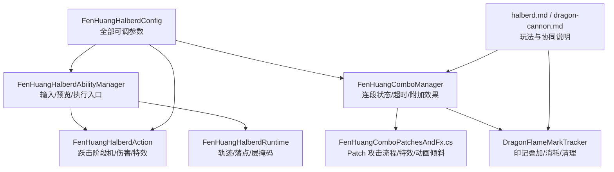
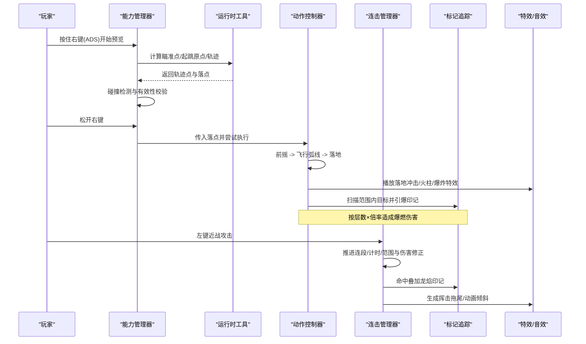
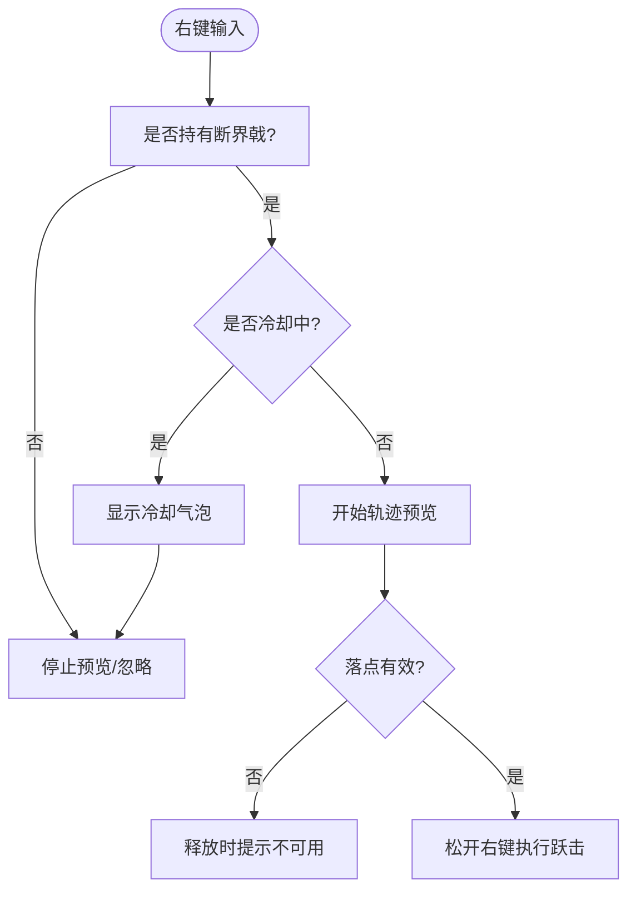
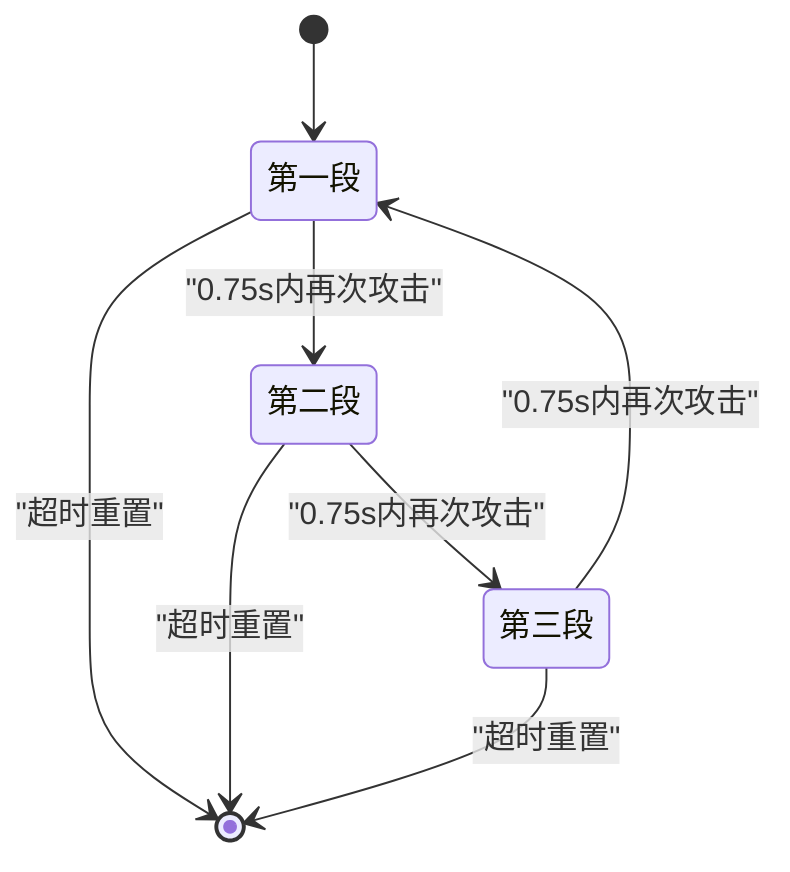
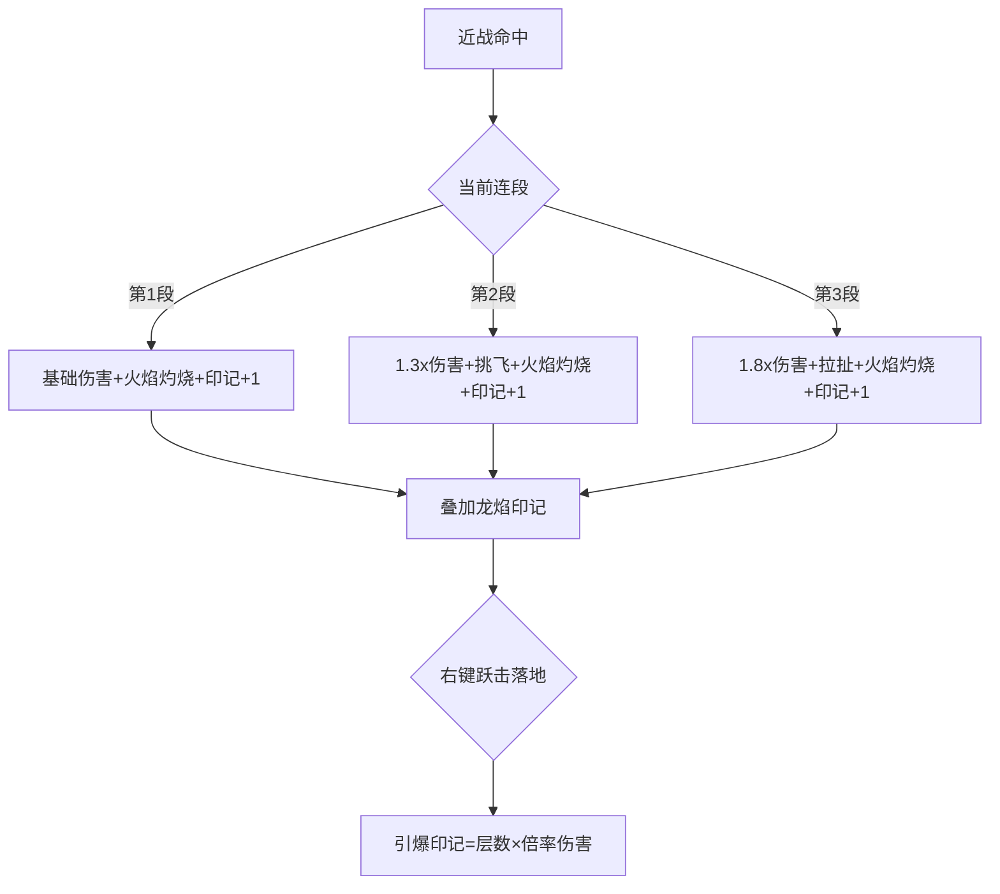
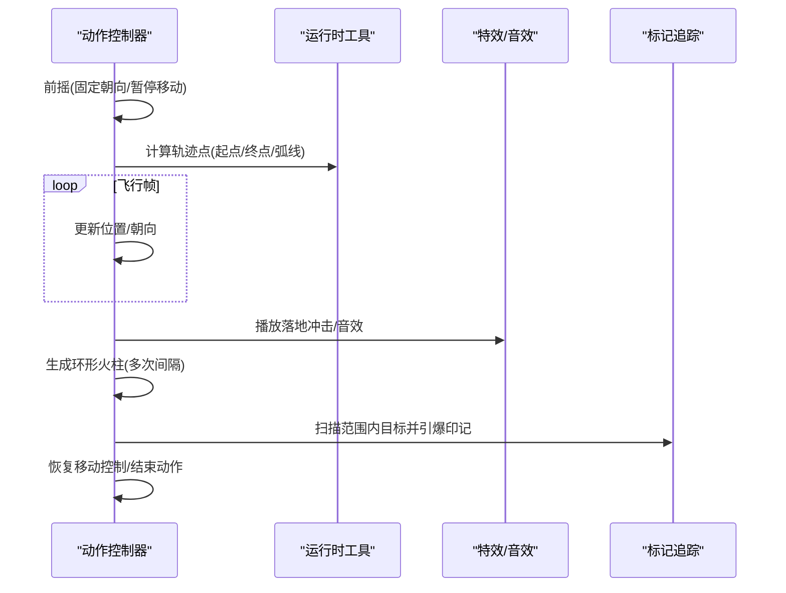
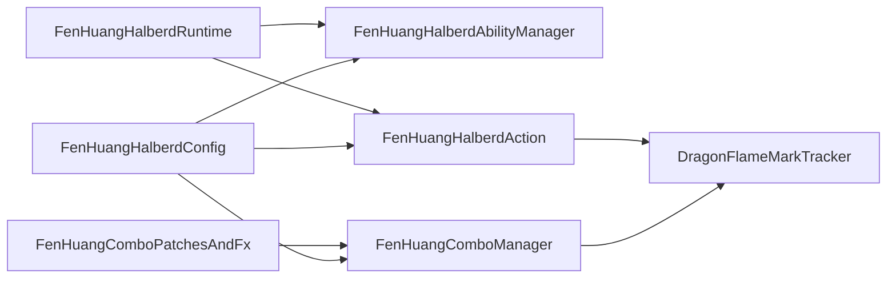

# 方天画戟系统

<cite>
**本文引用的文件**
- [FenHuangHalberdAbilityManager.cs](file://Integration/DragonKing/Weapons/FenHuangHalberdAbilityManager.cs)
- [FenHuangComboManager.cs](file://Integration/DragonKing/Weapons/FenHuangComboManager.cs)
- [FenHuangHalberdAction.cs](file://Integration/DragonKing/Weapons/FenHuangHalberdAction.cs)
- [FenHuangHalberdConfig.cs](file://Integration/DragonKing/Weapons/FenHuangHalberdConfig.cs)
- [DragonFlameMarkTracker.cs](file://Integration/DragonKing/Weapons/DragonFlameMarkTracker.cs)
- [FenHuangHalberdRuntime.cs](file://Integration/DragonKing/Weapons/FenHuangHalberdRuntime.cs)
- [FenHuangComboPatchesAndFx.cs](file://Integration/DragonKing/Weapons/FenHuangComboPatchesAndFx.cs)
- [halberd.md](file://wiki-site/docs/en/equipment/halberd.md)
- [dragon-cannon.md](file://wiki-site/docs/en/equipment/dragon-cannon.md)
</cite>

## 目录
1. [简介](#简介)
2. [项目结构](#项目结构)
3. [核心组件](#核心组件)
4. [架构总览](#架构总览)
5. [详细组件分析](#详细组件分析)
6. [依赖关系分析](#依赖关系分析)
7. [性能考量](#性能考量)
8. [故障排查指南](#故障排查指南)
9. [结论](#结论)
10. [附录：配置与扩展示例](#附录：配置与扩展示例)

## 简介
本技术文档围绕“焚皇断界戟”（方天画戟）能力系统展开，系统性说明其技能触发条件、冷却时间管理、连击计数系统、连击组合机制、技能动作实现、与龙皇炮的协同工作、能力配置方法、性能优化策略与调试工具使用方法。该武器具备三段近战连招、右键跃击裂地、龙焰印记叠加与引爆等核心玩法，并与龙皇炮共享标记体系形成联动爆发。

## 项目结构
本系统位于 DragonKing 集成模块的 Weapons 子目录，采用“管理器 + 动作 + 运行时辅助 + 配置 + 补丁特效”的分层组织方式：
- 能力管理器：负责输入处理、预览、执行入口与生命周期
- 动作控制器：负责具体技能阶段机、位移、伤害与特效
- 连击管理器：维护连段状态、超时重置、命中后附加效果
- 运行时工具：轨迹计算、落点吸附、层掩码、资源加载
- 配置类：集中暴露可调参数（冷却、伤害、范围、持续等）
- 补丁与特效：Hook 原生攻击流程，注入挥击特效与动画倾斜
- 标记追踪：统一维护目标身上的龙焰印记

图表来源
- [FenHuangHalberdAbilityManager.cs:1-120](file://Integration/DragonKing/Weapons/FenHuangHalberdAbilityManager.cs#L1-L120)
- [FenHuangHalberdAction.cs:1-140](file://Integration/DragonKing/Weapons/FenHuangHalberdAction.cs#L1-L140)
- [FenHuangComboManager.cs:1-120](file://Integration/DragonKing/Weapons/FenHuangComboManager.cs#L1-L120)
- [FenHuangComboPatchesAndFx.cs:25-90](file://Integration/DragonKing/Weapons/FenHuangComboPatchesAndFx.cs#L25-L90)
- [DragonFlameMarkTracker.cs:1-60](file://Integration/DragonKing/Weapons/DragonFlameMarkTracker.cs#L1-L60)
- [FenHuangHalberdConfig.cs:14-120](file://Integration/DragonKing/Weapons/FenHuangHalberdConfig.cs#L14-L120)
- [halberd.md:13-41](file://wiki-site/docs/en/equipment/halberd.md#L13-L41)
- [dragon-cannon.md:48-52](file://wiki-site/docs/en/equipment/dragon-cannon.md#L48-L52)

章节来源
- [FenHuangHalberdAbilityManager.cs:1-120](file://Integration/DragonKing/Weapons/FenHuangHalberdAbilityManager.cs#L1-L120)
- [FenHuangHalberdAction.cs:1-140](file://Integration/DragonKing/Weapons/FenHuangHalberdAction.cs#L1-L140)
- [FenHuangComboManager.cs:1-120](file://Integration/DragonKing/Weapons/FenHuangComboManager.cs#L1-L120)
- [FenHuangHalberdConfig.cs:14-120](file://Integration/DragonKing/Weapons/FenHuangHalberdConfig.cs#L14-L120)

## 核心组件
- 能力管理器：封装右键技能的输入检测、冷却提示、跳跃轨迹预览、执行判定与防误触逻辑
- 动作控制器：实现跃击前摇、飞行弧线、落地冲击、火柱序列、印记引爆与视觉反馈
- 连击管理器：维护三段连招状态机、超时重置、每段伤害/范围/特效、命中后附加效果（灼烧、拉扯、挑飞）、龙焰印记叠加
- 运行时工具：提供瞄准点、起跳原点、轨迹插值、地面吸附、碰撞层掩码、资源加载保障
- 配置类：集中定义冷却、体力、伤害、范围、角度、持续时间、印记上限与时长等所有可调参数
- 补丁与特效：在原生攻击流程前后注入自定义伤害、挥击拖尾、动画倾斜与音效
- 标记追踪：以目标为键维护印记层数与过期时间，支持批量清理与消费

章节来源
- [FenHuangHalberdAbilityManager.cs:120-300](file://Integration/DragonKing/Weapons/FenHuangHalberdAbilityManager.cs#L120-L300)
- [FenHuangHalberdAction.cs:140-330](file://Integration/DragonKing/Weapons/FenHuangHalberdAction.cs#L140-L330)
- [FenHuangComboManager.cs:130-220](file://Integration/DragonKing/Weapons/FenHuangComboManager.cs#L130-L220)
- [FenHuangHalberdRuntime.cs:60-170](file://Integration/DragonKing/Weapons/FenHuangHalberdRuntime.cs#L60-L170)
- [FenHuangHalberdConfig.cs:36-120](file://Integration/DragonKing/Weapons/FenHuangHalberdConfig.cs#L36-L120)
- [DragonFlameMarkTracker.cs:25-100](file://Integration/DragonKing/Weapons/DragonFlameMarkTracker.cs#L25-L100)
- [FenHuangComboPatchesAndFx.cs:230-425](file://Integration/DragonKing/Weapons/FenHuangComboPatchesAndFx.cs#L230-L425)

## 架构总览
下图展示从输入到执行再到伤害与特效的主流程，以及连击与标记系统的交互。

图表来源
- [FenHuangHalberdAbilityManager.cs:120-270](file://Integration/DragonKing/Weapons/FenHuangHalberdAbilityManager.cs#L120-L270)
- [FenHuangHalberdAction.cs:180-330](file://Integration/DragonKing/Weapons/FenHuangHalberdAction.cs#L180-L330)
- [FenHuangComboManager.cs:130-220](file://Integration/DragonKing/Weapons/FenHuangComboManager.cs#L130-L220)
- [FenHuangComboPatchesAndFx.cs:25-90](file://Integration/DragonKing/Weapons/FenHuangComboPatchesAndFx.cs#L25-L90)
- [DragonFlameMarkTracker.cs:25-100](file://Integration/DragonKing/Weapons/DragonFlameMarkTracker.cs#L25-L100)

## 详细组件分析

### 技能触发条件与冷却管理
- 输入绑定：默认使用 ADS 输入（兼容鼠标右键），在持有断界戟时生效；若未持有或处于非游戏输入状态则忽略
- 前置检查：确保能力可用、无运行中动作、资源已加载
- 冷却提示：当技能处于冷却时按下右键，会周期性显示剩余秒数的气泡提示
- 预览与执行：长按右键进入轨迹预览，松开右键在有效落点时执行跃击；无效落点会给出“过不去”的提示

图表来源
- [FenHuangHalberdAbilityManager.cs:120-190](file://Integration/DragonKing/Weapons/FenHuangHalberdAbilityManager.cs#L120-L190)
- [FenHuangHalberdAbilityManager.cs:298-330](file://Integration/DragonKing/Weapons/FenHuangHalberdAbilityManager.cs#L298-L330)
- [FenHuangHalberdAbilityManager.cs:542-579](file://Integration/DragonKing/Weapons/FenHuangHalberdAbilityManager.cs#L542-L579)

章节来源
- [FenHuangHalberdAbilityManager.cs:120-330](file://Integration/DragonKing/Weapons/FenHuangHalberdAbilityManager.cs#L120-L330)
- [FenHuangHalberdConfig.cs:36-60](file://Integration/DragonKing/Weapons/FenHuangHalberdConfig.cs#L36-L60)

### 连击计数系统与阶段转换
- 连击窗口：每次攻击刷新计时器，超过窗口时间自动重置为第 1 段
- 阶段推进：在攻击开始时记录当前段用于本次特效与附加效果，然后推进到下一段，形成 0→1→2→0 循环
- 每段特性：
  - 第 1 段：横扫，基础范围与伤害
  - 第 2 段：上挑，附带挑飞高度与额外伤害倍率
  - 第 3 段：重劈，范围扩大并产生拉扯效果
- 伤害与范围：根据段数对基础伤害与范围进行修正，避免直接覆写实时属性

图表来源
- [FenHuangComboManager.cs:89-145](file://Integration/DragonKing/Weapons/FenHuangComboManager.cs#L89-L145)
- [FenHuangComboManager.cs:360-408](file://Integration/DragonKing/Weapons/FenHuangComboManager.cs#L360-L408)
- [FenHuangHalberdConfig.cs:129-199](file://Integration/DragonKing/Weapons/FenHuangHalberdConfig.cs#L129-L199)

章节来源
- [FenHuangComboManager.cs:89-220](file://Integration/DragonKing/Weapons/FenHuangComboManager.cs#L89-L220)
- [FenHuangComboPatchesAndFx.cs:25-90](file://Integration/DragonKing/Weapons/FenHuangComboPatchesAndFx.cs#L25-L90)
- [FenHuangHalberdConfig.cs:129-199](file://Integration/DragonKing/Weapons/FenHuangHalberdConfig.cs#L129-L199)

### 连击组合系统：触发条件、阶段转换、奖励机制
- 触发条件：通过 Patch 在原生攻击启动后推进连段并生成挥击特效；在命中后根据段数施加附加效果
- 阶段转换：AdvanceCombo 在 OnStart 后调用，保证本次攻击使用旧段号，再推进到新段号
- 奖励机制：
  - 每段命中均附加火焰伤害与灼烧 Buff
  - 每段命中叠加 1 层龙焰印记（最多 5 层，6 秒）
  - 第 2 段触发挑飞（抛物线位移）
  - 第 3 段触发拉扯（缓动向玩家移动）
  - 右键跃击落地时引爆范围内所有目标的印记，按层数×倍率造成爆燃伤害

图表来源
- [FenHuangComboManager.cs:283-358](file://Integration/DragonKing/Weapons/FenHuangComboManager.cs#L283-L358)
- [FenHuangComboManager.cs:410-558](file://Integration/DragonKing/Weapons/FenHuangComboManager.cs#L410-L558)
- [FenHuangHalberdAction.cs:320-400](file://Integration/DragonKing/Weapons/FenHuangHalberdAction.cs#L320-L400)
- [DragonFlameMarkTracker.cs:25-100](file://Integration/DragonKing/Weapons/DragonFlameMarkTracker.cs#L25-L100)

章节来源
- [FenHuangComboManager.cs:283-558](file://Integration/DragonKing/Weapons/FenHuangComboManager.cs#L283-L558)
- [FenHuangHalberdAction.cs:320-400](file://Integration/DragonKing/Weapons/FenHuangHalberdAction.cs#L320-L400)
- [DragonFlameMarkTracker.cs:25-100](file://Integration/DragonKing/Weapons/DragonFlameMarkTracker.cs#L25-L100)

### 技能动作系统：近战攻击、特殊技能、范围伤害
- 近战攻击：通过 Patch 拦截原生伤害流程，按连段计算伤害与范围，生成挥击拖尾与动画倾斜
- 特殊技能（右键跃击）：
  - 前摇：短暂蓄力，强制面向目标方向
  - 飞行：沿正弦弧线移动，保持角色朝向
  - 落地：圆形冲击伤害，随后环形生成多根火柱，持续造成伤害
  - 引爆：扫描范围内目标，消费印记造成爆燃伤害
- 范围伤害：落地冲击与火柱均基于半径与层掩码进行碰撞检测，仅对敌人生效

图表来源
- [FenHuangHalberdAction.cs:180-330](file://Integration/DragonKing/Weapons/FenHuangHalberdAction.cs#L180-L330)
- [FenHuangHalberdRuntime.cs:143-169](file://Integration/DragonKing/Weapons/FenHuangHalberdRuntime.cs#L143-L169)
- [FenHuangComboPatchesAndFx.cs:171-228](file://Integration/DragonKing/Weapons/FenHuangComboPatchesAndFx.cs#L171-L228)

章节来源
- [FenHuangHalberdAction.cs:180-330](file://Integration/DragonKing/Weapons/FenHuangHalberdAction.cs#L180-L330)
- [FenHuangHalberdRuntime.cs:143-169](file://Integration/DragonKing/Weapons/FenHuangHalberdRuntime.cs#L143-L169)
- [FenHuangComboPatchesAndFx.cs:171-228](file://Integration/DragonKing/Weapons/FenHuangComboPatchesAndFx.cs#L171-L228)

### 与龙皇炮的协同工作机制
- 标记共享：龙皇炮命中可为目标叠加龙焰印记（至多 10 层），切换至断界戟后可通过跃击引爆
- 伤害加成：跃击落地时按印记层数×每层倍率造成爆燃伤害，最大化群伤与爆发
- 技能联动：先用龙皇炮铺标记，再近身连招聚怪，最后跃击引爆，形成“远程铺场—近战控位—终结爆发”的循环

章节来源
- [dragon-cannon.md:48-52](file://wiki-site/docs/en/equipment/dragon-cannon.md#L48-L52)
- [halberd.md:23-41](file://wiki-site/docs/en/equipment/halberd.md#L23-L41)
- [DragonFlameMarkTracker.cs:25-100](file://Integration/DragonKing/Weapons/DragonFlameMarkTracker.cs#L25-L100)
- [FenHuangHalberdAction.cs:320-400](file://Integration/DragonKing/Weapons/FenHuangHalberdAction.cs#L320-L400)

### 能力配置方法
- 技能参数调整：修改右键技能冷却、体力消耗、前摇、飞行时间、火柱数量/伤害/持续时间/半径等
- 连招参数调整：各段范围、角度、伤害、挑飞高度、拉扯距离、火焰附加伤害与灼烧持续时间
- 印记参数调整：最大层数、持续时间、每层爆燃伤害、爆燃特效持续时间
- 建议：优先通过配置类常量调整数值，避免硬编码；如需新增段数或新技能，参考现有模式扩展

章节来源
- [FenHuangHalberdConfig.cs:36-120](file://Integration/DragonKing/Weapons/FenHuangHalberdConfig.cs#L36-L120)
- [FenHuangHalberdConfig.cs:129-211](file://Integration/DragonKing/Weapons/FenHuangHalberdConfig.cs#L129-L211)

## 依赖关系分析
- 能力管理器依赖运行时工具获取轨迹与层掩码，依赖动作控制器执行技能
- 连击管理器依赖补丁 Hook 原生攻击流程，并在命中后调用标记追踪与特效
- 动作控制器依赖运行时工具计算轨迹与落点，依赖标记追踪进行引爆
- 配置类被管理器、动作、连击共同引用，作为唯一参数源
- 补丁与特效依赖运行时工具与配置，确保视觉效果与行为一致

图表来源
- [FenHuangHalberdConfig.cs:14-120](file://Integration/DragonKing/Weapons/FenHuangHalberdConfig.cs#L14-L120)
- [FenHuangHalberdAbilityManager.cs:1-120](file://Integration/DragonKing/Weapons/FenHuangHalberdAbilityManager.cs#L1-L120)
- [FenHuangHalberdAction.cs:1-140](file://Integration/DragonKing/Weapons/FenHuangHalberdAction.cs#L1-L140)
- [FenHuangComboManager.cs:1-120](file://Integration/DragonKing/Weapons/FenHuangComboManager.cs#L1-L120)
- [FenHuangComboPatchesAndFx.cs:25-90](file://Integration/DragonKing/Weapons/FenHuangComboPatchesAndFx.cs#L25-L90)
- [DragonFlameMarkTracker.cs:1-60](file://Integration/DragonKing/Weapons/DragonFlameMarkTracker.cs#L1-L60)
- [FenHuangHalberdRuntime.cs:1-60](file://Integration/DragonKing/Weapons/FenHuangHalberdRuntime.cs#L1-L60)

章节来源
- [FenHuangHalberdAbilityManager.cs:1-120](file://Integration/DragonKing/Weapons/FenHuangHalberdAbilityManager.cs#L1-L120)
- [FenHuangHalberdAction.cs:1-140](file://Integration/DragonKing/Weapons/FenHuangHalberdAction.cs#L1-L140)
- [FenHuangComboManager.cs:1-120](file://Integration/DragonKing/Weapons/FenHuangComboManager.cs#L1-L120)
- [FenHuangComboPatchesAndFx.cs:25-90](file://Integration/DragonKing/Weapons/FenHuangComboPatchesAndFx.cs#L25-L90)
- [DragonFlameMarkTracker.cs:1-60](file://Integration/DragonKing/Weapons/DragonFlameMarkTracker.cs#L1-L60)
- [FenHuangHalberdRuntime.cs:1-60](file://Integration/DragonKing/Weapons/FenHuangHalberdRuntime.cs#L1-L60)
- [FenHuangHalberdConfig.cs:14-120](file://Integration/DragonKing/Weapons/FenHuangHalberdConfig.cs#L14-L120)

## 性能考量
- 低开销 Patch：仅在断界戟攻击时执行额外逻辑，其他武器零影响
- 批处理与限流：命中附加效果入队，每帧限制处理数量，避免卡顿
- 缓存与复用：反射方法缓存、静态缓冲数组、预览结果缓存与阈值判断减少重复计算
- 碰撞优化：使用非分配碰撞检测、合理层掩码、跳过首尾点轨迹检测
- 资源加载：延迟加载龙王特效资源，避免启动阻塞
- 动画与特效：粒子发射改为按距离生成，避免过密遮挡；光效范围与强度按需缩放

章节来源
- [FenHuangComboManager.cs:247-281](file://Integration/DragonKing/Weapons/FenHuangComboManager.cs#L247-L281)
- [FenHuangComboManager.cs:603-661](file://Integration/DragonKing/Weapons/FenHuangComboManager.cs#L603-L661)
- [FenHuangHalberdAbilityManager.cs:368-463](file://Integration/DragonKing/Weapons/FenHuangHalberdAbilityManager.cs#L368-L463)
- [FenHuangHalberdRuntime.cs:193-272](file://Integration/DragonKing/Weapons/FenHuangHalberdRuntime.cs#L193-L272)
- [FenHuangComboPatchesAndFx.cs:427-575](file://Integration/DragonKing/Weapons/FenHuangComboPatchesAndFx.cs#L427-L575)

## 故障排查指南
- 无法执行跃击：检查是否持有断界戟、是否在冷却、落点是否被阻挡、输入是否被 UI 占用
- 连招不生效：确认 Patch 是否命中断界戟 TypeID、连击管理器实例是否存在、攻击是否成功触发 OnStart
- 印记不叠加：检查命中回调是否进入、目标是否为敌方、是否已死亡、是否在同一攻击中被重复处理
- 特效异常：确认龙王资源是否加载成功、粒子系统是否启用世界空间模拟、光效范围是否过大导致过曝
- 性能问题：观察每帧处理效果数量、碰撞次数、粒子发射频率，必要时降低范围或数量

章节来源
- [FenHuangHalberdAbilityManager.cs:120-190](file://Integration/DragonKing/Weapons/FenHuangHalberdAbilityManager.cs#L120-L190)
- [FenHuangComboPatchesAndFx.cs:230-425](file://Integration/DragonKing/Weapons/FenHuangComboPatchesAndFx.cs#L230-L425)
- [FenHuangComboManager.cs:283-358](file://Integration/DragonKing/Weapons/FenHuangComboManager.cs#L283-L358)
- [FenHuangHalberdAction.cs:524-543](file://Integration/DragonKing/Weapons/FenHuangHalberdAction.cs#L524-L543)

## 结论
焚皇断界戟系统通过“连招—印记—跃击引爆”的核心循环，实现了高技巧上限与高回报的近战体验。其模块化设计使参数调优、功能扩展与性能优化均可在不侵入核心逻辑的前提下完成。与龙皇炮的标记共享进一步丰富了战术组合，适合追求爆发与控场的玩家。

## 附录：配置与扩展示例

### 新增一段连招的步骤
- 在配置类中添加新段的范围、角度、伤害、特效相关常量
- 在连击管理器中扩展段数判断与伤害/范围修正逻辑
- 在补丁与特效中为新段添加挥击拖尾与动画倾斜
- 如需要新附加效果（例如眩晕、减速），在命中回调中追加对应 Buff 或位移

章节来源
- [FenHuangHalberdConfig.cs:129-199](file://Integration/DragonKing/Weapons/FenHuangHalberdConfig.cs#L129-L199)
- [FenHuangComboManager.cs:360-408](file://Integration/DragonKing/Weapons/FenHuangComboManager.cs#L360-L408)
- [FenHuangComboPatchesAndFx.cs:134-169](file://Integration/DragonKing/Weapons/FenHuangComboPatchesAndFx.cs#L134-L169)
- [FenHuangComboPatchesAndFx.cs:171-228](file://Integration/DragonKing/Weapons/FenHuangComboPatchesAndFx.cs#L171-L228)

### 调整右键技能参数
- 修改冷却时间、体力消耗、前摇、飞行时间、火柱数量/伤害/持续时间/半径
- 调整落点冲击伤害与半径、爆燃每层伤害与特效持续时间
- 建议在测试环境中逐步调参，关注性能与手感平衡

章节来源
- [FenHuangHalberdConfig.cs:36-120](file://Integration/DragonKing/Weapons/FenHuangHalberdConfig.cs#L36-L120)
- [FenHuangHalberdConfig.cs:117-127](file://Integration/DragonKing/Weapons/FenHuangHalberdConfig.cs#L117-L127)

### 调试工具与日志
- 使用 DevLog 输出关键节点信息（资源加载、动作阶段、碰撞命中、印记消费）
- 通过预览颜色区分有效/无效落点（橙色安全、红色阻挡）
- 结合游戏内 UI 与气泡提示快速定位输入与冷却问题

章节来源
- [FenHuangHalberdAction.cs:524-543](file://Integration/DragonKing/Weapons/FenHuangHalberdAction.cs#L524-L543)
- [FenHuangHalberdAbilityManager.cs:274-330](file://Integration/DragonKing/Weapons/FenHuangHalberdAbilityManager.cs#L274-L330)
- [FenHuangHalberdAbilityManager.cs:766-798](file://Integration/DragonKing/Weapons/FenHuangHalberdAbilityManager.cs#L766-L798)