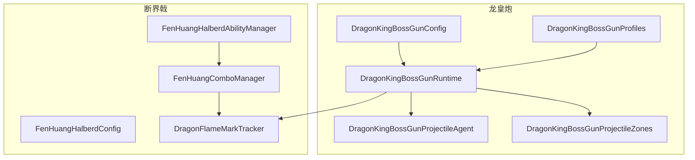
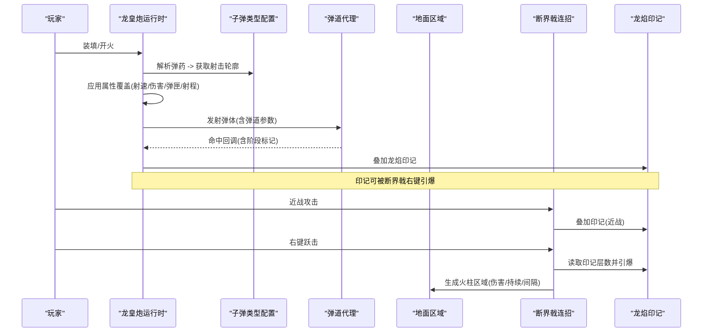
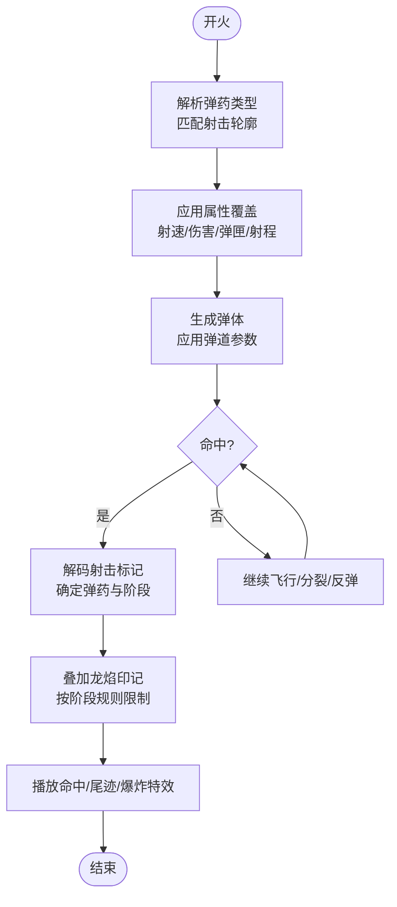
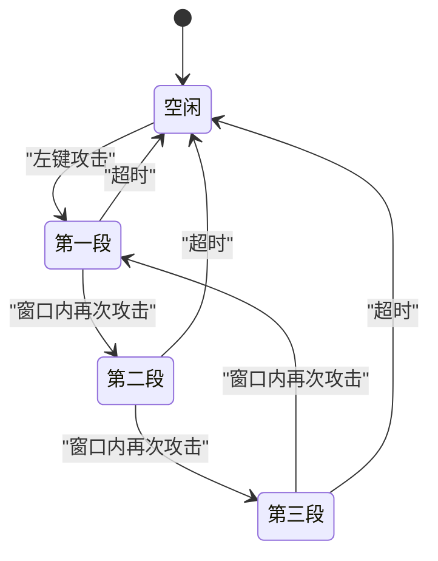
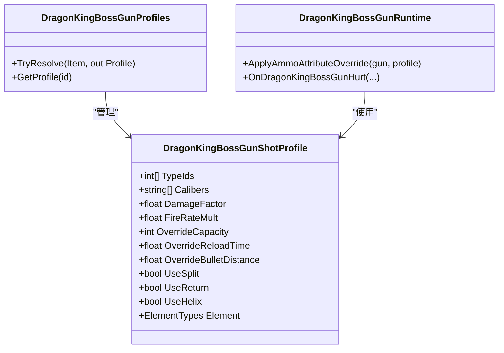
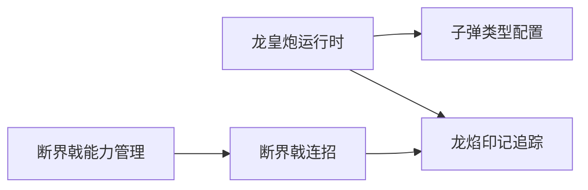

# 武器系统

<cite>
**本文引用的文件**
- [DragonKingBossGunConfig.cs](file://Integration/DragonKing/Weapons/DragonKingBossGunConfig.cs)
- [DragonKingBossGunProfiles.cs](file://Integration/DragonKing/Weapons/DragonKingBossGunProfiles.cs)
- [DragonKingBossGunRuntime.cs](file://Integration/DragonKing/Weapons/DragonKingBossGunRuntime.cs)
- [DragonKingBossGunProjectileAgent.cs](file://Integration/DragonKing/Weapons/DragonKingBossGunProjectileAgent.cs)
- [DragonKingBossGunProjectileZones.cs](file://Integration/DragonKing/Weapons/DragonKingBossGunProjectileZones.cs)
- [FenHuangHalberdConfig.cs](file://Integration/DragonKing/Weapons/FenHuangHalberdConfig.cs)
- [FenHuangHalberdAbilityManager.cs](file://Integration/DragonKing/Weapons/FenHuangHalberdAbilityManager.cs)
- [FenHuangComboManager.cs](file://Integration/DragonKing/Weapons/FenHuangComboManager.cs)
- [DragonFlameMarkTracker.cs](file://Integration/DragonKing/Weapons/DragonFlameMarkMarkTracker.cs)
</cite>

## 目录
1. [简介](#简介)
2. [项目结构](#项目结构)
3. [核心组件](#核心组件)
4. [架构总览](#架构总览)
5. [详细组件分析](#详细组件分析)
6. [依赖关系分析](#依赖关系分析)
7. [性能考量](#性能考量)
8. [故障排查指南](#故障排查指南)
9. [结论](#结论)
10. [附录：配置与自定义开发指南](#附录：配置与自定义开发指南)

## 简介
本文件面向“焚天龙皇”武器系统的实现文档，覆盖以下主题：
- 龙皇炮（焚天龙铳）的弹道计算、伤害判定、特效管理
- 方天画戟（焚皇断界戟）的能力系统：技能触发、冷却管理、三段连击机制
- 子弹类型系统、弹药管理、伤害倍率计算
- 武器切换逻辑、能量系统、特殊攻击模式
- 武器配置方法与自定义武器开发指南

该武器系统由“龙皇炮”与“断界戟”两大模块组成，二者通过“龙焰印记”进行联动：龙皇炮命中叠加印记，断界戟右键砸落引爆印记，层数越高，爆燃越烈。

## 项目结构
武器系统位于 Integration/DragonKing/Weapons 目录下，按职责划分为：
- 配置类：定义武器基础属性、技能参数、连招参数等
- 运行时：处理射击、弹道、命中、标记、特效、能力执行等
- 子弹与弹道：根据弹药类型选择不同行为（分裂、回旋、螺旋、地面区域等）
- 连招与能力：断界戟的三段连击与右键跃击落地火柱

图表来源
- [DragonKingBossGunConfig.cs:13-32](file://Integration/DragonKing/Weapons/DragonKingBossGunConfig.cs#L13-L32)
- [DragonKingBossGunProfiles.cs:9-26](file://Integration/DragonKing/Weapons/DragonKingBossGunProfiles.cs#L9-L26)
- [DragonKingBossGunRuntime.cs:14-31](file://Integration/DragonKing/Weapons/DragonKingBossGunRuntime.cs#L14-L31)
- [FenHuangHalberdConfig.cs:17-27](file://Integration/DragonKing/Weapons/FenHuangHalberdConfig.cs#L17-L27)
- [FenHuangHalberdAbilityManager.cs:9-17](file://Integration/DragonKing/Weapons/FenHuangHalberdAbilityManager.cs#L9-L17)
- [FenHuangComboManager.cs:25-35](file://Integration/DragonKing/Weapons/FenHuangComboManager.cs#L25-L35)
- [DragonFlameMarkTracker.cs:10-23](file://Integration/DragonKing/Weapons/DragonFlameMarkMarkTracker.cs#L10-L23)

章节来源
- [DragonKingBossGunConfig.cs:13-32](file://Integration/DragonKing/Weapons/DragonKingBossGunConfig.cs#L13-L32)
- [DragonKingBossGunProfiles.cs:9-26](file://Integration/DragonKing/Weapons/DragonKingBossGunProfiles.cs#L9-L26)
- [DragonKingBossGunRuntime.cs:14-31](file://Integration/DragonKing/Weapons/DragonKingBossGunRuntime.cs#L14-L31)
- [FenHuangHalberdConfig.cs:17-27](file://Integration/DragonKing/Weapons/FenHuangHalberdConfig.cs#L17-L27)
- [FenHuangHalberdAbilityManager.cs:9-17](file://Integration/DragonKing/Weapons/FenHuangHalberdAbilityManager.cs#L9-L17)
- [FenHuangComboManager.cs:25-35](file://Integration/DragonKing/Weapons/FenHuangComboManager.cs#L25-L35)
- [DragonFlameMarkTracker.cs:10-23](file://Integration/DragonKing/Weapons/DragonFlameMarkMarkTracker.cs#L10-L23)

## 核心组件
- 龙皇炮配置与识别：负责注入本地化、设置枪械基础属性、标签、耐久与修复等
- 子弹类型与弹道配置：将每种弹药映射为“射击轮廓”，决定射速、伤害、弹匣、射程、弹道行为（分裂、回旋、螺旋、地面区域、追踪等）
- 龙皇炮运行时：应用弹药属性覆盖、处理命中事件、叠加龙焰印记、管理特效与缓存
- 断界戟能力管理器：右键技能输入、预览轨迹、碰撞检测、执行跃击与火柱
- 断界戟连招管理器：三段连击推进、每段附加效果（灼烧、击飞、拉扯）、范围与伤害修正
- 龙焰印记追踪：记录目标上的印记层数与过期时间，供两武器联动引爆

章节来源
- [DragonKingBossGunConfig.cs:105-167](file://Integration/DragonKing/Weapons/DragonKingBossGunConfig.cs#L105-L167)
- [DragonKingBossGunProfiles.cs:44-178](file://Integration/DragonKing/Weapons/DragonKingBossGunProfiles.cs#L44-L178)
- [DragonKingBossGunRuntime.cs:95-152](file://Integration/DragonKing/Weapons/DragonKingBossGunRuntime.cs#L95-L152)
- [FenHuangHalberdAbilityManager.cs:123-188](file://Integration/DragonKing/Weapons/FenHuangHalberdAbilityManager.cs#L123-L188)
- [FenHuangComboManager.cs:135-211](file://Integration/DragonKing/Weapons/FenHuangComboManager.cs#L135-L211)
- [DragonFlameMarkTracker.cs:25-102](file://Integration/DragonKing/Weapons/DragonFlameMarkMarkTracker.cs#L25-L102)

## 架构总览
龙皇炮以“弹药类型”驱动“射击轮廓”，运行时根据当前装载弹药动态覆写枪械属性并生成对应弹道；断界戟提供近战连击与右键技能，两者通过“龙焰印记”形成闭环。

图表来源
- [DragonKingBossGunRuntime.cs:343-404](file://Integration/DragonKing/Weapons/DragonKingBossGunRuntime.cs#L343-L404)
- [DragonKingBossGunProfiles.cs:757-782](file://Integration/DragonKing/Weapons/DragonKingBossGunProfiles.cs#L757-L782)
- [FenHuangComboManager.cs:283-358](file://Integration/DragonKing/Weapons/FenHuangComboManager.cs#L283-L358)
- [FenHuangHalberdAbilityManager.cs:123-188](file://Integration/DragonKing/Weapons/FenHuangHalberdAbilityManager.cs#L123-L188)

## 详细组件分析

### 龙皇炮：弹道计算、伤害判定、特效管理
- 弹道计算
  - 通过“射击轮廓”字段控制弹道行为：弧线、重力、螺旋、反弹、回旋、追踪、分裂、地面区域等
  - 支持多种分裂模式（扇形、径向、烟花绽放），以及空气爆炸距离比例
  - 使用自定义移动或原生弹体，按配置调整速度、距离、寿命、元素类型
- 伤害判定
  - 命中时通过 Health.OnHurt 回调，解码“射击标记”获取当前弹药类型与命中阶段
  - 依据阶段（主命中、二次、回旋、后续）分别叠加不同数量的龙焰印记
  - 对重复命中同一目标进行去重与过期清理，避免过量叠加
- 特效管理
  - 为不同弹药配置尾迹、命中、爆炸特效预制体
  - 预加载 Boss_Red 预设中的弹体资源，绑定到已加载的龙皇炮，减少运行时开销
  - 统一关闭震屏，保持手感一致

图表来源
- [DragonKingBossGunRuntime.cs:343-404](file://Integration/DragonKing/Weapons/DragonKingBossGunRuntime.cs#L343-L404)
- [DragonKingBossGunProfiles.cs:44-178](file://Integration/DragonKing/Weapons/DragonKingBossGunProfiles.cs#L44-L178)

章节来源
- [DragonKingBossGunRuntime.cs:95-152](file://Integration/DragonKing/Weapons/DragonKingBossGunRuntime.cs#L95-L152)
- [DragonKingBossGunRuntime.cs:343-404](file://Integration/DragonKing/Weapons/DragonKingBossGunRuntime.cs#L343-L404)
- [DragonKingBossGunProfiles.cs:44-178](file://Integration/DragonKing/Weapons/DragonKingBossGunProfiles.cs#L44-L178)

### 方天画戟：技能触发、冷却管理、连击机制
- 技能触发
  - 右键技能“龙皇裂地”：按住 ADS 键进入预览，松开执行跃击落地，生成多根火柱
  - 输入处理兼容 InputAction 与鼠标按键，支持 UI 遮挡与暂停状态下的输入屏蔽
- 冷却管理
  - 基于 EquipmentAbilityManager 框架，统一管理技能冷却、体力消耗与前摇
  - 冷却期间显示气泡提示剩余秒数，防止误操作
- 连击机制
  - 三段连击：横扫→上挑→重劈，窗口时间内连续攻击推进阶段，超时重置
  - 每段附加效果：第二段击飞（抛物线轨迹），第三段拉扯（缓动位移），所有段附加灼烧与额外火伤
  - 连击范围与伤害按段修正，避免直接修改实时 Stat，保证稳定性

图表来源
- [FenHuangComboManager.cs:89-144](file://Integration/DragonKing/Weapons/FenHuangComboManager.cs#L89-L144)
- [FenHuangHalberdAbilityManager.cs:123-188](file://Integration/DragonKing/Weapons/FenHuangHalberdAbilityManager.cs#L123-L188)

章节来源
- [FenHuangHalberdAbilityManager.cs:123-188](file://Integration/DragonKing/Weapons/FenHuangHalberdAbilityManager.cs#L123-L188)
- [FenHuangComboManager.cs:89-211](file://Integration/DragonKing/Weapons/FenHuangComboManager.cs#L89-L211)
- [FenHuangHalberdConfig.cs:36-113](file://Integration/DragonKing/Weapons/FenHuangHalberdConfig.cs#L36-L113)

### 子弹类型系统、弹药管理、伤害倍率计算
- 子弹类型系统
  - 支持 15 种弹药类型（狙击、霰弹、火箭、糖果、雪球、冰刃、纳米、烟火等）
  - 每种弹药映射为“射击轮廓”，包含弹道、分裂、元素、特效、标记规则等
  - 通过 TypeID 或 Caliber 常量匹配弹药，返回对应轮廓
- 弹药管理
  - 运行时根据当前装载弹药或目标弹药类型，动态覆写枪械属性（射速、伤害、弹匣、换弹时间、射程）
  - 维护每个枪实例的属性基线与已应用轮廓，避免重复应用
  - 支持场景重载后恢复属性，确保一致性
- 伤害倍率计算
  - 基础伤害 × 轮廓伤害倍率，部分弹药穿透时附带逐次衰减
  - 连击段数影响近战伤害倍率（第二段 1.3x，第三段 1.8x）
  - 印记引爆伤害 = 层数 × 每层固定伤害

图表来源
- [DragonKingBossGunProfiles.cs:44-178](file://Integration/DragonKing/Weapons/DragonKingBossGunProfiles.cs#L44-L178)
- [DragonKingBossGunRuntime.cs:564-640](file://Integration/DragonKing/Weapons/DragonKingBossGunRuntime.cs#L564-L640)

章节来源
- [DragonKingBossGunProfiles.cs:180-782](file://Integration/DragonKing/Weapons/DragonKingBossGunProfiles.cs#L180-L782)
- [DragonKingBossGunRuntime.cs:564-640](file://Integration/DragonKing/Weapons/DragonKingBossGunRuntime.cs#L564-L640)

### 武器切换逻辑、能量系统、特殊攻击模式
- 武器切换逻辑
  - 龙皇炮通过装备工厂与 ItemSetting_Gun 管理当前装载弹药，切换弹药即切换“射击轮廓”
  - 断界戟通过 AbilityManager 管理右键技能，切换武器时停止预览并清理状态
- 能量系统
  - 断界戟右键技能具备前摇、体力消耗与冷却时间，无自动持续消耗
  - 龙皇炮无独立能量条，但通过弹药类型改变射速、伤害、弹匣等，体现“战术切换”
- 特殊攻击模式
  - 龙皇炮：火箭空中爆裂、能量弹轨道分裂、雪球滚动生长、烟雾毒区、回旋弹等
  - 断界戟：跃击落地火柱、三段连击附加效果、印记引爆

章节来源
- [DragonKingBossGunRuntime.cs:776-797](file://Integration/DragonKing/Weapons/DragonKingBossGunRuntime.cs#L776-L797)
- [FenHuangHalberdAbilityManager.cs:123-188](file://Integration/DragonKing/Weapons/FenHuangHalberdAbilityManager.cs#L123-L188)
- [DragonKingBossGunProfiles.cs:208-670](file://Integration/DragonKing/Weapons/DragonKingBossGunProfiles.cs#L208-L670)

## 依赖关系分析
- 龙皇炮运行时依赖子弹类型配置，用于解析弹药并生成弹道
- 断界戟连招管理器依赖龙焰印记追踪，用于叠加与读取印记
- 两者通过 Health.OnHurt 事件与印记系统进行解耦联动
- 运行时缓存与静态清理确保跨场景一致性

图表来源
- [DragonKingBossGunRuntime.cs:343-404](file://Integration/DragonKing/Weapons/DragonKingBossGunRuntime.cs#L343-L404)
- [FenHuangComboManager.cs:283-358](file://Integration/DragonKing/Weapons/FenHuangComboManager.cs#L283-L358)
- [DragonFlameMarkTracker.cs:25-102](file://Integration/DragonKing/Weapons/DragonFlameMarkMarkTracker.cs#L25-L102)

章节来源
- [DragonKingBossGunRuntime.cs:343-404](file://Integration/DragonKing/Weapons/DragonKingBossGunRuntime.cs#L343-L404)
- [FenHuangComboManager.cs:283-358](file://Integration/DragonKing/Weapons/FenHuangComboManager.cs#L283-L358)
- [DragonFlameMarkTracker.cs:25-102](file://Integration/DragonKing/Weapons/DragonFlameMarkMarkTracker.cs#L25-L102)

## 性能考量
- 运行时缓存
  - 共享碰撞器缓冲、接收者 ID 集合、弹体与爆炸特效缓存，减少分配
  - 反射方法缓存，避免重复查找
- 命中去重与过期清理
  - 使用键值组合（射击ID+目标ID+阶段）记录命中，定期清理过期条目
- 预览优化
  - 断界戟预览轨迹复用最近帧结果，仅在关键变化时重新验证
- 特效与粒子
  - 统一关闭震屏，减少视觉抖动带来的性能开销
  - 预加载 Boss_Red 预设弹体，降低首次加载延迟

章节来源
- [DragonKingBossGunRuntime.cs:32-93](file://Integration/DragonKing/Weapons/DragonKingBossGunRuntime.cs#L32-L93)
- [DragonKingBossGunRuntime.cs:406-450](file://Integration/DragonKing/Weapons/DragonKingBossGunRuntime.cs#L406-L450)
- [FenHuangHalberdAbilityManager.cs:368-463](file://Integration/DragonKing/Weapons/FenHuangHalberdAbilityManager.cs#L368-L463)

## 故障排查指南
- 龙皇炮不叠加印记
  - 检查是否命中且非爆炸/Buff来源
  - 确认射击标记编码/解码正常
  - 查看去重键是否命中过期阈值
- 断界戟连击无效
  - 确认窗口时间内连续攻击
  - 检查是否在 UI 或暂停状态下输入被屏蔽
  - 验证目标是否为龙系 Boss（会抑制控场）
- 右键跃击失败
  - 检查轨迹是否有障碍物阻挡
  - 确认落点有效（非墙壁）
  - 查看冷却气泡提示

章节来源
- [DragonKingBossGunRuntime.cs:343-404](file://Integration/DragonKing/Weapons/DragonKingBossGunRuntime.cs#L343-L404)
- [FenHuangComboManager.cs:560-601](file://Integration/DragonKing/Weapons/FenHuangComboManager.cs#L560-L601)
- [FenHuangHalberdAbilityManager.cs:274-330](file://Integration/DragonKing/Weapons/FenHuangHalberdAbilityManager.cs#L274-L330)

## 结论
焚天龙皇武器系统通过“弹药驱动弹道”与“连招驱动近战”的双轨设计，结合“龙焰印记”形成强联动。龙皇炮提供高自由度弹幕玩法，断界戟提供爆发与控制能力。系统在运行时注重性能与稳定性，适合扩展更多弹药类型与连招段。

## 附录：配置与自定义开发指南
- 新增弹药类型
  - 在射击轮廓中添加新条目，指定 TypeId/Caliber、伤害倍率、弹道参数、特效与标记规则
  - 确保弹药在库存中可被识别与装载
- 调整龙皇炮基础属性
  - 修改基础统计字典，或运行时通过轮廓覆盖
- 扩展断界戟连招
  - 在连招管理器中添加新段，定义伤害、范围、附加效果
  - 更新窗口时间与阶段推进逻辑
- 自定义技能
  - 继承 EquipmentAbilityManager，实现输入、预览、执行与冷却逻辑
  - 使用配置类集中管理参数，便于平衡与调试

章节来源
- [DragonKingBossGunProfiles.cs:180-782](file://Integration/DragonKing/Weapons/DragonKingBossGunProfiles.cs#L180-L782)
- [DragonKingBossGunConfig.cs:41-96](file://Integration/DragonKing/Weapons/DragonKingBossGunConfig.cs#L41-L96)
- [FenHuangComboManager.cs:360-408](file://Integration/DragonKing/Weapons/FenHuangComboManager.cs#L360-L408)
- [FenHuangHalberdAbilityManager.cs:90-114](file://Integration/DragonKing/Weapons/FenHuangHalberdAbilityManager.cs#L90-L114)