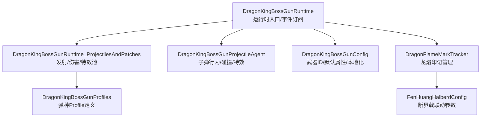
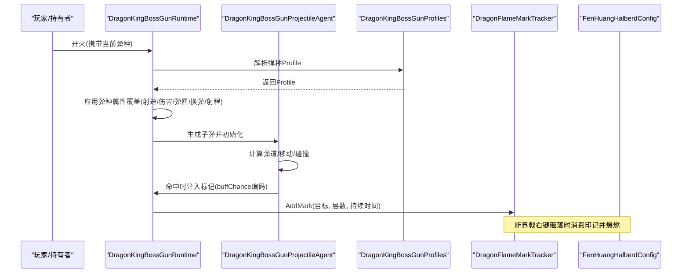
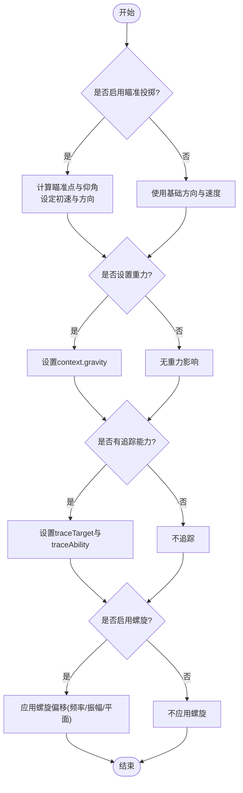
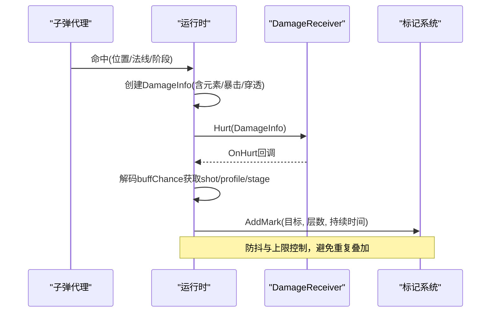
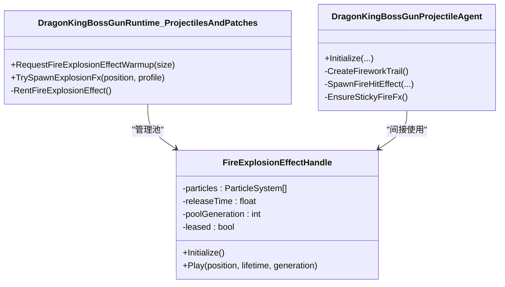
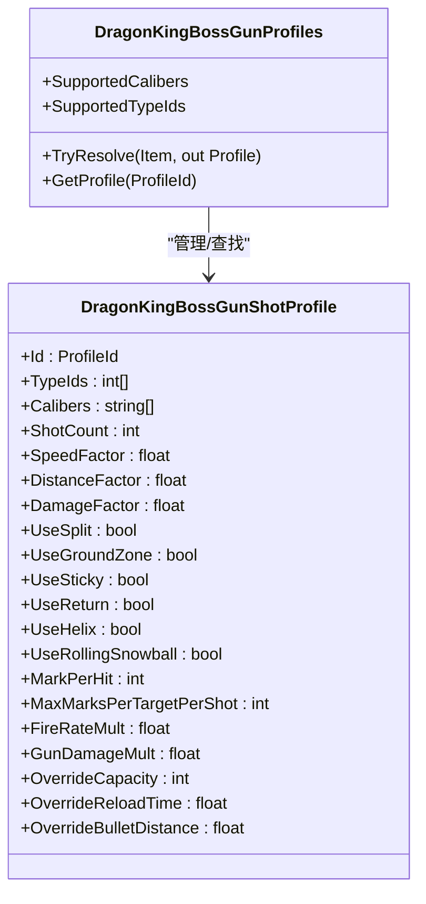
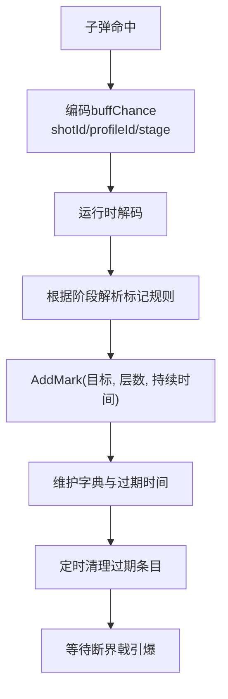
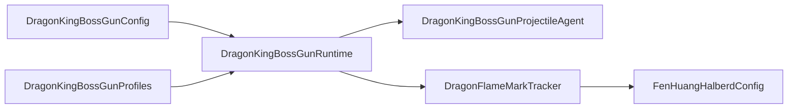

# 龙皇炮系统

<cite>
**本文引用的文件**
- [DragonKingBossGunRuntime.cs](file://Integration/DragonKing/Weapons/DragonKingBossGunRuntime.cs)
- [DragonKingBossGunConfig.cs](file://Integration/DragonKing/Weapons/DragonKingBossGunConfig.cs)
- [DragonKingBossGunProjectileAgent.cs](file://Integration/DragonKing/Weapons/DragonKingBossGunProjectileAgent.cs)
- [DragonKingBossGunProfiles.cs](file://Integration/DragonKing/Weapons/DragonKingBossGunProfiles.cs)
- [DragonKingBossGunRuntime_ProjectilesAndPatches.cs](file://Integration/DragonKing/Weapons/DragonKingBossGunRuntime_ProjectilesAndPatches.cs)
- [DragonFlameMarkTracker.cs](file://Integration/DragonKing/Weapons/DragonFlameMarkTracker.cs)
- [FenHuangHalberdConfig.cs](file://Integration/DragonKing/Weapons/FenHuangHalberdConfig.cs)
</cite>

## 目录
1. [简介](#简介)
2. [项目结构](#项目结构)
3. [核心组件](#核心组件)
4. [架构总览](#架构总览)
5. [详细组件分析](#详细组件分析)
6. [依赖关系分析](#依赖关系分析)
7. [性能考量](#性能考量)
8. [故障排查指南](#故障排查指南)
9. [结论](#结论)
10. [附录：扩展与配置指南](#附录：扩展与配置指南)

## 简介
本技术文档围绕“龙皇炮”（焚天龙铳）系统的实现机制展开，重点覆盖以下方面：
- 弹道计算算法：包括基础弹道、抛物线投掷、追踪能力、螺旋轨迹、滚动雪球等。
- 伤害判定逻辑：命中阶段标记注入、半径伤害、穿透衰减、元素加成、团队与来源过滤。
- 特效管理系统：爆炸池、烟花粒子、冰刃拖尾、火焰贴附等效果复用与生命周期管理。
- 子弹类型系统：15种弹种的属性覆盖机制（射速、伤害、弹匣容量、换弹时间、射程），以及行为差异（分裂、地面区域、粘性、返回等）。
- 标记系统：龙焰印记的添加、追踪、过期清理以及与断界戟联动的引爆流程。
- 弹药配置文件系统：基于 Profile 的弹种定义、属性倍率、特殊效果配置。
- 运行时状态管理与性能优化策略。
- 自定义弹种开发指南与具体代码示例路径。

## 项目结构
龙皇炮相关代码集中在 Integration/DragonKing/Weapons 目录下，按职责划分清晰：
- 运行时与初始化：DragonKingBossGunRuntime.cs、DragonKingBossGunRuntime_ProjectilesAndPatches.cs
- 弹种配置与解析：DragonKingBossGunProfiles.cs
- 子弹代理与行为：DragonKingBossGunProjectileAgent.cs
- 武器配置与本地化：DragonKingBossGunConfig.cs
- 标记系统：DragonFlameMarkTracker.cs
- 联动武器配置：FenHuangHalberdConfig.cs

图表来源
- [DragonKingBossGunRuntime.cs:95-127](file://Integration/DragonKing/Weapons/DragonKingBossGunRuntime.cs#L95-L127)
- [DragonKingBossGunRuntime_ProjectilesAndPatches.cs:103-175](file://Integration/DragonKing/Weapons/DragonKingBossGunRuntime_ProjectilesAndPatches.cs#L103-L175)
- [DragonKingBossGunProjectileAgent.cs:479-574](file://Integration/DragonKing/Weapons/DragonKingBossGunProjectileAgent.cs#L479-L574)
- [DragonKingBossGunProfiles.cs:180-714](file://Integration/DragonKing/Weapons/DragonKingBossGunProfiles.cs#L180-L714)
- [DragonKingBossGunConfig.cs:105-167](file://Integration/DragonKing/Weapons/DragonKingBossGunConfig.cs#L105-L167)
- [DragonFlameMarkTracker.cs:25-148](file://Integration/DragonKing/Weapons/DragonFlameMarkTracker.cs#L25-L148)
- [FenHuangHalberdConfig.cs:117-211](file://Integration/DragonKing/Weapons/FenHuangHalberdConfig.cs#L117-L211)

章节来源
- [DragonKingBossGunRuntime.cs:95-127](file://Integration/DragonKing/Weapons/DragonKingBossGunRuntime.cs#L95-L127)
- [DragonKingBossGunConfig.cs:105-167](file://Integration/DragonKing/Weapons/DragonKingBossGunConfig.cs#L105-L167)

## 核心组件
- 运行时管理器：负责事件订阅、场景缓存清理、预加载、弹种属性覆盖、伤害注入、特效池预热。
- 子弹代理：封装每颗子弹的生命周期、移动、碰撞、分裂、地面区域、粘性、返回、特效播放。
- 弹种配置：集中定义15种弹种的数值与行为，支持 TypeId 或 Caliber 匹配。
- 标记系统：维护目标上的龙焰印记层数与过期时间，提供查询与消费接口。
- 武器配置：设置武器 ID、默认属性、标签、本地化文案，确保运行时正确识别与显示。

章节来源
- [DragonKingBossGunRuntime.cs:95-127](file://Integration/DragonKing/Weapons/DragonKingBossGunRuntime.cs#L95-L127)
- [DragonKingBossGunProjectileAgent.cs:479-574](file://Integration/DragonKing/Weapons/DragonKingBossGunProjectileAgent.cs#L479-L574)
- [DragonKingBossGunProfiles.cs:180-714](file://Integration/DragonKing/Weapons/DragonKingBossGunProfiles.cs#L180-L714)
- [DragonFlameMarkTracker.cs:25-148](file://Integration/DragonKing/Weapons/DragonFlameMarkTracker.cs#L25-L148)
- [DragonKingBossGunConfig.cs:105-167](file://Integration/DragonKing/Weapons/DragonKingBossGunConfig.cs#L105-L167)

## 架构总览
龙皇炮采用“运行时 + 子弹代理 + 弹种配置”的分层架构：
- 运行时负责高层调度：发射主弹幕、处理命中阶段、应用弹种属性覆盖、触发特效。
- 子弹代理负责底层行为：根据 Profile 决定移动模式、碰撞处理、分裂/地面区域/粘性/返回等。
- 弹种配置通过 Profile 声明式地描述每种子弹的行为与数值，便于扩展与调优。
- 标记系统与断界戟联动，形成“枪加印、戟引爆”的协同玩法。

图表来源
- [DragonKingBossGunRuntime.cs:343-404](file://Integration/DragonKing/Weapons/DragonKingBossGunRuntime.cs#L343-L404)
- [DragonKingBossGunRuntime_ProjectilesAndPatches.cs:430-507](file://Integration/DragonKing/Weapons/DragonKingBossGunRuntime_ProjectilesAndPatches.cs#L430-L507)
- [DragonKingBossGunProjectileAgent.cs:479-574](file://Integration/DragonKing/Weapons/DragonKingBossGunProjectileAgent.cs#L479-L574)
- [DragonKingBossGunProfiles.cs:180-714](file://Integration/DragonKing/Weapons/DragonKingBossGunProfiles.cs#L180-L714)
- [DragonFlameMarkTracker.cs:25-148](file://Integration/DragonKing/Weapons/DragonFlameMarkTracker.cs#L25-L148)
- [FenHuangHalberdConfig.cs:117-211](file://Integration/DragonKing/Weapons/FenHuangHalberdConfig.cs#L117-L211)

## 详细组件分析

### 弹道计算算法
- 基础弹道：由子弹速度、距离、重力共同决定；支持固定速度与最大寿命限制。
- 抛物线投掷：当启用 UseAimedArc 且 Gravity > 0 时，根据鼠标瞄准点计算抛射角度与初速。
- 追踪能力：TraceAbility > 0 时，子弹会尝试锁定目标方向；二次分裂子弹可覆盖 TraceAbility。
- 螺旋轨迹：UseHelix 开启后，子弹在水平面或三维空间内产生螺旋偏移，频率与振幅可调。
- 滚动雪球：UseRollingSnowball 使子弹沿地面滚动并随时间增长尺寸，适合范围压制。

图表来源
- [DragonKingBossGunRuntime_ProjectilesAndPatches.cs:509-673](file://Integration/DragonKing/Weapons/DragonKingBossGunRuntime_ProjectilesAndPatches.cs#L509-L673)
- [DragonKingBossGunProjectileAgent.cs:576-604](file://Integration/DragonKing/Weapons/DragonKingBossGunProjectileAgent.cs#L576-L604)

章节来源
- [DragonKingBossGunRuntime_ProjectilesAndPatches.cs:509-673](file://Integration/DragonKing/Weapons/DragonKingBossGunRuntime_ProjectilesAndPatches.cs#L509-L673)
- [DragonKingBossGunProjectileAgent.cs:576-604](file://Integration/DragonKing/Weapons/DragonKingBossGunProjectileAgent.cs#L576-L604)

### 伤害判定逻辑
- 命中阶段：Primary/Secondary/Return/Followup 四种阶段，不同阶段可独立配置标记叠加规则。
- 标记注入：通过 buffChance 编码 shotId、profileId、hitStage，避免重复叠加与跨阶段误判。
- 半径伤害：ApplyRadiusDamage 对范围内所有 DamageReceiver 造成伤害，支持忽略来源、队伍过滤与 Buff 附加。
- 穿透与衰减：Pierce 与 PierceDamageDecay 控制穿透次数与每次穿透后的伤害衰减。
- 元素加成：根据 Profile.Element 为 DamageInfo 添加对应元素因子，影响最终伤害。

图表来源
- [DragonKingBossGunRuntime.cs:343-404](file://Integration/DragonKing/Weapons/DragonKingBossGunRuntime.cs#L343-L404)
- [DragonKingBossGunRuntime_ProjectilesAndPatches.cs:229-277](file://Integration/DragonKing/Weapons/DragonKingBossGunRuntime_ProjectilesAndPatches.cs#L229-L277)
- [DragonKingBossGunRuntime_ProjectilesAndPatches.cs:398-428](file://Integration/DragonKing/Weapons/DragonKingBossGunRuntime_ProjectilesAndPatches.cs#L398-L428)

章节来源
- [DragonKingBossGunRuntime.cs:343-404](file://Integration/DragonKing/Weapons/DragonKingBossGunRuntime.cs#L343-L404)
- [DragonKingBossGunRuntime_ProjectilesAndPatches.cs:229-277](file://Integration/DragonKing/Weapons/DragonKingBossGunRuntime_ProjectilesAndPatches.cs#L229-L277)
- [DragonKingBossGunRuntime_ProjectilesAndPatches.cs:398-428](file://Integration/DragonKing/Weapons/DragonKingBossGunRuntime_ProjectilesAndPatches.cs#L398-L428)

### 特效管理系统
- 爆炸池：FireExplosionEffectHandle 池化管理，按需预热与回收，避免频繁分配。
- 烟花粒子：分火花与绽放两类，颜色调色板与渐变控制，支持二次分裂时的差异化表现。
- 冰刃拖尾：IceBladeTrail 使用 TrailRenderer 与自定义材质，增强视觉辨识度。
- 火焰贴附：粘性子弹附着时动态创建火焰特效，并在引爆时销毁。

图表来源
- [DragonKingBossGunRuntime_ProjectilesAndPatches.cs:24-86](file://Integration/DragonKing/Weapons/DragonKingBossGunRuntime_ProjectilesAndPatches.cs#L24-L86)
- [DragonKingBossGunProjectileAgent.cs:639-700](file://Integration/DragonKing/Weapons/DragonKingBossGunProjectileAgent.cs#L639-L700)
- [DragonKingBossGunProjectileAgent.cs:453-477](file://Integration/DragonKing/Weapons/DragonKingBossGunProjectileAgent.cs#L453-L477)

章节来源
- [DragonKingBossGunRuntime_ProjectilesAndPatches.cs:24-86](file://Integration/DragonKing/Weapons/DragonKingBossGunRuntime_ProjectilesAndPatches.cs#L24-L86)
- [DragonKingBossGunProjectileAgent.cs:639-700](file://Integration/DragonKing/Weapons/DragonKingBossGunProjectileAgent.cs#L639-L700)
- [DragonKingBossGunProjectileAgent.cs:453-477](file://Integration/DragonKing/Weapons/DragonKingBossGunProjectileAgent.cs#L453-L477)

### 子弹类型系统（15种弹种）
- 匹配方式：优先按 TypeId 匹配，其次按 Caliber 常量匹配。
- 属性覆盖：每个 Profile 可覆盖射速、伤害、弹匣容量、换弹时间、射程，运行时仅修改 StatCollection.BaseValue。
- 行为差异：支持分裂、地面区域、粘性、返回、螺旋、滚动雪球、抛物线投掷等。
- 标记规则：各阶段可独立配置每击叠加层数与上限，避免过度堆叠。

图表来源
- [DragonKingBossGunProfiles.cs:44-178](file://Integration/DragonKing/Weapons/DragonKingBossGunProfiles.cs#L44-L178)
- [DragonKingBossGunProfiles.cs:180-714](file://Integration/DragonKing/Weapons/DragonKingBossGunProfiles.cs#L180-L714)

章节来源
- [DragonKingBossGunProfiles.cs:44-178](file://Integration/DragonKing/Weapons/DragonKingBossGunProfiles.cs#L44-L178)
- [DragonKingBossGunProfiles.cs:180-714](file://Integration/DragonKing/Weapons/DragonKingBossGunProfiles.cs#L180-L714)

### 标记系统工作原理
- 添加：子弹命中时通过 buffChance 编码 shotId/profileId/hitStage，运行时解码并调用 AddMark。
- 追踪：按目标实例 ID 维护层数与过期时间，定期清理过期条目。
- 触发：断界戟右键砸落时消费全部印记，按层数计算爆燃伤害与特效。

图表来源
- [DragonKingBossGunRuntime.cs:343-404](file://Integration/DragonKing/Weapons/DragonKingBossGunRuntime.cs#L343-L404)
- [DragonFlameMarkTracker.cs:25-148](file://Integration/DragonKing/Weapons/DragonFlameMarkTracker.cs#L25-L148)
- [FenHuangHalberdConfig.cs:117-211](file://Integration/DragonKing/Weapons/FenHuangHalberdConfig.cs#L117-L211)

章节来源
- [DragonKingBossGunRuntime.cs:343-404](file://Integration/DragonKing/Weapons/DragonKingBossGunRuntime.cs#L343-L404)
- [DragonFlameMarkTracker.cs:25-148](file://Integration/DragonKing/Weapons/DragonFlameMarkTracker.cs#L25-L148)
- [FenHuangHalberdConfig.cs:117-211](file://Integration/DragonKing/Weapons/FenHuangHalberdConfig.cs#L117-L211)

### 弹药配置文件系统
- 弹种定义：在 DragonKingBossGunProfiles 中集中声明，包含 TypeId/Caliber 映射与行为参数。
- 属性倍率：FireRateMult/GunDamageMult 等用于运行时覆盖枪械基础属性。
- 特殊效果：UseSplit/UseGroundZone/UseSticky/UseReturn 等开关控制子弹行为。
- 扩展方式：新增 Profile 并注册到 orderedProfiles，即可被系统识别与应用。

章节来源
- [DragonKingBossGunProfiles.cs:180-714](file://Integration/DragonKing/Weapons/DragonKingBossGunProfiles.cs#L180-L714)

## 依赖关系分析
- 运行时依赖弹种配置以决定行为与数值。
- 子弹代理依赖运行时提供的上下文（ProjectileContext）与工具方法（如 CreateDamageInfo）。
- 标记系统独立维护状态，但受运行时注入与断界戟消费影响。
- 武器配置提供基础属性与本地化，确保 UI 与识别正确。

图表来源
- [DragonKingBossGunConfig.cs:105-167](file://Integration/DragonKing/Weapons/DragonKingBossGunConfig.cs#L105-L167)
- [DragonKingBossGunRuntime.cs:95-127](file://Integration/DragonKing/Weapons/DragonKingBossGunRuntime.cs#L95-L127)
- [DragonKingBossGunProfiles.cs:180-714](file://Integration/DragonKing/Weapons/DragonKingBossGunProfiles.cs#L180-L714)
- [DragonKingBossGunProjectileAgent.cs:479-574](file://Integration/DragonKing/Weapons/DragonKingBossGunProjectileAgent.cs#L479-L574)
- [DragonFlameMarkTracker.cs:25-148](file://Integration/DragonKing/Weapons/DragonFlameMarkTracker.cs#L25-L148)
- [FenHuangHalberdConfig.cs:117-211](file://Integration/DragonKing/Weapons/FenHuangHalberdConfig.cs#L117-L211)

章节来源
- [DragonKingBossGunConfig.cs:105-167](file://Integration/DragonKing/Weapons/DragonKingBossGunConfig.cs#L105-L167)
- [DragonKingBossGunRuntime.cs:95-127](file://Integration/DragonKing/Weapons/DragonKingBossGunRuntime.cs#L95-L127)
- [DragonKingBossGunProfiles.cs:180-714](file://Integration/DragonKing/Weapons/DragonKingBossGunProfiles.cs#L180-L714)
- [DragonKingBossGunProjectileAgent.cs:479-574](file://Integration/DragonKing/Weapons/DragonKingBossGunProjectileAgent.cs#L479-L574)
- [DragonFlameMarkTracker.cs:25-148](file://Integration/DragonKing/Weapons/DragonFlameMarkTracker.cs#L25-L148)
- [FenHuangHalberdConfig.cs:117-211](file://Integration/DragonKing/Weapons/FenHuangHalberdConfig.cs#L117-L211)

## 性能考量
- 对象池：爆炸特效、烟花粒子、冰刃拖尾等均使用池化复用，减少 GC 压力。
- 缓冲数组：射线检测、方向计算等使用静态缓冲，避免每帧分配。
- 预加载：Boss_Red 预设与爆炸特效池在游戏早期预热，降低首帧卡顿。
- 清理策略：标记与命中状态按时间阈值批量清理，避免内存泄漏。
- 属性覆盖：仅修改 StatCollection.BaseValue，不改动 Prefab/SO，保证可逆与稳定。

[本节为通用性能指导，无需特定文件引用]

## 故障排查指南
- 未找到 Boss_Red 预设：检查 CharacterRandomPreset 名称键是否为 Cname_Boss_Red，确认预设已加载。
- 弹种未生效：确认子弹 TypeId 或 Caliber 已在 Profile 中注册，且 TryResolve 成功。
- 标记未叠加：检查 buffChance 编码是否正确，阶段与上限配置是否符合预期。
- 特效缺失：确认特效池已预热，且 Profile 中 ExplosionFxPrefab 指向有效资源。
- 性能下降：监控特效池大小与清理频率，调整 MaxPooled* 与清理间隔。

章节来源
- [DragonKingBossGunRuntime.cs:154-192](file://Integration/DragonKing/Weapons/DragonKingBossGunRuntime.cs#L154-L192)
- [DragonKingBossGunProfiles.cs:757-782](file://Integration/DragonKing/Weapons/DragonKingBossGunProfiles.cs#L757-L782)
- [DragonKingBossGunRuntime_ProjectilesAndPatches.cs:312-386](file://Integration/DragonKing/Weapons/DragonKingBossGunRuntime_ProjectilesAndPatches.cs#L312-L386)

## 结论
龙皇炮系统通过清晰的模块化设计与声明式 Profile 配置，实现了高度可扩展的弹种体系与丰富的战斗表现。其弹道计算、伤害判定、特效管理与标记系统相互协作，既保证了性能又提供了深度的玩法组合。开发者可通过新增 Profile 快速扩展新弹种，或通过调整现有 Profile 微调平衡性与手感。

[本节为总结性内容，无需特定文件引用]

## 附录：扩展与配置指南

### 如何扩展新的弹种类型
- 步骤一：在 DragonKingBossGunProfiles 中添加新的 DragonKingBossGunShotProfile，设置 Id、TypeIds/Calibers、行为开关与数值倍率。
- 步骤二：将新 Profile 加入 orderedProfiles 数组，确保静态构造时建立索引。
- 步骤三：如需自定义特效，设置 TrailFxPrefab/HitFxPrefab/ExplosionFxPrefab 并准备资源。
- 步骤四：测试弹种匹配与属性覆盖，确认运行时日志输出正常。

章节来源
- [DragonKingBossGunProfiles.cs:180-714](file://Integration/DragonKing/Weapons/DragonKingBossGunProfiles.cs#L180-L714)

### 如何修改现有弹种行为
- 调整数值：修改 SpeedFactor/DamageFactor/DistanceFactor 等倍率，观察实战反馈。
- 切换行为：启用/禁用 UseSplit/UseGroundZone/UseSticky/UseReturn 等开关，改变子弹战术定位。
- 标记规则：调整 MarkPerHit/MaxMarksPerTargetPerShot 及各阶段专属值，控制印记叠加强度。
- 属性覆盖：调整 FireRateMult/GunDamageMult/OverrideCapacity/OverrideReloadTime/OverrideBulletDistance，影响枪械运行时属性。

章节来源
- [DragonKingBossGunProfiles.cs:180-714](file://Integration/DragonKing/Weapons/DragonKingBossGunProfiles.cs#L180-L714)
- [DragonKingBossGunRuntime.cs:564-620](file://Integration/DragonKing/Weapons/DragonKingBossGunRuntime.cs#L564-L620)

### 代码示例路径
- 弹种定义与注册：见 [DragonKingBossGunProfiles.cs:180-714](file://Integration/DragonKing/Weapons/DragonKingBossGunProfiles.cs#L180-L714)
- 运行时属性覆盖：见 [DragonKingBossGunRuntime.cs:564-620](file://Integration/DragonKing/Weapons/DragonKingBossGunRuntime.cs#L564-L620)
- 子弹行为初始化：见 [DragonKingBossGunProjectileAgent.cs:479-574](file://Integration/DragonKing/Weapons/DragonKingBossGunProjectileAgent.cs#L479-L574)
- 标记添加与清理：见 [DragonFlameMarkTracker.cs:25-148](file://Integration/DragonKing/Weapons/DragonFlameMarkTracker.cs#L25-L148)
- 断界戟联动参数：见 [FenHuangHalberdConfig.cs:117-211](file://Integration/DragonKing/Weapons/FenHuangHalberdConfig.cs#L117-L211)