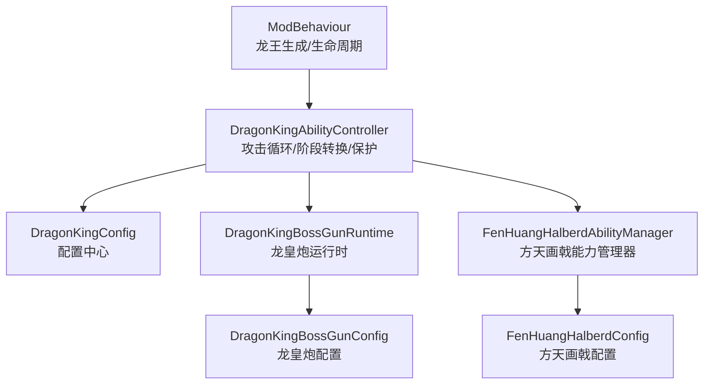
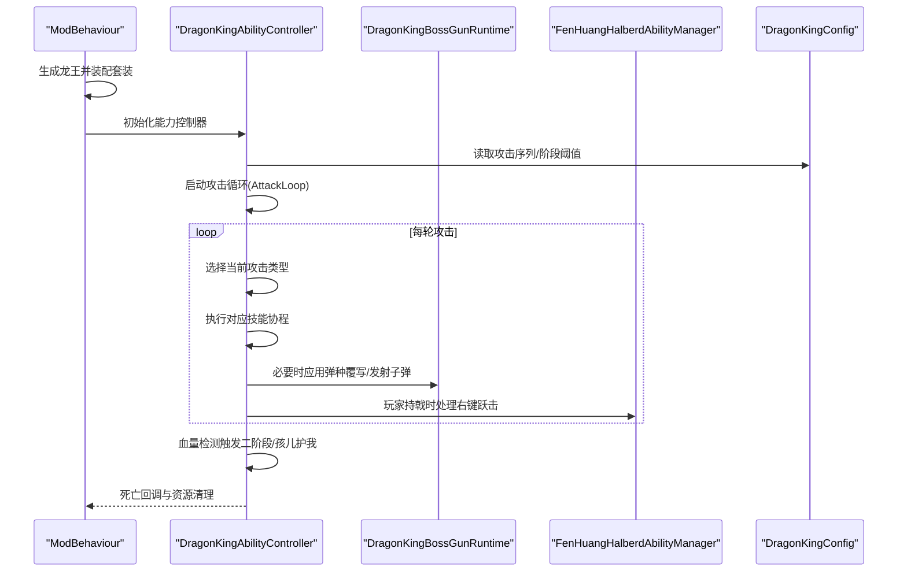
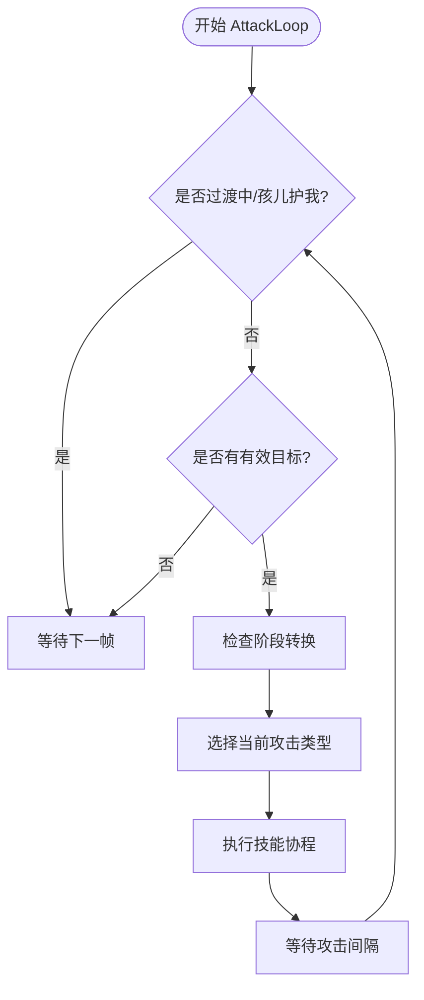
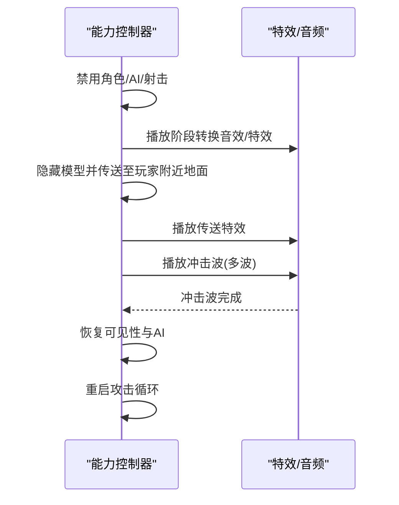
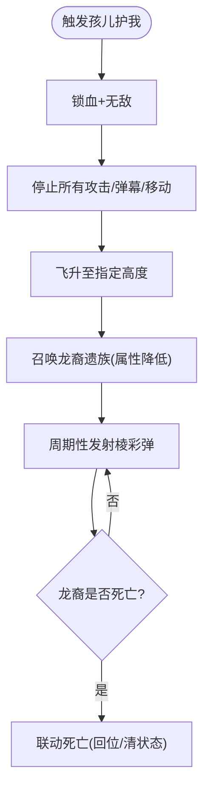
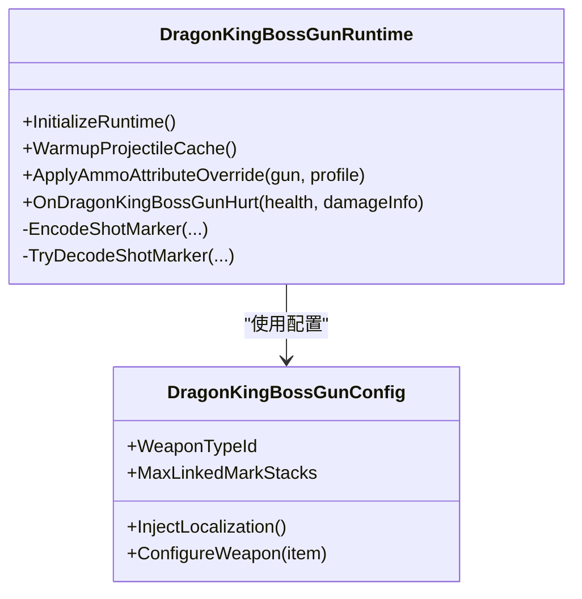
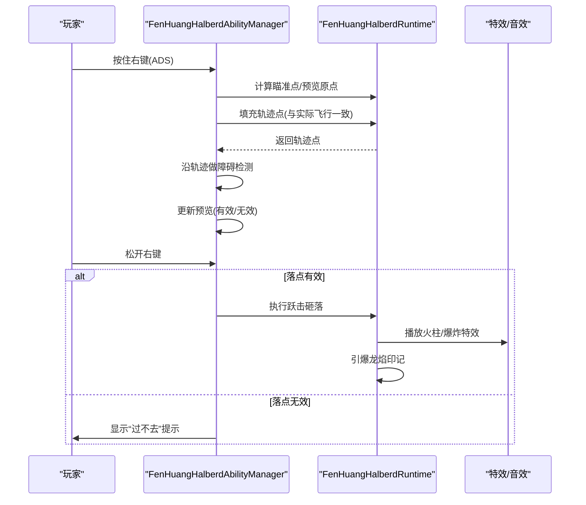
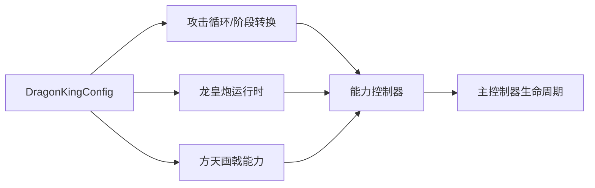

# 焚天龙皇 Boss

<cite>
**本文引用的文件**
- [DragonKingBoss.cs](file://Integration/DragonKing/DragonKingBoss.cs)
- [DragonKingAbilityController_AttackFlow.cs](file://Integration/DragonKing/DragonKingAbilityController_AttackFlow.cs)
- [DragonKingAbilityController_ChildProtection.cs](file://Integration/DragonKing/DragonKingAbilityController_ChildProtection.cs)
- [DragonKingConfig.cs](file://Integration/DragonKing/DragonKingConfig.cs)
- [DragonKingBossGunRuntime.cs](file://Integration/DragonKing/Weapons/DragonKingBossGunRuntime.cs)
- [DragonKingBossGunConfig.cs](file://Integration/DragonKing/Weapons/DragonKingBossGunConfig.cs)
- [FenHuangHalberdAbilityManager.cs](file://Integration/DragonKing/Weapons/FenHuangHalberdAbilityManager.cs)
- [FenHuangHalberdConfig.cs](file://Integration/DragonKing/Weapons/FenHuangHalberdConfig.cs)
</cite>

## 目录
1. [简介](#简介)
2. [项目结构](#项目结构)
3. [核心组件](#核心组件)
4. [架构总览](#架构总览)
5. [详细组件分析](#详细组件分析)
6. [依赖关系分析](#依赖关系分析)
7. [性能与稳定性](#性能与稳定性)
8. [故障排查指南](#故障排查指南)
9. [结论](#结论)
10. [附录：战斗攻略与开发扩展](#附录战斗攻略与开发扩展)

## 简介
本文件为“焚天龙皇”高级 Boss 的完整技术文档。内容覆盖多阶段战斗、特殊攻击模式、武器系统（龙皇炮、方天画戟）、保护机制（孩儿护我）、难度调节、AI 行为树与技能调度、特效管理，并提供实战攻略与开发扩展指南。该 Boss 以模块化能力控制器为核心，通过配置驱动的攻击序列、弹种覆写与联动标记系统，实现高复杂度、高可玩性的 Boss 体验。

## 项目结构
围绕 DragonKing 模块的文件组织采用“职责分离 + 能力拆分”的方式：
- 主控制器与生命周期：负责生成、属性设置、事件订阅、资源清理等。
- 能力控制器：按功能拆分为攻击流程、阶段转换、保护机制等 partial 类。
- 武器系统：龙皇炮（弹种覆写、命中标记）与方天画戟（右键跃击、三段连招）。
- 配置中心：集中定义 Boss 数值、攻击序列、资源路径、音效与掉落概率等。

图表来源
- [DragonKingBoss.cs:205-371](file://Integration/DragonKing/DragonKingBoss.cs#L205-L371)
- [DragonKingAbilityController_AttackFlow.cs:17-132](file://Integration/DragonKing/DragonKingAbilityController_AttackFlow.cs#L17-L132)
- [DragonKingConfig.cs:564-597](file://Integration/DragonKing/DragonKingConfig.cs#L564-L597)
- [DragonKingBossGunRuntime.cs:95-146](file://Integration/DragonKing/Weapons/DragonKingBossGunRuntime.cs#L95-L146)
- [DragonKingBossGunConfig.cs:105-167](file://Integration/DragonKing/Weapons/DragonKingBossGunConfig.cs#L105-L167)
- [FenHuangHalberdAbilityManager.cs:42-114](file://Integration/DragonKing/Weapons/FenHuangHalberdAbilityManager.cs#L42-L114)
- [FenHuangHalberdConfig.cs:17-113](file://Integration/DragonKing/Weapons/FenHuangHalberdConfig.cs#L17-L113)

章节来源
- [DragonKingBoss.cs:205-371](file://Integration/DragonKing/DragonKingBoss.cs#L205-L371)
- [DragonKingConfig.cs:44-92](file://Integration/DragonKing/DragonKingConfig.cs#L44-L92)

## 核心组件
- 龙王主控制器（ModBehaviour 中的龙王分支）：负责生成、装备、属性设置、事件订阅与清理。
- 能力控制器（DragonKingAbilityController）：分片实现攻击循环、阶段转换、保护机制、特效管理等。
- 龙皇炮运行时（DragonKingBossGunRuntime）：弹种覆写、命中标记、弹幕绑定与缓存预热。
- 方天画戟能力管理器（FenHuangHalberdAbilityManager）：右键跃击预览、轨迹校验、执行与 UI 反馈。
- 配置中心（DragonKingConfig / FenHuangHalberdConfig / DragonKingBossGunConfig）：集中参数与行为策略。

章节来源
- [DragonKingBoss.cs:205-371](file://Integration/DragonKing/DragonKingBoss.cs#L205-L371)
- [DragonKingAbilityController_AttackFlow.cs:17-132](file://Integration/DragonKing/DragonKingAbilityController_AttackFlow.cs#L17-L132)
- [DragonKingBossGunRuntime.cs:95-146](file://Integration/DragonKing/Weapons/DragonKingBossGunRuntime.cs#L95-L146)
- [FenHuangHalberdAbilityManager.cs:42-114](file://Integration/DragonKing/Weapons/FenHuangHalberdAbilityManager.cs#L42-L114)
- [DragonKingConfig.cs:44-92](file://Integration/DragonKing/DragonKingConfig.cs#L44-L92)
- [FenHuangHalberdConfig.cs:17-113](file://Integration/DragonKing/Weapons/FenHuangHalberdConfig.cs#L17-L113)
- [DragonKingBossGunConfig.cs:105-167](file://Integration/DragonKing/Weapons/DragonKingBossGunConfig.cs#L105-L167)

## 架构总览
Boss 的运行由“生成 -> 能力控制器启动 -> 攻击循环 -> 阶段转换/保护机制 -> 死亡清理”构成闭环。能力控制器通过配置驱动的攻击序列选择具体技能，并在不同阶段切换行为；武器系统提供远程火力与联动标记；方天画戟提供近战连招与范围爆发。

图表来源
- [DragonKingBoss.cs:205-371](file://Integration/DragonKing/DragonKingBoss.cs#L205-L371)
- [DragonKingAbilityController_AttackFlow.cs:17-132](file://Integration/DragonKing/DragonKingAbilityController_AttackFlow.cs#L17-L132)
- [DragonKingBossGunRuntime.cs:95-146](file://Integration/DragonKing/Weapons/DragonKingBossGunRuntime.cs#L95-L146)
- [FenHuangHalberdAbilityManager.cs:42-114](file://Integration/DragonKing/Weapons/FenHuangHalberdAbilityManager.cs#L42-L114)
- [DragonKingConfig.cs:564-597](file://Integration/DragonKing/DragonKingConfig.cs#L564-L597)

## 详细组件分析

### 攻击循环与技能调度
- 攻击主循环：每帧检查阶段与目标有效性，按配置序列依次执行技能，支持调试模式固定技能重复。
- 阶段转换：当血量低于阈值时进入 Transitioning，禁用角色与 AI，播放传送/阶段特效，释放冲击波后恢复 AI 并重启攻击循环。
- 伤害回调：在受击时进行“孩儿护我”判定与阶段转换检查，确保半血立即转阶段。

图表来源
- [DragonKingAbilityController_AttackFlow.cs:17-132](file://Integration/DragonKing/DragonKingAbilityController_AttackFlow.cs#L17-L132)
- [DragonKingAbilityController_AttackFlow.cs:136-287](file://Integration/DragonKing/DragonKingAbilityController_AttackFlow.cs#L136-L287)
- [DragonKingAbilityController_AttackFlow.cs:419-460](file://Integration/DragonKing/DragonKingAbilityController_AttackFlow.cs#L419-L460)

章节来源
- [DragonKingAbilityController_AttackFlow.cs:17-132](file://Integration/DragonKing/DragonKingAbilityController_AttackFlow.cs#L17-L132)
- [DragonKingAbilityController_AttackFlow.cs:136-287](file://Integration/DragonKing/DragonKingAbilityController_AttackFlow.cs#L136-L287)
- [DragonKingAbilityController_AttackFlow.cs:419-460](file://Integration/DragonKing/DragonKingAbilityController_AttackFlow.cs#L419-L460)

### 二阶段转换与冲击波效果
- 转换流程：禁用角色与 AI、停止弹幕与射击、隐藏模型、播放传送与阶段特效、计算地面位置、重新启用碰撞与可见性、播放冲击波并等待完成、恢复 AI 并重启攻击循环。
- 冲击波：通过共享特效管理器播放，持续约 2-3 秒，期间 Boss 无敌且不可交互。

图表来源
- [DragonKingAbilityController_AttackFlow.cs:156-287](file://Integration/DragonKing/DragonKingAbilityController_AttackFlow.cs#L156-L287)

章节来源
- [DragonKingAbilityController_AttackFlow.cs:156-287](file://Integration/DragonKing/DragonKingAbilityController_AttackFlow.cs#L156-L287)

### 保护机制：孩儿护我阶段
- 触发条件：血量降至阈值（1HP），进入 ChildProtectionSequence。
- 行为：锁血+无敌、禁用角色与所有移动系统、停止攻击与弹幕、显示对话气泡、飞升高度、召唤龙裔遗族、周期性发射棱彩弹、待龙裔死亡后联动死亡。
- 安全落地：联动死亡时将 Boss 传回起飞前位置，确保掉落物正常生成。

图表来源
- [DragonKingAbilityController_ChildProtection.cs:28-134](file://Integration/DragonKing/DragonKingAbilityController_ChildProtection.cs#L28-L134)
- [DragonKingAbilityController_ChildProtection.cs:341-390](file://Integration/DragonKing/DragonKingAbilityController_ChildProtection.cs#L341-L390)
- [DragonKingAbilityController_ChildProtection.cs:609-637](file://Integration/DragonKing/DragonKingAbilityController_ChildProtection.cs#L609-L637)

章节来源
- [DragonKingAbilityController_ChildProtection.cs:28-134](file://Integration/DragonKing/DragonKingAbilityController_ChildProtection.cs#L28-L134)
- [DragonKingAbilityController_ChildProtection.cs:341-390](file://Integration/DragonKing/DragonKingAbilityController_ChildProtection.cs#L341-L390)
- [DragonKingAbilityController_ChildProtection.cs:609-637](file://Integration/DragonKing/DragonKingAbilityController_ChildProtection.cs#L609-L637)

### 龙皇炮武器系统（焚天龙铳）
- 弹种覆写：根据装填弹药类型动态覆写射速、伤害、弹匣、换弹时间、射程与弹道形态，实现“一次换弹即一把新枪”。
- 命中标记：命中叠加“龙焰印记”，上限 10 层，与方天画戟联动引爆。
- 弹幕绑定：预加载 Boss_Red 预设的原始枪械子弹作为基底，运行时替换到龙皇炮。
- 运行时缓存：场景切换时清理临时缓存，保留关键订阅与基准数据。

图表来源
- [DragonKingBossGunRuntime.cs:95-146](file://Integration/DragonKing/Weapons/DragonKingBossGunRuntime.cs#L95-L146)
- [DragonKingBossGunRuntime.cs:343-450](file://Integration/DragonKing/Weapons/DragonKingBossGunRuntime.cs#L343-L450)
- [DragonKingBossGunConfig.cs:105-167](file://Integration/DragonKing/Weapons/DragonKingBossGunConfig.cs#L105-L167)

章节来源
- [DragonKingBossGunRuntime.cs:95-146](file://Integration/DragonKing/Weapons/DragonKingBossGunRuntime.cs#L95-L146)
- [DragonKingBossGunRuntime.cs:343-450](file://Integration/DragonKing/Weapons/DragonKingBossGunRuntime.cs#L343-L450)
- [DragonKingBossGunConfig.cs:105-167](file://Integration/DragonKing/Weapons/DragonKingBossGunConfig.cs#L105-L167)

### 方天画戟能力（焚皇断界戟）
- 右键技能“龙皇裂地”：按住 ADS 键进行跃击预览，轨迹基于实际飞行弧线计算，落点需通过障碍物与墙壁检测；松开后若有效则执行跃击砸落，前方生成火柱区域。
- 三段连招：横扫—挑天—重劈，每段附带火焰附加伤害与灼烧 Buff，第三段拉拽敌人。
- 联动标记：攻击叠加印记（最多 5 层），右键砸落时引爆全部印记造成爆燃伤害。

图表来源
- [FenHuangHalberdAbilityManager.cs:123-272](file://Integration/DragonKing/Weapons/FenHuangHalberdAbilityManager.cs#L123-L272)
- [FenHuangHalberdAbilityManager.cs:399-463](file://Integration/DragonKing/Weapons/FenHuangHalberdAbilityManager.cs#L399-L463)
- [FenHuangHalberdConfig.cs:36-113](file://Integration/DragonKing/Weapons/FenHuangHalberdConfig.cs#L36-L113)

章节来源
- [FenHuangHalberdAbilityManager.cs:123-272](file://Integration/DragonKing/Weapons/FenHuangHalberdAbilityManager.cs#L123-L272)
- [FenHuangHalberdAbilityManager.cs:399-463](file://Integration/DragonKing/Weapons/FenHuangHalberdAbilityManager.cs#L399-L463)
- [FenHuangHalberdConfig.cs:36-113](file://Integration/DragonKing/Weapons/FenHuangHalberdConfig.cs#L36-L113)

### 自定义射击与子弹系统
- 技能期间停止原版射击，改为自定义射击循环：每秒发射若干子弹，一阶段单发、二阶段双发，带随机偏移。
- 子弹从 BulletPool 获取，使用原武器速度，方向朝向玩家，距离与半伤距离由配置控制。
- 在阶段转换或孩儿护我期间暂停射击但不退出循环，保证状态一致性。

章节来源
- [DragonKingAbilityController_AttackFlow.cs:528-741](file://Integration/DragonKing/DragonKingAbilityController_AttackFlow.cs#L528-L741)

### 配置与难度调节
- 基础属性：血量、伤害倍率、名称本地化键。
- 阶段参数：二阶段阈值、攻击间隔、转换持续时间。
- 技能参数：棱彩弹数量/追踪/伤害/寿命、太阳舞光束/旋转/波数、永恒彩虹星/轨迹伤害/半径/旋转、以太长矛数量/预警/速度/伤害、切屏剑阵波数与每波长矛数等。
- 自定义射击：子弹伤害、距离、半伤距离、暴击率/倍率、各阶段子弹数量与偏移范围。
- 掉落与装备：龙王之冕、龙王鳞铠、逆鳞图腾、焚皇断界戟、焚天龙铳等掉落概率。
- 孩儿护我：触发血量、飞升高度/速度、龙裔属性倍率、棱彩弹间隔、对话内容与气泡偏移。
- Mode E 脱战距离：超过此距离时停止攻击玩家。

章节来源
- [DragonKingConfig.cs:44-92](file://Integration/DragonKing/DragonKingConfig.cs#L44-L92)
- [DragonKingConfig.cs:93-399](file://Integration/DragonKing/DragonKingConfig.cs#L93-L399)
- [DragonKingConfig.cs:400-445](file://Integration/DragonKing/DragonKingConfig.cs#L400-L445)
- [DragonKingConfig.cs:599-671](file://Integration/DragonKing/DragonKingConfig.cs#L599-L671)
- [DragonKingConfig.cs:673-733](file://Integration/DragonKing/DragonKingConfig.cs#L673-L733)

## 依赖关系分析
- 能力控制器依赖配置中心决定行为与数值。
- 龙皇炮运行时依赖配置与全局事件 Health.OnHurt 进行命中标记与弹种覆写。
- 方天画戟能力管理器依赖运行时工具进行轨迹计算与输入处理。
- 主控制器负责实例生命周期与资源清理，避免内存泄漏与跨场景问题。

图表来源
- [DragonKingConfig.cs:564-597](file://Integration/DragonKing/DragonKingConfig.cs#L564-L597)
- [DragonKingAbilityController_AttackFlow.cs:17-132](file://Integration/DragonKing/DragonKingAbilityController_AttackFlow.cs#L17-L132)
- [DragonKingBossGunRuntime.cs:95-146](file://Integration/DragonKing/Weapons/DragonKingBossGunRuntime.cs#L95-L146)
- [FenHuangHalberdAbilityManager.cs:42-114](file://Integration/DragonKing/Weapons/FenHuangHalberdAbilityManager.cs#L42-L114)
- [DragonKingBoss.cs:205-371](file://Integration/DragonKing/DragonKingBoss.cs#L205-L371)

章节来源
- [DragonKingConfig.cs:564-597](file://Integration/DragonKing/DragonKingConfig.cs#L564-L597)
- [DragonKingAbilityController_AttackFlow.cs:17-132](file://Integration/DragonKing/DragonKingAbilityController_AttackFlow.cs#L17-L132)
- [DragonKingBossGunRuntime.cs:95-146](file://Integration/DragonKing/Weapons/DragonKingBossGunRuntime.cs#L95-L146)
- [FenHuangHalberdAbilityManager.cs:42-114](file://Integration/DragonKing/Weapons/FenHuangHalberdAbilityManager.cs#L42-L114)
- [DragonKingBoss.cs:205-371](file://Integration/DragonKing/DragonKingBoss.cs#L205-L371)

## 性能与稳定性
- 静态缓存与预热：龙皇炮运行时预加载 Boss_Red 子弹基底，减少首帧卡顿；场景切换时清理临时缓存但保留关键订阅。
- 对象池与复用：子弹从 BulletPool 获取，避免频繁分配；共享缓冲用于物理检测与方向计算。
- 事件订阅管理：Health.OnHurt 订阅在运行时初始化与清理，避免重复注册与内存泄漏。
- 阶段与保护机制：在阶段转换与孩儿护我期间全面停止行为与特效，防止状态不一致导致的异常。

章节来源
- [DragonKingBossGunRuntime.cs:95-146](file://Integration/DragonKing/Weapons/DragonKingBossGunRuntime.cs#L95-L146)
- [DragonKingAbilityController_AttackFlow.cs:156-287](file://Integration/DragonKing/DragonKingAbilityController_AttackFlow.cs#L156-L287)
- [DragonKingAbilityController_ChildProtection.cs:28-134](file://Integration/DragonKing/DragonKingAbilityController_ChildProtection.cs#L28-L134)

## 故障排查指南
- 生成失败：检查基础预设查找与赋值，确认 ModBehaviour 的 NotifyBossSpawnFailed 调用路径。
- 阶段转换异常：确认角色禁用/恢复顺序、AI 停止/恢复、特效播放与冲击波等待逻辑。
- 孩儿护我卡死：检查 MovementEnabled 与 Seeker 的禁用/恢复，确保联动死亡时回位与清理。
- 龙皇炮不生效：验证弹种覆写是否成功、子弹基底是否预加载、命中标记是否正确编码/解码。
- 方天画戟无法执行：确认预览轨迹计算与障碍物检测，检查输入状态与 UI 提示。

章节来源
- [DragonKingBoss.cs:205-371](file://Integration/DragonKing/DragonKingBoss.cs#L205-L371)
- [DragonKingAbilityController_AttackFlow.cs:156-287](file://Integration/DragonKing/DragonKingAbilityController_AttackFlow.cs#L156-L287)
- [DragonKingAbilityController_ChildProtection.cs:28-134](file://Integration/DragonKing/DragonKingAbilityController_ChildProtection.cs#L28-L134)
- [DragonKingBossGunRuntime.cs:95-146](file://Integration/DragonKing/Weapons/DragonKingBossGunRuntime.cs#L95-L146)
- [FenHuangHalberdAbilityManager.cs:123-272](file://Integration/DragonKing/Weapons/FenHuangHalberdAbilityManager.cs#L123-L272)

## 结论
焚天龙皇通过模块化能力控制器与配置驱动的行为体系，实现了复杂的多阶段战斗、丰富的技能组合与强联动的武器系统。其保护机制与阶段转换保证了战斗节奏与难度曲线，而龙皇炮与方天画戟的联动标记系统提供了深度战术空间。整体架构清晰、可扩展性强，适合进一步扩展新技能与新弹种。

## 附录：战斗攻略与开发扩展

### 战斗攻略
- 一阶段：注意棱彩弹追踪与太阳舞光束，保持走位避开扇形区域；利用二阶段前的间隙输出。
- 二阶段：技能频率提升，以太长矛与切屏剑阵需提前预判；冲击波期间不要靠近 Boss。
- 孩儿护我：优先击杀龙裔遗族，否则 Boss 将联动死亡；期间 Boss 无敌且会周期性发射棱彩弹，保持距离。
- 武器联动：使用方天画戟右键跃击引爆龙焰印记，最大化爆发伤害；龙皇炮换弹改变战术，灵活应对不同场景。

### 开发扩展指南
- 新增技能：在 DragonKingConfig 中添加攻击类型与序列，并在能力控制器中实现 ExecuteXxx 协程。
- 新增弹种：在 DragonKingBossGunRuntime 中注册弹种 Profile，覆写射速、伤害、弹道等属性。
- 调整难度：修改阶段阈值、攻击间隔、技能参数与掉落概率，平衡挑战性与奖励。
- 特效与音效：在配置中新增预制体与音效路径，确保资源加载与播放正确。
- 测试与调试：启用 DebugMode 固定技能重复，观察行为是否符合预期；关注日志定位异常。

章节来源
- [DragonKingConfig.cs:13-25](file://Integration/DragonKing/DragonKingConfig.cs#L13-L25)
- [DragonKingConfig.cs:564-597](file://Integration/DragonKing/DragonKingConfig.cs#L564-L597)
- [DragonKingAbilityController_AttackFlow.cs:483-526](file://Integration/DragonKing/DragonKingAbilityController_AttackFlow.cs#L483-L526)
- [DragonKingBossGunRuntime.cs:564-640](file://Integration/DragonKing/Weapons/DragonKingBossGunRuntime.cs#L564-L640)
- [DragonKingConfig.cs:44-92](file://Integration/DragonKing/DragonKingConfig.cs#L44-L92)