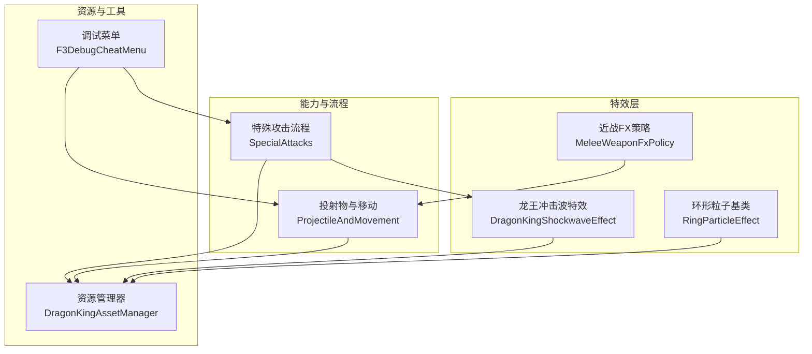
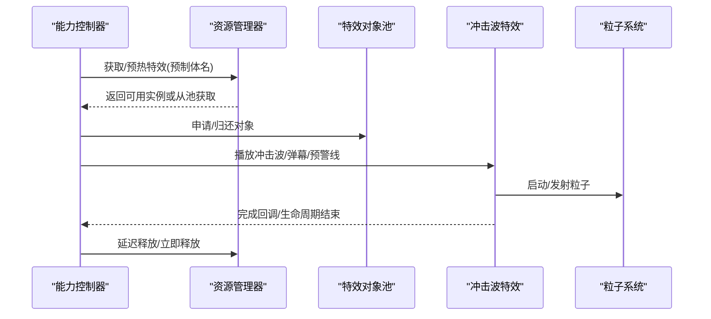
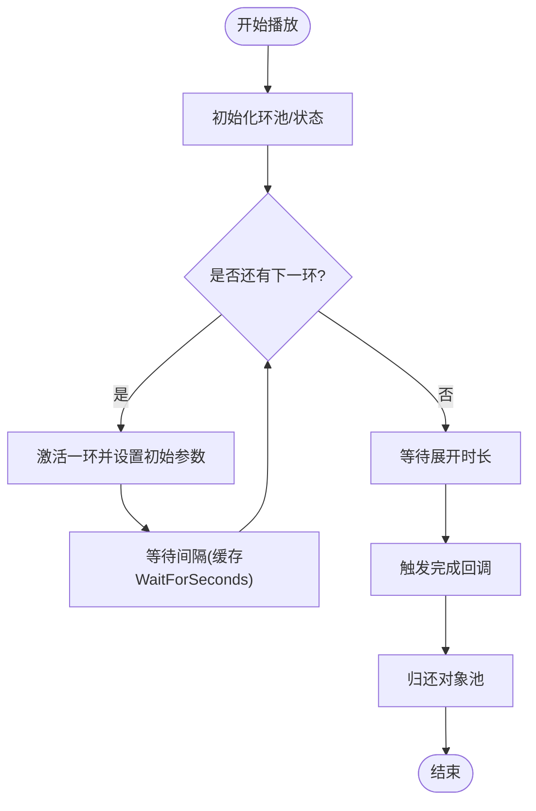
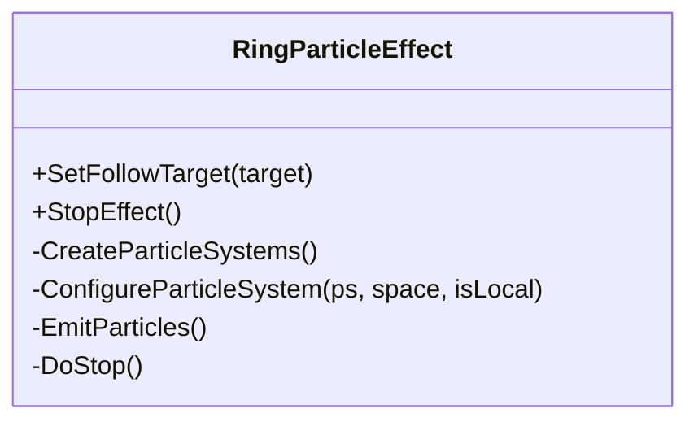
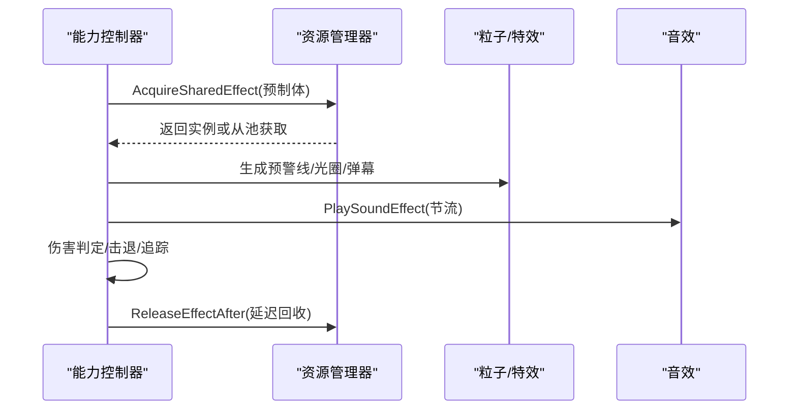
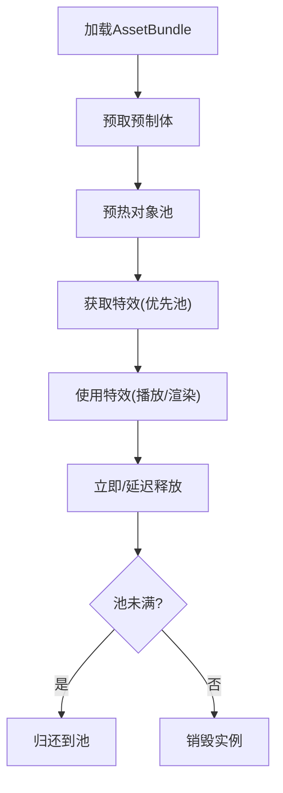
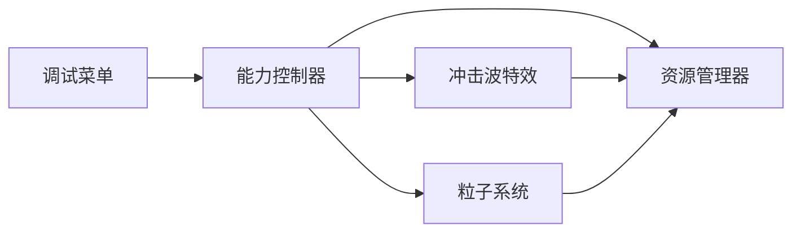

# 特效与视觉效果

<cite>
**本文引用的文件**
- [DragonKingShockwaveEffect.cs](file://Integration/DragonKing/DragonKingShockwaveEffect.cs)
- [RingParticleEffect.cs](file://Common/Effects/RingParticleEffect.cs)
- [MeleeWeaponFxPolicy.cs](file://Common/Effects/MeleeWeaponFxPolicy.cs)
- [DragonKingAbilityController_SpecialAttacks.cs](file://Integration/DragonKing/DragonKingAbilityController_SpecialAttacks.cs)
- [DragonKingAbilityController_ProjectileAndMovement.cs](file://Integration/DragonKing/DragonKingAbilityController_ProjectileAndMovement.cs)
- [DragonKingAssetManager.cs](file://Integration/DragonKing/DragonKingAssetManager.cs)
- [F3DebugCheatMenu.cs](file://DebugAndTools/F3DebugCheatMenu.cs)
</cite>

## 目录
1. [简介](#简介)
2. [项目结构](#项目结构)
3. [核心组件](#核心组件)
4. [架构总览](#架构总览)
5. [详细组件分析](#详细组件分析)
6. [依赖关系分析](#依赖关系分析)
7. [性能考量](#性能考量)
8. [故障排查指南](#故障排查指南)
9. [结论](#结论)
10. [附录](#附录)

## 简介
本文件面向“焚天龙皇”Boss的特效系统，聚焦冲击波效果、粒子系统、动画控制、性能优化，以及视觉辅助工具（调试信息、轨迹显示、碰撞检测可视化）。同时覆盖资源加载、对象池与内存管理，并提供配置参数说明、调优建议与自定义开发指南。

## 项目结构
围绕龙皇特效的关键代码分布在以下模块：
- 冲击波特效：基于环形LineRenderer与对象池实现阶段转换时的音浪扩散与击退。
- 通用环形粒子基类：提供可复用的Local/World双层粒子发射器，支持材质与纹理静态缓存。
- 能力控制器：负责技能流程编排、预警线/光圈、弹幕生成、伤害判定与音效节流。
- 资源管理器：统一加载AssetBundle、预取预制体、特效对象池预热与回收、动态材质清理。
- 近战武器FX策略：为近战武器提供slash/hit FX回退与缩放修正的统一入口。
- 调试菜单：提供运行时调试界面与状态刷新，便于定位问题。

图表来源
- [DragonKingShockwaveEffect.cs:1-561](file://Integration/DragonKing/DragonKingShockwaveEffect.cs#L1-L561)
- [RingParticleEffect.cs:1-501](file://Common/Effects/RingParticleEffect.cs#L1-L501)
- [MeleeWeaponFxPolicy.cs:1-74](file://Common/Effects/MeleeWeaponFxPolicy.cs#L1-L74)
- [DragonKingAbilityController_SpecialAttacks.cs:1-800](file://Integration/DragonKing/DragonKingAbilityController_SpecialAttacks.cs#L1-L800)
- [DragonKingAbilityController_ProjectileAndMovement.cs:1-800](file://Integration/DragonKing/DragonKingAbilityController_ProjectileAndMovement.cs#L1-L800)
- [DragonKingAssetManager.cs:1-800](file://Integration/DragonKing/DragonKingAssetManager.cs#L1-L800)
- [F3DebugCheatMenu.cs:1-317](file://DebugAndTools/F3DebugCheatMenu.cs#L1-L317)

章节来源
- [DragonKingShockwaveEffect.cs:1-561](file://Integration/DragonKing/DragonKingShockwaveEffect.cs#L1-L561)
- [RingParticleEffect.cs:1-501](file://Common/Effects/RingParticleEffect.cs#L1-L501)
- [DragonKingAbilityController_SpecialAttacks.cs:1-800](file://Integration/DragonKing/DragonKingAbilityController_SpecialAttacks.cs#L1-L800)
- [DragonKingAbilityController_ProjectileAndMovement.cs:1-800](file://Integration/DragonKing/DragonKingAbilityController_ProjectileAndMovement.cs#L1-L800)
- [DragonKingAssetManager.cs:1-800](file://Integration/DragonKing/DragonKingAssetManager.cs#L1-L800)
- [F3DebugCheatMenu.cs:1-317](file://DebugAndTools/F3DebugCheatMenu.cs#L1-L317)

## 核心组件
- 龙王冲击波特效：以环形线段绘制扩散波纹，逐环更新半径、透明度与宽度；在波环到达玩家时触发击退并标记已命中；使用协程按间隔释放多环；对象池复用实例，避免频繁创建销毁。
- 通用环形粒子基类：按环形分布创建多个粒子发射器（Local/World），共享材质与纹理，支持跟随目标、淡出停止与帧级发射。
- 近战武器FX策略：集中处理slash/hit FX回退赋值与缩放修正，减少重复模板。
- 能力控制器：组织技能循环（太阳舞弹幕、永恒彩虹、以太长矛、棱彩弹等），生成预警线与光圈，调用资源管理器获取特效，执行伤害与音效节流。
- 资源管理器：加载AssetBundle、预取预制体、特效对象池预热与上限控制、延迟释放、动态材质清理与引用计数管理。
- 调试菜单：运行时UI，暂停时间、显示状态、刷新摘要，辅助定位问题。

章节来源
- [DragonKingShockwaveEffect.cs:1-561](file://Integration/DragonKing/DragonKingShockwaveEffect.cs#L1-L561)
- [RingParticleEffect.cs:1-501](file://Common/Effects/RingParticleEffect.cs#L1-L501)
- [MeleeWeaponFxPolicy.cs:1-74](file://Common/Effects/MeleeWeaponFxPolicy.cs#L1-L74)
- [DragonKingAbilityController_SpecialAttacks.cs:1-800](file://Integration/DragonKing/DragonKingAbilityController_SpecialAttacks.cs#L1-L800)
- [DragonKingAbilityController_ProjectileAndMovement.cs:1-800](file://Integration/DragonKing/DragonKingAbilityController_ProjectileAndMovement.cs#L1-L800)
- [DragonKingAssetManager.cs:1-800](file://Integration/DragonKing/DragonKingAssetManager.cs#L1-L800)
- [F3DebugCheatMenu.cs:1-317](file://DebugAndTools/F3DebugCheatMenu.cs#L1-L317)

## 架构总览
下图展示从能力控制器到特效与资源的调用链，以及对象池与资源管理的协作方式。

图表来源
- [DragonKingAbilityController_SpecialAttacks.cs:1-800](file://Integration/DragonKing/DragonKingAbilityController_SpecialAttacks.cs#L1-L800)
- [DragonKingAbilityController_ProjectileAndMovement.cs:1-800](file://Integration/DragonKing/DragonKingAbilityController_ProjectileAndMovement.cs#L1-L800)
- [DragonKingAssetManager.cs:1-800](file://Integration/DragonKing/DragonKingAssetManager.cs#L1-L800)
- [DragonKingShockwaveEffect.cs:1-561](file://Integration/DragonKing/DragonKingShockwaveEffect.cs#L1-L561)

## 详细组件分析

### 冲击波特效（阶段转换）
- 功能要点
  - 从Boss中心向外扩散圆环，最多N环，每环间隔固定时间释放。
  - 每环由LineRenderer构成，顶点数固定，按单位圆点乘以当前半径计算位置。
  - 随半径增大，透明度先增后减，宽度逐渐缩小至最小值。
  - 当波环半径超过玩家到中心的距离平方时，触发一次击退并标记已命中。
  - 完成后通过回调通知上层，并归还对象池。
- 关键流程
  - 开始：确保环数量、重置状态、查找玩家、启动释放协程。
  - 更新：每帧推进半径、更新顶点、颜色与宽度、检测命中、超出可视范围则停用。
  - 结束：所有环播放完毕，触发回调，回收对象。
- 性能优化
  - WaitForSeconds静态缓存。
  - 单位圆点数组静态缓存。
  - 共享材质与隐藏层级根节点用于对象池。
  - 仅对激活环进行计算与渲染。

图表来源
- [DragonKingShockwaveEffect.cs:145-236](file://Integration/DragonKing/DragonKingShockwaveEffect.cs#L145-L236)
- [DragonKingShockwaveEffect.cs:337-405](file://Integration/DragonKing/DragonKingShockwaveEffect.cs#L337-L405)
- [DragonKingShockwaveEffect.cs:468-504](file://Integration/DragonKing/DragonKingShockwaveEffect.cs#L468-L504)

章节来源
- [DragonKingShockwaveEffect.cs:1-561](file://Integration/DragonKing/DragonKingShockwaveEffect.cs#L1-L561)

### 通用环形粒子基类
- 功能要点
  - 按环形布局创建多个粒子发射器，支持Local与World两种模拟空间。
  - 静态缓存材质与纹理，避免重复创建带来的GC压力。
  - 支持跟随目标、帧级发射、淡出停止与自动销毁。
- 关键流程
  - 创建：根据EmitterCount计算环形位置，分别创建Local/World发射器。
  - 配置：主模块、发射、形状、颜色渐变、尺寸渐变、播放与初始发射。
  - 运行：LateUpdate中向各发射器Emit指定数量粒子。
  - 停止：关闭发射率，等待粒子自然消失后销毁对象。
- 性能优化
  - 材质与纹理全局共享。
  - 梯度与Alpha键复用，减少每帧分配。
  - 隐藏标志防止被意外销毁。

图表来源
- [RingParticleEffect.cs:105-151](file://Common/Effects/RingParticleEffect.cs#L105-L151)
- [RingParticleEffect.cs:197-333](file://Common/Effects/RingParticleEffect.cs#L197-L333)
- [RingParticleEffect.cs:429-487](file://Common/Effects/RingParticleEffect.cs#L429-L487)

章节来源
- [RingParticleEffect.cs:1-501](file://Common/Effects/RingParticleEffect.cs#L1-L501)

### 近战武器FX策略
- 功能要点
  - 为近战武器提供统一的slash/hit FX回退赋值与缩放修正。
  - 允许武器显式声明是否允许回退，避免破坏原有FX状态。
- 关键流程
  - ApplyTo：检查meleeAgent有效性，按需赋值slashFx/hitFx，修正scale。
- 适用场景
  - 需要保留原始slashFx状态的武器，可通过AllowSlashFxFallback=false跳过回退。

章节来源
- [MeleeWeaponFxPolicy.cs:1-74](file://Common/Effects/MeleeWeaponFxPolicy.cs#L1-L74)

### 能力控制器（特殊攻击与投射物）
- 特殊攻击
  - 太阳舞旋转弹幕：多方向同时发射子弹，整体缓慢旋转，使用配置的速度倍率与伤害。
  - 永恒彩虹：生成星环螺旋扩散再收缩，实时跟随Boss位置，造成伤害。
  - 以太长矛：横向贯穿警告线，随后双向射出长矛，带命中检测与伤害。
  - 棱彩弹：环绕Boss生成追踪弹幕，延迟后追踪玩家，命中造成伤害与音效。
- 投射物与移动
  - 冲刺攻击：蓄力阶段聚拢粒子与倒计时光圈，锁定目标位置分段冲刺，残影特效与岩浆伤害区域。
  - 位置验证：使用胶囊重叠检测避免落入空心物体内部。
- 性能优化
  - 列表容量预分配，减少扩容开销。
  - 使用sqrMagnitude避免开方运算。
  - 音效节流与反射方法缓存。
  - 共享渐变与Alpha键复用。

图表来源
- [DragonKingAbilityController_SpecialAttacks.cs:19-142](file://Integration/DragonKing/DragonKingAbilityController_SpecialAttacks.cs#L19-L142)
- [DragonKingAbilityController_SpecialAttacks.cs:268-370](file://Integration/DragonKing/DragonKingAbilityController_SpecialAttacks.cs#L268-L370)
- [DragonKingAbilityController_SpecialAttacks.cs:379-452](file://Integration/DragonKing/DragonKingAbilityController_SpecialAttacks.cs#L379-L452)
- [DragonKingAbilityController_ProjectileAndMovement.cs:21-95](file://Integration/DragonKing/DragonKingAbilityController_ProjectileAndMovement.cs#L21-L95)
- [DragonKingAbilityController_ProjectileAndMovement.cs:234-297](file://Integration/DragonKing/DragonKingAbilityController_ProjectileAndMovement.cs#L234-L297)
- [DragonKingAbilityController_ProjectileAndMovement.cs:306-579](file://Integration/DragonKing/DragonKingAbilityController_ProjectileAndMovement.cs#L306-L579)

章节来源
- [DragonKingAbilityController_SpecialAttacks.cs:1-800](file://Integration/DragonKing/DragonKingAbilityController_SpecialAttacks.cs#L1-L800)
- [DragonKingAbilityController_ProjectileAndMovement.cs:1-800](file://Integration/DragonKing/DragonKingAbilityController_ProjectileAndMovement.cs#L1-L800)

### 资源管理器（加载、对象池、内存）
- 资源加载
  - 同步/异步加载AssetBundle，记录引用计数，预取常用预制体。
  - 失败时输出详细日志，包含组件类型、材质与着色器信息。
- 对象池
  - 按预制体名称维护独立池，支持初始预热与最大池大小限制。
  - 获取/归还接口，支持延迟释放与自动回收。
- 内存管理
  - 动态创建的Material跟踪并在强制清理时销毁。
  - 场景切换或Boss销毁时清理缓存与引用计数。

图表来源
- [DragonKingAssetManager.cs:101-154](file://Integration/DragonKing/DragonKingAssetManager.cs#L101-L154)
- [DragonKingAssetManager.cs:159-188](file://Integration/DragonKing/DragonKingAssetManager.cs#L159-L188)
- [DragonKingAssetManager.cs:198-226](file://Integration/DragonKing/DragonKingAssetManager.cs#L198-L226)
- [DragonKingAssetManager.cs:723-791](file://Integration/DragonKing/DragonKingAssetManager.cs#L723-L791)
- [DragonKingAssetManager.cs:638-718](file://Integration/DragonKing/DragonKingAssetManager.cs#L638-L718)

章节来源
- [DragonKingAssetManager.cs:1-800](file://Integration/DragonKing/DragonKingAssetManager.cs#L1-L800)

### 视觉辅助工具（调试、轨迹、碰撞可视化）
- 调试信息
  - 能力控制器与资源管理器大量DevLog输出，便于定位加载、实例化、命中与音效问题。
  - 预制体详情日志包含子对象、渲染器、网格、光源与组件类型统计。
- 轨迹显示
  - 以太长矛警告线：彩虹渐变LineRenderer，支持初始透明度与淡入动画。
  - 倒计时光圈：在冲刺蓄力阶段显示，提示即将发生的位移。
- 碰撞检测可视化
  - 使用射线检测与包围盒判断长矛/弹幕命中，必要时可叠加可视化辅助（如临时LineRenderer或球体）。
  - 位置验证使用胶囊重叠检测，避免传送落点无效。

章节来源
- [DragonKingAbilityController_SpecialAttacks.cs:457-529](file://Integration/DragonKing/DragonKingAbilityController_SpecialAttacks.cs#L457-L529)
- [DragonKingAbilityController_ProjectileAndMovement.cs:676-723](file://Integration/DragonKing/DragonKingAbilityController_ProjectileAndMovement.cs#L676-L723)
- [DragonKingAssetManager.cs:278-320](file://Integration/DragonKing/DragonKingAssetManager.cs#L278-L320)
- [F3DebugCheatMenu.cs:107-170](file://DebugAndTools/F3DebugCheatMenu.cs#L107-L170)

## 依赖关系分析
- 能力控制器依赖资源管理器获取特效与音效，依赖冲击波特效与粒子系统进行视觉呈现。
- 冲击波特效依赖共享材质与对象池，避免每帧创建销毁。
- 资源管理器依赖AssetBundle与Unity对象系统，维护引用计数与动态材质清理。
- 调试菜单与能力控制器交互，用于运行时状态查看与问题定位。

图表来源
- [DragonKingAbilityController_SpecialAttacks.cs:1-800](file://Integration/DragonKing/DragonKingAbilityController_SpecialAttacks.cs#L1-L800)
- [DragonKingAbilityController_ProjectileAndMovement.cs:1-800](file://Integration/DragonKing/DragonKingAbilityController_ProjectileAndMovement.cs#L1-L800)
- [DragonKingAssetManager.cs:1-800](file://Integration/DragonKing/DragonKingAssetManager.cs#L1-L800)
- [DragonKingShockwaveEffect.cs:1-561](file://Integration/DragonKing/DragonKingShockwaveEffect.cs#L1-L561)
- [F3DebugCheatMenu.cs:1-317](file://DebugAndTools/F3DebugCheatMenu.cs#L1-L317)

章节来源
- [DragonKingAbilityController_SpecialAttacks.cs:1-800](file://Integration/DragonKing/DragonKingAbilityController_SpecialAttacks.cs#L1-L800)
- [DragonKingAbilityController_ProjectileAndMovement.cs:1-800](file://Integration/DragonKing/DragonKingAbilityController_ProjectileAndMovement.cs#L1-L800)
- [DragonKingAssetManager.cs:1-800](file://Integration/DragonKing/DragonKingAssetManager.cs#L1-L800)
- [DragonKingShockwaveEffect.cs:1-561](file://Integration/DragonKing/DragonKingShockwaveEffect.cs#L1-L561)
- [F3DebugCheatMenu.cs:1-317](file://DebugAndTools/F3DebugCheatMenu.cs#L1-L317)

## 性能考量
- 对象池与预热
  - 冲击波特效与各类特效均使用对象池，预热降低首次实例化成本。
  - 池上限控制避免过度占用内存。
- 静态缓存
  - WaitForSeconds、单位圆点、材质与纹理静态缓存，减少GC与查找开销。
- 计算优化
  - 使用sqrMagnitude避免开方，减少每帧数学运算。
  - 列表容量预分配，减少扩容与分配。
- 渲染优化
  - LineRenderer顶点数固定，仅更新激活环。
  - 粒子系统共享材质与纹理，关闭阴影与接收阴影以减少渲染负担。
- 音频优化
  - 音效节流与反射方法缓存，避免高频调用导致的卡顿。
- 内存管理
  - 动态材质跟踪并在强制清理时销毁，防止泄漏。
  - AssetBundle引用计数确保多Boss共存时的正确卸载。

[本节为通用指导，不直接分析具体文件]

## 故障排查指南
- 常见问题
  - 预制体未加载：检查AssetBundle路径与加载结果，查看预制体详情日志。
  - 特效不显示：确认粒子系统已Play、Light已启用，必要时添加后备视觉效果。
  - 冲击波无击退：检查玩家引用与死亡状态，确认波环半径与玩家距离平方比较逻辑。
  - 音效无声：确认节流条件与反射方法缓存是否成功。
- 调试手段
  - 打开F3调试菜单，暂停时间并刷新摘要，观察运行时状态。
  - 查看DevLog输出，定位异常与警告信息。
  - 使用警告线与光圈作为轨迹与预警可视化，辅助判断技能时机。

章节来源
- [DragonKingAssetManager.cs:121-154](file://Integration/DragonKing/DragonKingAssetManager.cs#L121-L154)
- [DragonKingAssetManager.cs:329-366](file://Integration/DragonKing/DragonKingAssetManager.cs#L329-L366)
- [DragonKingShockwaveEffect.cs:205-214](file://Integration/DragonKing/DragonKingShockwaveEffect.cs#L205-L214)
- [DragonKingAbilityController_SpecialAttacks.cs:147-176](file://Integration/DragonKing/DragonKingAbilityController_SpecialAttacks.cs#L147-L176)
- [F3DebugCheatMenu.cs:107-170](file://DebugAndTools/F3DebugCheatMenu.cs#L107-L170)

## 结论
该特效系统以对象池与静态缓存为核心，结合能力控制器的流程编排与资源管理器的统一加载，实现了高性能、可扩展的龙皇特效。冲击波特效通过环形LineRenderer与精确的碰撞检测提供直观的视觉反馈与玩法交互；通用粒子基类为多种特效提供了可复用的基础能力；资源管理器保障了内存与性能的稳定性。配合调试工具与可视化辅助，开发者可快速定位问题并进行调优。

[本节为总结性内容，不直接分析具体文件]

## 附录
- 配置参数建议
  - 冲击波：调整expansionSpeed、maxRadius、waveCount、waveInterval、waveSpacing、waveColor、knockbackForce与knockbackUpwardForce以平衡视觉与玩法。
  - 粒子：调整EmitterCount、EmitterRadius、Local/World参数（MaxParticles、Lifetime、Speed、Size、Alpha、EmissionRate、ShapeRadius、EmitPerFrame）以匹配不同设备性能。
  - 能力：调整弹幕数量、速度倍率、伤害、持续时间与旋转速度，确保节奏与难度合理。
- 自定义开发指南
  - 新增特效：继承RingParticleEffect或使用DragonKingAssetManager获取预制体，遵循对象池与预热规范。
  - 集成能力：在能力控制器中添加新技能流程，复用预警线/光圈与音效节流机制。
  - 性能调优：优先使用对象池、静态缓存与sqrMagnitude；控制粒子数量与发射频率；避免每帧分配。
- 最佳实践
  - 所有特效统一通过资源管理器获取与释放，避免直接Instantiate。
  - 使用DevLog输出关键路径信息，便于问题定位。
  - 在场景切换或Boss销毁时调用资源清理接口，确保内存安全。

[本节为通用指导，不直接分析具体文件]