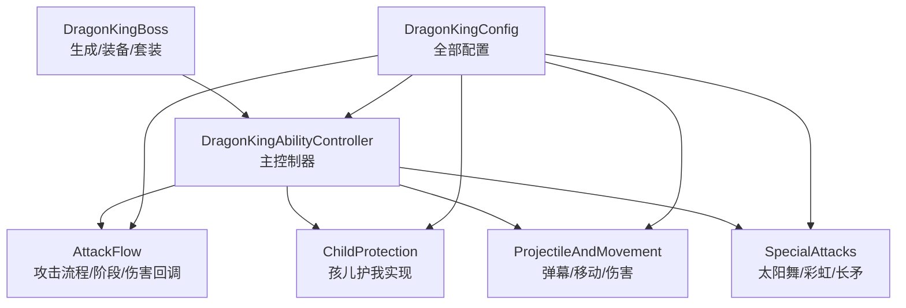
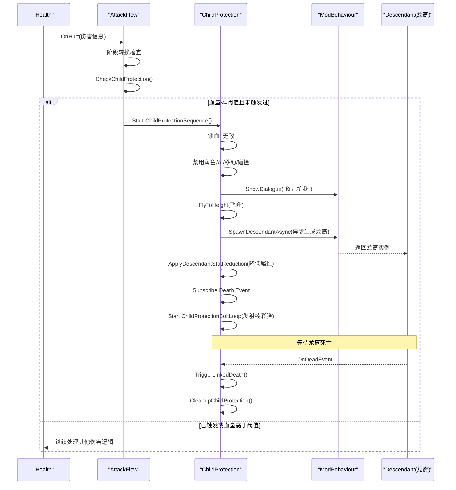
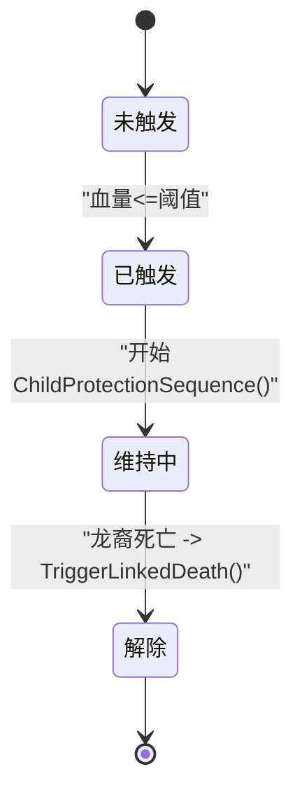
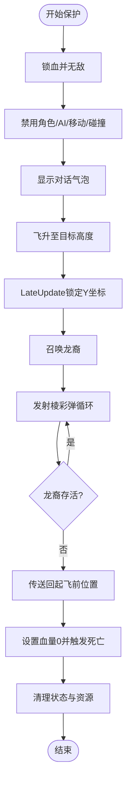
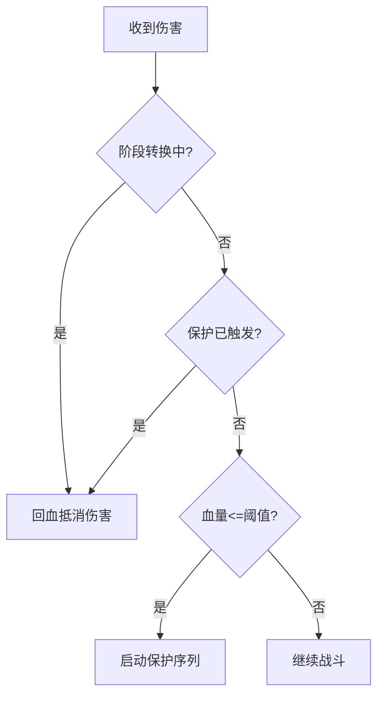
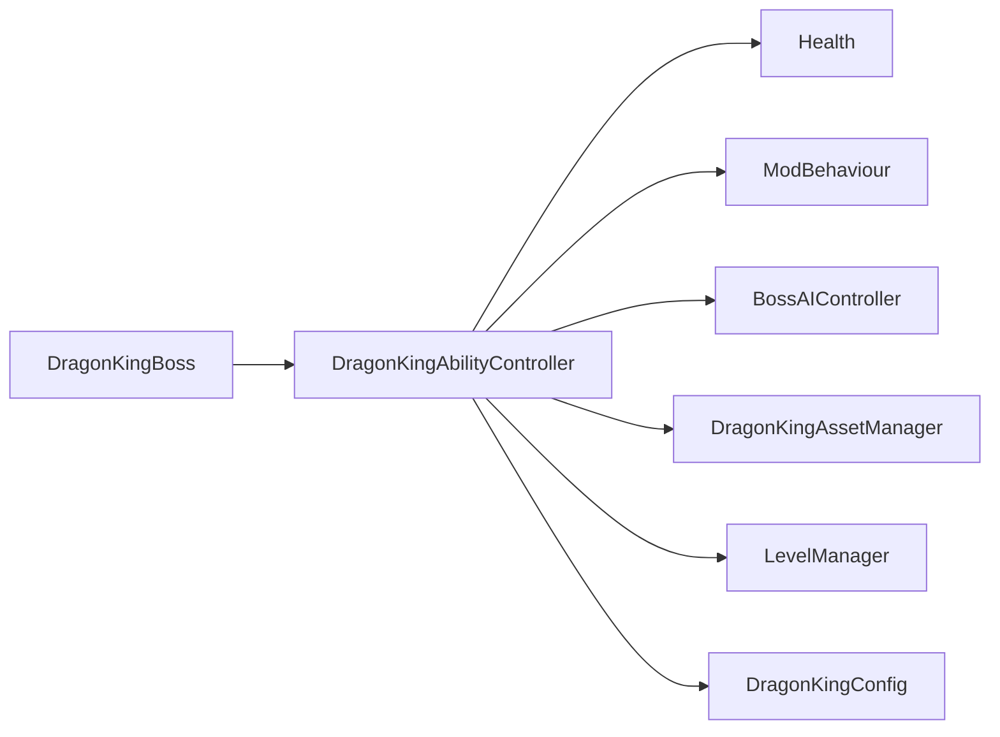

# 孩子保护机制

<cite>
**本文引用的文件**
- [DragonKingAbilityController.cs](file://Integration/DragonKing/DragonKingAbilityController.cs)
- [DragonKingAbilityController_AttackFlow.cs](file://Integration/DragonKing/DragonKingAbilityController_AttackFlow.cs)
- [DragonKingAbilityController_ChildProtection.cs](file://Integration/DragonKing/DragonKingAbilityController_ChildProtection.cs)
- [DragonKingAbilityController_ProjectileAndMovement.cs](file://Integration/DragonKing/DragonKingAbilityController_ProjectileAndMovement.cs)
- [DragonKingAbilityController_SpecialAttacks.cs](file://Integration/DragonKing/DragonKingAbilityController_SpecialAttacks.cs)
- [DragonKingBoss.cs](file://Integration/DragonKing/DragonKingBoss.cs)
- [DragonKingConfig.cs](file://Integration/DragonKing/DragonKingConfig.cs)
</cite>

## 目录
1. [简介](#简介)
2. [项目结构](#项目结构)
3. [核心组件](#核心组件)
4. [架构总览](#架构总览)
5. [详细组件分析](#详细组件分析)
6. [依赖关系分析](#依赖关系分析)
7. [性能考量](#性能考量)
8. [故障排查指南](#故障排查指南)
9. [结论](#结论)
10. [附录：配置与自定义开发指南](#附录：配置与自定义开发指南)

## 简介
本文件围绕“焚天龙皇”的“孩儿护我”（孩子保护）机制进行系统化说明，覆盖以下要点：
- 龙蛋守护逻辑：位置监控、威胁评估、防御响应
- 保护技能：护盾生成（无敌）、敌人击退（通过召唤龙裔遗族承担伤害并反击）、伤害减免（阶段内回血/无敌）
- 触发条件：血量阈值触发；同时结合攻击循环中的状态门控（转换中/保护中暂停攻击）
- 保护状态管理：激活、维持、解除
- 配置项与扩展点：便于调参与二次开发

该机制在龙王进入极低血量时触发，龙王飞升并进入无敌状态，同时召唤龙裔遗族代为承受伤害并进行反击。当龙裔死亡后，龙王联动死亡，完成三阶段收尾。

## 项目结构
与“孩儿护我”相关的代码主要分布在 DragonKing 能力控制器及其子模块中：
- 主控制器：负责初始化、事件订阅、协程生命周期管理
- 攻击流程：负责阶段检查、阶段转换、伤害回调、保护触发判断
- 保护实现：负责飞升、锁定高度、召唤龙裔、发射棱彩弹、联动死亡与清理
- 子弹与移动：提供通用弹幕追踪、碰撞检测、伤害应用等工具方法
- 特殊攻击：太阳舞、永恒彩虹、以太长矛等（与保护机制协同）
- Boss 注册与资源：负责生成、装备、套装效果、多实例管理
- 配置：所有可调参数集中在此

图表来源
- [DragonKingAbilityController.cs:56-755](file://Integration/DragonKing/DragonKingAbilityController.cs#L56-L755)
- [DragonKingAbilityController_AttackFlow.cs:20-120](file://Integration/DragonKing/DragonKingAbilityController_AttackFlow.cs#L20-L120)
- [DragonKingAbilityController_ChildProtection.cs:28-134](file://Integration/DragonKing/DragonKingAbilityController_ChildProtection.cs#L28-L134)
- [DragonKingAbilityController_ProjectileAndMovement.cs:21-95](file://Integration/DragonKing/DragonKingAbilityController_ProjectileAndMovement.cs#L21-L95)
- [DragonKingAbilityController_SpecialAttacks.cs:19-61](file://Integration/DragonKing/DragonKingAbilityController_SpecialAttacks.cs#L19-L61)
- [DragonKingBoss.cs:209-371](file://Integration/DragonKing/DragonKingBoss.cs#L209-L371)
- [DragonKingConfig.cs:673-733](file://Integration/DragonKing/DragonKingConfig.cs#L673-L733)

章节来源
- [DragonKingAbilityController.cs:56-755](file://Integration/DragonKing/DragonKingAbilityController.cs#L56-L755)
- [DragonKingBoss.cs:209-371](file://Integration/DragonKing/DragonKingBoss.cs#L209-L371)
- [DragonKingConfig.cs:673-733](file://Integration/DragonKing/DragonKingConfig.cs#L673-L733)

## 核心组件
- 能力控制器（DragonKingAbilityController）
  - 维护当前阶段、玩家引用、AI控制、协程管理、材质/渐变缓存、对象池预热
  - 初始化时订阅受伤事件、启动攻击循环与自定义射击
- 攻击流程（AttackFlow）
  - 攻击主循环、阶段转换、伤害回调、保护触发判断
- 保护实现（ChildProtection）
  - 飞升、锁定高度、显示对话、召唤龙裔、发射棱彩弹、联动死亡、清理
- 子弹与移动（ProjectileAndMovement）
  - 棱彩弹/螺旋弹幕、冲刺、碰撞检测、伤害应用
- 特殊攻击（SpecialAttacks）
  - 太阳舞弹幕、永恒彩虹、以太长矛（含切屏剑阵）
- Boss（DragonKingBoss）
  - 生成、属性设置、装备、套装效果、多实例清理
- 配置（DragonKingConfig）
  - 基础属性、阶段参数、技能参数、保护机制参数、音效与资源路径

章节来源
- [DragonKingAbilityController.cs:56-755](file://Integration/DragonKing/DragonKingAbilityController.cs#L56-L755)
- [DragonKingAbilityController_AttackFlow.cs:20-120](file://Integration/DragonKing/DragonKingAbilityController_AttackFlow.cs#L20-L120)
- [DragonKingAbilityController_ChildProtection.cs:28-134](file://Integration/DragonKing/DragonKingAbilityController_ChildProtection.cs#L28-L134)
- [DragonKingAbilityController_ProjectileAndMovement.cs:21-95](file://Integration/DragonKing/DragonKingAbilityController_ProjectileAndMovement.cs#L21-L95)
- [DragonKingAbilityController_SpecialAttacks.cs:19-61](file://Integration/DragonKing/DragonKingAbilityController_SpecialAttacks.cs#L19-L61)
- [DragonKingBoss.cs:209-371](file://Integration/DragonKing/DragonKingBoss.cs#L209-L371)
- [DragonKingConfig.cs:673-733](file://Integration/DragonKing/DragonKingConfig.cs#L673-L733)

## 架构总览
“孩儿护我”是独立于常规攻击序列的紧急保护分支，由伤害回调触发，并在整个保护期间屏蔽常规攻击。其关键交互如下：

图表来源
- [DragonKingAbilityController_AttackFlow.cs:419-460](file://Integration/DragonKing/DragonKingAbilityController_AttackFlow.cs#L419-L460)
- [DragonKingAbilityController_ChildProtection.cs:28-134](file://Integration/DragonKing/DragonKingAbilityController_ChildProtection.cs#L28-L134)
- [DragonKingAbilityController_ChildProtection.cs:341-390](file://Integration/DragonKing/DragonKingAbilityController_ChildProtection.cs#L341-L390)
- [DragonKingAbilityController_ChildProtection.cs:600-637](file://Integration/DragonKing/DragonKingAbilityController_ChildProtection.cs#L600-L637)

## 详细组件分析

### 触发条件与状态机
- 触发条件
  - 血量阈值：当龙王血量降至配置阈值时触发保护（默认极低值，确保仅在濒死时触发）
  - 幂等性：仅首次触发有效，避免重复进入保护
  - 阶段门控：阶段转换中或保护中，攻击循环暂停执行
- 状态变量
  - childProtectionTriggered：是否已触发过
  - isInChildProtection：是否处于保护阶段
  - spawnedDescendant：当前守护龙裔引用
  - lockedMinY：飞升后锁定最低高度
  - preFlyPosition：起飞前位置（用于联动死亡时回传地面）
  - ModeGPreserveLinkedKillAttribution：Mode G 联动死亡击杀归因开关，为 true 时联动死亡的 DamageInfo.fromCharacter 归因给玩家；Legacy 路径默认 false 保持来源为 null

图表来源
- [DragonKingAbilityController_AttackFlow.cs:448-460](file://Integration/DragonKing/DragonKingAbilityController_AttackFlow.cs#L448-L460)
- [DragonKingAbilityController_ChildProtection.cs:28-134](file://Integration/DragonKing/DragonKingAbilityController_ChildProtection.cs#L28-L134)
- [DragonKingAbilityController_ChildProtection.cs:600-637](file://Integration/DragonKing/DragonKingAbilityController_ChildProtection.cs#L600-L637)

章节来源
- [DragonKingAbilityController_AttackFlow.cs:419-460](file://Integration/DragonKing/DragonKingAbilityController_AttackFlow.cs#L419-L460)
- [DragonKingAbilityController_ChildProtection.cs:28-134](file://Integration/DragonKing/DragonKingAbilityController_ChildProtection.cs#L28-L134)

### 位置监控与飞行锁定
- 飞升过程
  - 创建飞行平台（无物理碰撞，避免抬升其他Boss）
  - 创建云雾特效
  - 使用加速度上升，记录起始高度与目标高度
- 高度锁定
  - LateUpdate中持续锁定Y坐标，防止下落
  - 禁用Movement组件与Seeker寻路，从根源阻断移动
- 安全回传
  - 联动死亡时将龙王传送回起飞前位置，保证掉落物在地面生成

图表来源
- [DragonKingAbilityController_ChildProtection.cs:28-134](file://Integration/DragonKing/DragonKingAbilityController_ChildProtection.cs#L28-L134)
- [DragonKingAbilityController_ChildProtection.cs:173-236](file://Integration/DragonKing/DragonKingAbilityController_ChildProtection.cs#L173-L236)
- [DragonKingAbilityController_ChildProtection.cs:287-301](file://Integration/DragonKing/DragonKingAbilityController_ChildProtection.cs#L287-L301)
- [DragonKingAbilityController_ChildProtection.cs:608-637](file://Integration/DragonKing/DragonKingAbilityController_ChildProtection.cs#L608-L637)

章节来源
- [DragonKingAbilityController_ChildProtection.cs:173-236](file://Integration/DragonKing/DragonKingAbilityController_ChildProtection.cs#L173-L236)
- [DragonKingAbilityController_ChildProtection.cs:287-301](file://Integration/DragonKing/DragonKingAbilityController_ChildProtection.cs#L287-L301)

### 威胁评估与防御响应
- 威胁评估
  - 伤害回调中检查阶段转换与保护触发
  - 保护期间对龙王伤害进行“回血”抵消，等效无敌
- 防御响应
  - 立即停止所有攻击与射击
  - 禁用碰撞检测器与移动输入
  - 召唤龙裔遗族作为“替身”，降低其属性以平衡难度
  - 周期性发射棱彩弹对玩家造成压力（非致命），增加对抗策略

图表来源
- [DragonKingAbilityController_AttackFlow.cs:419-460](file://Integration/DragonKing/DragonKingAbilityController_AttackFlow.cs#L419-L460)

章节来源
- [DragonKingAbilityController_AttackFlow.cs:419-460](file://Integration/DragonKing/DragonKingAbilityController_AttackFlow.cs#L419-L460)

### 保护技能详解
- 护盾生成（无敌）
  - 将龙王血量设置为阈值并开启无敌，确保保护期间不受伤害
  - 伤害回调中对伤害进行回血抵消，双重保障
- 敌人击退（替代方案）
  - 通过召唤龙裔遗族承担伤害，并对玩家发射棱彩弹形成压制
  - 棱彩弹为追踪弹幕，具备一定威胁但可控
- 伤害减免
  - 保护期间无敌+回血抵消，等效完全免伤
  - 联动死亡时恢复移动系统并清理资源

章节来源
- [DragonKingAbilityController_ChildProtection.cs:28-134](file://Integration/DragonKing/DragonKingAbilityController_ChildProtection.cs#L28-L134)
- [DragonKingAbilityController_AttackFlow.cs:419-460](file://Integration/DragonKing/DragonKingAbilityController_AttackFlow.cs#L419-L460)

### 触发条件细化
- 血量阈值：由配置项决定（极低值，确保濒死触发）
- 阶段门控：阶段转换中或保护中，攻击循环跳过执行
- 玩家接近：保护期间不主动追击，但会周期性发射棱彩弹指向玩家方向
- 其他：保护仅触发一次，避免重复进入

章节来源
- [DragonKingAbilityController_AttackFlow.cs:419-460](file://Integration/DragonKing/DragonKingAbilityController_AttackFlow.cs#L419-L460)
- [DragonKingConfig.cs:673-733](file://Integration/DragonKing/DragonKingConfig.cs#L673-L733)

### 保护状态管理
- 激活
  - 设置childProtectionTriggered与isInChildProtection
  - 锁血、无敌、禁用AI/移动/碰撞
  - 显示对话、飞升、锁定高度
- 维持
  - 召唤龙裔并订阅死亡事件
  - 启动棱彩弹发射循环
  - LateUpdate持续锁定高度
- 解除
  - 龙裔死亡触发联动死亡
  - 传送回起飞前位置，设置血量0并触发死亡
  - Mode G 下联动死亡的伤害来源归因给玩家（ModeGPreserveLinkedKillAttribution=true 时 DamageInfo.fromCharacter=playerCharacter），Legacy 路径来源为 null
  - 清理协程、特效、移动系统、状态标志

章节来源
- [DragonKingAbilityController_ChildProtection.cs:28-134](file://Integration/DragonKing/DragonKingAbilityController_ChildProtection.cs#L28-L134)
- [DragonKingAbilityController_ChildProtection.cs:600-693](file://Integration/DragonKing/DragonKingAbilityController_ChildProtection.cs#L600-L693)

## 依赖关系分析
- 能力控制器依赖：
  - Health事件（OnHurt）
  - ModBehaviour（日志、音效、生成龙裔）
  - BossAIController（暂停/恢复AI）
  - DragonKingAssetManager（特效与资源）
  - LevelManager（子弹池）
- 配置依赖：
  - 所有可调参数集中在DragonKingConfig，包括保护阈值、飞行高度/速度、棱彩弹间隔、对话内容等
- 多实例支持：
  - DragonKingBoss维护实例字典与事件委托映射，确保多Boss场景下的正确清理

图表来源
- [DragonKingAbilityController.cs:700-755](file://Integration/DragonKing/DragonKingAbilityController.cs#L700-L755)
- [DragonKingBoss.cs:209-371](file://Integration/DragonKing/DragonKingBoss.cs#L209-L371)
- [DragonKingConfig.cs:673-733](file://Integration/DragonKing/DragonKingConfig.cs#L673-L733)

章节来源
- [DragonKingAbilityController.cs:700-755](file://Integration/DragonKing/DragonKingAbilityController.cs#L700-L755)
- [DragonKingBoss.cs:209-371](file://Integration/DragonKing/DragonKingBoss.cs#L209-L371)
- [DragonKingConfig.cs:673-733](file://Integration/DragonKing/DragonKingConfig.cs#L673-L733)

## 性能考量
- 对象池与缓存
  - 材质、渐变、WaitForSeconds、警告线/圆圈、蓄力粒子等大量复用
  - 弹幕追踪与长矛移动采用批处理结构，减少每帧分配
- 热路径优化
  - 使用sqrMagnitude避免开方运算
  - 反射结果缓存（AudioManager.Post、hitLayers字段）
  - 共享音效节流表，避免同帧堆叠播放
- 场景切换清理
  - 静态缓存与对象池在场景切换时统一清理，防止内存泄漏

章节来源
- [DragonKingAbilityController.cs:419-590](file://Integration/DragonKing/DragonKingAbilityController.cs#L419-L590)
- [DragonKingAbilityController_SpecialAttacks.cs:147-215](file://Integration/DragonKing/DragonKingAbilityController_SpecialAttacks.cs#L147-L215)
- [DragonKingAbilityController_ProjectileAndMovement.cs:98-129](file://Integration/DragonKing/DragonKingAbilityController_ProjectileAndMovement.cs#L98-L129)

## 故障排查指南
- 保护未触发
  - 检查血量阈值配置是否正确
  - 确认伤害回调已订阅且未被异常中断
  - 查看日志中“孩儿护我机制”相关输出
- 飞升失败或高度未锁定
  - 检查flightPlatform与flightCloudEffect创建是否成功
  - 确认LateUpdate中lockedMinY更新正常
  - 验证MovementEnabled与Seeker状态
- 龙裔未生成或无法死亡
  - 检查SpawnDescendantAsync是否返回有效实例
  - 确认死亡事件订阅与移除逻辑
  - 查看日志中“龙裔遗族生成失败”提示
- 联动死亡异常
  - 确认preFlyPosition记录与回传逻辑
  - 检查bossHealth.SetHealth(0)与Hurt调用顺序
  - 查看清理函数是否完整执行

章节来源
- [DragonKingAbilityController_ChildProtection.cs:28-134](file://Integration/DragonKing/DragonKingAbilityController_ChildProtection.cs#L28-L134)
- [DragonKingAbilityController_ChildProtection.cs:341-390](file://Integration/DragonKing/DragonKingAbilityController_ChildProtection.cs#L341-L390)
- [DragonKingAbilityController_ChildProtection.cs:600-693](file://Integration/DragonKing/DragonKingAbilityController_ChildProtection.cs#L600-L693)

## 结论
“孩儿护我”机制通过严格的血量阈值触发、完整的状态管理与资源清理、以及合理的威胁转移（龙裔替身）与反击（棱彩弹），实现了高可信度的濒死保护体验。其设计兼顾了可配置性与可扩展性，便于后续调参与二次开发。

## 附录：配置与自定义开发指南
- 关键配置项（位于DragonKingConfig）
  - 保护阈值：ChildProtectionHealthThreshold
  - 飞行高度/速度：ChildProtectionFlyHeight / ChildProtectionFlySpeed
  - 龙裔属性倍率：ChildProtectionDescendantStatMultiplier
  - 棱彩弹间隔：ChildProtectionBoltInterval
  - 对话内容与时长：ChildProtectionDialogueCN/EN / DescendantDialogueCN/EN / DialogueDuration
- 自定义守护行为建议
  - 修改ChildProtectionSequence以调整飞升动画、高度锁定策略
  - 扩展ApplyDescendantStatReduction以支持更多属性调整（如移速、护甲）
  - 在ChildProtectionBoltLoop中增加新弹幕类型或改变追踪逻辑
  - 通过DragonKingConfig新增技能参数，保持配置驱动
- 集成点
  - 伤害回调：OnBossHurt中插入额外逻辑（如护盾叠加、减伤层）
  - 阶段转换：TriggerPhase2Transition中可加入保护前置条件
  - 多实例：确保每个实例的事件订阅与清理独立

章节来源
- [DragonKingConfig.cs:673-733](file://Integration/DragonKing/DragonKingConfig.cs#L673-L733)
- [DragonKingAbilityController_AttackFlow.cs:419-460](file://Integration/DragonKing/DragonKingAbilityController_AttackFlow.cs#L419-L460)
- [DragonKingAbilityController_ChildProtection.cs:28-134](file://Integration/DragonKing/DragonKingAbilityController_ChildProtection.cs#L28-L134)