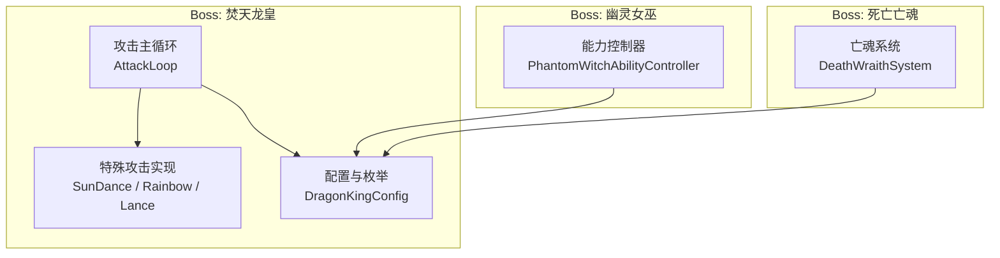
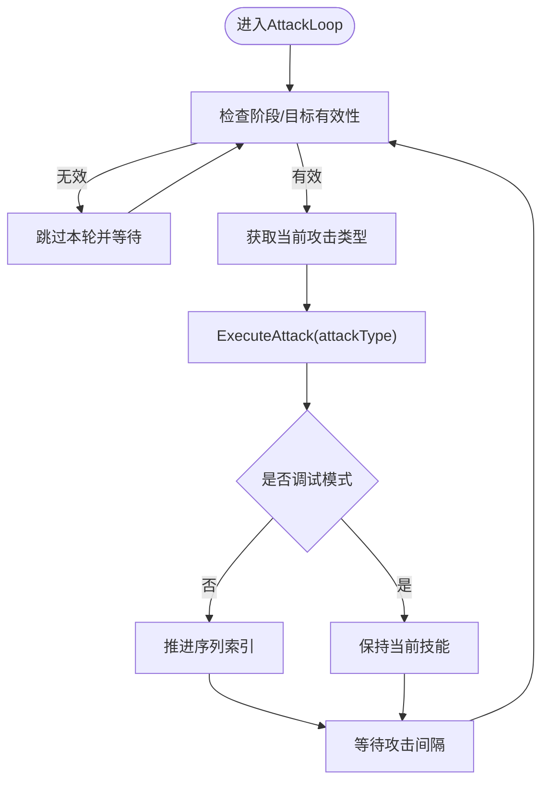
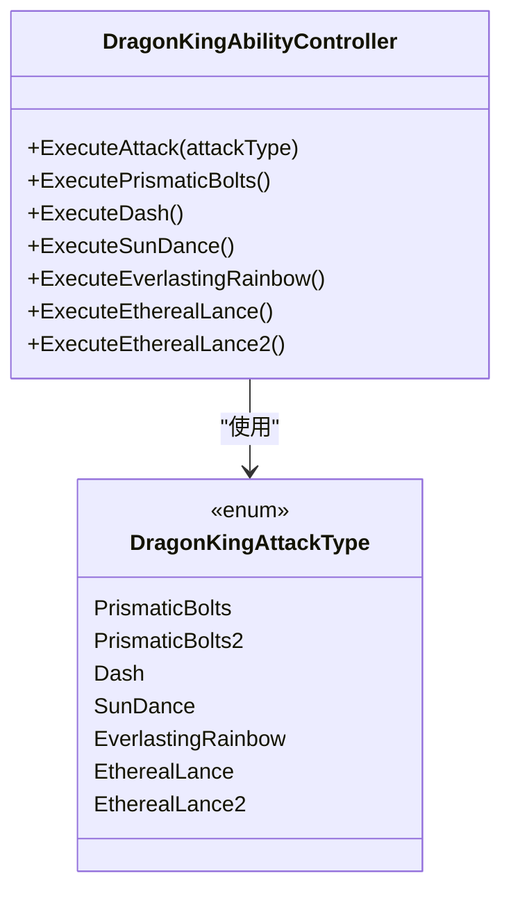
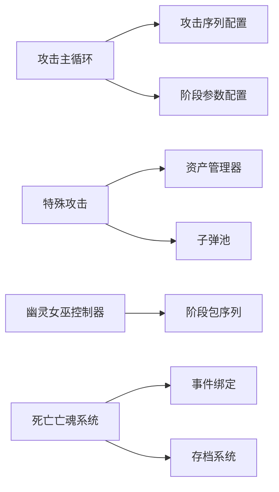

# 攻击流程控制

<cite>
**本文引用的文件**
- [DragonKingAbilityController_AttackFlow.cs](file://Integration/DragonKing/DragonKingAbilityController_AttackFlow.cs)
- [DragonKingAbilityController_SpecialAttacks.cs](file://Integration/DragonKing/DragonKingAbilityController_SpecialAttacks.cs)
- [DragonKingConfig.cs](file://Integration/DragonKing/DragonKingConfig.cs)
- [PhantomWitchAbilityController.cs](file://Integration/PhantomWitch/PhantomWitchAbilityController.cs)
- [DeathWraithSystem.cs](file://Integration/DeathWraith/DeathWraithSystem.cs)
</cite>

## 目录
1. [简介](#简介)
2. [项目结构](#项目结构)
3. [核心组件](#核心组件)
4. [架构总览](#架构总览)
5. [详细组件分析](#详细组件分析)
6. [依赖关系分析](#依赖关系分析)
7. [性能考量](#性能考量)
8. [故障排查指南](#故障排查指南)
9. [结论](#结论)
10. [附录：扩展与自定义开发指南](#附录扩展与自定义开发指南)

## 简介
本文件面向“焚天龙皇”Boss的攻击流程控制系统，系统性说明其AI行为树、状态机管理、决策算法与攻击类型分类；并给出攻击时机判断（距离检测、冷却管理、资源消耗）、优先级系统、难度自适应机制与性能优化策略。同时提供攻击模式扩展接口与自定义攻击逻辑的开发指南，帮助开发者在现有框架上快速扩展新技能或调整行为。

## 项目结构
围绕Boss攻击的核心代码主要分布在以下模块：
- DragonKing（焚天龙皇）：攻击主循环、阶段转换、特殊攻击实现、配置与枚举
- PhantomWitch（幽灵女巫）：能力控制器与包调度器（用于对比不同Boss的AI编排方式）
- DeathWraith（死亡亡魂）：作为对照展示另一种Boss级敌怪的生命周期与数据持久化



图表来源
- [DragonKingAbilityController_AttackFlow.cs:15-120](file://Integration/DragonKing/DragonKingAbilityController_AttackFlow.cs#L15-L120)
- [DragonKingAbilityController_SpecialAttacks.cs:15-142](file://Integration/DragonKing/DragonKingAbilityController_SpecialAttacks.cs#L15-L142)
- [DragonKingConfig.cs:13-25](file://Integration/DragonKing/DragonKingConfig.cs#L13-L25)
- [PhantomWitchAbilityController.cs:24-46](file://Integration/PhantomWitch/PhantomWitchAbilityController.cs#L24-L46)
- [DeathWraithSystem.cs:112-120](file://Integration/DeathWraith/DeathWraithSystem.cs#L112-L120)

章节来源
- [DragonKingAbilityController_AttackFlow.cs:15-120](file://Integration/DragonKing/DragonKingAbilityController_AttackFlow.cs#L15-L120)
- [DragonKingConfig.cs:13-25](file://Integration/DragonKing/DragonKingConfig.cs#L13-L25)

## 核心组件
- 攻击主循环（AttackLoop）：负责按序列执行攻击、阶段检查、玩家目标有效性校验、攻击间隔控制。
- 阶段转换（Phase Transition）：血量阈值触发二阶段，包含禁用/恢复AI、特效播放、传送定位、冲击波与重启攻击循环。
- 特殊攻击实现：太阳舞弹幕、永恒彩虹星环、以太长矛（横穿/切屏）、棱彩弹等。
- 配置与枚举：攻击类型、阶段参数、各技能数值与序列编排。
- 幽灵女巫能力控制器：以“战术包轮播+三阶段切换”的方式组织攻击，便于对比学习。
- 死亡亡魂系统：演示Boss级敌怪的生成、强度分级与持久化策略。

章节来源
- [DragonKingAbilityController_AttackFlow.cs:15-120](file://Integration/DragonKing/DragonKingAbilityController_AttackFlow.cs#L15-L120)
- [DragonKingAbilityController_AttackFlow.cs:136-287](file://Integration/DragonKing/DragonKingAbilityController_AttackFlow.cs#L136-L287)
- [DragonKingAbilityController_SpecialAttacks.cs:15-142](file://Integration/DragonKing/DragonKingAbilityController_SpecialAttacks.cs#L15-L142)
- [DragonKingConfig.cs:564-597](file://Integration/DragonKing/DragonKingConfig.cs#L564-L597)
- [PhantomWitchAbilityController.cs:205-219](file://Integration/PhantomWitch/PhantomWitchAbilityController.cs#L205-L219)
- [DeathWraithSystem.cs:112-120](file://Integration/DeathWraith/DeathWraithSystem.cs#L112-L120)

## 架构总览
焚天龙皇的攻击系统采用“主循环 + 序列编排 + 状态机”的架构：
- 主循环每帧推进一个攻击动作，依据当前阶段选择对应序列索引。
- 状态机通过CurrentPhase管理一阶段、二阶段、过渡态与死亡态，并在关键节点（伤害回调、阶段阈值）进行状态迁移。
- 决策算法基于配置化的攻击序列与阶段参数，结合玩家距离、目标有效性、Mode E/F环境约束进行条件判断。
- 特殊攻击以协程形式独立运行，支持并发弹幕、轨迹、范围伤害与碰撞判定。

```mermaid
sequenceDiagram
participant Loop as "攻击主循环"
participant State as "状态机"
participant Seq as "攻击序列"
participant Skill as "具体技能"
participant Player as "玩家目标"
Loop->>State : 检查阶段/目标有效性
alt 有效目标且非过渡/无敌
Loop->>Seq : 读取当前攻击类型
Loop->>Skill : ExecuteAttack(attackType)
Skill-->>Loop : 完成可能启动子协程
Loop->>State : 推进序列索引
Loop->>Loop : 等待攻击间隔
else 无效目标或过渡期
Loop->>Loop : 跳过本轮
end
```

图表来源
- [DragonKingAbilityController_AttackFlow.cs:39-117](file://Integration/DragonKing/DragonKingAbilityController_AttackFlow.cs#L39-L117)
- [DragonKingAbilityController_AttackFlow.cs:483-526](file://Integration/DragonKing/DragonKingAbilityController_AttackFlow.cs#L483-L526)

## 详细组件分析

### 攻击主循环与状态机
- 主循环职责：
  - 初始化延迟与调试模式处理
  - 阶段转换期间暂停攻击
  - Mode E下无仇恨目标时跳过本轮，避免永久退出
  - 玩家死亡时的清理与退出
  - 阶段转换检查与执行
  - 按序列执行攻击并推进索引
  - 使用缓存的WaitForSeconds对象减少GC分配
- 状态机要点：
  - CurrentPhase包括Phase1、Phase2、Transitioning、Dead
  - 伤害回调中立即检查阶段转换，确保半血即时转阶段
  - 孩儿护我阶段设置无敌并保护血量



图表来源
- [DragonKingAbilityController_AttackFlow.cs:39-117](file://Integration/DragonKing/DragonKingAbilityController_AttackFlow.cs#L39-L117)
- [DragonKingAbilityController_AttackFlow.cs:136-151](file://Integration/DragonKing/DragonKingAbilityController_AttackFlow.cs#L136-L151)
- [DragonKingAbilityController_AttackFlow.cs:422-443](file://Integration/DragonKing/DragonKingAbilityController_AttackFlow.cs#L422-L443)

章节来源
- [DragonKingAbilityController_AttackFlow.cs:39-117](file://Integration/DragonKing/DragonKingAbilityController_AttackFlow.cs#L39-L117)
- [DragonKingAbilityController_AttackFlow.cs:136-151](file://Integration/DragonKing/DragonKingAbilityController_AttackFlow.cs#L136-L151)
- [DragonKingAbilityController_AttackFlow.cs:422-443](file://Integration/DragonKing/DragonKingAbilityController_AttackFlow.cs#L422-L443)

### 阶段转换与换位机制
- 触发条件：Boss血量百分比低于阈值（默认50%）
- 转换流程：
  - 播放音效、禁用Boss与AI、停止当前攻击与射击
  - 隐藏模型、播放传送与阶段转换特效
  - 计算地面位置（射线检测），传送到玩家附近
  - 播放冲击波效果，等待波纹完成
  - 恢复CharacterMainControl与AI，显示消息，重置序列索引
  - 重启攻击循环以确保状态一致
- 换位机制：
  - 面向玩家旋转
  - 使用FindValidTeleportPosition确保安全位置

```mermaid
sequenceDiagram
participant Loop as "主循环"
participant Trans as "阶段转换"
participant FX as "特效/音效"
participant AI as "AI/射击"
participant Boss as "Boss实体"
Loop->>Trans : 触发二阶段血量阈值
Trans->>FX : 播放阶段音效
Trans->>AI : 停止移动与射击
Trans->>Boss : 禁用/隐藏/移除武器
Trans->>FX : 传送与阶段转换特效
Trans->>Trans : 计算地面位置射线检测
Trans->>FX : 冲击波效果
Trans->>AI : 恢复AI与射击
Trans->>Loop : 重启攻击循环
```

图表来源
- [DragonKingAbilityController_AttackFlow.cs:156-287](file://Integration/DragonKing/DragonKingAbilityController_AttackFlow.cs#L156-L287)
- [DragonKingAbilityController_AttackFlow.cs:359-396](file://Integration/DragonKing/DragonKingAbilityController_AttackFlow.cs#L359-L396)

章节来源
- [DragonKingAbilityController_AttackFlow.cs:156-287](file://Integration/DragonKing/DragonKingAbilityController_AttackFlow.cs#L156-L287)
- [DragonKingAbilityController_AttackFlow.cs:359-396](file://Integration/DragonKing/DragonKingAbilityController_AttackFlow.cs#L359-L396)

### 攻击类型分类与实现
- 近战攻击：冲刺（Dash）——蓄力、倒计时光圈、高速位移、碰撞伤害
- 远程射击：棱彩弹（PrismaticBolts/PrismaticBolts2）——追踪、螺旋发射、速度/生命周期配置
- 范围伤害：太阳舞（SunDance）——多方向弹幕、整体旋转、持续伤害tick；永恒彩虹（EverlastingRainbow）——星环扩散收缩、轨迹伤害
- 组合技：以太长矛（EtherealLance/EtherealLance2）——警告线、双向长矛、切屏剑阵、波次控制



图表来源
- [DragonKingConfig.cs:13-25](file://Integration/DragonKing/DragonKingConfig.cs#L13-L25)
- [DragonKingAbilityController_AttackFlow.cs:483-526](file://Integration/DragonKing/DragonKingAbilityController_AttackFlow.cs#L483-L526)

章节来源
- [DragonKingConfig.cs:13-25](file://Integration/DragonKing/DragonKingConfig.cs#L13-L25)
- [DragonKingAbilityController_AttackFlow.cs:483-526](file://Integration/DragonKing/DragonKingAbilityController_AttackFlow.cs#L483-L526)

### 攻击时机判断：距离检测、冷却时间、资源消耗
- 玩家距离检测：
  - 自定义射击循环中根据阶段决定子弹数量与偏移范围
  - 太阳舞弹幕初始方向指向玩家，整体旋转角度步进
  - 以太长矛从警告线位置双向发射，命中检测使用射线与包围盒
- 冷却时间管理：
  - 攻击间隔使用配置值（Phase1/Phase2）与缓存WaitForSeconds对象
  - 碰撞伤害具备冷却时间（CollisionCooldown）
  - 音效播放节流（全局武器音效间隔）
- 资源消耗控制：
  - 子弹从BulletPool获取，避免频繁实例化
  - 预分配List容量以减少GC
  - 反射方法缓存（AudioManager.Post）降低运行时开销

章节来源
- [DragonKingAbilityController_AttackFlow.cs:622-681](file://Integration/DragonKing/DragonKingAbilityController_AttackFlow.cs#L622-L681)
- [DragonKingAbilityController_SpecialAttacks.cs:19-61](file://Integration/DragonKing/DragonKingAbilityController_SpecialAttacks.cs#L19-L61)
- [DragonKingAbilityController_SpecialAttacks.cs:147-176](file://Integration/DragonKing/DragonKingAbilityController_SpecialAttacks.cs#L147-L176)
- [DragonKingConfig.cs:334-349](file://Integration/DragonKing/DragonKingConfig.cs#L334-L349)

### 攻击优先级系统与难度自适应
- 优先级系统：
  - 通过配置化的Phase1Sequence与Phase2Sequence定义攻击顺序
  - 调试模式下可固定重复某一技能，便于测试与调优
- 难度自适应：
  - 阶段切换后攻击频率提升（Phase2AttackInterval更短）
  - 二阶段子弹数量与偏移范围增大
  - 太阳舞弹幕方向数、旋转速度、持续时间等参数可调
  - 可通过修改配置常量实现难度曲线调整

章节来源
- [DragonKingConfig.cs:564-597](file://Integration/DragonKing/DragonKingConfig.cs#L564-L597)
- [DragonKingConfig.cs:79-86](file://Integration/DragonKing/DragonKingConfig.cs#L79-L86)
- [DragonKingConfig.cs:427-445](file://Integration/DragonKing/DragonKingConfig.cs#L427-L445)

### 幽灵女巫能力控制器对比
- 采用“战术包轮播”模式，按阶段切换不同的Package序列
- 引入看门狗机制防止协程被静默中断导致Boss卡死
- 玩家目标解析考虑Mode E/F环境，避免准备阶段误判

章节来源
- [PhantomWitchAbilityController.cs:205-219](file://Integration/PhantomWitch/PhantomWitchAbilityController.cs#L205-L219)
- [PhantomWitchAbilityController.cs:102-112](file://Integration/PhantomWitch/PhantomWitchAbilityController.cs#L102-L112)
- [PhantomWitchAbilityController.cs:275-339](file://Integration/PhantomWitch/PhantomWitchAbilityController.cs#L275-L339)

### 死亡亡魂系统参考
- 亡魂强度等级基于掉落价值与玩家总财产比例分档
- 使用内存缓存与去抖写入策略避免死亡帧卡顿
- 事件绑定与存档点同步保证数据一致性

章节来源
- [DeathWraithSystem.cs:112-120](file://Integration/DeathWraith/DeathWraithSystem.cs#L112-L120)
- [DeathWraithSystem.cs:166-176](file://Integration/DeathWraith/DeathWraithSystem.cs#L166-L176)
- [DeathWraithSystem.cs:202-229](file://Integration/DeathWraith/DeathWraithSystem.cs#L202-L229)

## 依赖关系分析
- 攻击主循环依赖配置中的序列与阶段参数
- 特殊攻击依赖资产管理器与子弹池
- 幽灵女巫能力控制器与龙王配置存在间接耦合（共享配置风格）
- 死亡亡魂系统通过事件绑定与存档系统交互



图表来源
- [DragonKingAbilityController_AttackFlow.cs:39-117](file://Integration/DragonKing/DragonKingAbilityController_AttackFlow.cs#L39-L117)
- [DragonKingAbilityController_SpecialAttacks.cs:68-142](file://Integration/DragonKing/DragonKingAbilityController_SpecialAttacks.cs#L68-L142)
- [PhantomWitchAbilityController.cs:205-219](file://Integration/PhantomWitch/PhantomWitchAbilityController.cs#L205-L219)
- [DeathWraithSystem.cs:202-229](file://Integration/DeathWraith/DeathWraithSystem.cs#L202-L229)

章节来源
- [DragonKingAbilityController_AttackFlow.cs:39-117](file://Integration/DragonKing/DragonKingAbilityController_AttackFlow.cs#L39-L117)
- [DragonKingAbilityController_SpecialAttacks.cs:68-142](file://Integration/DragonKing/DragonKingAbilityController_SpecialAttacks.cs#L68-L142)
- [PhantomWitchAbilityController.cs:205-219](file://Integration/PhantomWitch/PhantomWitchAbilityController.cs#L205-L219)
- [DeathWraithSystem.cs:202-229](file://Integration/DeathWraith/DeathWraithSystem.cs#L202-L229)

## 性能考量
- 对象池与复用：
  - 子弹从BulletPool获取，避免频繁实例化
  - 预分配List容量减少GC压力
- 缓存优化：
  - 缓存WaitForSeconds对象避免每帧分配
  - 缓存反射方法与字段（如AudioManager.Post、HitLayers）
  - 共享材质与渐变对象复用
- 热路径优化：
  - 使用平方距离比较替代开方运算
  - 玩家引用更新间隔控制，避免每帧查找
- 音效节流：
  - 全局武器音效间隔限制，避免过多音频调用

章节来源
- [DragonKingAbilityController_AttackFlow.cs:127-132](file://Integration/DragonKing/DragonKingAbilityController_AttackFlow.cs#L127-L132)
- [DragonKingAbilityController_SpecialAttacks.cs:147-176](file://Integration/DragonKing/DragonKingAbilityController_SpecialAttacks.cs#L147-L176)
- [DragonKingAbilityController_SpecialAttacks.cs:218-251](file://Integration/DragonKing/DragonKingAbilityController_SpecialAttacks.cs#L218-L251)

## 故障排查指南
- 阶段转换异常：
  - 检查血量阈值配置与伤害回调是否正确触发
  - 确认Boss可见性、碰撞检测器与AI恢复逻辑
- 攻击循环卡死：
  - 查看Mode E/F环境下玩家目标是否为空
  - 检查协程是否被意外停止或抛出异常
- 音效问题：
  - 验证反射方法缓存是否成功
  - 检查音效节流是否过于严格
- 性能卡顿：
  - 监控子弹池命中率与List扩容情况
  - 检查是否有未释放的特效或对象

章节来源
- [DragonKingAbilityController_AttackFlow.cs:156-287](file://Integration/DragonKing/DragonKingAbilityController_AttackFlow.cs#L156-L287)
- [DragonKingAbilityController_AttackFlow.cs:483-526](file://Integration/DragonKing/DragonKingAbilityController_AttackFlow.cs#L483-L526)
- [DragonKingAbilityController_SpecialAttacks.cs:147-176](file://Integration/DragonKing/DragonKingAbilityController_SpecialAttacks.cs#L147-L176)

## 结论
焚天龙皇的攻击流程控制系统通过清晰的状态机、配置化的攻击序列与高效的实现细节，实现了复杂而富有挑战性的Boss战斗体验。其设计兼顾了可扩展性与性能优化，为后续添加新技能与调整难度提供了坚实基础。建议开发者在扩展时遵循现有模式，充分利用配置化与对象池机制，确保系统的可维护性与稳定性。

## 附录：扩展与自定义开发指南
- 新增攻击类型：
  - 在DragonKingAttackType枚举中添加新类型
  - 在DragonKingConfig中定义该技能的参数与序列位置
  - 在ExecuteAttack中添加对应的协程实现
- 调整攻击序列：
  - 修改Phase1Sequence或Phase2Sequence数组
  - 使用调试模式固定技能进行测试
- 自定义难度曲线：
  - 调整阶段参数（攻击间隔、血量阈值）
  - 修改技能数值（伤害、速度、持续时间）
- 性能优化建议：
  - 使用对象池管理特效与子弹
  - 缓存反射方法与组件引用
  - 避免在热路径中进行字符串操作或大量分配

章节来源
- [DragonKingConfig.cs:13-25](file://Integration/DragonKing/DragonKingConfig.cs#L13-L25)
- [DragonKingConfig.cs:564-597](file://Integration/DragonKing/DragonKingConfig.cs#L564-L597)
- [DragonKingAbilityController_AttackFlow.cs:483-526](file://Integration/DragonKing/DragonKingAbilityController_AttackFlow.cs#L483-L526)