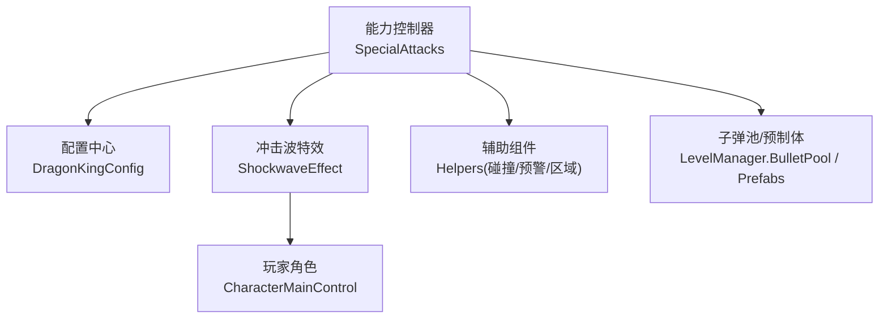
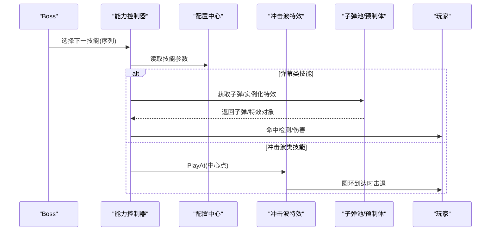
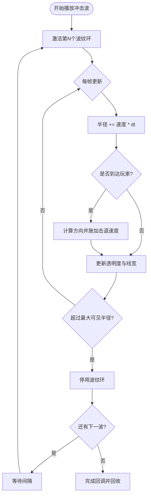
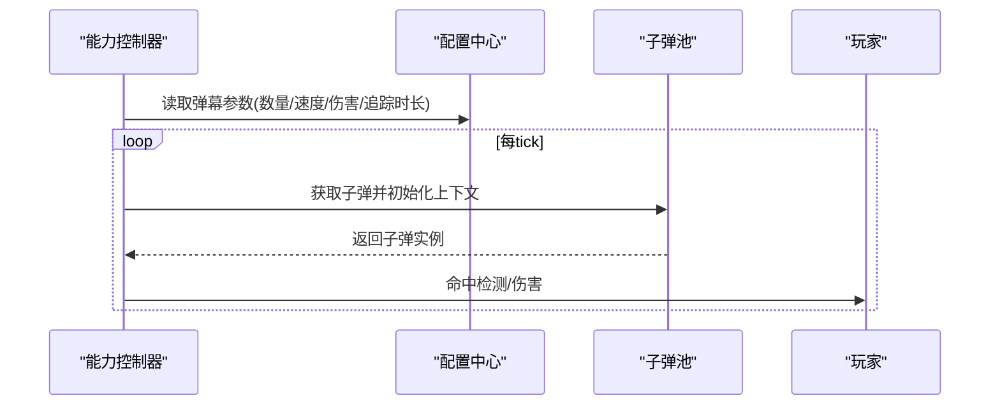
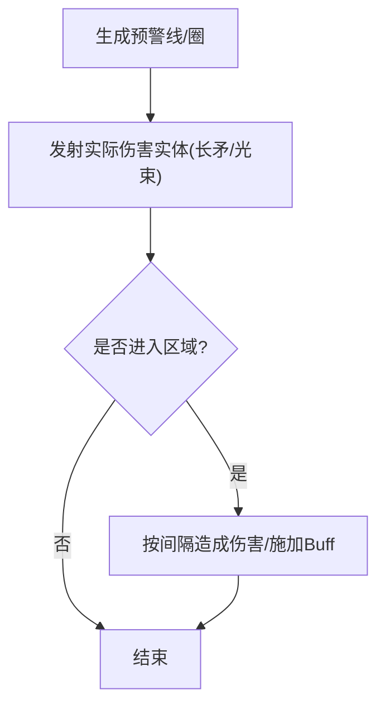
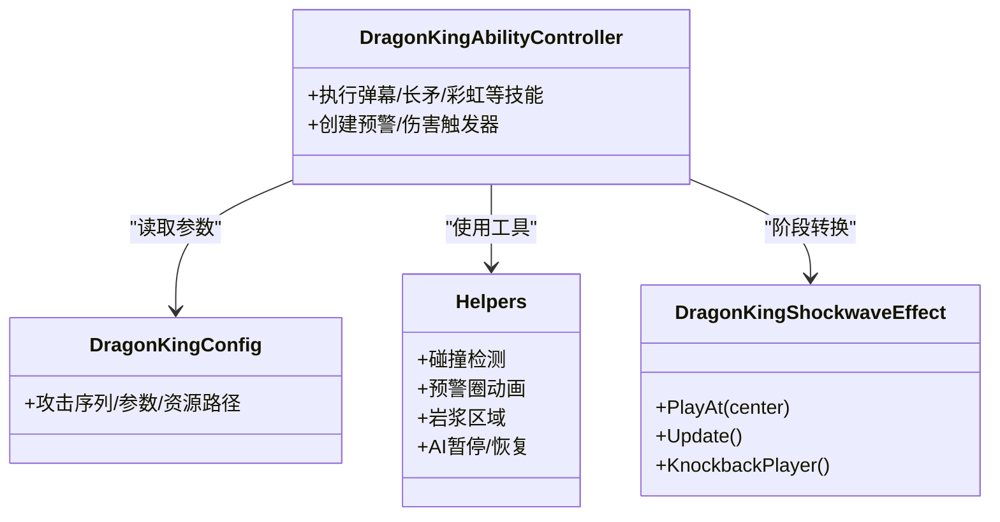

# 特殊攻击系统

<cite>
**本文引用的文件**
- [DragonKingAbilityController_SpecialAttacks.cs](file://Integration/DragonKing/DragonKingAbilityController_SpecialAttacks.cs)
- [DragonKingShockwaveEffect.cs](file://Integration/DragonKing/DragonKingShockwaveEffect.cs)
- [DragonKingConfig.cs](file://Integration/DragonKing/DragonKingConfig.cs)
- [DragonKingAbilityHelpers.cs](file://Integration/DragonKing/DragonKingAbilityHelpers.cs)
</cite>

## 目录
1. [简介](#简介)
2. [项目结构](#项目结构)
3. [核心组件](#核心组件)
4. [架构总览](#架构总览)
5. [详细组件分析](#详细组件分析)
6. [依赖关系分析](#依赖关系分析)
7. [性能考量](#性能考量)
8. [故障排查指南](#故障排查指南)
9. [结论](#结论)
10. [附录：配置与自定义开发指南](#附录：配置与自定义开发指南)

## 简介
本文件面向“焚天龙皇”Boss的特殊攻击系统，聚焦以下目标：
- 冲击波效果实现：圆形扩散、伤害/击退、视觉特效。
- 弹幕模式系统：扇形射击、螺旋弹幕、追踪导弹。
- 范围伤害机制：地面标记、持续伤害、区域控制。
- 触发条件、能量消耗管理、冷却时间控制。
- 特殊攻击配置方法与自定义效果开发指南。

该系统的核心由能力控制器、冲击波特效、辅助组件与集中配置构成，所有数值与行为均可通过配置类进行调优。

## 项目结构
围绕“焚天龙皇”特殊攻击的关键代码集中在 Integration/DragonKing 目录下：
- DragonKingAbilityController_SpecialAttacks.cs：负责太阳舞弹幕、永恒彩虹、以太长矛等技能流程与发射逻辑。
- DragonKingShockwaveEffect.cs：阶段转换时的圆形冲击波特效与击退。
- DragonKingConfig.cs：全部可调参数（伤害、速度、数量、持续时间、序列等）。
- DragonKingAbilityHelpers.cs：碰撞检测、预警圈动画、岩浆区域、AI暂停/恢复等通用工具。

图表来源
- [DragonKingAbilityController_SpecialAttacks.cs:19-142](file://Integration/DragonKing/DragonKingAbilityController_SpecialAttacks.cs#L19-L142)
- [DragonKingShockwaveEffect.cs:116-164](file://Integration/DragonKing/DragonKingShockwaveEffect.cs#L116-L164)
- [DragonKingConfig.cs:569-597](file://Integration/DragonKing/DragonKingConfig.cs#L569-L597)
- [DragonKingAbilityHelpers.cs:20-127](file://Integration/DragonKing/DragonKingAbilityHelpers.cs#L20-L127)

章节来源
- [DragonKingAbilityController_SpecialAttacks.cs:19-800](file://Integration/DragonKing/DragonKingAbilityController_SpecialAttacks.cs#L19-L800)
- [DragonKingShockwaveEffect.cs:1-561](file://Integration/DragonKing/DragonKingShockwaveEffect.cs#L1-L561)
- [DragonKingConfig.cs:1-736](file://Integration/DragonKing/DragonKingConfig.cs#L1-L736)
- [DragonKingAbilityHelpers.cs:1-800](file://Integration/DragonKing/DragonKingAbilityHelpers.cs#L1-L800)

## 核心组件
- 能力控制器（特殊攻击）：组织并执行各技能的协程与循环，负责发射弹幕、生成预警、计算命中与伤害。
- 冲击波特效：从Boss中心向外扩散的圆环，碰到玩家时施加击退，并在达到最大半径后回收。
- 辅助组件：
  - 碰撞检测器：基于距离检测的Boss-玩家碰撞与冷却。
  - 预警圈动画：用于蓄力/读条提示的缩放圆环。
  - 岩浆区域：地面标记、持续伤害与Buff。
  - AI暂停/恢复：在阶段转换或关键技能期间优雅暂停Boss行动。
- 配置中心：统一暴露所有可调参数（伤害、速度、数量、间隔、序列等），便于平衡与扩展。

章节来源
- [DragonKingAbilityController_SpecialAttacks.cs:19-142](file://Integration/DragonKing/DragonKingAbilityController_SpecialAttacks.cs#L19-L142)
- [DragonKingShockwaveEffect.cs:18-97](file://Integration/DragonKing/DragonKingShockwaveEffect.cs#L18-L97)
- [DragonKingAbilityHelpers.cs:20-127](file://Integration/DragonKing/DragonKingAbilityHelpers.cs#L20-L127)
- [DragonKingConfig.cs:13-736](file://Integration/DragonKing/DragonKingConfig.cs#L13-L736)

## 架构总览
下图展示了特殊攻击的整体数据与控制流：能力控制器读取配置，调用子弹池与资源管理器生成弹幕/特效；冲击波特效独立运行，更新圆环位置并对玩家施加击退；辅助组件提供碰撞、预警、区域伤害与AI控制。

图表来源
- [DragonKingAbilityController_SpecialAttacks.cs:19-142](file://Integration/DragonKing/DragonKingAbilityController_SpecialAttacks.cs#L19-L142)
- [DragonKingShockwaveEffect.cs:116-164](file://Integration/DragonKing/DragonKingShockwaveEffect.cs#L116-L164)
- [DragonKingConfig.cs:569-597](file://Integration/DragonKing/DragonKingConfig.cs#L569-L597)

## 详细组件分析

### 冲击波效果（圆形扩散、击退、视觉）
- 圆形扩散：使用LineRenderer绘制多段圆环，按固定速度扩大半径，支持多波次与间距。
- 击退：当圆环半径超过玩家到中心的距离时，计算方向向量并设置玩家移动速度，随后延迟清除。
- 视觉：颜色渐变、宽度随半径变化、淡入淡出，达到最大可见半径后停用。
- 性能：预分配WaitForSeconds、单位圆点缓存、对象池复用。

图表来源
- [DragonKingShockwaveEffect.cs:216-236](file://Integration/DragonKing/DragonKingShockwaveEffect.cs#L216-L236)
- [DragonKingShockwaveEffect.cs:337-405](file://Integration/DragonKing/DragonKingShockwaveEffect.cs#L337-L405)
- [DragonKingShockwaveEffect.cs:433-466](file://Integration/DragonKing/DragonKingShockwaveEffect.cs#L433-L466)

章节来源
- [DragonKingShockwaveEffect.cs:18-97](file://Integration/DragonKing/DragonKingShockwaveEffect.cs#L18-L97)
- [DragonKingShockwaveEffect.cs:116-164](file://Integration/DragonKing/DragonKingShockwaveEffect.cs#L116-L164)
- [DragonKingShockwaveEffect.cs:216-236](file://Integration/DragonKing/DragonKingShockwaveEffect.cs#L216-L236)
- [DragonKingShockwaveEffect.cs:337-405](file://Integration/DragonKing/DragonKingShockwaveEffect.cs#L337-L405)
- [DragonKingShockwaveEffect.cs:433-466](file://Integration/DragonKing/DragonKingShockwaveEffect.cs#L433-L466)

### 弹幕模式系统（扇形射击、螺旋弹幕、追踪导弹）
- 扇形射击（太阳舞弹幕）：以初始方向为基准，按角度步长同时向多个方向发射直线子弹，每tick整体旋转一定角度，形成扇形覆盖。
- 螺旋弹幕（棱彩弹2）：按固定间隔与角度增量连续发射，形成螺旋轨迹；具备追踪持续时间，超时后直线飞行。
- 追踪导弹（棱彩弹1）：具备追踪强度与追踪时长，超出时长后转为直线飞行；可配置伤害、速度、生命周期与缩放。

图表来源
- [DragonKingAbilityController_SpecialAttacks.cs:19-61](file://Integration/DragonKing/DragonKingAbilityController_SpecialAttacks.cs#L19-L61)
- [DragonKingAbilityController_SpecialAttacks.cs:68-142](file://Integration/DragonKing/DragonKingAbilityController_SpecialAttacks.cs#L68-L142)
- [DragonKingConfig.cs:93-155](file://Integration/DragonKing/DragonKingConfig.cs#L93-L155)

章节来源
- [DragonKingAbilityController_SpecialAttacks.cs:19-142](file://Integration/DragonKing/DragonKingAbilityController_SpecialAttacks.cs#L19-L142)
- [DragonKingConfig.cs:93-155](file://Integration/DragonKing/DragonKingConfig.cs#L93-L155)

### 范围伤害机制（地面标记、持续伤害、区域控制）
- 地面标记：以太长矛先画出警告线（可旋转、带渐变透明度），随后从两端发射长矛贯穿屏幕。
- 持续伤害：太阳舞光束挂载伤害触发器，进入即按固定间隔造成伤害；岩浆区域对进入者周期性造成火焰伤害并施加点燃。
- 区域控制：预警圈与长矛线限制走位；冲击波将玩家推开，打乱站位。

图表来源
- [DragonKingAbilityController_SpecialAttacks.cs:379-452](file://Integration/DragonKing/DragonKingAbilityController_SpecialAttacks.cs#L379-L452)
- [DragonKingAbilityController_SpecialAttacks.cs:457-529](file://Integration/DragonKing/DragonKingAbilityController_SpecialAttacks.cs#L457-L529)
- [DragonKingAbilityHelpers.cs:133-195](file://Integration/DragonKing/DragonKingAbilityHelpers.cs#L133-L195)
- [DragonKingAbilityHelpers.cs:778-800](file://Integration/DragonKing/DragonKingAbilityHelpers.cs#L778-L800)

章节来源
- [DragonKingAbilityController_SpecialAttacks.cs:379-529](file://Integration/DragonKing/DragonKingAbilityController_SpecialAttacks.cs#L379-L529)
- [DragonKingAbilityHelpers.cs:133-195](file://Integration/DragonKing/DragonKingAbilityHelpers.cs#L133-L195)
- [DragonKingAbilityHelpers.cs:778-800](file://Integration/DragonKing/DragonKingAbilityHelpers.cs#L778-L800)

### 特殊攻击触发条件、能量消耗与冷却
- 触发条件：通过阶段与攻击序列驱动（一阶段/二阶段序列不同），部分技能受血量阈值或阶段转换触发。
- 能量消耗：当前实现未显式定义“能量槽”，技能释放主要受序列与阶段控制；如需引入能量系统，可在配置中新增字段并在控制器中增加扣费与判定逻辑。
- 冷却控制：多处采用固定间隔（如弹幕tick、预警显示、伤害间隔）与组件级冷却（如碰撞检测冷却、音效节流）避免过频触发。

章节来源
- [DragonKingConfig.cs:71-92](file://Integration/DragonKing/DragonKingConfig.cs#L71-L92)
- [DragonKingConfig.cs:569-597](file://Integration/DragonKing/DragonKingConfig.cs#L569-L597)
- [DragonKingAbilityController_SpecialAttacks.cs:19-61](file://Integration/DragonKing/DragonKingAbilityController_SpecialAttacks.cs#L19-L61)
- [DragonKingAbilityHelpers.cs:20-127](file://Integration/DragonKing/DragonKingAbilityHelpers.cs#L20-L127)

## 依赖关系分析
- 能力控制器依赖配置中心获取所有可调参数。
- 冲击波特效依赖玩家引用与Unity渲染管线（LineRenderer、材质）。
- 辅助组件依赖游戏核心类型（CharacterMainControl、AI相关组件）。
- 子弹与特效通过资源路径与BulletPool统一管理。

图表来源
- [DragonKingAbilityController_SpecialAttacks.cs:19-142](file://Integration/DragonKing/DragonKingAbilityController_SpecialAttacks.cs#L19-L142)
- [DragonKingConfig.cs:13-736](file://Integration/DragonKing/DragonKingConfig.cs#L13-L736)
- [DragonKingShockwaveEffect.cs:18-97](file://Integration/DragonKing/DragonKingShockwaveEffect.cs#L18-L97)
- [DragonKingAbilityHelpers.cs:20-127](file://Integration/DragonKing/DragonKingAbilityHelpers.cs#L20-L127)

章节来源
- [DragonKingAbilityController_SpecialAttacks.cs:19-142](file://Integration/DragonKing/DragonKingAbilityController_SpecialAttacks.cs#L19-L142)
- [DragonKingConfig.cs:13-736](file://Integration/DragonKing/DragonKingConfig.cs#L13-L736)
- [DragonKingShockwaveEffect.cs:18-97](file://Integration/DragonKing/DragonKingShockwaveEffect.cs#L18-L97)
- [DragonKingAbilityHelpers.cs:20-127](file://Integration/DragonKing/DragonKingAbilityHelpers.cs#L20-L127)

## 性能考量
- 对象池与复用：冲击波特效使用对象池与共享材质；弹幕与预警线尽量复用List容量与Gradient。
- 反射与查找缓存：音频方法、HitLayers字段等仅反射一次并缓存。
- 频率控制：音效节流、碰撞检测冷却、伤害tick间隔，避免高频调用导致卡顿。
- 几何计算优化：单位圆点数组缓存、平方距离比较减少开方开销。

章节来源
- [DragonKingShockwaveEffect.cs:35-40](file://Integration/DragonKing/DragonKingShockwaveEffect.cs#L35-L40)
- [DragonKingShockwaveEffect.cs:531-545](file://Integration/DragonKing/DragonKingShockwaveEffect.cs#L531-L545)
- [DragonKingAbilityController_SpecialAttacks.cs:147-215](file://Integration/DragonKing/DragonKingAbilityController_SpecialAttacks.cs#L147-L215)
- [DragonKingAbilityHelpers.cs:20-127](file://Integration/DragonKing/DragonKingAbilityHelpers.cs#L20-L127)

## 故障排查指南
- 冲击波不生效：检查PlayAt调用中心点是否正确；确认玩家引用有效；查看Update中半径增长与击退逻辑是否被跳过。
- 弹幕不造成伤害：确认子弹上下文初始化（方向、速度、伤害、半伤距离）；检查命中检测与LayerMask设置；核对配置中的速度与伤害。
- 预警线/圈异常：确认LineRenderer材质与顶点设置；检查渐变与透明度更新；确保在协程中正确销毁与回收。
- AI未暂停/恢复：确认AI控制器与PathControl组件存在；检查行为树enabled属性反射是否成功；必要时打印日志定位。

章节来源
- [DragonKingShockwaveEffect.cs:116-164](file://Integration/DragonKing/DragonKingShockwaveEffect.cs#L116-L164)
- [DragonKingAbilityController_SpecialAttacks.cs:68-142](file://Integration/DragonKing/DragonKingAbilityController_SpecialAttacks.cs#L68-L142)
- [DragonKingAbilityController_SpecialAttacks.cs:457-529](file://Integration/DragonKing/DragonKingAbilityController_SpecialAttacks.cs#L457-L529)
- [DragonKingAbilityHelpers.cs:262-557](file://Integration/DragonKing/DragonKingAbilityHelpers.cs#L262-L557)

## 结论
“焚天龙皇”特殊攻击系统通过清晰的分层设计实现了高可控性与可扩展性：
- 能力控制器专注流程编排与发射逻辑。
- 冲击波特效独立且高性能，提供强反馈的视觉与位移体验。
- 辅助组件封装了碰撞、预警、区域伤害与AI控制等通用能力。
- 配置中心集中管理所有可调参数，便于平衡与定制。

## 附录：配置与自定义开发指南
- 调整伤害与频率：修改配置中的伤害、速度、数量、持续时间与间隔（例如棱彩弹/太阳舞/彩虹/长矛相关常量）。
- 新增技能：在配置中添加新攻击类型与序列项，在能力控制器中实现对应协程与发射逻辑，复用现有子弹池与特效资源。
- 自定义视觉效果：替换或新增预制体路径；复用LineRenderer与材质策略；注意对象池与资源回收。
- 引入能量系统：在配置中新增能量字段，在控制器中于技能前扣费并判断是否足够，失败则跳过或降级。
- 冷却与节流：为新增技能添加合适的tick/冷却间隔，避免与现有机制冲突。

章节来源
- [DragonKingConfig.cs:13-736](file://Integration/DragonKing/DragonKingConfig.cs#L13-L736)
- [DragonKingAbilityController_SpecialAttacks.cs:19-142](file://Integration/DragonKing/DragonKingAbilityController_SpecialAttacks.cs#L19-L142)
- [DragonKingAbilityController_SpecialAttacks.cs:379-529](file://Integration/DragonKing/DragonKingAbilityController_SpecialAttacks.cs#L379-L529)
- [DragonKingAbilityHelpers.cs:20-127](file://Integration/DragonKing/DragonKingAbilityHelpers.cs#L20-L127)