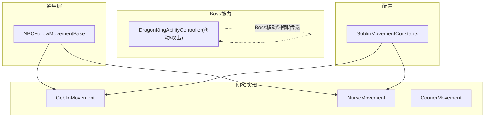
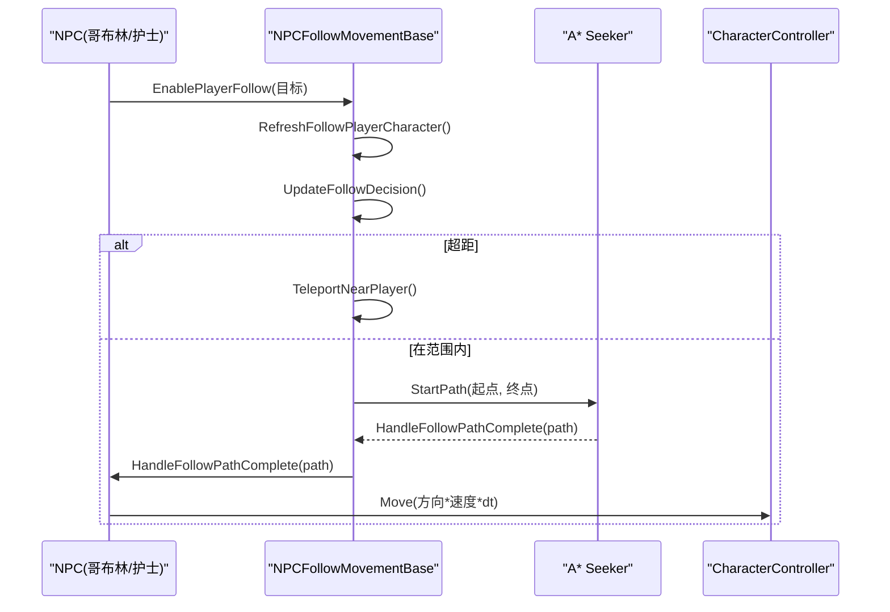
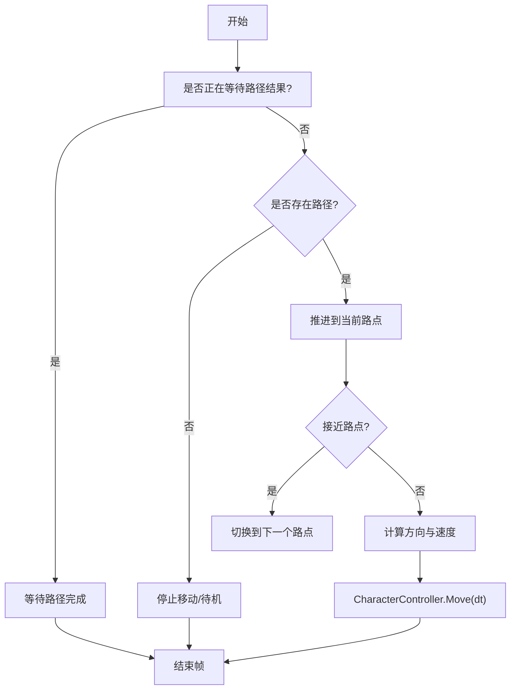
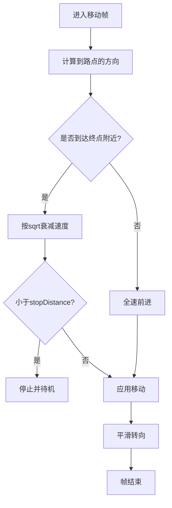
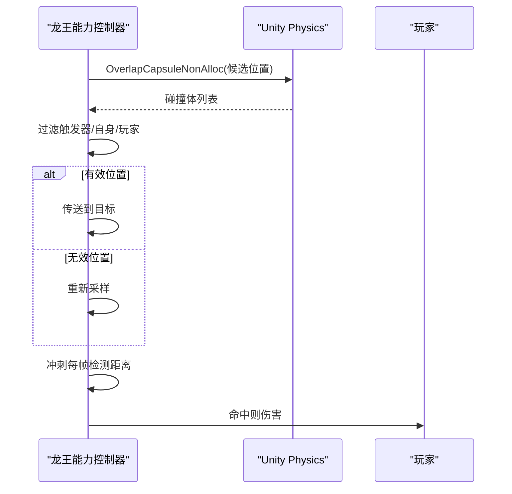
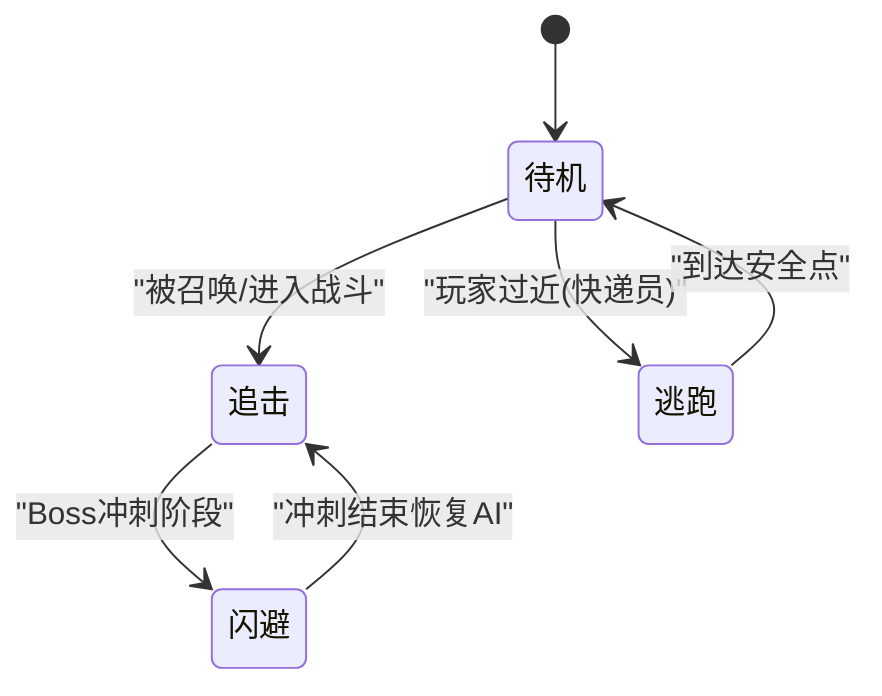
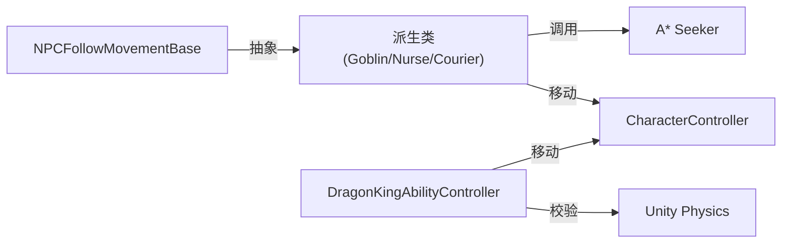

# 移动系统

<cite>
**本文引用的文件**
- [NPCFollowMovementBase.cs](file://Integration/Utils/NPCFollowMovementBase.cs)
- [GoblinMovement.cs](file://Integration/NPCs/Goblin/GoblinMovement.cs)
- [NurseMovement.cs](file://Integration/NPCs/Nurse/NurseMovement.cs)
- [CourierMovement.cs](file://Integration/NPCs/Courier/CourierMovement.cs)
- [DragonKingAbilityController_ProjectileAndMovement.cs](file://Integration/DragonKing/DragonKingAbilityController_ProjectileAndMovement.cs)
- [GoblinMovementConstants.cs](file://Integration/Constants/GoblinMovementConstants.cs)
</cite>

## 目录
1. [简介](#简介)
2. [项目结构](#项目结构)
3. [核心组件](#核心组件)
4. [架构总览](#架构总览)
5. [详细组件分析](#详细组件分析)
6. [依赖关系分析](#依赖关系分析)
7. [性能考量](#性能考量)
8. [故障排查指南](#故障排查指南)
9. [结论](#结论)
10. [附录：参数调优与自定义行为开发](#附录参数调优与自定义行为开发)

## 简介
本文件面向“焚天龙皇移动系统”的文档目标，聚焦以下方面：
- 路径规划算法：导航网格使用、障碍物规避、目标追踪。
- 速度控制系统：加速减速、惯性模拟、平滑过渡。
- 碰撞检测机制：边界检查、玩家接触、环境交互。
- 移动状态管理：待机、追击、闪避、逃跑。
- 移动参数调优与自定义移动行为开发指南。

该系统的实现以 A* Pathfinding（Seeker）为寻路核心，结合 CharacterController 进行物理移动；Boss 侧通过能力控制器驱动冲刺、传送、弹幕等移动相关行为；通用跟随逻辑由基类统一封装，派生类按需扩展。

## 项目结构
围绕移动系统的关键代码分布在如下模块：
- 通用跟随基类：提供玩家引用、重算间隔、距离阈值、速度同步、传送回拉等公共逻辑。
- NPC 移动实现：哥布林、护士、快递员分别实现各自的漫步、追击、逃跑等行为。
- Boss 移动能力：龙王的能力控制器负责冲刺、传送、弹幕追踪等复杂移动。
- 常量配置：集中管理移动相关魔法数字，便于调参与维护。

图表来源
- [NPCFollowMovementBase.cs:17-53](file://Integration/Utils/NPCFollowMovementBase.cs#L17-L53)
- [GoblinMovement.cs:22-71](file://Integration/NPCs/Goblin/GoblinMovement.cs#L22-L71)
- [NurseMovement.cs:20-60](file://Integration/NPCs/Nurse/NurseMovement.cs#L20-L60)
- [CourierMovement.cs:22-54](file://Integration/NPCs/Courier/CourierMovement.cs#L22-L54)
- [DragonKingAbilityController_ProjectileAndMovement.cs:300-579](file://Integration/DragonKing/DragonKingAbilityController_ProjectileAndMovement.cs#L300-L579)
- [GoblinMovementConstants.cs:15-120](file://Integration/Constants/GoblinMovementConstants.cs#L15-L120)

章节来源
- [NPCFollowMovementBase.cs:17-53](file://Integration/Utils/NPCFollowMovementBase.cs#L17-L53)
- [GoblinMovement.cs:22-71](file://Integration/NPCs/Goblin/GoblinMovement.cs#L22-L71)
- [NurseMovement.cs:20-60](file://Integration/NPCs/Nurse/NurseMovement.cs#L20-L60)
- [CourierMovement.cs:22-54](file://Integration/NPCs/Courier/CourierMovement.cs#L22-L54)
- [DragonKingAbilityController_ProjectileAndMovement.cs:300-579](file://Integration/DragonKing/DragonKingAbilityController_ProjectileAndMovement.cs#L300-L579)
- [GoblinMovementConstants.cs:15-120](file://Integration/Constants/GoblinMovementConstants.cs#L15-L120)

## 核心组件
- 通用跟随基类（NPCFollowMovementBase）
  - 职责：玩家引用刷新、OnSetPositionEvent 同步、超距传送回拉、跟随重算节流、速度同步（基于玩家速度动态调整）、距离缓存优化。
  - 关键抽象：WalkSpeed/RunSpeed、FollowRepathInterval、FollowStopDistance、FollowRunDistance、FollowTeleportDistance、FollowSpeedBoostDistance、FollowSpeedResetDistance、FollowSeeker、FollowCharacterController、路径完成回调等。
- NPC 移动实现
  - 哥布林（GoblinMovement）：A* 寻路 + CharacterController 移动，支持漫步、跑向玩家、停止/恢复行走、高度修正、重力应用。
  - 护士（NurseMovement）：继承基类，实现漫步与跟随，动画参数缓存与切换。
  - 快递员（CourierMovement）：独立实现，具备服务态、固定模式、Boss战安全距离逃跑、待机动画等。
- Boss 移动能力（DragonKingAbilityController_ProjectileAndMovement）
  - 职责：冲刺（蓄力→第一段直接位移→第二段 SetForceMoveVelocity）、传送（位置校验与防空心体）、弹幕生成与追踪、命中检测。
- 常量配置（GoblinMovementConstants）
  - 职责：统一管理速度、寻路、漫步、CharacterController、物理等参数。

章节来源
- [NPCFollowMovementBase.cs:17-53](file://Integration/Utils/NPCFollowMovementBase.cs#L17-L53)
- [GoblinMovement.cs:22-71](file://Integration/NPCs/Goblin/GoblinMovement.cs#L22-L71)
- [NurseMovement.cs:20-60](file://Integration/NPCs/Nurse/NurseMovement.cs#L20-L60)
- [CourierMovement.cs:22-54](file://Integration/NPCs/Courier/CourierMovement.cs#L22-L54)
- [DragonKingAbilityController_ProjectileAndMovement.cs:300-579](file://Integration/DragonKing/DragonKingAbilityController_ProjectileAndMovement.cs#L300-L579)
- [GoblinMovementConstants.cs:15-120](file://Integration/Constants/GoblinMovementConstants.cs#L15-L120)

## 架构总览
移动系统采用“基类+派生类”的分层设计：
- 基类封装通用跟随逻辑，派生类专注自身行为（漫步/追击/逃跑）。
- 所有 NPC 均使用 A* Seeker 发起寻路请求，并通过 CharacterController 执行物理移动。
- Boss 的移动由能力控制器驱动，部分技能使用 SetForceMoveVelocity 或插值位移，配合碰撞检测与环境校验。

图表来源
- [NPCFollowMovementBase.cs:96-204](file://Integration/Utils/NPCFollowMovementBase.cs#L96-L204)
- [GoblinMovement.cs:112-152](file://Integration/NPCs/Goblin/GoblinMovement.cs#L112-L152)
- [NurseMovement.cs:288-305](file://Integration/NPCs/Nurse/NurseMovement.cs#L288-L305)

## 详细组件分析

### 路径规划算法：导航网格使用、障碍物规避、目标追踪
- 导航网格使用
  - 所有 NPC 通过 A* Pathfinding 的 Seeker 发起寻路请求，目标点经高度修正后传入。
  - 路径完成后，逐路点推进，忽略 Y 轴差异，仅按水平面计算到达判定。
- 障碍物规避
  - 使用 CharacterController.Move 处理碰撞与地形贴合。
  - 传送前使用 Capsule Overlap 校验位置有效性，避免落入空心体。
- 目标追踪
  - Boss 的棱彩弹在生成后延迟开始追踪，追踪期间保持生命周期并命中检测。
  - 冲刺攻击中，第一段直接位移，第二段使用 SetForceMoveVelocity 沿方向移动。

图表来源
- [GoblinMovement.cs:359-447](file://Integration/NPCs/Goblin/GoblinMovement.cs#L359-L447)
- [NurseMovement.cs:189-283](file://Integration/NPCs/Nurse/NurseMovement.cs#L189-L283)
- [CourierMovement.cs:536-655](file://Integration/NPCs/Courier/CourierMovement.cs#L536-L655)
- [DragonKingAbilityController_ProjectileAndMovement.cs:676-758](file://Integration/DragonKing/DragonKingAbilityController_ProjectileAndMovement.cs#L676-L758)

章节来源
- [GoblinMovement.cs:359-447](file://Integration/NPCs/Goblin/GoblinMovement.cs#L359-L447)
- [NurseMovement.cs:189-283](file://Integration/NPCs/Nurse/NurseMovement.cs#L189-L283)
- [CourierMovement.cs:536-655](file://Integration/NPCs/Courier/CourierMovement.cs#L536-L655)
- [DragonKingAbilityController_ProjectileAndMovement.cs:676-758](file://Integration/DragonKing/DragonKingAbilityController_ProjectileAndMovement.cs#L676-L758)

### 速度控制系统：加速减速、惯性模拟、平滑过渡
- 加速/减速
  - 接近终点时按 sqrt(distance/nextWaypointDistance) 衰减速度，达到 stopDistance 完全停止。
  - 跟随模式下根据与玩家距离动态提升/重置走/跑速度，确保与玩家速度同步。
- 惯性模拟
  - 通过插值旋转（RotateTowards）与缓出曲线（easedT）实现转向与位移的平滑过渡。
- 平滑过渡
  - 冲刺激活阶段先暂停 AI 移动，蓄力结束后分两段移动：第一段 Lerp 位移，第二段 SetForceMoveVelocity 渐减速度。

图表来源
- [GoblinMovement.cs:373-447](file://Integration/NPCs/Goblin/GoblinMovement.cs#L373-L447)
- [NurseMovement.cs:214-283](file://Integration/NPCs/Nurse/NurseMovement.cs#L214-L283)
- [CourierMovement.cs:554-655](file://Integration/NPCs/Courier/CourierMovement.cs#L554-L655)
- [NPCFollowMovementBase.cs:323-346](file://Integration/Utils/NPCFollowMovementBase.cs#L323-L346)
- [DragonKingAbilityController_ProjectileAndMovement.cs:458-563](file://Integration/DragonKing/DragonKingAbilityController_ProjectileAndMovement.cs#L458-L563)

章节来源
- [GoblinMovement.cs:373-447](file://Integration/NPCs/Goblin/GoblinMovement.cs#L373-L447)
- [NurseMovement.cs:214-283](file://Integration/NPCs/Nurse/NurseMovement.cs#L214-L283)
- [CourierMovement.cs:554-655](file://Integration/NPCs/Courier/CourierMovement.cs#L554-L655)
- [NPCFollowMovementBase.cs:323-346](file://Integration/Utils/NPCFollowMovementBase.cs#L323-L346)
- [DragonKingAbilityController_ProjectileAndMovement.cs:458-563](file://Integration/DragonKing/DragonKingAbilityController_ProjectileAndMovement.cs#L458-L563)

### 碰撞检测机制：边界检查、玩家接触、环境交互
- 边界检查
  - 传送前使用 Capsule Overlap 校验候选位置，忽略触发器与角色自身碰撞体，确保不在空心体内。
- 玩家接触
  - 冲刺过程中每帧检测 Boss 与玩家的平方距离，小于阈值即造成伤害。
- 环境交互
  - 路径目标点通过射线向下修正高度，避免悬空或穿入地面。
  - 弹幕命中检测使用平方半径比较，命中后播放音效并扣血。

图表来源
- [DragonKingAbilityController_ProjectileAndMovement.cs:676-758](file://Integration/DragonKing/DragonKingAbilityController_ProjectileAndMovement.cs#L676-L758)
- [DragonKingAbilityController_ProjectileAndMovement.cs:658-668](file://Integration/DragonKing/DragonKingAbilityController_ProjectileAndMovement.cs#L658-L668)
- [GoblinMovement.cs:496-532](file://Integration/NPCs/Goblin/GoblinMovement.cs#L496-L532)
- [NurseMovement.cs:393-405](file://Integration/NPCs/Nurse/NurseMovement.cs#L393-L405)

章节来源
- [DragonKingAbilityController_ProjectileAndMovement.cs:658-758](file://Integration/DragonKing/DragonKingAbilityController_ProjectileAndMovement.cs#L658-L758)
- [GoblinMovement.cs:496-532](file://Integration/NPCs/Goblin/GoblinMovement.cs#L496-L532)
- [NurseMovement.cs:393-405](file://Integration/NPCs/Nurse/NurseMovement.cs#L393-L405)

### 移动状态管理：待机、追击、闪避、逃跑
- 待机
  - NPC 到达目标点后进入待机动画，计时结束后继续移动决策。
- 追击
  - 当被召唤或处于特定状态时，立即停止当前移动并发起寻路至玩家位置。
- 闪避
  - Boss 冲刺分为两段：第一段直接位移，第二段 SetForceMoveVelocity 短冲刺，期间持续检测碰撞。
- 逃跑
  - 快递员在 Boss 战中若玩家过近，触发逃跑气泡并移动到远离玩家的刷新点。

图表来源
- [CourierMovement.cs:487-533](file://Integration/NPCs/Courier/CourierMovement.cs#L487-L533)
- [DragonKingAbilityController_ProjectileAndMovement.cs:300-579](file://Integration/DragonKing/DragonKingAbilityController_ProjectileAndMovement.cs#L300-L579)
- [GoblinMovement.cs:131-175](file://Integration/NPCs/Goblin/GoblinMovement.cs#L131-L175)

章节来源
- [CourierMovement.cs:487-533](file://Integration/NPCs/Courier/CourierMovement.cs#L487-L533)
- [DragonKingAbilityController_ProjectileAndMovement.cs:300-579](file://Integration/DragonKing/DragonKingAbilityController_ProjectileAndMovement.cs#L300-L579)
- [GoblinMovement.cs:131-175](file://Integration/NPCs/Goblin/GoblinMovement.cs#L131-L175)

## 依赖关系分析
- 组件耦合
  - 基类与派生类：派生类实现具体行为，基类提供通用跟随逻辑。
  - NPC 与 A*：通过 Seeker 发起寻路，路径完成后交由派生类处理。
  - NPC 与 Unity 物理：CharacterController 负责移动与碰撞。
  - Boss 与 Unity 物理：OverlapCapsule 与距离检测用于位置校验与命中判定。
- 外部依赖
  - A* Pathfinding（Seeker/AstarPath）
  - Unity 物理（Physics、CharacterController）
  - Animator（动画参数控制）

图表来源
- [NPCFollowMovementBase.cs:17-53](file://Integration/Utils/NPCFollowMovementBase.cs#L17-L53)
- [GoblinMovement.cs:22-71](file://Integration/NPCs/Goblin/GoblinMovement.cs#L22-L71)
- [NurseMovement.cs:20-60](file://Integration/NPCs/Nurse/NurseMovement.cs#L20-L60)
- [CourierMovement.cs:22-54](file://Integration/NPCs/Courier/CourierMovement.cs#L22-L54)
- [DragonKingAbilityController_ProjectileAndMovement.cs:676-758](file://Integration/DragonKing/DragonKingAbilityController_ProjectileAndMovement.cs#L676-L758)

章节来源
- [NPCFollowMovementBase.cs:17-53](file://Integration/Utils/NPCFollowMovementBase.cs#L17-L53)
- [GoblinMovement.cs:22-71](file://Integration/NPCs/Goblin/GoblinMovement.cs#L22-L71)
- [NurseMovement.cs:20-60](file://Integration/NPCs/Nurse/NurseMovement.cs#L20-L60)
- [CourierMovement.cs:22-54](file://Integration/NPCs/Courier/CourierMovement.cs#L22-L54)
- [DragonKingAbilityController_ProjectileAndMovement.cs:676-758](file://Integration/DragonKing/DragonKingAbilityController_ProjectileAndMovement.cs#L676-L758)

## 性能考量
- 平方距离比较：多处使用 sqrMagnitude 替代开方，减少 CPU 开销。
- 帧级缓存：玩家引用与距离按帧缓存，避免重复查找与计算。
- NonAlloc API：OverlapCapsuleNonAlloc、RaycastNonAlloc 减少分配。
- 动画参数缓存：Animator 参数哈希值与存在性检查，降低运行时反射成本。
- 节流重算：跟随重算间隔限制，避免频繁寻路。

[本节为通用指导，不直接分析具体文件]

## 故障排查指南
- 寻路失败
  - 检查 A* 是否激活，日志输出图数量与类型。
  - 确认目标点高度已修正，避免悬空或地下。
- 移动卡顿
  - 检查是否在等待路径结果或路径为空。
  - 确认 CharacterController 启用且尺寸合理。
- 传送异常
  - 检查 OverlapCapsule 返回的碰撞体列表，排除触发器与自身。
- 动画不同步
  - 确认 Animator 参数名称与类型匹配，必要时缓存参数存在性。

章节来源
- [GoblinMovement.cs:263-303](file://Integration/NPCs/Goblin/GoblinMovement.cs#L263-L303)
- [CourierMovement.cs:262-337](file://Integration/NPCs/Courier/CourierMovement.cs#L262-L337)
- [NurseMovement.cs:128-166](file://Integration/NPCs/Nurse/NurseMovement.cs#L128-L166)
- [DragonKingAbilityController_ProjectileAndMovement.cs:676-758](file://Integration/DragonKing/DragonKingAbilityController_ProjectileAndMovement.cs#L676-L758)

## 结论
移动系统通过统一的基类与派生类结构，实现了 NPC 的稳健跟随与 Boss 的复杂移动行为。A* 寻路与 CharacterController 物理的结合确保了路径可行与碰撞正确；Boss 的冲刺、传送与弹幕追踪提供了丰富的战斗体验。通过集中常量管理与性能优化策略，系统在可维护性与运行效率上取得平衡。

[本节为总结，不直接分析具体文件]

## 附录：参数调优与自定义行为开发
- 参数调优建议
  - 速度与距离：调整 WalkSpeed/RunSpeed、FollowStopDistance、FollowRunDistance、FollowTeleportDistance，以匹配关卡尺度与难度。
  - 重算间隔：FollowRepathInterval 影响响应频率与性能，建议在高频场景适当增大。
  - 动画与转向：TurnSpeed 影响转向平滑度，过大易突兀，过小易迟滞。
  - 物理尺寸：CharacterController 的高度、半径、中心、坡度限制需与模型匹配，避免穿模或卡住。
- 自定义移动行为开发
  - 继承 NPCFollowMovementBase，实现抽象属性与方法，注入自定义寻路与移动逻辑。
  - 在 Update 中组合基类的跟随决策与派生类的漫步/追击/逃跑逻辑。
  - 使用 NPCPathingHelper 统一处理路径完成与停止移动，保证一致性。
  - 对 Boss 新增移动技能时，优先复用 SetForceMoveVelocity 与插值位移，并结合 Overlap/Raycast 做环境校验。

章节来源
- [GoblinMovementConstants.cs:15-120](file://Integration/Constants/GoblinMovementConstants.cs#L15-L120)
- [NPCFollowMovementBase.cs:40-53](file://Integration/Utils/NPCFollowMovementBase.cs#L40-L53)
- [GoblinMovement.cs:63-71](file://Integration/NPCs/Goblin/GoblinMovement.cs#L63-L71)
- [NurseMovement.cs:45-60](file://Integration/NPCs/Nurse/NurseMovement.cs#L45-L60)
- [CourierMovement.cs:41-54](file://Integration/NPCs/Courier/CourierMovement.cs#L41-L54)