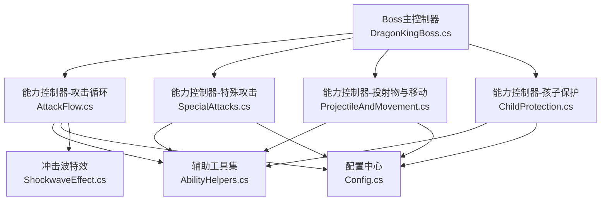
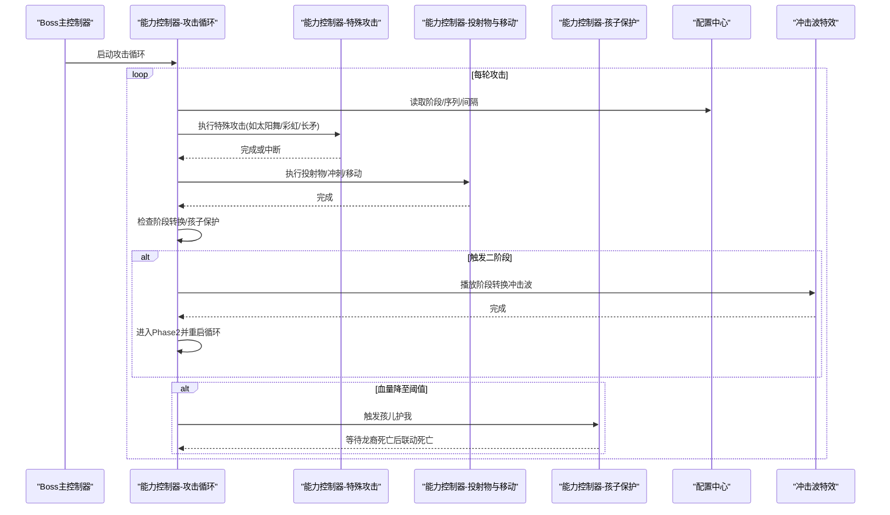
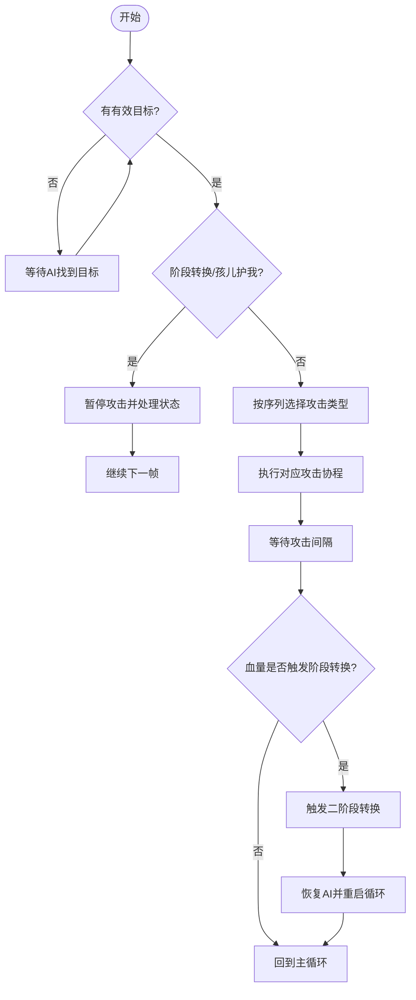
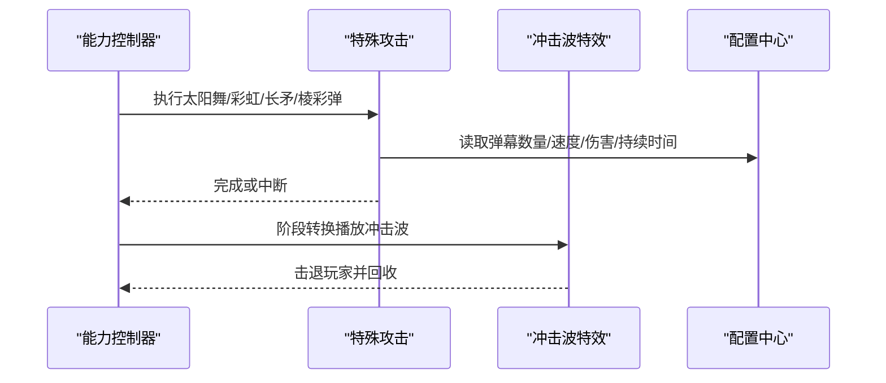
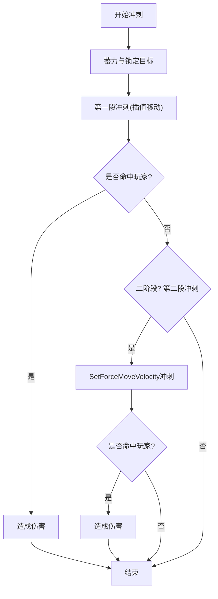
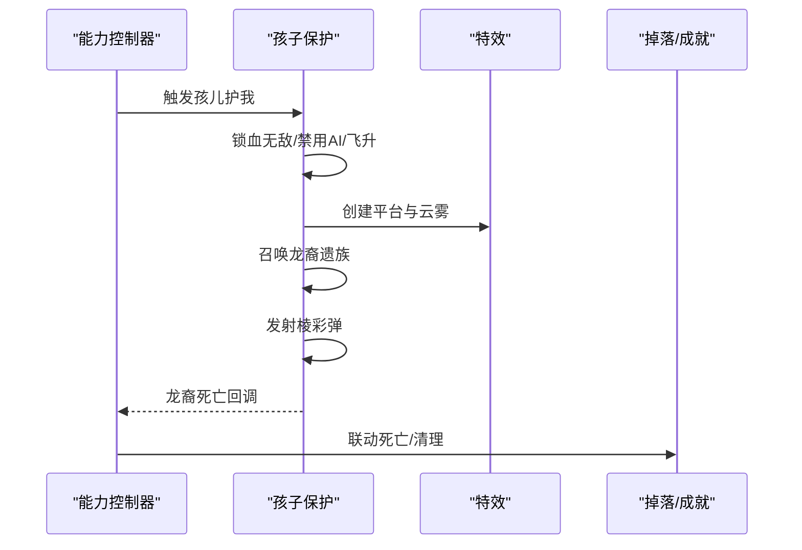
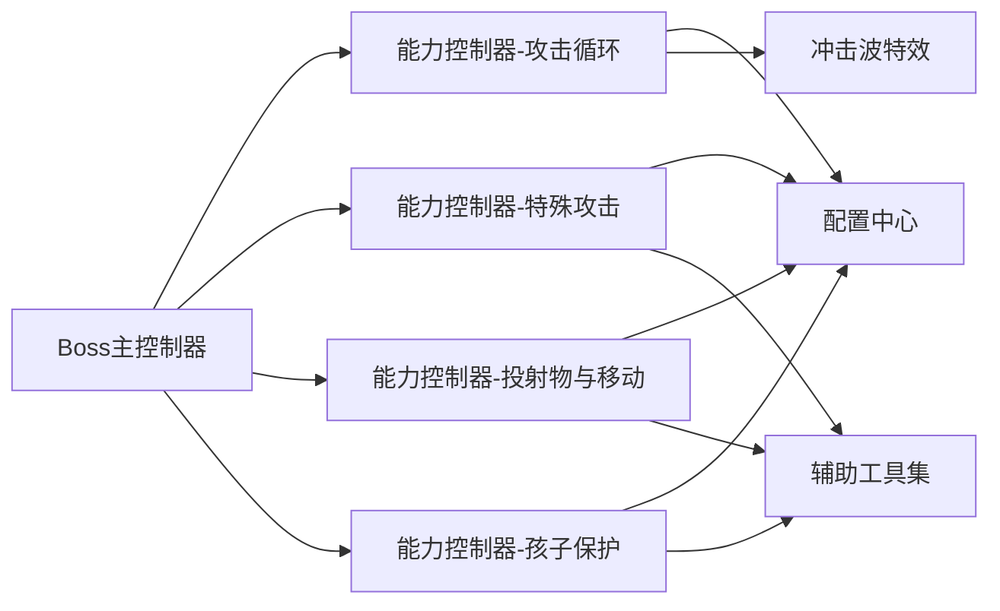

# 能力控制系统

<cite>
**本文引用的文件**
- [DragonKingBoss.cs](file://Integration/DragonKing/DragonKingBoss.cs)
- [DragonKingAbilityController_AttackFlow.cs](file://Integration/DragonKing/DragonKingAbilityController_AttackFlow.cs)
- [DragonKingAbilityController_SpecialAttacks.cs](file://Integration/DragonKing/DragonKingAbilityController_SpecialAttacks.cs)
- [DragonKingAbilityController_ProjectileAndMovement.cs](file://Integration/DragonKing/DragonKingAbilityController_ProjectileAndMovement.cs)
- [DragonKingAbilityController_ChildProtection.cs](file://Integration/DragonKing/DragonKingAbilityController_ChildProtection.cs)
- [DragonKingAbilityHelpers.cs](file://Integration/DragonKing/DragonKingAbilityHelpers.cs)
- [DragonKingConfig.cs](file://Integration/DragonKing/DragonKingConfig.cs)
- [DragonKingShockwaveEffect.cs](file://Integration/DragonKing/DragonKingShockwaveEffect.cs)
</cite>

## 目录
1. [简介](#简介)
2. [项目结构](#项目结构)
3. [核心组件](#核心组件)
4. [架构总览](#架构总览)
5. [详细组件分析](#详细组件分析)
6. [依赖关系分析](#依赖关系分析)
7. [性能考量](#性能考量)
8. [故障排查指南](#故障排查指南)
9. [结论](#结论)
10. [附录：扩展与自定义开发指南](#附录：扩展与自定义开发指南)

## 简介
本文件面向“焚天龙皇”Boss的能力控制系统，系统性说明其AI行为树设计、攻击流程控制、状态机管理、决策算法，以及特殊攻击系统（冲击波、弹幕模式、范围伤害）、移动系统（路径规划、速度控制、碰撞检测）、孩子保护机制、阶段转换与难度调节。同时提供能力扩展接口与自定义攻击模式的开发指南，帮助开发者在不破坏现有稳定性的前提下进行二次开发与调优。

## 项目结构
围绕“焚天龙皇”的能力控制，代码以模块化方式组织在 Integration/DragonKing 目录下，主要职责划分如下：
- Boss生命周期与生成：负责实例化、属性设置、事件订阅与清理
- 能力控制器：按职责拆分为多个 partial class，分别处理攻击循环、特殊攻击、投射物与移动、孩子保护等
- 辅助工具：碰撞检测器、AI暂停/恢复、预警动画、伤害触发器等
- 配置中心：集中定义所有可调参数、序列、资源与音效路径
- 特效模块：阶段转换冲击波特效独立实现，支持对象池与击退

图表来源
- [DragonKingBoss.cs:205-371](file://Integration/DragonKing/DragonKingBoss.cs#L205-L371)
- [DragonKingAbilityController_AttackFlow.cs:17-120](file://Integration/DragonKing/DragonKingAbilityController_AttackFlow.cs#L17-L120)
- [DragonKingAbilityController_SpecialAttacks.cs:15-61](file://Integration/DragonKing/DragonKingAbilityController_SpecialAttacks.cs#L15-L61)
- [DragonKingAbilityController_ProjectileAndMovement.cs:17-95](file://Integration/DragonKing/DragonKingAbilityController_ProjectileAndMovement.cs#L17-L95)
- [DragonKingAbilityController_ChildProtection.cs:25-134](file://Integration/DragonKing/DragonKingAbilityController_ChildProtection.cs#L25-L134)
- [DragonKingAbilityHelpers.cs:262-557](file://Integration/DragonKing/DragonKingAbilityHelpers.cs#L262-L557)
- [DragonKingConfig.cs:13-734](file://Integration/DragonKing/DragonKingConfig.cs#L13-L734)
- [DragonKingShockwaveEffect.cs:18-123](file://Integration/DragonKing/DragonKingShockwaveEffect.cs#L18-L123)

章节来源
- [DragonKingBoss.cs:205-371](file://Integration/DragonKing/DragonKingBoss.cs#L205-L371)
- [DragonKingConfig.cs:13-734](file://Integration/DragonKing/DragonKingConfig.cs#L13-L734)

## 核心组件
- Boss主控制器：负责生成、装备、事件订阅、死亡清理与多实例管理
- 能力控制器（分模块）：
  - 攻击循环：维护当前阶段、攻击序列、阶段转换、玩家目标校验
  - 特殊攻击：太阳舞弹幕、永恒彩虹、以太长矛（含切屏）、棱彩弹系列
  - 投射物与移动：追踪弹幕、冲刺、位置验证、碰撞检测
  - 孩子保护：锁血无敌、飞升、召唤龙裔遗族、联动死亡
- 辅助工具：AI暂停/恢复、碰撞检测器、预警动画、伤害触发器、岩浆区域
- 配置中心：全部数值、序列、资源路径、音效路径、难度相关参数
- 冲击波特效：三波扩散、击退、对象池复用

章节来源
- [DragonKingBoss.cs:205-371](file://Integration/DragonKing/DragonKingBoss.cs#L205-L371)
- [DragonKingAbilityController_AttackFlow.cs:17-120](file://Integration/DragonKing/DragonKingAbilityController_AttackFlow.cs#L17-L120)
- [DragonKingAbilityController_SpecialAttacks.cs:15-61](file://Integration/DragonKing/DragonKingAbilityController_SpecialAttacks.cs#L15-L61)
- [DragonKingAbilityController_ProjectileAndMovement.cs:17-95](file://Integration/DragonKing/DragonKingAbilityController_ProjectileAndMovement.cs#L17-L95)
- [DragonKingAbilityController_ChildProtection.cs:25-134](file://Integration/DragonKing/DragonKingAbilityController_ChildProtection.cs#L25-L134)
- [DragonKingAbilityHelpers.cs:262-557](file://Integration/DragonKing/DragonKingAbilityHelpers.cs#L262-L557)
- [DragonKingConfig.cs:13-734](file://Integration/DragonKing/DragonKingConfig.cs#L13-L734)
- [DragonKingShockwaveEffect.cs:18-123](file://Integration/DragonKing/DragonKingShockwaveEffect.cs#L18-L123)

## 架构总览
“焚天龙皇”采用“主控制器 + 能力控制器（分模块）+ 配置中心 + 特效模块”的架构。攻击由主循环驱动，依据当前阶段与攻击序列选择技能；特殊攻击通过协程执行，期间可暂停/恢复AI；阶段转换与孩子保护通过状态机切换，确保无敌窗口与演出效果；移动系统结合原版AI与自定义逻辑，保证寻路与碰撞的正确性。

图表来源
- [DragonKingAbilityController_AttackFlow.cs:17-120](file://Integration/DragonKing/DragonKingAbilityController_AttackFlow.cs#L17-L120)
- [DragonKingAbilityController_AttackFlow.cs:134-287](file://Integration/DragonKing/DragonKingAbilityController_AttackFlow.cs#L134-L287)
- [DragonKingAbilityController_SpecialAttacks.cs:15-61](file://Integration/DragonKing/DragonKingAbilityController_SpecialAttacks.cs#L15-L61)
- [DragonKingAbilityController_ProjectileAndMovement.cs:17-95](file://Integration/DragonKing/DragonKingAbilityController_ProjectileAndMovement.cs#L17-L95)
- [DragonKingAbilityController_ChildProtection.cs:25-134](file://Integration/DragonKing/DragonKingAbilityController_ChildProtection.cs#L25-L134)
- [DragonKingShockwaveEffect.cs:116-164](file://Integration/DragonKing/DragonKingShockwaveEffect.cs#L116-L164)
- [DragonKingConfig.cs:564-597](file://Integration/DragonKing/DragonKingConfig.cs#L564-L597)

## 详细组件分析

### AI行为树与状态机管理
- 攻击主循环：持续运行，根据当前阶段与攻击序列选择技能；支持调试模式固定释放指定技能；在阶段转换和孩子保护期间暂停攻击
- 阶段转换：当血量低于阈值时触发，隐藏模型、停止AI与射击、播放传送与阶段转换特效、释放冲击波、传送到地面有效位置、恢复AI并进入第二阶段
- 孩子保护：血量降至阈值时锁血无敌、禁用角色与AI、飞升高度、召唤龙裔遗族、发射棱彩弹、龙裔死亡后联动死亡
- 决策算法：基于配置的攻击序列与阶段阈值；Mode E下无仇恨目标时跳过攻击，等待AI搜索目标

图表来源
- [DragonKingAbilityController_AttackFlow.cs:17-120](file://Integration/DragonKing/DragonKingAbilityController_AttackFlow.cs#L17-L120)
- [DragonKingAbilityController_AttackFlow.cs:134-287](file://Integration/DragonKing/DragonKingAbilityController_AttackFlow.cs#L134-L287)
- [DragonKingAbilityController_AttackFlow.cs:419-460](file://Integration/DragonKing/DragonKingAbilityController_AttackFlow.cs#L419-L460)
- [DragonKingAbilityController_ChildProtection.cs:25-134](file://Integration/DragonKing/DragonKingAbilityController_ChildProtection.cs#L25-L134)
- [DragonKingConfig.cs:564-597](file://Integration/DragonKing/DragonKingConfig.cs#L564-L597)

章节来源
- [DragonKingAbilityController_AttackFlow.cs:17-120](file://Integration/DragonKing/DragonKingAbilityController_AttackFlow.cs#L17-L120)
- [DragonKingAbilityController_AttackFlow.cs:134-287](file://Integration/DragonKing/DragonKingAbilityController_AttackFlow.cs#L134-L287)
- [DragonKingAbilityController_AttackFlow.cs:419-460](file://Integration/DragonKing/DragonKingAbilityController_AttackFlow.cs#L419-L460)
- [DragonKingAbilityController_ChildProtection.cs:25-134](file://Integration/DragonKing/DragonKingAbilityController_ChildProtection.cs#L25-L134)
- [DragonKingConfig.cs:564-597](file://Integration/DragonKing/DragonKingConfig.cs#L564-L597)

### 特殊攻击系统
- 太阳舞弹幕：向24个方向同时发射子弹，整体旋转，使用原武器子弹速度与缩放，火属性伤害，带音效节流
- 永恒彩虹：生成星环螺旋扩散后收缩，实时跟随Boss位置，轨迹伤害
- 以太长矛：横向贯穿警告线，随后双向发射长矛，命中检测使用射线与包围盒优化
- 棱彩弹：周围生成追踪弹幕，延迟后追踪玩家，支持追踪持续时间与伤害
- 冲击波：阶段转换时播放三波扩散，击退玩家，对象池复用

图表来源
- [DragonKingAbilityController_SpecialAttacks.cs:15-61](file://Integration/DragonKing/DragonKingAbilityController_SpecialAttacks.cs#L15-L61)
- [DragonKingAbilityController_SpecialAttacks.cs:262-370](file://Integration/DragonKing/DragonKingAbilityController_SpecialAttacks.cs#L262-L370)
- [DragonKingAbilityController_SpecialAttacks.cs:374-452](file://Integration/DragonKing/DragonKingAbilityController_SpecialAttacks.cs#L374-L452)
- [DragonKingAbilityController_ProjectileAndMovement.cs:17-95](file://Integration/DragonKing/DragonKingAbilityController_ProjectileAndMovement.cs#L17-L95)
- [DragonKingShockwaveEffect.cs:116-164](file://Integration/DragonKing/DragonKingShockwaveEffect.cs#L116-L164)
- [DragonKingConfig.cs:211-333](file://Integration/DragonKing/DragonKingConfig.cs#L211-L333)

章节来源
- [DragonKingAbilityController_SpecialAttacks.cs:15-61](file://Integration/DragonKing/DragonKingAbilityController_SpecialAttacks.cs#L15-L61)
- [DragonKingAbilityController_SpecialAttacks.cs:262-370](file://Integration/DragonKing/DragonKingAbilityController_SpecialAttacks.cs#L262-L370)
- [DragonKingAbilityController_SpecialAttacks.cs:374-452](file://Integration/DragonKing/DragonKingAbilityController_SpecialAttacks.cs#L374-L452)
- [DragonKingAbilityController_ProjectileAndMovement.cs:17-95](file://Integration/DragonKing/DragonKingAbilityController_ProjectileAndMovement.cs#L17-L95)
- [DragonKingShockwaveEffect.cs:116-164](file://Integration/DragonKing/DragonKingShockwaveEffect.cs#L116-L164)
- [DragonKingConfig.cs:211-333](file://Integration/DragonKing/DragonKingConfig.cs#L211-L333)

### 移动系统与碰撞检测
- 路径规划：保留原版AI行走与开枪逻辑，能力控制器在技能释放时暂停/恢复AI，避免冲突
- 速度控制：冲刺使用插值移动与SetForceMoveVelocity，第二段冲刺仅在二阶段执行
- 碰撞检测：距离检测替代触发器事件，冷却防止重复触发；太阳舞光束使用触发器与伤害间隔；冲击波击退使用速度注入
- 位置验证：传送前使用胶囊体检测确保不在空心物体内，失败回退到玩家位置

图表来源
- [DragonKingAbilityController_ProjectileAndMovement.cs:300-579](file://Integration/DragonKing/DragonKingAbilityController_ProjectileAndMovement.cs#L300-L579)
- [DragonKingAbilityHelpers.cs:15-127](file://Integration/DragonKing/DragonKingAbilityHelpers.cs#L15-L127)
- [DragonKingAbilityHelpers.cs:129-195](file://Integration/DragonKing/DragonKingAbilityHelpers.cs#L129-L195)
- [DragonKingAbilityController_ProjectileAndMovement.cs:670-758](file://Integration/DragonKing/DragonKingAbilityController_ProjectileAndMovement.cs#L670-L758)

章节来源
- [DragonKingAbilityController_ProjectileAndMovement.cs:300-579](file://Integration/DragonKing/DragonKingAbilityController_ProjectileAndMovement.cs#L300-L579)
- [DragonKingAbilityHelpers.cs:15-127](file://Integration/DragonKing/DragonKingAbilityHelpers.cs#L15-L127)
- [DragonKingAbilityHelpers.cs:129-195](file://Integration/DragonKing/DragonKingAbilityHelpers.cs#L129-L195)
- [DragonKingAbilityController_ProjectileAndMovement.cs:670-758](file://Integration/DragonKing/DragonKingAbilityController_ProjectileAndMovement.cs#L670-L758)

### 孩子保护机制
- 触发条件：血量降至阈值时触发，锁血并无敌
- 流程：禁用角色与AI、飞升高度、创建飞行平台与云雾特效、召唤龙裔遗族、发射棱彩弹、龙裔死亡后联动死亡
- 清理：移除事件订阅、停止协程、销毁平台与特效、恢复移动系统

图表来源
- [DragonKingAbilityController_ChildProtection.cs:25-134](file://Integration/DragonKing/DragonKingAbilityController_ChildProtection.cs#L25-L134)
- [DragonKingAbilityController_ChildProtection.cs:338-390](file://Integration/DragonKing/DragonKingAbilityController_ChildProtection.cs#L338-L390)
- [DragonKingAbilityController_ChildProtection.cs:597-637](file://Integration/DragonKing/DragonKingAbilityController_ChildProtection.cs#L597-L637)

章节来源
- [DragonKingAbilityController_ChildProtection.cs:25-134](file://Integration/DragonKing/DragonKingAbilityController_ChildProtection.cs#L25-L134)
- [DragonKingAbilityController_ChildProtection.cs:338-390](file://Integration/DragonKing/DragonKingAbilityController_ChildProtection.cs#L338-L390)
- [DragonKingAbilityController_ChildProtection.cs:597-637](file://Integration/DragonKing/DragonKingAbilityController_ChildProtection.cs#L597-L637)

### 阶段转换与难度调节
- 阶段转换：血量阈值触发，隐藏模型、停止AI与射击、播放特效、冲击波、传送到地面有效位置、恢复AI并进入第二阶段
- 难度调节：通过配置调整攻击间隔、弹幕数量、伤害、追踪持续时间等；调试模式可固定释放指定技能用于测试

章节来源
- [DragonKingAbilityController_AttackFlow.cs:134-287](file://Integration/DragonKing/DragonKingAbilityController_AttackFlow.cs#L134-L287)
- [DragonKingConfig.cs:71-91](file://Integration/DragonKing/DragonKingConfig.cs#L71-L91)
- [DragonKingConfig.cs:564-597](file://Integration/DragonKing/DragonKingConfig.cs#L564-L597)

## 依赖关系分析
- Boss主控制器依赖能力控制器进行行为控制，能力控制器依赖配置中心获取参数与序列
- 特殊攻击与投射物依赖辅助工具进行AI暂停/恢复、碰撞检测与伤害触发
- 冲击波特效独立实现，通过对象池复用减少GC压力
- 多处使用缓存与静态字段避免重复反射与查找，提升性能

图表来源
- [DragonKingBoss.cs:205-371](file://Integration/DragonKing/DragonKingBoss.cs#L205-L371)
- [DragonKingAbilityController_AttackFlow.cs:17-120](file://Integration/DragonKing/DragonKingAbilityController_AttackFlow.cs#L17-L120)
- [DragonKingAbilityController_SpecialAttacks.cs:15-61](file://Integration/DragonKing/DragonKingAbilityController_SpecialAttacks.cs#L15-L61)
- [DragonKingAbilityController_ProjectileAndMovement.cs:17-95](file://Integration/DragonKing/DragonKingAbilityController_ProjectileAndMovement.cs#L17-L95)
- [DragonKingAbilityController_ChildProtection.cs:25-134](file://Integration/DragonKing/DragonKingAbilityController_ChildProtection.cs#L25-L134)
- [DragonKingAbilityHelpers.cs:262-557](file://Integration/DragonKing/DragonKingAbilityHelpers.cs#L262-L557)
- [DragonKingConfig.cs:13-734](file://Integration/DragonKing/DragonKingConfig.cs#L13-L734)
- [DragonKingShockwaveEffect.cs:18-123](file://Integration/DragonKing/DragonKingShockwaveEffect.cs#L18-L123)

章节来源
- [DragonKingBoss.cs:205-371](file://Integration/DragonKing/DragonKingBoss.cs#L205-L371)
- [DragonKingAbilityHelpers.cs:262-557](file://Integration/DragonKing/DragonKingAbilityHelpers.cs#L262-L557)
- [DragonKingConfig.cs:13-734](file://Integration/DragonKing/DragonKingConfig.cs#L13-L734)

## 性能考量
- 对象池与缓存：冲击波特效使用对象池；音频方法反射结果缓存；WaitForSeconds对象复用
- 碰撞检测优化：距离检测替代触发器事件；使用sqrMagnitude避免开方；NonAlloc版本减少分配
- 性能守卫：多处Guard脚本确保热路径无额外分配与异常
- 资源管理：场景切换时清理静态缓存与资源管理器缓存，避免内存泄漏

章节来源
- [DragonKingShockwaveEffect.cs:116-164](file://Integration/DragonKing/DragonKingShockwaveEffect.cs#L116-L164)
- [DragonKingAbilityController_SpecialAttacks.cs:147-215](file://Integration/DragonKing/DragonKingAbilityController_SpecialAttacks.cs#L147-L215)
- [DragonKingAbilityController_ProjectileAndMovement.cs:97-129](file://Integration/DragonKing/DragonKingAbilityController_ProjectileAndMovement.cs#L97-L129)
- [DragonKingAbilityController_ProjectileAndMovement.cs:654-668](file://Integration/DragonKing/DragonKingAbilityController_ProjectileAndMovement.cs#L654-L668)
- [DragonKingBoss.cs:77-95](file://Integration/DragonKing/DragonKingBoss.cs#L77-L95)

## 故障排查指南
- 常见问题：
  - 阶段转换后AI未恢复：检查StopBossMovementAndShooting与ResumeBossMovementAndShooting配对调用
  - 孩子保护未触发：确认血量阈值与ShouldClampLethalHealthDuringHurt逻辑
  - 弹幕不显示：检查预制体缓存与BulletPool获取
  - 冲击波无效：确认PlayAt调用与对象池状态
- 日志定位：使用DevLog输出关键节点，便于快速定位问题
- 清理与回收：确保OnBossDeath中正确取消订阅与清理协程

章节来源
- [DragonKingAbilityController_AttackFlow.cs:156-287](file://Integration/DragonKing/DragonKingAbilityController_AttackFlow.cs#L156-L287)
- [DragonKingAbilityController_AttackFlow.cs:419-478](file://Integration/DragonKing/DragonKingAbilityController_AttackFlow.cs#L419-L478)
- [DragonKingAbilityController_SpecialAttacks.cs:68-142](file://Integration/DragonKing/DragonKingAbilityController_SpecialAttacks.cs#L68-L142)
- [DragonKingShockwaveEffect.cs:116-164](file://Integration/DragonKing/DragonKingShockwaveEffect.cs#L116-L164)
- [DragonKingBoss.cs:554-634](file://Integration/DragonKing/DragonKingBoss.cs#L554-L634)

## 结论
“焚天龙皇”能力控制系统通过清晰的模块化设计与配置中心，实现了稳定的AI行为树、丰富的特殊攻击、可靠的移动与碰撞检测，以及完善的孩子保护与阶段转换机制。性能优化贯穿始终，确保在高强度战斗中的流畅体验。开发者可通过配置与扩展接口轻松定制攻击模式与难度曲线。

## 附录：扩展与自定义开发指南
- 新增攻击类型：
  - 在配置中心添加新的攻击枚举与序列项
  - 在能力控制器中添加对应的ExecuteXxx协程
  - 使用配置参数控制弹幕数量、速度、伤害与持续时间
- 自定义弹幕模式：
  - 复用SunDanceBarrageLoop思路，调整方向数量与旋转速度
  - 使用BulletPool与ProjectileContext初始化子弹
- 移动系统扩展：
  - 使用FindValidTeleportPosition进行位置验证
  - 结合SetForceMoveVelocity实现平滑冲刺
- 难度调节：
  - 调整攻击间隔、弹幕数量、伤害倍率与追踪持续时间
  - 使用调试模式固定释放指定技能进行测试

章节来源
- [DragonKingConfig.cs:13-734](file://Integration/DragonKing/DragonKingConfig.cs#L13-L734)
- [DragonKingAbilityController_SpecialAttacks.cs:15-61](file://Integration/DragonKing/DragonKingAbilityController_SpecialAttacks.cs#L15-L61)
- [DragonKingAbilityController_ProjectileAndMovement.cs:670-758](file://Integration/DragonKing/DragonKingAbilityController_ProjectileAndMovement.cs#L670-L758)
- [DragonKingAbilityController_AttackFlow.cs:17-120](file://Integration/DragonKing/DragonKingAbilityController_AttackFlow.cs#L17-L120)