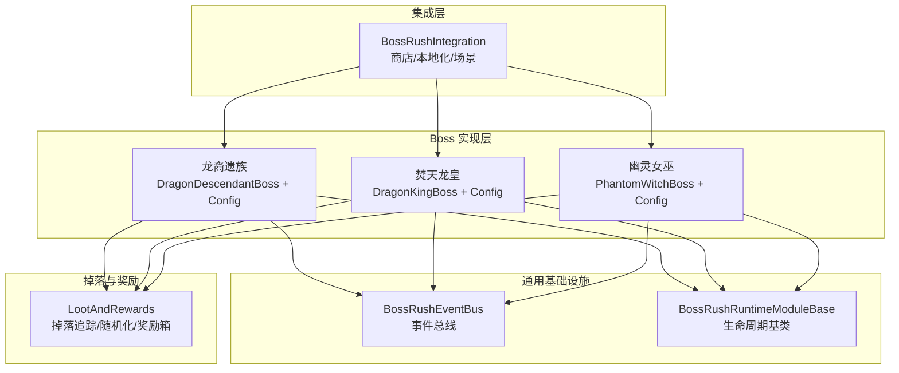
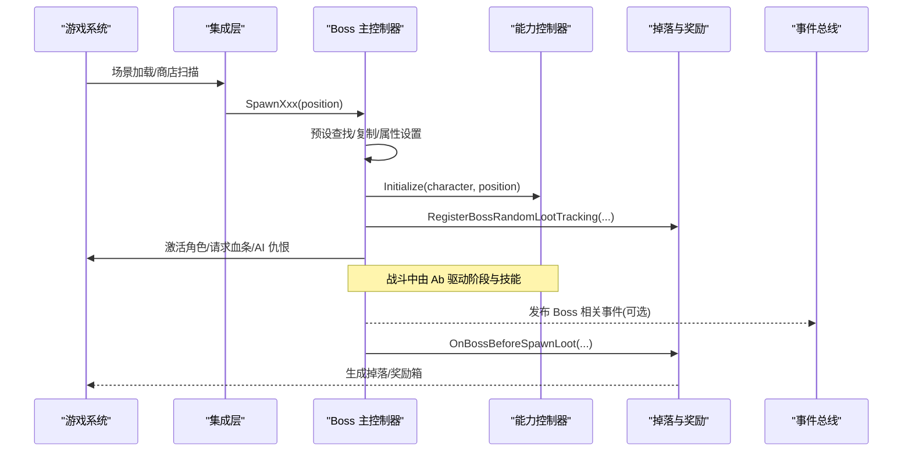
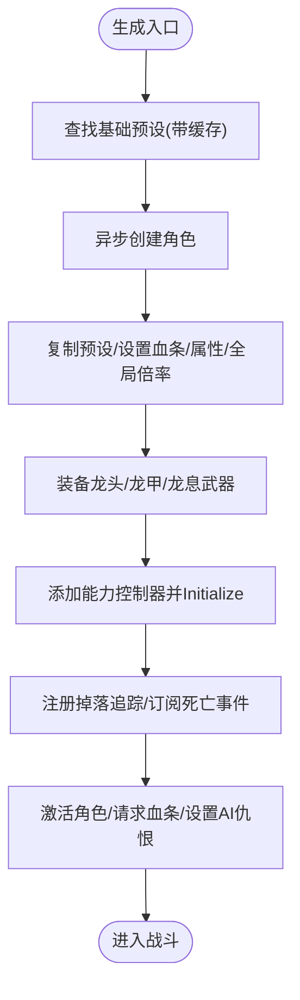
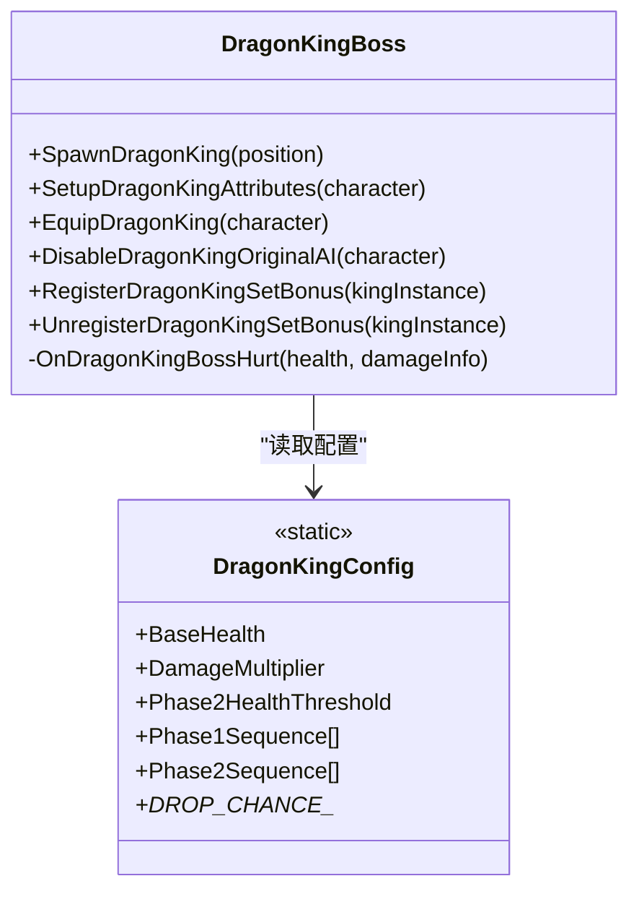
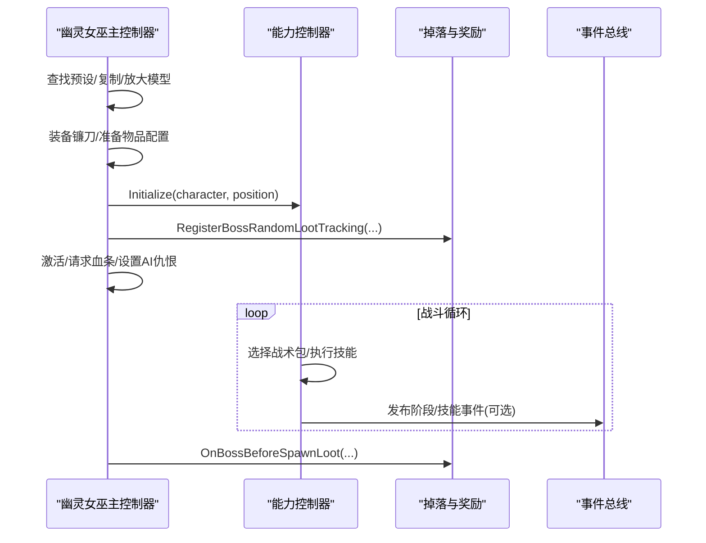
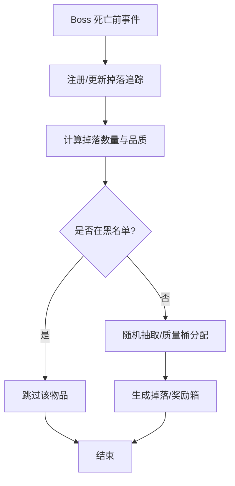
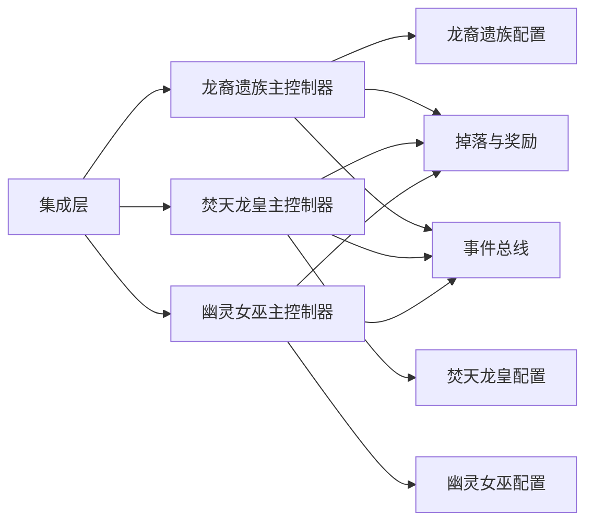

# 自定义 Boss 系统

<cite>
**本文引用的文件**
- [BossRushIntegration.cs](file://Integration/BossRushIntegration.cs)
- [DragonDescendantBoss.cs](file://Integration/DragonDescendant/DragonDescendantBoss.cs)
- [DragonKingBoss.cs](file://Integration/DragonKing/DragonKingBoss.cs)
- [PhantomWitchBoss.cs](file://Integration/PhantomWitch/PhantomWitchBoss.cs)
- [DragonDescendantConfig.cs](file://Integration/DragonDescendant/DragonDescendantConfig.cs)
- [DragonKingConfig.cs](file://Integration/DragonKing/DragonKingConfig.cs)
- [PhantomWitchConfig.cs](file://Integration/PhantomWitch/PhantomWitchConfig.cs)
- [LootAndRewards.cs](file://LootAndRewards/LootAndRewards.cs)
- [BossRushEventBus.cs](file://Common/Events/BossRushEventBus.cs)
- [BossRushRuntimeModuleBase.cs](file://Common/Lifecycle/BossRushRuntimeModuleBase.cs)
</cite>

## 目录
1. [简介](#简介)
2. [项目结构](#项目结构)
3. [核心组件](#核心组件)
4. [架构总览](#架构总览)
5. [详细组件分析](#详细组件分析)
6. [依赖关系分析](#依赖关系分析)
7. [性能考量](#性能考量)
8. [故障排查指南](#故障排查指南)
9. [结论](#结论)
10. [附录：新增 Boss 开发指南与最佳实践](#附录新增-boss-开发指南与最佳实践)

## 简介
本模块为“Boss Rush”模式提供一套可扩展的自定义 Boss 框架，涵盖 Boss 生成、能力系统、阶段转换、掉落与奖励、事件总线与运行时生命周期管理。当前内置三个核心 Boss：龙裔遗族、焚天龙皇、幽灵女巫，分别实现不同的战斗风格与机制。文档面向开发者与高级玩家，既解释整体架构，也给出代码级流程与优化策略，帮助快速理解并扩展新 Boss。

## 项目结构
- 集成层：负责与游戏系统对接（商店注入、本地化、场景加载等）
- Boss 实现层：每个 Boss 一个子目录，包含主控制器、配置、能力控制器、资源管理等
- 通用基础设施：事件总线、运行时模块基类、工具与缓存
- 掉落与奖励：统一的掉落追踪、随机化、通关奖励箱与特殊池
- 模式与地图：Boss 在特定模式/地图中的生成与调度

**图表来源**
- [BossRushIntegration.cs:1-120](file://Integration/BossRushIntegration.cs#L1-L120)
- [DragonDescendantBoss.cs:1-120](file://Integration/DragonDescendant/DragonDescendantBoss.cs#L1-L120)
- [DragonKingBoss.cs:1-120](file://Integration/DragonKing/DragonKingBoss.cs#L1-L120)
- [PhantomWitchBoss.cs:1-120](file://Integration/PhantomWitch/PhantomWitchBoss.cs#L1-L120)
- [LootAndRewards.cs:1-120](file://LootAndRewards/LootAndRewards.cs#L1-L120)
- [BossRushEventBus.cs:1-60](file://Common/Events/BossRushEventBus.cs#L1-L60)
- [BossRushRuntimeModuleBase.cs:1-15](file://Common/Lifecycle/BossRushRuntimeModuleBase.cs#L1-L15)

**章节来源**
- [BossRushIntegration.cs:1-120](file://Integration/BossRushIntegration.cs#L1-L120)
- [LootAndRewards.cs:1-120](file://LootAndRewards/LootAndRewards.cs#L1-L120)

## 核心组件
- 集成与初始化：动态物品注册、商店注入、本地化、场景加载钩子
- Boss 主控制器：统一生成、属性设置、AI 仇恨、血条显示、位置兜底、死亡订阅
- 能力控制器：各 Boss 的技能编排、阶段切换、特效与音效
- 配置中心：血量、伤害倍率、技能参数、掉落概率、名称与本地化键
- 掉落与奖励：Boss 掉落追踪、随机品质、黑名单过滤、通关奖励箱
- 事件总线：低开销类型安全的事件发布/订阅，避免重入问题
- 运行时模块：Awake/Start/Update/LateUpdate/OnDestroy 生命周期钩子

**章节来源**
- [BossRushIntegration.cs:436-492](file://Integration/BossRushIntegration.cs#L436-L492)
- [DragonDescendantBoss.cs:56-235](file://Integration/DragonDescendant/DragonDescendantBoss.cs#L56-L235)
- [DragonKingBoss.cs:206-371](file://Integration/DragonKing/DragonKingBoss.cs#L206-L371)
- [PhantomWitchBoss.cs:137-340](file://Integration/PhantomWitch/PhantomWitchBoss.cs#L137-L340)
- [LootAndRewards.cs:322-432](file://LootAndRewards/LootAndRewards.cs#L322-L432)
- [BossRushEventBus.cs:18-113](file://Common/Events/BossRushEventBus.cs#L18-L113)
- [BossRushRuntimeModuleBase.cs:3-13](file://Common/Lifecycle/BossRushRuntimeModuleBase.cs#L3-L13)

## 架构总览
Boss 系统采用“主控制器 + 能力控制器 + 配置 + 掉落系统 + 事件总线”的分层设计。主控制器负责实例化、装配、生命周期；能力控制器专注 AI 行为与技能；配置集中管理数值与资源路径；掉落系统统一处理掉落与奖励；事件总线用于跨模块通信。

**图表来源**
- [BossRushIntegration.cs:631-774](file://Integration/BossRushIntegration.cs#L631-L774)
- [DragonDescendantBoss.cs:61-235](file://Integration/DragonDescendant/DragonDescendantBoss.cs#L61-L235)
- [DragonKingBoss.cs:206-371](file://Integration/DragonKing/DragonKingBoss.cs#L206-L371)
- [PhantomWitchBoss.cs:137-340](file://Integration/PhantomWitch/PhantomWitchBoss.cs#L137-L340)
- [LootAndRewards.cs:322-432](file://LootAndRewards/LootAndRewards.cs#L322-L432)
- [BossRushEventBus.cs:60-113](file://Common/Events/BossRushEventBus.cs#L60-L113)

## 详细组件分析

### 龙裔遗族（Dragon Descendant）
- 生成与装配：基于基础预设创建角色，复制预设以显示名称与血条，装备龙头/龙甲与龙息武器，附加能力控制器，订阅死亡事件，记录掉落追踪。
- 能力系统：一阶段射击与火焰效果，二阶段使用原始武器子弹数据发射弹幕，具备复活与狂暴状态，燃烧弹投掷与碰撞击退。
- 阶段转换：血量阈值触发狂暴/复活，调整攻击间隔与伤害倍率。
- 掉落机制：基础掉落数量固定，支持随机化与黑名单过滤。
- 性能优化：预设与物品缓存、反射读取属性失败回退、分帧激活。

**图表来源**
- [DragonDescendantBoss.cs:61-235](file://Integration/DragonDescendant/DragonDescendantBoss.cs#L61-L235)
- [DragonDescendantBoss.cs:262-426](file://Integration/DragonDescendant/DragonDescendantBoss.cs#L262-L426)
- [DragonDescendantBoss.cs:568-676](file://Integration/DragonDescendant/DragonDescendantBoss.cs#L568-L676)

**章节来源**
- [DragonDescendantBoss.cs:61-235](file://Integration/DragonDescendant/DragonDescendantBoss.cs#L61-L235)
- [DragonDescendantBoss.cs:262-426](file://Integration/DragonDescendant/DragonDescendantBoss.cs#L262-L426)
- [DragonDescendantBoss.cs:568-676](file://Integration/DragonDescendant/DragonDescendantBoss.cs#L568-L676)
- [DragonDescendantConfig.cs:13-232](file://Integration/DragonDescendant/DragonDescendantConfig.cs#L13-L232)

### 焚天龙皇（Dragon King）
- 生成与装配：复用基础预设，复制预设，设置血条与属性，应用全局倍率，禁用部分原版 AI，添加能力控制器，订阅死亡与掉落事件，播放 BGM。
- 能力系统：多段攻击序列（棱彩弹、冲刺、太阳舞、永恒彩虹、以太长矛），含切屏与螺旋弹幕，阶段间切换有过渡特效与音效。
- 阶段转换：血量阈值触发二阶段，攻击间隔缩短，序列变化。
- 掉落机制：专属掉落池（飞行图腾、逆鳞、龙王之冕/鳞铠、断界戟、焚皇铳），概率可配。
- 性能优化：多实例字典管理、引用计数释放共享资源、静态缓存清理、BGM 状态重置。

**图表来源**
- [DragonKingBoss.cs:206-371](file://Integration/DragonKing/DragonKingBoss.cs#L206-L371)
- [DragonKingBoss.cs:414-551](file://Integration/DragonKing/DragonKingBoss.cs#L414-L551)
- [DragonKingBoss.cs:700-800](file://Integration/DragonKing/DragonKingBoss.cs#L700-L800)
- [DragonKingConfig.cs:30-734](file://Integration/DragonKing/DragonKingConfig.cs#L30-L734)

**章节来源**
- [DragonKingBoss.cs:206-371](file://Integration/DragonKing/DragonKingBoss.cs#L206-L371)
- [DragonKingBoss.cs:414-551](file://Integration/DragonKing/DragonKingBoss.cs#L414-L551)
- [DragonKingBoss.cs:700-800](file://Integration/DragonKing/DragonKingBoss.cs#L700-L800)
- [DragonKingConfig.cs:30-734](file://Integration/DragonKing/DragonKingConfig.cs#L30-L734)

### 幽灵女巫（Phantom Witch）
- 生成与装配：查找基础预设（优先幽灵，回退红 Boss），复制预设并标记 Boss 图标，放大模型，装备镰刀（正式或占位），添加独立控制 GO 的能力控制器，登记资产引用。
- 能力系统：三阶段战术包序列，闪现贴身、诅咒范围技、镰刀横扫/重斩、残局召唤双幽灵，隐身与可见切换，Boss 诅咒领域。
- 阶段转换：按血量阈值进入二/三阶段，调整包间隔与隐身目标比例，阶段提示消息。
- 掉落机制：基础掉落数量固定，支持随机化与黑名单过滤。
- 性能优化：分帧初始化、独立控制器 GO 避免 SetActive 杀死协程、资源引用计数与缓存清理。

**图表来源**
- [PhantomWitchBoss.cs:137-340](file://Integration/PhantomWitch/PhantomWitchBoss.cs#L137-L340)
- [PhantomWitchBoss.cs:381-514](file://Integration/PhantomWitch/PhantomWitchBoss.cs#L381-L514)
- [PhantomWitchConfig.cs:60-316](file://Integration/PhantomWitch/PhantomWitchConfig.cs#L60-L316)

**章节来源**
- [PhantomWitchBoss.cs:137-340](file://Integration/PhantomWitch/PhantomWitchBoss.cs#L137-L340)
- [PhantomWitchBoss.cs:381-514](file://Integration/PhantomWitch/PhantomWitchBoss.cs#L381-L514)
- [PhantomWitchConfig.cs:60-316](file://Integration/PhantomWitch/PhantomWitchConfig.cs#L60-L316)

### 掉落与奖励系统
- 掉落追踪：为每个 Boss 记录生成时间与原始掉落数，订阅死亡前事件，统一处理掉落生成。
- 随机化与黑名单：收集候选物品 ID，构建质量桶，过滤黑名单与特殊标签，支持高品质保底。
- 通关奖励箱：根据难度与模式生成奖励箱，支持无间炼狱现金池与特殊奖励。
- 性能优化：物品价值缓存、分帧初始化、批量处理与复用缓冲区。

**图表来源**
- [LootAndRewards.cs:322-432](file://LootAndRewards/LootAndRewards.cs#L322-L432)
- [LootAndRewards.cs:490-586](file://LootAndRewards/LootAndRewards.cs#L490-L586)
- [LootAndRewards.cs:605-710](file://LootAndRewards/LootAndRewards.cs#L605-L710)

**章节来源**
- [LootAndRewards.cs:322-432](file://LootAndRewards/LootAndRewards.cs#L322-L432)
- [LootAndRewards.cs:490-586](file://LootAndRewards/LootAndRewards.cs#L490-L586)
- [LootAndRewards.cs:605-710](file://LootAndRewards/LootAndRewards.cs#L605-L710)

### 事件总线与生命周期
- 事件总线：类型安全的 Subscribe/Publish，快照发布避免重入，异常隔离与日志。
- 生命周期：运行时模块基类提供 Awake/Start/Update/LateUpdate/OnDestroy 钩子，便于各子系统接入。

**章节来源**
- [BossRushEventBus.cs:18-113](file://Common/Events/BossRushEventBus.cs#L18-L113)
- [BossRushRuntimeModuleBase.cs:3-13](file://Common/Lifecycle/BossRushRuntimeModuleBase.cs#L3-L13)

## 依赖关系分析
- 集成层依赖游戏系统（商店、本地化、场景），并为 Boss 提供初始化入口
- 各 Boss 主控制器依赖对应配置与能力控制器，同时依赖掉落系统进行掉落追踪
- 掉落系统依赖物品资产集合与标签系统，进行候选集构建与过滤
- 事件总线被 Boss 与掉落系统间接使用，用于解耦通知

**图表来源**
- [BossRushIntegration.cs:631-774](file://Integration/BossRushIntegration.cs#L631-L774)
- [DragonDescendantBoss.cs:61-235](file://Integration/DragonDescendant/DragonDescendantBoss.cs#L61-L235)
- [DragonKingBoss.cs:206-371](file://Integration/DragonKing/DragonKingBoss.cs#L206-L371)
- [PhantomWitchBoss.cs:137-340](file://Integration/PhantomWitch/PhantomWitchBoss.cs#L137-L340)
- [LootAndRewards.cs:322-432](file://LootAndRewards/LootAndRewards.cs#L322-L432)
- [BossRushEventBus.cs:60-113](file://Common/Events/BossRushEventBus.cs#L60-L113)

**章节来源**
- [BossRushIntegration.cs:631-774](file://Integration/BossRushIntegration.cs#L631-L774)
- [LootAndRewards.cs:322-432](file://LootAndRewards/LootAndRewards.cs#L322-L432)

## 性能考量
- 预设与物品缓存：避免重复 Resources 扫描与反射调用，提升生成与装配速度
- 分帧初始化：物品价值缓存与大型资源加载分帧处理，减少卡顿
- 引用计数与清理：Boss 销毁时释放共享资源，防止内存泄漏
- 事件发布快照：避免订阅者在发布过程中修改订阅列表导致异常
- 独立控制器 GO：幽灵女巫将能力控制器置于独立对象，避免 SetActive(false) 杀死协程

[本节为通用指导，不直接分析具体文件]

## 2026-08-31 Boss BGM owner 租约与终章死亡表现

Boss BGM 由 `BossBgmCoordinator` 按 `(bossKey, owner)` 持有：同曲多 Boss 最后一个 owner 释放
才停止；不同曲按最近仍存活 owner 抢占并在释放后恢复；切场景清空全部租约。龙裔遗族和幽灵
女巫均传入实例 owner，不再用单一全局 bool 推断存活状态。

幽灵女巫死亡清理始终幂等执行。普通模式保留标准胜利表现；鸭王征程终章由 Campaign 独占最终
文案、胜利与 stinger，避免同一次死亡触发两套结算。

## 故障排查指南
- 生成失败：检查预设查找是否成功、角色创建是否返回空、能力控制器是否正确初始化
- 掉落异常：确认掉落追踪是否注册、事件订阅是否生效、黑名单与标签过滤是否符合预期
- 性能问题：查看是否频繁 Resources 扫描、是否存在未释放的资源引用、是否缺少分帧处理
- 事件丢失：检查事件总线订阅是否正确、发布深度是否为 0、异常是否被捕获并记录

**章节来源**
- [DragonDescendantBoss.cs:237-260](file://Integration/DragonDescendant/DragonDescendantBoss.cs#L237-L260)
- [DragonKingBoss.cs:636-650](file://Integration/DragonKing/DragonKingBoss.cs#L636-L650)
- [PhantomWitchBoss.cs:664-678](file://Integration/PhantomWitch/PhantomWitchBoss.cs#L664-L678)
- [LootAndRewards.cs:246-262](file://LootAndRewards/LootAndRewards.cs#L246-L262)
- [BossRushEventBus.cs:90-113](file://Common/Events/BossRushEventBus.cs#L90-L113)

## 结论
本 Boss 系统通过清晰的分层与模块化设计，实现了高内聚、低耦合的 Boss 能力与掉落体系。三个核心 Boss 展示了不同战斗风格与阶段机制，配合事件总线与运行时生命周期管理，具备良好的扩展性与可维护性。建议新增 Boss 时遵循现有模式，充分利用缓存与分帧优化，确保性能与稳定性。

[本节为总结，不直接分析具体文件]

## 附录：新增 Boss 开发指南与最佳实践
- 新建 Boss 目录与文件
  - 主控制器：实现 SpawnXxx、属性设置、装备、能力控制器初始化、死亡回调
  - 配置类：定义血量、伤害倍率、阶段阈值、技能参数、掉落概率、名称与本地化键
  - 能力控制器：实现技能序列、阶段切换、特效与音效
  - 资源管理：预加载与释放、引用计数、缓存清理
- 集成步骤
  - 在集成层注册本地化与商店注入（如需）
  - 在主控制器中注册到敌人预设列表
  - 在掉落系统中注册掉落追踪
  - 在事件总线中发布必要事件（可选）
- 最佳实践
  - 使用预设与物品缓存，避免重复扫描
  - 分帧初始化与激活，降低出场顿挫
  - 使用引用计数管理共享资源，确保正确释放
  - 对反射与外部 API 访问做异常保护与回退
  - 合理划分阶段与技能包，保持战斗节奏与可读性
  - 完善日志与调试信息，便于定位问题

[本节为通用指导，不直接分析具体文件]
