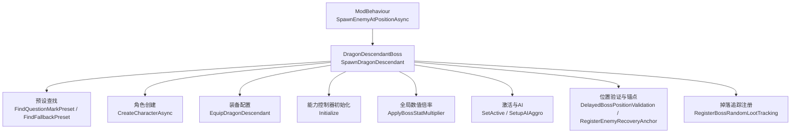
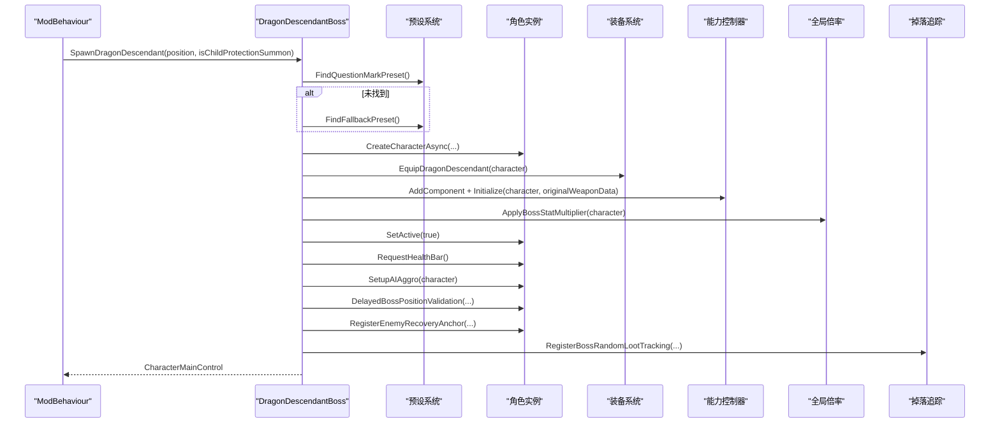
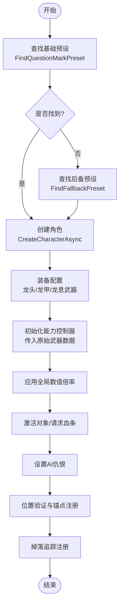
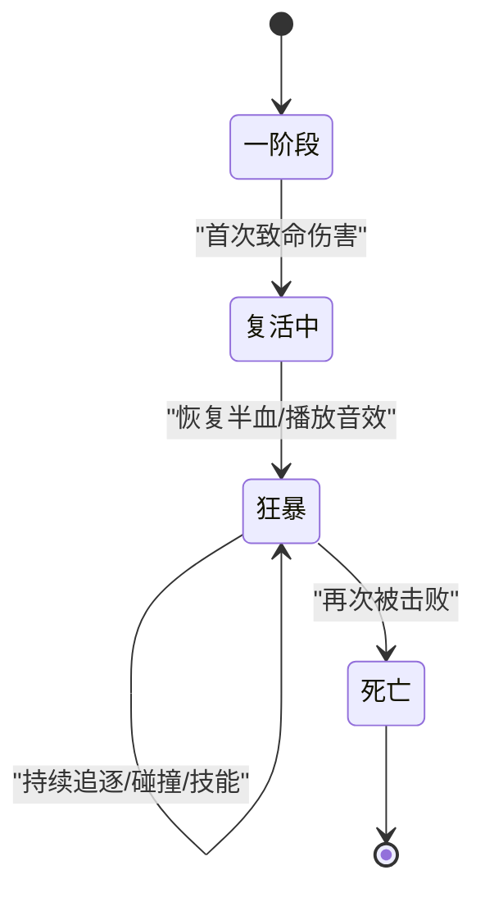
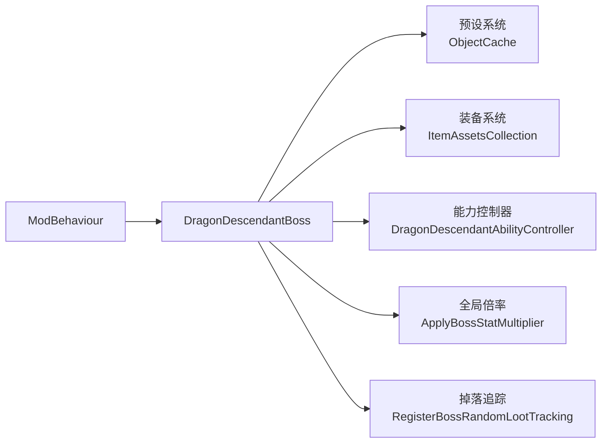

# Boss 框架与生命周期管理

<cite>
**本文引用的文件**
- [ModBehaviour.cs](file://ModBehaviour.cs)
- [DragonDescendantBoss.cs](file://Integration/DragonDescendant/DragonDescendantBoss.cs)
- [DragonDescendantBoss_RuntimeAndCleanup.cs](file://Integration/DragonDescendant/DragonDescendantBoss_RuntimeAndCleanup.cs)
- [DragonDescendantAbilities.cs](file://Integration/DragonDescendant/DragonDescendantAbilities.cs)
- [DragonDescendantAbilities_ResurrectionAndPhase.cs](file://Integration/DragonDescendant/DragonDescendantAbilities_ResurrectionAndPhase.cs)
- [DragonDescendantConfig.cs](file://Integration/DragonDescendant/DragonDescendantConfig.cs)
</cite>

## 目录
1. [简介](#简介)
2. [项目结构](#项目结构)
3. [核心组件](#核心组件)
4. [架构总览](#架构总览)
5. [详细组件分析](#详细组件分析)
6. [依赖关系分析](#依赖关系分析)
7. [性能考量](#性能考量)
8. [故障排查指南](#故障排查指南)
9. [结论](#结论)
10. [附录](#附录)

## 简介
本文件聚焦“龙裔遗族”Boss 的生成、属性配置、能力控制器初始化、激活流程、AI 仇恨设置、位置验证、掉落追踪注册，以及错误处理与降级方案。同时说明预设缓存机制（FindQuestionMarkPreset、FindFallbackPreset）和孩儿护我召唤模式的特殊处理逻辑。

## 项目结构
围绕龙裔遗族 Boss 的关键代码分布在以下文件中：
- ModBehaviour.cs：通用生成入口与调用链，识别并委派到 SpawnDragonDescendant。
- DragonDescendantBoss.cs：SpawnDragonDescendant 主流程、预设查找、角色创建、装备配置、能力控制器初始化、全局数值倍率应用。
- DragonDescendantBoss_RuntimeAndCleanup.cs：AI 仇恨设置、死亡回调、套装效果注册/注销、清理与回收。
- DragonDescendantAbilities.cs：能力控制器初始化、射击检测、预制体缓存、帧级优化。
- DragonDescendantAbilities_ResurrectionAndPhase.cs：复活序列、二阶段狂暴、冰伤减速、八方向燃烧弹。
- DragonDescendantConfig.cs：Boss 基础血量、伤害倍率、复活阈值、装备 ID、掉落概率等常量。

图表来源
- [ModBehaviour.cs:1002-1015](file://ModBehaviour.cs#L1002-L1015)
- [DragonDescendantBoss.cs:61-224](file://Integration/DragonDescendant/DragonDescendantBoss.cs#L61-L224)

章节来源
- [ModBehaviour.cs:1002-1015](file://ModBehaviour.cs#L1002-L1015)
- [DragonDescendantBoss.cs:61-224](file://Integration/DragonDescendant/DragonDescendantBoss.cs#L61-L224)

## 核心组件
- 生成入口与委派：当检测到龙裔遗族预设时，统一走 SpawnDragonDescendant 异步生成路径。
- 预设查找与缓存：优先精确匹配基础预设名键，其次名称模糊匹配，最后回退至任意非玩家预设；结果静态缓存避免重复扫描。
- 角色创建与命名：通过预设 CreateCharacterAsync 生成角色，重命名为标识性名称以便后续清理。
- 装备配置：为 Boss 装配龙头、龙甲与龙息武器，刷新模型并加载高级子弹。
- 能力控制器：附加并初始化能力控制器，传入原始武器完整数据以支持二阶段行为。
- 全局数值倍率：在 Boss 属性设置后应用全局倍率，确保多模式一致性。
- 激活与 AI：激活对象、请求血条、设置 AI 仇恨（Mode E 下不强制追踪）。
- 位置验证与锚点：延迟校验位置并注册恢复锚点，防止位移异常。
- 掉落追踪：所有龙裔均记录掉落信息，便于掉落随机化与统计。

章节来源
- [ModBehaviour.cs:1002-1015](file://ModBehaviour.cs#L1002-L1015)
- [DragonDescendantBoss.cs:61-224](file://Integration/DragonDescendant/DragonDescendantBoss.cs#L61-L224)
- [DragonDescendantBoss_RuntimeAndCleanup.cs:149-179](file://Integration/DragonDescendant/DragonDescendantBoss_RuntimeAndCleanup.cs#L149-L179)

## 架构总览
下图展示从通用生成入口到龙裔遗族专属流程的调用时序，包括预设查找、角色创建、装备、能力控制器初始化、全局倍率、激活、AI、位置验证与掉落追踪。

图表来源
- [ModBehaviour.cs:1002-1015](file://ModBehaviour.cs#L1002-L1015)
- [DragonDescendantBoss.cs:61-224](file://Integration/DragonDescendant/DragonDescendantBoss.cs#L61-L224)

## 详细组件分析

### 生成流程：SpawnDragonDescendant
- 预设查找：先尝试精确匹配基础预设名键，再名称模糊匹配，最后回退到任意非玩家预设；结果静态缓存，避免重复扫描。
- 角色创建：使用预设异步创建角色，失败时触发失败通知（非孩儿护我模式）。
- 预设副本与显示：复制预设并设置 nameKey、显示名称与血条开关，保证 UI 表现一致。
- 属性设置与全局倍率：设置基础血量与伤害倍率，随后应用全局 Boss 数值倍率。
- 装备与能力：在替换武器前捕获原始武器完整属性，用于二阶段；装配龙头、龙甲与龙息武器；附加并初始化能力控制器。
- 激活与 AI：激活对象、请求血条、设置 AI 仇恨（Mode E 下不强制追踪目标）。
- 位置验证与锚点：延迟校验位置并注册恢复锚点，避免卡入地下或掉出有效区域。
- 掉落追踪：所有龙裔均注册掉落追踪，支持掉落随机化与统计。
- 孩儿护我模式：跳过波次追踪与死亡事件订阅，但保留掉落追踪；由龙王侧 OnDescendantDeath 接管其死亡流程。

图表来源
- [DragonDescendantBoss.cs:61-224](file://Integration/DragonDescendant/DragonDescendantBoss.cs#L61-L224)

章节来源
- [DragonDescendantBoss.cs:61-224](file://Integration/DragonDescendant/DragonDescendantBoss.cs#L61-L224)

### 预设缓存机制与性能优化
- FindQuestionMarkPreset：
  - 首次搜索后缓存结果，避免重复 Resources 扫描。
  - 优先精确匹配 BasePresetNameKey 或固定名键，其次名称模糊匹配，最终回退到 ??? 预设兼容旧版本。
- FindFallbackPreset：
  - 若基础预设不可用，则查找 showName=true 的非玩家预设，若无则返回任意非玩家预设。
  - 同样具备静态缓存与已搜索标记，避免重复扫描。
- 其他缓存：
  - 物品与子弹按名称/口径缓存，减少遍历成本。
  - 能力控制器预缓存燃烧弹与子弹预制体，降低运行时开销。

章节来源
- [DragonDescendantBoss.cs:262-426](file://Integration/DragonDescendant/DragonDescendantBoss.cs#L262-L426)
- [DragonDescendantAbilities.cs:90-125](file://Integration/DragonDescendant/DragonDescendantAbilities.cs#L90-L125)
- [DragonDescendantBoss_RuntimeAndCleanup.cs:23-95](file://Integration/DragonDescendant/DragonDescendantBoss_RuntimeAndCleanup.cs#L23-L95)

### Boss 属性设置系统与全局数值倍率
- 属性设置：
  - 设置 MaxHealth 基础值，并立即恢复满血。
  - 设置 GunDamageMultiplier 与 MeleeDamageMultiplier 为一阶段倍率。
- 全局数值倍率：
  - 在属性设置之后应用全局 Boss 数值倍率，确保多模式下的统一缩放。
- 二阶段倍率：
  - 进入狂暴状态后，重新应用二阶段伤害倍率，提升战斗强度。

章节来源
- [DragonDescendantBoss.cs:568-612](file://Integration/DragonDescendant/DragonDescendantBoss.cs#L568-L612)
- [DragonDescendantAbilities_ResurrectionAndPhase.cs:371-400](file://Integration/DragonDescendant/DragonDescendantAbilities_ResurrectionAndPhase.cs#L371-L400)

### 激活流程、AI 仇恨、位置验证与掉落追踪
- 激活流程：
  - 设置对象可见、请求血条显示，确保 UI 正确呈现。
- AI 仇恨：
  - Mode E 模式下不强制追踪玩家，让 AI 自然感知敌人；非 Mode E 模式下强制设置目标并标记已注意。
- 位置验证：
  - 延迟执行位置校验，避免初始位移导致的卡位问题；注册恢复锚点以便异常时复位。
- 掉落追踪：
  - 所有龙裔均注册掉落追踪，支持掉落随机化与统计；孩儿护我模式也包含此步骤。

章节来源
- [DragonDescendantBoss.cs:172-224](file://Integration/DragonDescendant/DragonDescendantBoss.cs#L172-L224)
- [DragonDescendantBoss_RuntimeAndCleanup.cs:149-179](file://Integration/DragonDescendant/DragonDescendantBoss_RuntimeAndCleanup.cs#L149-L179)

### 错误处理与降级方案
- 预设查找失败：
  - 若无法找到任何可用预设，在非孩儿护我模式下触发失败通知，并返回 null。
- 角色创建失败：
  - 同样在非孩儿护我模式下触发失败通知。
- 装备与能力初始化异常：
  - 各步骤均有 try/catch 包裹，记录警告日志但不中断整体流程。
- 掉落追踪异常：
  - 捕获异常并记录警告，不影响 Boss 生成。
- 孩儿护我模式：
  - 跳过波次追踪与死亡事件订阅，避免误触发下一波；由龙王侧 OnDescendantDeath 接管其死亡流程。

章节来源
- [DragonDescendantBoss.cs:67-104](file://Integration/DragonDescendant/DragonDescendantBoss.cs#L67-L104)
- [DragonDescendantBoss.cs:210-234](file://Integration/DragonDescendant/DragonDescendantBoss.cs#L210-L234)

### 孩儿护我召唤模式的特殊处理
- 跳过波次追踪：
  - 不将龙裔加入当前波列表，避免死亡时误触发下一波。
- 跳过死亡事件订阅：
  - 不订阅 Health.OnDeadEvent，死亡流程由龙王侧 OnDescendantDeath 处理。
- 保留掉落追踪：
  - 仍注册掉落追踪，确保掉落统计与随机化正常。

章节来源
- [DragonDescendantBoss.cs:109-124](file://Integration/DragonDescendant/DragonDescendantBoss.cs#L109-L124)
- [DragonDescendantBoss.cs:189-208](file://Integration/DragonDescendant/DragonDescendantBoss.cs#L189-L208)

### 复活机制与二阶段狂暴
- 复活触发：
  - 当首次受到致命伤害且未复活过，进入复活序列：无敌、对话气泡、八方向燃烧弹、恢复半血、关闭无敌、进入狂暴。
- 二阶段狂暴：
  - 应用二阶段伤害倍率，收起武器并停止自身射击，扩大发光范围，设置碰撞检测，启动追逐协程。
- 冰属性减速：
  - 狂暴状态下累计冰属性伤害，达到阈值时触发减速协程。

图表来源
- [DragonDescendantAbilities_ResurrectionAndPhase.cs:132-181](file://Integration/DragonDescendant/DragonDescendantAbilities_ResurrectionAndPhase.cs#L132-L181)
- [DragonDescendantAbilities_ResurrectionAndPhase.cs:334-367](file://Integration/DragonDescendant/DragonDescendantAbilities_ResurrectionAndPhase.cs#L334-L367)

章节来源
- [DragonDescendantAbilities_ResurrectionAndPhase.cs:23-53](file://Integration/DragonDescendant/DragonDescendantAbilities_ResurrectionAndPhase.cs#L23-L53)
- [DragonDescendantAbilities_ResurrectionAndPhase.cs:132-181](file://Integration/DragonDescendant/DragonDescendantAbilities_ResurrectionAndPhase.cs#L132-L181)
- [DragonDescendantAbilities_ResurrectionAndPhase.cs:334-367](file://Integration/DragonDescendant/DragonDescendantAbilities_ResurrectionAndPhase.cs#L334-L367)

## 依赖关系分析
- 生成入口依赖：
  - ModBehaviour 识别龙裔遗族预设并调用 SpawnDragonDescendant。
- 预设系统依赖：
  - 通过 ObjectCache.GetCharacterPresets 获取预设列表，避免频繁 Resources 扫描。
- 装备系统依赖：
  - 使用 ItemAssetsCollection 与类型 ID 快速定位装备，替换原有武器并添加火焰特效。
- 能力控制器依赖：
  - 附加并初始化，订阅伤害事件，预缓存预制体，帧级优化射击检测。
- 全局倍率依赖：
  - 在属性设置后应用，确保多模式一致性。
- 掉落追踪依赖：
  - 所有龙裔均注册掉落追踪，支持统计与随机化。

图表来源
- [ModBehaviour.cs:1002-1015](file://ModBehaviour.cs#L1002-L1015)
- [DragonDescendantBoss.cs:61-224](file://Integration/DragonDescendant/DragonDescendantBoss.cs#L61-L224)

章节来源
- [ModBehaviour.cs:1002-1015](file://ModBehaviour.cs#L1002-L1015)
- [DragonDescendantBoss.cs:61-224](file://Integration/DragonDescendant/DragonDescendantBoss.cs#L61-L224)

## 性能考量
- 预设缓存：
  - 静态缓存基础预设与后备预设，避免重复扫描。
- 物品与子弹缓存：
  - 按名称与口径缓存，减少遍历成本。
- 能力控制器优化：
  - 预缓存燃烧弹与子弹预制体，帧级射击检测，减少每帧开销。
- 反射与资源访问：
  - 仅在必要时使用反射，避免热路径中的昂贵操作。
- 协程与计时器：
  - 复用 WaitForSeconds 实例，减少 GC 分配。

章节来源
- [DragonDescendantBoss.cs:262-426](file://Integration/DragonDescendant/DragonDescendantBoss.cs#L262-L426)
- [DragonDescendantAbilities.cs:90-125](file://Integration/DragonDescendant/DragonDescendantAbilities.cs#L90-L125)
- [DragonDescendantBoss_RuntimeAndCleanup.cs:23-95](file://Integration/DragonDescendant/DragonDescendantBoss_RuntimeAndCleanup.cs#L23-L95)

## 故障排查指南
- 预设查找失败：
  - 检查预设是否存在，确认 BasePresetNameKey 是否正确；查看日志输出以定位具体失败点。
- 角色创建失败：
  - 检查预设有效性及场景上下文；确认异步创建是否成功。
- 装备失败：
  - 检查装备类型 ID 与名称是否正确；确认 ItemAssetsCollection 是否可用。
- 能力控制器初始化失败：
  - 检查角色引用与 Health 组件是否存在；确认事件订阅是否成功。
- 掉落追踪失败：
  - 检查掉落追踪注册是否被拦截；查看异常日志。
- 孩儿护我模式异常：
  - 确认跳过波次追踪与死亡事件订阅的逻辑是否生效；检查龙王侧 OnDescendantDeath 是否正常接管。

章节来源
- [DragonDescendantBoss.cs:67-104](file://Integration/DragonDescendant/DragonDescendantBoss.cs#L67-L104)
- [DragonDescendantBoss.cs:210-234](file://Integration/DragonDescendant/DragonDescendantBoss.cs#L210-L234)

## 结论
龙裔遗族 Boss 的生成与生命周期管理通过清晰的模块化设计实现：生成入口统一委派、预设查找带缓存、角色创建与装备配置稳健、能力控制器负责复杂行为、全局倍率确保多模式一致性。孩儿护我模式通过特殊处理避免误触发波次追踪，同时保留掉落追踪。错误处理与降级方案确保系统在异常情况下仍能稳定运行。

## 附录
- 配置常量参考：
  - 基础血量、伤害倍率、复活阈值、装备 ID、掉落概率等定义于配置类中，便于调参与维护。

章节来源
- [DragonDescendantConfig.cs:15-232](file://Integration/DragonDescendant/DragonDescendantConfig.cs#L15-L232)