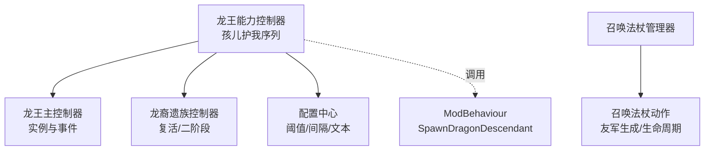
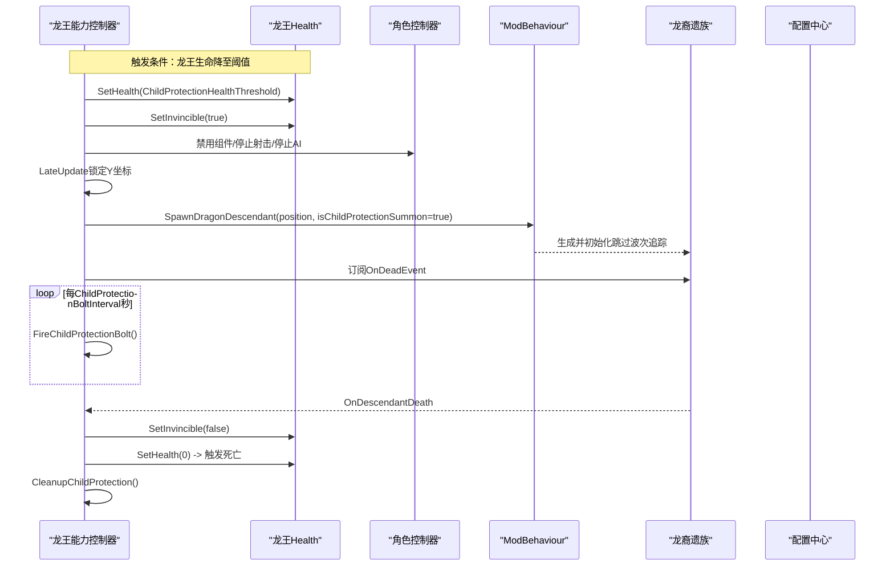
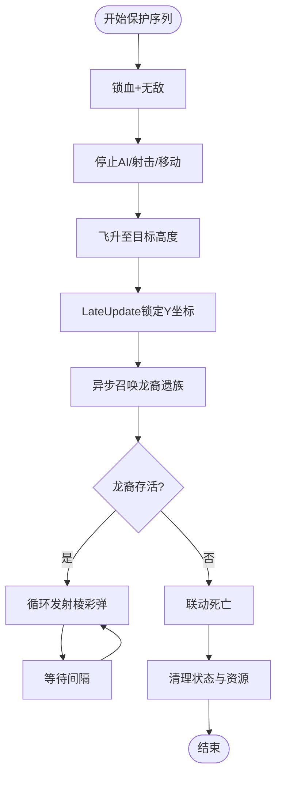
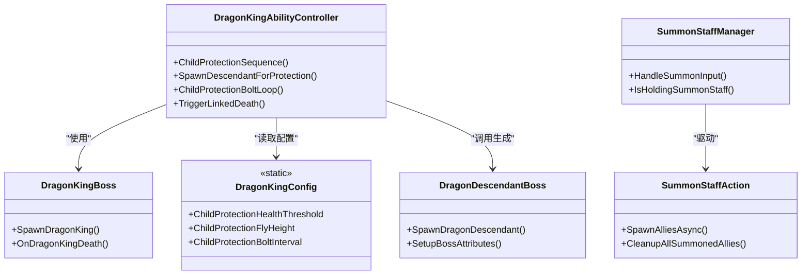

# 孩儿护我召唤系统

<cite>
**本文引用的文件**
- [DragonKingAbilityController_ChildProtection.cs](file://Integration/DragonKing/DragonKingAbilityController_ChildProtection.cs)
- [DragonKingBoss.cs](file://Integration/DragonKing/DragonKingBoss.cs)
- [DragonKingConfig.cs](file://Integration/DragonKing/DragonKingConfig.cs)
- [DragonDescendantBoss.cs](file://Integration/DragonDescendant/DragonDescendantBoss.cs)
- [DragonDescendantAbilities_ResurrectionAndPhase.cs](file://Integration/DragonDescendant/DragonDescendantAbilities_ResurrectionAndPhase.cs)
- [SummonStaffManager.cs](file://Integration/NewWeapons/SummonStaff/SummonStaffManager.cs)
- [SummonStaffAction.cs](file://Integration/NewWeapons/SummonStaff/SummonStaffAction.cs)
</cite>

## 目录
1. [简介](#简介)
2. [项目结构](#项目结构)
3. [核心组件](#核心组件)
4. [架构总览](#架构总览)
5. [详细组件分析](#详细组件分析)
6. [依赖关系分析](#依赖关系分析)
7. [性能与资源管理](#性能与资源管理)
8. [故障排查指南](#故障排查指南)
9. [结论](#结论)
10. [附录：配置项与调试工具](#附录：配置项与调试工具)

## 简介
本文件系统性说明“孩儿护我”召唤系统的触发条件、生成流程、行为控制、与主 Boss 的交互关系，以及资源管理与调试方法。该系统在龙王 Boss 生命值降至阈值时触发，通过无敌锁血、飞升、召唤龙裔遗族保护、周期性弹幕输出、联动死亡等机制，形成完整的三阶段保护流程；同时提供法杖右键“灵魂召唤”作为玩家侧辅助召唤能力。

## 项目结构
围绕“孩儿护我”的系统由以下关键模块组成：
- 龙王能力控制器（孩儿护我序列）：负责触发、锁血、飞升、召唤、循环弹幕、联动死亡与清理。
- 龙王主控制器：负责龙王实例生命周期、事件订阅、掉落与成就处理。
- 龙裔遗族控制器：负责复活、二阶段狂暴、冰减速、AI暂停/恢复等。
- 召唤法杖管理器与动作：负责玩家右键技能输入检测、冷却、友军生成与生命周期管理。
- 配置中心：集中定义血量阈值、飞行高度、间隔、对话文本等可调参数。

图示来源
- [DragonKingAbilityController_ChildProtection.cs:25-134](file://Integration/DragonKing/DragonKingAbilityController_ChildProtection.cs#L25-L134)
- [DragonKingBoss.cs:209-371](file://Integration/DragonKing/DragonKingBoss.cs#L209-L371)
- [DragonDescendantBoss.cs:56-235](file://Integration/DragonDescendant/DragonDescendantBoss.cs#L56-L235)
- [SummonStaffManager.cs:31-112](file://Integration/NewWeapons/SummonStaff/SummonStaffManager.cs#L31-L112)
- [SummonStaffAction.cs:102-196](file://Integration/NewWeapons/SummonStaff/SummonStaffAction.cs#L102-L196)

章节来源
- [DragonKingAbilityController_ChildProtection.cs:25-134](file://Integration/DragonKing/DragonKingAbilityController_ChildProtection.cs#L25-L134)
- [DragonKingBoss.cs:209-371](file://Integration/DragonKing/DragonKingBoss.cs#L209-L371)
- [DragonDescendantBoss.cs:56-235](file://Integration/DragonDescendant/DragonDescendantBoss.cs#L56-L235)
- [SummonStaffManager.cs:31-112](file://Integration/NewWeapons/SummonStaff/SummonStaffManager.cs#L31-L112)
- [SummonStaffAction.cs:102-196](file://Integration/NewWeapons/SummonStaff/SummonStaffAction.cs#L102-L196)

## 核心组件
- 龙王能力控制器（孩儿护我序列）
  - 职责：触发保护序列、锁血无敌、停止攻击与 AI、飞升高度、召唤龙裔、发射棱彩弹、联动死亡与清理。
  - 关键点：使用协程顺序执行；LateUpdate 锁定 Y 坐标；禁用移动与寻路；订阅龙裔死亡事件。
- 龙王主控制器
  - 职责：生成龙王、设置属性、装备套装、订阅死亡/掉落事件、多实例管理、场景退出清理。
- 龙裔遗族控制器
  - 职责：复活序列、二阶段狂暴、冰减速、AI 暂停/恢复、伤害倍率调整。
- 召唤法杖管理器与动作
  - 职责：检测右键 ADS 输入、校验持有武器、冷却检查、异步生成友军、设置 AI、定时销毁。
- 配置中心
  - 职责：集中维护阈值、飞行高度、速度、间隔、对话文本、掉落概率等。

章节来源
- [DragonKingAbilityController_ChildProtection.cs:25-134](file://Integration/DragonKing/DragonKingAbilityController_ChildProtection.cs#L25-L134)
- [DragonKingBoss.cs:209-371](file://Integration/DragonKing/DragonKingBoss.cs#L209-L371)
- [DragonDescendantAbilities_ResurrectionAndPhase.cs:132-181](file://Integration/DragonDescendant/DragonDescendantAbilities_ResurrectionAndPhase.cs#L132-L181)
- [SummonStaffManager.cs:31-112](file://Integration/NewWeapons/SummonStaff/SummonStaffManager.cs#L31-L112)
- [SummonStaffAction.cs:102-196](file://Integration/NewWeapons/SummonStaff/SummonStaffAction.cs#L102-L196)
- [DragonKingConfig.cs:673-733](file://Integration/DragonKing/DragonKingConfig.cs#L673-L733)

## 架构总览
下图展示“孩儿护我”从触发到联动死亡的完整时序，包括锁血、飞升、召唤、循环弹幕、死亡回调与清理。

图示来源
- [DragonKingAbilityController_ChildProtection.cs:25-134](file://Integration/DragonKing/DragonKingAbilityController_ChildProtection.cs#L25-L134)
- [DragonKingAbilityController_ChildProtection.cs:338-390](file://Integration/DragonKing/DragonKingAbilityController_ChildProtection.cs#L338-L390)
- [DragonKingAbilityController_ChildProtection.cs:446-466](file://Integration/DragonKing/DragonKingAbilityController_ChildProtection.cs#L446-L466)
- [DragonKingAbilityController_ChildProtection.cs:597-637](file://Integration/DragonKing/DragonKingAbilityController_ChildProtection.cs#L597-L637)
- [DragonDescendantBoss.cs:56-235](file://Integration/DragonDescendant/DragonDescendantBoss.cs#L56-L235)

## 详细组件分析

### 触发条件与多阶段逻辑
- 触发条件
  - 龙王生命值降至 ChildProtectionHealthThreshold（配置为极低值），进入保护序列。
  - 该阈值位于配置中心，便于调参与测试。
- 多阶段逻辑
  - 一阶段：常规战斗。
  - 二阶段：血量低于 Phase2HealthThreshold 时切换，提升攻击频率与强度。
  - 三阶段（孩儿护我）：当血量降至阈值时，进入保护序列，召唤龙裔遗族进行保护，龙裔死亡后龙王联动死亡。

章节来源
- [DragonKingConfig.cs:71-91](file://Integration/DragonKing/DragonKingConfig.cs#L71-L91)
- [DragonKingConfig.cs:673-698](file://Integration/DragonKing/DragonKingConfig.cs#L673-L698)
- [DragonKingAbilityController_ChildProtection.cs:25-134](file://Integration/DragonKing/DragonKingAbilityController_ChildProtection.cs#L25-L134)

### 召唤过程实现
- 锁血与无敌
  - 将龙王血量设置为阈值并开启无敌，确保不被继续伤害。
- 停止行为
  - 禁用角色组件、停止自定义射击与攻击协程、停止太阳舞弹幕、清理特效、停止移动与寻路。
- 飞升与高度锁定
  - 飞升至 ChildProtectionFlyHeight，使用 LateUpdate 持续锁定 Y 坐标，避免下落。
- 召唤龙裔遗族
  - 通过 ModBehaviour.SpawnDragonDescendant 异步生成，传入 isChildProtectionSummon=true，使其不加入波次追踪系统，避免误触发下一波。
  - 降低龙裔属性（血量与伤害倍率按 ChildProtectionDescendantStatMultiplier 缩放）。
  - 显示龙裔对话气泡，订阅其死亡事件。
- 循环弹幕
  - 启动 ChildProtectionBoltLoop，每隔 ChildProtectionBoltInterval 秒发射一枚棱彩弹，目标为玩家位置。
- 联动死亡
  - 龙裔死亡回调触发 TriggerLinkedDeath：移除无敌、传送回起飞前位置、设置血量为 0 并造成伤害以触发死亡事件。
- 清理
  - 取消订阅、停止协程、销毁平台与云雾特效、恢复移动系统与寻路、重置状态。

图示来源
- [DragonKingAbilityController_ChildProtection.cs:25-134](file://Integration/DragonKing/DragonKingAbilityController_ChildProtection.cs#L25-L134)
- [DragonKingAbilityController_ChildProtection.cs:338-390](file://Integration/DragonKing/DragonKingAbilityController_ChildProtection.cs#L338-L390)
- [DragonKingAbilityController_ChildProtection.cs:446-466](file://Integration/DragonKing/DragonKingAbilityController_ChildProtection.cs#L446-L466)
- [DragonKingAbilityController_ChildProtection.cs:597-693](file://Integration/DragonKing/DragonKingAbilityController_ChildProtection.cs#L597-L693)

章节来源
- [DragonKingAbilityController_ChildProtection.cs:25-134](file://Integration/DragonKing/DragonKingAbilityController_ChildProtection.cs#L25-L134)
- [DragonKingAbilityController_ChildProtection.cs:338-390](file://Integration/DragonKing/DragonKingAbilityController_ChildProtection.cs#L338-L390)
- [DragonKingAbilityController_ChildProtection.cs:446-466](file://Integration/DragonKing/DragonKingAbilityController_ChildProtection.cs#L446-L466)
- [DragonKingAbilityController_ChildProtection.cs:597-693](file://Integration/DragonKing/DragonKingAbilityController_ChildProtection.cs#L597-L693)

### 召唤物行为控制
- AI 行为限制
  - 龙王在保护阶段完全禁用移动与寻路，确保仅执行保护序列。
- 攻击目标选择
  - 棱彩弹以玩家当前位置为目标方向发射，使用统一追踪机制。
- 持续时间管理
  - 循环弹幕按配置间隔持续至保护阶段结束；龙裔遗族死亡即触发联动死亡。
- 独立性与波次隔离
  - 孩儿护我召唤的龙裔不加入波次追踪系统，避免死亡影响后续波次计数。

章节来源
- [DragonKingAbilityController_ChildProtection.cs:82-124](file://Integration/DragonKing/DragonKingAbilityController_ChildProtection.cs#L82-L124)
- [DragonKingAbilityController_ChildProtection.cs:446-466](file://Integration/DragonKing/DragonKingAbilityController_ChildProtection.cs#L446-L466)
- [DragonDescendantBoss.cs:109-124](file://Integration/DragonDescendant/DragonDescendantBoss.cs#L109-L124)

### 与主 Boss 的交互关系
- 保护机制
  - 龙王在保护阶段无敌且锁血，龙裔承担主要威胁。
- 协同攻击
  - 龙王在保护阶段周期性发射棱彩弹，对玩家施加压力。
- 死亡事件处理
  - 龙裔死亡回调触发龙王联动死亡；龙王死亡后清理所有相关资源与事件。

章节来源
- [DragonKingAbilityController_ChildProtection.cs:338-390](file://Integration/DragonKing/DragonKingAbilityController_ChildProtection.cs#L338-L390)
- [DragonKingAbilityController_ChildProtection.cs:597-637](file://Integration/DragonKing/DragonKingAbilityController_ChildProtection.cs#L597-L637)
- [DragonKingBoss.cs:559-634](file://Integration/DragonKing/DragonKingBoss.cs#L559-L634)

### 玩家侧召唤能力（召唤法杖）
- 输入检测与冷却
  - 管理器监听右键 ADS 输入，校验持有召唤法杖，检查技能剩余冷却时间。
- 友军生成
  - 动作类异步生成指定数量的友军，设置队伍、AI、健康值，添加生命周期组件到期销毁。
- 场景与状态安全
  - 生成过程中校验请求有效性、场景一致性、玩家存活状态，异常时销毁临时对象。

章节来源
- [SummonStaffManager.cs:31-112](file://Integration/NewWeapons/SummonStaff/SummonStaffManager.cs#L31-L112)
- [SummonStaffAction.cs:102-196](file://Integration/NewWeapons/SummonStaff/SummonStaffAction.cs#L102-L196)
- [SummonStaffAction.cs:362-384](file://Integration/NewWeapons/SummonStaff/SummonStaffAction.cs#L362-L384)

## 依赖关系分析
- 龙王能力控制器依赖：
  - 龙王 Health 与 CharacterMainControl（锁血、无敌、移动控制）。
  - ModBehaviour（调用 SpawnDragonDescendant）。
  - 配置中心（阈值、间隔、对话文本等）。
- 龙裔遗族控制器依赖：
  - AICharacterController（暂停/恢复）、Health（复活、无敌、血量恢复）。
- 召唤法杖管理器依赖：
  - 输入系统（ADS）、ItemStatsSystem（武器类型识别）、CharacterRandomPreset（生成友军）。

图示来源
- [DragonKingAbilityController_ChildProtection.cs:25-134](file://Integration/DragonKing/DragonKingAbilityController_ChildProtection.cs#L25-L134)
- [DragonKingBoss.cs:209-371](file://Integration/DragonKing/DragonKingBoss.cs#L209-L371)
- [DragonDescendantBoss.cs:56-235](file://Integration/DragonDescendant/DragonDescendantBoss.cs#L56-L235)
- [SummonStaffManager.cs:31-112](file://Integration/NewWeapons/SummonStaff/SummonStaffManager.cs#L31-L112)
- [SummonStaffAction.cs:102-196](file://Integration/NewWeapons/SummonStaff/SummonStaffAction.cs#L102-L196)
- [DragonKingConfig.cs:673-733](file://Integration/DragonKing/DragonKingConfig.cs#L673-L733)

章节来源
- [DragonKingAbilityController_ChildProtection.cs:25-134](file://Integration/DragonKing/DragonKingAbilityController_ChildProtection.cs#L25-L134)
- [DragonKingBoss.cs:209-371](file://Integration/DragonKing/DragonKingBoss.cs#L209-L371)
- [DragonDescendantBoss.cs:56-235](file://Integration/DragonDescendant/DragonDescendantBoss.cs#L56-L235)
- [SummonStaffManager.cs:31-112](file://Integration/NewWeapons/SummonStaff/SummonStaffManager.cs#L31-L112)
- [SummonStaffAction.cs:102-196](file://Integration/NewWeapons/SummonStaff/SummonStaffAction.cs#L102-L196)
- [DragonKingConfig.cs:673-733](file://Integration/DragonKing/DragonKingConfig.cs#L673-L733)

## 性能与资源管理
- 对象池与复用
  - 棱彩弹与特效通过共享资源管理器获取与注册追踪，减少频繁分配。
- 内存优化
  - 使用静态缓存（预设、物品、武器配置、Buff处理器）避免重复查找；场景切换时清理静态缓存。
- 场景清理机制
  - 离开竞技场或 Boss 死亡时，注销事件、销毁平台与云雾特效、恢复移动与寻路、清空实例字典与委托引用。
- 协程与计时
  - 使用 WaitForSeconds 与协程控制循环与延时，避免帧级高频分配；在保护阶段结束时统一停止协程。

章节来源
- [DragonKingBoss.cs:77-110](file://Integration/DragonKing/DragonKingBoss.cs#L77-L110)
- [DragonKingAbilityController_ChildProtection.cs:238-336](file://Integration/DragonKing/DragonKingAbilityController_ChildProtection.cs#L238-L336)
- [DragonKingAbilityController_ChildProtection.cs:639-693](file://Integration/DragonKing/DragonKingAbilityController_ChildProtection.cs#L639-L693)

## 故障排查指南
- 常见问题
  - 未触发保护序列：检查龙王生命值是否达到阈值，确认 ChildProtectionHealthThreshold 配置正确。
  - 龙裔未生成：查看 SpawnDragonDescendant 返回值与日志，确认预设可用与场景索引有效。
  - 联动死亡未触发：确认已订阅龙裔死亡事件，且在回调中执行了 TriggerLinkedDeath。
  - 移动未恢复：检查 CleanupChildProtection 是否执行，确保 MovementEnabled 与 Seeker 状态恢复。
- 定位方法
  - 启用开发日志，关注 “[DragonKing]” 与 “[DragonDescendant]” 标签输出。
  - 使用调试模式（DebugMode）与 DebugAttackType 快速复现特定技能。
  - 检查配置项：ChildProtectionFlyHeight、ChildProtectionBoltInterval、DialogueDuration 等。

章节来源
- [DragonKingAbilityController_ChildProtection.cs:25-134](file://Integration/DragonKing/DragonKingAbilityController_ChildProtection.cs#L25-L134)
- [DragonKingAbilityController_ChildProtection.cs:597-693](file://Integration/DragonKing/DragonKingAbilityController_ChildProtection.cs#L597-L693)
- [DragonKingConfig.cs:32-43](file://Integration/DragonKing/DragonKingConfig.cs#L32-L43)
- [DragonKingConfig.cs:673-733](file://Integration/DragonKing/DragonKingConfig.cs#L673-L733)

## 结论
“孩儿护我”召唤系统通过严格的触发条件、清晰的阶段转换、独立的波次隔离与完善的资源清理，实现了高可控性与稳定性。龙王在保护阶段通过无敌锁血与循环弹幕维持压力，龙裔遗族承担保护职责并在死亡后触发联动死亡，确保流程闭环。玩家侧召唤法杖提供额外战术支持，增强战斗多样性。

## 附录：配置项与调试工具
- 关键配置项
  - 触发阈值：ChildProtectionHealthThreshold
  - 飞行高度：ChildProtectionFlyHeight
  - 飞行速度：ChildProtectionFlySpeed
  - 龙裔属性倍率：ChildProtectionDescendantStatMultiplier
  - 弹幕间隔：ChildProtectionBoltInterval
  - 对话时长：DialogueDuration
  - 对话偏移：DialogueBubbleYOffset
- 调试工具
  - 调试模式：DebugMode 与 DebugAttackType 用于快速复现技能。
  - 日志输出：关注 “[DragonKing]”、“[DragonDescendant]” 标签，定位生成、订阅、回调与清理过程。
  - 配置修改：调整上述常量以验证不同难度与体验。

章节来源
- [DragonKingConfig.cs:32-43](file://Integration/DragonKing/DragonKingConfig.cs#L32-L43)
- [DragonKingConfig.cs:673-733](file://Integration/DragonKing/DragonKingConfig.cs#L673-L733)