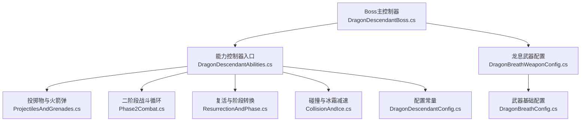
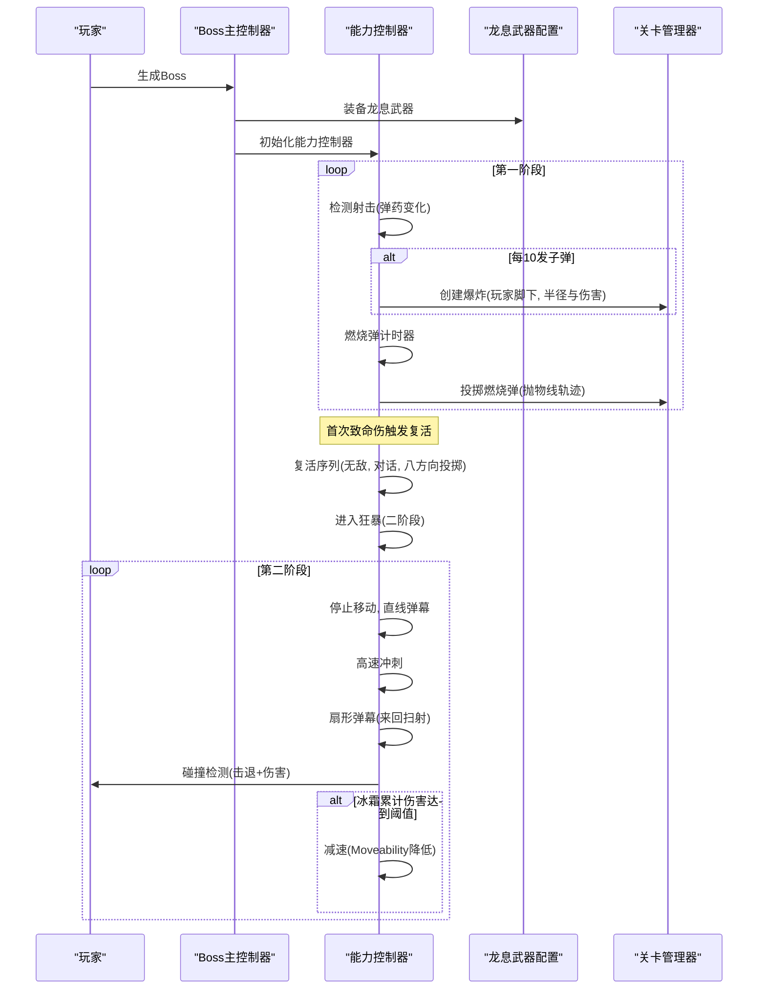
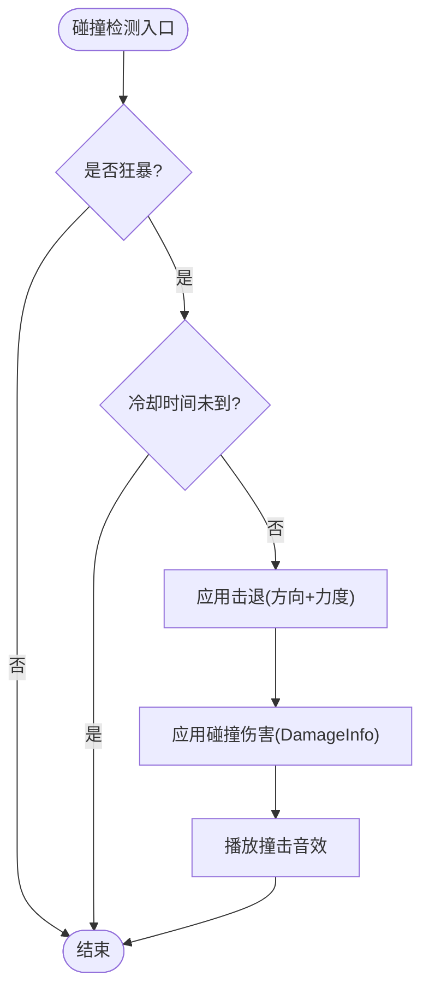
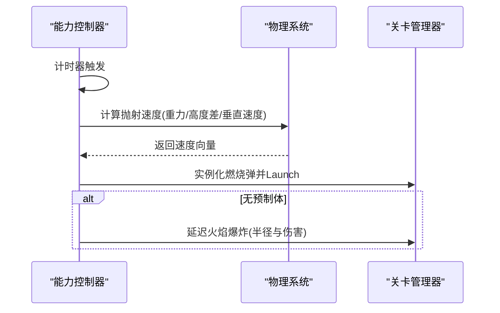
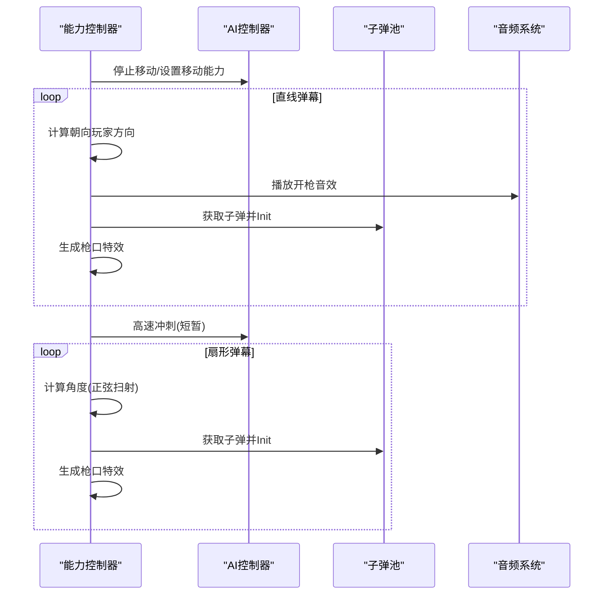
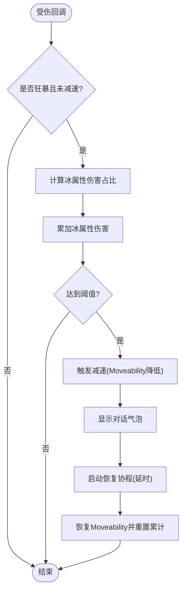
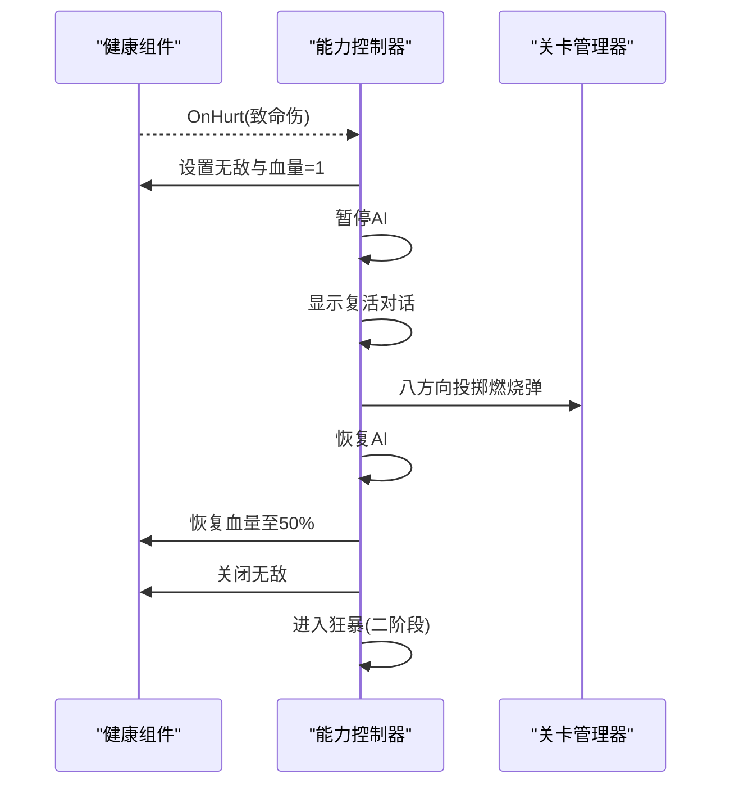
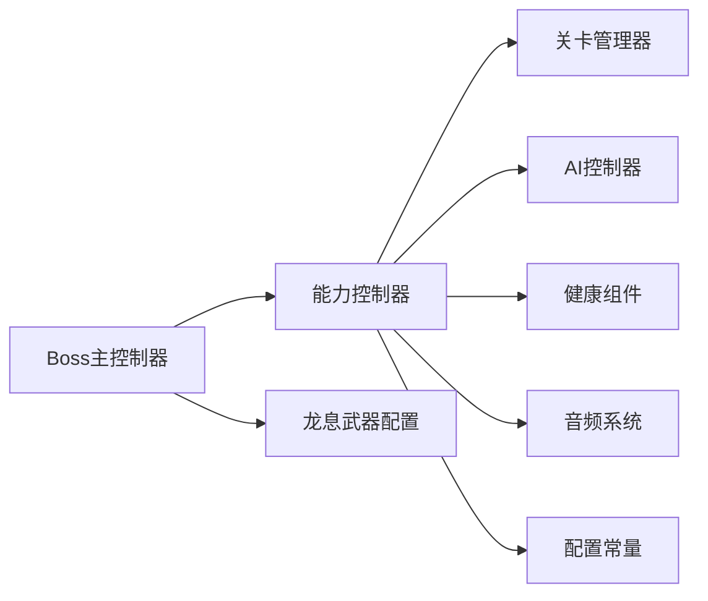

# 战斗机制与技能实现

<cite>
**本文引用的文件**
- [DragonDescendantBoss.cs](file://Integration/DragonDescendant/DragonDescendantBoss.cs)
- [DragonDescendantAbilities.cs](file://Integration/DragonDescendant/DragonDescendantAbilities.cs)
- [DragonDescendantAbilities_ProjectilesAndGrenades.cs](file://Integration/DragonDescendant/DragonDescendantAbilities_ProjectilesAndGrenades.cs)
- [DragonDescendantAbilities_Phase2Combat.cs](file://Integration/DragonDescendant/DragonDescendantAbilities_Phase2Combat.cs)
- [DragonDescendantAbilities_ResurrectionAndPhase.cs](file://Integration/DragonDescendant/DragonDescendantAbilities_ResurrectionAndPhase.cs)
- [DragonDescendantAbilities_CollisionAndIce.cs](file://Integration/DragonDescendant/DragonDescendantAbilities_CollisionAndIce.cs)
- [DragonDescendantConfig.cs](file://Integration/DragonDescendant/DragonDescendantConfig.cs)
- [DragonBreathWeaponConfig.cs](file://Integration/DragonDescendant/DragonBreathWeaponConfig.cs)
- [DragonBreathConfig.cs](file://Integration/DragonDescendant/DragonBreathConfig.cs)
</cite>

## 目录
1. [简介](#简介)
2. [项目结构](#项目结构)
3. [核心组件](#核心组件)
4. [架构总览](#架构总览)
5. [详细组件分析](#详细组件分析)
6. [依赖关系分析](#依赖关系分析)
7. [性能考量](#性能考量)
8. [故障排查指南](#故障排查指南)
9. [结论](#结论)
10. [附录](#附录)

## 简介
本文件聚焦“龙裔遗族”Boss的战斗机制与技能实现，覆盖以下关键主题：
- 第一阶段近战攻击系统：范围检测、伤害计算、动画/行为同步
- 投掷物系统：爆炸弹生成逻辑、轨迹计算、爆炸效果触发
- 第二阶段远程射击机制：瞄准算法、弹幕模式、射击间隔控制
- 碰撞检测与冰霜效果：障碍物检测（通过AI与距离限制）、冰冻状态施加、视觉效果渲染
- 复活与阶段转换：生命值阈值检测、阶段切换动画、技能组动态加载
- 战斗平衡性：难度曲线设计、玩家体验优化、性能监控指标
- 战斗策略建议与Boss弱点分析

## 项目结构
龙裔遗族的战斗逻辑由多个部分类文件组成，职责清晰分离：
- Boss主控制器：负责生成、装备、生命周期管理
- 能力控制器：统一调度所有技能（近战、投掷物、二阶段射击、复活、碰撞、冰霜）
- 配置：集中定义数值、行为参数、掉落等
- 武器配置：为Boss专属武器设置属性、特效、音效

图表来源
- [DragonDescendantBoss.cs:61-165](file://Integration/DragonDescendant/DragonDescendantBoss.cs#L61-L165)
- [DragonDescendantAbilities.cs:231-279](file://Integration/DragonDescendant/DragonDescendantAbilities.cs#L231-L279)
- [DragonDescendantAbilities_ProjectilesAndGrenades.cs:21-84](file://Integration/DragonDescendant/DragonDescendantAbilities_ProjectilesAndGrenades.cs#L21-L84)
- [DragonDescendantAbilities_Phase2Combat.cs:22-125](file://Integration/DragonDescendant/DragonDescendantAbilities_Phase2Combat.cs#L22-L125)
- [DragonDescendantAbilities_ResurrectionAndPhase.cs:132-181](file://Integration/DragonDescendant/DragonDescendantAbilities_ResurrectionAndPhase.cs#L132-L181)
- [DragonDescendantAbilities_CollisionAndIce.cs:21-43](file://Integration/DragonDescendant/DragonDescendantAbilities_CollisionAndIce.cs#L21-L43)
- [DragonBreathWeaponConfig.cs:165-186](file://Integration/DragonDescendant/DragonBreathWeaponConfig.cs#L165-L186)
- [DragonBreathConfig.cs:13-65](file://Integration/DragonDescendant/DragonBreathConfig.cs#L13-L65)

章节来源
- [DragonDescendantBoss.cs:61-165](file://Integration/DragonDescendant/DragonDescendantBoss.cs#L61-L165)
- [DragonDescendantAbilities.cs:231-279](file://Integration/DragonDescendant/DragonDescendantAbilities.cs#L231-L279)

## 核心组件
- Boss主控制器：负责生成Boss、装备龙套装与龙息武器、订阅死亡事件、注册掉落追踪、位置校验与恢复锚点。
- 能力控制器：统一管理射击检测、投掷物计时器、二阶段追逐与弹幕、复活序列、碰撞检测与冰霜减速。
- 配置：集中定义血量、伤害倍率、投掷间隔、复活阈值、狂暴参数、掉落概率等。
- 武器配置：为龙息武器设置口径、耐久、属性、槽位标签、枪口特效、子弹预制体与音效。

章节来源
- [DragonDescendantBoss.cs:56-165](file://Integration/DragonDescendant/DragonDescendantBoss.cs#L56-L165)
- [DragonDescendantAbilities.cs:231-279](file://Integration/DragonDescendant/DragonDescendantAbilities.cs#L231-L279)
- [DragonDescendantConfig.cs:13-232](file://Integration/DragonDescendant/DragonDescendantConfig.cs#L13-L232)
- [DragonBreathWeaponConfig.cs:165-186](file://Integration/DragonDescendant/DragonBreathWeaponConfig.cs#L165-L186)

## 架构总览
龙裔遗族的战斗流程分为两个阶段：
- 第一阶段：常规射击+每10发子弹触发一次小范围爆炸；定时向玩家脚下投掷燃烧弹；低伤害倍率便于学习模式。
- 第二阶段：首次致命伤后触发复活，恢复至50%血量并进入狂暴；停止自身射击，改为直接生成子弹的直线与扇形弹幕；高速冲刺与碰撞击退；可被冰霜累计伤害减速。

图表来源
- [DragonDescendantBoss.cs:61-165](file://Integration/DragonDescendant/DragonDescendantBoss.cs#L61-L165)
- [DragonDescendantAbilities_ProjectilesAndGrenades.cs:21-84](file://Integration/DragonDescendant/DragonDescendantAbilities_ProjectilesAndGrenades.cs#L21-L84)
- [DragonDescendantAbilities_Phase2Combat.cs:22-125](file://Integration/DragonDescendant/DragonDescendantAbilities_Phase2Combat.cs#L22-L125)
- [DragonDescendantAbilities_ResurrectionAndPhase.cs:132-181](file://Integration/DragonDescendant/DragonDescendantAbilities_ResurrectionAndPhase.cs#L132-L181)
- [DragonDescendantAbilities_CollisionAndIce.cs:21-43](file://Integration/DragonDescendant/DragonDescendantAbilities_CollisionAndIce.cs#L21-L43)

## 详细组件分析

### 第一阶段近战攻击系统
- 范围检测：通过球形触发器（SphereCollider）在Boss周围建立碰撞区域，配合独立检测器组件以协程方式周期性检查，避免OnTriggerStay带来的物理帧开销。
- 伤害计算：使用原版DamageInfo与mainDamageReceiver或Health.Hurt进行伤害应用；击退方向从Boss指向玩家，Y分量略微向上，力值由配置决定。
- 动画/行为同步：在复活期间暂停AI行动，确保对话期间Boss不动；进入狂暴时收起武器并停止自身射击输入，保证行为与视觉一致。

图表来源
- [DragonDescendantAbilities_CollisionAndIce.cs:21-43](file://Integration/DragonDescendant/DragonDescendantAbilities_CollisionAndIce.cs#L21-L43)
- [DragonDescendantAbilities_CollisionAndIce.cs:123-166](file://Integration/DragonDescendant/DragonDescendantAbilities_CollisionAndIce.cs#L123-L166)
- [DragonDescendantAbilities_CollisionAndIce.cs:172-216](file://Integration/DragonDescendant/DragonDescendantAbilities_CollisionAndIce.cs#L172-L216)

章节来源
- [DragonDescendantAbilities_CollisionAndIce.cs:21-43](file://Integration/DragonDescendant/DragonDescendantAbilities_CollisionAndIce.cs#L21-L43)
- [DragonDescendantAbilities_CollisionAndIce.cs:123-166](file://Integration/DragonDescendant/DragonDescendantAbilities_CollisionAndIce.cs#L123-L166)
- [DragonDescendantAbilities_CollisionAndIce.cs:172-216](file://Integration/DragonDescendant/DragonDescendantAbilities_CollisionAndIce.cs#L172-L216)

### 投掷物系统（爆炸弹与燃烧弹）
- 爆炸弹（火箭弹）：每10发子弹触发一次，若玩家在Boss附近（小于配置半径），则在玩家脚下创建爆炸，附带火元素伤害与范围。
- 燃烧弹：定时投掷，始终投向玩家脚下；使用抛物线轨迹计算速度，基于重力与垂直速度估算飞行时间；若无可用预制体则延迟火焰爆炸作为后备。
- 轨迹计算：根据起点与终点高度差、重力加速度与垂直初速度，解算水平速度与总飞行时间，得到最终抛射速度向量。

图表来源
- [DragonDescendantAbilities_ProjectilesAndGrenades.cs:93-134](file://Integration/DragonDescendant/DragonDescendantAbilities_ProjectilesAndGrenades.cs#L93-L134)
- [DragonDescendantAbilities_ProjectilesAndGrenades.cs:174-242](file://Integration/DragonDescendant/DragonDescendantAbilities_ProjectilesAndGrenades.cs#L174-L242)
- [DragonDescendantAbilities_ProjectilesAndGrenades.cs:248-271](file://Integration/DragonDescendant/DragonDescendantAbilities_ProjectilesAndGrenades.cs#L248-L271)

章节来源
- [DragonDescendantAbilities_ProjectilesAndGrenades.cs:21-84](file://Integration/DragonDescendant/DragonDescendantAbilities_ProjectilesAndGrenades.cs#L21-L84)
- [DragonDescendantAbilities_ProjectilesAndGrenades.cs:93-134](file://Integration/DragonDescendant/DragonDescendantAbilities_ProjectilesAndGrenades.cs#L93-L134)
- [DragonDescendantAbilities_ProjectilesAndGrenades.cs:174-242](file://Integration/DragonDescendant/DragonDescendantAbilities_ProjectilesAndGrenades.cs#L174-L242)

### 第二阶段远程射击机制
- 瞄准算法：实时获取Boss到玩家的水平方向，用于直线与扇形弹幕的基础方向；扇形角度通过正弦函数实现来回扫射，提供躲避空间。
- 弹幕模式：
  - 直线弹幕：停止移动，朝玩家方向连续发射固定数量子弹，间隔可控。
  - 扇形弹幕：持续数秒内发射多发光属性子弹，角度在负半角到正半角之间来回变化。
- 射击间隔控制：使用缓存的WaitForSeconds对象减少GC；通过协程精确控制持续时间与发射节奏。
- 子弹生成：优先使用原始武器数据（子弹预制体、射速、射程、伤害、音效、枪口特效），回退到预缓存子弹；通过BulletPool获取并初始化ProjectileContext。

图表来源
- [DragonDescendantAbilities_Phase2Combat.cs:22-125](file://Integration/DragonDescendant/DragonDescendantAbilities_Phase2Combat.cs#L22-L125)
- [DragonDescendantAbilities_Phase2Combat.cs:189-268](file://Integration/DragonDescendant/DragonDescendantAbilities_Phase2Combat.cs#L189-L268)
- [DragonDescendantAbilities_Phase2Combat.cs:275-368](file://Integration/DragonDescendant/DragonDescendantAbilities_Phase2Combat.cs#L275-L368)
- [DragonDescendantAbilities_Phase2Combat.cs:373-463](file://Integration/DragonDescendant/DragonDescendantAbilities_Phase2Combat.cs#L373-L463)

章节来源
- [DragonDescendantAbilities_Phase2Combat.cs:22-125](file://Integration/DragonDescendant/DragonDescendantAbilities_Phase2Combat.cs#L22-L125)
- [DragonDescendantAbilities_Phase2Combat.cs:189-268](file://Integration/DragonDescendant/DragonDescendantAbilities_Phase2Combat.cs#L189-L268)
- [DragonDescendantAbilities_Phase2Combat.cs:275-368](file://Integration/DragonDescendant/DragonDescendantAbilities_Phase2Combat.cs#L275-L368)

### 碰撞检测与冰霜效果系统
- 碰撞检测：球形触发器+检测器组件，使用协程周期检查而非OnTriggerStay以降低开销；支持Mode E阵营感知与脱战距离限制。
- 冰冻状态施加：在狂暴状态下累计冰属性伤害，当累计值达到最大血量的比例阈值时触发减速；将Moveability降低至较低值，显示对话气泡提示，并在一段时间后恢复。
- 视觉效果渲染：通过对话气泡与自定义音效增强反馈；枪口特效与爆炸效果由关卡管理器与预制体驱动。

图表来源
- [DragonDescendantAbilities_ResurrectionAndPhase.cs:75-126](file://Integration/DragonDescendant/DragonDescendantAbilities_ResurrectionAndPhase.cs#L75-L126)
- [DragonDescendantAbilities_CollisionAndIce.cs:223-313](file://Integration/DragonDescendant/DragonDescendantAbilities_CollisionAndIce.cs#L223-L313)

章节来源
- [DragonDescendantAbilities_ResurrectionAndPhase.cs:75-126](file://Integration/DragonDescendant/DragonDescendantAbilities_ResurrectionAndPhase.cs#L75-L126)
- [DragonDescendantAbilities_CollisionAndIce.cs:223-313](file://Integration/DragonDescendant/DragonDescendantAbilities_CollisionAndIce.cs#L223-L313)

### 复活与阶段转换机制
- 生命值阈值检测：首次致命伤时锁定血量为1并进入复活序列；通过健康组件的无敌状态与手动血量保护双重保障。
- 阶段切换动画：显示两段对话气泡（悬念与完整台词），随后向八个方向投掷燃烧弹，恢复血量至50%，关闭无敌并播放第二阶段音效。
- 技能组动态加载：进入狂暴后应用二阶段伤害倍率、收起武器、扩大发光范围、设置碰撞检测、启动追逐协程与弹幕循环。

图表来源
- [DragonDescendantAbilities_ResurrectionAndPhase.cs:132-181](file://Integration/DragonDescendant/DragonDescendantAbilities_ResurrectionAndPhase.cs#L132-L181)
- [DragonDescendantAbilities_ResurrectionAndPhase.cs:221-267](file://Integration/DragonDescendant/DragonDescendantAbilities_ResurrectionAndPhase.cs#L221-L267)
- [DragonDescendantAbilities_ResurrectionAndPhase.cs:334-367](file://Integration/DragonDescendant/DragonDescendantAbilities_ResurrectionAndPhase.cs#L334-L367)

章节来源
- [DragonDescendantAbilities_ResurrectionAndPhase.cs:132-181](file://Integration/DragonDescendant/DragonDescendantAbilities_ResurrectionAndPhase.cs#L132-L181)
- [DragonDescendantAbilities_ResurrectionAndPhase.cs:221-267](file://Integration/DragonDescendant/DragonDescendantAbilities_ResurrectionAndPhase.cs#L221-L267)
- [DragonDescendantAbilities_ResurrectionAndPhase.cs:334-367](file://Integration/DragonDescendant/DragonDescendantAbilities_ResurrectionAndPhase.cs#L334-L367)

### 概念总览
- 难度曲线：第一阶段低伤害倍率便于熟悉机制；第二阶段提升伤害倍率与弹幕密度，增加压力。
- 玩家体验：提供躲避空间（扇形弹幕来回扫射）、明确提示（对话气泡）、合理冷却（碰撞与投掷间隔）。
- 性能监控：大量使用静态缓存、WaitForSeconds复用、反射方法缓存、BulletPool与ExplosionManager调用，减少运行时分配与查找开销。

[本节为概念性内容，不直接分析具体文件]

## 依赖关系分析
- Boss主控制器依赖能力控制器与武器配置，完成生成、装备与生命周期管理。
- 能力控制器依赖关卡管理器（爆炸、子弹池）、AI控制器（移动与目标）、健康组件（伤害与无敌）、音频系统（音效）。
- 配置模块为各子系统提供统一参数，便于调参与平衡。

图表来源
- [DragonDescendantBoss.cs:61-165](file://Integration/DragonDescendant/DragonDescendantBoss.cs#L61-L165)
- [DragonDescendantAbilities.cs:231-279](file://Integration/DragonDescendant/DragonDescendantAbilities.cs#L231-L279)
- [DragonDescendantAbilities_Phase2Combat.cs:275-368](file://Integration/DragonDescendant/DragonDescendantAbilities_Phase2Combat.cs#L275-L368)
- [DragonDescendantConfig.cs:13-232](file://Integration/DragonDescendant/DragonDescendantConfig.cs#L13-L232)

章节来源
- [DragonDescendantBoss.cs:61-165](file://Integration/DragonDescendant/DragonDescendantBoss.cs#L61-L165)
- [DragonDescendantAbilities.cs:231-279](file://Integration/DragonDescendant/DragonDescendantAbilities.cs#L231-L279)

## 性能考量
- 静态缓存：预设、物品、武器配置、AudioManager反射方法等均在启动或首次使用时缓存，避免重复查找。
- 协程与定时器：使用缓存的WaitForSeconds对象，减少GC分配；采用帧计数器降低Time.time比较开销。
- 物理与碰撞：用OnTriggerEnter+协程替代OnTriggerStay，降低每帧物理检测成本。
- 资源复用：通过BulletPool与ExplosionManager生成子弹与爆炸，避免频繁实例化。
- 日志与调试：仅在关键节点输出日志，避免高频字符串拼接造成性能抖动。

[本节为通用性能指导，不直接分析具体文件]

## 故障排查指南
- 生成失败：检查预设查找与装备流程，确认龙息武器与套装是否正确装配；查看日志中的错误堆栈。
- 投掷物异常：确认燃烧弹预制体缓存是否成功；若失败则走延迟火焰爆炸后备路径。
- 二阶段弹幕不生效：验证原始武器数据是否缓存成功；检查BulletPool可用性；确认音效与枪口特效路径。
- 复活无效：确认健康组件无敌状态与血量设置；检查对话气泡与八方向投掷是否执行。
- 冰霜减速不触发：检查冰属性伤害累计逻辑与阈值判断；确认Moveability修改与恢复协程。

章节来源
- [DragonDescendantBoss.cs:61-165](file://Integration/DragonDescendant/DragonDescendantBoss.cs#L61-L165)
- [DragonDescendantAbilities_ProjectilesAndGrenades.cs:93-134](file://Integration/DragonDescendant/DragonDescendantAbilities_ProjectilesAndGrenades.cs#L93-L134)
- [DragonDescendantAbilities_Phase2Combat.cs:275-368](file://Integration/DragonDescendant/DragonDescendantAbilities_Phase2Combat.cs#L275-L368)
- [DragonDescendantAbilities_ResurrectionAndPhase.cs:132-181](file://Integration/DragonDescendant/DragonDescendantAbilities_ResurrectionAndPhase.cs#L132-L181)
- [DragonDescendantAbilities_CollisionAndIce.cs:223-313](file://Integration/DragonDescendant/DragonDescendantAbilities_CollisionAndIce.cs#L223-L313)

## 结论
龙裔遗族的战斗机制通过清晰的模块化设计与完善的性能优化，实现了稳定的两阶段战斗体验：
- 第一阶段强调学习与规避，低伤害倍率与规律性攻击便于掌握。
- 第二阶段通过复活与狂暴提升挑战度，弹幕与碰撞组合形成高压环境。
- 冰霜减速提供反制手段，鼓励元素搭配与战术选择。
- 配置集中、日志完善、缓存充分，便于调参与维护。

[本节为总结性内容，不直接分析具体文件]

## 附录
- 战斗策略建议：
  - 保持安全距离以避免火箭弹爆炸与碰撞伤害。
  - 利用扇形弹幕的来回扫射寻找躲避窗口。
  - 在狂暴阶段使用冰属性伤害快速触发减速，打断其节奏。
- Boss弱点分析：
  - 冰属性累计伤害可有效限制其机动性。
  - 远离Boss可规避大部分爆炸与碰撞威胁。
  - 注意复活后的八方向投掷，避免站在原地拾取掉落。

[本节为策略与建议，不直接分析具体文件]