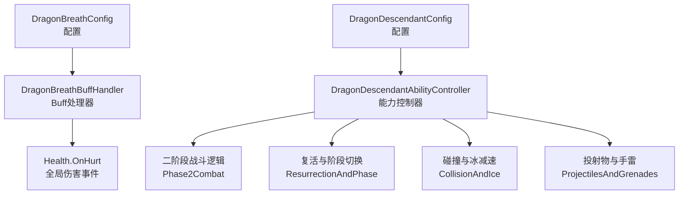
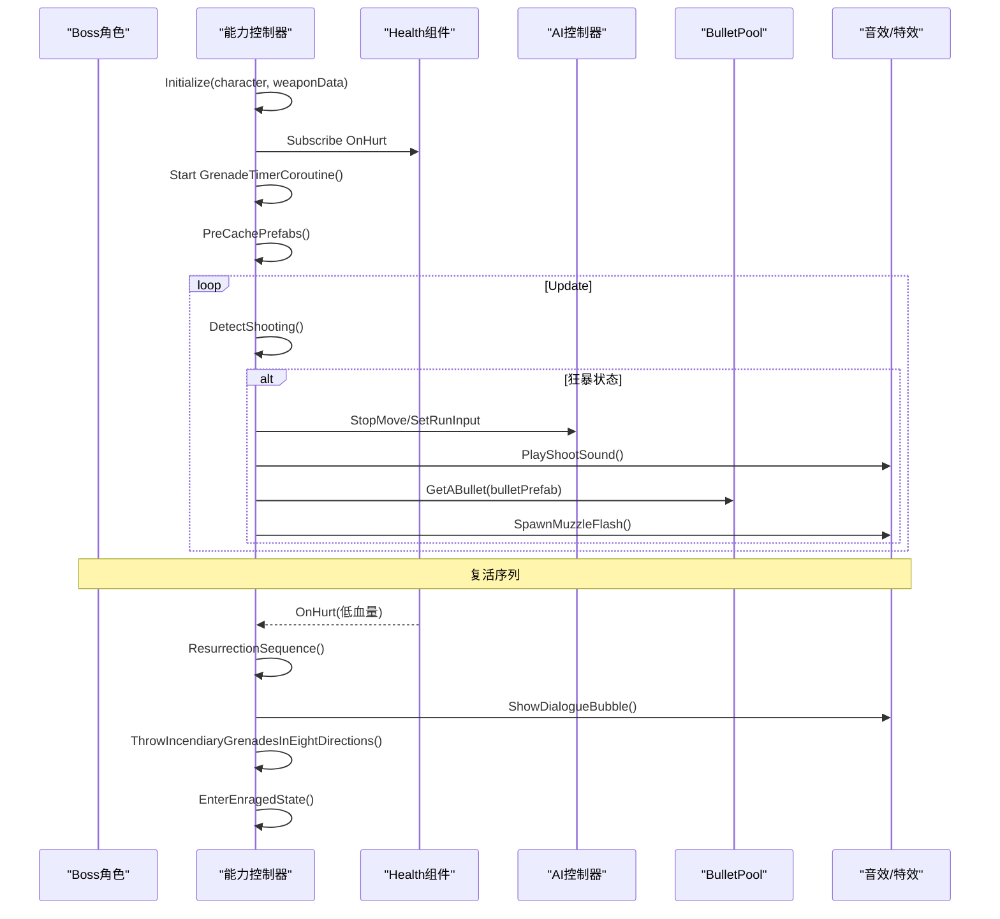
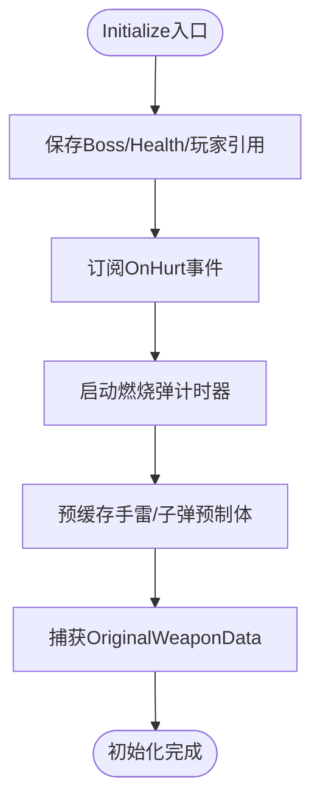
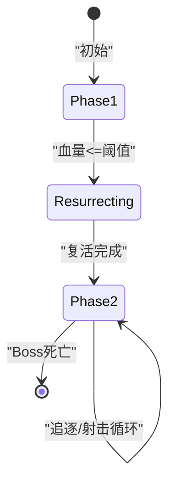
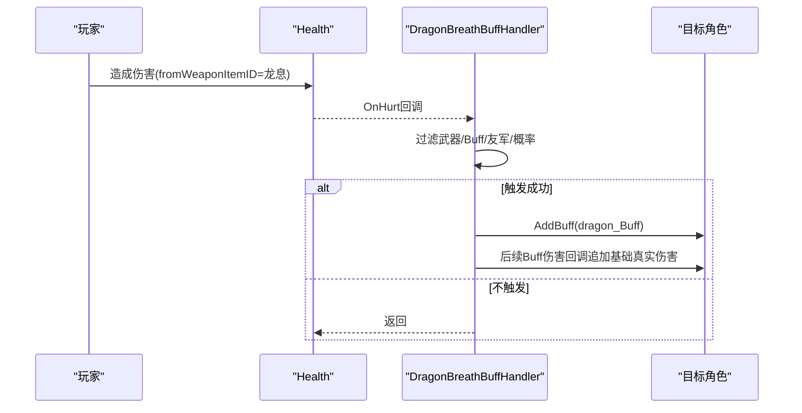
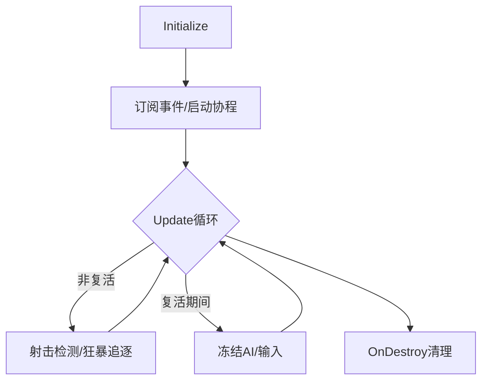
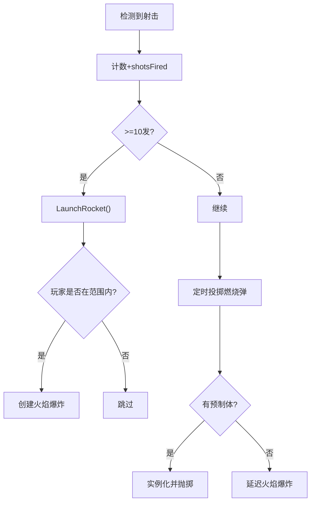
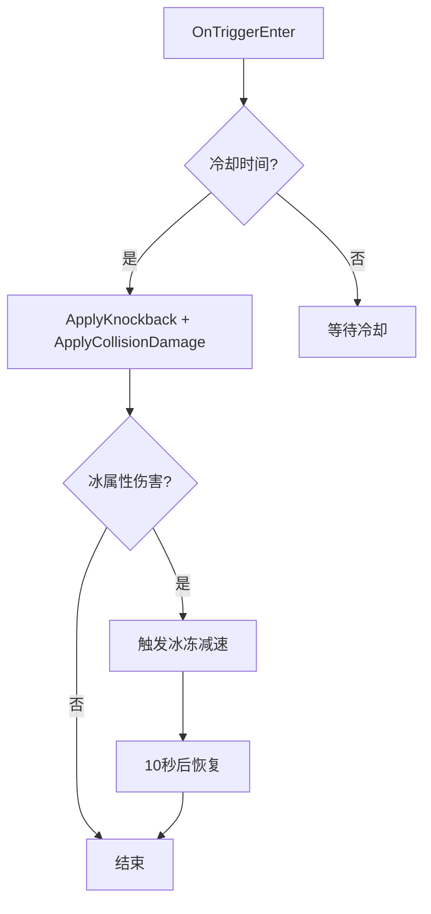
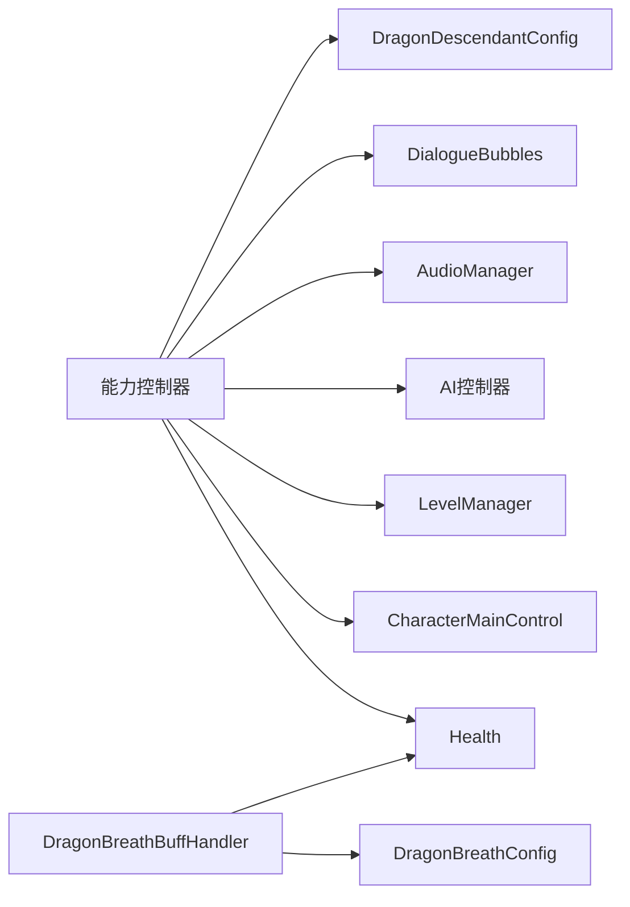

# 能力控制系统

<cite>
**本文引用的文件**
- [DragonDescendantAbilities.cs](file://Integration/DragonDescendant/DragonDescendantAbilities.cs)
- [DragonDescendantAbilities_Phase2Combat.cs](file://Integration/DragonDescendant/DragonDescendantAbilities_Phase2Combat.cs)
- [DragonDescendantAbilities_ResurrectionAndPhase.cs](file://Integration/DragonDescendant/DragonDescendantAbilities_ResurrectionAndPhase.cs)
- [DragonDescendantAbilities_CollisionAndIce.cs](file://Integration/DragonDescendant/DragonDescendantAbilities_CollisionAndIce.cs)
- [DragonDescendantAbilities_ProjectilesAndGrenades.cs](file://Integration/DragonDescendant/DragonDescendantAbilities_ProjectilesAndGrenades.cs)
- [DragonBreathBuffHandler.cs](file://Integration/DragonDescendant/DragonBreathBuffHandler.cs)
- [DragonBreathConfig.cs](file://Integration/DragonDescendant/DragonBreathConfig.cs)
- [DragonDescendantConfig.cs](file://Integration/DragonDescendant/DragonDescendantConfig.cs)
</cite>

## 目录
1. [简介](#简介)
2. [项目结构](#项目结构)
3. [核心组件](#核心组件)
4. [架构总览](#架构总览)
5. [详细组件分析](#详细组件分析)
6. [依赖关系分析](#依赖关系分析)
7. [性能考量](#性能考量)
8. [故障排除指南](#故障排除指南)
9. [结论](#结论)

## 简介
本文件面向“龙裔遗族”Boss的能力控制系统，聚焦于 DragonDescendantAbilityController 的核心架构与实现细节。文档将系统阐述：
- Initialize 方法的工作原理与原始武器数据捕获机制
- 两阶段战斗转换逻辑（阶段检测、状态切换、技能组切换）
- Buff 管理系统（DragonBreathBuffHandler 的火焰伤害免疫、添加与移除逻辑）
- 控制器生命周期管理（Awake/Update/OnDestroy 等职责）
- 性能优化策略（对象池、事件订阅、内存泄漏防护）
- 调试日志分析与故障排除

## 项目结构
该能力控制系统由多个分部类与配置组成，围绕 Boss 行为、攻击、复活、碰撞、冰减速、以及 Buff 触发处理器展开。关键文件职责如下：
- DragonDescendantAbilities.cs：能力控制器主体，包含初始化、预制体缓存、射击检测、生命周期清理
- DragonDescendantAbilities_Phase2Combat.cs：二阶段追逐与射击（直线子弹、扇形扫射）、音效播放、枪口特效
- DragonDescendantAbilities_ResurrectionAndPhase.cs：复活序列、狂暴状态进入、AI暂停/恢复、伤害倍率应用
- DragonDescendantAbilities_CollisionAndIce.cs：碰撞检测器、击退与伤害、冰属性减速机制
- DragonDescendantAbilities_ProjectilesAndGrenades.cs：火箭弹发射、燃烧弹投掷、延迟火焰爆炸后备
- DragonBreathBuffHandler.cs：龙息武器命中时触发 Buff、追加基础真实伤害、替换特效为原版点燃
- DragonBreathConfig.cs / DragonDescendantConfig.cs：常量配置（武器ID、Buff ID、概率、冷却、范围等）

图表来源
- [DragonDescendantAbilities.cs:23-279](file://Integration/DragonDescendant/DragonDescendantAbilities.cs#L23-L279)
- [DragonDescendantAbilities_Phase2Combat.cs:16-125](file://Integration/DragonDescendant/DragonDescendantAbilities_Phase2Combat.cs#L16-L125)
- [DragonDescendantAbilities_ResurrectionAndPhase.cs:18-181](file://Integration/DragonDescendant/DragonDescendantAbilities_ResurrectionAndPhase.cs#L18-L181)
- [DragonDescendantAbilities_CollisionAndIce.cs:18-313](file://Integration/DragonDescendant/DragonDescendantAbilities_CollisionAndIce.cs#L18-L313)
- [DragonDescendantAbilities_ProjectilesAndGrenades.cs:18-274](file://Integration/DragonDescendant/DragonDescendantAbilities_ProjectilesAndGrenades.cs#L18-L274)
- [DragonBreathBuffHandler.cs:26-166](file://Integration/DragonDescendant/DragonBreathBuffHandler.cs#L26-L166)
- [DragonBreathConfig.cs:10-67](file://Integration/DragonDescendant/DragonBreathConfig.cs#L10-L67)
- [DragonDescendantConfig.cs:10-234](file://Integration/DragonDescendant/DragonDescendantConfig.cs#L10-L234)

章节来源
- [DragonDescendantAbilities.cs:23-279](file://Integration/DragonDescendant/DragonDescendantAbilities.cs#L23-L279)
- [DragonDescendantConfig.cs:10-234](file://Integration/DragonDescendant/DragonDescendantConfig.cs#L10-L234)

## 核心组件
- 能力控制器（DragonDescendantAbilityController）：负责初始化、射击检测、状态机、协程调度、资源缓存、生命周期管理
- 二阶段战斗模块：追逐循环、直线/扇形子弹生成、移动性控制、音效与枪口特效
- 复活与阶段切换：血量阈值检测、无敌保护、对话气泡、八方向燃烧弹、伤害倍率应用、狂暴状态启动
- 碰撞与冰减速：触发器检测、击退与伤害、冰冻累计伤害与减速恢复
- 投射物与手雷：火箭弹触发条件、燃烧弹定时投掷、物理抛掷计算、火焰爆炸后备
- Buff 处理器：监听伤害事件、概率判定、添加 Buff、追加基础真实伤害、替换特效

章节来源
- [DragonDescendantAbilities.cs:23-279](file://Integration/DragonDescendant/DragonDescendantAbilities.cs#L23-L279)
- [DragonDescendantAbilities_Phase2Combat.cs:16-125](file://Integration/DragonDescendant/DragonDescendantAbilities_Phase2Combat.cs#L16-L125)
- [DragonDescendantAbilities_ResurrectionAndPhase.cs:18-181](file://Integration/DragonDescendant/DragonDescendantAbilities_ResurrectionAndPhase.cs#L18-L181)
- [DragonDescendantAbilities_CollisionAndIce.cs:18-313](file://Integration/DragonDescendant/DragonDescendantAbilities_CollisionAndIce.cs#L18-L313)
- [DragonDescendantAbilities_ProjectilesAndGrenades.cs:18-274](file://Integration/DragonDescendant/DragonDescendantAbilities_ProjectilesAndGrenades.cs#L18-L274)
- [DragonBreathBuffHandler.cs:26-166](file://Integration/DragonDescendant/DragonBreathBuffHandler.cs#L26-L166)

## 架构总览
能力控制器通过事件订阅与协程驱动 Boss 行为。Initialize 完成角色引用、健康组件订阅、玩家引用获取、射击事件订阅、燃烧弹计时器启动与预制体预缓存。Update 中执行射击检测与狂暴状态下的追逐维护。复活序列在血量阈值触发后进入无敌、对话、八方向燃烧弹、恢复血量并进入狂暴。二阶段战斗以协程循环执行“停止射击→直线子弹→冲刺→扇形射击”。

图表来源
- [DragonDescendantAbilities.cs:231-279](file://Integration/DragonDescendant/DragonDescendantAbilities.cs#L231-L279)
- [DragonDescendantAbilities.cs:438-518](file://Integration/DragonDescendant/DragonDescendantAbilities.cs#L438-L518)
- [DragonDescendantAbilities_ProjectilesAndGrenades.cs:93-111](file://Integration/DragonDescendant/DragonDescendantAbilities_ProjectilesAndGrenades.cs#L93-L111)
- [DragonDescendantAbilities_Phase2Combat.cs:22-125](file://Integration/DragonDescendant/DragonDescendantAbilities_Phase2Combat.cs#L22-L125)
- [DragonDescendantAbilities_ResurrectionAndPhase.cs:132-181](file://Integration/DragonDescendant/DragonDescendantAbilities_ResurrectionAndPhase.cs#L132-L181)

## 详细组件分析

### Initialize 方法与原始武器数据捕获
- 初始化流程：保存 Boss 角色与健康组件引用；订阅伤害事件；获取玩家引用；订阅射击事件；启动燃烧弹计时器；预缓存预制体
- 原始武器数据捕获：Initialize 接收 OriginalWeaponData，用于二阶段直接生成子弹时的速度、距离、伤害、音效键、枪口特效等参数；若缺失则回退到缓存预制体或默认值
- 射击检测：由于游戏未暴露射击事件API，采用轮询弹药变化（每N帧检查一次），减少 Time.time 调用开销；枪械引用缓存以降低 GetGun 调用频率

图表来源
- [DragonDescendantAbilities.cs:231-279](file://Integration/DragonDescendant/DragonDescendantAbilities.cs#L231-L279)
- [DragonDescendantAbilities.cs:285-373](file://Integration/DragonDescendant/DragonDescendantAbilities.cs#L285-L373)
- [DragonDescendantAbilities.cs:438-518](file://Integration/DragonDescendant/DragonDescendantAbilities.cs#L438-L518)

章节来源
- [DragonDescendantAbilities.cs:231-279](file://Integration/DragonDescendant/DragonDescendantAbilities.cs#L231-L279)
- [DragonDescendantAbilities.cs:285-373](file://Integration/DragonDescendant/DragonDescendantAbilities.cs#L285-L373)
- [DragonDescendantAbilities.cs:438-518](file://Integration/DragonDescendant/DragonDescendantAbilities.cs#L438-L518)

### 两阶段战斗转换逻辑
- 阶段检测条件：当 Boss 首次濒死且未复活时触发复活序列；复活完成后进入狂暴状态（isEnraged=true）
- 状态切换流程：
  - 复活序列：设置无敌、暂停AI、显示对话、八方向燃烧弹、恢复血量至配置比例、关闭无敌、播放第二阶段音效、进入狂暴
  - 狂暴状态：应用二阶段伤害倍率、收起武器停止自身射击、扩大发光范围、设置碰撞检测、启动追逐协程
- 技能组切换机制：
  - 一阶段：基于原武器射击，按固定间隔投掷燃烧弹，每10发子弹触发一次火箭弹
  - 二阶段：禁用原武器射击，改为直接生成子弹（使用原始武器数据或缓存），执行“直线子弹→冲刺→扇形扫射”循环

图表来源
- [DragonDescendantAbilities_ResurrectionAndPhase.cs:132-181](file://Integration/DragonDescendant/DragonDescendantAbilities_ResurrectionAndPhase.cs#L132-L181)
- [DragonDescendantAbilities_ResurrectionAndPhase.cs:334-367](file://Integration/DragonDescendant/DragonDescendantAbilities_ResurrectionAndPhase.cs#L334-L367)
- [DragonDescendantAbilities_Phase2Combat.cs:22-125](file://Integration/DragonDescendant/DragonDescendantAbilities_Phase2Combat.cs#L22-L125)

章节来源
- [DragonDescendantAbilities_ResurrectionAndPhase.cs:132-181](file://Integration/DragonDescendant/DragonDescendantAbilities_ResurrectionAndPhase.cs#L132-L181)
- [DragonDescendantAbilities_ResurrectionAndPhase.cs:334-367](file://Integration/DragonDescendant/DragonDescendantAbilities_ResurrectionAndPhase.cs#L334-L367)
- [DragonDescendantAbilities_Phase2Combat.cs:22-125](file://Integration/DragonDescendant/DragonDescendantAbilities_Phase2Combat.cs#L22-L125)

### Buff 管理系统（DragonBreathBuffHandler）
- 事件订阅：仅在玩家装备龙息武器时订阅 Health.OnHurt；卸载时取消订阅，避免常驻开销
- 触发逻辑：命中目标时过滤武器ID、Buff/Effect伤害、友军；按概率判定是否添加 Buff
- 特效替换：将自定义 Buff 的视觉特效替换为原版点燃 Buff 的特效，保持视觉一致性
- 基础伤害追加：在 Buff 造成伤害时，根据层数追加真实伤害（无视护甲），并对玩家伤害上限限制
- 清理与防重复：场景切换时先取消订阅再重置缓存，防止重复订阅导致多次伤害

图表来源
- [DragonBreathBuffHandler.cs:44-71](file://Integration/DragonDescendant/DragonBreathBuffHandler.cs#L44-L71)
- [DragonBreathBuffHandler.cs:171-220](file://Integration/DragonDescendant/DragonBreathBuffHandler.cs#L171-L220)
- [DragonBreathBuffHandler.cs:226-287](file://Integration/DragonDescendant/DragonBreathBuffHandler.cs#L226-L287)

章节来源
- [DragonBreathBuffHandler.cs:44-71](file://Integration/DragonDescendant/DragonBreathBuffHandler.cs#L44-L71)
- [DragonBreathBuffHandler.cs:171-220](file://Integration/DragonDescendant/DragonBreathBuffHandler.cs#L171-L220)
- [DragonBreathBuffHandler.cs:226-287](file://Integration/DragonDescendant/DragonBreathBuffHandler.cs#L226-L287)

### 能力控制器生命周期管理
- Awake：未在代码片段中显式出现，通常用于早期初始化；当前实现集中在 Initialize 与构造函数外的准备逻辑
- Update：执行射击检测、狂暴状态下追逐维护、强制停止移动/射击（复活期间）
- OnDestroy：取消订阅事件、停止所有协程、清理引用帮助GC

图表来源
- [DragonDescendantAbilities.cs:231-279](file://Integration/DragonDescendant/DragonDescendantAbilities.cs#L231-L279)
- [DragonDescendantAbilities.cs:399-424](file://Integration/DragonDescendant/DragonDescendantAbilities.cs#L399-L424)
- [DragonDescendantAbilities.cs:438-473](file://Integration/DragonDescendant/DragonDescendantAbilities.cs#L438-L473)

章节来源
- [DragonDescendantAbilities.cs:399-424](file://Integration/DragonDescendant/DragonDescendantAbilities.cs#L399-L424)
- [DragonDescendantAbilities.cs:438-473](file://Integration/DragonDescendant/DragonDescendantAbilities.cs#L438-L473)

### 投射物与手雷机制
- 火箭弹：每10发子弹触发一次；仅当玩家在 Boss 附近（配置半径内）才创建爆炸；使用 ExplosionManager 创建火元素爆炸
- 燃烧弹：定时投掷，间隔随状态变化（正常/狂暴）；始终投向玩家脚下；使用物理抛掷计算；若无预制体则延迟火焰爆炸作为后备
- 二阶段子弹：优先使用原始武器数据（速度、距离、伤害、音效键、枪口特效），从 BulletPool 获取并初始化 ProjectileContext

图表来源
- [DragonDescendantAbilities_ProjectilesAndGrenades.cs:21-84](file://Integration/DragonDescendant/DragonDescendantAbilities_ProjectilesAndGrenades.cs#L21-L84)
- [DragonDescendantAbilities_ProjectilesAndGrenades.cs:93-111](file://Integration/DragonDescendant/DragonDescendantAbilities_ProjectilesAndGrenades.cs#L93-L111)
- [DragonDescendantAbilities_ProjectilesAndGrenades.cs:139-210](file://Integration/DragonDescendant/DragonDescendantAbilities_ProjectilesAndGrenades.cs#L139-L210)
- [DragonDescendantAbilities_ProjectilesAndGrenades.cs:248-271](file://Integration/DragonDescendant/DragonDescendantAbilities_ProjectilesAndGrenades.cs#L248-L271)

章节来源
- [DragonDescendantAbilities_ProjectilesAndGrenades.cs:21-84](file://Integration/DragonDescendant/DragonDescendantAbilities_ProjectilesAndGrenades.cs#L21-L84)
- [DragonDescendantAbilities_ProjectilesAndGrenades.cs:93-111](file://Integration/DragonDescendant/DragonDescendantAbilities_ProjectilesAndGrenades.cs#L93-L111)
- [DragonDescendantAbilities_ProjectilesAndGrenades.cs:139-210](file://Integration/DragonDescendant/DragonDescendantAbilities_ProjectilesAndGrenades.cs#L139-L210)
- [DragonDescendantAbilities_ProjectilesAndGrenades.cs:248-271](file://Integration/DragonDescendant/DragonDescendantAbilities_ProjectilesAndGrenades.cs#L248-L271)

### 碰撞与冰减速机制
- 碰撞检测：SphereCollider 触发器 + 协程持续检测（替代 OnTriggerStay），带冷却时间防止连续触发
- 击退与伤害：计算方向与力，优先使用 SetForceMoveVelocity，否则回退 Rigidbody 或直接位移；通过 mainDamageReceiver 或 Health 造成伤害
- 冰减速：累计冰属性伤害占比，达到阈值后降低 Moveability 并显示对话；10秒后恢复并重置累计值

图表来源
- [DragonDescendantAbilities_CollisionAndIce.cs:21-43](file://Integration/DragonDescendant/DragonDescendantAbilities_CollisionAndIce.cs#L21-L43)
- [DragonDescendantAbilities_CollisionAndIce.cs:123-216](file://Integration/DragonDescendant/DragonDescendantAbilities_CollisionAndIce.cs#L123-L216)
- [DragonDescendantAbilities_CollisionAndIce.cs:223-313](file://Integration/DragonDescendant/DragonDescendantAbilities_CollisionAndIce.cs#L223-L313)
- [DragonDescendantAbilities_CollisionAndIce.cs:357-414](file://Integration/DragonDescendant/DragonDescendantAbilities_CollisionAndIce.cs#L357-L414)

章节来源
- [DragonDescendantAbilities_CollisionAndIce.cs:21-43](file://Integration/DragonDescendant/DragonDescendantAbilities_CollisionAndIce.cs#L21-L43)
- [DragonDescendantAbilities_CollisionAndIce.cs:123-216](file://Integration/DragonDescendant/DragonDescendantAbilities_CollisionAndIce.cs#L123-L216)
- [DragonDescendantAbilities_CollisionAndIce.cs:223-313](file://Integration/DragonDescendant/DragonDescendantAbilities_CollisionAndIce.cs#L223-L313)
- [DragonDescendantAbilities_CollisionAndIce.cs:357-414](file://Integration/DragonDescendant/DragonDescendantAbilities_CollisionAndIce.cs#L357-L414)

## 依赖关系分析
- 控制器依赖：CharacterMainControl（Boss/玩家）、Health（伤害事件）、LevelManager（BulletPool/ExplosionManager）、AI控制器（暂停/恢复/移动）
- 配置依赖：DragonDescendantConfig（Boss行为参数）、DragonBreathConfig（武器/Buff参数）
- 外部系统：Duckov.AudioManager（音效播放）、Duckov.UI.DialogueBubbles（对话气泡）、Duckov.Buffs（Buff系统）

图表来源
- [DragonDescendantAbilities.cs:231-279](file://Integration/DragonDescendant/DragonDescendantAbilities.cs#L231-L279)
- [DragonDescendantAbilities_Phase2Combat.cs:275-368](file://Integration/DragonDescendant/DragonDescendantAbilities_Phase2Combat.cs#L275-L368)
- [DragonBreathBuffHandler.cs:44-71](file://Integration/DragonDescendant/DragonBreathBuffHandler.cs#L44-L71)
- [DragonBreathConfig.cs:10-67](file://Integration/DragonDescendant/DragonBreathConfig.cs#L10-L67)
- [DragonDescendantConfig.cs:10-234](file://Integration/DragonDescendant/DragonDescendantConfig.cs#L10-L234)

章节来源
- [DragonDescendantAbilities.cs:231-279](file://Integration/DragonDescendant/DragonDescendantAbilities.cs#L231-L279)
- [DragonDescendantAbilities_Phase2Combat.cs:275-368](file://Integration/DragonDescendant/DragonDescendantAbilities_Phase2Combat.cs#L275-L368)
- [DragonBreathBuffHandler.cs:44-71](file://Integration/DragonDescendant/DragonBreathBuffHandler.cs#L44-L71)
- [DragonBreathConfig.cs:10-67](file://Integration/DragonDescendant/DragonBreathConfig.cs#L10-L67)
- [DragonDescendantConfig.cs:10-234](file://Integration/DragonDescendant/DragonDescendantConfig.cs#L10-L234)

## 性能考量
- 对象池与预制体缓存：
  - 子弹通过 BulletPool.GetABullet 复用，避免频繁实例化
  - 手雷/子弹预制体在 Initialize 时一次性查找并缓存，减少运行时 Resources.FindObjectsOfTypeAll 开销
- 事件订阅管理：
  - DragonBreathBuffHandler 仅在装备龙息武器时订阅 Health.OnHurt，卸载时取消订阅，避免常驻监听
  - 场景切换时 ClearStaticCache 先取消订阅再重置缓存，防止重复订阅导致的多次伤害
- 内存泄漏防护：
  - OnDestroy 中 StopAllCoroutines 并清空协程引用、角色引用、AI控制器引用
  - 静态缓存（WaitForSeconds、反射方法）在场景切换时清理，避免持有已销毁对象引用
- 高频路径优化：
  - Update 中使用帧计数器替代 Time.time 比较，降低每帧开销
  - 枪械引用缓存，每0.5秒刷新一次，减少 GetGun 调用
  - 音效播放使用反射缓存，避免重复 Type.GetType/GetMethod

章节来源
- [DragonDescendantAbilities.cs:90-147](file://Integration/DragonDescendant/DragonDescendantAbilities.cs#L90-L147)
- [DragonDescendantAbilities.cs:285-373](file://Integration/DragonDescendant/DragonDescendantAbilities.cs#L285-L373)
- [DragonDescendantAbilities.cs:399-424](file://Integration/DragonDescendant/DragonDescendantAbilities.cs#L399-L424)
- [DragonDescendantAbilities.cs:475-518](file://Integration/DragonDescendant/DragonDescendantAbilities.cs#L475-L518)
- [DragonBreathBuffHandler.cs:126-166](file://Integration/DragonDescendant/DragonBreathBuffHandler.cs#L126-L166)
- [DragonDescendantAbilities_Phase2Combat.cs:370-441](file://Integration/DragonDescendant/DragonDescendantAbilities_Phase2Combat.cs#L370-L441)

## 故障排除指南
- 未找到手雷/子弹预制体：
  - 现象：日志提示“未找到任何Grenade预制体”或“未能缓存子弹预制体”
  - 处理：确认 Resources 中存在对应预制体；检查名称匹配逻辑（fire/incendiary/燃烧/Fire/Burn）
- 音效播放失败：
  - 现象：日志提示“播放开枪音效失败”或“未找到音效文件”
  - 处理：检查 AudioManager 反射是否成功；确认 Assets 目录下存在对应 .mp3 文件
- Buff 重复触发：
  - 现象：场景切换后 Buff 伤害多次触发
  - 处理：确保 ClearStaticCache 先取消订阅再重置缓存；确认 Unsubscribe 正确执行
- 碰撞检测异常：
  - 现象：碰撞无效果或频繁触发
  - 处理：检查 SphereCollider 层级与触发器设置；确认冷却时间与协程是否正确停止
- 二阶段子弹生成失败：
  - 现象：日志提示“无法获取任何子弹预制体”或“BulletPool返回null”
  - 处理：确认 originalWeaponData 或 cachedBulletPrefab 有效；检查 LevelManager.Instance.BulletPool 可用性

章节来源
- [DragonDescendantAbilities.cs:285-373](file://Integration/DragonDescendant/DragonDescendantAbilities.cs#L285-L373)
- [DragonDescendantAbilities_Phase2Combat.cs:370-441](file://Integration/DragonDescendant/DragonDescendantAbilities_Phase2Combat.cs#L370-L441)
- [DragonBreathBuffHandler.cs:126-166](file://Integration/DragonDescendant/DragonBreathBuffHandler.cs#L126-L166)
- [DragonDescendantAbilities_CollisionAndIce.cs:357-414](file://Integration/DragonDescendant/DragonDescendantAbilities_CollisionAndIce.cs#L357-L414)

## 结论
龙裔遗族能力控制系统通过清晰的分部类组织与配置驱动，实现了完整的 Boss 行为生命周期管理。Initialize 完成资源与事件准备；两阶段战斗逻辑通过协程与状态机实现流畅的技能切换；Buff 处理器在保证性能的同时提供稳定的火焰灼烧效果。系统在对象池、事件订阅、内存清理等方面进行了细致优化，适合在高负载场景下稳定运行。调试日志提供了丰富的排错信息，便于快速定位问题。