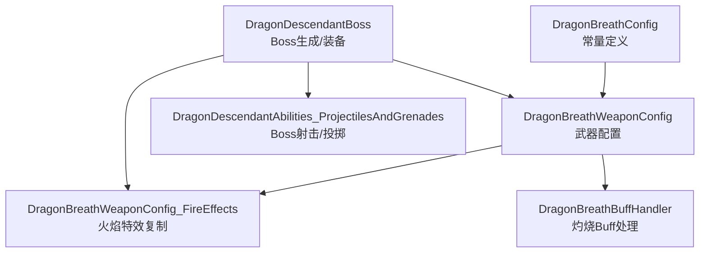
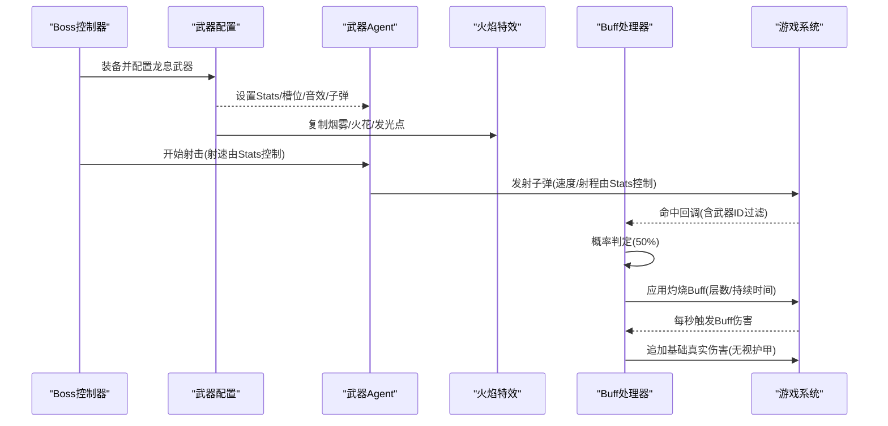
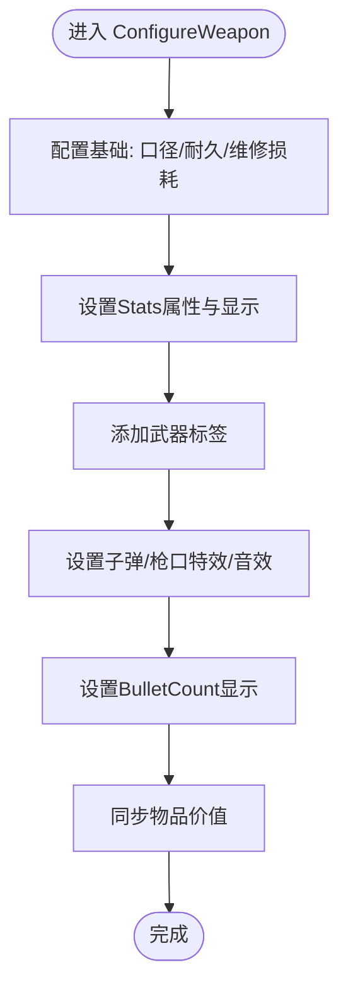
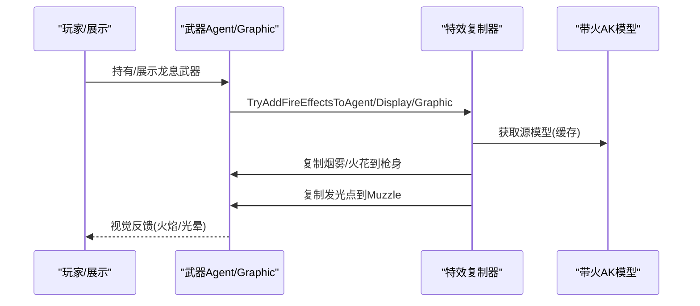
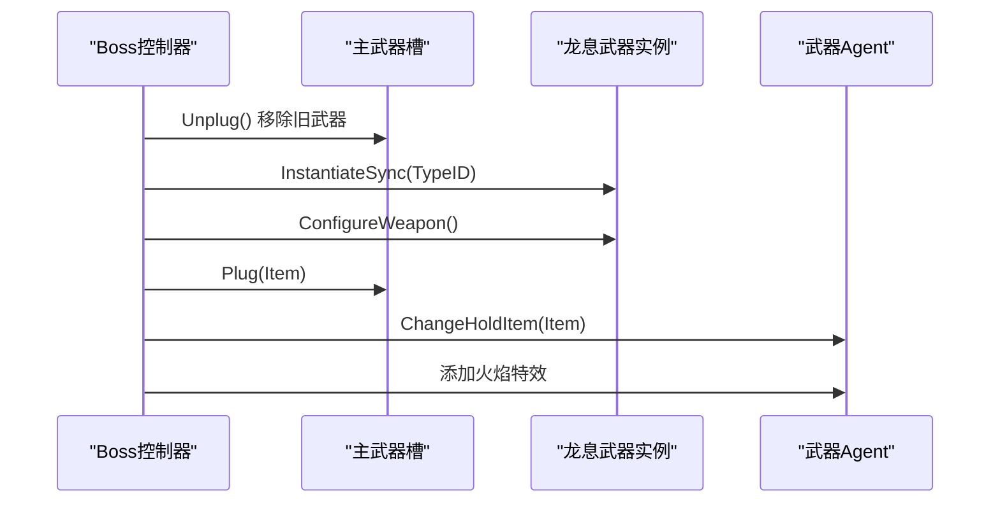
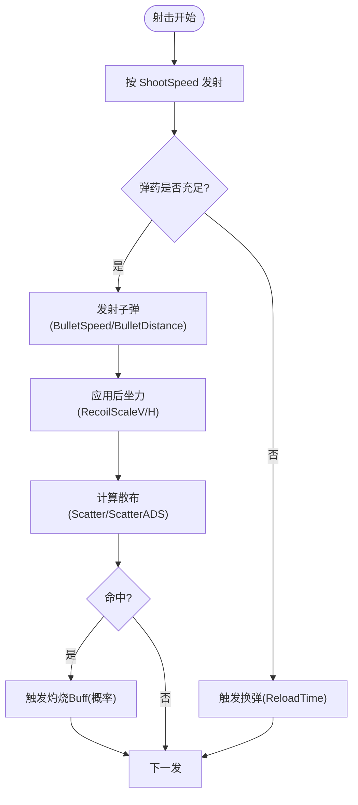
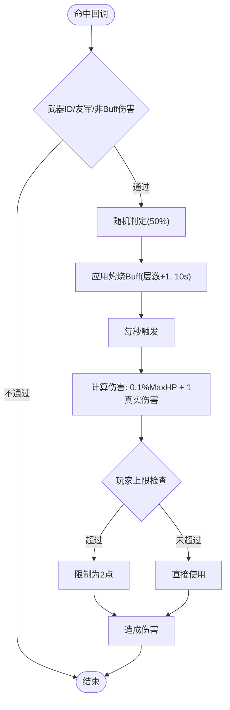
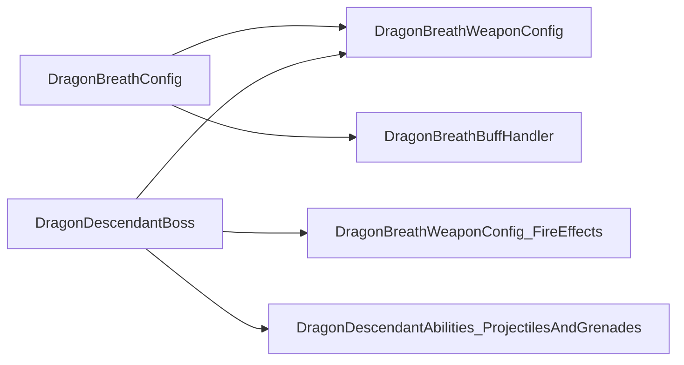

# 龙息武器系统

<cite>
**本文引用的文件**
- [DragonBreathConfig.cs](file://Integration/DragonDescendant/DragonBreathConfig.cs)
- [DragonBreathWeaponConfig.cs](file://Integration/DragonDescendant/DragonBreathWeaponConfig.cs)
- [DragonBreathWeaponConfig_FireEffects.cs](file://Integration/DragonDescendant/DragonBreathWeaponConfig_FireEffects.cs)
- [DragonBreathBuffHandler.cs](file://Integration/DragonDescendant/DragonBreathBuffHandler.cs)
- [DragonDescendantBoss.cs](file://Integration/DragonDescendant/DragonDescendantBoss.cs)
- [DragonDescendantAbilities_ProjectilesAndGrenades.cs](file://Integration/DragonDescendant/DragonDescendantAbilities_ProjectilesAndGrenades.cs)
</cite>

## 目录
1. [简介](#简介)
2. [项目结构](#项目结构)
3. [核心组件](#核心组件)
4. [架构总览](#架构总览)
5. [详细组件分析](#详细组件分析)
6. [依赖关系分析](#依赖关系分析)
7. [性能考量](#性能考量)
8. [故障排查指南](#故障排查指南)
9. [结论](#结论)
10. [附录：自定义配置与调优](#附录自定义配置与调优)

## 简介
本文件系统化梳理“龙息武器”在 BossRush Mod 中的实现，覆盖以下主题：
- DragonBreathWeaponConfig 的配置机制：武器属性、弹道参数、伤害计算模型。
- 火焰特效系统：TryAddFireEffectsToAgent 的实现原理、枪口火焰效果添加、视觉反馈机制。
- 武器与 Boss 的绑定关系：武器槽位管理、手持物品切换、动画同步。
- 射击机制：射速控制、弹药管理、后坐力效果。
- 性能优化：特效实例化优化、材质共享、粒子系统调优。
- 自定义配置指南与常见问题解决方案。

## 项目结构
围绕龙息武器的关键代码集中在 Integration/DragonDescendant 目录下，按职责划分如下：
- 配置常量：DragonBreathConfig.cs（武器ID、Buff ID、触发概率等）
- 武器配置：DragonBreathWeaponConfig.cs（属性、槽位、标签、弹道、音效、子弹/枪口特效）
- 火焰特效：DragonBreathWeaponConfig_FireEffects.cs（复制带火AK模型的烟雾/火花/发光点）
- Buff处理器：DragonBreathBuffHandler.cs（命中时概率叠加灼烧层数与真实伤害）
- Boss集成：DragonDescendantBoss.cs（生成Boss、装备龙息武器、槽位与手持切换）
- 能力控制器：DragonDescendantAbilities_ProjectilesAndGrenades.cs（Boss射击回调、火箭弹/燃烧弹逻辑）

图表来源
- [DragonBreathConfig.cs:15-65](file://Integration/DragonDescendant/DragonBreathConfig.cs#L15-L65)
- [DragonBreathWeaponConfig.cs:21-143](file://Integration/DragonDescendant/DragonBreathWeaponConfig.cs#L21-L143)
- [DragonBreathWeaponConfig_FireEffects.cs:21-55](file://Integration/DragonDescendant/DragonBreathWeaponConfig_FireEffects.cs#L21-L55)
- [DragonBreathBuffHandler.cs:26-71](file://Integration/DragonDescendant/DragonBreathBuffHandler.cs#L26-L71)
- [DragonDescendantBoss.cs:617-743](file://Integration/DragonDescendant/DragonDescendantBoss.cs#L617-L743)
- [DragonDescendantAbilities_ProjectilesAndGrenades.cs:18-31](file://Integration/DragonDescendant/DragonDescendantAbilities_ProjectilesAndGrenades.cs#L18-L31)

章节来源
- [DragonBreathConfig.cs:15-65](file://Integration/DragonDescendant/DragonBreathConfig.cs#L15-L65)
- [DragonBreathWeaponConfig.cs:21-143](file://Integration/DragonDescendant/DragonBreathWeaponConfig.cs#L21-L143)
- [DragonBreathWeaponConfig_FireEffects.cs:21-55](file://Integration/DragonDescendant/DragonBreathWeaponConfig_FireEffects.cs#L21-L55)
- [DragonBreathBuffHandler.cs:26-71](file://Integration/DragonDescendant/DragonBreathBuffHandler.cs#L26-L71)
- [DragonDescendantBoss.cs:617-743](file://Integration/DragonDescendant/DragonDescendantBoss.cs#L617-L743)
- [DragonDescendantAbilities_ProjectilesAndGrenades.cs:18-31](file://Integration/DragonDescendant/DragonDescendantAbilities_ProjectilesAndGrenades.cs#L18-L31)

## 核心组件
- 配置常量（DragonBreathConfig）
  - 武器TypeID、Buff ID、触发概率、基础伤害每层、本地化键等集中定义，便于统一调整。
- 武器配置（DragonBreathWeaponConfig）
  - 通过 TryConfigure/ConfigureWeapon 完成：槽位Tag映射、口径/耐久/维修损耗、Stats属性设置、显示变量BulletCount、枪械音效与子弹/枪口特效、价值同步。
- 火焰特效（DragonBreathWeaponConfig_FireEffects）
  - 从带火AK-47模型复制烟雾、火花、发光点到目标武器模型；支持玩家手持Agent、展示家具ItemGraphic等多种场景。
- Buff处理器（DragonBreathBuffHandler）
  - 订阅伤害事件，命中时按概率叠加灼烧层数；替换为原版点燃特效；追加每层基础真实伤害并限制对玩家的上限。
- Boss集成（DragonDescendantBoss）
  - 生成Boss、装备龙头/龙甲、替换主武器槽为龙息武器、刷新模型、加载最高级弹药、为Boss武器添加火焰特效。
- 能力控制器（DragonDescendantAbilities_ProjectilesAndGrenades）
  - Boss射击计数、每N发触发一次火箭弹爆炸；定时投掷燃烧弹至玩家脚下；使用缓存协程对象减少GC。

章节来源
- [DragonBreathConfig.cs:15-65](file://Integration/DragonDescendant/DragonBreathConfig.cs#L15-L65)
- [DragonBreathWeaponConfig.cs:145-186](file://Integration/DragonDescendant/DragonBreathWeaponConfig.cs#L145-L186)
- [DragonBreathWeaponConfig_FireEffects.cs:21-55](file://Integration/DragonDescendant/DragonBreathWeaponConfig_FireEffects.cs#L21-L55)
- [DragonBreathBuffHandler.cs:41-71](file://Integration/DragonDescendant/DragonBreathBuffHandler.cs#L41-L71)
- [DragonDescendantBoss.cs:617-743](file://Integration/DragonDescendant/DragonDescendantBoss.cs#L617-L743)
- [DragonDescendantAbilities_ProjectilesAndGrenades.cs:18-31](file://Integration/DragonDescendant/DragonDescendantAbilities_ProjectilesAndGrenades.cs#L18-L31)

## 架构总览
下图展示了龙息武器从配置到实战的关键流程：Boss生成→装备龙息武器→配置属性与特效→射击触发→命中判定→Buff叠加→持续伤害。

图表来源
- [DragonDescendantBoss.cs:617-743](file://Integration/DragonDescendant/DragonDescendantBoss.cs#L617-L743)
- [DragonBreathWeaponConfig.cs:145-186](file://Integration/DragonDescendant/DragonBreathWeaponConfig.cs#L145-L186)
- [DragonBreathWeaponConfig_FireEffects.cs:21-55](file://Integration/DragonDescendant/DragonBreathWeaponConfig_FireEffects.cs#L21-L55)
- [DragonBreathBuffHandler.cs:168-220](file://Integration/DragonDescendant/DragonBreathBuffHandler.cs#L168-L220)
- [DragonBreathBuffHandler.cs:222-287](file://Integration/DragonDescendant/DragonBreathBuffHandler.cs#L222-L287)

## 详细组件分析

### 武器配置机制（DragonBreathWeaponConfig）
- 识别与入口
  - 通过 TypeID 或 baseName 匹配龙息武器，调用 ConfigureWeapon 完成全量配置。
- 槽位与标签
  - 将槽位Key映射到实际Tag名称（如 Tec→TecEquip），确保配件兼容。
  - 添加 Weapon/Gun/GunType_BR/Western/Special/可修复等标签。
- 属性与显示
  - 设置 Stats：Damage、ShootSpeed、Capacity、ReloadTime、BulletSpeed、BulletDistance、CritRate/CritDamageFactor、Scatter/Recoil 等。
  - 设置 BulletCount 变量并显示，保证UI正确呈现弹药信息。
- 弹道与音效
  - 设置开枪/换弹声音Key，子弹预制体使用燃烧弹，枪口特效使用火焰Muzzle。
- 价值同步
  - 根据RawValue同步物品价值，避免UI显示不一致。

图表来源
- [DragonBreathWeaponConfig.cs:145-186](file://Integration/DragonDescendant/DragonBreathWeaponConfig.cs#L145-L186)
- [DragonBreathWeaponConfig.cs:209-258](file://Integration/DragonDescendant/DragonBreathWeaponConfig.cs#L209-L258)
- [DragonBreathWeaponConfig.cs:303-357](file://Integration/DragonDescendant/DragonBreathWeaponConfig.cs#L303-L357)
- [DragonBreathWeaponConfig.cs:449-541](file://Integration/DragonDescendant/DragonBreathWeaponConfig.cs#L449-L541)
- [DragonBreathWeaponConfig.cs:562-612](file://Integration/DragonDescendant/DragonBreathWeaponConfig.cs#L562-L612)
- [DragonBreathWeaponConfig.cs:740-800](file://Integration/DragonDescendant/DragonBreathWeaponConfig.cs#L740-L800)

章节来源
- [DragonBreathWeaponConfig.cs:145-186](file://Integration/DragonDescendant/DragonBreathWeaponConfig.cs#L145-L186)
- [DragonBreathWeaponConfig.cs:209-258](file://Integration/DragonDescendant/DragonBreathWeaponConfig.cs#L209-L258)
- [DragonBreathWeaponConfig.cs:303-357](file://Integration/DragonDescendant/DragonBreathWeaponConfig.cs#L303-L357)
- [DragonBreathWeaponConfig.cs:449-541](file://Integration/DragonDescendant/DragonBreathWeaponConfig.cs#L449-L541)
- [DragonBreathWeaponConfig.cs:562-612](file://Integration/DragonDescendant/DragonBreathWeaponConfig.cs#L562-L612)
- [DragonBreathWeaponConfig.cs:740-800](file://Integration/DragonDescendant/DragonBreathWeaponConfig.cs#L740-L800)

### 火焰特效系统（TryAddFireEffectsToAgent）
- 触发时机
  - 玩家持有龙息武器时，为 ItemAgent_Gun 添加火焰特效；展示家具中为 ItemGraphic 或 ActiveAgent 添加。
- 实现原理
  - 从带火AK-47模型获取源对象，复制烟雾/火花粒子系统到枪身根节点，复制发光点到Muzzle位置。
  - 使用反射缓存ParticleSystem与SodaPointLight类型与方法，避免重复查找开销。
  - 通过实例ID去重，防止重复添加。
- 视觉反馈
  - 粒子系统位于枪身中心附近，发光点位于枪口，提供持续的火焰视觉反馈。

图表来源
- [DragonBreathWeaponConfig_FireEffects.cs:21-55](file://Integration/DragonDescendant/DragonBreathWeaponConfig_FireEffects.cs#L21-L55)
- [DragonBreathWeaponConfig_FireEffects.cs:57-149](file://Integration/DragonDescendant/DragonBreathWeaponConfig_FireEffects.cs#L57-L149)
- [DragonBreathWeaponConfig_FireEffects.cs:152-192](file://Integration/DragonDescendant/DragonBreathWeaponConfig_FireEffects.cs#L152-L192)
- [DragonBreathWeaponConfig_FireEffects.cs:194-232](file://Integration/DragonDescendant/DragonBreathWeaponConfig_FireEffects.cs#L194-L232)
- [DragonBreathWeaponConfig_FireEffects.cs:234-282](file://Integration/DragonDescendant/DragonBreathWeaponConfig_FireEffects.cs#L234-L282)
- [DragonBreathWeaponConfig_FireEffects.cs:320-391](file://Integration/DragonDescendant/DragonBreathWeaponConfig_FireEffects.cs#L320-L391)
- [DragonBreathWeaponConfig_FireEffects.cs:393-497](file://Integration/DragonDescendant/DragonBreathWeaponConfig_FireEffects.cs#L393-L497)

章节来源
- [DragonBreathWeaponConfig_FireEffects.cs:21-55](file://Integration/DragonDescendant/DragonBreathWeaponConfig_FireEffects.cs#L21-L55)
- [DragonBreathWeaponConfig_FireEffects.cs:57-149](file://Integration/DragonDescendant/DragonBreathWeaponConfig_FireEffects.cs#L57-L149)
- [DragonBreathWeaponConfig_FireEffects.cs:152-192](file://Integration/DragonDescendant/DragonBreathWeaponConfig_FireEffects.cs#L152-L192)
- [DragonBreathWeaponConfig_FireEffects.cs:194-232](file://Integration/DragonDescendant/DragonBreathWeaponConfig_FireEffects.cs#L194-L232)
- [DragonBreathWeaponConfig_FireEffects.cs:234-282](file://Integration/DragonDescendant/DragonBreathWeaponConfig_FireEffects.cs#L234-L282)
- [DragonBreathWeaponConfig_FireEffects.cs:320-391](file://Integration/DragonDescendant/DragonBreathWeaponConfig_FireEffects.cs#L320-L391)
- [DragonBreathWeaponConfig_FireEffects.cs:393-497](file://Integration/DragonDescendant/DragonBreathWeaponConfig_FireEffects.cs#L393-L497)

### 武器与Boss绑定关系
- 槽位管理
  - 移除Boss原有主武器，使用 ItemAssetsCollection.InstantiateSync 创建龙息武器实例，添加到库存并Plug到主武器槽。
- 手持物品切换
  - 调用 ChangeHoldItem 使Boss手持龙息武器，随后刷新装备模型显示。
- 动画同步
  - 通过标准持枪Agent系统同步动画；为Boss武器添加火焰特效以保持一致的视觉表现。
- 二阶段数据缓存
  - 在替换武器前，读取原手持武器的完整属性（子弹/枪口/音效/射速/速度/伤害/射程），用于后续二阶段攻击复用。

图表来源
- [DragonDescendantBoss.cs:617-743](file://Integration/DragonDescendant/DragonDescendantBoss.cs#L617-L743)
- [DragonDescendantBoss.cs:464-566](file://Integration/DragonDescendant/DragonDescendantBoss.cs#L464-L566)

章节来源
- [DragonDescendantBoss.cs:617-743](file://Integration/DragonDescendant/DragonDescendantBoss.cs#L617-L743)
- [DragonDescendantBoss.cs:464-566](file://Integration/DragonDescendant/DragonDescendantBoss.cs#L464-L566)

### 射击机制（射速、弹药、后坐力）
- 射速控制
  - 由 Stats.ShootSpeed 决定每秒发射数量；Boss侧 OnBossShoot 累计射击次数，达到阈值触发特殊攻击（如火箭弹）。
- 弹药管理
  - 通过 Stats.Capacity 与 ReloadTime 控制弹夹容量与换弹时间；配置中已设置BR口径与对应子弹。
- 后坐力效果
  - Stats.RecoilScaleV/H、RecoilTime、RecoilRecover 等控制垂直/水平后坐力及恢复；散布参数影响精度。
- 弹道参数
  - BulletSpeed、BulletDistance 控制子弹速度与射程；Scatter/ScatterADS 控制散布。

图表来源
- [DragonDescendantAbilities_ProjectilesAndGrenades.cs:18-31](file://Integration/DragonDescendant/DragonDescendantAbilities_ProjectilesAndGrenades.cs#L18-L31)
- [DragonBreathWeaponConfig.cs:85-143](file://Integration/DragonDescendant/DragonBreathWeaponConfig.cs#L85-L143)
- [DragonBreathWeaponConfig.cs:755-800](file://Integration/DragonDescendant/DragonBreathWeaponConfig.cs#L755-L800)
- [DragonBreathBuffHandler.cs:168-220](file://Integration/DragonDescendant/DragonBreathBuffHandler.cs#L168-L220)

章节来源
- [DragonDescendantAbilities_ProjectilesAndGrenades.cs:18-31](file://Integration/DragonDescendant/DragonDescendantAbilities_ProjectilesAndGrenades.cs#L18-L31)
- [DragonBreathWeaponConfig.cs:85-143](file://Integration/DragonDescendant/DragonBreathWeaponConfig.cs#L85-L143)
- [DragonBreathWeaponConfig.cs:755-800](file://Integration/DragonDescendant/DragonBreathWeaponConfig.cs#L755-L800)
- [DragonBreathBuffHandler.cs:168-220](file://Integration/DragonDescendant/DragonBreathBuffHandler.cs#L168-L220)

### 伤害计算模型（灼烧Buff）
- 触发条件
  - 命中来自龙息武器且非Buff/Effect伤害，友军过滤，50%概率触发。
- 层数与持续时间
  - 每层持续10秒，最多10层；每秒触发一次伤害。
- 伤害构成
  - 百分比伤害：每层为目标最大生命值的0.1%。
  - 基础真实伤害：每层1点真实伤害（无视护甲），对玩家上限2点/次。
  - 元素因子：追加火元素因子，避免被误判为物理元素导致抗性减免。
- 特效替换
  - 将龙焰灼烧的特效替换为原版点燃Buff的特效，保持视觉一致性。

图表来源
- [DragonBreathBuffHandler.cs:168-220](file://Integration/DragonDescendant/DragonBreathBuffHandler.cs#L168-L220)
- [DragonBreathBuffHandler.cs:222-287](file://Integration/DragonDescendant/DragonBreathBuffHandler.cs#L222-L287)
- [DragonBreathConfig.cs:22-43](file://Integration/DragonDescendant/DragonBreathConfig.cs#L22-L43)

章节来源
- [DragonBreathBuffHandler.cs:168-220](file://Integration/DragonDescendant/DragonBreathBuffHandler.cs#L168-L220)
- [DragonBreathBuffHandler.cs:222-287](file://Integration/DragonDescendant/DragonBreathBuffHandler.cs#L222-L287)
- [DragonBreathConfig.cs:22-43](file://Integration/DragonDescendant/DragonBreathConfig.cs#L22-L43)

## 依赖关系分析
- 配置常量依赖
  - DragonBreathWeaponConfig 与 DragonBreathBuffHandler 均引用 DragonBreathConfig 的常量（TypeID、BuffID、概率等）。
- 运行时依赖
  - Boss控制器依赖武器配置进行装备与特效添加；能力控制器依赖Boss状态与配置进行攻击调度。
- 外部系统
  - 依赖游戏内置的 Item/ItemSetting_Gun/Inventory/Stats/ExplosionManager/Buff 等系统接口。

图表来源
- [DragonBreathConfig.cs:15-65](file://Integration/DragonDescendant/DragonBreathConfig.cs#L15-L65)
- [DragonBreathWeaponConfig.cs:21-143](file://Integration/DragonDescendant/DragonBreathWeaponConfig.cs#L21-L143)
- [DragonBreathBuffHandler.cs:26-71](file://Integration/DragonDescendant/DragonBreathBuffHandler.cs#L26-L71)
- [DragonDescendantBoss.cs:617-743](file://Integration/DragonDescendant/DragonDescendantBoss.cs#L617-L743)
- [DragonDescendantAbilities_ProjectilesAndGrenades.cs:18-31](file://Integration/DragonDescendant/DragonDescendantAbilities_ProjectilesAndGrenades.cs#L18-L31)

章节来源
- [DragonBreathConfig.cs:15-65](file://Integration/DragonDescendant/DragonBreathConfig.cs#L15-L65)
- [DragonBreathWeaponConfig.cs:21-143](file://Integration/DragonDescendant/DragonBreathWeaponConfig.cs#L21-L143)
- [DragonBreathBuffHandler.cs:26-71](file://Integration/DragonDescendant/DragonBreathBuffHandler.cs#L26-L71)
- [DragonDescendantBoss.cs:617-743](file://Integration/DragonDescendant/DragonDescendantBoss.cs#L617-L743)
- [DragonDescendantAbilities_ProjectilesAndGrenades.cs:18-31](file://Integration/DragonDescendant/DragonDescendantAbilities_ProjectilesAndGrenades.cs#L18-L31)

## 性能考量
- 反射与缓存
  - 反射字段与方法仅查找一次并缓存（Stat字段、ParticleSystem、SodaPointLight），避免热路径分配。
- 实例化优化
  - 特效复制时使用对象池思想（实例ID去重），避免重复添加；源模型与Buff预制体缓存。
- 粒子系统调优
  - 仅在DevModeEnabled时打印层级结构；使用 EnsureParticleSystemPlaying 启动粒子系统，减少无效操作。
- 协程与时间对象缓存
  - 能力控制器缓存常用 WaitForSeconds，降低GC压力。
- 材质与特效共享
  - 通过复制现有预制体而非重新构建，间接实现材质与粒子共享；发光点使用源对象的缩放与初始化方法。

[本节为通用性能建议，无需特定文件引用]

## 故障排查指南
- 无法找到带火AK-47模型
  - 检查 ItemAssetsCollection 是否包含该预制体；确认 GetPrefab 返回有效对象。
  - 参考路径：[DragonBreathWeaponConfig_FireEffects.cs:152-192](file://Integration/DragonDescendant/DragonBreathWeaponConfig_FireEffects.cs#L152-L192)
- 火焰特效未显示
  - 确认目标存在 Muzzle 子对象；检查 CopyFireEffects 是否成功复制粒子与发光点。
  - 参考路径：[DragonBreathWeaponConfig_FireEffects.cs:194-232](file://Integration/DragonDescendant/DragonBreathWeaponConfig_FireEffects.cs#L194-L232)
- 灼烧Buff未生效
  - 检查 Health.OnHurt 是否正确订阅；确认 fromWeaponItemID 匹配；验证概率判定与层数上限。
  - 参考路径：[DragonBreathBuffHandler.cs:41-71](file://Integration/DragonDescendant/DragonBreathBuffHandler.cs#L41-L71)、[DragonBreathBuffHandler.cs:168-220](file://Integration/DragonDescendant/DragonBreathBuffHandler.cs#L168-L220)
- Boss未装备龙息武器
  - 检查 EquipDragonBreathWeapon 流程：Unplug/Instantiate/Plug/ChangeHoldItem 是否执行成功。
  - 参考路径：[DragonDescendantBoss.cs:617-743](file://Integration/DragonDescendant/DragonDescendantBoss.cs#L617-L743)
- 射击异常或无后坐力
  - 核对 Stats 中 ShootSpeed、RecoilScaleV/H、Scatter 等值是否设置；确认子弹预制体与音效Key正确。
  - 参考路径：[DragonBreathWeaponConfig.cs:85-143](file://Integration/DragonDescendant/DragonBreathWeaponConfig.cs#L85-L143)、[DragonBreathWeaponConfig.cs:755-800](file://Integration/DragonDescendant/DragonBreathWeaponConfig.cs#L755-L800)

章节来源
- [DragonBreathWeaponConfig_FireEffects.cs:152-192](file://Integration/DragonDescendant/DragonBreathWeaponConfig_FireEffects.cs#L152-L192)
- [DragonBreathWeaponConfig_FireEffects.cs:194-232](file://Integration/DragonDescendant/DragonBreathWeaponConfig_FireEffects.cs#L194-L232)
- [DragonBreathBuffHandler.cs:41-71](file://Integration/DragonDescendant/DragonBreathBuffHandler.cs#L41-L71)
- [DragonBreathBuffHandler.cs:168-220](file://Integration/DragonDescendant/DragonBreathBuffHandler.cs#L168-L220)
- [DragonDescendantBoss.cs:617-743](file://Integration/DragonDescendant/DragonDescendantBoss.cs#L617-L743)
- [DragonBreathWeaponConfig.cs:85-143](file://Integration/DragonDescendant/DragonBreathWeaponConfig.cs#L85-L143)
- [DragonBreathWeaponConfig.cs:755-800](file://Integration/DragonDescendant/DragonBreathWeaponConfig.cs#L755-L800)

## 结论
龙息武器系统在配置、特效、Buff与Boss集成方面形成了闭环：
- 通过集中常量与模块化配置，实现武器属性的灵活调整。
- 火焰特效系统基于现有资源高效复制，兼顾性能与视觉效果。
- Buff处理器精确控制伤害模型，提供稳定的持续输出。
- Boss绑定流程完善，确保武器在战斗中的稳定表现。
- 性能优化贯穿始终，减少反射、实例化与GC开销。

[本节为总结性内容，无需特定文件引用]

## 附录：自定义配置与调优
- 调整武器属性
  - 修改 DragonBreathWeaponConfig 中的 WEAPON_STATS 字典，调整 Damage、ShootSpeed、BulletSpeed、BulletDistance、Scatter、Recoil 等。
  - 参考路径：[DragonBreathWeaponConfig.cs:85-143](file://Integration/DragonDescendant/DragonBreathWeaponConfig.cs#L85-L143)
- 调整灼烧Buff
  - 修改 DragonBreathConfig 中的 TRIGGER_CHANCE、BASE_DAMAGE_PER_LAYER、BUFF_ID 等。
  - 参考路径：[DragonBreathConfig.cs:22-43](file://Integration/DragonDescendant/DragonBreathConfig.cs#L22-L43)
- 调整特效强度
  - 修改 CopyFireEffects 中粒子系统位置与缩放；调整发光点位置与强度。
  - 参考路径：[DragonBreathWeaponConfig_FireEffects.cs:234-282](file://Integration/DragonDescendant/DragonBreathWeaponConfig_FireEffects.cs#L234-L282)、[DragonBreathWeaponConfig_FireEffects.cs:393-497](file://Integration/DragonDescendant/DragonBreathWeaponConfig_FireEffects.cs#L393-L497)
- 调整Boss攻击节奏
  - 修改 DragonDescendantAbilities_ProjectilesAndGrenades 中的射击计数阈值与投掷间隔。
  - 参考路径：[DragonDescendantAbilities_ProjectilesAndGrenades.cs:18-31](file://Integration/DragonDescendant/DragonDescendantAbilities_ProjectilesAndGrenades.cs#L18-L31)

章节来源
- [DragonBreathWeaponConfig.cs:85-143](file://Integration/DragonDescendant/DragonBreathWeaponConfig.cs#L85-L143)
- [DragonBreathConfig.cs:22-43](file://Integration/DragonDescendant/DragonBreathConfig.cs#L22-L43)
- [DragonBreathWeaponConfig_FireEffects.cs:234-282](file://Integration/DragonDescendant/DragonBreathWeaponConfig_FireEffects.cs#L234-L282)
- [DragonBreathWeaponConfig_FireEffects.cs:393-497](file://Integration/DragonDescendant/DragonBreathWeaponConfig_FireEffects.cs#L393-L497)
- [DragonDescendantAbilities_ProjectilesAndGrenades.cs:18-31](file://Integration/DragonDescendant/DragonDescendantAbilities_ProjectilesAndGrenades.cs#L18-L31)