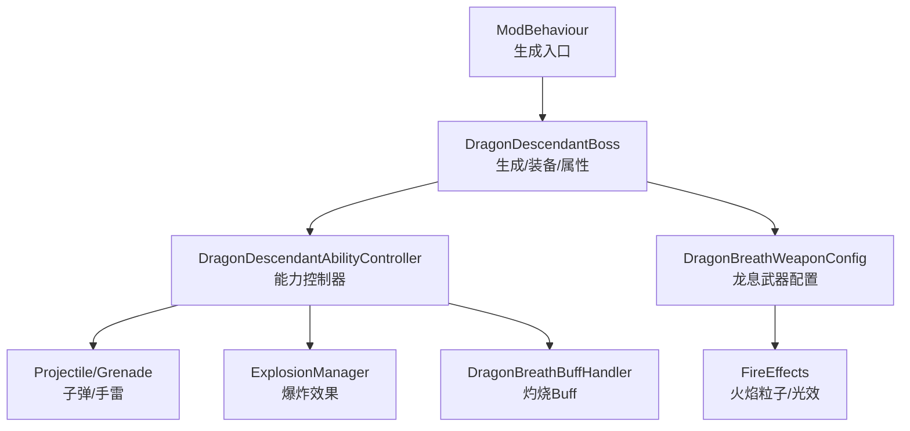
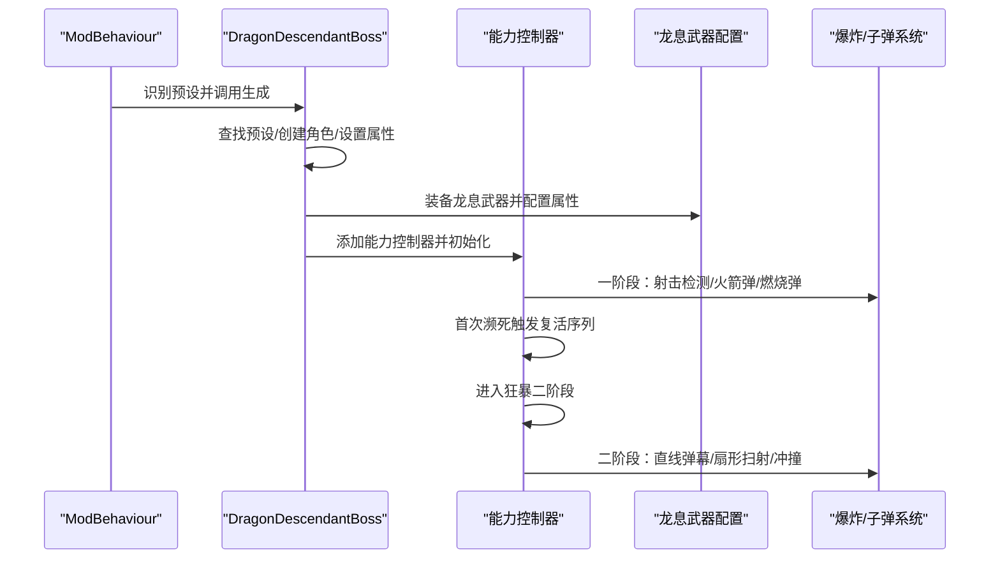
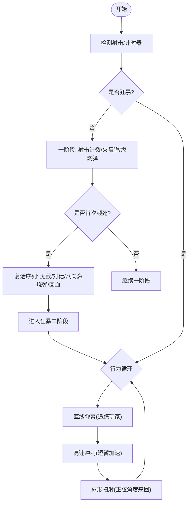
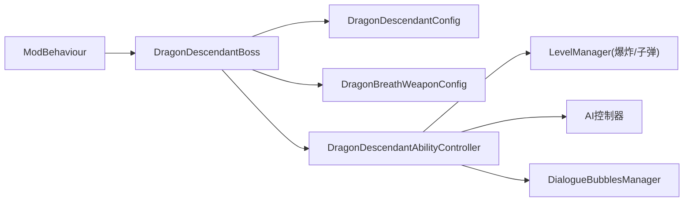

# 龙裔遗族 Boss

<cite>
**本文引用的文件**
- [DragonDescendantBoss.cs](file://Integration/DragonDescendant/DragonDescendantBoss.cs)
- [DragonDescendantAbilities.cs](file://Integration/DragonDescendant/DragonDescendantAbilities.cs)
- [DragonDescendantAbilities_ProjectilesAndGrenades.cs](file://Integration/DragonDescendant/DragonDescendantAbilities_ProjectilesAndGrenades.cs)
- [DragonDescendantAbilities_Phase2Combat.cs](file://Integration/DragonDescendant/DragonDescendantAbilities_Phase2Combat.cs)
- [DragonDescendantAbilities_ResurrectionAndPhase.cs](file://Integration/DragonDescendant/DragonDescendantAbilities_ResurrectionAndPhase.cs)
- [DragonBreathWeaponConfig.cs](file://Integration/DragonDescendant/DragonBreathWeaponConfig.cs)
- [DragonBreathWeaponConfig_FireEffects.cs](file://Integration/DragonDescendant/DragonBreathWeaponConfig_FireEffects.cs)
- [DragonBreathBuffHandler.cs](file://Integration/DragonDescendant/DragonBreathBuffHandler.cs)
- [DragonDescendantConfig.cs](file://Integration/DragonDescendant/DragonDescendantConfig.cs)
- [ModBehaviour.cs](file://ModBehaviour.cs)
</cite>

## 目录
1. [简介](#简介)
2. [项目结构](#项目结构)
3. [核心组件](#核心组件)
4. [架构总览](#架构总览)
5. [详细组件分析](#详细组件分析)
6. [依赖关系分析](#依赖关系分析)
7. [性能考量](#性能考量)
8. [故障排查指南](#故障排查指南)
9. [结论](#结论)
10. [附录](#附录)

## 简介
本文件为“龙裔遗族”Boss 的完整技术文档，覆盖两阶段战斗机制、龙息武器系统、弹幕与爆炸效果、孩儿护我召唤与保护逻辑、技能实现细节、伤害计算、特效系统，以及实战策略与性能优化建议。该 Boss 以“近战/投掷物 + 远程射击”的两阶段为核心体验：第一阶段以常规射击、火箭弹与燃烧弹为主；第二阶段在首次濒死复活后进入狂暴，采用直线弹幕、扇形扫射与冲撞击退的高压节奏。

## 项目结构
围绕龙裔遗族的代码集中在 Integration/DragonDescendant 目录下，按职责拆分为：
- 生成与生命周期：DragonDescendantBoss.cs（生成、装备、属性设置、掉落追踪）
- 能力控制器：DragonDescendantAbilities*.cs（射击检测、投掷物、复活、二阶段追逐与弹幕）
- 武器配置：DragonBreathWeaponConfig*.cs（龙息武器属性、槽位、音效、火焰特效）
- Buff 处理器：DragonBreathBuffHandler.cs（命中触发灼烧、基础伤害追加）
- 配置常量：DragonDescendantConfig.cs（血量、倍率、冷却、距离等）
- 入口集成：ModBehaviour.cs（识别预设并调用专用生成流程）

图表来源
- [DragonDescendantBoss.cs:56-235](file://Integration/DragonDescendant/DragonDescendantBoss.cs#L56-L235)
- [DragonDescendantAbilities.cs:231-279](file://Integration/DragonDescendant/DragonDescendantAbilities.cs#L231-L279)
- [DragonBreathWeaponConfig.cs:145-186](file://Integration/DragonDescendant/DragonBreathWeaponConfig.cs#L145-L186)
- [DragonBreathWeaponConfig_FireEffects.cs:27-55](file://Integration/DragonDescendant/DragonBreathWeaponConfig_FireEffects.cs#L27-L55)
- [DragonBreathBuffHandler.cs:44-71](file://Integration/DragonDescendant/DragonBreathBuffHandler.cs#L44-L71)

章节来源
- [DragonDescendantBoss.cs:56-235](file://Integration/DragonDescendant/DragonDescendantBoss.cs#L56-L235)
- [DragonDescendantAbilities.cs:231-279](file://Integration/DragonDescendant/DragonDescendantAbilities.cs#L231-L279)
- [DragonBreathWeaponConfig.cs:145-186](file://Integration/DragonDescendant/DragonBreathWeaponConfig.cs#L145-L186)
- [DragonBreathWeaponConfig_FireEffects.cs:27-55](file://Integration/DragonDescendant/DragonBreathWeaponConfig_FireEffects.cs#L27-L55)
- [DragonBreathBuffHandler.cs:44-71](file://Integration/DragonDescendant/DragonBreathBuffHandler.cs#L44-L71)

## 核心组件
- 主控制器（生成/装备/属性）：负责查找预设、创建角色、应用全局倍率、装备龙头/龙甲/龙息武器、订阅死亡事件、记录掉落信息。
- 能力控制器：管理射击检测、火箭弹、燃烧弹、复活序列、狂暴状态、二阶段追逐与弹幕、碰撞检测、冰属性减速。
- 龙息武器配置：配置弹药口径、耐久、槽位标签、Stats、枪口音效、子弹预制体、火焰特效复制。
- Buff 处理器：监听命中事件，概率叠加灼烧层数，并在 Buff 伤害时追加真实基础伤害。
- 配置常量：集中定义血量、倍率、冷却、距离、掉落概率等可调参数。

章节来源
- [DragonDescendantBoss.cs:56-235](file://Integration/DragonDescendant/DragonDescendantBoss.cs#L56-L235)
- [DragonDescendantAbilities.cs:231-279](file://Integration/DragonDescendant/DragonDescendantAbilities.cs#L231-L279)
- [DragonBreathWeaponConfig.cs:145-186](file://Integration/DragonDescendant/DragonBreathWeaponConfig.cs#L145-L186)
- [DragonBreathBuffHandler.cs:44-71](file://Integration/DragonDescendant/DragonBreathBuffHandler.cs#L44-L71)
- [DragonDescendantConfig.cs:15-159](file://Integration/DragonDescendant/DragonDescendantConfig.cs#L15-L159)

## 架构总览
下图展示从生成到战斗循环的关键路径：入口识别预设 → 生成 Boss → 装备龙息武器 → 能力控制器初始化 → 战斗阶段切换与技能释放。

图表来源
- [ModBehaviour.cs:1002-1025](file://ModBehaviour.cs#L1002-L1025)
- [DragonDescendantBoss.cs:56-235](file://Integration/DragonDescendant/DragonDescendantBoss.cs#L56-L235)
- [DragonDescendantAbilities.cs:231-279](file://Integration/DragonDescendant/DragonDescendantAbilities.cs#L231-L279)
- [DragonDescendantAbilities_Phase2Combat.cs:22-125](file://Integration/DragonDescendant/DragonDescendantAbilities_Phase2Combat.cs#L22-L125)

## 详细组件分析

### 生成与装备流程
- 预设查找与实例化：优先匹配“Cname_Boss_Red”，回退至名称模糊匹配或“???”预设；避免修改原版预设，创建副本并设置显示名与血条。
- 属性与倍率：设置基础血量、满血恢复、枪械/近战伤害倍率；应用全局 Boss 数值倍率。
- 原始武器数据捕获：在替换为龙息武器前，反射读取当前手持武器的子弹预制体、枪口特效、开声音效键、射速、子弹速度、伤害、射程，供二阶段直接生成子弹使用。
- 装备龙息武器：移除原武器，实例化龙息武器并配置 Stats、槽位、音效、子弹预制体；刷新模型并加载最高级弹药。
- 掉落追踪：所有龙裔均记录生成时间与基础掉落数量，用于随机掉落系统。

章节来源
- [DragonDescendantBoss.cs:56-235](file://Integration/DragonDescendant/DragonDescendantBoss.cs#L56-L235)
- [DragonDescendantBoss.cs:428-566](file://Integration/DragonDescendant/DragonDescendantBoss.cs#L428-L566)
- [DragonDescendantBoss.cs:614-743](file://Integration/DragonDescendant/DragonDescendantBoss.cs#L614-L743)

### 能力控制器与战斗循环
- 射击检测：通过轮询弹匣子弹变化检测 Boss 是否射击，每 N 帧检查一次以降低开销；非狂暴状态下才计数。
- 火箭弹：累计射击次数，每 10 发触发一次小范围爆炸；仅当玩家位于 Boss 附近（阈值由配置决定）时才在玩家位置产生爆炸与伤害。
- 燃烧弹：定时投掷，间隔随状态变化；始终投向玩家脚下；若未找到预制体则延迟生成火焰爆炸作为后备。
- 复活与阶段切换：首次濒死锁定 1 血并开启无敌，播放对话气泡，向八个方向投掷燃烧弹，恢复至 50% 最大生命，关闭无敌，进入狂暴。
- 狂暴二阶段：停止自身射击，改为直接生成子弹；行为循环包含“停止→直线弹幕→冲刺→扇形扫射”；支持 Mode E 阵营感知与脱战距离控制。
- 碰撞检测：在 Boss 周围生成球形触发器，配合冷却时间对接触玩家造成击退与伤害。

图表来源
- [DragonDescendantAbilities.cs:438-518](file://Integration/DragonDescendant/DragonDescendantAbilities.cs#L438-L518)
- [DragonDescendantAbilities_ProjectilesAndGrenades.cs:21-84](file://Integration/DragonDescendant/DragonDescendantAbilities_ProjectilesAndGrenades.cs#L21-L84)
- [DragonDescendantAbilities_ProjectilesAndGrenades.cs:93-169](file://Integration/DragonDescendant/DragonDescendantAbilities_ProjectilesAndGrenades.cs#L93-L169)
- [DragonDescendantAbilities_ResurrectionAndPhase.cs:132-181](file://Integration/DragonDescendant/DragonDescendantAbilities_ResurrectionAndPhase.cs#L132-L181)
- [DragonDescendantAbilities_Phase2Combat.cs:22-125](file://Integration/DragonDescendant/DragonDescendantAbilities_Phase2Combat.cs#L22-L125)

章节来源
- [DragonDescendantAbilities.cs:438-518](file://Integration/DragonDescendant/DragonDescendantAbilities.cs#L438-L518)
- [DragonDescendantAbilities_ProjectilesAndGrenades.cs:21-84](file://Integration/DragonDescendant/DragonDescendantAbilities_ProjectilesAndGrenades.cs#L21-L84)
- [DragonDescendantAbilities_ProjectilesAndGrenades.cs:93-169](file://Integration/DragonDescendant/DragonDescendantAbilities_ProjectilesAndGrenades.cs#L93-L169)
- [DragonDescendantAbilities_ResurrectionAndPhase.cs:132-181](file://Integration/DragonDescendant/DragonDescendantAbilities_ResurrectionAndPhase.cs#L132-L181)
- [DragonDescendantAbilities_Phase2Combat.cs:22-125](file://Integration/DragonDescendant/DragonDescendantAbilities_Phase2Combat.cs#L22-L125)

### 龙息武器系统与特效
- 武器配置：口径 BR、耐久与维修损耗、槽位映射（Scope/Muzzle/Grip/Stock/Tec/Mag/Special）、Stats 列表（伤害、射速、容量、装填、子弹速度/射程、暴击率/倍率、散布、后坐力等）。
- 枪口与音效：设置开枪/换弹音效键；将子弹预制体设置为燃烧弹类型；确保变量 BulletCount 可显示。
- 火焰特效：从带火 AK-47 模型复制烟雾、火花粒子与发光点光源，适配到 Boss 武器模型；展示家具场景下也能正确附加特效。
- 运行时生效：在 Boss 生成时完成配置并刷新模型；玩家装备时也可动态应用。

章节来源
- [DragonBreathWeaponConfig.cs:145-186](file://Integration/DragonDescendant/DragonBreathWeaponConfig.cs#L145-L186)
- [DragonBreathWeaponConfig.cs:209-258](file://Integration/DragonDescendant/DragonBreathWeaponConfig.cs#L209-L258)
- [DragonBreathWeaponConfig.cs:303-357](file://Integration/DragonDescendant/DragonBreathWeaponConfig.cs#L303-L357)
- [DragonBreathWeaponConfig.cs:449-541](file://Integration/DragonDescendant/DragonBreathWeaponConfig.cs#L449-L541)
- [DragonBreathWeaponConfig.cs:562-612](file://Integration/DragonDescendant/DragonBreathWeaponConfig.cs#L562-L612)
- [DragonBreathWeaponConfig.cs:759-800](file://Integration/DragonDescendant/DragonBreathWeaponConfig.cs#L759-L800)
- [DragonBreathWeaponConfig_FireEffects.cs:27-55](file://Integration/DragonDescendant/DragonBreathWeaponConfig_FireEffects.cs#L27-L55)
- [DragonBreathWeaponConfig_FireEffects.cs:198-232](file://Integration/DragonDescendant/DragonBreathWeaponConfig_FireEffects.cs#L198-L232)
- [DragonBreathWeaponConfig_FireEffects.cs:398-497](file://Integration/DragonDescendant/DragonBreathWeaponConfig_FireEffects.cs#L398-L497)

### 弹幕模式与伤害计算
- 一阶段：常规射击 + 每 10 发触发小范围爆炸；爆炸伤害与范围由配置决定，且仅在玩家靠近 Boss 时生效。
- 二阶段：
  - 直线弹幕：固定数量、固定间隔，方向实时追踪玩家。
  - 扇形扫射：正弦函数驱动角度变化，形成左右来回扫射，提供躲避窗口。
  - 暴击倍率：二阶段子弹暴击伤害倍率提升。
- 元素与伤害：二阶段子弹标记火元素；爆炸与燃烧弹也携带火元素因子。
- 冰属性减速：狂暴期间累计冰属性伤害，达到阈值触发减速协程，降低移动/攻击频率。

章节来源
- [DragonDescendantAbilities_ProjectilesAndGrenades.cs:21-84](file://Integration/DragonDescendant/DragonDescendantAbilities_ProjectilesAndGrenades.cs#L21-L84)
- [DragonDescendantAbilities_Phase2Combat.cs:183-268](file://Integration/DragonDescendant/DragonDescendantAbilities_Phase2Combat.cs#L183-L268)
- [DragonDescendantAbilities_Phase2Combat.cs:275-368](file://Integration/DragonDescendant/DragonDescendantAbilities_Phase2Combat.cs#L275-L368)
- [DragonDescendantAbilities_ResurrectionAndPhase.cs:75-126](file://Integration/DragonDescendant/DragonDescendantAbilities_ResurrectionAndPhase.cs#L75-L126)
- [DragonDescendantConfig.cs:32-68](file://Integration/DragonDescendant/DragonDescendantConfig.cs#L32-L68)
- [DragonDescendantConfig.cs:150-159](file://Integration/DragonDescendant/DragonDescendantConfig.cs#L150-L159)

### 爆炸与特效系统
- 爆炸：使用引擎爆炸管理器创建爆炸，附带伤害信息与特效类型；范围与伤害由配置控制。
- 燃烧弹：优先实例化预制体并赋予伤害信息；若无预制体则延迟生成火焰爆炸。
- 枪口特效：二阶段直接生成子弹时播放开声音效并实例化枪口特效；失败不影响主流程。
- 火焰粒子与光源：从源模型复制粒子系统与发光点光源，确保视觉一致性与性能稳定。

章节来源
- [DragonDescendantAbilities_ProjectilesAndGrenades.cs:174-210](file://Integration/DragonDescendant/DragonDescendantAbilities_ProjectilesAndGrenades.cs#L174-L210)
- [DragonDescendantAbilities_ProjectilesAndGrenades.cs:248-271](file://Integration/DragonDescendant/DragonDescendantAbilities_ProjectilesAndGrenades.cs#L248-L271)
- [DragonDescendantAbilities_Phase2Combat.cs:370-463](file://Integration/DragonDescendant/DragonDescendantAbilities_Phase2Combat.cs#L370-L463)
- [DragonBreathWeaponConfig_FireEffects.cs:198-232](file://Integration/DragonDescendant/DragonBreathWeaponConfig_FireEffects.cs#L198-L232)
- [DragonBreathWeaponConfig_FireEffects.cs:398-497](file://Integration/DragonDescendant/DragonBreathWeaponConfig_FireEffects.cs#L398-L497)

### 孩儿护我召唤机制与保护逻辑
- 龙王“孩儿护我”阶段：龙王升至空中并召唤半属性的龙裔遗族；龙王在此期间仍周期性发射技能，但本体处于不可被击杀的保护状态。
- 保护逻辑：召唤出的龙裔不加入波次追踪系统，避免其死亡误触发下一波；龙王真正死亡需等待龙裔被击败。
- 生成参数：通过 isChildProtectionSummon=true 标识特殊召唤路径，跳过标准 BossRush 追踪。

章节来源
- [ModBehaviour.cs:1002-1025](file://ModBehaviour.cs#L1002-L1025)
- [DragonDescendantBoss.cs:56-124](file://Integration/DragonDescendant/DragonDescendantBoss.cs#L56-L124)

### 技能实现细节与 AI 控制
- 暂停/恢复 AI：复活对话期间暂停 AI，结束后恢复；狂暴状态保持跑步输入并持续追踪目标。
- 移动性控制：通过修改 Moveability 值控制移动速度；停止移动时清空输入并调用 AI 停止方法。
- 碰撞检测：球形触发器半径与冷却由配置控制，防止连续触发；击退方向含轻微上抛分量。

章节来源
- [DragonDescendantAbilities_ResurrectionAndPhase.cs:183-215](file://Integration/DragonDescendant/DragonDescendantAbilities_ResurrectionAndPhase.cs#L183-L215)
- [DragonDescendantAbilities_Phase2Combat.cs:127-167](file://Integration/DragonDescendant/DragonDescendantAbilities_Phase2Combat.cs#L127-L167)
- [DragonDescendantAbilities_Phase2Combat.cs:468-497](file://Integration/DragonDescendant/DragonDescendantAbilities_Phase2Combat.cs#L468-L497)
- [DragonDescendantConfig.cs:115-139](file://Integration/DragonDescendant/DragonDescendantConfig.cs#L115-L139)

## 依赖关系分析
- ModBehaviour 负责识别预设并调用 DragonDescendantBoss 的生成方法。
- DragonDescendantBoss 依赖 DragonBreathWeaponConfig 进行武器配置，并注入 DragonDescendantAbilityController。
- 能力控制器依赖 LevelManager 的爆炸与子弹池、DialogueBubblesManager 显示对话、AI 控制器进行移动控制。
- 配置常量集中管理数值，便于调参与平衡。

图表来源
- [ModBehaviour.cs:1002-1025](file://ModBehaviour.cs#L1002-L1025)
- [DragonDescendantBoss.cs:56-235](file://Integration/DragonDescendant/DragonDescendantBoss.cs#L56-L235)
- [DragonDescendantAbilities.cs:231-279](file://Integration/DragonDescendant/DragonDescendantAbilities.cs#L231-L279)
- [DragonDescendantConfig.cs:15-159](file://Integration/DragonDescendant/DragonDescendantConfig.cs#L15-L159)

章节来源
- [ModBehaviour.cs:1002-1025](file://ModBehaviour.cs#L1002-L1025)
- [DragonDescendantBoss.cs:56-235](file://Integration/DragonDescendant/DragonDescendantBoss.cs#L56-L235)
- [DragonDescendantAbilities.cs:231-279](file://Integration/DragonDescendant/DragonDescendantAbilities.cs#L231-L279)
- [DragonDescendantConfig.cs:15-159](file://Integration/DragonDescendant/DragonDescendantConfig.cs#L15-L159)

## 性能考量
- 预缓存对象：预设、子弹/手雷预制体、WaitForSeconds、AudioManager 反射、Tag 查找结果等均在初始化或首次使用时缓存，减少运行时分配。
- 低开销检测：射击检测使用帧计数器与枪械引用缓存，避免每帧高频调用；日志输出在关键节点或调试模式下执行。
- 特效复制优化：火焰粒子与光源复制时避免重复添加，使用实例 ID 去重；仅在必要时打印层级结构。
- 内存与 GC：大量使用静态缓存与复用对象，减少字符串拼接与 LINQ 分配；协程中统一使用缓存的 WaitForSeconds。

章节来源
- [DragonDescendantAbilities.cs:90-147](file://Integration/DragonDescendant/DragonDescendantAbilities.cs#L90-L147)
- [DragonDescendantAbilities.cs:438-518](file://Integration/DragonDescendant/DragonDescendantAbilities.cs#L438-L518)
- [DragonBreathWeaponConfig.cs:394-447](file://Integration/DragonDescendant/DragonBreathWeaponConfig.cs#L394-L447)
- [DragonBreathWeaponConfig_FireEffects.cs:152-192](file://Integration/DragonDescendant/DragonBreathWeaponConfig_FireEffects.cs#L152-L192)
- [DragonBreathWeaponConfig_FireEffects.cs:288-318](file://Integration/DragonDescendant/DragonBreathWeaponConfig_FireEffects.cs#L288-L318)

## 故障排查指南
- 生成失败：检查预设查找是否成功（Cname_Boss_Red 或回退方案），确认角色实例化与激活流程；查看错误日志中的异常堆栈。
- 武器配置异常：确认槽位 Tag 映射是否正确，Stats 是否已创建并显示；验证 BulletCount 变量是否可显示。
- 特效缺失：检查带火 AK-47 模型是否存在；确认粒子系统与发光点光源复制是否成功；查看实例 ID 去重是否生效。
- 爆炸/子弹无效：确认 LevelManager 的爆炸与子弹池可用；检查 DamageInfo 的元素因子与伤害值；核对触发条件（如玩家距离阈值）。
- 复活/阶段切换问题：确认首次濒死判定与无敌状态设置；检查对话气泡显示与八向燃烧弹投掷；验证二阶段伤害倍率与行为循环启动。

章节来源
- [DragonDescendantBoss.cs:56-235](file://Integration/DragonDescendant/DragonDescendantBoss.cs#L56-L235)
- [DragonBreathWeaponConfig.cs:145-186](file://Integration/DragonDescendant/DragonBreathWeaponConfig.cs#L145-L186)
- [DragonBreathWeaponConfig_FireEffects.cs:198-232](file://Integration/DragonDescendant/DragonBreathWeaponConfig_FireEffects.cs#L198-L232)
- [DragonDescendantAbilities_ProjectilesAndGrenades.cs:21-84](file://Integration/DragonDescendant/DragonDescendantAbilities_ProjectilesAndGrenades.cs#L21-L84)
- [DragonDescendantAbilities_ResurrectionAndPhase.cs:132-181](file://Integration/DragonDescendant/DragonDescendantAbilities_ResurrectionAndPhase.cs#L132-L181)

## 结论
龙裔遗族 Boss 通过清晰的阶段划分与丰富的技能组合，提供了高辨识度与高挑战性的战斗体验。其两阶段机制分别强调“走位与节奏”和“高压弹幕与追击”。龙息武器系统在属性、特效与运行时配置上具备良好扩展性；Buff 处理器实现了稳定的灼烧与真实伤害追加。整体代码注重性能与稳定性，通过大量缓存与低开销检测保障流畅体验。建议玩家在实战中利用冰属性减速、合理站位规避爆炸与弹幕，并在二阶段优先拉开距离、打断其追击节奏。

## 附录
- 实战策略建议
  - 一阶段：保持中距离，避开火箭弹与小范围爆炸；注意地面火圈，稳步输出。
  - 二阶段：避免近身接触，利用直线弹幕与扇形扫射的间隙反击；冰属性武器可有效减缓其行动。
  - 套装与抗性：龙套装提供火焰免疫，使战斗更可控；反向鳞可作为容错手段。
- 性能优化建议
  - 调整弹幕密度与爆炸范围以适应不同设备；减少非必要日志输出。
  - 合理使用预缓存与对象池，避免频繁实例化与销毁。
  - 在低端设备上降低特效复杂度或关闭部分可视化反馈。