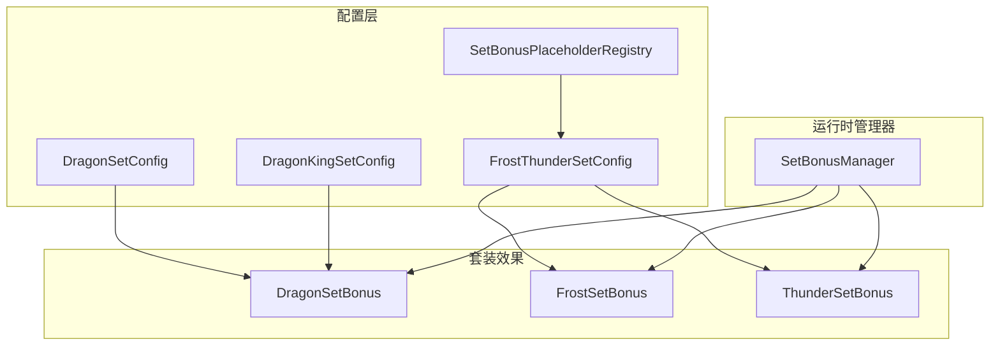
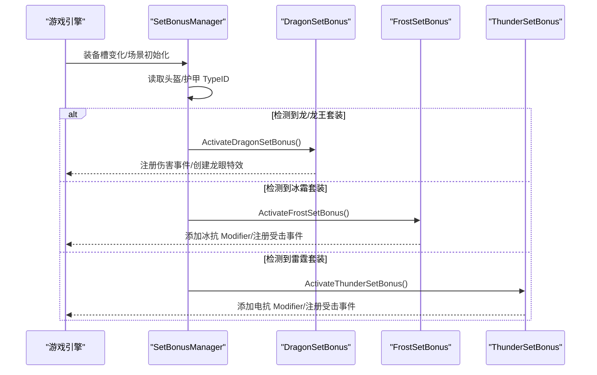
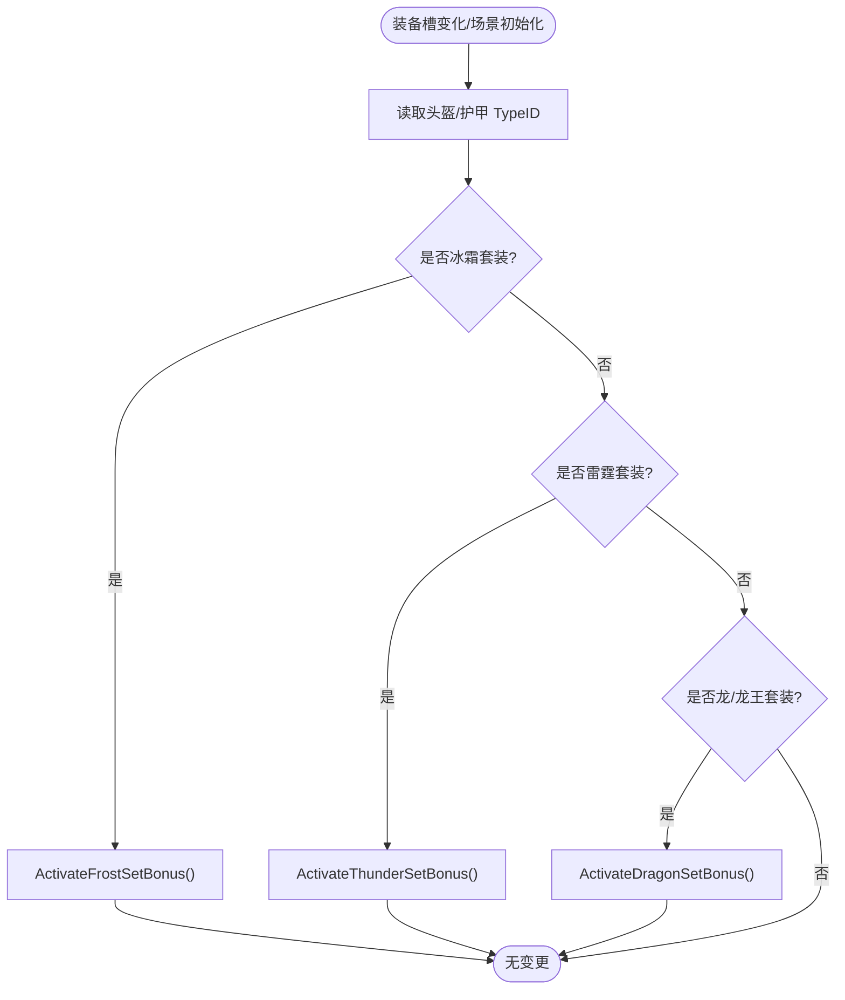
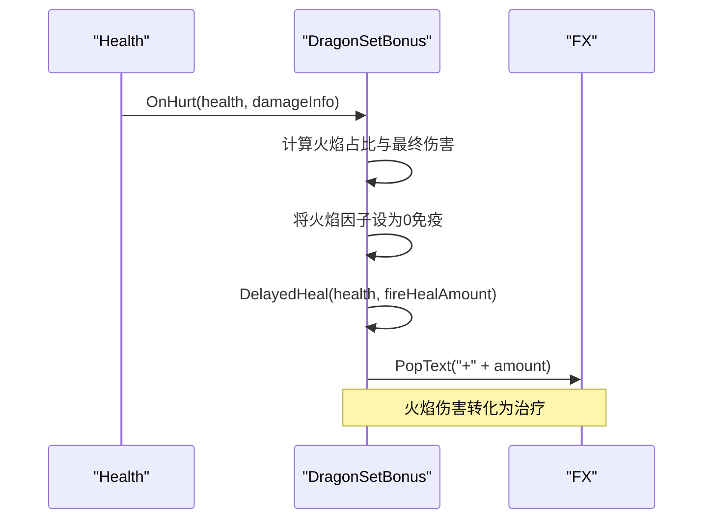
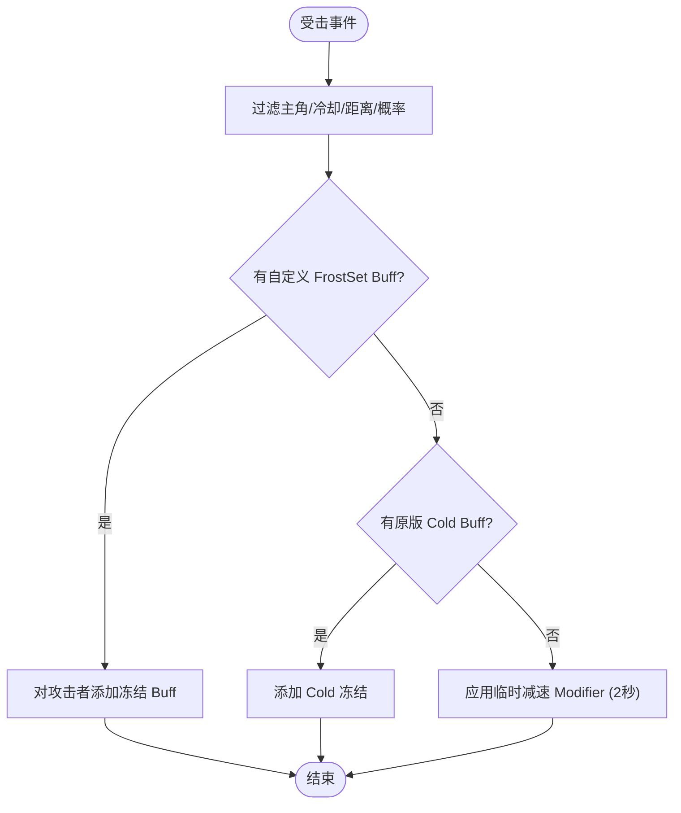
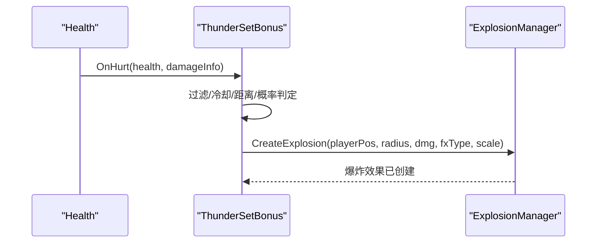
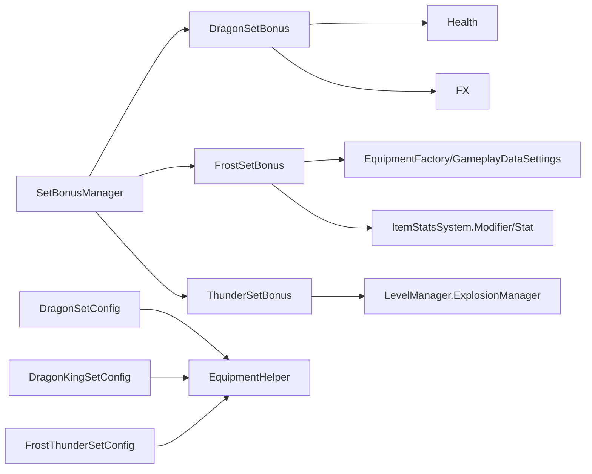

# 套装效果系统

> 2026-09-06（`COMPAT`）：冰霜/雷霆的元素伤害转治疗通过 `Integration/Bonus/SetBonusDamageObservation.cs`
> 观察官方 `Health.Hurt` 的实际逐元素贡献（最低 1 点之后），按最终伤害限额分摊；不再按减免前元素因子
> 拆分总伤害。观察仅在主玩家启用套装时持有逐次上下文，支持嵌套和异常清理；缺记录跳过回血并明确诊断。
> 细节与执行回归见[冰霜雷霆套装效果](../项目概览/核心功能特性/装备与物品系统/套装效果系统/冰霜雷霆套装效果.md)。

<cite>
**本文引用的文件**
- [SetBonusManager.cs](file://Integration/Bonus/SetBonusManager.cs)
- [DragonSetBonus.cs](file://Integration/Bonus/DragonSetBonus.cs)
- [FrostSetBonus.cs](file://Integration/Bonus/FrostSetBonus.cs)
- [ThunderSetBonus.cs](file://Integration/Bonus/ThunderSetBonus.cs)
- [DragonSetConfig.cs](file://Integration\Config\DragonSetConfig.cs)
- [DragonKingSetConfig.cs](file://Integration\Config\DragonKingSetConfig.cs)
- [FrostThunderSetConfig.cs](file://Integration\Config\FrostThunderSetConfig.cs)
- [SetBonusPlaceholderRegistry.cs](file://Integration/Bonus/SetBonusPlaceholderRegistry.cs)
- [SetBonusVisuals.cs](file://Integration/Bonus/SetBonusVisuals.cs)
- [ThunderSetBonus_Storm.cs](file://Integration/Bonus/ThunderSetBonus_Storm.cs)
- [FrostSetBonus_Nova.cs](file://Integration/Bonus/FrostSetBonus_Nova.cs)
- [FrostMistEffect.cs](file://Integration/Bonus/FrostMistEffect.cs)
- [SetBonusBossDropHandler.cs](file://Integration/Bonus/SetBonusBossDropHandler.cs)
- [CharacterOnDeadPatch.cs](file://Patches/Combat/CharacterOnDeadPatch.cs)
</cite>

## 目录
1. [简介](#简介)
2. [项目结构](#项目结构)
3. [核心组件](#核心组件)
4. [架构总览](#架构总览)
5. [详细组件分析](#详细组件分析)
6. [依赖关系分析](#依赖关系分析)
7. [性能考量](#性能考量)
8. [故障排查指南](#故障排查指南)
9. [结论](#结论)
10. [附录：新套装开发指南](#附录：新套装开发指南)

## 简介
本模块实现“套装效果系统”，为四套装备提供统一的检测、激活与停用生命周期，并分别实现以下能力：
- 龙套装（龙头+龙甲）：火焰伤害免疫并转化为治疗；物理减伤；龙眼红光特效。
- 龙王套装（龙王之冕+龙王鳞铠）：继承龙套装的火焰转治疗能力，同时移除毒增伤与视野减少等负面属性。
- 冰霜套装（霜冠+寒冰铠甲）「寒冰之护」：冰抗提升、冰伤 50% 转治疗、每件寒冷防护 +1；击杀触发「冰葬」霜爆（4.5 米 / 20 冰伤 + 冻结 / 1.5 秒冷却，不连锁）；受击概率冻结近身攻击者（带冷却）；淡蓝双眼呼吸光 + 脚下霜雾。
- 雷霆套装（雷神之角+雷霆战甲）「雷霆之怒」：电抗提升、电伤 50% 转治疗、每件风暴防护 +1（风暴天气免疫）；击杀触发「引雷术」连锁闪电（6 米内最多 3 目标 / 35 电伤 / 最多 3 跳、每跳 ×0.75）；受击概率以玩家为中心释放电击 AOE（4 米 / 30 电伤 / 3 秒冷却 / canHurtSelf=false）；青白双眼电闪 + 肩部环境电弧。

系统通过事件驱动（装备槽变化、场景加载完成、受击事件、全局死亡事件）触发状态切换，使用 ItemStatsSystem 的 Modifier/Stat 体系进行数值绑定，并通过游戏内爆炸/Buff 系统与 `SetBonusVisuals` 的程序化表现层（点光、爆发环、LineRenderer 电弧实例池）实现视觉效果与状态变化。

### 2026-09-06 更新：冰霜/雷霆套装龙王级重做与开放获取

- **真 bug 修复**：`ThunderSetBonus.OnThunderSetHurt` 的 `ExplosionManager.CreateExplosion` 原先漏传第 6 参 `canHurtSelf`（官方默认 `true` 时 `selfTeam = Teams.all`，爆炸中心的玩家自己必吃反击伤害），现显式传 `false`，并把伤害置为 `isFromBuffOrEffect = true`、`fromWeaponItemID = 0`（Mode G 矩阵「不计分」口径）。反震结算延后一帧到 `ThunderCounterStep` 协程——`OnHurt` 可能正处在敌方爆炸的 `ExplosionManager` 循环里，嵌套 `CreateExplosion` 会覆写其共享 `colliders/damagedHealth` 缓冲。
- **过图丢被动修复**：官方每次进图重建主角与 `CharacterItem`，旧 Item 上的抗性 Modifier 与旧角色上的视觉随之作废，而 `xxxSetActive` 仍为 true。`SetBonusManager.OnLevelInitializedCheckSetBonus` 现先 `DeactivateFrostSetBonus(); DeactivateThunderSetBonus();` 再 `CheckSetBonusStatus(main, announce: false)`，Modifier / 事件 / 视觉一次全部重建且不重复弹横幅。
- **击杀触发技能**：两套装各只保留一个 `Health.OnDead` 订阅点（`OnFrostSetAnyDead` / `OnThunderSetAnyDead`，同文件 `+=`/`-=` 配对），主角死亡重置冷却，其他角色死亡交给 `TryScheduleFrostNova` / `TryScheduleThunderChain`。回调里只做过滤（照 `CodexKillCollector.OnGlobalDead` 的过滤序：排主角、排 Mode H、`fromCharacter.IsMainCharacter`、排遗种巢随从、排 `Teams.player`、排基地）与调度，结算延后到协程；引雷术用 `thunderChainDepth` 门控嵌套 `OnDead`（`Hurt` 同步派发），冰葬用 `frostNovaResolving` 禁止连锁；首跳只认 `!isFromBuffOrEffect` 的直接击杀。
- **表现层**（`SetBonusVisuals.cs`）：眼光复用 `DragonSetBonus.FindHeadTransform` / `cachedHeadTransform`；爆发环复用 `DragonSetBonus_Dash.CreateSimpleCircleSprite()`；电弧为 LineRenderer 实例池（上限 12，随 ModBehaviour 生命周期，停用时 `DestroySetArcPool`）；霜雾为 `RingParticleEffect` 子类 `FrostMistEffect`（基类新增 `ParticleTint` 虚属性，默认白色，`FlightCloudEffect` 行为不变）。音效 `Assets/Sounds/SetBonus/*.wav` 由 `tools/gen_setbonus_sfx.py` 程序化合成，`compile_official.bat` 部署段照 BGM 块追加拷贝。
- **获取路径**：`Integration/Bonus/SetBonusBossDropHandler.cs` 挂在 Harmony 的 `CharacterMainControl.OnDead` 前缀（`Patches/Combat/CharacterOnDeadPatch.cs`）上，**而不是** BossRush 奖励箱专用的 `AddBossSpecialLootToLootboxCoroutine`——所以原版地图击杀同样掉，玩家不必进竞技场。风暴区 Boss（`Cname_StormBoss*`）掉雷霆、「???」Boss（`Cname_Boss_Blue`）掉冰霜，单格共享 roll 头 20% / 甲 20%。roll 在死亡帧定下并把 TypeID 存进 pending 表（`Dictionary<CharacterMainControl,int>`），保证三条消费通道发的是同一件。形态逐字照 `FrostmourneBlueBossDropHandler`，defer 协议四处接线（判定 `ShouldDeferExtraBossDropToModPath` / 登记 pending / 进箱消费 / 撤销）由 `ExtraBossDropDeferGuard` 守卫，该 guard 的 `INTEGRATIONS` 已从四个扩到五个。`GoblinAffinityConfig.GetShopItems()` 追加四件（`SET_PIECE_UNLOCK_LEVEL = 6`、库存 1）；`FrostThunderSetConfig.ConfigureSetItem` 设 `item.Value = SET_PIECE_VALUE (30000)`（不设售价商店会卖 0 元）与 `StormProtection` / `ColdProtection +1`（走 `EnsureBaseArmorModifier` 幂等路径，占位符重配不叠加）。掉落黑名单保留不动：它只挡随机奖池，额外掉落与 NPC 商店都不查它。
- **守卫**：`tests/SetBonusLifecycleGuard.py` 扩展断言 `canHurtSelf=false`、buff/effect 通道、重入门控、单一 OnDead 订阅点、停用清理、场景重载先停用再重查、掉落接线与商店四件。`ModeGWeaponScoringCompatibilityMatrix` 追加 `FrostSet` 条目（不计分）。

## 项目结构
套装系统由“配置层 + 运行时管理器 + 具体套装效果”三层组成：
- 配置层：定义物品基础属性、本地化键、模型/图标绑定、占位符注册策略。
- 运行时管理器：监听装备槽变化与场景初始化，统一分发到各套装模块。
- 具体套装效果：各自实现被动加成、主动技能、状态变化与视觉反馈。

图表来源
- [SetBonusManager.cs:28-225](file://Integration/Bonus/SetBonusManager.cs#L28-L225)
- [DragonSetConfig.cs:30-205](file://Integration\Config\DragonSetConfig.cs#L30-L205)
- [DragonKingSetConfig.cs:21-190](file://Integration\Config\DragonKingSetConfig.cs#L21-L190)
- [FrostThunderSetConfig.cs:17-185](file://Integration\Config\FrostThunderSetConfig.cs#L17-L185)
- [SetBonusPlaceholderRegistry.cs:20-213](file://Integration/Bonus/SetBonusPlaceholderRegistry.cs#L20-L213)

章节来源
- [SetBonusManager.cs:28-225](file://Integration/Bonus/SetBonusManager.cs#L28-L225)
- [DragonSetConfig.cs:30-205](file://Integration\Config\DragonSetConfig.cs#L30-L205)
- [DragonKingSetConfig.cs:21-190](file://Integration\Config\DragonKingSetConfig.cs#L21-L190)
- [FrostThunderSetConfig.cs:17-185](file://Integration\Config\FrostThunderSetConfig.cs#L17-L185)
- [SetBonusPlaceholderRegistry.cs:20-213](file://Integration/Bonus/SetBonusPlaceholderRegistry.cs#L20-L213)

## 核心组件
- SetBonusManager：统一注册/注销事件，检测头盔/护甲槽变化，按 TypeID 判断是否穿戴完整套装，调用对应 Activate/Deactivate。
- DragonSetBonus：处理龙/龙王套装的火焰伤害拦截与转化、物理减伤、龙眼特效与协程控制。
- FrostSetBonus：冰抗 Modifier 添加/移除；受击时概率冻结近身敌人（优先自定义 Buff，回退到原版 Cold，再回退到临时减速 Modifier）。
- ThunderSetBonus：电抗 Modifier 添加/移除；受击时概率以玩家为中心释放电击 AOE（基于 ExplosionManager）。
- 配置类：负责物品属性注入、本地化、模型/图标绑定与占位符注册。

章节来源
- [SetBonusManager.cs:28-225](file://Integration/Bonus/SetBonusManager.cs#L28-L225)
- [DragonSetBonus.cs:30-708](file://Integration/Bonus/DragonSetBonus.cs#L30-L708)
- [FrostSetBonus.cs:27-397](file://Integration/Bonus/FrostSetBonus.cs#L27-L397)
- [ThunderSetBonus.cs:23-247](file://Integration/Bonus/ThunderSetBonus.cs#L23-L247)
- [DragonSetConfig.cs:30-205](file://Integration\Config\DragonSetConfig.cs#L30-L205)
- [DragonKingSetConfig.cs:21-190](file://Integration\Config\DragonKingSetConfig.cs#L21-L190)
- [FrostThunderSetConfig.cs:17-185](file://Integration\Config\FrostThunderSetConfig.cs#L17-L185)
- [SetBonusPlaceholderRegistry.cs:20-213](file://Integration/Bonus/SetBonusPlaceholderRegistry.cs#L20-L213)

## 架构总览
套装系统采用“事件驱动 + 状态机”的架构：
- 事件源：装备槽变化事件、场景加载完成事件、全局受击事件。
- 状态机：每个套装维护激活标志与冷却时间，避免重复激活或频繁触发。
- 效果应用：通过 ItemStatsSystem 的 Stat/Modifier 修改抗性；通过游戏内系统（ExplosionManager、Buff）施加状态与视觉。

图表来源
- [SetBonusManager.cs:155-225](file://Integration/Bonus/SetBonusManager.cs#L155-L225)
- [DragonSetBonus.cs:356-418](file://Integration/Bonus/DragonSetBonus.cs#L356-L418)
- [FrostSetBonus.cs:67-147](file://Integration/Bonus/FrostSetBonus.cs#L67-L147)
- [ThunderSetBonus.cs:53-130](file://Integration/Bonus/ThunderSetBonus.cs#L53-L130)

## 详细组件分析

### 套装管理器（SetBonusManager）
职责：
- 复用已缓存的事件字段，订阅装备槽变化与场景加载事件。
- 根据 TypeID 匹配当前头盔/护甲是否构成完整套装。
- 调用对应 Activate/Deactivate，并在销毁时清理事件与停用效果。

关键点：
- 使用 TypeID 而非名称匹配，更稳定可靠。
- 对无效角色或空槽位进行保护，确保停用所有套装。
- 事件注册/注销成对出现，避免内存泄漏。

图表来源
- [SetBonusManager.cs:155-225](file://Integration/Bonus/SetBonusManager.cs#L155-L225)

章节来源
- [SetBonusManager.cs:28-225](file://Integration/Bonus/SetBonusManager.cs#L28-L225)

### 龙套装（DragonSetBonus）
能力分类：
- 被动加成：物理减伤（通过装备属性实现）、火/电元素抗性（通过配置项）。
- 主动技能：火焰伤害吸收并转化为治疗（基于 Health.OnHurt 事件）。
- 状态变化：无持久状态，仅伤害瞬间处理。
- 视觉效果：龙眼红光点光源，呼吸灯协程控制强度波动。

数据流：
- 伤害事件回调中计算最终伤害与火焰占比，将火焰因子置零，延迟一帧后添加生命值，并显示治疗数字。

图表来源
- [DragonSetBonus.cs:427-513](file://Integration/Bonus/DragonSetBonus.cs#L427-L513)

章节来源
- [DragonSetBonus.cs:30-708](file://Integration/Bonus/DragonSetBonus.cs#L30-L708)

### 冰霜套装（FrostSetBonus）
能力分类：
- 被动加成：冰抗提升（ElementFactor_Ice -0.5）。
- 主动技能：受击概率冻结近身攻击者（冷却5秒）。
- 状态变化：对攻击者施加冻结状态（优先自定义 Buff，回退到原版 Cold，再回退到临时减速 Modifier）。
- 视觉效果：冻结状态由 Buff 或减速体现。

触发流程：
- 受击事件过滤主角、冷却、距离、概率判定后，尝试获取自定义 Buff，失败则回退到原版 Cold，最后用临时 Modifier 减速2秒。

图表来源
- [FrostSetBonus.cs:207-329](file://Integration/Bonus/FrostSetBonus.cs#L207-L329)

章节来源
- [FrostSetBonus.cs:27-397](file://Integration/Bonus/FrostSetBonus.cs#L27-L397)

### 雷霆套装（ThunderSetBonus）
能力分类：
- 被动加成：电抗提升（ElementFactor_Electricity -0.5）。
- 主动技能：受击概率以玩家为中心释放电击 AOE（冷却3秒）。
- 状态变化：无持久状态，伤害瞬间生效。
- 视觉效果：使用 ExplosionManager 创建爆炸效果。

触发流程：
- 受击事件过滤主角、冷却、距离、概率判定后，构建 DamageInfo 并调用 ExplosionManager.CreateExplosion。

图表来源
- [ThunderSetBonus.cs:190-234](file://Integration/Bonus/ThunderSetBonus.cs#L190-L234)

章节来源
- [ThunderSetBonus.cs:23-247](file://Integration/Bonus/ThunderSetBonus.cs#L23-L247)

### 配置系统（SetConfig）工作原理
- 属性绑定：通过 EquipmentHelper.AddModifierToItem/SetItemConstant 向 Item 注入 Stat 与常量（如 HeadArmor、BodyArmor、ElementFactor_*）。
- 条件检查：TryConfigure/TryConfigureByTypeId 根据 baseName 或 TypeID 识别套装部件，分派到对应配置方法。
- 效果应用：在装备生成阶段完成属性注入；运行时通过 SetBonusManager 检测穿戴状态并激活效果。

关键差异：
- 龙套装与龙王套装：后者移除了毒增伤与视野减少等负面属性，提升整体平衡性。
- 冰霜/雷霆套装：基础属性较低，但具备强力的受击反制能力；占位符机制确保资源缺失时仍可注册。

章节来源
- [DragonSetConfig.cs:62-205](file://Integration\Config\DragonSetConfig.cs#L62-L205)
- [DragonKingSetConfig.cs:52-190](file://Integration\Config\DragonKingSetConfig.cs#L52-L190)
- [FrostThunderSetConfig.cs:45-185](file://Integration\Config\FrostThunderSetConfig.cs#L45-L185)
- [SetBonusPlaceholderRegistry.cs:30-154](file://Integration/Bonus/SetBonusPlaceholderRegistry.cs#L30-L154)

## 依赖关系分析
- SetBonusManager 依赖 CharacterMainControl、LevelManager、Item 类型系统。
- DragonSetBonus 依赖 Health 事件、FX 文本弹出、Light 光源。
- FrostSetBonus 依赖 EquipmentFactory.GetLoadedBuff、GameplayDataSettings.Buffs、ItemStatsSystem.Stats/Modifiers。
- ThunderSetBonus 依赖 LevelManager.ExplosionManager。
- 配置类依赖 EquipmentHelper、EquipmentLocalization、EquipmentFactory。

图表来源
- [SetBonusManager.cs:28-225](file://Integration/Bonus/SetBonusManager.cs#L28-L225)
- [DragonSetBonus.cs:203-236](file://Integration/Bonus/DragonSetBonus.cs#L203-L236)
- [FrostSetBonus.cs:67-147](file://Integration/Bonus/FrostSetBonus.cs#L67-L147)
- [ThunderSetBonus.cs:53-130](file://Integration/Bonus/ThunderSetBonus.cs#L53-L130)
- [DragonSetConfig.cs:113-205](file://Integration\Config\DragonSetConfig.cs#L113-L205)
- [DragonKingSetConfig.cs:103-190](file://Integration\Config\DragonKingSetConfig.cs#L103-L190)
- [FrostThunderSetConfig.cs:113-185](file://Integration\Config\FrostThunderSetConfig.cs#L113-L185)

章节来源
- [SetBonusManager.cs:28-225](file://Integration/Bonus/SetBonusManager.cs#L28-L225)
- [DragonSetBonus.cs:203-236](file://Integration/Bonus/DragonSetBonus.cs#L203-L236)
- [FrostSetBonus.cs:67-147](file://Integration/Bonus/FrostSetBonus.cs#L67-L147)
- [ThunderSetBonus.cs:53-130](file://Integration/Bonus/ThunderSetBonus.cs#L53-L130)
- [DragonSetConfig.cs:113-205](file://Integration\Config\DragonSetConfig.cs#L113-L205)
- [DragonKingSetConfig.cs:103-190](file://Integration\Config\DragonKingSetConfig.cs#L103-L190)
- [FrostThunderSetConfig.cs:113-185](file://Integration\Config\FrostThunderSetConfig.cs#L113-L185)

## 性能考量
- 反射缓存：事件字段 FieldInfo 被静态缓存，避免重复反射开销。
- 头部 Transform 缓存：查找头部骨骼结果被缓存，场景切换时清理。
- 协程管理：龙眼呼吸灯、冰冻后备减速等协程在停用套装时正确停止，避免内存泄漏。
- 事件订阅：仅在激活时注册受击事件，停用时立即取消，降低热路径成本。
- 占位符注册：资源缺失时克隆已有装备模板并清理多余 Modifier，保证功能可用且性能可控。

[本节为通用性能建议，不直接分析具体文件]

## 故障排查指南
常见问题与定位：
- 套装未激活：检查 SetBonusManager 是否正确注册事件，确认 TypeID 匹配逻辑；查看日志输出。
- 火焰转治疗无效：确认 DragonSetBonus 已注册 Health.OnHurt 事件，检查 damageInfo.elementFactors 与 finalDamage 计算。
- 冰霜冻结未触发：检查冷却时间、距离判定、概率；确认自定义 Buff 是否存在，否则应回退到原版 Cold 或临时减速。
- 雷霆 AOE 未生效：检查 LevelManager.Instance 与 ExplosionManager 是否为空；确认 DamageInfo 构建与半径参数。

调试技巧：
- 启用 DevLog 输出，观察激活/停用、事件注册、伤害处理流程。
- 在编辑器中暂停并检查角色装备槽内容、Stat/Modifier 列表。
- 对于回退路径（如冰冻后备减速），验证协程是否在卸装时被停止与清理。

章节来源
- [SetBonusManager.cs:47-126](file://Integration/Bonus/SetBonusManager.cs#L47-L126)
- [DragonSetBonus.cs:203-236](file://Integration/Bonus/DragonSetBonus.cs#L203-L236)
- [FrostSetBonus.cs:155-190](file://Integration/Bonus/FrostSetBonus.cs#L155-L190)
- [ThunderSetBonus.cs:138-173](file://Integration/Bonus/ThunderSetBonus.cs#L138-L173)

## 结论
套装效果系统通过清晰的分层设计与事件驱动架构，实现了四种套装的稳定运行与可扩展性。配置层负责属性注入与资源绑定，运行时管理器负责状态检测与分发，具体套装模块专注效果实现。系统在性能与健壮性方面做了充分优化，包括反射缓存、协程管理、事件订阅控制与回退机制。新增套装可遵循现有模式快速集成。

[本节为总结性内容，不直接分析具体文件]

## 附录：新套装开发指南

设计原则
- 明确套装组成（头盔+护甲）与 TypeID/baseName 匹配规则。
- 区分被动加成、主动技能、状态变化与视觉效果，避免过度耦合。
- 使用 ItemStatsSystem 的 Stat/Modifier 进行数值绑定，保持与游戏原生系统一致。
- 提供回退机制，确保资源缺失时功能可用。

实现步骤
1. 配置层：
   - 在对应 Config 类中添加 TypeID/baseName 识别与属性注入逻辑。
   - 如需占位符，扩展 SetBonusPlaceholderRegistry 以支持新 TypeID。
2. 运行时：
   - 在 SetBonusManager 中注册新套装的 TypeID 匹配与 Activate/Deactivate 调用。
   - 实现具体效果模块，订阅必要事件（如 Health.OnHurt）。
3. 效果实现：
   - 被动加成：通过 AddModifierToItem 注入 Stat。
   - 主动技能：基于事件触发，注意冷却与距离/概率判定。
   - 状态变化：优先使用 Buff，回退到 Modifier 或系统 API。
   - 视觉效果：使用 Light、FX、ExplosionManager 等。
4. 测试方法：
   - 单元测试：验证配置类 TryConfigure/TryConfigureByTypeId 返回正确。
   - 集成测试：模拟装备槽变化，检查 Activate/Deactivate 调用与日志。
   - 性能测试：监控事件订阅数量、协程数量、反射调用次数。
   - 回归测试：确保卸装/死亡/场景切换时正确清理资源。

最佳实践
- 事件订阅与注销成对出现，避免内存泄漏。
- 使用缓存减少反射与对象查找开销。
- 提供清晰的 DevLog 输出，便于问题定位。
- 对异常进行捕获与记录，避免影响主流程。

[本节为通用指导，不直接分析具体文件]

## 2026-09-07 界面可读性与视觉整理（COMPAT）

`Common/Effects/RingParticleEffect.cs`（飞行云雾与冰霜套装脚下雾的共享基类）在配置前停止并清空 AddComponent 默认播放；startColor 负责 tint，colorOverLifetime 只乘白色与透明度曲线，避免霜蓝 RGB 被重复相乘。粒子从透明淡入再消散，尺寸由 0.8 平滑增长至 1.3；共享材质显式赋给 sharedMaterial，纹理 Clamp/Bilinear，关闭粒子投影。保留发射器数、发射频率、粒子上限、寿命、半径、伤害/数值以及启停 owner。实际与场景地面/敌人预警叠加的观感待实机验证，不能仅凭 guard 认定特效已验收。

**复核补修**：`FrostMistEffect.LocalAlpha` 由 0.45 改写为 0.2025。基类 `RingParticleEffect` 过去把 alpha 乘了两遍（实际生效 0.45²），现在只施加一次，新常量正是旧的实际生效值——**霜雾浓度不变**，只是今后调参是线性响应。
