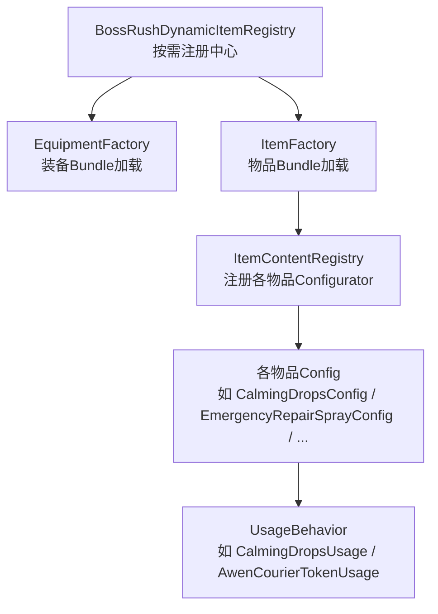
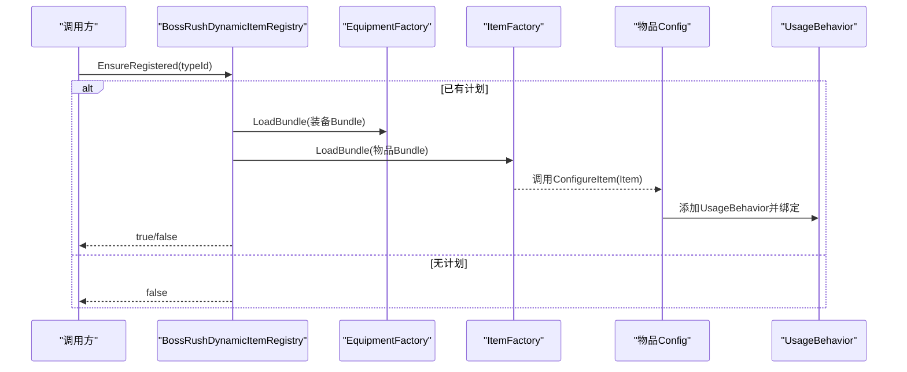
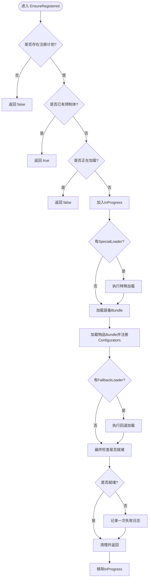
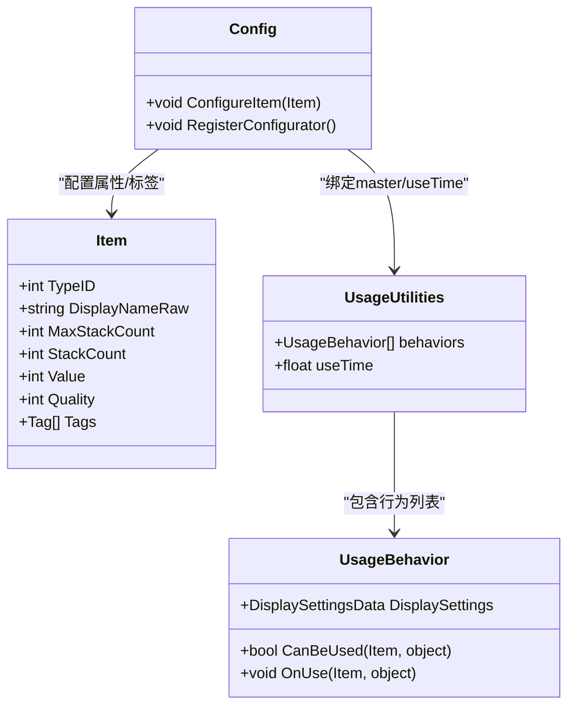
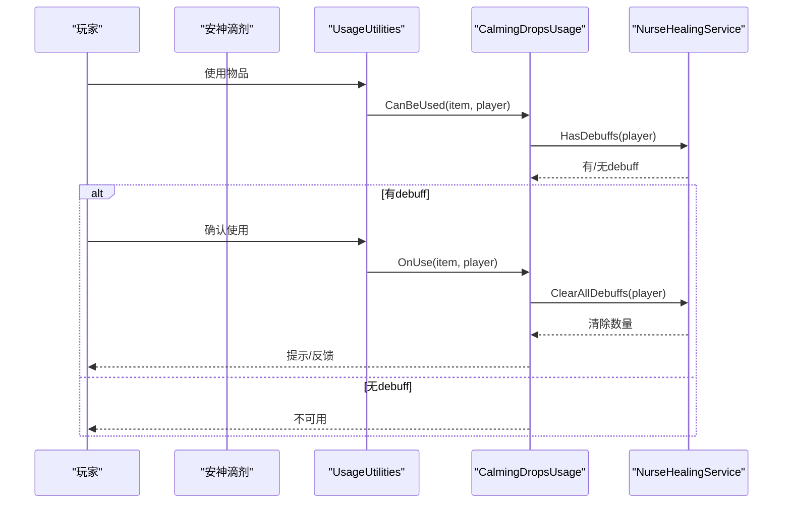
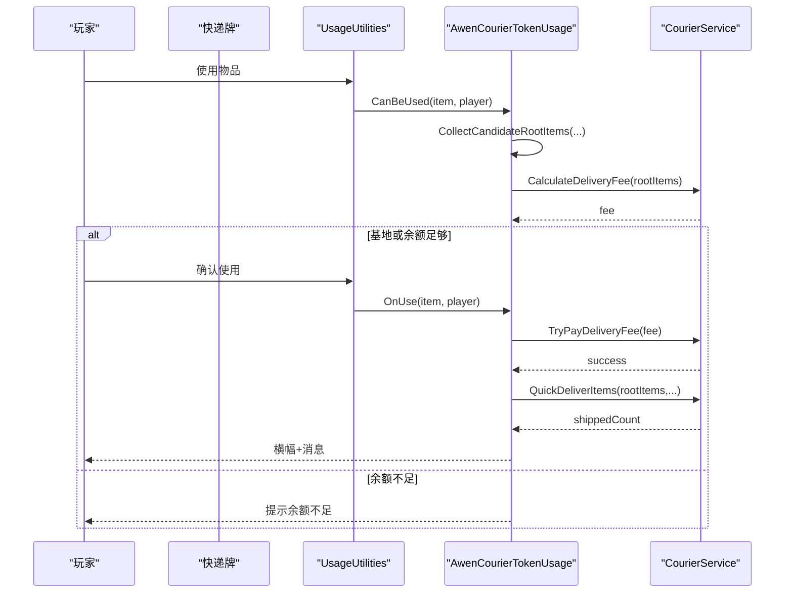
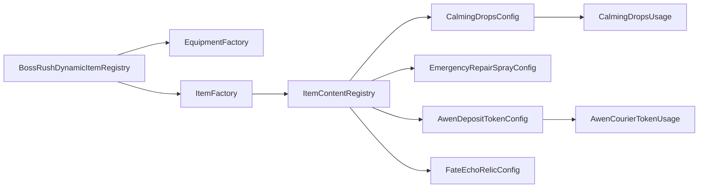

# 物品注册表与动态加载

<cite>
**本文引用的文件**
- [BossRushDynamicItemRegistry.cs](file://Integration/BossRushDynamicItemRegistry.cs)
- [ItemContentRegistry.cs](file://Integration/Items/ItemContentRegistry.cs)
- [CalmingDropsConfig.cs](file://Integration/Items/CalmingDropsConfig.cs)
- [CalmingDropsUsage.cs](file://Integration/Items/CalmingDropsUsage.cs)
- [EmergencyRepairSprayConfig.cs](file://Integration/Items/EmergencyRepairSprayConfig.cs)
- [AwenDepositTokenConfig.cs](file://Integration/Items/AwenDepositTokenConfig.cs)
- [AwenDepositTokenUsage.cs](file://Integration/Items/AwenDepositTokenUsage.cs)
- [FateEchoRelicConfig.cs](file://Integration/Items/FateEchoRelicConfig.cs)
- [ModeFItemConfigHelper.cs](file://Integration/Items/ModeFItemConfigHelper.cs)
- [WildHornConfig.cs](file://Integration/Items/WildHornConfig.cs)
- [DiamondConfig.cs](file://Integration/Items/DiamondConfig.cs)
</cite>

## 目录
1. [简介](#简介)
2. [项目结构](#项目结构)
3. [核心组件](#核心组件)
4. [架构总览](#架构总览)
5. [详细组件分析](#详细组件分析)
6. [依赖关系分析](#依赖关系分析)
7. [性能考虑](#性能考虑)
8. [故障排查指南](#故障排查指南)
9. [结论](#结论)
10. [附录：新物品开发指南](#附录新物品开发指南)

## 简介
本文件系统性阐述 BossRushMod 的物品注册表与动态加载系统，重点围绕 BossRushDynamicItemRegistry 的架构设计、物品注册机制、动态加载流程、内存管理策略；并详解多种游戏内物品的实现（消耗品、关键物品、模式专属物品）；说明物品配置系统 ItemConfig 的工作原理（含 JSON 配置解析、运行时修改、数据验证）；解释物品使用系统 Usage 的实现（触发逻辑、效果应用、状态管理）；最后提供新物品开发的完整指南以及性能优化与错误处理策略。

## 项目结构
该子系统位于 Integration 与 Integration/Items 下，采用“按功能域组织”的结构：
- 动态注册中心：BossRushDynamicItemRegistry.cs
- 内容配置器注册：ItemContentRegistry.cs
- 各物品配置与行为：Items 目录下以 Config + Usage 成对组织
- 通用辅助：ModeFItemConfigHelper.cs 等

图表来源
- [BossRushDynamicItemRegistry.cs:15-129](file://Integration/BossRushDynamicItemRegistry.cs#L15-L129)
- [ItemContentRegistry.cs:5-33](file://Integration/Items/ItemContentRegistry.cs#L5-L33)

章节来源
- [BossRushDynamicItemRegistry.cs:15-129](file://Integration/BossRushDynamicItemRegistry.cs#L15-L129)
- [ItemContentRegistry.cs:5-33](file://Integration/Items/ItemContentRegistry.cs#L5-L33)

## 核心组件
- 动态注册中心：BossRushDynamicItemRegistry
  - 职责：维护 TypeID 到“注册计划”的映射；在首次需要时按需加载 Bundle、执行特殊/回退加载；保证 prefab 可用；记录失败日志且仅一次；支持批量与全量注册。
  - 关键能力：
    - EnsureRegistered(typeId)：单例按需注册
    - EnsureAllRegistered()：全量注册
    - HasRegisteredPrefabWithoutEnsuring(typeId)：检查是否已就绪
    - ResetStaticCaches()：重置内部缓存
- 内容配置器注册：ItemContentRegistry
  - 职责：集中注册所有物品的 ConfigureItem 回调，供 ItemFactory 在加载对应 TypeID 时调用。
- 物品配置类（Config）：每个物品一个静态类，负责设置显示名、堆叠数、价值、品质、标签、绑定 UsageUtilities 与 UsageBehavior。
- 使用行为（Usage）：继承 UsageBehavior，实现 CanBeUsed 与 OnUse，封装触发条件与效果。

章节来源
- [BossRushDynamicItemRegistry.cs:15-129](file://Integration/BossRushDynamicItemRegistry.cs#L15-L129)
- [ItemContentRegistry.cs:5-33](file://Integration/Items/ItemContentRegistry.cs#L5-L33)

## 架构总览
下图展示从“外部请求 TypeID 获取物品”到“按需加载 Bundle/配置/行为”的完整链路。

图表来源
- [BossRushDynamicItemRegistry.cs:47-129](file://Integration/BossRushDynamicItemRegistry.cs#L47-L129)
- [BossRushDynamicItemRegistry.cs:187-227](file://Integration/BossRushDynamicItemRegistry.cs#L187-L227)
- [ItemContentRegistry.cs:5-33](file://Integration/Items/ItemContentRegistry.cs#L5-L33)

## 详细组件分析

### 动态注册中心：BossRushDynamicItemRegistry
- 设计要点
  - 注册计划（RegistrationPlan）：声明某 TypeID 所需的装备/物品 Bundle、特殊加载器、回退加载器。
  - 构建阶段（BuildPlans）：集中声明所有受管 TypeID 及其加载策略。
  - 运行阶段（EnsureRegistered）：
    - 若已存在预制体则直接返回
    - 若正在加载中则短路避免重复
    - 依次尝试：特殊加载器 → 装备Bundle → 物品Bundle → 回退加载器
    - 最终校验是否成功，否则记录一次警告日志
  - 安全与健壮性：
    - 通过 IsPatchBypassed 控制递归防护
    - 统一异常捕获与 DevLog
    - InProgress/FailureLogged 集合避免重复工作/重复告警
- 内存管理
  - 仅在首次访问时加载 Bundle
  - 对 AssetBundle 进行显式卸载（例如 bossrush_ticket 的特殊加载路径）
  - 通过 ItemAssetsCollection.AddDynamicEntry 将动态条目加入全局索引

图表来源
- [BossRushDynamicItemRegistry.cs:47-129](file://Integration/BossRushDynamicItemRegistry.cs#L47-L129)
- [BossRushDynamicItemRegistry.cs:265-351](file://Integration/BossRushDynamicItemRegistry.cs#L265-L351)

章节来源
- [BossRushDynamicItemRegistry.cs:15-129](file://Integration/BossRushDynamicItemRegistry.cs#L15-L129)
- [BossRushDynamicItemRegistry.cs:265-351](file://Integration/BossRushDynamicItemRegistry.cs#L265-L351)

### 物品配置系统（ItemConfig）工作原理
- 注册机制
  - 每个物品定义 TYPE_ID、BUNDLE_NAME、本地化键、描述等常量
  - 通过 ItemFactory.RegisterConfigurator(TYPE_ID, ConfigureItem) 注册配置器
  - ItemContentRegistry 集中调用各 Config.RegisterConfigurator() 完成统一注册
- 运行时修改
  - ConfigureItem 中可动态设置 DisplayNameRaw、MaxStackCount、Value、Quality、Tags 等
  - 通过反射为 UsageUtilities 注入 master/useTime，并将 UsageBehavior 加入 behaviors 列表
- 数据验证
  - 大量 try/catch 包裹反射与外部调用，失败时记录 DevLog
  - 对空引用、缺失组件、字段不存在等情况做防御性处理

图表来源
- [CalmingDropsConfig.cs:38-97](file://Integration/Items/CalmingDropsConfig.cs#L38-L97)
- [AwenDepositTokenConfig.cs:153-184](file://Integration/Items/AwenDepositTokenConfig.cs#L153-L184)
- [ModeFItemConfigHelper.cs:7-38](file://Integration/Items/ModeFItemConfigHelper.cs#L7-L38)

章节来源
- [ItemContentRegistry.cs:5-33](file://Integration/Items/ItemContentRegistry.cs#L5-L33)
- [CalmingDropsConfig.cs:38-97](file://Integration/Items/CalmingDropsConfig.cs#L38-L97)
- [ModeFItemConfigHelper.cs:7-38](file://Integration/Items/ModeFItemConfigHelper.cs#L7-L38)

### 消耗品：安神滴剂（CalmingDrops）
- 配置要点
  - 类型 ID、Bundle 名称、图标、本地化键、描述、使用说明常量
  - ConfigureItem 设置堆叠上限、隐藏描述字段、绑定 UsageUtilities 与 CalmingDropsUsage
- 使用行为
  - CanBeUsed：检测玩家是否有负面状态
  - OnUse：调用服务清除大部分负面 buff，并记录日志

图表来源
- [CalmingDropsConfig.cs:38-97](file://Integration/Items/CalmingDropsConfig.cs#L38-L97)
- [CalmingDropsUsage.cs:20-38](file://Integration/Items/CalmingDropsUsage.cs#L20-L38)

章节来源
- [CalmingDropsConfig.cs:38-97](file://Integration/Items/CalmingDropsConfig.cs#L38-L97)
- [CalmingDropsUsage.cs:20-38](file://Integration/Items/CalmingDropsUsage.cs#L20-L38)

### 关键物品：阿稳快递牌（Awen Courier Token）
- 配置要点
  - 类型 ID、Bundle/Prefab、本地化键、描述、使用说明、冷却时间
  - ConfigureItem 设置堆叠、价值、品质、隐藏描述、绑定 UsageUtilities 与 AwenCourierTokenUsage，并添加“快递”自定义 Tag
  - 商店注入：在基地场景向普通商人追加售卖条目
- 使用行为
  - CanBeUsed：收集可快递根物品，计算费用，判断余额
  - OnUse：协程异步执行，支付费用后快速投递，显示横幅与消息
  - 费用计算：基地免费，其他场景按服务计费

图表来源
- [AwenDepositTokenConfig.cs:153-184](file://Integration/Items/AwenDepositTokenConfig.cs#L153-L184)
- [AwenDepositTokenConfig.cs:189-266](file://Integration/Items/AwenDepositTokenConfig.cs#L189-L266)
- [AwenDepositTokenUsage.cs:28-116](file://Integration/Items/AwenDepositTokenUsage.cs#L28-L116)

章节来源
- [AwenDepositTokenConfig.cs:153-184](file://Integration/Items/AwenDepositTokenConfig.cs#L153-L184)
- [AwenDepositTokenConfig.cs:189-266](file://Integration/Items/AwenDepositTokenConfig.cs#L189-L266)
- [AwenDepositTokenUsage.cs:28-116](file://Integration/Items/AwenDepositTokenUsage.cs#L28-L116)

### 关键物品：宿命回响信物（Fate Echo Relic）
- 配置要点
  - 类型 ID、Bundle/Prefab、本地化键、描述
  - ConfigureItem 设置堆叠、价值、品质、隐藏描述，并添加 Key/SpecialKey/Special 标签
  - 商店注入：在基地场景向普通商人追加售卖条目
- 用途
  - 作为模式入口的关键道具，配合船票裸装进入 BossRush 并启动特定模式

章节来源
- [FateEchoRelicConfig.cs:27-58](file://Integration/Items/FateEchoRelicConfig.cs#L27-L58)
- [FateEchoRelicConfig.cs:63-120](file://Integration/Items/FateEchoRelicConfig.cs#L63-L120)

### 模式专属物品：应急维修喷剂（Emergency Repair Spray）
- 配置要点
  - 类型 ID、Bundle/Prefab、本地化键、描述
  - ConfigureItem 设置堆叠、价值、品质、隐藏描述，添加 Special 标签，并通过 ModeFItemUsageHelper 绑定 Mode F 专用使用逻辑
- 行为特征
  - 使用后进入选择界面，高亮附近受损工事，左键确认修复，恢复一定比例最大生命值

章节来源
- [EmergencyRepairSprayConfig.cs:17-43](file://Integration/Items/EmergencyRepairSprayConfig.cs#L17-L43)

### 其他示例：荒野号角（Wild Horn）与钻石（Diamond）
- 荒野号角
  - 配置耐久度、绑定 UsageUtilities 与 WildHornUsage，添加“坐骑”自定义 Tag
  - 用于召唤/呼唤坐骑，复用原生马匹系统
- 钻石
  - 配置 UsageUtilities 与 DiamondUsage，用于触发哥布林 NPC 响应

章节来源
- [WildHornConfig.cs:248-309](file://Integration/Items/WildHornConfig.cs#L248-L309)
- [DiamondConfig.cs:124-204](file://Integration/Items/DiamondConfig.cs#L124-L204)

## 依赖关系分析
- 耦合关系
  - BossRushDynamicItemRegistry 依赖 EquipmentFactory/ItemFactory 进行 Bundle 加载
  - ItemContentRegistry 集中注册各 Config，形成松耦合的内容扩展点
  - 各 Config 通过反射与工具类（ModeFItemConfigHelper）绑定 UsageUtilities/UsageBehavior
- 外部依赖
  - 游戏系统：ItemAssetsCollection、StockShop、NurseHealingService、CourierService 等
  - Unity：AssetBundle、SceneManager、ObjectCache 等

图表来源
- [BossRushDynamicItemRegistry.cs:187-227](file://Integration/BossRushDynamicItemRegistry.cs#L187-L227)
- [ItemContentRegistry.cs:5-33](file://Integration/Items/ItemContentRegistry.cs#L5-L33)

章节来源
- [BossRushDynamicItemRegistry.cs:187-227](file://Integration/BossRushDynamicItemRegistry.cs#L187-L227)
- [ItemContentRegistry.cs:5-33](file://Integration/Items/ItemContentRegistry.cs#L5-L33)

## 性能考虑
- 按需加载
  - 仅在首次访问 TypeID 时加载 Bundle，减少初始内存占用
  - 支持 EnsureAllRegistered 用于预热场景
- 去重与保护
  - InProgress 防止并发重复加载
  - FailureLogged 限制重复告警
  - IsPatchBypassed 防止递归探测
- 资源释放
  - 对临时 AssetBundle 使用助手进行卸载，避免内存泄漏
- 反射成本
  - 反射操作集中在配置阶段，且被 try/catch 包裹，失败即降级并记录日志
- 建议
  - 尽量将昂贵初始化放入 Config.ConfigureItem，并在首次使用时触发
  - 对高频路径（如 UI 查询）避免重复反射，必要时引入缓存

[本节为通用指导，不直接分析具体文件]

## 故障排查指南
- 常见问题定位
  - 未找到 Bundle：检查 BuildPlans 中是否正确声明 Bundle 名称
  - 配置失败：查看 DevLog 中的“配置物品失败”信息，确认反射字段/方法是否存在
  - 使用行为未生效：确认 UsageUtilities.behaviors 是否包含目标 UsageBehavior，master/useTime 是否绑定
  - 费用不足：检查 CourierService 余额与费用计算逻辑
- 调试手段
  - 使用 EnsureAllRegistered 强制预热，观察日志输出
  - 在 Config.ConfigureItem 与 UsageBehavior.OnUse 中加入关键日志
  - 通过 HasRegisteredPrefabWithoutEnsuring 检查注册结果

章节来源
- [BossRushDynamicItemRegistry.cs:229-263](file://Integration/BossRushDynamicItemRegistry.cs#L229-L263)
- [CalmingDropsConfig.cs:38-97](file://Integration/Items/CalmingDropsConfig.cs#L38-L97)
- [AwenDepositTokenUsage.cs:28-116](file://Integration/Items/AwenDepositTokenUsage.cs#L28-L116)

## 结论
BossRushDynamicItemRegistry 提供了稳定、可扩展、低侵入的物品动态注册与加载体系。通过“注册计划 + 按需加载 + 回退机制”，既保证了官方路径的兼容性，又实现了内容的热插拔。各物品 Config/Usage 解耦清晰，便于新增与迭代。结合严格的异常处理与日志记录，系统在复杂运行时环境下具备良好鲁棒性。

[本节为总结性内容，不直接分析具体文件]

## 附录：新物品开发指南
- 设计模式
  - 配置与行为分离：每个物品一个 Config 类负责元数据与绑定，一个或多个 UsageBehavior 负责交互逻辑
  - 集中注册：通过 ItemContentRegistry 统一注册，避免分散维护
  - 按需加载：在 BuildPlans 中声明 TypeID 与 Bundle，由注册中心按需加载
- 实现步骤
  1. 定义常量：TYPE_ID、BUNDLE_NAME、本地化键、描述、使用说明等
  2. 编写 ConfigureItem：设置基础属性、标签、绑定 UsageUtilities 与 UsageBehavior
  3. 编写 UsageBehavior：实现 CanBeUsed 与 OnUse，处理业务逻辑与反馈
  4. 注册配置器：在 ItemContentRegistry 中添加 RegisterConfigurator 调用
  5. 声明注册计划：在 BossRushDynamicItemRegistry.BuildPlans 中添加 TypeID 与 Bundle
  6. 可选：商店注入、本地化注入、特殊加载器/回退加载器
- 集成方法
  - 若需与系统服务交互（如 CourierService、NurseHealingService），请在 UsageBehavior 中调用
  - 若需 UI 反馈，使用 ModBehaviour 的消息/横幅接口
  - 若涉及场景切换或异步流程，优先使用协程以避免阻塞主线程
- 数据验证与容错
  - 对所有反射与外部调用进行 try/catch
  - 对空引用、缺失组件、非法参数进行前置检查
  - 记录清晰的 DevLog，便于问题定位
- 性能优化
  - 避免在高频路径中进行反射与对象分配
  - 合理使用缓存（如 Tag、字符串常量）
  - 按需加载 Bundle，必要时提供预热入口
- 错误处理策略
  - 失败降级：当 Bundle 加载失败时，尝试回退加载器或跳过
  - 幂等性：确保多次调用 ConfigureItem/注册不会造成副作用
  - 日志分级：区分警告与错误，避免刷屏

[本节为通用指导，不直接分析具体文件]