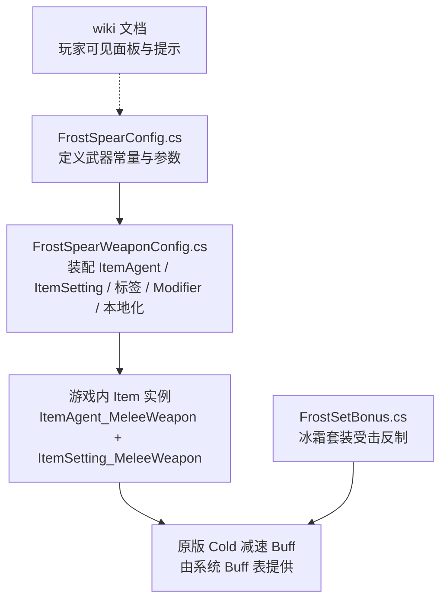
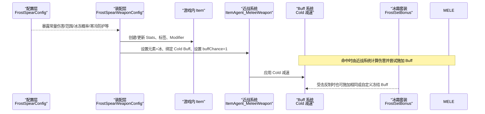
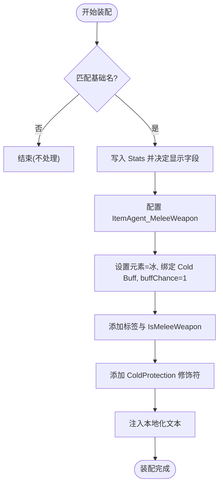
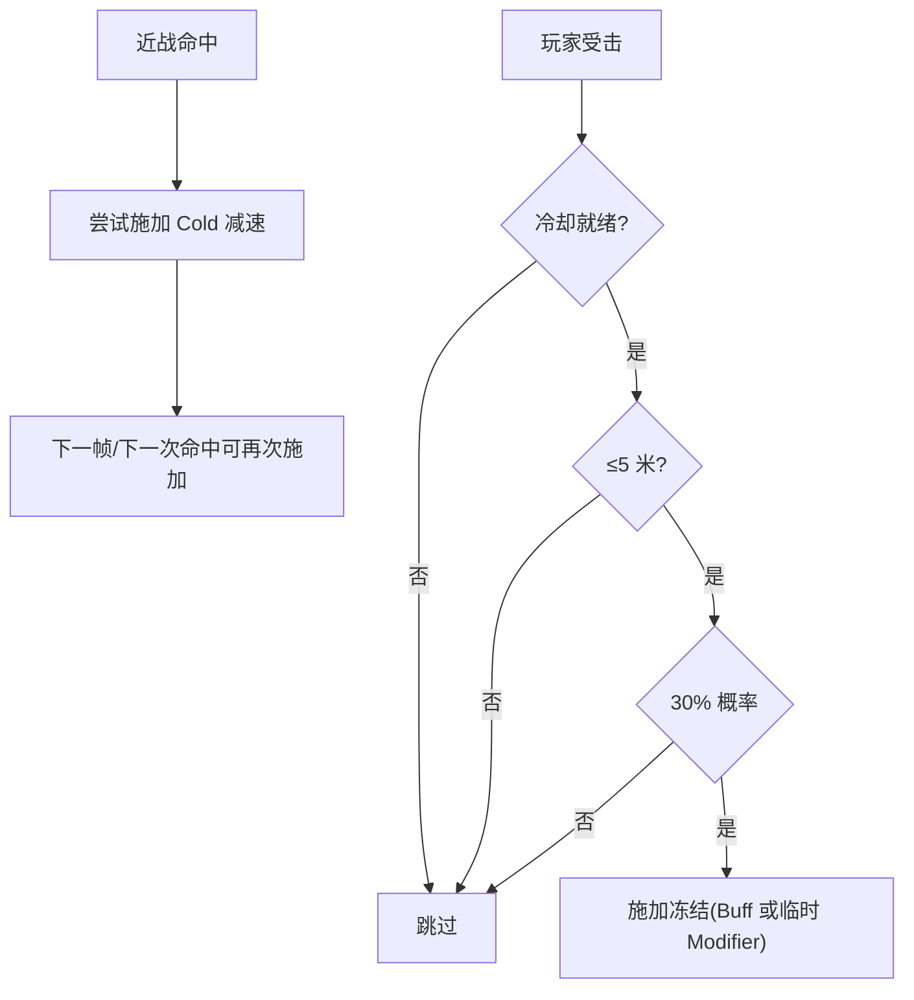
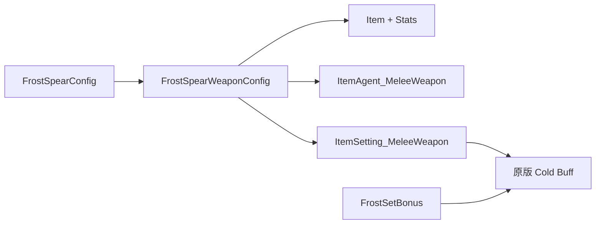

# 冰霜长矛（FrostSpear）

<cite>
**本文引用的文件**
- [FrostSpearConfig.cs](file://Integration/NewWeapons/FrostSpear/FrostSpearConfig.cs)
- [FrostSpearWeaponConfig.cs](file://Integration/NewWeapons/FrostSpear/FrostSpearWeaponConfig.cs)
- [FrostSetBonus.cs](file://Integration/Bonus/FrostSetBonus.cs)
- [frost-spear.md](file://wiki-site/docs/equipment/frost-spear.md)
- [frost-set.md](file://wiki-site/docs/en/equipment/frost-set.md)
</cite>

## 目录
1. [简介](#简介)
2. [项目结构](#项目结构)
3. [核心组件](#核心组件)
4. [架构总览](#架构总览)
5. [详细组件分析](#详细组件分析)
6. [依赖关系分析](#依赖关系分析)
7. [性能与实现要点](#性能与实现要点)
8. [故障排查指南](#故障排查指南)
9. [结论](#结论)
10. [附录：远程战斗策略与协同](#附录远程战斗策略与协同)

## 简介
本文件为“冰霜长矛”的完整技术文档，聚焦其作为近战武器却具备“类远程控场”能力的冰冻机制。该武器通过配置将每次命中绑定为冰属性伤害，并 100% 附加原版 Cold 减速效果；同时提供寒冷防护加成，适合中距离拉扯、稳定压制与低暴击流玩法。当前版本为开发预览，无常规获取途径。

## 项目结构
围绕冰霜长矛的实现主要位于 Integration/NewWeapons/FrostSpear 目录，包含配置常量与装备装配逻辑；与冰系套装的联动在 Integration/Bonus 下实现。Wiki 文档提供了面向玩家的数值与体验说明。

图表来源
- [FrostSpearConfig.cs:1-56](file://Integration/NewWeapons/FrostSpear/FrostSpearConfig.cs#L1-L56)
- [FrostSpearWeaponConfig.cs:50-182](file://Integration/NewWeapons/FrostSpear/FrostSpearWeaponConfig.cs#L50-L182)
- [FrostSetBonus.cs:237-260](file://Integration/Bonus/FrostSetBonus.cs#L237-L260)

章节来源
- [FrostSpearConfig.cs:1-56](file://Integration/NewWeapons/FrostSpear/FrostSpearConfig.cs#L1-L56)
- [FrostSpearWeaponConfig.cs:1-233](file://Integration/NewWeapons/FrostSpear/FrostSpearWeaponConfig.cs#L1-L233)
- [frost-spear.md:1-37](file://wiki-site/docs/equipment/frost-spear.md#L1-L37)

## 核心组件
- 配置常量：集中管理名称、描述、品质、伤害、攻速、范围、穿透、体力消耗、移速、格挡、冰冻概率、寒冷防护等。
- 装备装配器：在加载 AssetBundle 后为对应 Prefab 注入近战 Agent、设置元素与 Buff、添加标签与 Modifier、注入本地化。
- 冰系套装联动：受击时按概率冻结近身攻击者，优先使用自定义 FrostSet Buff，回退到原版 Cold，极端情况下以临时 Modifier 减速兜底。

章节来源
- [FrostSpearConfig.cs:22-49](file://Integration/NewWeapons/FrostSpear/FrostSpearConfig.cs#L22-L49)
- [FrostSpearWeaponConfig.cs:92-182](file://Integration/NewWeapons/FrostSpear/FrostSpearWeaponConfig.cs#L92-L182)
- [FrostSetBonus.cs:34-58](file://Integration/Bonus/FrostSetBonus.cs#L34-L58)

## 架构总览
冰霜长矛的核心流程是“配置→装配→运行时触发”。配置层提供所有可调参数；装配层在运行时将配置写入 Item 组件；战斗时由原战的近战判定与 Buff 系统完成伤害与减速结算。

图表来源
- [FrostSpearWeaponConfig.cs:151-182](file://Integration/NewWeapons/FrostSpear/FrostSpearWeaponConfig.cs#L151-L182)
- [FrostSetBonus.cs:237-260](file://Integration/Bonus/FrostSetBonus.cs#L237-L260)

## 详细组件分析

### 配置层：FrostSpearConfig
- 职责：集中定义武器名称、描述、品质、基础属性（伤害、攻速、范围、穿透、体力消耗、移速、格挡）、冰冻概率与寒冷防护。
- 关键参数
  - 品质：5
  - 伤害：32
  - 攻速：1.3
  - 攻击范围：2.4m
  - 暴击率：3%
  - 暴击伤害倍率：1.2x
  - 护甲穿透：3
  - 体力消耗：8/击
  - 出血概率：0%
  - 持械移速：104%
  - 格挡子弹：0.5
  - 冰冻触发概率：1（100%）
  - 寒冷防护加成：+1
- 设计要点：所有数值以常量形式暴露，便于装配器读取与后续平衡调整。

章节来源
- [FrostSpearConfig.cs:22-49](file://Integration/NewWeapons/FrostSpear/FrostSpearConfig.cs#L22-L49)

### 装配层：FrostSpearWeaponConfig
- 职责：在 EquipmentFactory 加载资源后，为目标 Item 注入近战能力、元素、Buff、标签、Modifier 与本地化。
- 关键流程
  - 统计项注入：将配置中的各项属性写入 Item.Stats，决定是否显示。
  - 近战 Agent：确保手持类型与动画类型为近战武器。
  - 近战设置：元素设为冰，关闭爆炸伤害；绑定原版 Cold Buff，并将 buffChance 设置为 1。
  - 标签与标记：添加 Weapon、MeleeWeapon、Special 等标签，并设置 IsMeleeWeapon。
  - Modifier：为 Item 增加 ColdProtection 加成。
  - 本地化：注入显示名与描述。
- 异常处理：对反射访问、Buff 查找、Modifier 添加等可能失败的路径进行 try/catch 保护，保证装配鲁棒性。

图表来源
- [FrostSpearWeaponConfig.cs:50-182](file://Integration/NewWeapons/FrostSpear/FrostSpearWeaponConfig.cs#L50-L182)

章节来源
- [FrostSpearWeaponConfig.cs:50-182](file://Integration/NewWeapons/FrostSpear/FrostSpearWeaponConfig.cs#L50-L182)

### 运行时：冰冻机制与叠加
- 冰冻来源
  - 武器命中：近战命中时，由 ItemSetting_MeleeWeapon 根据元素与 buffChance 调用系统 Buff 表，施加 Cold 减速。
  - 套装反制：受击时若满足距离与冷却条件，按概率对攻击者施加冻结（优先自定义 FrostSet Buff，否则回退到原版 Cold）。
- 叠加与持续时间
  - 武器侧：buffChance=1，意味着每次命中都会尝试施加 Cold；具体叠加规则与持续时间由原版 Cold Buff 决定，本模块未覆盖。
  - 套装侧：存在 5 秒冷却；若自定义 FrostSet Buff 不可用，则通过临时 WalkSpeed/RunSpeed 百分比乘算 Modifier 实现 -80% 减速，持续 2 秒，并在卸装或死亡时清理。
- 重要边界
  - 仅当目标存活且非自身时才生效。
  - 套装反制限定水平距离 ≤5 米。

图表来源
- [FrostSpearWeaponConfig.cs:151-182](file://Integration/NewWeapons/FrostSpear/FrostSpearWeaponConfig.cs#L151-L182)
- [FrostSetBonus.cs:207-260](file://Integration/Bonus/FrostSetBonus.cs#L207-L260)
- [FrostSetBonus.cs:271-329](file://Integration/Bonus/FrostSetBonus.cs#L271-L329)

章节来源
- [FrostSpearWeaponConfig.cs:151-182](file://Integration/NewWeapons/FrostSpear/FrostSpearWeaponConfig.cs#L151-L182)
- [FrostSetBonus.cs:207-329](file://Integration/Bonus/FrostSetBonus.cs#L207-L329)

### 物理弹道与碰撞检测
- 本武器为近战武器，不存在独立“弹道飞行体”的持久对象；命中判定由近战系统的碰撞与范围检测完成。
- 因此，不存在“穿透伤害、连锁反应”的弹道级实现；其“穿透”体现为护甲穿透属性，影响伤害结算而非弹道行为。
- 若未来扩展为投射物形态，应遵循仓库中其他投射物的最佳实践：使用运行期组件跟踪 transform、避免每帧直接访问全局主角色引用、及时注销与清理。

章节来源
- [FrostSpearWeaponConfig.cs:151-182](file://Integration/NewWeapons/FrostSpear/FrostSpearWeaponConfig.cs#L151-L182)

## 依赖关系分析
- 外部依赖
  - 原版 Buff 表：Cold 减速 Buff，用于武器命中时的减速。
  - 装备工厂：EquipmentFactory 负责资源加载与模型绑定。
  - 物品系统：Item、ItemAgent_MeleeWeapon、ItemSetting_MeleeWeapon、Stat、Modifier。
- 内部耦合
  - 配置与装配强耦合：装配器直接读取配置常量。
  - 套装与 Buff 系统弱耦合：通过统一接口获取 Buff，具备回退路径。

图表来源
- [FrostSpearWeaponConfig.cs:92-182](file://Integration/NewWeapons/FrostSpear/FrostSpearWeaponConfig.cs#L92-L182)
- [FrostSetBonus.cs:237-260](file://Integration/Bonus/FrostSetBonus.cs#L237-L260)

章节来源
- [FrostSpearWeaponConfig.cs:92-182](file://Integration/NewWeapons/FrostSpear/FrostSpearWeaponConfig.cs#L92-L182)
- [FrostSetBonus.cs:237-260](file://Integration/Bonus/FrostSetBonus.cs#L237-L260)

## 性能与实现要点
- 装配阶段一次性写入 Stats 与 Modifier，运行时开销极低。
- 冰冻触发依赖系统 Buff 表，避免重复分配与复杂逻辑。
- 套装反制的临时 Modifier 采用协程延时移除，并在卸装/死亡时集中清理，防止内存泄漏与状态残留。
- 建议：如需新增投射物形态，应复用仓库中已有的投射物运行期模式（缓存 transform、避免每帧全局查找、注册/注销生命周期清晰）。

[本节为通用指导，无需特定文件引用]

## 故障排查指南
- 未触发冰冻
  - 检查是否成功绑定 Cold Buff 且 buffChance=1。
  - 确认原版 Buff 表可用；若不可用，套装侧会回退至临时减速，但武器侧仍依赖原版 Buff。
- 套装反制无效
  - 检查是否在 5 米范围内、是否处于冷却、目标是否存活。
  - 若自定义 FrostSet Buff 缺失，会回退到原版 Cold；若仍不可用，将使用临时 Modifier 减速 2 秒。
- 卸装后仍有减速
  - 确认已调用停止协程与移除 Modifier 的逻辑；套装代码在停用/死亡时会集中清理。

章节来源
- [FrostSpearWeaponConfig.cs:151-182](file://Integration/NewWeapons/FrostSpear/FrostSpearWeaponConfig.cs#L151-L182)
- [FrostSetBonus.cs:207-329](file://Integration/Bonus/FrostSetBonus.cs#L207-L329)

## 结论
冰霜长矛以“近战武器 + 100% 冰冻减速”为核心定位，通过简洁的配置与装配实现稳定的中距离控场。其优势在于低风险输出与可控节奏，劣势是暴击上限较低。与冰霜套装配合可进一步提升生存与反打能力。对于需要“类远程”控制感的玩家而言，这是一把上手友好、容错较高的武器。

[本节为总结，无需特定文件引用]

## 附录：远程战斗策略与协同
- 站位选择
  - 利用 2.4 米攻击范围保持安全距离，优先在掩体边缘进行“点刺—回撤”的节奏输出。
  - 面对高机动敌人（如疾行者、骚扰者），首击即冻可有效降低被接近风险。
- 时机把握
  - 在 Boss 技能前摇或位移落点处提前预判，命中即冻能打断或延长其硬直窗口。
  - 避免在密集群怪中频繁挥砍，优先点杀高威胁目标。
- 团队配合
  - 与冰系增益装备协同：武器提供稳定减速，套装提供受击反制与冰抗，形成“输出—控制—生存”闭环。
  - 与召唤/分坦职业搭配：你负责控场与补刀，队友承担承伤与集火。
- 与其他冰系装备的协同
  - 冰霜套装：被动冰抗提升，受击反制冻结，与武器的稳定减速互补。
  - 其他冰系近战：通常也附带 Cold 效果，注意不要过度堆叠同种减速以避免收益递减（具体叠加规则以系统为准）。
- 新开发者参考（弹道与特效同步）
  - 若未来改为投射物形态，建议：
    - 使用独立的运行时组件管理位置更新与碰撞检测，避免每帧直接访问全局主角色。
    - 明确注册/注销生命周期，确保销毁时释放事件与协程。
    - 特效与逻辑分离：视觉轨迹与伤害/减速解耦，便于调参与性能优化。
  - 参考仓库中对投射物运行期的约束与最佳实践（例如缓存 transform、避免热路径分配、统一清理）。

[本节为概念性内容，无需特定文件引用]