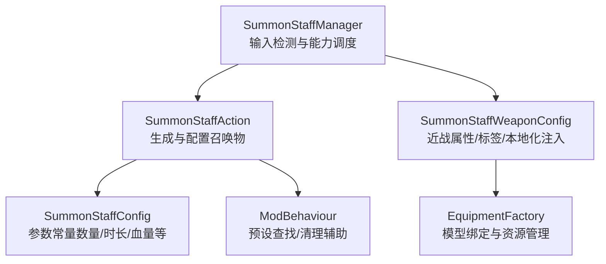
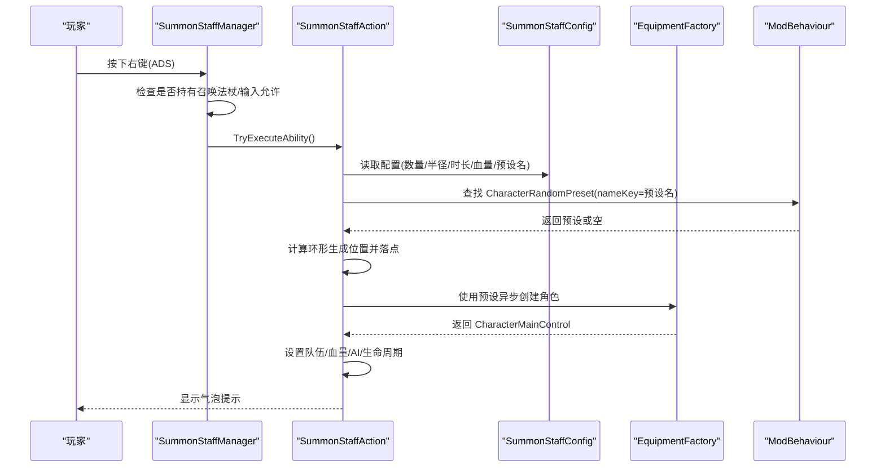
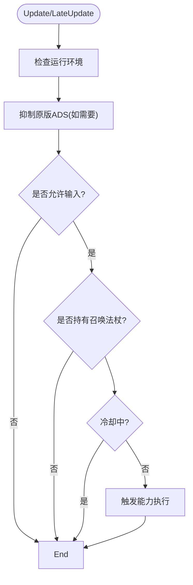
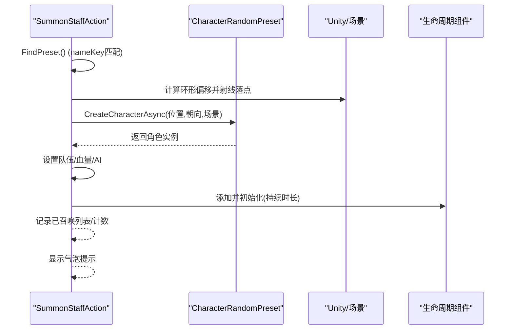
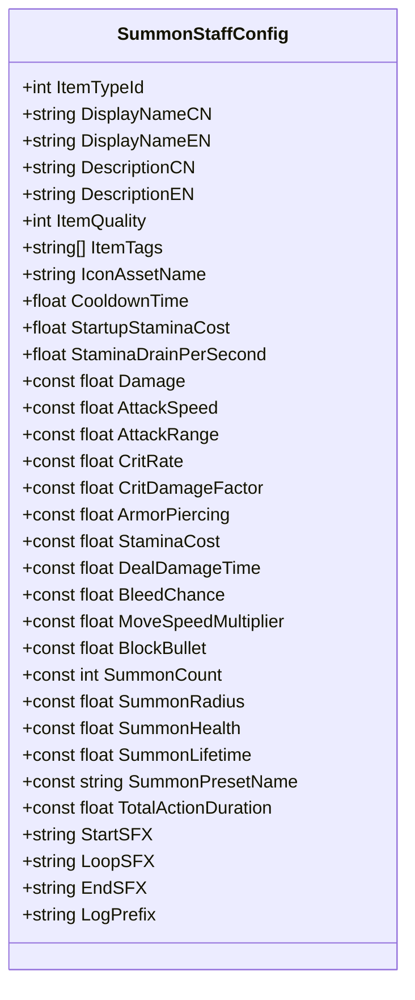
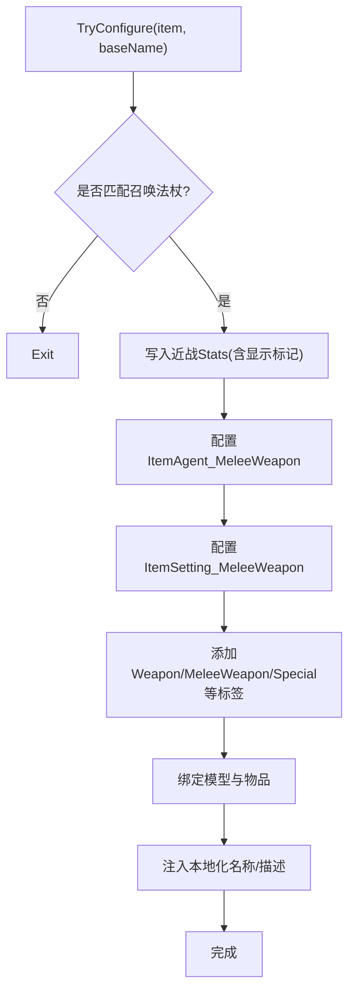
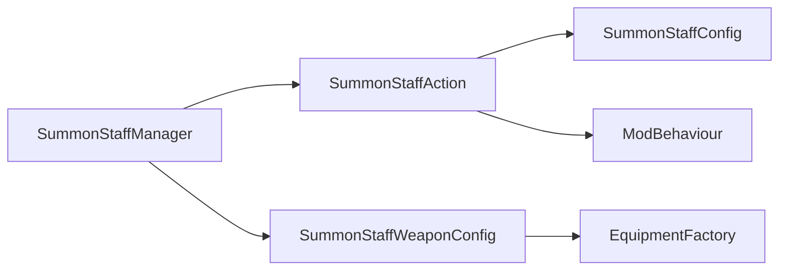

# 召唤法杖（SummonStaff）

<cite>
**本文引用的文件**
- [SummonStaffManager.cs](file://Integration/NewWeapons/SummonStaff/SummonStaffManager.cs)
- [SummonStaffAction.cs](file://Integration/NewWeapons/SummonStaff/SummonStaffAction.cs)
- [SummonStaffConfig.cs](file://Integration/NewWeapons/SummonStaff/SummonStaffConfig.cs)
- [SummonStaffWeaponConfig.cs](file://Integration/NewWeapons/SummonStaff/SummonStaffWeaponConfig.cs)
- [EquipmentFactory.cs](file://Integration/EquipmentFactory.cs)
- [ModBehaviour.cs](file://ModBehaviour.cs)
- [summon-staff.md](file://wiki-site/docs/en/equipment/summon-staff.md)
</cite>

## 目录
1. [简介](#简介)
2. [项目结构](#项目结构)
3. [核心组件](#核心组件)
4. [架构总览](#架构总览)
5. [详细组件分析](#详细组件分析)
6. [依赖关系分析](#依赖关系分析)
7. [性能考量](#性能考量)
8. [故障排查指南](#故障排查指南)
9. [结论](#结论)
10. [附录：战术与高级配置](#附录：战术与高级配置)

## 简介
召唤法杖是一件近战武器，自身伤害偏弱，但右键技能「灵魂召唤」可在玩家周围生成若干短命友军协助战斗。该实现通过装备能力管理器监听输入、在动作中异步生成并配置单位、为每个单位附加生命周期组件到期销毁，并通过预设名匹配复用游戏内角色模板。

## 项目结构
召唤法杖相关代码集中在 NewWeapons/SummonStaff 目录下，包含管理器、动作、配置与武器装配器；同时依赖通用装备工厂进行资源加载与本地化注入。

**图表来源**
- [SummonStaffManager.cs:17-84](file://Integration/NewWeapons/SummonStaff/SummonStaffManager.cs#L17-L84)
- [SummonStaffAction.cs:20-91](file://Integration/NewWeapons/SummonStaff/SummonStaffAction.cs#L20-L91)
- [SummonStaffConfig.cs:13-89](file://Integration/NewWeapons/SummonStaff/SummonStaffConfig.cs#L13-L89)
- [SummonStaffWeaponConfig.cs:23-88](file://Integration/NewWeapons/SummonStaff/SummonStaffWeaponConfig.cs#L23-L88)
- [EquipmentFactory.cs:132-200](file://Integration/EquipmentFactory.cs#L132-L200)
- [ModBehaviour.cs:1035-1090](file://ModBehaviour.cs#L1035-L1090)

**章节来源**
- [SummonStaffManager.cs:17-84](file://Integration/NewWeapons/SummonStaff/SummonStaffManager.cs#L17-L84)
- [SummonStaffAction.cs:20-91](file://Integration/NewWeapons/SummonStaff/SummonStaffAction.cs#L20-L91)
- [SummonStaffConfig.cs:13-89](file://Integration/NewWeapons/SummonStaff/SummonStaffConfig.cs#L13-L89)
- [SummonStaffWeaponConfig.cs:23-88](file://Integration/NewWeapons/SummonStaff/SummonStaffWeaponConfig.cs#L23-L88)
- [EquipmentFactory.cs:132-200](file://Integration/EquipmentFactory.cs#L132-L200)
- [ModBehaviour.cs:1035-1090](file://ModBehaviour.cs#L1035-L1090)

## 核心组件
- 管理器（SummonStaffManager）：负责右键输入检测、持有判定、冷却控制、原生 ADS 抑制与场景切换时的缓存重置。
- 动作（SummonStaffAction）：执行「灵魂召唤」的完整流程，包括预设查找、位置计算、异步生成、AI 初始化、生命值设置、生命周期挂载与 UI 反馈。
- 配置（SummonStaffConfig）：定义物品信息、近战属性、召唤数量、半径、血量、持续时间、预设名等常量。
- 武器装配器（SummonStaffWeaponConfig）：在装备工厂加载后为法杖注入近战 Stats、Melee 组件、标签与本地化文本。
- 装备工厂（EquipmentFactory）：提供 AssetBundle 加载、模型绑定与缓存机制，支撑武器装配。
- 运行时桥接（ModBehaviour）：提供预设查找、清理与工具方法，供召唤逻辑复用。

**章节来源**
- [SummonStaffManager.cs:17-84](file://Integration/NewWeapons/SummonStaff/SummonStaffManager.cs#L17-L84)
- [SummonStaffAction.cs:20-91](file://Integration/NewWeapons/SummonStaff/SummonStaffAction.cs#L20-L91)
- [SummonStaffConfig.cs:13-89](file://Integration/NewWeapons/SummonStaff/SummonStaffConfig.cs#L13-L89)
- [SummonStaffWeaponConfig.cs:23-88](file://Integration/NewWeapons/SummonStaff/SummonStaffWeaponConfig.cs#L23-L88)
- [EquipmentFactory.cs:132-200](file://Integration/EquipmentFactory.cs#L132-L200)
- [ModBehaviour.cs:1035-1090](file://ModBehaviour.cs#L1035-L1090)

## 架构总览
下图展示了从输入到召唤完成的关键调用链路与数据流。

**图表来源**
- [SummonStaffManager.cs:92-112](file://Integration/NewWeapons/SummonStaff/SummonStaffManager.cs#L92-L112)
- [SummonStaffAction.cs:102-196](file://Integration/NewWeapons/SummonStaff/SummonStaffAction.cs#L102-L196)
- [SummonStaffConfig.cs:49-79](file://Integration/NewWeapons/SummonStaff/SummonStaffConfig.cs#L49-L79)
- [ModBehaviour.cs:1035-1090](file://ModBehaviour.cs#L1035-L1090)

## 详细组件分析

### 管理器：SummonStaffManager
- 职责
  - 每帧检测右键输入，屏蔽原版 ADS 动画干扰。
  - 校验当前是否持有召唤法杖、是否允许输入、是否在冷却中。
  - 将能力执行委托给 SummonStaffAction。
- 关键点
  - 持有判定通过近战武器槽或手持物品槽的类型 ID 匹配。
  - 输入合法性检查包含时间缩放、光标锁定、UI 遮挡等。
  - 场景切换时重置预设缓存，避免跨场景引用失效。

**图表来源**
- [SummonStaffManager.cs:31-112](file://Integration/NewWeapons/SummonStaff/SummonStaffManager.cs#L31-L112)
- [SummonStaffManager.cs:133-183](file://Integration/NewWeapons/SummonStaff/SummonStaffManager.cs#L133-L183)

**章节来源**
- [SummonStaffManager.cs:31-112](file://Integration/NewWeapons/SummonStaff/SummonStaffManager.cs#L31-L112)
- [SummonStaffManager.cs:133-183](file://Integration/NewWeapons/SummonStaff/SummonStaffManager.cs#L133-L183)

### 动作：SummonStaffAction
- 职责
  - 执行「灵魂召唤」：查找预设、计算生成位、异步生成单位、配置 AI、设置血量、挂载生命周期、显示提示。
- 关键点
  - 预设查找基于 nameKey 精确匹配，结果缓存以避免重复扫描。
  - 生成位置按均分角度分布在玩家周围半径处，并进行地面吸附。
  - 通过 ModBehaviour 提供的工具方法进行安全清理与兼容处理。
  - 使用请求 ID 防止并发/重入导致的竞态问题。

**图表来源**
- [SummonStaffAction.cs:102-196](file://Integration/NewWeapons/SummonStaff/SummonStaffAction.cs#L102-L196)
- [SummonStaffAction.cs:209-237](file://Integration/NewWeapons/SummonStaff/SummonStaffAction.cs#L209-L237)
- [SummonStaffAction.cs:239-281](file://Integration/NewWeapons/SummonStaff/SummonStaffAction.cs#L239-L281)
- [SummonStaffAction.cs:283-318](file://Integration/NewWeapons/SummonStaff/SummonStaffAction.cs#L283-L318)

**章节来源**
- [SummonStaffAction.cs:102-196](file://Integration/NewWeapons/SummonStaff/SummonStaffAction.cs#L102-L196)
- [SummonStaffAction.cs:209-237](file://Integration/NewWeapons/SummonStaff/SummonStaffAction.cs#L209-L237)
- [SummonStaffAction.cs:239-281](file://Integration/NewWeapons/SummonStaff/SummonStaffAction.cs#L239-L281)
- [SummonStaffAction.cs:283-318](file://Integration/NewWeapons/SummonStaff/SummonStaffAction.cs#L283-L318)

### 配置：SummonStaffConfig
- 内容
  - 物品基础信息：类型ID、名称、描述、品质、标签、图标。
  - 右键技能参数：冷却、启动耐力消耗、每秒耐力消耗。
  - 近战属性：伤害、攻速、范围、暴击率/倍率、穿透、耐力消耗、攻击耗时、流血概率、移速加成、格挡子弹比例。
  - 召唤参数：数量、半径、血量、存活时长、预设名、技能总持续时间。
  - 音效与日志前缀。

**图表来源**
- [SummonStaffConfig.cs:13-89](file://Integration/NewWeapons/SummonStaff/SummonStaffConfig.cs#L13-L89)

**章节来源**
- [SummonStaffConfig.cs:13-89](file://Integration/NewWeapons/SummonStaff/SummonStaffConfig.cs#L13-L89)

### 武器装配：SummonStaffWeaponConfig
- 职责
  - 在装备工厂加载资源后，为目标 Prefab 注入近战 Stats、Melee 组件、标签与本地化文本。
- 关键点
  - 通过字典批量写入 Stats，区分显示项与非显示项。
  - 动态添加/配置 Melee 组件，并尝试设置声音键。
  - 绑定模型与物品，确保展示一致。
  - 注入本地化名称与描述。

**图表来源**
- [SummonStaffWeaponConfig.cs:52-88](file://Integration/NewWeapons/SummonStaff/SummonStaffWeaponConfig.cs#L52-L88)
- [SummonStaffWeaponConfig.cs:90-193](file://Integration/NewWeapons/SummonStaff/SummonStaffWeaponConfig.cs#L90-L193)

**章节来源**
- [SummonStaffWeaponConfig.cs:52-88](file://Integration/NewWeapons/SummonStaff/SummonStaffWeaponConfig.cs#L52-L88)
- [SummonStaffWeaponConfig.cs:90-193](file://Integration/NewWeapons/SummonStaff/SummonStaffWeaponConfig.cs#L90-L193)

### 装备工厂：EquipmentFactory
- 职责
  - 自动扫描并加载 Assets/Equipment 下的 AssetBundle，维护模型/Buff/子弹缓存，支持手动加载与查询。
- 对召唤法杖的意义
  - 为武器装配提供模型绑定与资源管理能力，确保法杖外观与交互正确。

**章节来源**
- [EquipmentFactory.cs:132-200](file://Integration/EquipmentFactory.cs#L132-L200)

## 依赖关系分析
- 管理器依赖动作与配置，动作依赖配置与运行时工具（ModBehaviour），装配器依赖装备工厂。
- 预设查找通过 nameKey 精确匹配，避免误用其他单位模板。
- 所有外部调用均包含异常保护与最佳努力回退，提升鲁棒性。

**图表来源**
- [SummonStaffManager.cs:17-84](file://Integration/NewWeapons/SummonStaff/SummonStaffManager.cs#L17-L84)
- [SummonStaffAction.cs:20-91](file://Integration/NewWeapons/SummonStaff/SummonStaffAction.cs#L20-L91)
- [SummonStaffWeaponConfig.cs:23-88](file://Integration/NewWeapons/SummonStaff/SummonStaffWeaponConfig.cs#L23-L88)
- [EquipmentFactory.cs:132-200](file://Integration/EquipmentFactory.cs#L132-L200)
- [ModBehaviour.cs:1035-1090](file://ModBehaviour.cs#L1035-L1090)

**章节来源**
- [SummonStaffManager.cs:17-84](file://Integration/NewWeapons/SummonStaff/SummonStaffManager.cs#L17-L84)
- [SummonStaffAction.cs:20-91](file://Integration/NewWeapons/SummonStaff/SummonStaffAction.cs#L20-L91)
- [SummonStaffWeaponConfig.cs:23-88](file://Integration/NewWeapons/SummonStaff/SummonStaffWeaponConfig.cs#L23-L88)
- [EquipmentFactory.cs:132-200](file://Integration/EquipmentFactory.cs#L132-L200)
- [ModBehaviour.cs:1035-1090](file://ModBehaviour.cs#L1035-L1090)

## 性能考量
- 预设缓存：首次查找后缓存 CharacterRandomPreset，减少后续扫描开销。
- 异步生成：使用异步任务逐只生成，并在每只之间让出一帧，避免卡顿。
- 对象生命周期：为每个召唤物附加独立生命周期组件，到期自动销毁，避免内存泄漏。
- 列表清理：定期清理死亡或无效的召唤物引用，保持 summonedAllies 列表精简。
- 输入与状态检查：多重重入与场景一致性校验，避免无效操作与资源浪费。
- 建议优化
  - 可考虑引入对象池复用召唤物实例，降低频繁 Instantiate/Destroy 的分配压力。
  - 将地面吸附与碰撞层采样频率适当降低或在热路径中缓存层掩码。
  - 在大规模敌人场景中，限制同屏召唤上限或根据性能档位动态调整数量。

[本节为通用性能讨论，不直接分析具体文件]

## 故障排查指南
- 无法触发右键技能
  - 检查是否持有召唤法杖（近战槽或手持槽）。
  - 检查输入是否被 UI 遮挡、时间缩放是否为 0、光标是否解锁。
  - 确认技能冷却是否仍在计时。
- 未生成召唤物
  - 确认预设 nameKey 是否存在且可匹配。
  - 查看预设查找是否失败或场景索引不一致导致中断。
  - 检查生成位置是否有效（地面射线命中）。
- 召唤物不消失或残留
  - 确认生命周期组件是否正确挂载与初始化。
  - 场景切换时是否调用了缓存重置与全部清理接口。
- 性能掉帧
  - 观察是否在同一帧内大量生成。
  - 评估是否需要降低召唤数量或启用对象池。

**章节来源**
- [SummonStaffManager.cs:92-112](file://Integration/NewWeapons/SummonStaff/SummonStaffManager.cs#L92-L112)
- [SummonStaffAction.cs:102-196](file://Integration/NewWeapons/SummonStaff/SummonStaffAction.cs#L102-L196)
- [SummonStaffAction.cs:209-237](file://Integration/NewWeapons/SummonStaff/SummonStaffAction.cs#L209-L237)
- [SummonStaffAction.cs:320-359](file://Integration/NewWeapons/SummonStaff/SummonStaffAction.cs#L320-L359)

## 结论
召唤法杖以“低个人输出、高召唤压场”为核心设计，通过管理器与动作解耦输入与生成流程，借助配置集中管理数值与行为，配合装备工厂完成资源装配。整体实现简洁稳健，具备良好扩展性与容错能力。未来可通过对象池、动态难度适配与更丰富的 AI 行为进一步释放其战术潜力。

[本节为总结性内容，不直接分析具体文件]

## 附录：战术与高级配置
- 战术指导
  - 利用 3 个召唤物分散 Boss 仇恨，创造安全的输出窗口。
  - 在僵尸模式或多敌场景中发挥最大价值，吸引火力并拖延关键技能。
  - 合理把握 12 秒冷却与 15 秒寿命，尽量在到期后立即续召以保持高覆盖率。
- 高级配置技巧
  - 调整 SummonCount、SummonLifetime、SummonHealth 以平衡强度与性能。
  - 修改 SummonRadius 以改变站位密度，避免拥挤或过散。
  - 更换 SummonPresetName 以切换不同兵种外观与基础行为（需确保预设存在）。
  - 微调近战属性（Damage、AttackSpeed、AttackRange 等）以契合不同玩法风格。
- 获取说明
  - 当前版本无常规获取途径，仅可通过开发/调试授予；未来更新计划加入获取路径。

**章节来源**
- [summon-staff.md:1-38](file://wiki-site/docs/en/equipment/summon-staff.md#L1-L38)
- [SummonStaffConfig.cs:49-79](file://Integration/NewWeapons/SummonStaff/SummonStaffConfig.cs#L49-L79)
- [SummonStaffWeaponConfig.cs:28-47](file://Integration/NewWeapons/SummonStaff/SummonStaffWeaponConfig.cs#L28-L47)