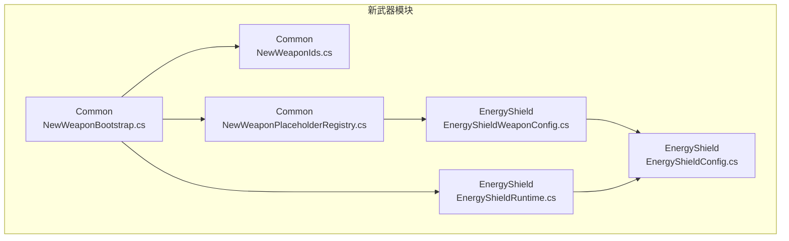
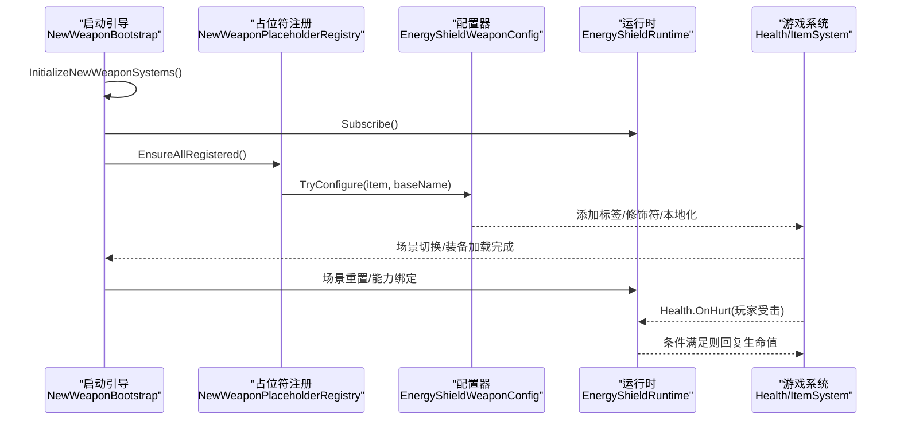
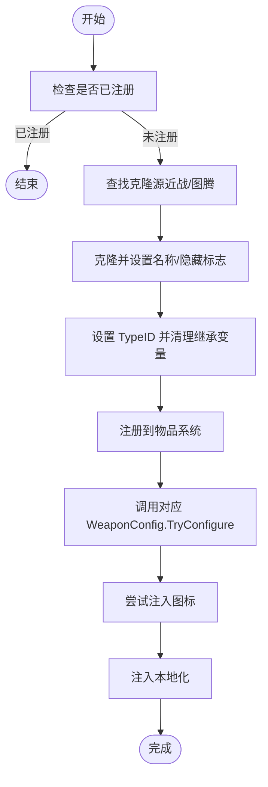
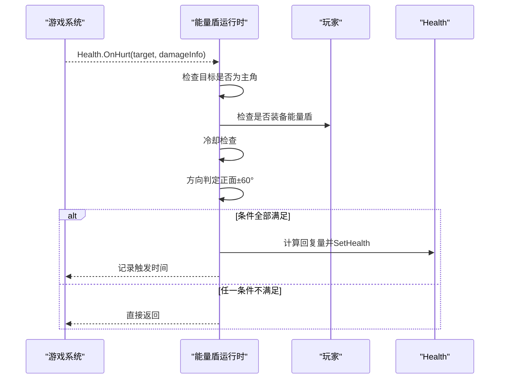
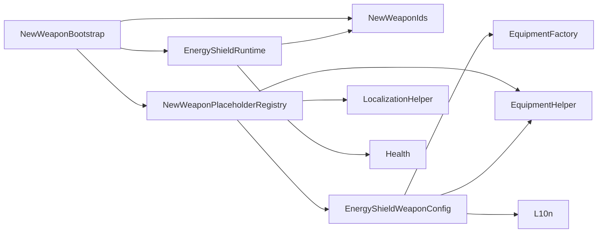

# 武器开发指南

<cite>
**本文引用的文件**
- [NewWeaponBootstrap.cs](file://Integration/NewWeapons/Common/NewWeaponBootstrap.cs)
- [NewWeaponIds.cs](file://Integration/NewWeapons/Common/NewWeaponIds.cs)
- [NewWeaponPlaceholderRegistry.cs](file://Integration/NewWeapons/Common/NewWeaponPlaceholderRegistry.cs)
- [EnergyShieldConfig.cs](file://Integration/NewWeapons/EnergyShield/EnergyShieldConfig.cs)
- [EnergyShieldRuntime.cs](file://Integration/NewWeapons/EnergyShield/EnergyShieldRuntime.cs)
- [EnergyShieldWeaponConfig.cs](file://Integration/NewWeapons/EnergyShield/EnergyShieldWeaponConfig.cs)
</cite>

## 目录
1. [简介](#简介)
2. [项目结构](#项目结构)
3. [核心组件](#核心组件)
4. [架构总览](#架构总览)
5. [详细组件分析](#详细组件分析)
6. [依赖关系分析](#依赖关系分析)
7. [性能考虑](#性能考虑)
8. [故障排查指南](#故障排查指南)
9. [结论](#结论)
10. [附录：新武器模板与脚手架](#附录新武器模板与脚手架)

## 简介
本指南面向希望在本项目中新增自定义武器的开发者，覆盖从概念设计到最终实现的全流程。重点说明武器配置器（WeaponConfig）的设计模式与扩展点、属性定义、标签系统、Buff 关联机制；讲解武器与游戏系统的集成方式（事件订阅、状态管理、网络同步建议）；提供测试方法与调试工具使用建议；给出性能优化与平衡性调优方法论；并为高级开发者提供框架扩展与定制指导。

## 项目结构
本项目采用“按功能域组织”的结构，新武器统一位于 Integration/NewWeapons 下，每个武器一个子目录，包含配置、运行时逻辑与 WeaponConfig 配置器。Common 目录提供启动引导、ID 常量与占位符注册等公共能力。

图示来源
- [NewWeaponBootstrap.cs:21-58](file://Integration/NewWeapons/Common/NewWeaponBootstrap.cs#L21-L58)
- [NewWeaponIds.cs:13-49](file://Integration/NewWeapons/Common/NewWeaponIds.cs#L13-L49)
- [NewWeaponPlaceholderRegistry.cs:36-56](file://Integration/NewWeapons/Common/NewWeaponPlaceholderRegistry.cs#L36-L56)
- [EnergyShieldConfig.cs:14-56](file://Integration/NewWeapons/EnergyShield/EnergyShieldConfig.cs#L14-L56)
- [EnergyShieldRuntime.cs:21-52](file://Integration/NewWeapons/EnergyShield/EnergyShieldRuntime.cs#L21-L52)
- [EnergyShieldWeaponConfig.cs:20-59](file://Integration/NewWeapons/EnergyShield/EnergyShieldWeaponConfig.cs#L20-L59)

章节来源
- [NewWeaponBootstrap.cs:21-58](file://Integration/NewWeapons/Common/NewWeaponBootstrap.cs#L21-L58)
- [NewWeaponIds.cs:13-49](file://Integration/NewWeapons/Common/NewWeaponIds.cs#L13-L49)
- [NewWeaponPlaceholderRegistry.cs:36-56](file://Integration/NewWeapons/Common/NewWeaponPlaceholderRegistry.cs#L36-L56)

## 核心组件
- 启动与生命周期管理：负责初始化各武器运行时、场景切换处理与清理。
- ID 常量集中管理：统一管理 TypeID、Bundle 名、Prefab 基础名与图标资源名。
- 占位符注册：在 AssetBundle 缺失时创建占位 Item，并调用对应 WeaponConfig 完成属性/标签/Buff 注入。
- 武器配置器（WeaponConfig）：为具体武器绑定模型、添加标签、修改器、本地化与 Buff 关联。
- 武器运行时：监听游戏事件（如伤害事件），执行武器专属逻辑（如方向判定、冷却控制）。
- 武器配置常量：集中存放数值与行为参数，便于调参与平衡性调整。

章节来源
- [NewWeaponBootstrap.cs:21-58](file://Integration/NewWeapons/Common/NewWeaponBootstrap.cs#L21-L58)
- [NewWeaponIds.cs:13-49](file://Integration/NewWeapons/Common/NewWeaponIds.cs#L13-L49)
- [NewWeaponPlaceholderRegistry.cs:121-232](file://Integration/NewWeapons/Common/NewWeaponPlaceholderRegistry.cs#L121-L232)
- [EnergyShieldWeaponConfig.cs:20-59](file://Integration/NewWeapons/EnergyShield/EnergyShieldWeaponConfig.cs#L20-L59)
- [EnergyShieldRuntime.cs:21-52](file://Integration/NewWeapons/EnergyShield/EnergyShieldRuntime.cs#L21-L52)
- [EnergyShieldConfig.cs:14-56](file://Integration/NewWeapons/EnergyShield/EnergyShieldConfig.cs#L14-L56)

## 架构总览
新武器系统通过“启动引导 + 占位符注册 + 配置器 + 运行时”的分层架构解耦内容加载、配置装配与运行时行为。启动引导在合适时机订阅事件、创建管理器、延迟绑定能力；占位符注册确保即使缺少资源也能注册物品并完成配置；配置器负责将数据驱动的属性、标签、Buff 写入物品；运行时监听事件执行具体玩法逻辑。

图示来源
- [NewWeaponBootstrap.cs:21-58](file://Integration/NewWeapons/Common/NewWeaponBootstrap.cs#L21-L58)
- [NewWeaponPlaceholderRegistry.cs:121-232](file://Integration/NewWeapons/Common/NewWeaponPlaceholderRegistry.cs#L121-L232)
- [EnergyShieldWeaponConfig.cs:20-59](file://Integration/NewWeapons/EnergyShield/EnergyShieldWeaponConfig.cs#L20-L59)
- [EnergyShieldRuntime.cs:31-52](file://Integration/NewWeapons/EnergyShield/EnergyShieldRuntime.cs#L31-L52)

## 详细组件分析

### 启动引导（NewWeaponBootstrap）
- 职责：初始化新武器系统、订阅运行时事件、场景切换后重置状态、延迟绑定召唤法杖能力、清理静态缓存。
- 关键点：
  - 在初始化阶段订阅各武器运行时事件，避免重复订阅。
  - 场景切换时通知管理器更新、重置静态缓存，防止跨场景状态污染。
  - 延迟绑定能力以等待玩家角色就绪，提升鲁棒性。
  - 清理阶段取消订阅、清理召唤物、重置所有静态缓存。

章节来源
- [NewWeaponBootstrap.cs:21-58](file://Integration/NewWeapons/Common/NewWeaponBootstrap.cs#L21-L58)
- [NewWeaponBootstrap.cs:65-95](file://Integration/NewWeapons/Common/NewWeaponBootstrap.cs#L65-L95)
- [NewWeaponBootstrap.cs:100-136](file://Integration/NewWeapons/Common/NewWeaponBootstrap.cs#L100-L136)
- [NewWeaponBootstrap.cs:143-186](file://Integration/NewWeapons/Common/NewWeaponBootstrap.cs#L143-L186)
- [NewWeaponBootstrap.cs:193-222](file://Integration/NewWeapons/Common/NewWeaponBootstrap.cs#L193-L222)

### ID 常量（NewWeaponIds）
- 职责：集中管理五把新武器的 TypeID、Bundle 名、Prefab 基础名与图标资源名。
- 价值：避免硬编码散落各处，便于维护与扩展。

章节来源
- [NewWeaponIds.cs:13-49](file://Integration/NewWeapons/Common/NewWeaponIds.cs#L13-L49)

### 占位符注册（NewWeaponPlaceholderRegistry）
- 职责：当 AssetBundle 缺失时，克隆已有物品模板创建占位 Item，并立即调用对应 WeaponConfig.TryConfigure 完成 Stats/标签/Buff 注入。
- 关键点：
  - 支持按 TypeID 按需注册，供动态注册器调用。
  - 图腾类优先选择真实图腾作为克隆源，保证槽位匹配正确。
  - 注入用户提供的图标 PNG，失败时保留原图标不影响功能。
  - 注入本地化文本，确保 UI 显示正常。

图示来源
- [NewWeaponPlaceholderRegistry.cs:121-232](file://Integration/NewWeapons/Common/NewWeaponPlaceholderRegistry.cs#L121-L232)
- [NewWeaponPlaceholderRegistry.cs:239-262](file://Integration/NewWeapons/Common/NewWeaponPlaceholderRegistry.cs#L239-L262)
- [NewWeaponPlaceholderRegistry.cs:333-368](file://Integration/NewWeapons/Common/NewWeaponPlaceholderRegistry.cs#L333-L368)
- [NewWeaponPlaceholderRegistry.cs:373-424](file://Integration/NewWeapons/Common/NewWeaponPlaceholderRegistry.cs#L373-L424)

章节来源
- [NewWeaponPlaceholderRegistry.cs:36-56](file://Integration/NewWeapons/Common/NewWeaponPlaceholderRegistry.cs#L36-L56)
- [NewWeaponPlaceholderRegistry.cs:121-232](file://Integration/NewWeapons/Common/NewWeaponPlaceholderRegistry.cs#L121-L232)
- [NewWeaponPlaceholderRegistry.cs:239-262](file://Integration/NewWeapons/Common/NewWeaponPlaceholderRegistry.cs#L239-L262)
- [NewWeaponPlaceholderRegistry.cs:333-368](file://Integration/NewWeapons/Common/NewWeaponPlaceholderRegistry.cs#L333-L368)
- [NewWeaponPlaceholderRegistry.cs:373-424](file://Integration/NewWeapons/Common/NewWeaponPlaceholderRegistry.cs#L373-L424)

### 能量盾配置（EnergyShieldConfig）
- 职责：集中定义能量盾的本地化文案、品质、运行时参数（正面吸收比例、角度阈值、冷却、单次最大回复、护甲加成等）。
- 价值：数值可调、描述清晰，便于平衡性调参与文档化。

章节来源
- [EnergyShieldConfig.cs:14-56](file://Integration/NewWeapons/EnergyShield/EnergyShieldConfig.cs#L14-L56)

### 能量盾运行时（EnergyShieldRuntime）
- 职责：监听 Health.OnHurt 事件，当玩家装备能量盾且受到来自正面的攻击时，按比例回复生命值，并受冷却限制。
- 关键点：
  - 早期退出策略：仅处理玩家受击、已装备能量盾、冷却未到期、方向判定通过的情况。
  - 方向判定：基于玩家朝向与攻击来源向量进行余弦夹角判断，避免误触发。
  - 安全修复：死亡时重置冷却，确保复活后状态干净。
  - 日志与异常保护：关键路径包裹 try/catch，避免崩溃。

图示来源
- [EnergyShieldRuntime.cs:31-52](file://Integration/NewWeapons/EnergyShield/EnergyShieldRuntime.cs#L31-L52)
- [EnergyShieldRuntime.cs:76-116](file://Integration/NewWeapons/EnergyShield/EnergyShieldRuntime.cs#L76-L116)
- [EnergyShieldRuntime.cs:121-160](file://Integration/NewWeapons/EnergyShield/EnergyShieldRuntime.cs#L121-L160)
- [EnergyShieldRuntime.cs:165-192](file://Integration/NewWeapons/EnergyShield/EnergyShieldRuntime.cs#L165-L192)

章节来源
- [EnergyShieldRuntime.cs:21-52](file://Integration/NewWeapons/EnergyShield/EnergyShieldRuntime.cs#L21-L52)
- [EnergyShieldRuntime.cs:76-116](file://Integration/NewWeapons/EnergyShield/EnergyShieldRuntime.cs#L76-L116)
- [EnergyShieldRuntime.cs:121-160](file://Integration/NewWeapons/EnergyShield/EnergyShieldRuntime.cs#L121-L160)
- [EnergyShieldRuntime.cs:165-192](file://Integration/NewWeapons/EnergyShield/EnergyShieldRuntime.cs#L165-L192)

### 能量盾配置器（EnergyShieldWeaponConfig）
- 职责：在装备加载完成后，为能量盾 Prefab 配置标签、绑定模型、添加修饰符、注入本地化。
- 关键点：
  - 兼容两种 baseName（含 _Totem 后缀），适配不同加载路径。
  - 通过 EquipmentHelper 添加标签与修饰符，确保系统与 UI 识别正确。
  - 本地化注入使用 L10n.T 获取多语言文案。

章节来源
- [EnergyShieldWeaponConfig.cs:20-59](file://Integration/NewWeapons/EnergyShield/EnergyShieldWeaponConfig.cs#L20-L59)
- [EnergyShieldWeaponConfig.cs:61-112](file://Integration/NewWeapons/EnergyShield/EnergyShieldWeaponConfig.cs#L61-L112)

## 依赖关系分析
- NewWeaponBootstrap 依赖 NewWeaponIds（ID）、NewWeaponPlaceholderRegistry（注册）、各武器运行时（订阅/重置）。
- NewWeaponPlaceholderRegistry 依赖 NewWeaponIds（ID）、各 WeaponConfig（TryConfigure）、EquipmentHelper（标签/修饰符）、LocalizationHelper（本地化）。
- EnergyShieldRuntime 依赖 Health 事件、CharacterMainControl、ItemStatsSystem 接口、NewWeaponIds。
- EnergyShieldWeaponConfig 依赖 EquipmentFactory、EquipmentHelper、L10n、LocalizationHelper。

图示来源
- [NewWeaponBootstrap.cs:21-58](file://Integration/NewWeapons/Common/NewWeaponBootstrap.cs#L21-L58)
- [NewWeaponPlaceholderRegistry.cs:121-232](file://Integration/NewWeapons/Common/NewWeaponPlaceholderRegistry.cs#L121-L232)
- [EnergyShieldRuntime.cs:31-52](file://Integration/NewWeapons/EnergyShield/EnergyShieldRuntime.cs#L31-L52)
- [EnergyShieldWeaponConfig.cs:20-59](file://Integration/NewWeapons/EnergyShield/EnergyShieldWeaponConfig.cs#L20-L59)

章节来源
- [NewWeaponBootstrap.cs:21-58](file://Integration/NewWeapons/Common/NewWeaponBootstrap.cs#L21-L58)
- [NewWeaponPlaceholderRegistry.cs:121-232](file://Integration/NewWeapons/Common/NewWeaponPlaceholderRegistry.cs#L121-L232)
- [EnergyShieldRuntime.cs:31-52](file://Integration/NewWeapons/EnergyShield/EnergyShieldRuntime.cs#L31-L52)
- [EnergyShieldWeaponConfig.cs:20-59](file://Integration/NewWeapons/EnergyShield/EnergyShieldWeaponConfig.cs#L20-L59)

## 性能考虑
- 事件订阅最小化：仅在启动时订阅一次，销毁或场景切换时取消订阅，避免重复回调与内存泄漏。
- 早退策略：运行时对非玩家、未装备、冷却中、方向不符等情况快速返回，减少无意义计算。
- 静态缓存与重置：场景切换时重置静态缓存，避免跨场景状态污染与累积开销。
- 资源加载与图标注入：占位符注册时尝试注入图标，失败不影响功能；模型绑定失败有兜底日志。
- 计算效率：方向判定使用平方模与余弦阈值，避免开方与三角函数频繁调用。

[本节为通用性能建议，不直接分析具体文件]

## 故障排查指南
- 常见问题定位：
  - 武器未生效：检查启动引导是否正确订阅运行时、占位符注册是否成功、配置器是否被调用。
  - 图标/模型缺失：确认 Bundle 与资源名是否与 NewWeaponIds 一致，查看占位符注入日志。
  - 运行时未触发：检查是否装备了该武器、冷却是否处于冷却期、方向判定是否符合预期。
  - 场景切换异常：确认场景切换时是否重置静态缓存、能力是否重新绑定。
- 调试建议：
  - 关注 DevLog 输出，定位异常与警告信息。
  - 在运行时增加日志打印关键变量（如伤害来源位置、玩家朝向、冷却时间）。
  - 使用调试菜单或控制台命令验证物品注册与属性。

章节来源
- [NewWeaponBootstrap.cs:193-222](file://Integration/NewWeapons/Common/NewWeaponBootstrap.cs#L193-L222)
- [EnergyShieldRuntime.cs:76-116](file://Integration/NewWeapons/EnergyShield/EnergyShieldRuntime.cs#L76-L116)
- [EnergyShieldWeaponConfig.cs:20-59](file://Integration/NewWeapons/EnergyShield/EnergyShieldWeaponConfig.cs#L20-L59)

## 结论
本项目的武器框架通过清晰的职责划分与模块化设计，实现了“内容可插拔、配置可驱动、运行可扩展”的目标。启动引导负责生命周期管理，占位符注册保障弱依赖下的可用性，配置器完成数据装配，运行时专注玩法逻辑。遵循本文档的流程与实践，开发者可以快速、稳定地实现新武器并集成到游戏中。

[本节为总结性内容，不直接分析具体文件]

## 附录：新武器模板与脚手架
以下为新增武器的推荐结构与步骤，便于快速启动项目：

- 目录结构
  - Integration/NewWeapons/YourWeapon/
    - YourWeaponConfig.cs（数值与行为参数）
    - YourWeaponRuntime.cs（事件订阅与运行时逻辑）
    - YourWeaponWeaponConfig.cs（标签、修饰符、本地化、Buff 关联）
  - Integration/NewWeapons/Common/
    - 在 NewWeaponIds.cs 中添加 TypeID、Bundle 名、Prefab 基础名、图标名
    - 在 NewWeaponPlaceholderRegistry.cs 的 EnsureRegistered 中添加路由
    - 在 NewWeaponBootstrap.cs 的 InitializeNewWeaponSystems 中订阅运行时
    - 在 ConfigureNewWeaponsAfterLoad 中调用 YourWeaponWeaponConfig.TryConfigure

- 标准流程
  - 定义配置常量：品质、数值、冷却、角度阈值等。
  - 实现运行时：订阅必要事件，实现核心逻辑（如伤害判定、状态机、冷却控制）。
  - 实现配置器：添加标签、绑定模型、添加修饰符、注入本地化与 Buff。
  - 注册与集成：在启动引导中订阅、在占位符注册中路由、在场景切换时重置。
  - 测试与调试：验证装备生效、事件触发、冷却与方向判定、场景切换稳定性。
  - 性能与平衡：优化早退与计算路径，调整数值达到期望体验。

- 最佳实践
  - 使用 NewWeaponIds 集中管理 ID 与资源名，避免硬编码。
  - 在运行时使用早退策略与静态缓存，降低开销。
  - 配置器与运行时分离，数据驱动与行为解耦。
  - 场景切换时务必重置静态状态，避免跨场景污染。
  - 本地化与图标注入失败时保持降级，不影响功能。

[本节为概念性指导，不直接分析具体文件]