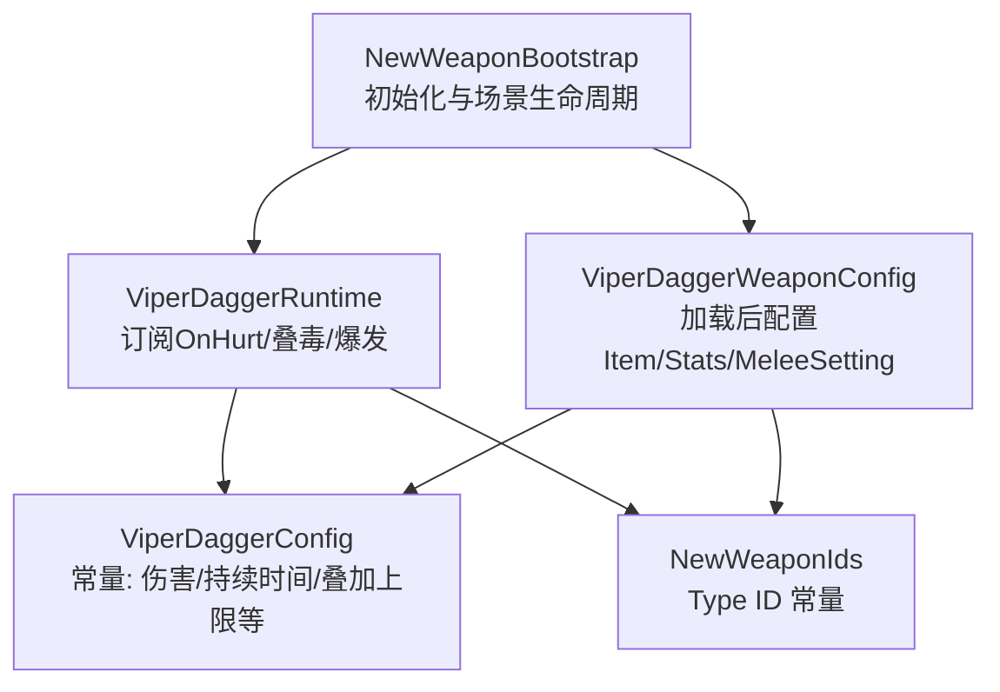
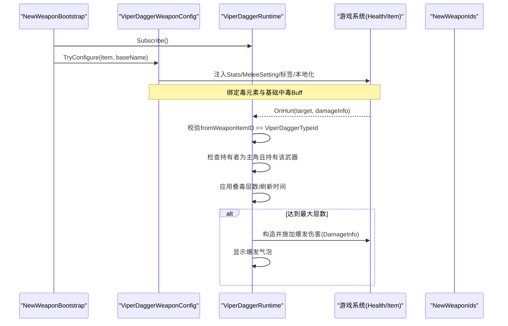
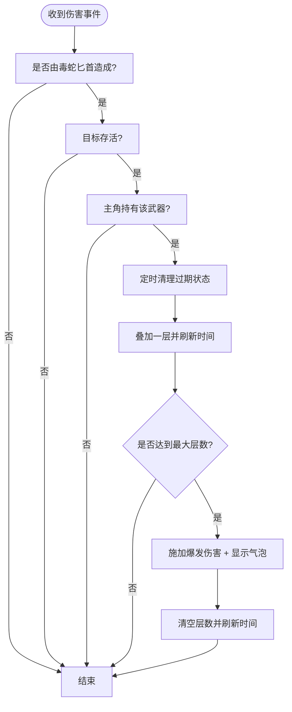
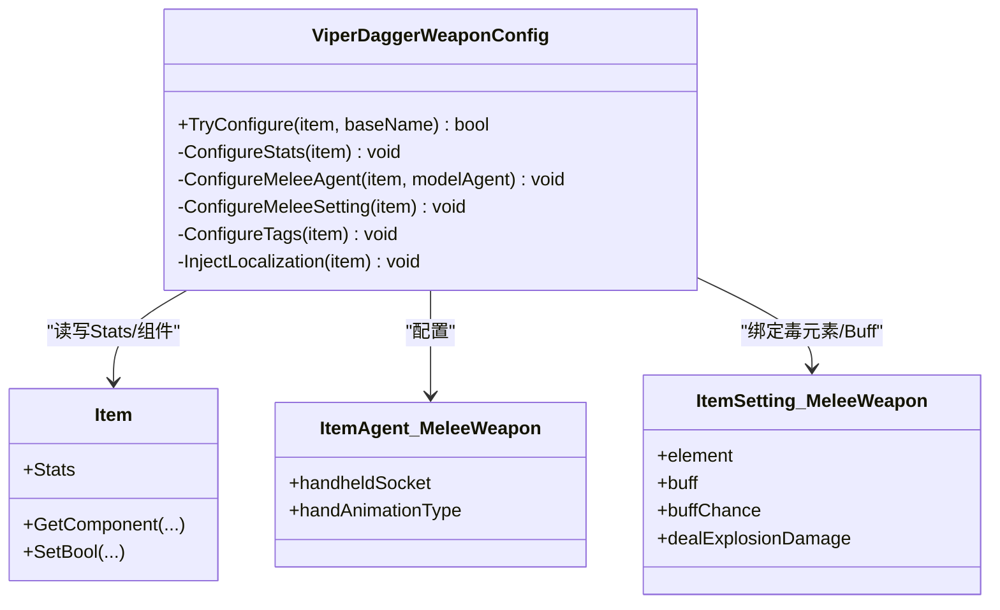
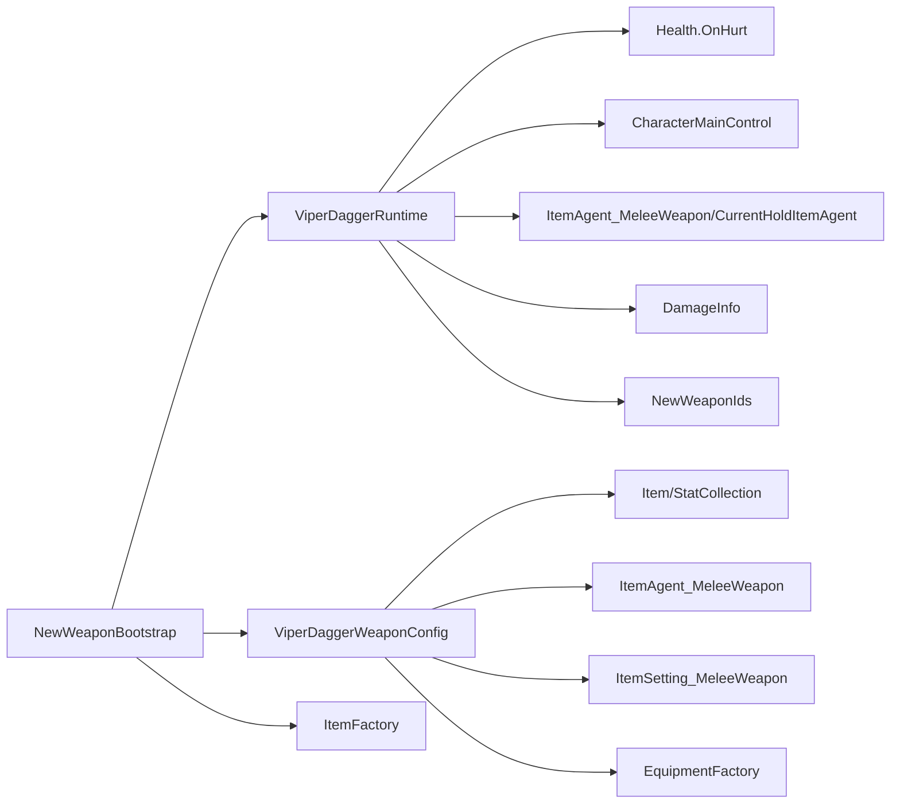

# 毒蛇匕首（ViperDagger）

<cite>
**本文引用的文件**
- [ViperDaggerConfig.cs](file://Integration/NewWeapons/ViperDagger/ViperDaggerConfig.cs)
- [ViperDaggerRuntime.cs](file://Integration/NewWeapons/ViperDagger/ViperDaggerRuntime.cs)
- [ViperDaggerWeaponConfig.cs](file://Integration/NewWeapons/ViperDagger/ViperDaggerWeaponConfig.cs)
- [NewWeaponBootstrap.cs](file://Integration/NewWeapons/Common/NewWeaponBootstrap.cs)
- [NewWeaponIds.cs](file://Integration/NewWeapons/Common/NewWeaponIds.cs)
</cite>

## 目录
1. [简介](#简介)
2. [项目结构](#项目结构)
3. [核心组件](#核心组件)
4. [架构总览](#架构总览)
5. [详细组件分析](#详细组件分析)
6. [依赖关系分析](#依赖关系分析)
7. [性能考量](#性能考量)
8. [故障排查指南](#故障排查指南)
9. [结论](#结论)
10. [附录：实战技巧与扩展指南](#附录实战技巧与扩展指南)

## 简介
毒蛇匕首是一把敏捷型近战武器，主打“叠毒+爆发”的持续伤害循环。每次命中叠加一层毒素，最多5层；达到上限时触发一次性的毒性爆发伤害并清空层数。其设计强调近身快速连击、低体力消耗与高机动性，适合对移动较慢或可稳定命中的目标进行压制。

## 项目结构
围绕毒蛇匕首的实现主要包含三类文件：
- 配置类：集中定义武器属性、叠毒参数与本地化文本
- 运行时逻辑：监听伤害事件，管理每个目标的叠毒状态与爆发
- 装备工厂配置：在加载后为物品注入Stats、Melee设置、标签与本地化

图表来源
- [NewWeaponBootstrap.cs:28-58](file://Integration/NewWeapons/Common/NewWeaponBootstrap.cs#L28-L58)
- [NewWeaponBootstrap.cs:143-152](file://Integration/NewWeapons/Common/NewWeaponBootstrap.cs#L143-L152)
- [ViperDaggerRuntime.cs:46-67](file://Integration/NewWeapons/ViperDagger/ViperDaggerRuntime.cs#L46-L67)
- [ViperDaggerWeaponConfig.cs:52-94](file://Integration/NewWeapons/ViperDagger/ViperDaggerWeaponConfig.cs#L52-L94)
- [NewWeaponIds.cs:15-20](file://Integration/NewWeapons/Common/NewWeaponIds.cs#L15-L20)

章节来源
- [NewWeaponBootstrap.cs:28-58](file://Integration/NewWeapons/Common/NewWeaponBootstrap.cs#L28-L58)
- [NewWeaponBootstrap.cs:143-152](file://Integration/NewWeapons/Common/NewWeaponBootstrap.cs#L143-L152)
- [ViperDaggerRuntime.cs:46-67](file://Integration/NewWeapons/ViperDagger/ViperDaggerRuntime.cs#L46-L67)
- [ViperDaggerWeaponConfig.cs:52-94](file://Integration/NewWeapons/ViperDagger/ViperDaggerWeaponConfig.cs#L52-L94)
- [NewWeaponIds.cs:15-20](file://Integration/NewWeapons/Common/NewWeaponIds.cs#L15-L20)

## 核心组件
- ViperDaggerConfig：集中声明武器基础属性（伤害、攻速、范围、暴击、穿透、移速加成、子弹格挡、体力消耗等）以及叠毒机制的关键参数（最大叠层、满层爆发伤害、毒素持续时间）。
- ViperDaggerRuntime：订阅全局伤害事件，判断是否由玩家使用毒蛇匕首造成，维护每个目标的叠毒状态字典，负责刷新层数、超时清理与满层爆发伤害。
- ViperDaggerWeaponConfig：在装备加载后为物品注入Stats、MeleeAgent、MeleeSetting（元素类型与Buff绑定）、标签与本地化，完成与游戏系统的集成。
- NewWeaponBootstrap：在模块初始化时订阅运行时事件，并在场景切换时重置静态缓存；在装备加载完成后调用配置器。
- NewWeaponIds：提供毒蛇匕首的TypeID、Bundle名、BaseName等标识常量。

章节来源
- [ViperDaggerConfig.cs:24-55](file://Integration/NewWeapons/ViperDagger/ViperDaggerConfig.cs#L24-L55)
- [ViperDaggerRuntime.cs:23-39](file://Integration/NewWeapons/ViperDagger/ViperDaggerRuntime.cs#L23-L39)
- [ViperDaggerWeaponConfig.cs:28-47](file://Integration/NewWeapons/ViperDagger/ViperDaggerWeaponConfig.cs#L28-L47)
- [NewWeaponBootstrap.cs:28-58](file://Integration/NewWeapons/Common/NewWeaponBootstrap.cs#L28-L58)
- [NewWeaponIds.cs:15-20](file://Integration/NewWeapons/Common/NewWeaponIds.cs#L15-L20)

## 架构总览
毒蛇匕首的工作流分为两条主线：
- 装备装配线：在资源加载后，通过配置器将物品与Stats、Melee设置、标签和本地化绑定，使其成为一把可用的近战武器。
- 运行时机：在战斗期间，运行时监听伤害事件，识别是否为毒蛇匕首命中，更新目标叠毒状态，必要时触发爆发伤害并显示视觉反馈。

图表来源
- [NewWeaponBootstrap.cs:28-58](file://Integration/NewWeapons/Common/NewWeaponBootstrap.cs#L28-L58)
- [NewWeaponBootstrap.cs:143-152](file://Integration/NewWeapons/Common/NewWeaponBootstrap.cs#L143-L152)
- [ViperDaggerRuntime.cs:82-109](file://Integration/NewWeapons/ViperDagger/ViperDaggerRuntime.cs#L82-L109)
- [ViperDaggerRuntime.cs:148-171](file://Integration/NewWeapons/ViperDagger/ViperDaggerRuntime.cs#L148-L171)
- [ViperDaggerWeaponConfig.cs:164-191](file://Integration/NewWeapons/ViperDagger/ViperDaggerWeaponConfig.cs#L164-L191)
- [NewWeaponIds.cs:15-20](file://Integration/NewWeapons/Common/NewWeaponIds.cs#L15-L20)

## 详细组件分析

### 配置层：ViperDaggerConfig
- 武器属性：基础伤害、攻击速度、攻击范围、暴击率、暴击倍率、护甲穿透、体力消耗、子弹格挡、移动速度加成等。
- 叠毒机制参数：最大叠层数、满层爆发伤害、毒素持续时间。
- 本地化：名称与描述的中英文常量。

这些常量被运行时和配置器共同引用，确保行为与数值一致。

章节来源
- [ViperDaggerConfig.cs:24-55](file://Integration/NewWeapons/ViperDagger/ViperDaggerConfig.cs#L24-L55)

### 运行时层：ViperDaggerRuntime
职责与流程：
- 订阅与取消订阅：在模块初始化时订阅全局伤害事件，卸载时取消订阅并清理状态。
- 伤害回调过滤：仅处理来自毒蛇匕首的伤害，且受击目标存活、由主角造成、且主角当前持有该武器。
- 叠毒状态管理：以目标实例ID为键维护层数与最后施加时间；若超过持续时间则重置层数；每次命中叠加一层并刷新时间。
- 满层爆发：达到最大层数时构造一次性的爆发伤害信息（元素为毒），施加到目标，并显示“毒性爆发”气泡提示。
- 定期清理：按固定间隔扫描并移除过期过久的状态，避免内存增长。

图表来源
- [ViperDaggerRuntime.cs:82-109](file://Integration/NewWeapons/ViperDagger/ViperDaggerRuntime.cs#L82-L109)
- [ViperDaggerRuntime.cs:114-143](file://Integration/NewWeapons/ViperDagger/ViperDaggerRuntime.cs#L114-L143)
- [ViperDaggerRuntime.cs:148-171](file://Integration/NewWeapons/ViperDagger/ViperDaggerRuntime.cs#L148-L171)
- [ViperDaggerRuntime.cs:229-253](file://Integration/NewWeapons/ViperDagger/ViperDaggerRuntime.cs#L229-L253)

章节来源
- [ViperDaggerRuntime.cs:46-67](file://Integration/NewWeapons/ViperDagger/ViperDaggerRuntime.cs#L46-L67)
- [ViperDaggerRuntime.cs:82-109](file://Integration/NewWeapons/ViperDagger/ViperDaggerRuntime.cs#L82-L109)
- [ViperDaggerRuntime.cs:114-143](file://Integration/NewWeapons/ViperDagger/ViperDaggerRuntime.cs#L114-L143)
- [ViperDaggerRuntime.cs:148-171](file://Integration/NewWeapons/ViperDagger/ViperDaggerRuntime.cs#L148-L171)
- [ViperDaggerRuntime.cs:176-196](file://Integration/NewWeapons/ViperDagger/ViperDaggerRuntime.cs#L176-L196)
- [ViperDaggerRuntime.cs:198-224](file://Integration/NewWeapons/ViperDagger/ViperDaggerRuntime.cs#L198-L224)
- [ViperDaggerRuntime.cs:229-253](file://Integration/NewWeapons/ViperDagger/ViperDaggerRuntime.cs#L229-L253)

### 装备装配层：ViperDaggerWeaponConfig
职责与流程：
- 识别目标物品：根据baseName匹配毒蛇匕首。
- 注入Stats：将伤害、攻速、范围、暴击、穿透、体力消耗等写入物品统计。
- 配置MeleeAgent：设置手持方式与动画类型。
- 配置MeleeSetting：设置元素类型为毒，并将原版中毒Buff绑定至武器（基础触发概率设为100%），使系统原生中毒效果与运行时叠毒并存。
- 添加标签：武器、近战、特殊等标签。
- 注入本地化：名称与描述。

图表来源
- [ViperDaggerWeaponConfig.cs:52-94](file://Integration/NewWeapons/ViperDagger/ViperDaggerWeaponConfig.cs#L52-L94)
- [ViperDaggerWeaponConfig.cs:103-126](file://Integration/NewWeapons/ViperDagger/ViperDaggerWeaponConfig.cs#L103-L126)
- [ViperDaggerWeaponConfig.cs:128-162](file://Integration/NewWeapons/ViperDagger/ViperDaggerWeaponConfig.cs#L128-L162)
- [ViperDaggerWeaponConfig.cs:164-191](file://Integration/NewWeapons/ViperDagger/ViperDaggerWeaponConfig.cs#L164-L191)
- [ViperDaggerWeaponConfig.cs:193-222](file://Integration/NewWeapons/ViperDagger/ViperDaggerWeaponConfig.cs#L193-L222)

章节来源
- [ViperDaggerWeaponConfig.cs:52-94](file://Integration/NewWeapons/ViperDagger/ViperDaggerWeaponConfig.cs#L52-L94)
- [ViperDaggerWeaponConfig.cs:103-126](file://Integration/NewWeapons/ViperDagger/ViperDaggerWeaponConfig.cs#L103-L126)
- [ViperDaggerWeaponConfig.cs:128-162](file://Integration/NewWeapons/ViperDagger/ViperDaggerWeaponConfig.cs#L128-L162)
- [ViperDaggerWeaponConfig.cs:164-191](file://Integration/NewWeapons/ViperDagger/ViperDaggerWeaponConfig.cs#L164-L191)
- [ViperDaggerWeaponConfig.cs:193-222](file://Integration/NewWeapons/ViperDagger/ViperDaggerWeaponConfig.cs#L193-L222)

### 启动与生命周期：NewWeaponBootstrap
- 初始化：订阅毒蛇匕首运行时事件，创建能力管理器（其他武器），延迟注册能力。
- 场景切换：重置各武器运行时静态缓存，避免跨场景状态污染。
- 装备加载后：获取已加载物品并调用对应配置器完成装配。
- 销毁清理：取消订阅并清理所有相关静态缓存。

章节来源
- [NewWeaponBootstrap.cs:28-58](file://Integration/NewWeapons/Common/NewWeaponBootstrap.cs#L28-L58)
- [NewWeaponBootstrap.cs:65-95](file://Integration/NewWeapons/Common/NewWeaponBootstrap.cs#L65-L95)
- [NewWeaponBootstrap.cs:143-152](file://Integration/NewWeapons/Common/NewWeaponBootstrap.cs#L143-L152)
- [NewWeaponBootstrap.cs:193-221](file://Integration/NewWeapons/Common/NewWeaponBootstrap.cs#L193-L221)

## 依赖关系分析
- ViperDaggerRuntime 依赖：
  - Health.OnHurt 事件（全局伤害回调）
  - CharacterMainControl（获取当前玩家）
  - ItemAgent_MeleeWeapon / CurrentHoldItemAgent（检测是否持有该武器）
  - DamageInfo（构造爆发伤害）
  - L10n / DialogueBubblesManager（本地化与气泡反馈）
  - NewWeaponIds（武器TypeID）
- ViperDaggerWeaponConfig 依赖：
  - Item / StatCollection（注入Stats）
  - ItemAgent_MeleeWeapon / ItemSetting_MeleeWeapon（近战与元素设置）
  - EquipmentFactory（模型绑定）
  - LocalizationHelper（本地化注入）
  - NewWeaponIds（名称与模型基名）
- NewWeaponBootstrap 依赖：
  - ViperDaggerRuntime（订阅/取消订阅/重置）
  - ViperDaggerWeaponConfig（装配）
  - ItemFactory（获取已加载物品）

图表来源
- [ViperDaggerRuntime.cs:82-109](file://Integration/NewWeapons/ViperDagger/ViperDaggerRuntime.cs#L82-L109)
- [ViperDaggerRuntime.cs:148-171](file://Integration/NewWeapons/ViperDagger/ViperDaggerRuntime.cs#L148-L171)
- [ViperDaggerRuntime.cs:198-224](file://Integration/NewWeapons/ViperDagger/ViperDaggerRuntime.cs#L198-L224)
- [ViperDaggerWeaponConfig.cs:103-191](file://Integration/NewWeapons/ViperDagger/ViperDaggerWeaponConfig.cs#L103-L191)
- [NewWeaponBootstrap.cs:28-58](file://Integration/NewWeapons/Common/NewWeaponBootstrap.cs#L28-L58)
- [NewWeaponBootstrap.cs:143-152](file://Integration/NewWeapons/Common/NewWeaponBootstrap.cs#L143-L152)

章节来源
- [ViperDaggerRuntime.cs:82-109](file://Integration/NewWeapons/ViperDagger/ViperDaggerRuntime.cs#L82-L109)
- [ViperDaggerRuntime.cs:148-171](file://Integration/NewWeapons/ViperDagger/ViperDaggerRuntime.cs#L148-L171)
- [ViperDaggerRuntime.cs:198-224](file://Integration/NewWeapons/ViperDagger/ViperDaggerRuntime.cs#L198-L224)
- [ViperDaggerWeaponConfig.cs:103-191](file://Integration/NewWeapons/ViperDagger/ViperDaggerWeaponConfig.cs#L103-L191)
- [NewWeaponBootstrap.cs:28-58](file://Integration/NewWeapons/Common/NewWeaponBootstrap.cs#L28-L58)
- [NewWeaponBootstrap.cs:143-152](file://Integration/NewWeapons/Common/NewWeaponBootstrap.cs#L143-L152)

## 性能考量
- 早期退出策略：仅在伤害来自毒蛇匕首且由主角持有时继续处理，其余路径立即返回，降低热路径开销。
- 字典管理与定期清理：使用Dictionary维护目标状态，并按固定间隔清理过期条目，避免无限增长。
- 复用缓冲列表：清理时使用预分配列表减少分配与GC压力。
- 非关键异常保护：UI与反射访问处采用try-catch包裹，保证最佳努力降级，不影响主流程。
- 建议优化方向：
  - 若目标数量极大，可考虑分帧清理或基于网格/区域的批量清理策略。
  - 可将状态结构体改为更紧凑的数据布局以提升缓存友好性。
  - 对频繁调用的方法可引入对象池以减少临时分配。

[本节为通用性能讨论，不直接分析具体代码行]

## 故障排查指南
- 无叠毒/无爆发：
  - 确认已从启动阶段订阅运行时事件，并在场景切换后未重复订阅导致覆盖。
  - 检查伤害来源是否为毒蛇匕首TypeID，且由主角造成。
  - 确认主角当前持有该武器（近战或手持槽）。
- 状态泄漏：
  - 检查场景切换时是否调用重置静态缓存。
  - 观察字典中是否存在长时间未更新的条目，确认清理逻辑是否生效。
- UI反馈缺失：
  - 检查气泡显示调用是否成功，注意UI系统可用性。
- 配置失败：
  - 检查装备加载后是否正确调用配置器，且baseName匹配。
  - 查看日志输出，定位反射或组件添加失败的异常。

章节来源
- [ViperDaggerRuntime.cs:46-67](file://Integration/NewWeapons/ViperDagger/ViperDaggerRuntime.cs#L46-L67)
- [ViperDaggerRuntime.cs:82-109](file://Integration/NewWeapons/ViperDagger/ViperDaggerRuntime.cs#L82-L109)
- [ViperDaggerRuntime.cs:176-196](file://Integration/NewWeapons/ViperDagger/ViperDaggerRuntime.cs#L176-L196)
- [ViperDaggerRuntime.cs:229-253](file://Integration/NewWeapons/ViperDagger/ViperDaggerRuntime.cs#L229-L253)
- [ViperDaggerWeaponConfig.cs:52-94](file://Integration/NewWeapons/ViperDagger/ViperDaggerWeaponConfig.cs#L52-L94)
- [NewWeaponBootstrap.cs:65-95](file://Integration/NewWeapons/Common/NewWeaponBootstrap.cs#L65-L95)

## 结论
毒蛇匕首通过“命中叠毒+满层爆发”的机制，将低单体伤害转化为高爆发的持续伤害循环。其实现清晰分层：配置层统一数值，运行时层专注状态管理与爆发，装配层完成与游戏系统的集成。整体设计注重性能与稳定性，具备可扩展性与良好的调试支持。

[本节为总结性内容，不直接分析具体代码行]

## 附录：实战技巧与扩展指南

### 实战使用技巧
- 快速叠层：利用高攻速与低体力消耗迅速叠加层数，优先选择可稳定命中的目标。
- 爆发时机：达到5层后立即触发爆发，随后可立即重新叠层，形成高频爆发节奏。
- 走位与距离：短攻击范围要求贴身作战，注意规避远程火力与AOE。
- 目标选择：对慢速或静止目标收益更高；对高速目标较难稳定叠满。

[本节为概念性指导，不直接分析具体代码行]

### 配装建议
- 提升生存与机动：配合增加移速与闪避的装备，便于贴脸与脱离。
- 强化近战效率：提高近战命中率与连击稳定性，缩短叠层周期。
- 元素协同：与增强毒元素伤害的词条或装备联动，放大爆发收益。
- 防御与容错：适当堆叠护甲穿透与格挡，提升近身作战的容错空间。

[本节为概念性指导，不直接分析具体代码行]

### 新开发者扩展毒液效果的指导
- 新增叠毒规则：
  - 在运行时叠加逻辑中加入条件分支，例如按敌人类型或距离调整层数或持续时间。
  - 可在状态结构中扩展字段，如“额外伤害系数”、“衰减曲线”等。
- 调整数值平衡：
  - 修改配置中的最大叠层、持续时间与爆发伤害，测试不同组合下的DPS曲线。
- 视觉与音效：
  - 在触发爆发时加入粒子特效或音效，增强反馈；参考现有气泡显示方式。
- 与系统集成的注意事项：
  - 保持对全局事件的订阅与取消订阅正确配对，避免内存泄漏。
  - 在场景切换时务必重置静态缓存，防止跨场景状态污染。
  - 对反射与UI调用做异常保护，确保最佳努力降级。

[本节为概念性指导，不直接分析具体代码行]