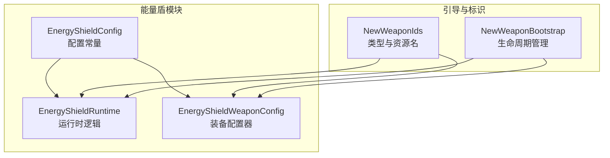
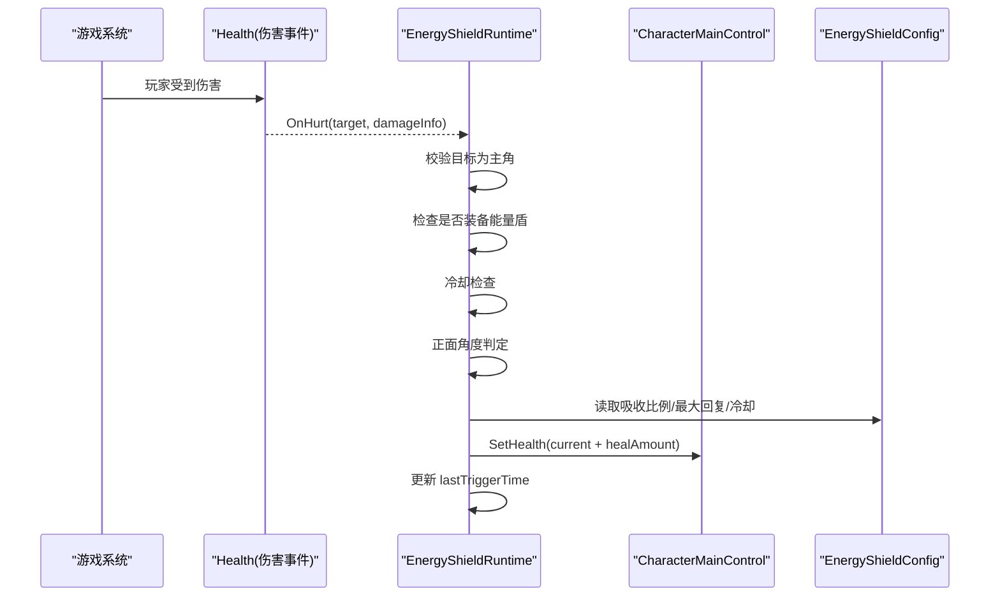
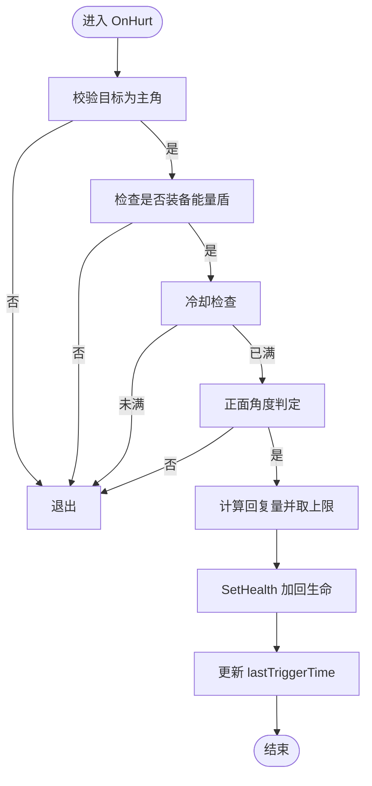
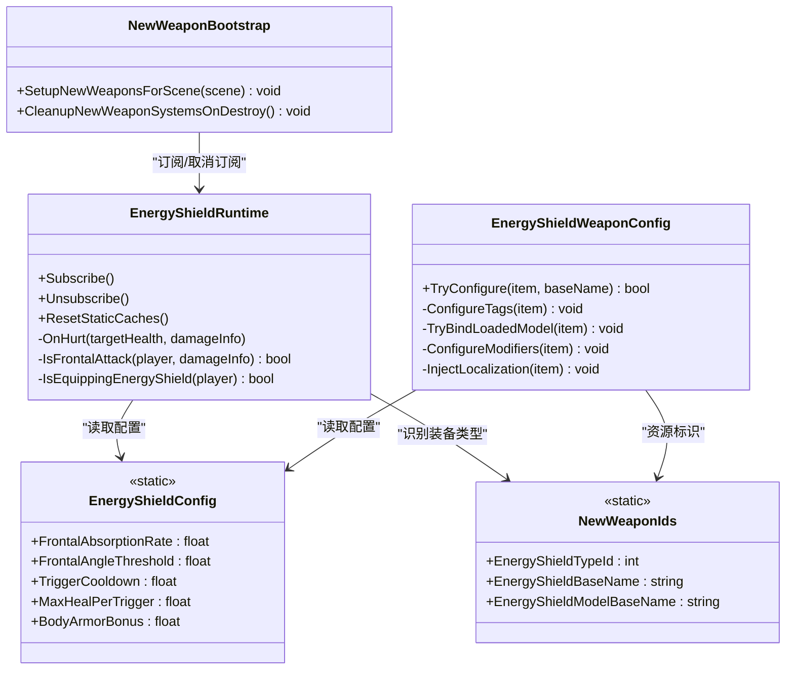

# 能量盾（EnergyShield）

<cite>
**本文引用的文件**
- [EnergyShieldConfig.cs](file://Integration/NewWeapons/EnergyShield/EnergyShieldConfig.cs)
- [EnergyShieldRuntime.cs](file://Integration/NewWeapons/EnergyShield/EnergyShieldRuntime.cs)
- [EnergyShieldWeaponConfig.cs](file://Integration/NewWeapons/EnergyShield/EnergyShieldWeaponConfig.cs)
- [NewWeaponBootstrap.cs](file://Integration/NewWeapons/Common/NewWeaponBootstrap.cs)
- [NewWeaponIds.cs](file://Integration/NewWeapons/Common/NewWeaponIds.cs)
</cite>

## 目录
1. [简介](#简介)
2. [项目结构](#项目结构)
3. [核心组件](#核心组件)
4. [架构总览](#架构总览)
5. [详细组件分析](#详细组件分析)
6. [依赖关系分析](#依赖关系分析)
7. [性能考量](#性能考量)
8. [故障排查指南](#故障排查指南)
9. [结论](#结论)
10. [附录](#附录)

## 简介
能量盾是一款“图腾槽位”的防御型装备，其核心机制为：当玩家正面受到攻击时，将部分伤害转化为生命值回复。该机制通过监听游戏内伤害事件、判定攻击方向与角度阈值、并在冷却限制下执行回血逻辑实现。它不提供传统意义上的“护盾值/护盾条”，而是以“heal-back”模式在受击后直接加回一定比例的生命值，同时提供少量护甲加成。

本文件面向新开发者与使用者，系统阐述能量盾的伤害吸收、触发条件、充能（冷却）恢复逻辑、配置参数、运行时处理流程、与其他装备的协同策略，以及扩展建议。

## 项目结构
能量盾相关代码位于 Integration/NewWeapons/EnergyShield 目录下，由三个核心文件组成：
- EnergyShieldConfig.cs：定义本地化文案、品质、运行时参数（吸收比例、角度阈值、冷却、单次最大回复、护甲加成等）。
- EnergyShieldRuntime.cs：订阅伤害事件，实现正面判定、冷却控制、回血计算与异常保护。
- EnergyShieldWeaponConfig.cs：在装备加载后为能量盾注入标签、模型绑定、属性修饰符和本地化。

此外，NewWeaponBootstrap.cs 负责在场景启动时订阅/取消订阅运行时事件并重置状态；NewWeaponIds.cs 提供能量盾的类型ID与资源名称常量。

图表来源
- [EnergyShieldConfig.cs:14-56](file://Integration/NewWeapons/EnergyShield/EnergyShieldConfig.cs#L14-L56)
- [EnergyShieldRuntime.cs:21-195](file://Integration/NewWeapons/EnergyShield/EnergyShieldRuntime.cs#L21-L195)
- [EnergyShieldWeaponConfig.cs:20-115](file://Integration/NewWeapons/EnergyShield/EnergyShieldWeaponConfig.cs#L20-L115)
- [NewWeaponBootstrap.cs:40-90](file://Integration/NewWeapons/Common/NewWeaponBootstrap.cs#L40-L90)
- [NewWeaponIds.cs:29-35](file://Integration/NewWeapons/Common/NewWeaponIds.cs#L29-L35)

章节来源
- [EnergyShieldConfig.cs:14-56](file://Integration/NewWeapons/EnergyShield/EnergyShieldConfig.cs#L14-L56)
- [EnergyShieldRuntime.cs:21-195](file://Integration/NewWeapons/EnergyShield/EnergyShieldRuntime.cs#L21-L195)
- [EnergyShieldWeaponConfig.cs:20-115](file://Integration/NewWeapons/EnergyShield/EnergyShieldWeaponConfig.cs#L20-L115)
- [NewWeaponBootstrap.cs:40-90](file://Integration/NewWeapons/Common/NewWeaponBootstrap.cs#L40-L90)
- [NewWeaponIds.cs:29-35](file://Integration/NewWeapons/Common/NewWeaponIds.cs#L29-L35)

## 核心组件
- 配置层（EnergyShieldConfig）
  - 定义本地化显示名与描述、物品品质、正面吸收比例、正面角度阈值、触发冷却、单次最大回复量、护甲加成等关键参数。
- 运行层（EnergyShieldRuntime）
  - 订阅 Health.OnHurt 与 Health.OnDead 事件，仅对主角色生效。
  - 检查是否装备能量盾（图腾槽位）、冷却计时、正面角度判定、计算回复量并调用 SetHealth 进行回血。
  - 死亡时重置静态缓存，确保复活后冷却从干净状态开始。
- 装备配置层（EnergyShieldWeaponConfig）
  - 在 AssetBundle 加载完成后，为能量盾注入图腾标签、绑定模型、添加 BodyArmor 修饰符、注入本地化文案。
- 引导与标识（NewWeaponBootstrap、NewWeaponIds）
  - 在场景启动时订阅/取消订阅运行时事件，并在场景切换时重置状态。
  - 提供能量盾 TypeID、BaseName、ModelBaseName 等资源标识。

章节来源
- [EnergyShieldConfig.cs:14-56](file://Integration/NewWeapons/EnergyShield/EnergyShieldConfig.cs#L14-L56)
- [EnergyShieldRuntime.cs:21-195](file://Integration/NewWeapons/EnergyShield/EnergyShieldRuntime.cs#L21-L195)
- [EnergyShieldWeaponConfig.cs:20-115](file://Integration/NewWeapons/EnergyShield/EnergyShieldWeaponConfig.cs#L20-L115)
- [NewWeaponBootstrap.cs:40-90](file://Integration/NewWeapons/Common/NewWeaponBootstrap.cs#L40-L90)
- [NewWeaponIds.cs:29-35](file://Integration/NewWeapons/Common/NewWeaponIds.cs#L29-L35)

## 架构总览
能量盾采用“事件驱动 + 配置驱动”的轻量架构：
- 配置集中：所有可调参数集中在配置类中，便于平衡调整与多语言扩展。
- 事件驱动：通过订阅伤害事件，在命中瞬间完成方向判定与回血计算，避免轮询开销。
- 装备装配：在装备加载阶段注入标签、修饰符与本地化，保证运行时行为一致。

图表来源
- [EnergyShieldRuntime.cs:76-116](file://Integration/NewWeapons/EnergyShield/EnergyShieldRuntime.cs#L76-L116)
- [EnergyShieldConfig.cs:25-50](file://Integration/NewWeapons/EnergyShield/EnergyShieldConfig.cs#L25-L50)

## 详细组件分析

### 运行时伤害处理与充能恢复（EnergyShieldRuntime）
- 事件订阅与清理
  - 启动时订阅 Health.OnHurt 与 Health.OnDead；销毁或场景切换时取消订阅并重置静态缓存。
- 早期退出优化
  - 非主角、无玩家实例、未装备能量盾、冷却未满等情况立即返回，减少无效计算。
- 正面判定算法
  - 基于玩家朝向与攻击来源方向的点积与角度余弦阈值判断是否在 ±60° 范围内。
- 回血计算与上限
  - 回复量 = finalDamage × FrontalAbsorptionRate，且不超过 MaxHealPerTrigger。
  - 使用 SetHealth 进行“heal-back”模式回血，避免重复扣血。
- 异常保护
  - 对 SetHealth 调用进行 try/catch，防止异常中断后续流程。

图表来源
- [EnergyShieldRuntime.cs:76-116](file://Integration/NewWeapons/EnergyShield/EnergyShieldRuntime.cs#L76-L116)
- [EnergyShieldRuntime.cs:121-160](file://Integration/NewWeapons/EnergyShield/EnergyShieldRuntime.cs#L121-L160)

章节来源
- [EnergyShieldRuntime.cs:21-195](file://Integration/NewWeapons/EnergyShield/EnergyShieldRuntime.cs#L21-L195)

### 武器配置（EnergyShieldWeaponConfig）
- 标签注入
  - 添加“Totem”、“DontDropOnDeadInSlot”、“Special”标签，使其作为图腾类特殊装备。
- 模型绑定
  - 尝试绑定预设模型资源，失败时记录日志但不中断流程。
- 属性修饰符
  - 为 BodyArmor 添加固定加成，提升基础生存能力。
- 本地化注入
  - 根据配置中的显示名与描述，注入到对应 ItemKey 的本地化表中。

章节来源
- [EnergyShieldWeaponConfig.cs:20-115](file://Integration/NewWeapons/EnergyShield/EnergyShieldWeaponConfig.cs#L20-L115)

### 配置参数（EnergyShieldConfig）
- 正面吸收比例：决定每次正面受击可回血的比例。
- 正面角度阈值：±60° 范围判定是否为正面。
- 触发冷却：同一时间内最多触发的频率，防止过度回复。
- 单次最大回复：限制单次触发的回复上限，避免极端情况破坏平衡。
- 护甲加成：提供稳定的基础防御提升。
- 本地化文案：中英文显示名与描述，便于 UI 展示。

章节来源
- [EnergyShieldConfig.cs:14-56](file://Integration/NewWeapons/EnergyShield/EnergyShieldConfig.cs#L14-L56)

### 引导与生命周期（NewWeaponBootstrap）
- 启动时订阅能量盾运行时事件，确保伤害回调可用。
- 场景切换时重置能量盾静态缓存，避免跨场景状态污染。
- 销毁时取消订阅并清理其他新武器系统状态，保证资源释放。

章节来源
- [NewWeaponBootstrap.cs:40-90](file://Integration/NewWeapons/Common/NewWeaponBootstrap.cs#L40-L90)
- [NewWeaponBootstrap.cs:188-225](file://Integration/NewWeapons/Common/NewWeaponBootstrap.cs#L188-L225)

### 标识与资源（NewWeaponIds）
- 提供能量盾的 TypeID、BaseName、ModelBaseName、IconAssetName 等常量，供运行时与配置层引用。

章节来源
- [NewWeaponIds.cs:29-35](file://Integration/NewWeapons/Common/NewWeaponIds.cs#L29-L35)

## 依赖关系分析
能量盾模块依赖以下系统与常量：
- Health 事件系统：用于捕获伤害事件。
- CharacterMainControl：获取当前玩家实例与朝向。
- ItemStatsSystem：读取槽位与内容，判断是否装备能量盾。
- EquipmentHelper / LocalizationHelper：注入标签、修饰符与本地化。
- NewWeaponIds：统一资源与类型标识。

图表来源
- [EnergyShieldRuntime.cs:21-195](file://Integration/NewWeapons/EnergyShield/EnergyShieldRuntime.cs#L21-L195)
- [EnergyShieldConfig.cs:14-56](file://Integration/NewWeapons/EnergyShield/EnergyShieldConfig.cs#L14-L56)
- [EnergyShieldWeaponConfig.cs:20-115](file://Integration/NewWeapons/EnergyShield/EnergyShieldWeaponConfig.cs#L20-L115)
- [NewWeaponBootstrap.cs:40-90](file://Integration/NewWeapons/Common/NewWeaponBootstrap.cs#L40-L90)
- [NewWeaponIds.cs:29-35](file://Integration/NewWeapons/Common/NewWeaponIds.cs#L29-L35)

章节来源
- [EnergyShieldRuntime.cs:21-195](file://Integration/NewWeapons/EnergyShield/EnergyShieldRuntime.cs#L21-L195)
- [EnergyShieldConfig.cs:14-56](file://Integration/NewWeapons/EnergyShield/EnergyShieldConfig.cs#L14-L56)
- [EnergyShieldWeaponConfig.cs:20-115](file://Integration/NewWeapons/EnergyShield/EnergyShieldWeaponConfig.cs#L20-L115)
- [NewWeaponBootstrap.cs:40-90](file://Integration/NewWeapons/Common/NewWeaponBootstrap.cs#L40-L90)
- [NewWeaponIds.cs:29-35](file://Integration/NewWeapons/Common/NewWeaponIds.cs#L29-L35)

## 性能考量
- 事件驱动：仅在受击时触发，避免每帧轮询。
- 早期退出：非主角、未装备、冷却未满等路径快速返回，降低开销。
- 向量运算优化：使用平方模与点积进行角度判定，减少开方与三角函数调用。
- 异常隔离：SetHealth 调用包裹在 try/catch 中，防止异常扩散影响战斗循环。
- 静态缓存：lastTriggerTime 使用静态变量存储，避免频繁查找。

[本节为通用性能指导，不直接分析具体文件]

## 故障排查指南
- 未触发回血
  - 检查是否装备了能量盾（图腾槽位），确认 IsEquippingEnergyShield 返回 true。
  - 检查攻击方向是否在正面 ±60° 范围内，确认 IsFrontalAttack 判定逻辑。
  - 检查冷却时间是否未满，确认 lastTriggerTime 与 TriggerCooldown。
- 回血量异常
  - 检查 FrontalAbsorptionRate 与 MaxHealPerTrigger 配置是否正确。
  - 查看日志中是否有 SetHealth 异常信息。
- 场景切换后状态异常
  - 确认 NewWeaponBootstrap 在场景切换时调用了 ResetStaticCaches。
- 装备未生效
  - 确认 EnergyShieldWeaponConfig.TryConfigure 被调用，标签、修饰符与本地化已注入。

章节来源
- [EnergyShieldRuntime.cs:76-116](file://Integration/NewWeapons/EnergyShield/EnergyShieldRuntime.cs#L76-L116)
- [EnergyShieldRuntime.cs:121-160](file://Integration/NewWeapons/EnergyShield/EnergyShieldRuntime.cs#L121-L160)
- [EnergyShieldWeaponConfig.cs:61-107](file://Integration/NewWeapons/EnergyShield/EnergyShieldWeaponConfig.cs#L61-L107)
- [NewWeaponBootstrap.cs:82-90](file://Integration/NewWeapons/Common/NewWeaponBootstrap.cs#L82-L90)

## 结论
能量盾通过简洁的事件驱动与配置驱动实现了高效的正面伤害吸收与回血机制。其设计注重性能与稳定性，提供了清晰的扩展点与调试入口。对于使用者而言，合理站位与面对正面威胁能最大化收益；对于开发者而言，可通过调整配置参数与扩展视觉反馈来增强体验。

[本节为总结性内容，不直接分析具体文件]

## 附录

### 护盾机制说明（基于代码实现）
- 伤害吸收：以“heal-back”模式在受击后加回部分生命值，而非预先存在护盾值。
- 反弹效果：当前实现不包含伤害反弹逻辑。
- 充能系统：以冷却时间（TriggerCooldown）限制触发频率，并非传统“充能条”。

章节来源
- [EnergyShieldConfig.cs:25-50](file://Integration/NewWeapons/EnergyShield/EnergyShieldConfig.cs#L25-L50)
- [EnergyShieldRuntime.cs:76-116](file://Integration/NewWeapons/EnergyShield/EnergyShieldRuntime.cs#L76-L116)

### 视觉效果与UI反馈（现状与建议）
- 现状：当前代码未包含粒子特效、动画过渡或专用UI反馈。
- 建议：
  - 在 OnHurt 触发回血时播放简短粒子或光晕效果，提示吸收成功。
  - 在冷却期间提供UI指示（如图标闪烁或进度条），帮助玩家感知状态。
  - 结合角色朝向可视化正面区域，辅助定位与战术决策。

[本节为概念性建议，不直接分析具体文件]

### 与其他装备的协同效应
- 套装搭配：与近战高输出武器组合，利用正面格挡与持续回血提高容错。
- 战斗风格适配：适合“面坦”打法，强调面向敌人、保持正面接触。
- 注意：侧面与背面攻击无法触发吸收，需配合走位与队友掩护。

[本节为概念性建议，不直接分析具体文件]

### 使用策略与最佳实践
- 优先面对单体高伤Boss，最大化吸收收益。
- 避免被包围，尽量保持正面朝向主要威胁。
- 合理利用冷却窗口，规划走位与技能释放时机。

[本节为概念性建议，不直接分析具体文件]

### 针对不同类型敌人的应对方法
- 单体近战Boss：正面硬抗，持续回血，配合高伤武器速杀。
- 远程弹幕：侧移规避，减少正面受击次数，避免浪费冷却。
- 群体敌人：优先清理近身威胁，保持正面朝向，必要时后退拉开距离。

[本节为概念性建议，不直接分析具体文件]

### 新开发者扩展指导
- 扩展点
  - 配置层：新增/调整吸收比例、角度阈值、冷却、上限等参数。
  - 运行层：可在 OnHurt 中增加额外逻辑（如护盾条、反弹、特效触发）。
  - 装备层：可增加更多修饰符或标签，改变掉落与交互行为。
- 注意事项
  - 保持早期退出与异常保护，避免影响战斗循环。
  - 使用 NewWeaponIds 统一管理资源标识，避免硬编码。
  - 在场景切换时正确重置静态状态，防止跨场景污染。

章节来源
- [EnergyShieldConfig.cs:14-56](file://Integration/NewWeapons/EnergyShield/EnergyShieldConfig.cs#L14-L56)
- [EnergyShieldRuntime.cs:21-195](file://Integration/NewWeapons/EnergyShield/EnergyShieldRuntime.cs#L21-L195)
- [EnergyShieldWeaponConfig.cs:20-115](file://Integration/NewWeapons/EnergyShield/EnergyShieldWeaponConfig.cs#L20-L115)
- [NewWeaponIds.cs:29-35](file://Integration/NewWeapons/Common/NewWeaponIds.cs#L29-L35)