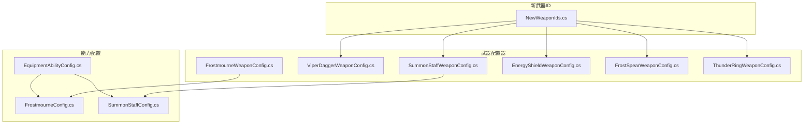
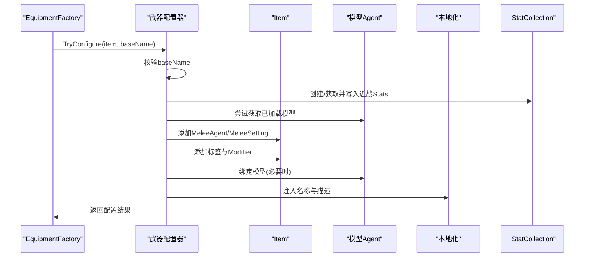
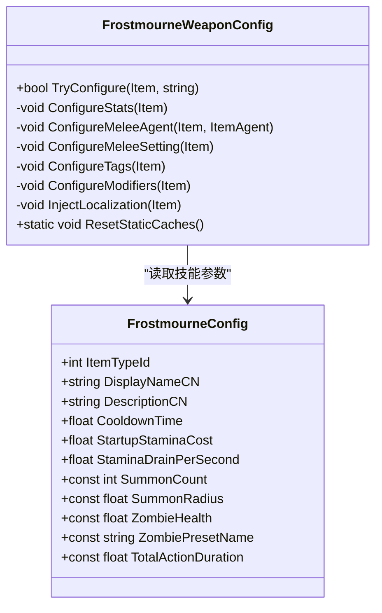
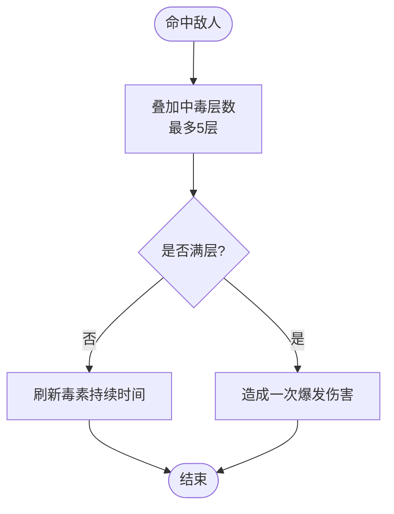
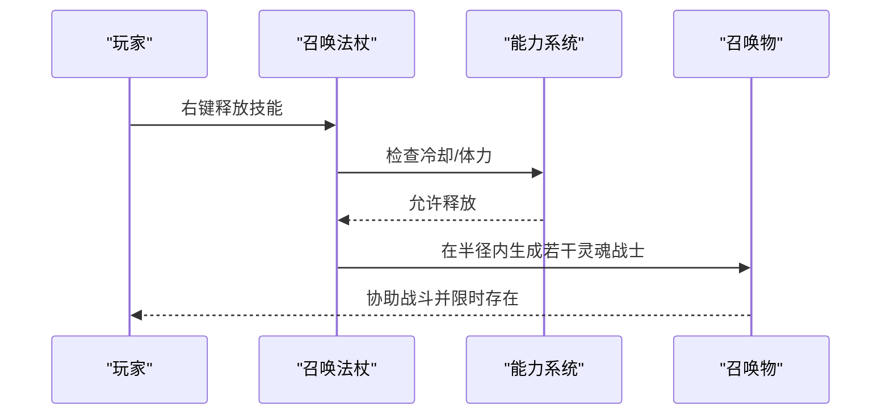
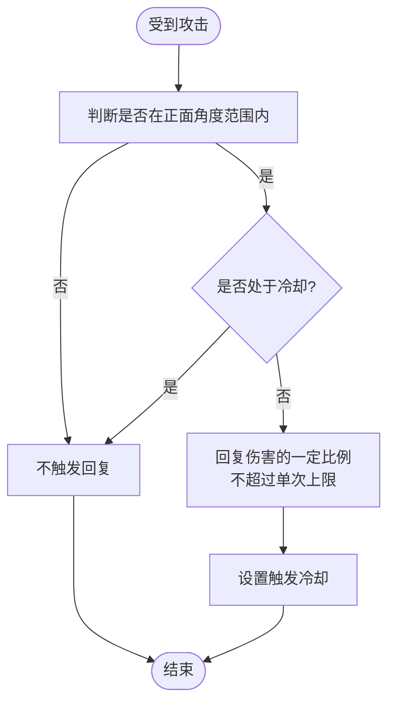
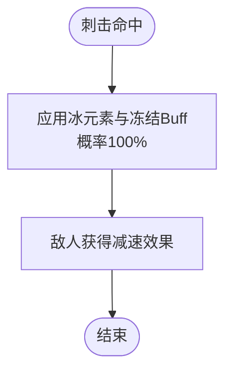
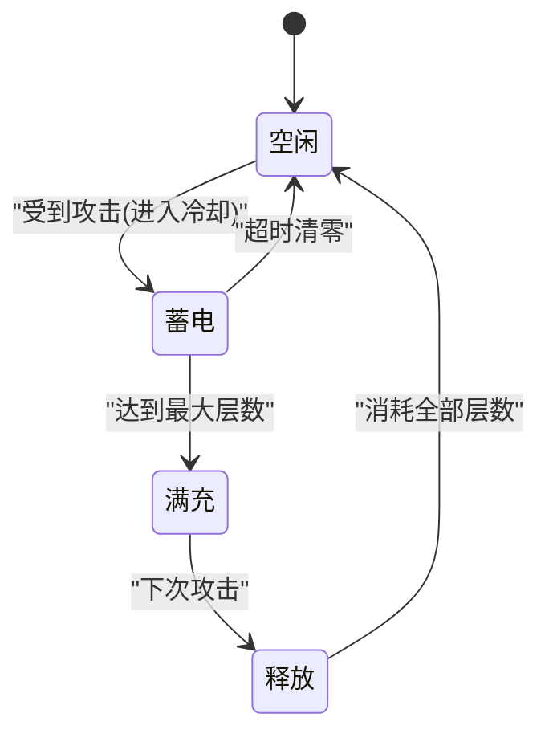
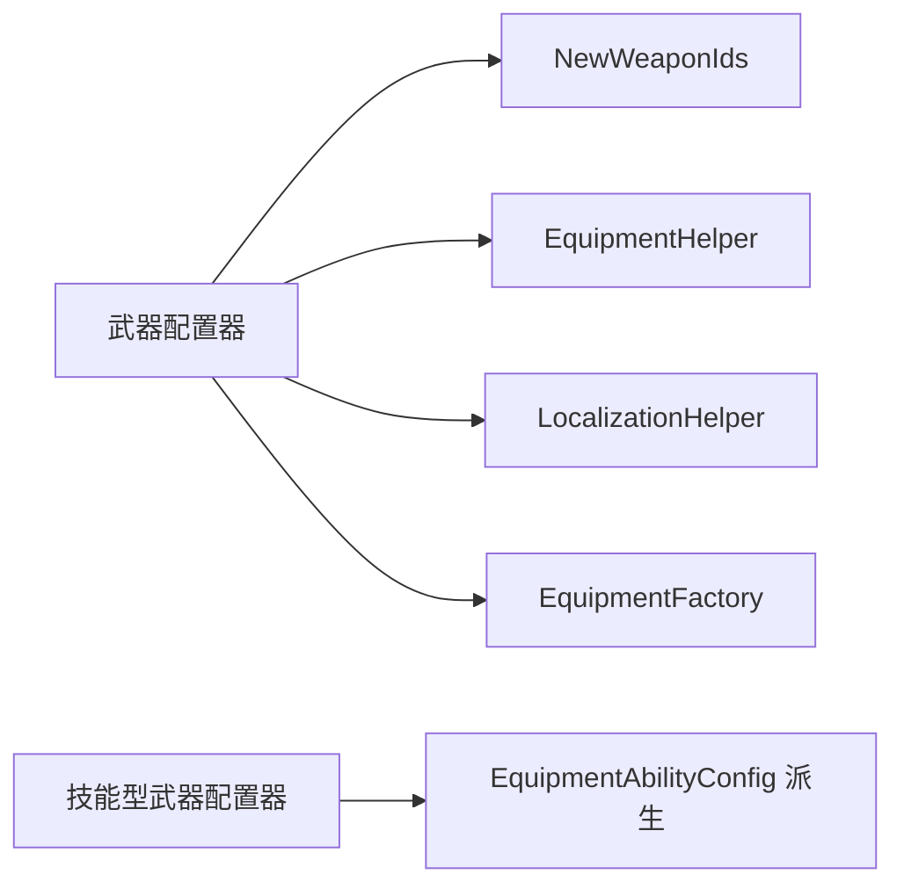

# 自定义武器系统

## 2026-09-11 致死回调复核（COMPAT）

官方 `Health.Hurt` 在致死流程中先派发 `Health.OnDead`，禁用对象，再派发 `Health.OnHurt`。能量盾与雷电戒指的受击入口现检查 `Health.IsDead`，死亡后的迟到回调不再回补生命或重新蓄雷。戒指只屏蔽主角死亡的受击分支，玩家攻击敌人的释放分支保留。此处是受击后的生命回补，护盾不能抵消已经完成的致死流程。

来源：`Integration/NewWeapons/EnergyShield/EnergyShieldRuntime.cs`、`Integration/NewWeapons/ThunderRing/ThunderRingRuntime.cs`，`CR-2026-09-11-014`。结构守卫与隔离回归只能验证代码分支，复活模式和战斗表现仍需游戏内 smoke。

<cite>
**本文引用的文件**
- [FrostmourneWeaponConfig.cs](file://Integration/Frostmourne/FrostmourneWeaponConfig.cs)
- [FrostmourneConfig.cs](file://Integration/Frostmourne/FrostmourneConfig.cs)
- [ViperDaggerWeaponConfig.cs](file://Integration/NewWeapons/ViperDagger/ViperDaggerWeaponConfig.cs)
- [ViperDaggerConfig.cs](file://Integration/NewWeapons/ViperDagger/ViperDaggerConfig.cs)
- [SummonStaffWeaponConfig.cs](file://Integration/NewWeapons/SummonStaff/SummonStaffWeaponConfig.cs)
- [SummonStaffConfig.cs](file://Integration/NewWeapons/SummonStaff/SummonStaffConfig.cs)
- [EnergyShieldWeaponConfig.cs](file://Integration/NewWeapons/EnergyShield/EnergyShieldWeaponConfig.cs)
- [EnergyShieldConfig.cs](file://Integration/NewWeapons/EnergyShield/EnergyShieldConfig.cs)
- [FrostSpearWeaponConfig.cs](file://Integration/NewWeapons/FrostSpear/FrostSpearWeaponConfig.cs)
- [FrostSpearConfig.cs](file://Integration/NewWeapons/FrostSpear/FrostSpearConfig.cs)
- [ThunderRingWeaponConfig.cs](file://Integration/NewWeapons/ThunderRing/ThunderRingWeaponConfig.cs)
- [ThunderRingConfig.cs](file://Integration/NewWeapons/ThunderRing/ThunderRingConfig.cs)
- [NewWeaponIds.cs](file://Integration/NewWeapons/Common/NewWeaponIds.cs)
- [NewWeaponItemAttributes.cs](file://Integration/NewWeapons/Common/NewWeaponItemAttributes.cs)
- [NewWeaponFx.cs](file://Integration/NewWeapons/Common/NewWeaponFx.cs)
- [NewWeaponSwingFx.cs](file://Integration/NewWeapons/Common/NewWeaponSwingFx.cs)
- [NewWeaponMeleeFx.cs](file://Integration/NewWeapons/Common/NewWeaponMeleeFx.cs)
- [NewWeaponBossDropHandler.cs](file://Integration/NewWeapons/Common/NewWeaponBossDropHandler.cs)
- [FrostSpearRuntime.cs](file://Integration/NewWeapons/FrostSpear/FrostSpearRuntime.cs)
- [BossRushProceduralSprites.cs](file://Common/Effects/BossRushProceduralSprites.cs)
- [NewWeaponItemConfigurators.cs](file://Integration/NewWeapons/Common/NewWeaponItemConfigurators.cs)
- [EquipmentAbilityConfig.cs](file://Common/Equipment/EquipmentAbilityConfig.cs)
</cite>

## 目录
1. [简介](#简介)
2. [项目结构](#项目结构)
3. [核心组件](#核心组件)
4. [架构总览](#架构总览)
5. [详细组件分析](#详细组件分析)
6. [依赖关系分析](#依赖关系分析)
7. [性能考量](#性能考量)
8. [故障排查指南](#故障排查指南)
9. [结论](#结论)
10. [附录：新武器开发教程与测试调优](#附录新武器开发教程与测试调优)

## 简介
本仓库实现了一套“自定义武器系统”，围绕六种主要自定义武器展开：霜之哀伤（Frostmourne）、毒蛇匕首（ViperDagger）、召唤法杖（SummonStaff）、能量盾（EnergyShield）、冰霜长矛（FrostSpear）、雷电戒指（ThunderRing）。每种武器通过统一的“装备工厂配置器”在 AssetBundle 加载后完成属性、标签、Buff 关联、本地化与模型绑定等配置；部分武器还具备右键技能或运行时机制，形成差异化玩法。

## 项目结构
- 统一 ID 管理：所有新武器的 TypeID、Bundle 名、Prefab 名集中在 NewWeaponIds.cs，便于集中维护与扩展。
- 武器配置器：每个武器一个 XxxWeaponConfig.cs，负责在 EquipmentFactory 加载资源后对 Item 进行 Stats、MeleeAgent、MeleeSetting、标签、Modifier、本地化与模型绑定的流水线式配置。
- 能力配置：拥有右键技能的武器（如霜之哀伤、召唤法杖）继承 EquipmentAbilityConfig，定义冷却、体力消耗、持续时间与技能参数。
- 运行期机制：部分武器（如能量盾、雷电戒指）在受击/攻击时触发增益或回复逻辑，通常由对应 Config 提供阈值与冷却等平衡参数。

**图示来源**
- [NewWeaponIds.cs:1-51](file://Integration/NewWeapons/Common/NewWeaponIds.cs#L1-L51)
- [FrostmourneWeaponConfig.cs:1-150](file://Integration/Frostmourne/FrostmourneWeaponConfig.cs#L1-L150)
- [ViperDaggerWeaponConfig.cs:1-101](file://Integration/NewWeapons/ViperDagger/ViperDaggerWeaponConfig.cs#L1-L101)
- [SummonStaffWeaponConfig.cs:1-88](file://Integration/NewWeapons/SummonStaff/SummonStaffWeaponConfig.cs#L1-L88)
- [EnergyShieldWeaponConfig.cs:1-59](file://Integration/NewWeapons/EnergyShield/EnergyShieldWeaponConfig.cs#L1-L59)
- [FrostSpearWeaponConfig.cs:1-90](file://Integration/NewWeapons/FrostSpear/FrostSpearWeaponConfig.cs#L1-L90)
- [ThunderRingWeaponConfig.cs:1-55](file://Integration/NewWeapons/ThunderRing/ThunderRingWeaponConfig.cs#L1-L55)
- [EquipmentAbilityConfig.cs](file://Common/Equipment/EquipmentAbilityConfig.cs)
- [FrostmourneConfig.cs:1-88](file://Integration/Frostmourne/FrostmourneConfig.cs#L1-L88)
- [SummonStaffConfig.cs:1-92](file://Integration/NewWeapons/SummonStaff/SummonStaffConfig.cs#L1-L92)

**章节来源**
- [NewWeaponIds.cs:1-51](file://Integration/NewWeapons/Common/NewWeaponIds.cs#L1-L51)

## 核心组件
- 武器配置器（XxxWeaponConfig）：统一入口 TryConfigure(item, baseName)，按顺序执行 Stats 设置、MeleeAgent/MeleeSetting 配置、标签添加、Modifier 注入、模型绑定、本地化注入。
- 能力配置（EquipmentAbilityConfig 派生）：为带右键技能的武器提供冷却、体力消耗、持续时间、图标与描述等元数据。
- 常量与 ID（NewWeaponIds）：集中管理 TypeID、Bundle、Prefab 名称与图标资源名，避免硬编码散落。

**章节来源**
- [FrostmourneWeaponConfig.cs:84-150](file://Integration/Frostmourne/FrostmourneWeaponConfig.cs#L84-L150)
- [ViperDaggerWeaponConfig.cs:49-101](file://Integration/NewWeapons/ViperDagger/ViperDaggerWeaponConfig.cs#L49-L101)
- [SummonStaffWeaponConfig.cs:49-88](file://Integration/NewWeapons/SummonStaff/SummonStaffWeaponConfig.cs#L49-L88)
- [EnergyShieldWeaponConfig.cs:22-59](file://Integration/NewWeapons/EnergyShield/EnergyShieldWeaponConfig.cs#L22-L59)
- [FrostSpearWeaponConfig.cs:50-90](file://Integration/NewWeapons/FrostSpear/FrostSpearWeaponConfig.cs#L50-L90)
- [ThunderRingWeaponConfig.cs:21-55](file://Integration/NewWeapons/ThunderRing/ThunderRingWeaponConfig.cs#L21-L55)
- [EquipmentAbilityConfig.cs](file://Common/Equipment/EquipmentAbilityConfig.cs)

## 架构总览
武器系统在资源加载阶段被调用，根据 baseName 匹配到对应配置器，完成以下流程：
- 解析并校验 baseName（支持占位符与模型名两种形式）
- 创建/更新 StatCollection，写入近战 Stats
- 配置 MeleeAgent（手持插槽、动画类型、音效键、特效策略）
- 配置 MeleeSetting（元素类型、爆炸伤害开关、Buff 与触发概率）
- 添加标签（Weapon/MeleeWeapon/Totem/Special 等）
- 注入 Modifier（如 ColdProtection、BodyArmor）
- 绑定 3D 模型（Item 与模型 Agent 双端同步）
- 注入本地化（名称与描述）
- 特殊处理（如霜之哀伤的冰焰环绕、运动模糊禁用等）

**图示来源**
- [FrostmourneWeaponConfig.cs:84-150](file://Integration/Frostmourne/FrostmourneWeaponConfig.cs#L84-L150)
- [ViperDaggerWeaponConfig.cs:49-101](file://Integration/NewWeapons/ViperDagger/ViperDaggerWeaponConfig.cs#L49-L101)
- [SummonStaffWeaponConfig.cs:49-88](file://Integration/NewWeapons/SummonStaff/SummonStaffWeaponConfig.cs#L49-L88)
- [EnergyShieldWeaponConfig.cs:22-59](file://Integration/NewWeapons/EnergyShield/EnergyShieldWeaponConfig.cs#L22-L59)
- [FrostSpearWeaponConfig.cs:50-90](file://Integration/NewWeapons/FrostSpear/FrostSpearWeaponConfig.cs#L50-L90)
- [ThunderRingWeaponConfig.cs:21-55](file://Integration/NewWeapons/ThunderRing/ThunderRingWeaponConfig.cs#L21-L55)

## 详细组件分析

### 霜之哀伤（Frostmourne）
- 独特机制
  - 冰属性近战，附带寒冷防护加成。
  - 右键技能“亡灵召唤”：配置中定义了冷却时间、体力消耗、持续时间与召唤数量等参数。
  - 运行时附加冰焰环绕特效，动态复制并着色粒子与材质，适配不同模型尺寸。
- 技能系统
  - 继承能力配置基类，提供冷却、启动体力消耗、持续消耗等元数据。
- 视觉效果
  - 自定义近战挥砍/命中特效策略，允许回退并使用缩放修正。
  - 运行时为持有模型添加“冰焰环绕”，基于包围盒计算中心与范围，复制烟雾粒子并着色。
- 平衡性设计
  - 近战 Stats 取自断界戟的 70%，保证强度适中。
  - 提供 ColdProtection +2 的生存补偿。
  - 冻伤 Buff 100% 触发，强化控制感。

**图示来源**
- [FrostmourneConfig.cs:15-88](file://Integration/Frostmourne/FrostmourneConfig.cs#L15-L88)
- [FrostmourneWeaponConfig.cs:84-150](file://Integration/Frostmourne/FrostmourneWeaponConfig.cs#L84-L150)

**章节来源**
- [FrostmourneWeaponConfig.cs:84-150](file://Integration/Frostmourne/FrostmourneWeaponConfig.cs#L84-L150)
- [FrostmourneConfig.cs:15-88](file://Integration/Frostmourne/FrostmourneConfig.cs#L15-L88)

### 毒蛇匕首（ViperDagger）
- 独特机制
  - 毒属性近战，命中叠加中毒层数，满层爆发额外伤害。
  - 高攻速、短射程、低体力消耗，强调贴脸滚雪球。
- 技能系统
  - 无右键技能，但通过叠毒与爆发构成循环输出。
- 视觉效果
  - 标准近战特效策略，复用默认效果。
- 平衡性设计
  - 基础伤害偏低，靠叠毒与爆发弥补。
  - 100% 触发原版 Poison Buff，确保稳定压制。

**图示来源**
- [ViperDaggerConfig.cs:24-61](file://Integration/NewWeapons/ViperDagger/ViperDaggerConfig.cs#L24-L61)
- [ViperDaggerWeaponConfig.cs:164-191](file://Integration/NewWeapons/ViperDagger/ViperDaggerWeaponConfig.cs#L164-L191)

**章节来源**
- [ViperDaggerWeaponConfig.cs:49-101](file://Integration/NewWeapons/ViperDagger/ViperDaggerWeaponConfig.cs#L49-L101)
- [ViperDaggerConfig.cs:24-61](file://Integration/NewWeapons/ViperDagger/ViperDaggerConfig.cs#L24-L61)

### 召唤法杖（SummonStaff）
- 独特机制
  - 右键技能“灵魂召唤”：召唤若干灵魂战士协助作战，自身近战偏弱。
- 技能系统
  - 继承能力配置基类，定义冷却、体力消耗、持续时间与召唤参数。
- 视觉效果
  - 标准近战特效策略，不附加元素 Buff。
- 平衡性设计
  - 低基础伤害与较低暴击，以召唤物分担压力。
  - 召唤物具有有限生命与存活时间，避免长期压场。

**图示来源**
- [SummonStaffConfig.cs:16-92](file://Integration/NewWeapons/SummonStaff/SummonStaffConfig.cs#L16-L92)
- [SummonStaffWeaponConfig.cs:49-88](file://Integration/NewWeapons/SummonStaff/SummonStaffWeaponConfig.cs#L49-L88)

**章节来源**
- [SummonStaffWeaponConfig.cs:49-88](file://Integration/NewWeapons/SummonStaff/SummonStaffWeaponConfig.cs#L49-L88)
- [SummonStaffConfig.cs:16-92](file://Integration/NewWeapons/SummonStaff/SummonStaffConfig.cs#L16-L92)

### 能量盾（EnergyShield）
- 独特机制
  - 正面受击时按比例回复生命值，侧面/背面无效，被包围时价值下降。
- 技能系统
  - 无右键技能，受击触发回复，带有触发冷却与单次上限。
- 视觉效果
  - 作为图腾类装备，绑定模型并标注 Totem 标签。
- 平衡性设计
  - 提供 BodyArmor 加成，增强生存。
  - 正面吸收比例、角度阈值、触发冷却与单次最大回复共同限制强度。

**图示来源**
- [EnergyShieldConfig.cs:14-58](file://Integration/NewWeapons/EnergyShield/EnergyShieldConfig.cs#L14-L58)
- [EnergyShieldWeaponConfig.cs:22-59](file://Integration/NewWeapons/EnergyShield/EnergyShieldWeaponConfig.cs#L22-L59)

**章节来源**
- [EnergyShieldWeaponConfig.cs:22-59](file://Integration/NewWeapons/EnergyShield/EnergyShieldWeaponConfig.cs#L22-L59)
- [EnergyShieldConfig.cs:14-58](file://Integration/NewWeapons/EnergyShield/EnergyShieldConfig.cs#L14-L58)

### 冰霜长矛（FrostSpear）
- 独特机制
  - 中距离冰属性攻击，100% 附带冰冻减速，强调安全距离控场。
- 技能系统
  - 无右键技能，通过元素与 Buff 提供控制。
- 视觉效果
  - 标准近战特效策略，冰元素与冻结 Buff 联动。
- 平衡性设计
  - 中等伤害与攻速，较低暴击与暴击伤害。
  - 提供 ColdProtection 加成，提升耐寒能力。

**图示来源**
- [FrostSpearConfig.cs:14-56](file://Integration/NewWeapons/FrostSpear/FrostSpearConfig.cs#L14-L56)
- [FrostSpearWeaponConfig.cs:151-182](file://Integration/NewWeapons/FrostSpear/FrostSpearWeaponConfig.cs#L151-L182)

**章节来源**
- [FrostSpearWeaponConfig.cs:50-90](file://Integration/NewWeapons/FrostSpear/FrostSpearWeaponConfig.cs#L50-L90)
- [FrostSpearConfig.cs:14-56](file://Integration/NewWeapons/FrostSpear/FrostSpearConfig.cs#L14-L56)

### 雷电戒指（ThunderRing）
- 独特机制
  - 受击叠加电能层数，满层后下一次攻击释放雷击伤害并清空层数。
- 技能系统
  - 无右键技能，受击与攻击时的状态机驱动增益。
- 视觉效果
  - 图腾类装备，绑定模型并标注 Totem 标签。
- 平衡性设计
  - 最大层数、持续时间、受击冷却与释放伤害共同控制强度曲线。

**图示来源**
- [ThunderRingConfig.cs:15-54](file://Integration/NewWeapons/ThunderRing/ThunderRingConfig.cs#L15-L54)
- [ThunderRingWeaponConfig.cs:21-55](file://Integration/NewWeapons/ThunderRing/ThunderRingWeaponConfig.cs#L21-L55)

**章节来源**
- [ThunderRingWeaponConfig.cs:21-55](file://Integration/NewWeapons/ThunderRing/ThunderRingWeaponConfig.cs#L21-L55)
- [ThunderRingConfig.cs:15-54](file://Integration/NewWeapons/ThunderRing/ThunderRingConfig.cs#L15-L54)

## P0 五把新武器的开放获取与表现层（2026-09-07）

500048-500052 此前是「代码完整但玩家拿不到」的状态：没有任何商店、掉落或奖励接线，
也没有任何视觉/听觉反馈。本轮补齐三层，形态与 500053-500056 冰霜/雷霆套装转正时一致。

### 注册即配置（两处登记缺一不可）

自定义物品要在**两个**地方登记：`BossRushDynamicItemRegistry.BuildPlans()` 决定 prefab 从哪个
bundle 加载、重启不退化成 `FallbackItem`；`ItemContentRegistry.RegisterItemContentConfigurators()`
里的 `ItemFactory.RegisterConfigurator` 决定 `LoadBundleInternal` 在把 prefab 加进
`ItemAssetsCollection` **之前**跑配置器。

这五把武器的 Item prefab 住在 `Assets/Items/*_item`，由 ItemFactory 注册；
`EquipmentFactory` 那条 `TryConfigure` 只覆盖 `Assets/Equipment` 下的 Item——它们在那边只有模型。
漏登记配置器时，写 Stats / 标签 / `Value` 的唯一动作就退化成延迟 bootstrap 里一次性的
`ConfigureNewWeaponsAfterLoad()`，比注册晚若干帧；那个窗口内开店读到 bundle 烤进去的旧
Value，而该调用一旦抛异常或被跳过，五把连 Stats 与可维修标签都不会有。
登记入口是 `NewWeaponItemConfigurators.RegisterAll()`，宿主只加一行
（`ModBehaviourPartialBudgetGuard` 的文件数已顶格 204/204）。

登记后同一个 Item 会被配置两次（配置器 + 补配调用），与霜之哀伤等三把老武器同款，
因此 `TryConfigure` 的每一步都必须幂等——见下。

### 物品属性单一写入点

`NewWeaponItemAttributes.Apply(item, typeId)` 是品质 / 售价 / 耐久 / 可维修标签的唯一写入点，
被真 bundle 路径与占位符路径（`NewWeaponPlaceholderRegistry`）共同调用，幂等。

此前这几项只在占位符路径里硬编码（`clone.Quality = 5` / `MaxDurability = 999f`），
真 bundle 路径完全不写，于是「有 bundle 时无品质无售价、没 bundle 时才有」。
`Value` 尤其关键：官方 `Item.GetTotalRawValue()` 在 `UseDurability` 为 false 时原样返回 `Value`，
`MaxDurability > 0` 时才按耐久比缩放；不设 `Value` 商店会标价 0 元。
近战 20000 / 图腾 16000，均低于品质 6 套装件的 30000。

**耐久只给近战**：三把近战 999 + `Repairable` 标签（不打标签维修台会显示「无法维修」）；
两件图腾不设耐久也不打标签——既有图腾（飞行图腾、逆鳞）都不设，而定价本就不需要它。

**幂等的坑**：`EquipmentHelper.AddModifierToItem` 是无条件 `Add`，重复配置会把能量盾的
BodyArmor 叠成 +6。新增的 `EquipmentHelper.EnsureModifierOnItem` 先查同 key 再加；
霜之哀伤与冰霜/雷霆套装此前各自造过一份同样的检查，现已收敛为共享入口。

### 获取途径（两条线）

- **运气线**：`NewWeaponBossDropHandler`，五个官方 Boss 一对一各掉一把，掉率 20%。
  挂 Harmony `CharacterMainControl.OnDead` 前缀（`Patches/Combat/CharacterOnDeadPatch.cs`），
  因此原版地图击杀同样生效。完整实现 defer 协议四处接线，由
  `tests/ExtraBossDropDeferGuard.py` 逐条断言（该 guard 的 `INTEGRATIONS` 已扩到六个）。
  roll 在死亡帧定下并以 TypeID 随 pending 携带，保证「进箱 / 落地 / 回退」三条消费通道发同一件。
- **稳定线**：`GoblinAffinityConfig.GetShopItems()`，好感 5 级解锁、库存 1（每次开店重置）。
  参数在 `NewWeaponShopConfig`。

掉落黑名单保持不动：它只挡随机奖池（许愿台底池、日报签到池），NPC 商店与专属掉落格都不查它。

### 表现层（零新增美术资源）

| 组件 | 职责 |
| --- | --- |
| `NewWeaponSwingFx` | 三把近战的挥砍拖尾。粒子系统运行时构造，材质取 `RingParticleEffect.GetSharedParticleMaterial()`（本轮从 `CreateMaterial` 提取为 internal 静态入口，全 Mod 共享一份 Alpha Blended 材质 + 64×64 程序化渐变贴图）。池上限 8。 |
| `NewWeaponMeleeFx` | 三把近战共用一处 `MeleeWeaponFxPolicy.ApplyTo`（不复制第四份 EnsureMeleeAttackFx 模板），并持有挂在 `CA_Attack.OnStart` 上的拖尾触发补丁。 |
| `NewWeaponFx` / `NewWeaponBurstFx` | 爆发环、碎片、电弧与音效的统一入口。`PlayBurst(..., bool withLight = true)` 的实时点光是可选的——冰霜长矛每 0.35 秒一次的命中环传 `false`，每命中一盏动态光不是免费的。爆发环自带 Update 淡出并自毁，不依赖 `ModBehaviour` 协程，因此静态的 `XxxRuntime` 可直接调用。电弧复用 `SetBonusArcPool`，惰性创建。 |
| `BossRushProceduralSprites` | 程序化圆形精灵的共享提供者。`DragonSetBonus_Dash` 那份是 `partial class ModBehaviour` 的私有实例方法，静态类调不到，而宿主 partial 文件数已顶格（204/204），不能再往宿主加东西。 |
| `FrostSpearRuntime` | 冰霜长矛的命中霜环（纯视觉；减速仍由官方 Cold buff 提供）。`OnHurt` 首行按 `fromWeaponItemID` 早返，同一目标 0.35 秒去重。 |

音效由 `tools/gen_newweapon_sfx.py` 程序化合成（32 kHz 单声道 16-bit，峰值约 -6 dBFS，
与 SetBonus 音效同一响度口径），输出 `Assets/Sounds/NewWeapons/`，
由 `compile_official.bat` 的部署段拷进游戏目录——漏了这段部署，`PlaySoundEffect` 会静默失效。

`NewWeaponSfx` 只存文件名常量，路径经 `ModBehaviour.GetModPath()` **惰性**解析：
在静态字段初始化器里用 `Assembly.Location` 拼路径，遇到从字节数组加载的程序集会返回空串，
`Path.GetDirectoryName("")` 抛异常并在静态初始化器里升级成 `TypeInitializationException`
把类型永久毒化；而 `NewWeaponSfx.X` 是在**调用方栈帧**求值的，异常会跳过调用点之后的气泡提示。

### 顺带修正的两处自建伤害标记

毒蛇匕首的满层毒爆发与雷电戒指的满层释放此前都只设了 `fromWeaponItemID = 0`，
没有置 `isFromBuffOrEffect = true`。这与 `ModeGWeaponScoringCompatibilityMatrix` 的登记口径不符
（毒爆发那条登记为 `ViperDagger_PoisonBurst_BuffEffect`，雷电那条是
`ThunderRing_Release_DamageInfoMain_TypeId0`，理由分别是 buff/effect 通道与 TypeID 0），
也会让这两次伤害被「只认 `!isFromBuffOrEffect` 的直接击杀」的系统（冰葬、引雷术）当成直接击杀起链。
本轮已补上标记。
Mode G 计分不受影响——分类器条件 7 要求 `fromWeaponItemID > 0`，这两次伤害本就不计分。

## 依赖关系分析
- 配置器依赖 NewWeaponIds 提供的 TypeID、Bundle 与 Prefab 名，确保资源定位一致。
- 带右键技能的武器依赖 EquipmentAbilityConfig 派生类，提供技能元数据。
- 通用工具：
  - EquipmentHelper：用于添加标签、Modifier、宝石槽位等。
  - LocalizationHelper：注入本地化文本。
  - EquipmentFactory：绑定模型与查找已加载模型。

**图示来源**
- [NewWeaponIds.cs:1-51](file://Integration/NewWeapons/Common/NewWeaponIds.cs#L1-L51)
- [FrostmourneWeaponConfig.cs:84-150](file://Integration/Frostmourne/FrostmourneWeaponConfig.cs#L84-L150)
- [ViperDaggerWeaponConfig.cs:49-101](file://Integration/NewWeapons/ViperDagger/ViperDaggerWeaponConfig.cs#L49-L101)
- [SummonStaffWeaponConfig.cs:49-88](file://Integration/NewWeapons/SummonStaff/SummonStaffWeaponConfig.cs#L49-L88)
- [EnergyShieldWeaponConfig.cs:22-59](file://Integration/NewWeapons/EnergyShield/EnergyShieldWeaponConfig.cs#L22-L59)
- [FrostSpearWeaponConfig.cs:50-90](file://Integration/NewWeapons/FrostSpear/FrostSpearWeaponConfig.cs#L50-L90)
- [ThunderRingWeaponConfig.cs:21-55](file://Integration/NewWeapons/ThunderRing/ThunderRingWeaponConfig.cs#L21-L55)
- [EquipmentAbilityConfig.cs](file://Common/Equipment/EquipmentAbilityConfig.cs)

**章节来源**
- [NewWeaponIds.cs:1-51](file://Integration/NewWeapons/Common/NewWeaponIds.cs#L1-L51)

## 性能考量
- 特效策略：霜之哀伤使用可回退的近战特效策略，并在运行时缓存回退特效对象，减少重复查找。
- 粒子与材质：运行时复制粒子并着色，注意粒子发射率与光强设置，避免过度开销。
- 渲染优化：禁用物品 prefab 自身渲染器，仅保留运行时模型渲染；修复运动模糊与图形设置。
- 统计与标签：批量写入 Stats 与标签，避免多次反射与查找。
- 冷却与触发：能量盾与雷电戒指使用触发冷却与层数上限，防止高频触发导致性能抖动。

[本节为通用指导，不直接分析具体文件]

## 故障排查指南
- 配置失败日志：各配置器在异常路径记录日志前缀与错误信息，便于定位问题。
- 模型绑定失败：若 TryBindLoadedMeleeModel 或 TryBindLoadedEquipmentModel 失败，检查 NewWeaponIds 中的 Bundle 与 Prefab 名是否正确。
- 本地化注入失败：确认 LocalizationHelper 可用且键名正确（Item_+TypeID 与 _Desc）。
- Buff 未生效：检查 MeleeSetting 的元素类型与 Buff 引用是否存在（如 Cold、Poison），以及 buffChance 设置。
- 特效缺失：确认 MeleeWeaponFxPolicy 的回退策略与缓存是否有效，必要时重置静态缓存。

**章节来源**
- [FrostmourneWeaponConfig.cs:145-149](file://Integration/Frostmourne/FrostmourneWeaponConfig.cs#L145-L149)
- [ViperDaggerWeaponConfig.cs:96-100](file://Integration/NewWeapons/ViperDagger/ViperDaggerWeaponConfig.cs#L96-L100)
- [SummonStaffWeaponConfig.cs:83-87](file://Integration/NewWeapons/SummonStaff/SummonStaffWeaponConfig.cs#L83-L87)
- [EnergyShieldWeaponConfig.cs:54-58](file://Integration/NewWeapons/EnergyShield/EnergyShieldWeaponConfig.cs#L54-L58)
- [FrostSpearWeaponConfig.cs:85-89](file://Integration/NewWeapons/FrostSpear/FrostSpearWeaponConfig.cs#L85-L89)
- [ThunderRingWeaponConfig.cs:50-54](file://Integration/NewWeapons/ThunderRing/ThunderRingWeaponConfig.cs#L50-L54)

## 结论
该自定义武器系统通过统一的配置器模式，将六把特色武器整合进现有装备框架。每把武器在 Stats、标签、Buff、Modifier、本地化与模型绑定方面保持一致流程，同时通过能力配置与运行期机制实现差异化玩法。整体架构清晰、可扩展性强，适合继续扩展更多自定义武器。

[本节为总结，不直接分析具体文件]

## 附录：新武器开发教程与测试调优

### 概念设计
- 明确武器定位：近战/远程、控制/爆发/辅助、单体/AoE。
- 确定核心机制：例如叠毒、召唤、受击增益、正面吸收等。
- 设定平衡参数：基础伤害、攻速、射程、暴击、体力消耗、冷却、持续时间、触发概率与上限。

### 代码实现步骤
1. 新增 ID 与资源名
   - 在 NewWeaponIds.cs 中添加 TypeID、Bundle、BaseName、ModelBaseName、IconAssetName。
2. 创建武器配置器
   - 新建 XxxWeaponConfig.cs，实现 TryConfigure(item, baseName)。
   - 按顺序执行：Stats 设置、MeleeAgent/MeleeSetting、标签、Modifier、模型绑定、本地化。
3. 配置能力（可选）
   - 若含右键技能，新建 XxxConfig 继承 EquipmentAbilityConfig，填写冷却、体力消耗、持续时间与技能参数。
4. 运行期机制（可选）
   - 在受击/攻击时叠加层数或触发回复/伤害，参考 EnergyShield 与 ThunderRing 的参数设计。
5. 本地化与标签
   - 使用 LocalizationHelper 注入名称与描述；添加 Weapon/MeleeWeapon/Totem/Special 等标签。
6. 模型绑定
   - 使用 EquipmentFactory.TryBindLoadedMeleeModel 或 TryBindLoadedEquipmentModel 绑定模型。

### 测试方法
- 资源加载测试：验证 AssetBundle 与 Prefab 名匹配，TryConfigure 成功返回。
- 属性显示测试：确认 Stats 写入与显示集合正确。
- 机制测试：
  - 毒蛇匕首：命中叠加层数与满层爆发。
  - 召唤法杖：右键召唤与持续时间。
  - 能量盾：正面受击回复与冷却。
  - 冰霜长矛：100% 冰冻减速。
  - 雷电戒指：受击叠加与满层释放。
  - 霜之哀伤：右键召唤与冰焰环绕特效。
- 本地化测试：确认名称与描述在不同语言下正确显示。
- 性能测试：观察粒子与材质开销，调整发射率与光强。

### 性能调优建议
- 特效策略：优先使用回退策略与缓存，减少运行时查找。
- 粒子与材质：控制发射率、颜色渐变与光强，避免过多 Light。
- 冷却与上限：合理设置触发冷却与层数上限，防止高频触发。
- 渲染优化：禁用多余渲染器，修复运动模糊与图形设置。
- 日志与监控：在关键路径记录日志前缀与耗时，便于定位瓶颈。

[本节为通用指导，不直接分析具体文件]
