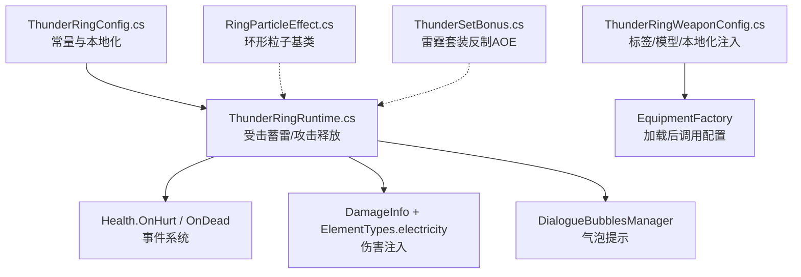
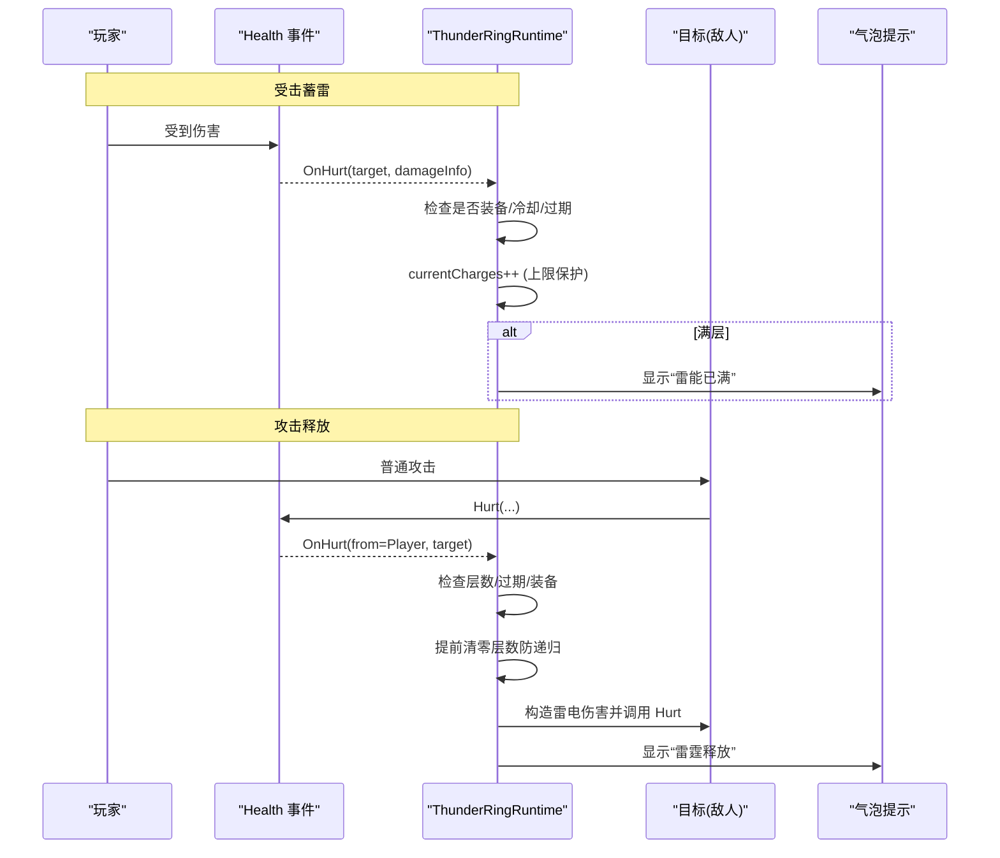
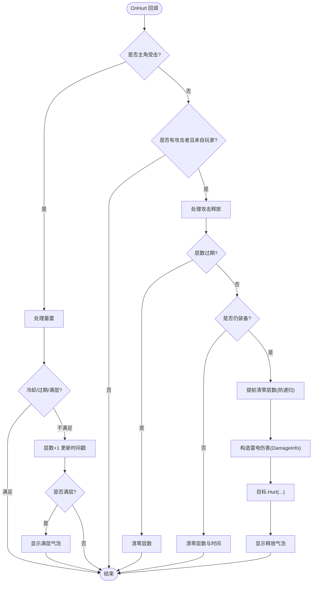
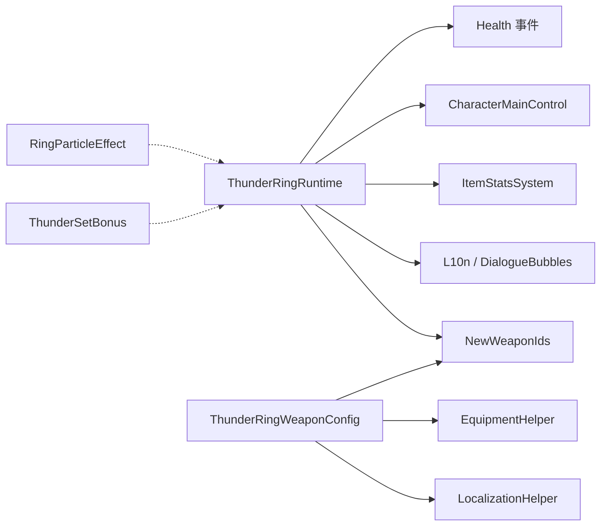

# 雷电戒指（ThunderRing）

<cite>
**本文引用的文件**
- [ThunderRingConfig.cs](file://Integration/NewWeapons/ThunderRing/ThunderRingConfig.cs)
- [ThunderRingRuntime.cs](file://Integration/NewWeapons/ThunderRing/ThunderRingRuntime.cs)
- [ThunderRingWeaponConfig.cs](file://Integration/NewWeapons/ThunderRing/ThunderRingWeaponConfig.cs)
- [NewWeaponIds.cs](file://Integration/NewWeapons/Common/NewWeaponIds.cs)
- [RingParticleEffect.cs](file://Common/Effects/RingParticleEffect.cs)
- [ThunderSetBonus.cs](file://Integration/Bonus/ThunderSetBonus.cs)
</cite>

## 目录
1. [简介](#简介)
2. [项目结构](#项目结构)
3. [核心组件](#核心组件)
4. [架构总览](#架构总览)
5. [详细组件分析](#详细组件分析)
6. [依赖关系分析](#依赖关系分析)
7. [性能考量](#性能考量)
8. [故障排查指南](#故障排查指南)
9. [结论](#结论)
10. [附录](#附录)

## 简介
雷电戒指是一款“图腾槽位”的蓄能型装备：玩家受击时叠加电能层数，满层后下一次攻击释放固定雷电伤害。其设计强调高风险高回报的近身战斗节奏，适合与高爆发近战武器搭配使用。当前版本为开发者预览，尚未提供常规获取途径。

## 项目结构
雷电戒指相关代码主要位于 Integration/NewWeapons/ThunderRing 目录下，包含配置、运行时逻辑与装备工厂配置器；同时依赖通用环形粒子特效基类用于视觉表现，并与雷霆套装效果形成体系化联动。

图表来源
- [ThunderRingConfig.cs:15-52](file://Integration/NewWeapons/ThunderRing/ThunderRingConfig.cs#L15-L52)
- [ThunderRingRuntime.cs:36-196](file://Integration/NewWeapons/ThunderRing/ThunderRingRuntime.cs#L36-L196)
- [ThunderRingWeaponConfig.cs:24-96](file://Integration/NewWeapons/ThunderRing/ThunderRingWeaponConfig.cs#L24-L96)
- [RingParticleEffect.cs:21-124](file://Common/Effects/RingParticleEffect.cs#L21-L124)
- [ThunderSetBonus.cs:28-46](file://Integration/Bonus/ThunderSetBonus.cs#L28-L46)

章节来源
- [ThunderRingConfig.cs:15-52](file://Integration/NewWeapons/ThunderRing/ThunderRingConfig.cs#L15-L52)
- [ThunderRingRuntime.cs:36-196](file://Integration/NewWeapons/ThunderRing/ThunderRingRuntime.cs#L36-L196)
- [ThunderRingWeaponConfig.cs:24-96](file://Integration/NewWeapons/ThunderRing/ThunderRingWeaponConfig.cs#L24-L96)

## 核心组件
- 配置常量（ThunderRingConfig）：定义名称、描述、品质、最大层数、持续时间、释放伤害、受击冷却等关键参数。
- 运行时（ThunderRingRuntime）：订阅健康值事件，实现“受击蓄雷”和“攻击释放”，含状态缓存、过期清理、递归防护、气泡提示。
- 装备配置器（ThunderRingWeaponConfig）：在资源加载后为物品绑定标签、模型与本地化文本。
- 通用环形粒子（RingParticleEffect）：提供可复用的环形粒子系统基类，支持Local/World双层发射器与材质纹理共享优化。
- 雷霆套装（ThunderSetBonus）：提供电抗加成与近身受击概率触发AOE电击，可与雷电戒指协同构建。

章节来源
- [ThunderRingConfig.cs:15-52](file://Integration/NewWeapons/ThunderRing/ThunderRingConfig.cs#L15-L52)
- [ThunderRingRuntime.cs:36-196](file://Integration/NewWeapons/ThunderRing/ThunderRingRuntime.cs#L36-L196)
- [ThunderRingWeaponConfig.cs:24-96](file://Integration/NewWeapons/ThunderRing/ThunderRingWeaponConfig.cs#L24-L96)
- [RingParticleEffect.cs:21-124](file://Common/Effects/RingParticleEffect.cs#L21-L124)
- [ThunderSetBonus.cs:28-46](file://Integration/Bonus/ThunderSetBonus.cs#L28-L46)

## 架构总览
雷电戒指采用“事件驱动 + 静态状态机”的轻量架构：通过全局健康值事件统一接入，避免每帧轮询；运行时以静态变量维护层数与时间戳，配合帧级缓存减少重复检测；释放阶段构造 DamageInfo 并注入雷电元素，完成伤害结算。

图表来源
- [ThunderRingRuntime.cs:87-196](file://Integration/NewWeapons/ThunderRing/ThunderRingRuntime.cs#L87-L196)
- [ThunderRingRuntime.cs:239-281](file://Integration/NewWeapons/ThunderRing/ThunderRingRuntime.cs#L239-L281)

## 详细组件分析

### 配置常量（ThunderRingConfig）
- 名称与描述：提供中/英双语展示文案，说明蓄能与释放机制及代价。
- 品质：5。
- 运行参数：
  - 最大层数：5
  - 层数持续时间：8秒（超时清零）
  - 释放伤害：40点雷电伤害
  - 受击冷却：0.3秒（防止瞬间叠满）
- 日志前缀：便于调试定位。

章节来源
- [ThunderRingConfig.cs:15-52](file://Integration/NewWeapons/ThunderRing/ThunderRingConfig.cs#L15-L52)

### 运行时（ThunderRingRuntime）
- 事件订阅：订阅 Health.OnHurt 与 Health.OnDead，死亡时重置状态，避免跨复活残留。
- 受击处理：
  - 仅对主角或带攻击者的伤害生效。
  - 未装备时直接返回，零开销。
  - 冷却与过期检查，确保不会无限叠加。
  - 满层时弹出气泡提示。
- 攻击释放：
  - 仅在层数未满时不释放；若已过期则清零。
  - 提前清零层数以避免递归（因为目标被再次伤害会重新进入 OnHurt）。
  - 构造 DamageInfo，设置雷电元素与伤害值，调用目标 Hurt。
  - 释放后弹出气泡提示。
- 装备检测：
  - 遍历角色物品槽位，匹配“Totem”开头的槽位内容类型ID是否为雷电戒指。
  - 使用帧级缓存避免重复查找。

图表来源
- [ThunderRingRuntime.cs:87-196](file://Integration/NewWeapons/ThunderRing/ThunderRingRuntime.cs#L87-L196)
- [ThunderRingRuntime.cs:201-237](file://Integration/NewWeapons/ThunderRing/ThunderRingRuntime.cs#L201-L237)

章节来源
- [ThunderRingRuntime.cs:36-196](file://Integration/NewWeapons/ThunderRing/ThunderRingRuntime.cs#L36-L196)
- [ThunderRingRuntime.cs:201-237](file://Integration/NewWeapons/ThunderRing/ThunderRingRuntime.cs#L201-L237)

### 装备配置器（ThunderRingWeaponConfig）
- 识别 baseName：兼容占位符与带后缀的命名。
- 标签注入：添加“Totem”、“DontDropOnDeadInSlot”、“Special”。
- 模型绑定：尝试绑定已加载的模型资源。
- 本地化注入：将名称与描述注入到对应键值。

章节来源
- [ThunderRingWeaponConfig.cs:24-96](file://Integration/NewWeapons/ThunderRing/ThunderRingWeaponConfig.cs#L24-L96)

### 通用环形粒子（RingParticleEffect）
- 双层粒子：支持 Local 与 World 两套发射器，分别用于贴身环绕与世界空间扩散。
- 性能优化：
  - 静态缓存材质与纹理，避免频繁分配。
  - 使用锁保证线程安全。
  - 发射器数量、半径、随机偏移、跟随偏移等均可被子类覆盖。
- 生命周期：Start 创建系统，Update 跟随目标，LateUpdate 发射粒子，StopEffect 淡出销毁。

章节来源
- [RingParticleEffect.cs:21-124](file://Common/Effects/RingParticleEffect.cs#L21-L124)
- [RingParticleEffect.cs:197-333](file://Common/Effects/RingParticleEffect.cs#L197-L333)
- [RingParticleEffect.cs:339-425](file://Common/Effects/RingParticleEffect.cs#L339-L425)

### 雷霆套装（ThunderSetBonus）
- 被动：电抗提升（减少50%电伤）。
- 主动：近身受击时25%概率以玩家为中心释放4米范围电击AOE，伤害25，冷却3秒。
- 实现：注册 Health 事件，距离判定过滤远程攻击，使用 ExplosionManager 创建爆炸。

章节来源
- [ThunderSetBonus.cs:28-46](file://Integration/Bonus/ThunderSetBonus.cs#L28-L46)
- [ThunderSetBonus.cs:187-242](file://Integration/Bonus/ThunderSetBonus.cs#L187-L242)

## 依赖关系分析
- ThunderRingRuntime 依赖：
  - Health 事件系统（OnHurt/OnDead）
  - CharacterMainControl（获取主角色）
  - ItemStatsSystem（槽位与物品类型ID）
  - L10n 与 DialogueBubblesManager（本地化与气泡）
  - NewWeaponIds（类型ID常量）
- ThunderRingWeaponConfig 依赖：
  - EquipmentHelper（标签注入）
  - LocalizationHelper（本地化注入）
  - NewWeaponIds（基础名常量）
- RingParticleEffect 为通用基类，可被其他特效复用。
- ThunderSetBonus 与雷电戒指同属雷系生态，可在Build中互补。

图表来源
- [ThunderRingRuntime.cs:87-196](file://Integration/NewWeapons/ThunderRing/ThunderRingRuntime.cs#L87-L196)
- [ThunderRingWeaponConfig.cs:24-96](file://Integration/NewWeapons/ThunderRing/ThunderRingWeaponConfig.cs#L24-L96)
- [RingParticleEffect.cs:21-124](file://Common/Effects/RingParticleEffect.cs#L21-L124)
- [ThunderSetBonus.cs:187-242](file://Integration/Bonus/ThunderSetBonus.cs#L187-L242)

章节来源
- [ThunderRingRuntime.cs:87-196](file://Integration/NewWeapons/ThunderRing/ThunderRingRuntime.cs#L87-L196)
- [ThunderRingWeaponConfig.cs:24-96](file://Integration/NewWeapons/ThunderRing/ThunderRingWeaponConfig.cs#L24-L96)
- [RingParticleEffect.cs:21-124](file://Common/Effects/RingParticleEffect.cs#L21-L124)
- [ThunderSetBonus.cs:187-242](file://Integration/Bonus/ThunderSetBonus.cs#L187-L242)

## 性能考量
- 事件优先于轮询：通过 Health 事件驱动，避免每帧扫描。
- 快速失败：未装备时立即返回，零额外开销。
- 帧级缓存：装备检测按帧缓存结果，减少反射/遍历成本。
- 递归防护：释放伤害前清零层数，避免重入导致爆栈。
- 粒子共享：环形粒子使用静态材质与纹理缓存，降低GC压力。
- 建议：
  - 控制粒子发射率与数量，避免过多实例。
  - 在大规模群怪场景下，合理调低世界空间粒子发射频率。
  - 避免在同一帧内多次触发相同特效，必要时加入节流。

[本节为通用性能指导，无需特定文件引用]

## 故障排查指南
- 症状：蓄雷不叠加
  - 检查是否装备了雷电戒指（图腾槽位），确认 IsEquippingThunderRing 判断路径。
  - 检查受击冷却是否处于CD，或层数是否已过期。
- 症状：攻击不释放
  - 检查层数是否达到最大且未过期。
  - 检查是否在释放前已因其他原因清零。
  - 确认目标 Hurt 调用未被异常中断。
- 症状：释放后无限递归
  - 确认已在造成伤害前清零层数，避免重入。
- 症状：气泡不显示
  - 检查 DialogueBubblesManager 调用是否正确，以及 transform 是否存在。
- 日志定位：
  - 查看日志前缀 "[ThunderRing]" 的输出，定位具体分支。

章节来源
- [ThunderRingRuntime.cs:115-196](file://Integration/NewWeapons/ThunderRing/ThunderRingRuntime.cs#L115-L196)
- [ThunderRingRuntime.cs:239-281](file://Integration/NewWeapons/ThunderRing/ThunderRingRuntime.cs#L239-L281)

## 结论
雷电戒指以“受击蓄能、攻击释放”为核心循环，具备明确的博弈曲线：需要主动贴近敌人承受伤害来换取高额单次爆发。其实现简洁高效，事件驱动与缓存策略保证了良好的性能。与雷霆套装组合可进一步提升生存与反击能力，适合在高密度敌人或Boss战中发挥价值。

[本节为总结性内容，无需特定文件引用]

## 附录

### 光环型闪电机制说明（基于仓库现状）
- 当前雷电戒指并非持续光环型武器，而是“蓄能-释放”的单次爆发机制。
- 若需扩展为光环型（范围伤害、连锁闪电、麻痹效果），可参考以下思路：
  - 范围伤害：在玩家周围周期性生成伤害区域，使用 DistanceSqr 进行距离衰减与命中判定。
  - 连锁闪电：对范围内多个目标依次弹射，限制最大次数与最小间隔，避免过度放大。
  - 麻痹效果：为目标附加减速/定身Buff，注意与既有控制体系的兼容性。
  - 性能：使用对象池管理临时伤害与特效，控制每帧目标数与粒子数量。

[本节为概念性扩展建议，不映射到具体源码]

### 与其他雷系装备的搭配与Build思路
- 雷霆套装：提供电抗与近身受击概率AOE，与雷电戒指共同强化近身电系输出与生存。
- 高爆发近战武器：将雷电戒指的释放附着在强力连击中，最大化单次爆发收益。
- 防御向：配合护盾或回血装备，提高承受伤害的能力，加速蓄能。

章节来源
- [ThunderSetBonus.cs:28-46](file://Integration/Bonus/ThunderSetBonus.cs#L28-L46)

### 新开发者技术指南与调优建议
- 开发步骤：
  - 在配置文件中定义常量与本地化。
  - 在运行时订阅必要事件，实现核心逻辑。
  - 在装备配置器中注入标签、模型与本地化。
  - 使用通用粒子基类实现视觉效果。
- 调优建议：
  - 使用帧级缓存与静态缓存减少分配。
  - 对高频事件加入节流与去重。
  - 在大量单位场景下降低特效复杂度。
  - 通过日志与测试用例验证边界条件（如死亡重置、递归防护）。

[本节为通用开发指导，无需特定文件引用]