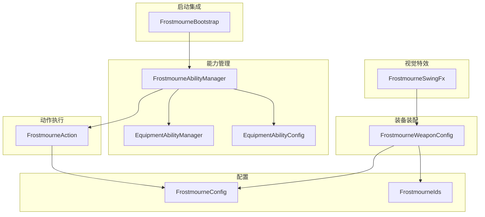
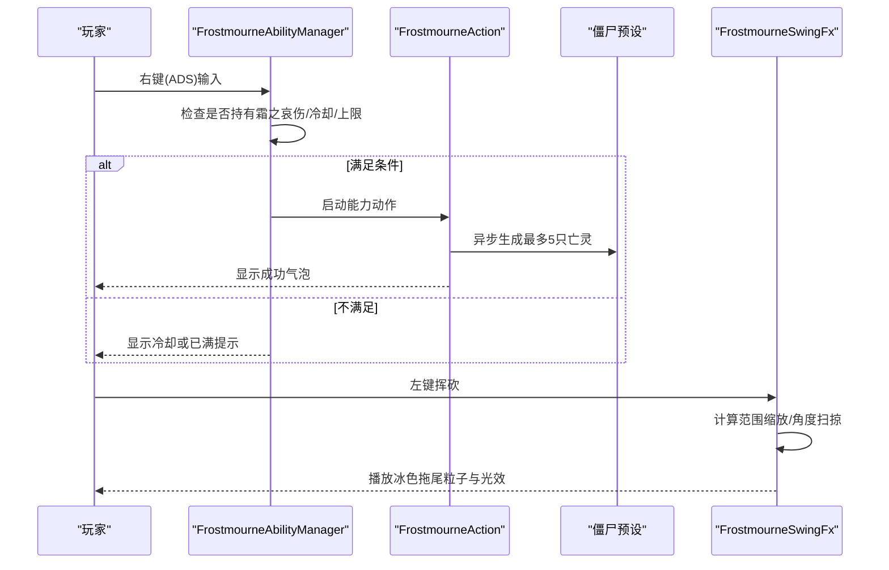
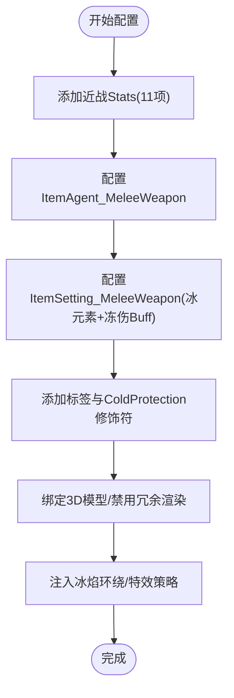
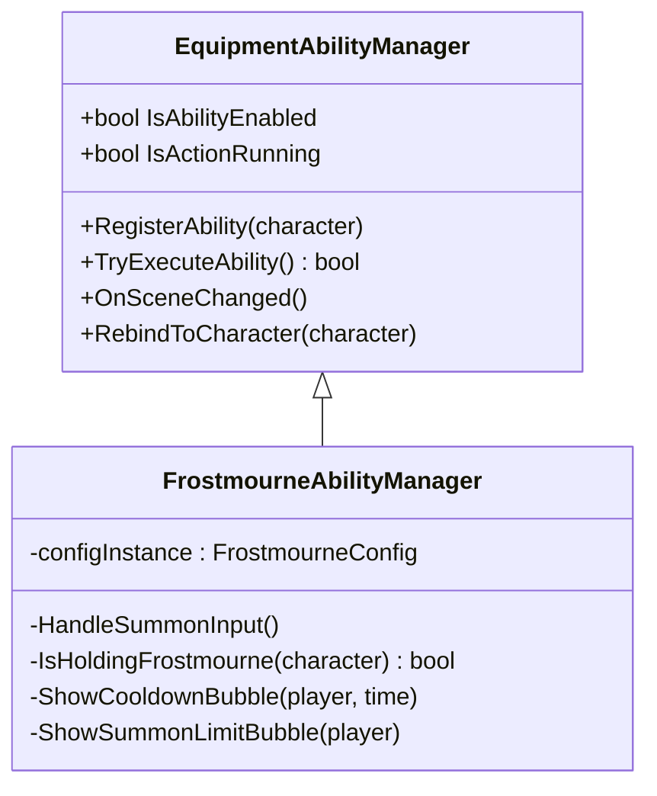
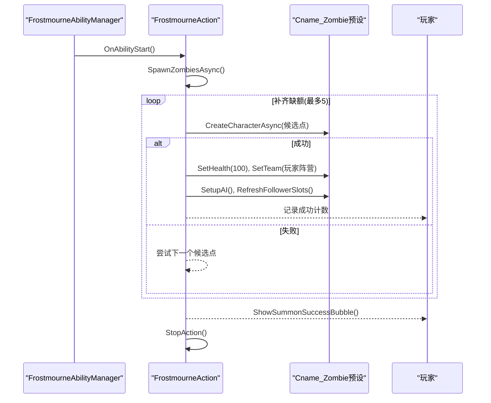
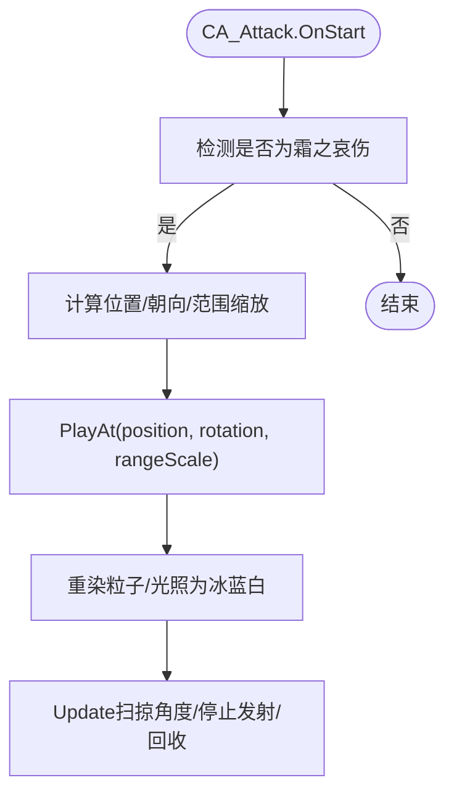
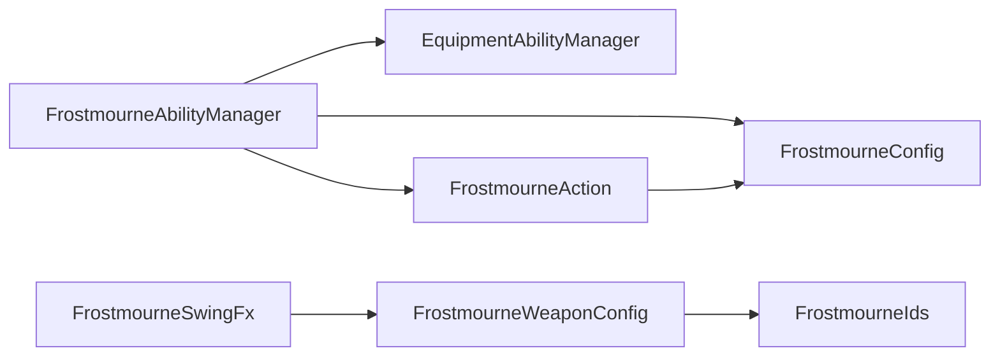

# 霜之哀伤（Frostmourne）

<cite>
**本文引用的文件**
- [FrostmourneWeaponConfig.cs](file://Integration/Frostmourne/FrostmourneWeaponConfig.cs)
- [FrostmourneAbilityManager.cs](file://Integration/Frostmourne/FrostmourneAbilityManager.cs)
- [FrostmourneSwingFx.cs](file://Integration/Frostmourne/FrostmourneSwingFx.cs)
- [FrostmourneConfig.cs](file://Integration/Frostmourne/FrostmourneConfig.cs)
- [FrostmourneAction.cs](file://Integration/Frostmourne/FrostmourneAction.cs)
- [FrostmourneBootstrap.cs](file://Integration/Frostmourne/FrostmourneBootstrap.cs)
- [FrostmourneIds.cs](file://Integration/Frostmourne/FrostmourneIds.cs)
- [EquipmentAbilityManager.cs](file://Common/Equipment/EquipmentAbilityManager.cs)
- [EquipmentAbilityConfig.cs](file://Common/Equipment/EquipmentAbilityConfig.cs)
</cite>

## 目录
1. [简介](#简介)
2. [项目结构](#项目结构)
3. [核心组件](#核心组件)
4. [架构总览](#架构总览)
5. [详细组件分析](#详细组件分析)
6. [依赖关系分析](#依赖关系分析)
7. [性能与平衡性调优](#性能与平衡性调优)
8. [故障排查指南](#故障排查指南)
9. [结论](#结论)
10. [附录：自定义示例路径](#附录自定义示例路径)

## 简介
本文件为“霜之哀伤”武器模块的技术文档，聚焦以下目标：
- 解释核心机制：冰霜伤害、范围减速（通过冻伤 Buff）、攻击连击系统（挥砍轨迹与特效）。
- 说明武器配置器 FrostmourneWeaponConfig 的属性设置（基础伤害、攻击速度、范围等）。
- 阐述能力管理器 FrostmourneAbilityManager 如何控制技能释放与冷却。
- 描述挥砍特效 FrostmourneSwingFx 的粒子与光照实现细节。
- 提供平衡性调优建议与常见问题解决方案。
- 给出可操作的自定义路径（以代码片段路径形式引用）。

## 项目结构
霜之哀伤位于 Integration/Frostmourne 目录下，围绕“配置—能力—动作—特效—启动”分层组织：
- 配置层：FrostmourneConfig、FrostmourneIds
- 装备装配层：FrostmourneWeaponConfig
- 能力管理层：FrostmourneAbilityManager（继承通用基类 EquipmentAbilityManager）
- 动作执行层：FrostmourneAction（右键召唤亡灵）
- 视觉表现层：FrostmourneSwingFx（左键挥砍拖尾）
- 启动集成层：FrostmourneBootstrap（注册、场景切换、清理）

图表来源
- [FrostmourneBootstrap.cs:28-121](file://Integration/Frostmourne/FrostmourneBootstrap.cs#L28-L121)
- [FrostmourneAbilityManager.cs:18-92](file://Integration/Frostmourne/FrostmourneAbilityManager.cs#L18-L92)
- [EquipmentAbilityManager.cs:18-139](file://Common/Equipment/EquipmentAbilityManager.cs#L18-L139)
- [EquipmentAbilityConfig.cs:16-100](file://Common/Equipment/EquipmentAbilityConfig.cs#L16-L100)
- [FrostmourneConfig.cs:15-86](file://Integration/Frostmourne/FrostmourneConfig.cs#L15-L86)
- [FrostmourneSwingFx.cs:17-68](file://Integration/Frostmourne/FrostmourneSwingFx.cs#L17-L68)
- [FrostmourneWeaponConfig.cs:29-150](file://Integration/Frostmourne/FrostmourneWeaponConfig.cs#L29-L150)

章节来源
- [FrostmourneBootstrap.cs:28-121](file://Integration/Frostmourne/FrostmourneBootstrap.cs#L28-L121)
- [FrostmourneAbilityManager.cs:18-92](file://Integration/Frostmourne/FrostmourneAbilityManager.cs#L18-L92)
- [EquipmentAbilityManager.cs:18-139](file://Common/Equipment/EquipmentAbilityManager.cs#L18-L139)
- [EquipmentAbilityConfig.cs:16-100](file://Common/Equipment/EquipmentAbilityConfig.cs#L16-L100)
- [FrostmourneConfig.cs:15-86](file://Integration/Frostmourne/FrostmourneConfig.cs#L15-L86)
- [FrostmourneSwingFx.cs:17-68](file://Integration/Frostmourne/FrostmourneSwingFx.cs#L17-L68)
- [FrostmourneWeaponConfig.cs:29-150](file://Integration/Frostmourne/FrostmourneWeaponConfig.cs#L29-L150)

## 核心组件
- 武器配置器 FrostmourneWeaponConfig：负责在 AssetBundle 加载后为霜之哀伤注入近战 Stats、冰属性、标签、修饰符、本地化、模型绑定与特效策略。
- 能力管理器 FrostmourneAbilityManager：监听右键输入（ADS），校验持有武器、冷却与上限，触发召唤动作。
- 动作 FrostmourneAction：异步生成最多 5 只亡灵仆从，设置血量、阵营、AI 与跟随槽位，显示成功气泡。
- 挥砍特效 FrostmourneSwingFx：拦截 CA_Attack.OnStart，按攻击范围缩放生成冰色拖尾粒子与光效。
- 配置 FrostmourneConfig：定义名称、描述、品质、冷却、体力消耗、召唤数量/半径/血量、持续时间等。
- 启动 FrostmourneBootstrap：创建并持久化能力管理器，场景切换时重新绑定，清理资源。

章节来源
- [FrostmourneWeaponConfig.cs:84-150](file://Integration/Frostmourne/FrostmourneWeaponConfig.cs#L84-L150)
- [FrostmourneAbilityManager.cs:25-92](file://Integration/Frostmourne/FrostmourneAbilityManager.cs#L25-L92)
- [FrostmourneAction.cs:22-115](file://Integration/Frostmourne/FrostmourneAction.cs#L22-L115)
- [FrostmourneSwingFx.cs:17-68](file://Integration/Frostmourne/FrostmourneSwingFx.cs#L17-L68)
- [FrostmourneConfig.cs:15-86](file://Integration/Frostmourne/FrostmourneConfig.cs#L15-L86)
- [FrostmourneBootstrap.cs:28-121](file://Integration/Frostmourne/FrostmourneBootstrap.cs#L28-L121)

## 架构总览
霜之哀伤采用“配置驱动 + 能力框架 + 动作执行 + 特效反馈”的分层架构：
- 配置层集中参数，便于平衡性调整与多语言展示。
- 能力管理器统一处理输入拦截、冷却、状态提示与生命周期。
- 动作层专注业务逻辑（召唤、定位、AI 初始化）。
- 特效层通过 Harmony 钩子与粒子系统复用现有资产，重染为冰蓝白主题。
- 启动层确保运行时正确初始化与清理。

图表来源
- [FrostmourneAbilityManager.cs:99-138](file://Integration/Frostmourne/FrostmourneAbilityManager.cs#L99-L138)
- [FrostmourneAction.cs:133-286](file://Integration/Frostmourne/FrostmourneAction.cs#L133-L286)
- [FrostmourneSwingFx.cs:17-68](file://Integration/Frostmourne/FrostmourneSwingFx.cs#L17-L68)

## 详细组件分析

### 武器配置器 FrostmourneWeaponConfig
职责与关键点：
- 注入近战 Stats：伤害、暴击率/倍率、穿透、攻速、范围、耗耐力、出血概率、移速加成等（基于断界戟的 70% 基准）。
- 设置 ItemAgent_MeleeWeapon：手持插槽、动画类型、音效键、斩击特效延迟。
- 设置 ItemSetting_MeleeWeapon：元素类型为冰，附带冻伤 Buff（100% 触发）。
- 添加标签与 ColdProtection +2 修饰符。
- 绑定 3D 模型、禁用多余渲染器、修复运动模糊。
- 动态注入冰焰环绕效果（复制并着色粒子与材质）。
- 提供 MeleeWeaponFxPolicy 策略，允许回退到默认近战特效并应用自定义缩放。

图表来源
- [FrostmourneWeaponConfig.cs:172-202](file://Integration/Frostmourne/FrostmourneWeaponConfig.cs#L172-L202)
- [FrostmourneWeaponConfig.cs:206-278](file://Integration/Frostmourne/FrostmourneWeaponConfig.cs#L206-L278)
- [FrostmourneWeaponConfig.cs:647-681](file://Integration/Frostmourne/FrostmourneWeaponConfig.cs#L647-L681)
- [FrostmourneWeaponConfig.cs:710-757](file://Integration/Frostmourne/FrostmourneWeaponConfig.cs#L710-L757)
- [FrostmourneWeaponConfig.cs:346-450](file://Integration/Frostmourne/FrostmourneWeaponConfig.cs#L346-L450)

章节来源
- [FrostmourneWeaponConfig.cs:84-150](file://Integration/Frostmourne/FrostmourneWeaponConfig.cs#L84-L150)
- [FrostmourneWeaponConfig.cs:172-202](file://Integration/Frostmourne/FrostmourneWeaponConfig.cs#L172-L202)
- [FrostmourneWeaponConfig.cs:206-278](file://Integration/Frostmourne/FrostmourneWeaponConfig.cs#L206-L278)
- [FrostmourneWeaponConfig.cs:647-681](file://Integration/Frostmourne/FrostmourneWeaponConfig.cs#L647-L681)
- [FrostmourneWeaponConfig.cs:710-757](file://Integration/Frostmourne/FrostmourneWeaponConfig.cs#L710-L757)
- [FrostmourneWeaponConfig.cs:346-450](file://Integration/Frostmourne/FrostmourneWeaponConfig.cs#L346-L450)

### 能力管理器 FrostmourneAbilityManager
职责与关键点：
- 继承 EquipmentAbilityManager，统一管理输入检测、能力生命周期与动作实例。
- 监听 ADS（右键）输入，支持 InputAction 缓存与备用键盘检测。
- 前置校验：是否持有霜之哀伤、是否在冷却中、是否达到召唤上限。
- 失败时显示冷却气泡或上限提示；成功时调用 TryExecuteAbility 启动动作。
- 抑制原版 ADS 行为以避免冲突。

图表来源
- [EquipmentAbilityManager.cs:18-139](file://Common/Equipment/EquipmentAbilityManager.cs#L18-L139)
- [FrostmourneAbilityManager.cs:18-92](file://Integration/Frostmourne/FrostmourneAbilityManager.cs#L18-L92)
- [FrostmourneAbilityManager.cs:99-138](file://Integration/Frostmourne/FrostmourneAbilityManager.cs#L99-L138)
- [FrostmourneAbilityManager.cs:227-258](file://Integration/Frostmourne/FrostmourneAbilityManager.cs#L227-L258)
- [FrostmourneAbilityManager.cs:160-225](file://Integration/Frostmourne/FrostmourneAbilityManager.cs#L160-L225)

章节来源
- [FrostmourneAbilityManager.cs:25-92](file://Integration/Frostmourne/FrostmourneAbilityManager.cs#L25-L92)
- [FrostmourneAbilityManager.cs:99-138](file://Integration/Frostmourne/FrostmourneAbilityManager.cs#L99-L138)
- [FrostmourneAbilityManager.cs:160-225](file://Integration/Frostmourne/FrostmourneAbilityManager.cs#L160-L225)
- [FrostmourneAbilityManager.cs:227-258](file://Integration/Frostmourne/FrostmourneAbilityManager.cs#L227-L258)
- [EquipmentAbilityManager.cs:18-139](file://Common/Equipment/EquipmentAbilityManager.cs#L18-L139)

### 动作 FrostmourneAction（亡灵召唤）
职责与关键点：
- 异步生成最多 5 只 Cname_Zombie，按方位与半径分布，避免重叠与穿墙。
- 设置血量至固定值（100），加入玩家同阵营，禁止掉落，命名并激活。
- 初始化 AI 与跟随槽位，使亡灵自动寻敌并跟随玩家。
- 显示成功气泡（全额/补充），并在场景切换时重置缓存。
- 提供清理接口，保证资源释放。

图表来源
- [FrostmourneAction.cs:94-115](file://Integration/Frostmourne/FrostmourneAction.cs#L94-L115)
- [FrostmourneAction.cs:133-286](file://Integration/Frostmourne/FrostmourneAction.cs#L133-L286)
- [FrostmourneAction.cs:305-364](file://Integration/Frostmourne/FrostmourneAction.cs#L305-L364)
- [FrostmourneAction.cs:421-478](file://Integration/Frostmourne/FrostmourneAction.cs#L421-L478)
- [FrostmourneAction.cs:591-630](file://Integration/Frostmourne/FrostmourneAction.cs#L591-L630)

章节来源
- [FrostmourneAction.cs:22-115](file://Integration/Frostmourne/FrostmourneAction.cs#L22-L115)
- [FrostmourneAction.cs:133-286](file://Integration/Frostmourne/FrostmourneAction.cs#L133-L286)
- [FrostmourneAction.cs:305-364](file://Integration/Frostmourne/FrostmourneAction.cs#L305-L364)
- [FrostmourneAction.cs:421-478](file://Integration/Frostmourne/FrostmourneAction.cs#L421-L478)
- [FrostmourneAction.cs:591-630](file://Integration/Frostmourne/FrostmourneAction.cs#L591-L630)

### 挥砍特效 FrostmourneSwingFx
职责与关键点：
- 使用 Harmony Patch 拦截 CA_Attack.OnStart，当武器为霜之哀伤时追加拖尾特效。
- 根据当前攻击范围缩放拖尾距离与尺寸，沿水平方向扫掠角度。
- 复用龙息火焰拖尾资产，重染为冰蓝白主题，调整粒子发射、颜色渐变与光照强度。
- 对象池化管理，避免频繁创建销毁，提升性能。

图表来源
- [FrostmourneSwingFx.cs:17-68](file://Integration/Frostmourne/FrostmourneSwingFx.cs#L17-L68)
- [FrostmourneSwingFx.cs:122-188](file://Integration/Frostmourne/FrostmourneSwingFx.cs#L122-L188)
- [FrostmourneSwingFx.cs:190-225](file://Integration/Frostmourne/FrostmourneSwingFx.cs#L190-L225)
- [FrostmourneSwingFx.cs:227-305](file://Integration/Frostmourne/FrostmourneSwingFx.cs#L227-L305)
- [FrostmourneSwingFx.cs:307-338](file://Integration/Frostmourne/FrostmourneSwingFx.cs#L307-L338)

章节来源
- [FrostmourneSwingFx.cs:17-68](file://Integration/Frostmourne/FrostmourneSwingFx.cs#L17-L68)
- [FrostmourneSwingFx.cs:122-188](file://Integration/Frostmourne/FrostmourneSwingFx.cs#L122-L188)
- [FrostmourneSwingFx.cs:190-225](file://Integration/Frostmourne/FrostmourneSwingFx.cs#L190-L225)
- [FrostmourneSwingFx.cs:227-305](file://Integration/Frostmourne/FrostmourneSwingFx.cs#L227-L305)
- [FrostmourneSwingFx.cs:307-338](file://Integration/Frostmourne/FrostmourneSwingFx.cs#L307-L338)

### 配置 FrostmourneConfig
关键参数：
- 物品信息：名称、描述、品质、标签、图标资源名。
- 能力参数：冷却时间 10 秒，起始体力消耗 14，无持续消耗。
- 召唤参数：数量 5，半径 2.5 米，生命值 100，预设名 Cname_Zombie，总持续时间 1.5 秒。
- 音效：未启用。

章节来源
- [FrostmourneConfig.cs:15-86](file://Integration/Frostmourne/FrostmourneConfig.cs#L15-L86)

### 启动 FrostmourneBootstrap
职责：
- 创建并持久化 FrostmourneAbilityManager。
- 场景切换后延迟绑定到玩家角色，必要时重建能力动作。
- 清理时注销能力、清理所有召唤亡灵、清理额外掉落订阅。

章节来源
- [FrostmourneBootstrap.cs:28-121](file://Integration/Frostmourne/FrostmourneBootstrap.cs#L28-L121)
- [FrostmourneBootstrap.cs:128-147](file://Integration/Frostmourne/FrostmourneBootstrap.cs#L128-L147)

## 依赖关系分析
- FrostmourneAbilityManager 依赖 EquipmentAbilityManager 提供的输入拦截、能力生命周期与动作管理。
- FrostmourneAction 依赖 FrostmourneConfig 中的常量与预设查找，依赖游戏内 CharacterRandomPreset 与 AI 系统。
- FrostmourneSwingFx 依赖 CA_Attack 钩子与粒子系统，复用其他武器拖尾资产进行重染色。
- FrostmourneWeaponConfig 依赖 ItemStatsSystem、EquipmentHelper、Harmony 反射与资源系统。

图表来源
- [FrostmourneAbilityManager.cs:18-92](file://Integration/Frostmourne/FrostmourneAbilityManager.cs#L18-L92)
- [FrostmourneAction.cs:22-115](file://Integration/Frostmourne/FrostmourneAction.cs#L22-L115)
- [FrostmourneSwingFx.cs:17-68](file://Integration/Frostmourne/FrostmourneSwingFx.cs#L17-L68)
- [FrostmourneWeaponConfig.cs:29-150](file://Integration/Frostmourne/FrostmourneWeaponConfig.cs#L29-L150)
- [FrostmourneIds.cs:10-36](file://Integration/Frostmourne/FrostmourneIds.cs#L10-L36)

章节来源
- [FrostmourneAbilityManager.cs:18-92](file://Integration/Frostmourne/FrostmourneAbilityManager.cs#L18-L92)
- [FrostmourneAction.cs:22-115](file://Integration/Frostmourne/FrostmourneAction.cs#L22-L115)
- [FrostmourneSwingFx.cs:17-68](file://Integration/Frostmourne/FrostmourneSwingFx.cs#L17-L68)
- [FrostmourneWeaponConfig.cs:29-150](file://Integration/Frostmourne/FrostmourneWeaponConfig.cs#L29-L150)
- [FrostmourneIds.cs:10-36](file://Integration/Frostmourne/FrostmourneIds.cs#L10-L36)

## 性能与平衡性调优
- 性能优化要点
  - 特效对象池：FrostmourneSwingFx 使用栈式对象池限制最大实例数，减少 GC 压力。
  - 粒子与光照重染：仅在需要时复制并重载材质，避免每帧分配。
  - 异步召唤：SpawnZombiesAsync 分帧执行，避免卡顿。
  - 碰撞检测：使用非分配 OverlapCapsuleNonAlloc 减少内存分配。
- 平衡性调优建议
  - 基础伤害与攻速：可在 FrostmourneWeaponConfig 的 WEAPON_STATS 字典中调整 Damage、AttackSpeed、AttackRange 等数值。
  - 冰霜附加伤害：通过 ItemSetting_MeleeWeapon 的冰元素与冻伤 Buff 实现，可通过修改 buffChance 或替换 Buff 来调节。
  - 冷却与体力：在 FrostmourneConfig 中调整 CooldownTime 与 StartupStaminaCost。
  - 召唤上限与半径：调整 SummonCount、SummonRadius、ZombieHealth 以控制整体输出与生存。
  - 特效强度：在 FrostmourneSwingFx 中调整粒子发射速率、颜色渐变与光照强度，影响视觉反馈但不改变伤害。

[本节为通用指导，不直接分析具体文件]

## 故障排查指南
- 右键无法触发召唤
  - 检查是否持有霜之哀伤：IsHoldingFrostmourne 会验证 TypeID。
  - 检查是否在冷却中：若 remainingCooldown > 0，将显示冷却气泡。
  - 检查是否达到上限：IsSummonCapReached 返回 true 时显示已满提示。
  - 参考路径
    - [FrostmourneAbilityManager.cs:99-138](file://Integration/Frostmourne/FrostmourneAbilityManager.cs#L99-L138)
    - [FrostmourneAbilityManager.cs:160-225](file://Integration/Frostmourne/FrostmourneAbilityManager.cs#L160-L225)
    - [FrostmourneAbilityManager.cs:227-258](file://Integration/Frostmourne/FrostmourneAbilityManager.cs#L227-L258)
- 召唤失败或无僵尸
  - 检查 Cname_Zombie 预设是否存在：FindZombiePreset 会缓存结果。
  - 检查生成点有效性：IsSpawnPointValid 与 SnapToGround 确保地面与避障。
  - 参考路径
    - [FrostmourneAction.cs:133-286](file://Integration/Frostmourne/FrostmourneAction.cs#L133-L286)
    - [FrostmourneAction.cs:305-364](file://Integration/Frostmourne/FrostmourneAction.cs#L305-L364)
    - [FrostmourneAction.cs:386-419](file://Integration/Frostmourne/FrostmourneAction.cs#L386-L419)
    - [FrostmourneAction.cs:480-526](file://Integration/Frostmourne/FrostmourneAction.cs#L480-L526)
- 挥砍特效不显示
  - 确认 CA_Attack.OnStart 钩子生效且武器 TypeID 匹配。
  - 检查 EnsureMeleeAttackFx 与 PlayAt 调用链。
  - 参考路径
    - [FrostmourneSwingFx.cs:17-68](file://Integration/Frostmourne/FrostmourneSwingFx.cs#L17-L68)
    - [FrostmourneSwingFx.cs:122-188](file://Integration/Frostmourne/FrostmourneSwingFx.cs#L122-L188)
- 场景切换后能力失效
  - 检查 OnSceneChanged 与 RebindToCharacter 是否被调用。
  - 参考路径
    - [FrostmourneBootstrap.cs:54-121](file://Integration/Frostmourne/FrostmourneBootstrap.cs#L54-L121)
    - [EquipmentAbilityManager.cs:433-484](file://Common/Equipment/EquipmentAbilityManager.cs#L433-L484)

章节来源
- [FrostmourneAbilityManager.cs:99-138](file://Integration/Frostmourne/FrostmourneAbilityManager.cs#L99-L138)
- [FrostmourneAbilityManager.cs:160-225](file://Integration/Frostmourne/FrostmourneAbilityManager.cs#L160-L225)
- [FrostmourneAbilityManager.cs:227-258](file://Integration/Frostmourne/FrostmourneAbilityManager.cs#L227-L258)
- [FrostmourneAction.cs:133-286](file://Integration/Frostmourne/FrostmourneAction.cs#L133-L286)
- [FrostmourneAction.cs:305-364](file://Integration/Frostmourne/FrostmourneAction.cs#L305-L364)
- [FrostmourneAction.cs:386-419](file://Integration/Frostmourne/FrostmourneAction.cs#L386-L419)
- [FrostmourneAction.cs:480-526](file://Integration/Frostmourne/FrostmourneAction.cs#L480-L526)
- [FrostmourneSwingFx.cs:17-68](file://Integration/Frostmourne/FrostmourneSwingFx.cs#L17-L68)
- [FrostmourneSwingFx.cs:122-188](file://Integration/Frostmourne/FrostmourneSwingFx.cs#L122-L188)
- [FrostmourneBootstrap.cs:54-121](file://Integration/Frostmourne/FrostmourneBootstrap.cs#L54-L121)
- [EquipmentAbilityManager.cs:433-484](file://Common/Equipment/EquipmentAbilityManager.cs#L433-L484)

## 结论
霜之哀伤通过清晰的模块化设计实现了“冰霜属性 + 范围减速 + 召唤支援 + 冰色挥砍特效”的完整体验。配置层集中参数，能力层统一输入与生命周期，动作层专注召唤逻辑，特效层提供高辨识度的视觉反馈。该架构易于扩展与调优，适合进一步定制伤害、冷却、特效与召唤行为。

[本节为总结，不直接分析具体文件]

## 附录：自定义示例路径
- 调整基础伤害与攻速
  - 参考路径：[FrostmourneWeaponConfig.cs:43-69](file://Integration/Frostmourne/FrostmourneWeaponConfig.cs#L43-L69)
- 修改冰霜附加伤害（冻伤 Buff）
  - 参考路径：[FrostmourneWeaponConfig.cs:647-681](file://Integration/Frostmourne/FrostmourneWeaponConfig.cs#L647-L681)
- 调整右键技能冷却与体力消耗
  - 参考路径：[FrostmourneConfig.cs:35-49](file://Integration/Frostmourne/FrostmourneConfig.cs#L35-L49)
- 调整召唤数量、半径与血量
  - 参考路径：[FrostmourneConfig.cs:50-76](file://Integration/Frostmourne/FrostmourneConfig.cs#L50-L76)
- 自定义挥砍特效强度与颜色
  - 参考路径：[FrostmourneSwingFx.cs:227-305](file://Integration/Frostmourne/FrostmourneSwingFx.cs#L227-L305)
- 注入新标签或修饰符
  - 参考路径：[FrostmourneWeaponConfig.cs:685-757](file://Integration/Frostmourne/FrostmourneWeaponConfig.cs#L685-L757)

[本节为索引，不直接分析具体文件]