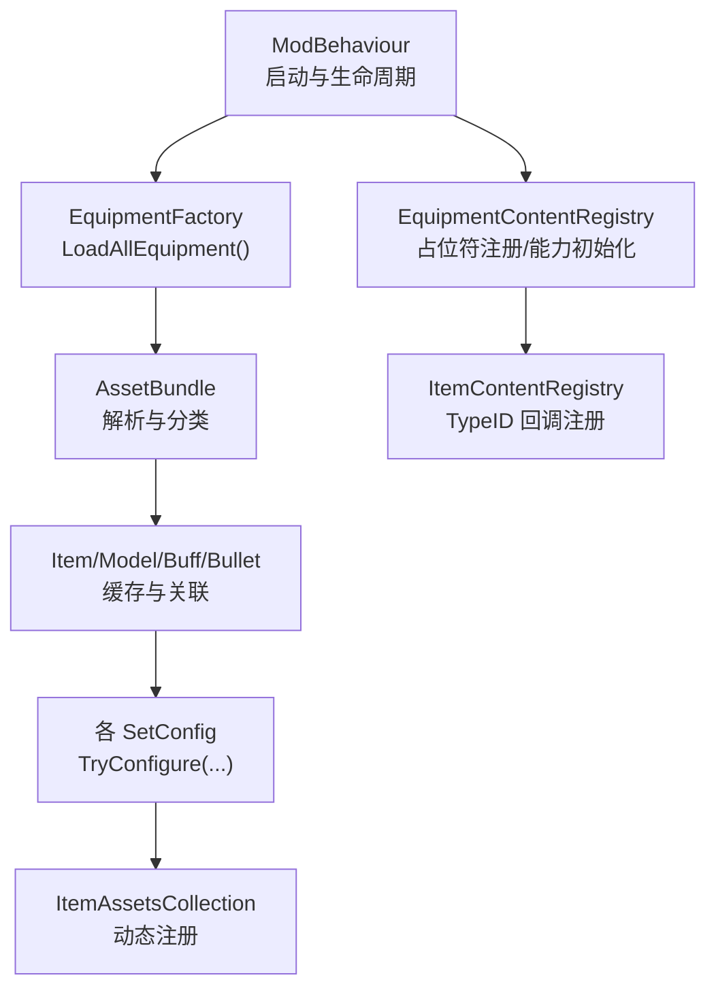
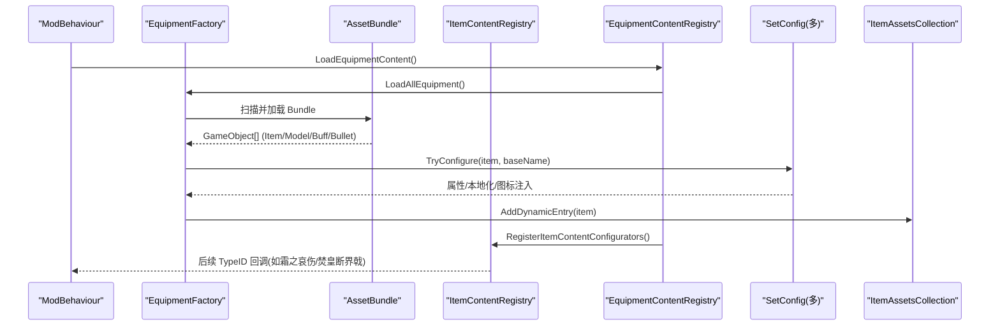
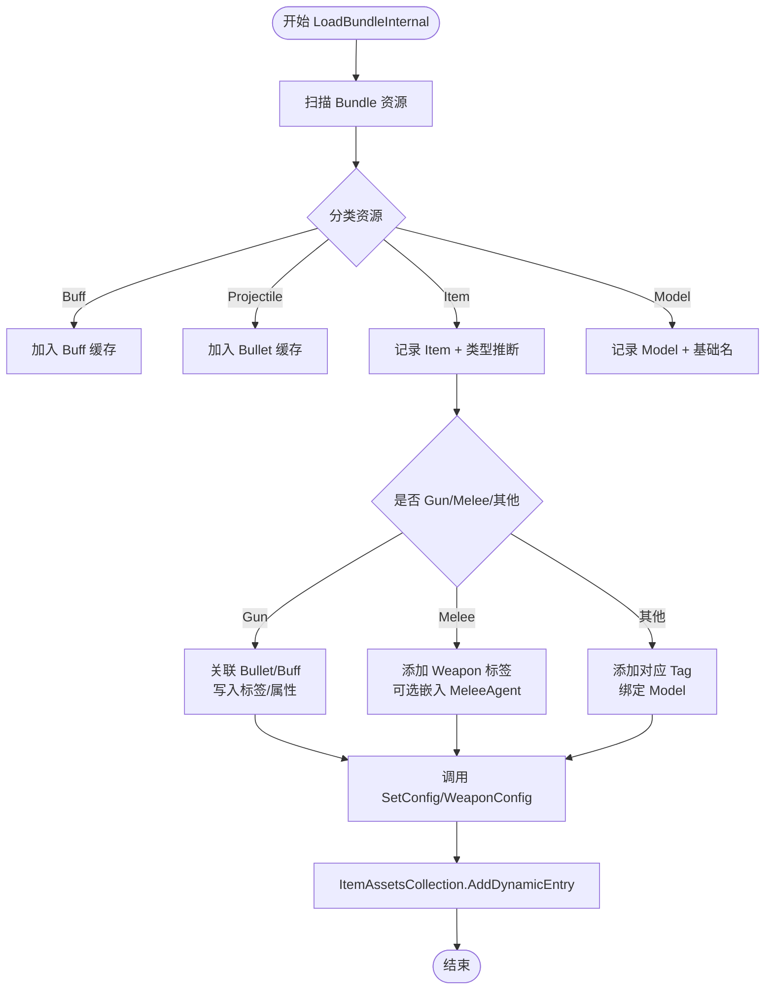
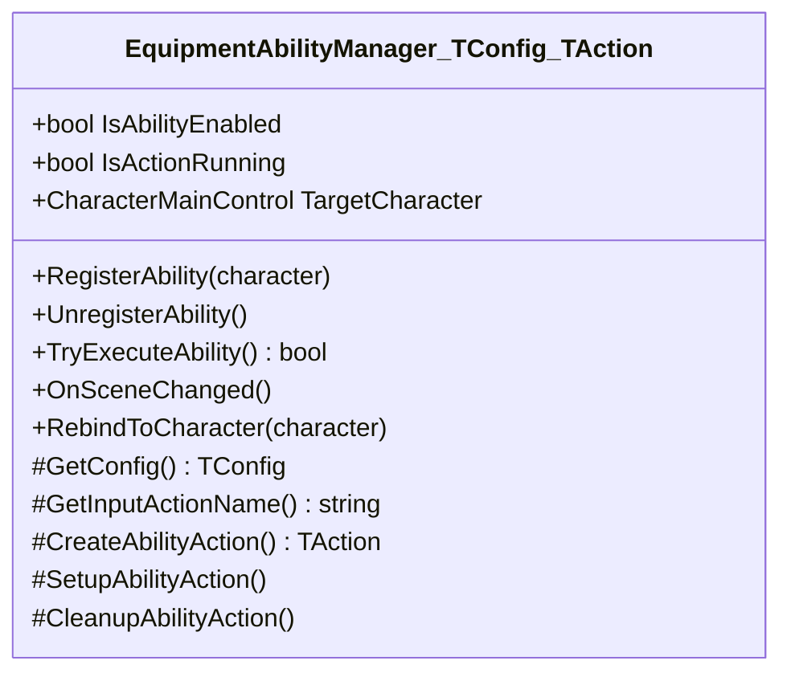
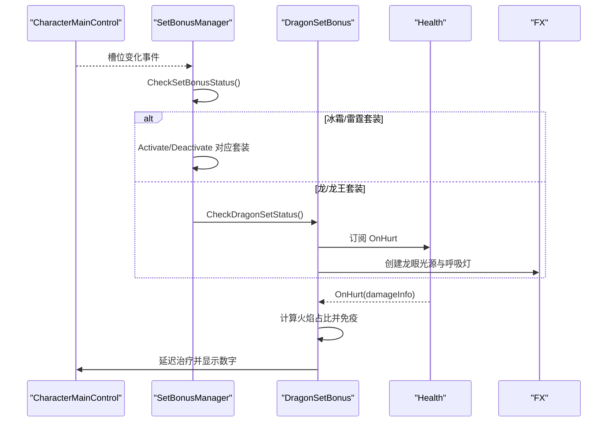
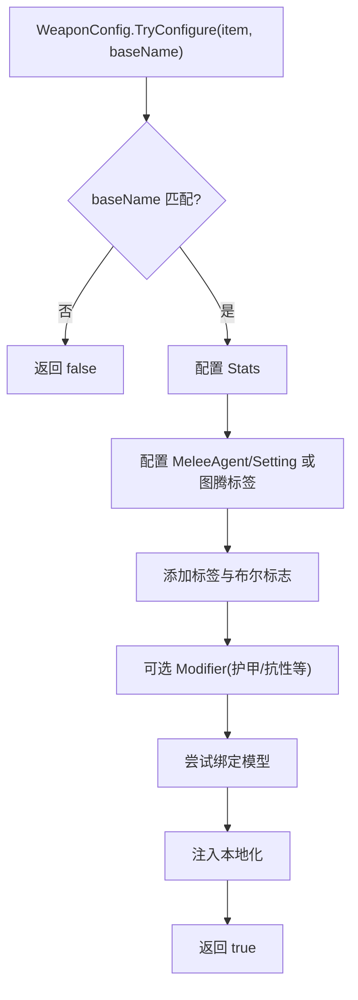
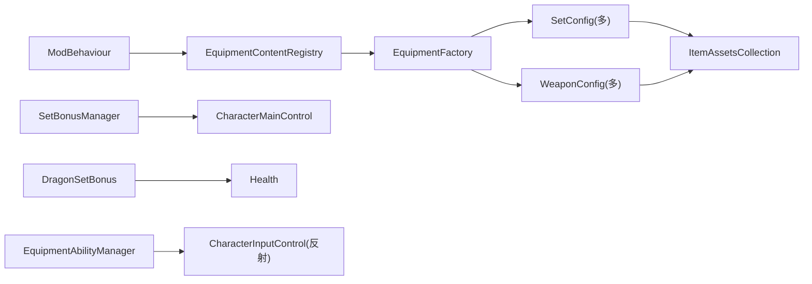

# 装备与物品系统

<cite>
**本文引用的文件**
- [EquipmentFactory.cs](file://Integration/EquipmentFactory.cs)
- [EquipmentContentRegistry.cs](file://Integration/EquipmentContentRegistry.cs)
- [ItemContentRegistry.cs](file://Integration/Items/ItemContentRegistry.cs)
- [EquipmentAbilityManager.cs](file://Common/Equipment/EquipmentAbilityManager.cs)
- [SetBonusManager.cs](file://Integration/Bonus/SetBonusManager.cs)
- [DragonSetBonus.cs](file://Integration/Bonus/DragonSetBonus.cs)
- [DragonSetConfig.cs](file://Integration/Config/DragonSetConfig.cs)
- [DragonKingSetConfig.cs](file://Integration/Config/DragonKingSetConfig.cs)
- [FrostThunderSetConfig.cs](file://Integration/Config/FrostThunderSetConfig.cs)
- [ViperDaggerWeaponConfig.cs](file://Integration/NewWeapons/ViperDagger/ViperDaggerWeaponConfig.cs)
- [SummonStaffWeaponConfig.cs](file://Integration/NewWeapons/SummonStaff/SummonStaffWeaponConfig.cs)
- [EnergyShieldWeaponConfig.cs](file://Integration/NewWeapons/EnergyShield/EnergyShieldWeaponConfig.cs)
- [FrostSpearWeaponConfig.cs](file://Integration/NewWeapons/FrostSpear/FrostSpearWeaponConfig.cs)
- [ThunderRingWeaponConfig.cs](file://Integration/NewWeapons/ThunderRing/ThunderRingWeaponConfig.cs)
</cite>

## 目录
1. [简介](#简介)
2. [项目结构](#项目结构)
3. [核心组件](#核心组件)
4. [架构总览](#架构总览)
5. [详细组件分析](#详细组件分析)
6. [依赖关系分析](#依赖关系分析)
7. [性能考量](#性能考量)
8. [故障排查指南](#故障排查指南)
9. [结论](#结论)
10. [附录：新装备与新物品开发指南](#附录新装备与新物品开发指南)

## 简介
本文件系统性梳理 BossRushMod 的“装备与物品系统”，覆盖装备框架、能力系统、套装效果机制，以及六件自定义武器（霜之哀伤、毒蛇匕首、召唤法杖、能量盾、冰霜长矛、雷电戒指）的实现细节。文档同时说明物品注册表、工厂模式、动态加载流程，并提供扩展新装备与新物品的实践指南。

## 项目结构
- 资源加载与装配
  - EquipmentFactory：从 AssetBundle 自动扫描并加载装备/武器/子弹/Buff，完成类型识别、模型绑定、标签与属性注入、套装配置器调用。
  - EquipmentContentRegistry：在模组启动阶段统一触发装备内容加载、占位符注册、运行时能力系统初始化。
  - ItemContentRegistry：为特定 TypeID 注册后期配置回调，确保真实资源或占位符都能获得完整配置。
- 能力系统
  - EquipmentAbilityManager：抽象基类，提供输入拦截、动作生命周期、角色绑定、场景切换重建等通用能力管理。
- 套装系统
  - SetBonusManager：监听护甲/头盔槽变化，检测冰霜/雷霆套装并激活/停用对应效果。
  - DragonSetBonus：检测龙/龙王套装，实现火焰伤害转治疗、龙眼特效、物理减伤提示等。
  - DragonSetConfig / DragonKingSetConfig / FrostThunderSetConfig：分别负责三套装备的基础属性、图标、模型与本地化注入。
- 自定义武器配置器
  - 各 WeaponConfig 文件：为具体武器注入 Stats、MeleeAgent/Setting、标签、Modifier、本地化与模型绑定。

图表来源
- [EquipmentFactory.cs:176-249](file://Integration/EquipmentFactory.cs#L176-L249)
- [EquipmentContentRegistry.cs:8-61](file://Integration/EquipmentContentRegistry.cs#L8-L61)
- [ItemContentRegistry.cs:5-33](file://Integration/Items/ItemContentRegistry.cs#L5-L33)

章节来源
- [EquipmentFactory.cs:176-749](file://Integration/EquipmentFactory.cs#L176-L749)
- [EquipmentContentRegistry.cs:8-75](file://Integration/EquipmentContentRegistry.cs#L8-L75)
- [ItemContentRegistry.cs:5-33](file://Integration/Items/ItemContentRegistry.cs#L5-L33)

## 核心组件
- 装备工厂（EquipmentFactory）
  - 自动扫描 Assets/Equipment 下所有无扩展名 Bundle，按名称规则识别装备/武器/图腾/近战武器。
  - 维护已加载模型、Buff、子弹、武器的静态缓存，避免重复加载。
  - 对武器自动匹配同名 Bullet/Buff；对近战武器支持单独注册 TypeID 防止误识别为枪械。
  - 在加载完成后依次调用各类 SetConfig.TryConfigure 完成属性与本地化。
- 内容注册（EquipmentContentRegistry / ItemContentRegistry）
  - 先加载全部装备，再注册“新武器占位符”和“套装占位符”，保证即使缺少资源也能通过配置器补齐 Stats/标签/本地化。
  - 针对特定 TypeID 注册后期回调，用于绑定模型或追加特性。
- 能力管理器（EquipmentAbilityManager）
  - 基于泛型抽象基类，封装输入拦截、动作创建/销毁、角色绑定、场景切换重建。
  - 子类只需实现 GetConfig、GetInputActionName、CreateAbilityAction 等钩子。
- 套装管理器（SetBonusManager / DragonSetBonus）
  - SetBonusManager：监听护甲/头盔槽事件，检测冰霜/雷霆套装并分发激活/停用。
  - DragonSetBonus：检测龙/龙王套装，订阅伤害事件将火焰伤害按比例转化为治疗，并驱动龙眼呼吸灯特效。
- 套装配置（DragonSetConfig / DragonKingSetConfig / FrostThunderSetConfig）
  - 为每件套装设置护甲值、耐久度、元素抗性、视野、爆头加成等 Modifier，并注入图标与本地化。
  - 龙王套装移除了毒承伤增加与视野减少等负面效果。

章节来源
- [EquipmentFactory.cs:114-749](file://Integration/EquipmentFactory.cs#L114-L749)
- [EquipmentContentRegistry.cs:8-75](file://Integration/EquipmentContentRegistry.cs#L8-L75)
- [ItemContentRegistry.cs:5-33](file://Integration/Items/ItemContentRegistry.cs#L5-L33)
- [EquipmentAbilityManager.cs:15-577](file://Common/Equipment/EquipmentAbilityManager.cs#L15-L577)
- [SetBonusManager.cs:23-225](file://Integration/Bonus/SetBonusManager.cs#L23-L225)
- [DragonSetBonus.cs:32-707](file://Integration/Bonus/DragonSetBonus.cs#L32-L707)
- [DragonSetConfig.cs:27-205](file://Integration/Config/DragonSetConfig.cs#L27-L205)
- [DragonKingSetConfig.cs:18-190](file://Integration/Config/DragonKingSetConfig.cs#L18-L190)
- [FrostThunderSetConfig.cs:17-185](file://Integration/Config/FrostThunderSetConfig.cs#L17-L185)

## 架构总览

图表来源
- [EquipmentContentRegistry.cs:8-61](file://Integration/EquipmentContentRegistry.cs#L8-L61)
- [EquipmentFactory.cs:176-749](file://Integration/EquipmentFactory.cs#L176-L749)
- [ItemContentRegistry.cs:5-33](file://Integration/Items/ItemContentRegistry.cs#L5-L33)

## 详细组件分析

### 装备工厂与动态加载（EquipmentFactory）
- 自动加载流程
  - 扫描 mod 目录下的 Assets/Equipment，过滤非 Bundle 文件，逐个 LoadFromFile。
  - 第一遍分类：识别 Buff、Projectile、Item、ItemAgent，按基础名建立映射。
  - 第二遍处理：根据名称推断类型（Gun/MeleeWeapon/Totem/Armor/Helmet/Backpack/FaceMask/Headset），关联 Model/Buff/Bullet，写入标签与属性，最后注册到 ItemAssetsCollection。
- 类型识别与命名约定
  - 武器：_gun_/_rifle_/_pistol_/_shotgun_/_smg_ 等后缀识别为 Gun。
  - 近战：_melee_/_sword_/_axe_ 等识别为 MeleeWeapon，可通过 RegisterMeleeWeapon(TypeID) 强制标记。
  - 装备：Helmet/Armor/Backpack/FaceMask/Headset 等。
  - 图腾：包含 _totem_ 或 totem 关键字。
- 模型与资源绑定
  - 通过 ExtractBaseName 提取基础名，支持 _Item/_Model/_Bullet/_Buff 等后缀。
  - 武器自动匹配同名 Bullet/Buff 并注入到 ItemSetting_Gun。
  - 近战武器可嵌入或外部绑定 ItemAgent_MeleeWeapon，并注入 Handheld 代理。
- 套装与扩展配置
  - 加载后依次调用 DragonSetConfig、DragonKingSetConfig、FrostThunderSetConfig、FlightTotemConfig、ReverseScale、DragonBreathWeaponConfig 以及五把新武器的 WeaponConfig.TryConfigure。

图表来源
- [EquipmentFactory.cs:498-749](file://Integration/EquipmentFactory.cs#L498-L749)

章节来源
- [EquipmentFactory.cs:114-749](file://Integration/EquipmentFactory.cs#L114-L749)

### 能力系统（EquipmentAbilityManager）
- 设计要点
  - 单例管理器，持有目标角色与能力动作对象。
  - 通过反射缓存 CharacterInputControl 的 InputAction，优先使用 WasPressedThisFrame 检测按键。
  - 提供 OnBeforeActivate/OnAfterActivate/OnAfterDeactivate/OnBeforeTryExecute 等钩子供子类定制。
  - 场景切换时重置输入缓存并重建能力动作，保证跨场景稳定。
- 典型用法
  - 继承基类，实现 GetConfig、GetInputActionName、CreateAbilityAction。
  - 在 Bootstrap 中创建实例并 EnsureInstance，随后在角色进入时 RegisterAbility。

图表来源
- [EquipmentAbilityManager.cs:15-577](file://Common/Equipment/EquipmentAbilityManager.cs#L15-L577)

章节来源
- [EquipmentAbilityManager.cs:15-577](file://Common/Equipment/EquipmentAbilityManager.cs#L15-L577)

### 套装系统（龙/龙王/冰霜/雷霆）
- 检测与激活
  - SetBonusManager 监听护甲/头盔槽变化与场景初始化，按 TypeID 判断是否穿戴了冰霜/雷霆套装，并调用对应 Activate/Deactivate。
  - DragonSetBonus 通过名称匹配龙头/龙甲与龙王之冕/龙王鳞铠，激活后订阅 Health.OnHurt，将火焰伤害按比例转化为治疗，并驱动龙眼呼吸灯。
- 属性与本地化
  - DragonSetConfig：为龙头/龙甲设置 HeadArmor/BodyArmor、耐久度、风暴/寒冷防护、元素抗性、视野角度、爆头加成等。
  - DragonKingSetConfig：在龙套装基础上移除毒承伤增加与视野减少等负面效果，提升部分抗性。
  - FrostThunderSetConfig：为四件套设置默认品质、耐久、基础护甲、图标与模型绑定，支持按 TypeID 二次配置。

图表来源
- [SetBonusManager.cs:44-225](file://Integration/Bonus/SetBonusManager.cs#L44-L225)
- [DragonSetBonus.cs:80-513](file://Integration/Bonus/DragonSetBonus.cs#L80-L513)

章节来源
- [SetBonusManager.cs:23-225](file://Integration/Bonus/SetBonusManager.cs#L23-L225)
- [DragonSetBonus.cs:32-707](file://Integration/Bonus/DragonSetBonus.cs#L32-L707)
- [DragonSetConfig.cs:27-205](file://Integration/Config/DragonSetConfig.cs#L27-L205)
- [DragonKingSetConfig.cs:18-190](file://Integration/Config/DragonKingSetConfig.cs#L18-L190)
- [FrostThunderSetConfig.cs:17-185](file://Integration/Config/FrostThunderSetConfig.cs#L17-L185)

### 自定义武器实现细节
- 毒蛇匕首（ViperDagger）
  - 注入近战 Stats、ItemAgent_MeleeWeapon、ItemSetting_MeleeWeapon（毒元素，100% 中毒概率）、标签与本地化，并绑定模型。
- 召唤法杖（SummonStaff）
  - 注入近战 Stats、MeleeAgent/Setting（物理元素，无异常状态）、标签与本地化，并绑定模型。
- 能量盾（EnergyShield）
  - 作为图腾类装备，添加 Totem 标签、BodyArmor 加成的 Modifier，绑定模型并注入本地化。
- 冰霜长矛（FrostSpear）
  - 注入近战 Stats、MeleeAgent/Setting（冰元素，高冰冻概率）、ColdProtection 加成、标签与本地化，并绑定模型。
- 雷电戒指（ThunderRing）
  - 作为图腾类装备，添加 Totem 标签，绑定模型并注入本地化。
- 霜之哀伤（Frostmourne）
  - 通过 ItemContentRegistry 注册 TypeID 回调，在资源加载后由 EquipmentContentRegistry 调用 FrostmourneWeaponConfig.TryConfigure 完成模型绑定与配置。

图表来源
- [ViperDaggerWeaponConfig.cs:50-101](file://Integration/NewWeapons/ViperDagger/ViperDaggerWeaponConfig.cs#L50-L101)
- [SummonStaffWeaponConfig.cs:50-88](file://Integration/NewWeapons/SummonStaff/SummonStaffWeaponConfig.cs#L50-L88)
- [EnergyShieldWeaponConfig.cs:25-59](file://Integration/NewWeapons/EnergyShield/EnergyShieldWeaponConfig.cs#L25-L59)
- [FrostSpearWeaponConfig.cs:50-90](file://Integration/NewWeapons/FrostSpear/FrostSpearWeaponConfig.cs#L50-L90)
- [ThunderRingWeaponConfig.cs:24-55](file://Integration/NewWeapons/ThunderRing/ThunderRingWeaponConfig.cs#L24-L55)
- [ItemContentRegistry.cs:5-33](file://Integration/Items/ItemContentRegistry.cs#L5-L33)

章节来源
- [ViperDaggerWeaponConfig.cs:23-230](file://Integration/NewWeapons/ViperDagger/ViperDaggerWeaponConfig.cs#L23-L230)
- [SummonStaffWeaponConfig.cs:23-201](file://Integration/NewWeapons/SummonStaff/SummonStaffWeaponConfig.cs#L23-L201)
- [EnergyShieldWeaponConfig.cs:17-115](file://Integration/NewWeapons/EnergyShield/EnergyShieldWeaponConfig.cs#L17-L115)
- [FrostSpearWeaponConfig.cs:24-233](file://Integration/NewWeapons/FrostSpear/FrostSpearWeaponConfig.cs#L24-L233)
- [ThunderRingWeaponConfig.cs:16-99](file://Integration/NewWeapons/ThunderRing/ThunderRingWeaponConfig.cs#L16-L99)
- [ItemContentRegistry.cs:5-33](file://Integration/Items/ItemContentRegistry.cs#L5-L33)

## 依赖关系分析
- 低耦合与高内聚
  - EquipmentFactory 仅负责资源加载与装配，具体行为委托给各 SetConfig/WeaponConfig。
  - 套装检测与效果逻辑分离：SetBonusManager 负责检测，DragonSetBonus 负责效果，SetConfig 负责静态属性。
- 关键依赖链
  - ModBehaviour -> EquipmentContentRegistry -> EquipmentFactory -> SetConfig/WeaponConfig -> ItemAssetsCollection。
  - 运行时：SetBonusManager/DragonSetBonus 依赖 CharacterMainControl 事件与 Health 事件。
  - 能力系统：EquipmentAbilityManager 依赖 CharacterInputControl（反射）与 CharacterMainControl.StartAction。

图表来源
- [EquipmentContentRegistry.cs:8-61](file://Integration/EquipmentContentRegistry.cs#L8-L61)
- [EquipmentFactory.cs:176-749](file://Integration/EquipmentFactory.cs#L176-L749)
- [SetBonusManager.cs:44-225](file://Integration/Bonus/SetBonusManager.cs#L44-L225)
- [DragonSetBonus.cs:80-513](file://Integration/Bonus/DragonSetBonus.cs#L80-L513)
- [EquipmentAbilityManager.cs:192-331](file://Common/Equipment/EquipmentAbilityManager.cs#L192-L331)

章节来源
- [EquipmentContentRegistry.cs:8-61](file://Integration/EquipmentContentRegistry.cs#L8-L61)
- [EquipmentFactory.cs:176-749](file://Integration/EquipmentFactory.cs#L176-L749)
- [SetBonusManager.cs:44-225](file://Integration/Bonus/SetBonusManager.cs#L44-L225)
- [DragonSetBonus.cs:80-513](file://Integration/Bonus/DragonSetBonus.cs#L80-L513)
- [EquipmentAbilityManager.cs:192-331](file://Common/Equipment/EquipmentAbilityManager.cs#L192-L331)

## 性能考量
- 反射缓存
  - SetBonusManager/DragonSetBonus 缓存 CharacterMainControl 的事件字段 FieldInfo，避免重复反射。
  - EquipmentAbilityManager 缓存 InputAction 引用与 WasPressedThisFrame 方法，降低每帧开销。
- 资源与对象复用
  - EquipmentFactory 维护 loadedModels/loadedBuffs/loadedBullets/loadedGuns 静态缓存，避免重复加载。
  - 龙眼特效使用轻量 Point Light 与协程控制强度，避免过度渲染。
- 事件驱动
  - 套装检测基于槽位变化事件与场景初始化事件，而非轮询，降低 CPU 占用。

章节来源
- [DragonSetBonus.cs:62-130](file://Integration/Bonus/DragonSetBonus.cs#L62-L130)
- [EquipmentAbilityManager.cs:216-331](file://Common/Equipment/EquipmentAbilityManager.cs#L216-L331)
- [EquipmentFactory.cs:134-173](file://Integration/EquipmentFactory.cs#L134-L173)

## 故障排查指南
- 装备未生效
  - 检查 EquipmentFactory.LoadAllEquipment 是否成功执行，确认 Bundle 路径与文件名符合规范。
  - 核对 baseName 是否与 SetConfig/WeaponConfig 中的匹配常量一致。
  - 查看日志输出，确认 TryConfigure 是否被调用且返回 true。
- 套装效果不触发
  - 确认 SetBonusManager 已注册槽位变化事件与场景初始化事件。
  - 检查当前头盔/护甲 TypeID 是否匹配预期。
  - 对于龙/龙王套装，确认 Health.OnHurt 订阅是否成功，火焰伤害因子是否正确计算。
- 能力无法执行
  - 检查 EquipmentAbilityManager 是否成功缓存 InputAction，若失败会回退到备用键盘检测。
  - 场景切换后是否调用了 RebindToCharacter 或 OnSceneChanged。
- 模型/图标缺失
  - 确认 AssetBundle 中存在对应 Model/Icon，且 baseName 正确。
  - 若资源缺失，占位符注册应能生成克隆物品并通过配置器补齐展示与基础数值。

章节来源
- [EquipmentFactory.cs:176-749](file://Integration/EquipmentFactory.cs#L176-L749)
- [SetBonusManager.cs:44-225](file://Integration/Bonus/SetBonusManager.cs#L44-L225)
- [DragonSetBonus.cs:80-513](file://Integration/Bonus/DragonSetBonus.cs#L80-L513)
- [EquipmentAbilityManager.cs:192-456](file://Common/Equipment/EquipmentAbilityManager.cs#L192-L456)

## 结论
该装备与物品系统以 EquipmentFactory 为核心，结合多路 SetConfig/WeaponConfig 实现了高度可扩展的动态加载与装配机制。能力系统通过抽象基类统一了输入与生命周期管理，套装系统则通过事件驱动与伤害拦截实现了复杂的游戏性效果。整体架构清晰、解耦良好，便于新增装备与套装的快速接入。

## 附录：新装备与新物品开发指南
- 准备资源
  - 在 Assets/Equipment 目录下放置 AssetBundle（无扩展名），内含 Item、Model、Buff、Projectile 等资源。
  - 遵循命名约定：{名称}_{类型}_{后缀}，例如 MyGear_Helmet_Item、MyGear_Helmet_Model、MyGun_Bullet、MyGun_Buff。
- 注册与配置
  - 若为普通装备/武器，EquipmentFactory 会自动识别类型并调用相应 SetConfig/WeaponConfig.TryConfigure。
  - 若为近战武器，建议调用 EquipmentFactory.RegisterMeleeWeapon(TypeID) 防止误识别为枪械。
  - 若需后期绑定模型或追加特性，可在 ItemContentRegistry 中为 TypeID 注册回调。
- 自定义能力
  - 继承 EquipmentAbilityManager<TConfig, TAction>，实现必要钩子并在 Bootstrap 中创建实例。
  - 通过 RegisterAbility 绑定到角色，利用 TryExecuteAbility 响应输入。
- 套装扩展
  - 为新套装编写 SetConfig，设置护甲值、耐久度、元素抗性、本地化与图标。
  - 如需运行时效果，参考 DragonSetBonus 实现事件订阅与效果驱动。
- 调试与验证
  - 启用 DevLog，观察加载流程与 TryConfigure 调用结果。
  - 检查槽位变化事件与 Health 事件是否正常触发。
  - 验证模型/图标/本地化是否成功注入。

章节来源
- [EquipmentFactory.cs:176-749](file://Integration/EquipmentFactory.cs#L176-L749)
- [ItemContentRegistry.cs:5-33](file://Integration/Items/ItemContentRegistry.cs#L5-L33)
- [EquipmentAbilityManager.cs:15-577](file://Common/Equipment/EquipmentAbilityManager.cs#L15-L577)
- [DragonSetConfig.cs:27-205](file://Integration/Config/DragonSetConfig.cs#L27-L205)
- [DragonKingSetConfig.cs:18-190](file://Integration/Config/DragonKingSetConfig.cs#L18-L190)
- [FrostThunderSetConfig.cs:17-185](file://Integration/Config/FrostThunderSetConfig.cs#L17-L185)