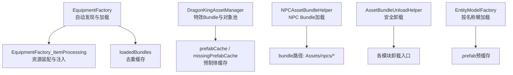
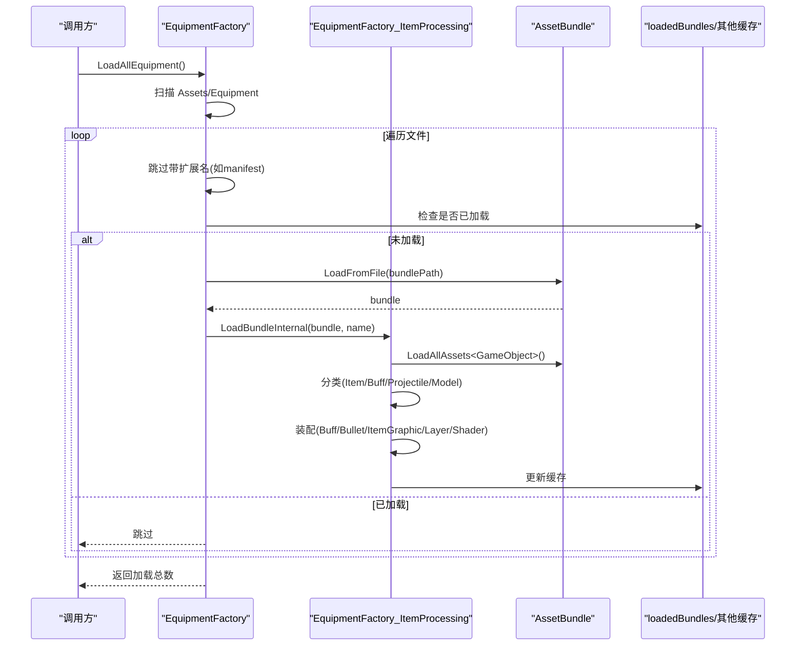
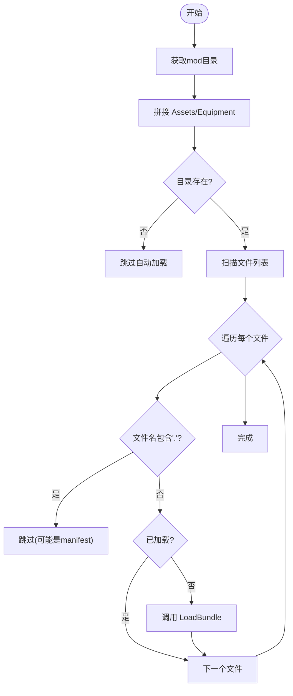
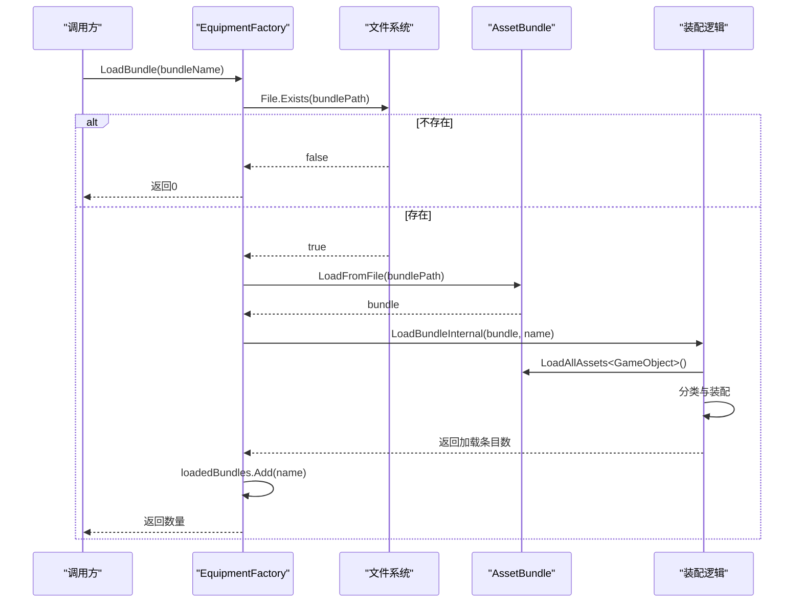
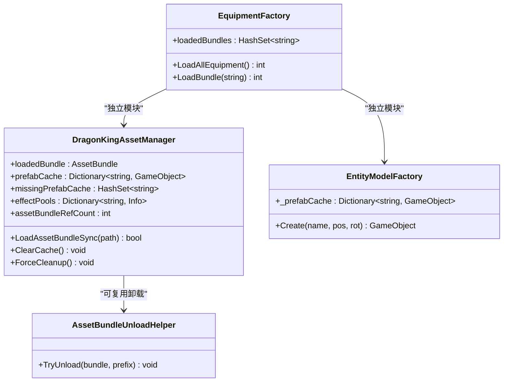
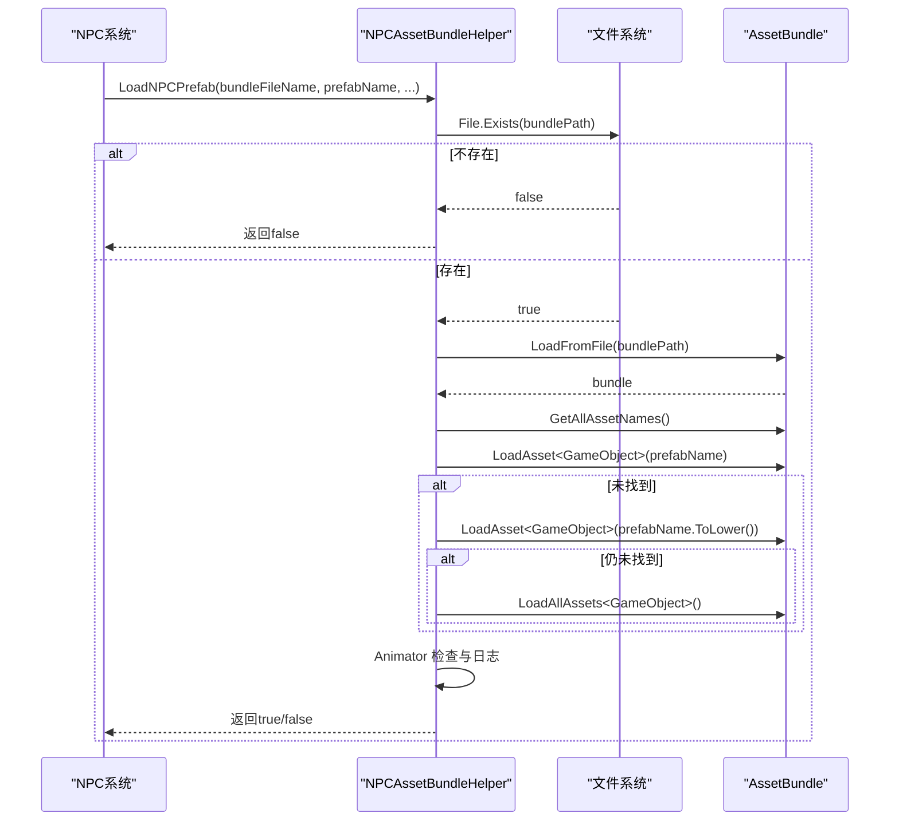
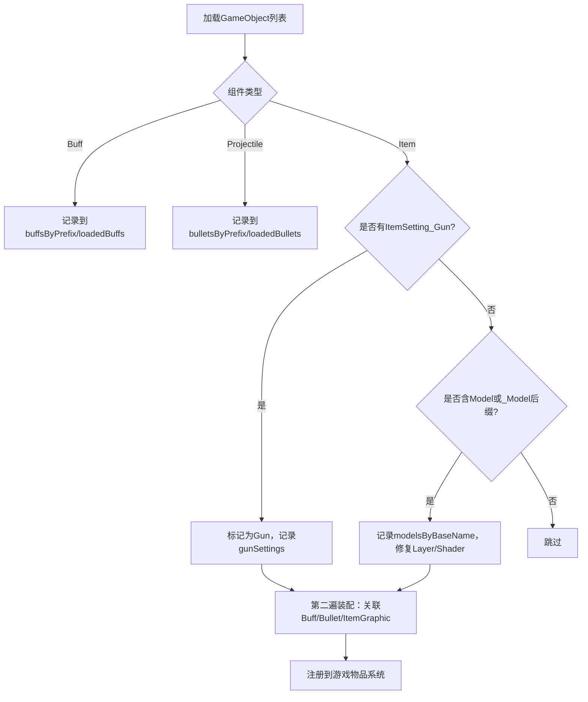
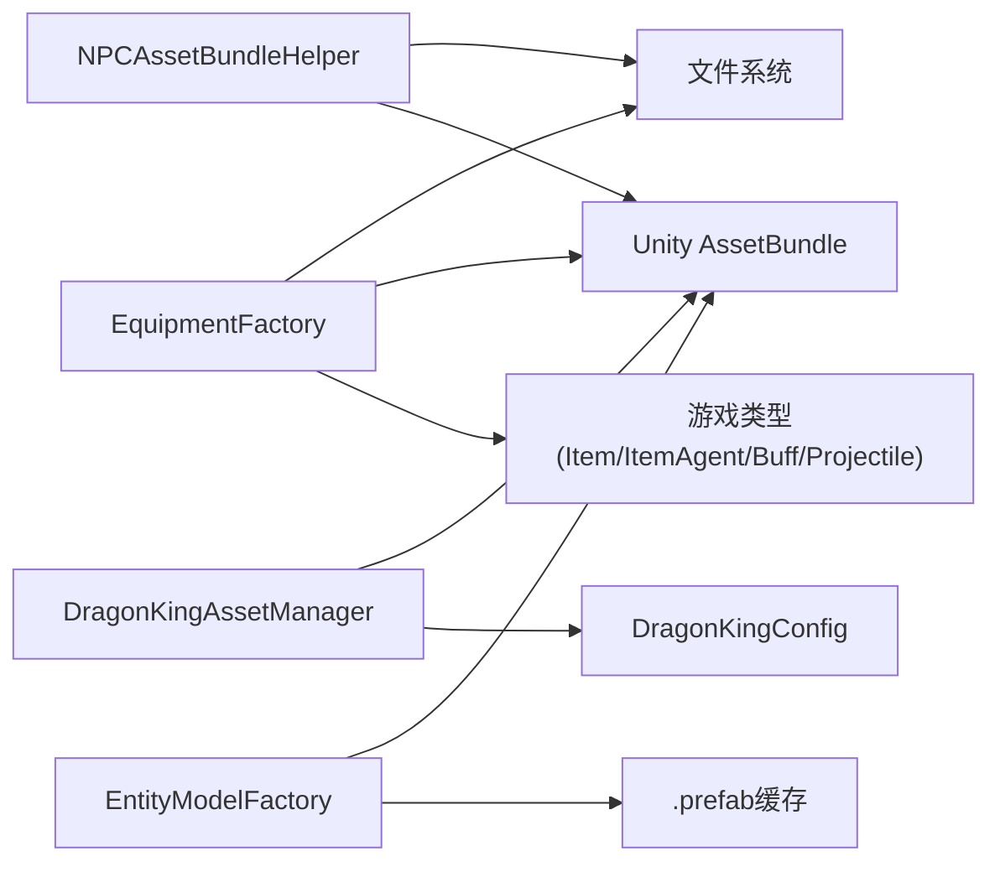

# AssetBundle 管理系统

<cite>
**本文引用的文件**
- [EquipmentFactory.cs](file://Integration/EquipmentFactory.cs)
- [EquipmentFactory_ItemProcessing.cs](file://Integration/EquipmentFactory_ItemProcessing.cs)
- [DragonKingAssetManager.cs](file://Integration/DragonKing/DragonKingAssetManager.cs)
- [NPCAssetBundleHelper.cs](file://Integration/Utils/NPCAssetBundleHelper.cs)
- [AssetBundleUnloadHelper.cs](file://Utilities/AssetBundleUnloadHelper.cs)
- [EntityModelFactory.cs](file://Utilities/EntityModelFactory.cs)
</cite>

## 目录
1. [简介](#简介)
2. [项目结构](#项目结构)
3. [核心组件](#核心组件)
4. [架构总览](#架构总览)
5. [详细组件分析](#详细组件分析)
6. [依赖关系分析](#依赖关系分析)
7. [性能考量](#性能考量)
8. [故障排除指南](#故障排除指南)
9. [结论](#结论)
10. [附录](#附录)

## 简介
本文件系统性地梳理并文档化 BossRush Mod 中的 AssetBundle 管理体系，重点覆盖：
- Bundle 自动发现机制：Assets/Equipment 目录扫描、文件扩展名过滤、manifest 文件处理。
- Bundle 加载流程：路径构建、文件存在性检查、加载状态跟踪与缓存。
- 缓存机制：loadedBundles 集合的作用、重复加载防护、内存管理策略（含引用计数与卸载）。
- Bundle 组织与命名规范：最佳实践与常见陷阱。
- 调试技巧与故障排除方法。

该体系由多个子系统协作完成：装备工厂负责“自动发现 + 统一加载 + 资源装配”，龙王资源管理器负责“特效预制体缓存与对象池”，NPC 辅助器提供“通用 NPC Bundle 加载流程”，通用卸载助手提供“安全卸载入口”，实体模型工厂提供“按名称懒加载与预缓存”。

## 项目结构
从代码层面看，AssetBundle 管理相关职责分布在以下模块：
- Integration/EquipmentFactory.cs：装备/武器/图腾的自动发现与加载主入口，维护 loadedBundles 去重缓存。
- Integration/EquipmentFactory_ItemProcessing.cs：对已加载资源的类型识别、关联装配（如 Buff/Bullet/ItemGraphic）与运行时包装。
- Integration/DragonKing/DragonKingAssetManager.cs：龙王 Boss 特效 Bundle 的加载、预制体缓存、对象池与引用计数卸载。
- Integration/Utils/NPCAssetBundleHelper.cs：NPC 模型的通用 Bundle 加载流程（路径拼接、枚举资源、回退策略）。
- Utilities/AssetBundleUnloadHelper.cs：统一的 AssetBundle 卸载封装，避免重复 try/catch。
- Utilities/EntityModelFactory.cs：按 prefab 名称懒加载 Bundle，预缓存所有 .prefab 资源，供场景实体创建复用。

图表来源
- [EquipmentFactory.cs:176-249](file://Integration/EquipmentFactory.cs#L176-L249)
- [EquipmentFactory_ItemProcessing.cs:121-222](file://Integration/EquipmentFactory_ItemProcessing.cs#L121-L222)
- [DragonKingAssetManager.cs:22-59](file://Integration/DragonKing/DragonKingAssetManager.cs#L22-L59)
- [NPCAssetBundleHelper.cs:20-138](file://Integration/Utils/NPCAssetBundleHelper.cs#L20-L138)
- [AssetBundleUnloadHelper.cs:17-38](file://Utilities/AssetBundleUnloadHelper.cs#L17-L38)
- [EntityModelFactory.cs:140-241](file://Utilities/EntityModelFactory.cs#L140-L241)

章节来源
- [EquipmentFactory.cs:176-249](file://Integration/EquipmentFactory.cs#L176-L249)
- [EquipmentFactory_ItemProcessing.cs:121-222](file://Integration/EquipmentFactory_ItemProcessing.cs#L121-L222)
- [DragonKingAssetManager.cs:22-59](file://Integration/DragonKing/DragonKingAssetManager.cs#L22-L59)
- [NPCAssetBundleHelper.cs:20-138](file://Integration/Utils/NPCAssetBundleHelper.cs#L20-L138)
- [AssetBundleUnloadHelper.cs:17-38](file://Utilities/AssetBundleUnloadHelper.cs#L17-L38)
- [EntityModelFactory.cs:140-241](file://Utilities/EntityModelFactory.cs#L140-L241)

## 核心组件
- EquipmentFactory：实现“自动发现”和“统一加载”，维护 loadedBundles 防止重复加载，并通过 LoadAllEquipment() 扫描 Assets/Equipment 目录。
- EquipmentFactory_ItemProcessing：在加载后对资源进行类型识别与装配，包括自动关联 Buff/Bullet、注入 ItemGraphic、修复 Layer/Shader、创建运行时包装等。
- DragonKingAssetManager：为龙王 Boss 特效提供 Bundle 加载、预制体缓存、对象池预热与引用计数卸载，确保多实例共享且可安全释放。
- NPCAssetBundleHelper：将 NPC 的 Bundle 加载流程标准化，包含路径构建、文件存在性检查、资源枚举、Animator 校验与日志输出。
- AssetBundleUnloadHelper：提供 TryUnload(bundle, logPrefix) 的统一卸载入口，捕获异常并记录日志。
- EntityModelFactory：按 prefab 名称懒加载 Bundle，预缓存所有 .prefab，支持 Create(prefabName, pos, rot) 快速实例化。

章节来源
- [EquipmentFactory.cs:176-249](file://Integration/EquipmentFactory.cs#L176-L249)
- [EquipmentFactory_ItemProcessing.cs:121-222](file://Integration/EquipmentFactory_ItemProcessing.cs#L121-L222)
- [DragonKingAssetManager.cs:110-154](file://Integration/DragonKing/DragonKingAssetManager.cs#L110-L154)
- [NPCAssetBundleHelper.cs:20-138](file://Integration/Utils/NPCAssetBundleHelper.cs#L20-L138)
- [AssetBundleUnloadHelper.cs:17-38](file://Utilities/AssetBundleUnloadHelper.cs#L17-L38)
- [EntityModelFactory.cs:140-241](file://Utilities/EntityModelFactory.cs#L140-L241)

## 架构总览
整体架构围绕“自动发现 → 加载 → 装配 → 缓存 → 卸载”的主线展开：
- 自动发现：EquipmentFactory.LoadAllEquipment() 扫描 Assets/Equipment，跳过带扩展名的文件（如 manifest），仅处理无扩展名的 bundle。
- 加载与装配：LoadBundleInternal() 加载 Bundle，分类收集 Item/Buff/Projectile/Model，并进行二次装配（如自动关联 Buff/Bullet、注入 ItemGraphic）。
- 缓存与去重：loadedBundles 防止重复加载；DragonKingAssetManager 使用 prefabCache/missingPrefabCache 与 effectPools；EntityModelFactory 预缓存 .prefab。
- 卸载与清理：DragonKingAssetManager 引用计数卸载；AssetBundleUnloadHelper 提供安全卸载；EntityModelFactory 按需加载与缓存。

图表来源
- [EquipmentFactory.cs:176-249](file://Integration/EquipmentFactory.cs#L176-L249)
- [EquipmentFactory.cs:498-749](file://Integration/EquipmentFactory.cs#L498-L749)
- [EquipmentFactory_ItemProcessing.cs:121-222](file://Integration/EquipmentFactory_ItemProcessing.cs#L121-L222)

章节来源
- [EquipmentFactory.cs:176-249](file://Integration/EquipmentFactory.cs#L176-L249)
- [EquipmentFactory.cs:498-749](file://Integration/EquipmentFactory.cs#L498-L749)
- [EquipmentFactory_ItemProcessing.cs:121-222](file://Integration/EquipmentFactory_ItemProcessing.cs#L121-L222)

## 详细组件分析

### 自动发现机制（Assets/Equipment 目录扫描、扩展名过滤、manifest 处理）
- 目录定位：通过 Assembly.Location 获取 modDirectory，再拼接固定路径 EQUIPMENT_PATH = "Assets/Equipment"。
- 文件扫描：Directory.GetFiles(equipmentDir)，逐个文件名判断是否包含 "."，若包含则跳过（用于忽略 manifest 或其他非 bundle 文件）。
- 去重检查：loadedBundles.Contains(fileName) 跳过已加载 bundle。
- 加载触发：调用 LoadBundle(bundleName) 进入统一加载流程。

图表来源
- [EquipmentFactory.cs:176-215](file://Integration/EquipmentFactory.cs#L176-L215)

章节来源
- [EquipmentFactory.cs:176-215](file://Integration/EquipmentFactory.cs#L176-L215)

### Bundle 加载流程（路径构建、文件存在性检查、加载状态跟踪）
- 路径构建：modDirectory + EQUIPMENT_PATH + bundleName。
- 存在性检查：File.Exists(bundlePath) 失败时记录日志并返回。
- 加载与分类：LoadBundleInternal() 中 LoadFromFile -> LoadAllAssets<GameObject>() -> 分类收集 Item/Buff/Projectile/Model。
- 状态跟踪：成功加载后将 bundleName 加入 loadedBundles，后续重复调用直接跳过。

图表来源
- [EquipmentFactory.cs:217-249](file://Integration/EquipmentFactory.cs#L217-L249)
- [EquipmentFactory.cs:498-749](file://Integration/EquipmentFactory.cs#L498-L749)

章节来源
- [EquipmentFactory.cs:217-249](file://Integration/EquipmentFactory.cs#L217-L249)
- [EquipmentFactory.cs:498-749](file://Integration/EquipmentFactory.cs#L498-L749)

### 缓存机制（loadedBundles 集合、重复加载防护、内存管理）
- loadedBundles：HashSet<string> 记录已加载 bundle 名称，LoadBundle 前检查以避免重复加载。
- 其他缓存：
  - DragonKingAssetManager：prefabCache、missingPrefabCache、effectPools、dynamicMaterials。
  - EntityModelFactory：_prefabCache 预缓存 .prefab，减少重复加载成本。
- 内存管理：
  - DragonKingAssetManager：assetBundleRefCount 引用计数，ClearCache() 递减并在 <=0 时保持 Bundle 以便复用；ForceCleanup() 强制卸载并清理动态材质。
  - AssetBundleUnloadHelper：TryUnload(bundle, logPrefix) 统一卸载并捕获异常。
  - EquipmentFactory：不主动 Unload bundle，因为资源仍在被使用。

图表来源
- [EquipmentFactory.cs:134-157](file://Integration/EquipmentFactory.cs#L134-L157)
- [DragonKingAssetManager.cs:22-59](file://Integration/DragonKing/DragonKingAssetManager.cs#L22-L59)
- [DragonKingAssetManager.cs:638-700](file://Integration/DragonKing/DragonKingAssetManager.cs#L638-L700)
- [AssetBundleUnloadHelper.cs:17-38](file://Utilities/AssetBundleUnloadHelper.cs#L17-L38)
- [EntityModelFactory.cs:190-241](file://Utilities/EntityModelFactory.cs#L190-L241)

章节来源
- [EquipmentFactory.cs:134-157](file://Integration/EquipmentFactory.cs#L134-L157)
- [DragonKingAssetManager.cs:22-59](file://Integration/DragonKing/DragonKingAssetManager.cs#L22-L59)
- [DragonKingAssetManager.cs:638-700](file://Integration/DragonKing/DragonKingAssetManager.cs#L638-L700)
- [AssetBundleUnloadHelper.cs:17-38](file://Utilities/AssetBundleUnloadHelper.cs#L17-L38)
- [EntityModelFactory.cs:190-241](file://Utilities/EntityModelFactory.cs#L190-L241)

### NPC 与实体模型的 Bundle 加载
- NPCAssetBundleHelper：
  - 路径：modDir + "Assets/npcs/" + bundleFileName。
  - 流程：File.Exists -> LoadFromFile -> GetAllAssetNames -> LoadAsset<GameObject>(prefabName) -> 小写回退 -> LoadAllAssets<GameObject>() -> Animator 检查。
- EntityModelFactory：
  - 懒加载：TryLoadPrefabFromBundles(prefabName) 遍历 _bundleInfos，首次加载并预缓存所有 .prefab。
  - 创建：Create(prefabName, pos, rot) 先查缓存，未命中则尝试加载，仍不存在则创建后备对象。

图表来源
- [NPCAssetBundleHelper.cs:20-138](file://Integration/Utils/NPCAssetBundleHelper.cs#L20-L138)
- [EntityModelFactory.cs:140-241](file://Utilities/EntityModelFactory.cs#L140-L241)

章节来源
- [NPCAssetBundleHelper.cs:20-138](file://Integration/Utils/NPCAssetBundleHelper.cs#L20-L138)
- [EntityModelFactory.cs:140-241](file://Utilities/EntityModelFactory.cs#L140-L241)

### 资源装配与注入（Buff/Bullet/ItemGraphic/Layer/Shader）
- 类型识别：ParseEquipmentTypeFromName() 根据 prefab 名称后缀推断类型（Gun/MeleeWeapon/Totem/Helmet/Armor/Backpack/FaceMask/Headset）。
- 自动关联：
  - 武器：ExtractWeaponPrefix(baseName) 匹配同名 _Bullet 与 _Buff，注入到 ItemSetting_Gun。
  - 装备：ProcessEquipmentItem() 添加 Tag、注入 EquipmentModel、注入 ItemGraphic（假人显示备用）。
- 运行时包装：CreateModelWrapper() 为缺少 DuckovItemAgent 的模型创建运行时副本并添加组件，设置 Layer 与 Shader。
- 枪械图形：InjectItemGraphic() 创建 ItemGraphicInfo_Gun，设置 groundPoint、Sockets、手动画类型，修正 Muzzle/Tec 位置。

图表来源
- [EquipmentFactory.cs:498-749](file://Integration/EquipmentFactory.cs#L498-L749)
- [EquipmentFactory_ItemProcessing.cs:121-222](file://Integration/EquipmentFactory_ItemProcessing.cs#L121-L222)
- [EquipmentFactory_ItemProcessing.cs:313-401](file://Integration/EquipmentFactory_ItemProcessing.cs#L313-L401)
- [EquipmentFactory_ItemProcessing.cs:645-800](file://Integration/EquipmentFactory_ItemProcessing.cs#L645-L800)

章节来源
- [EquipmentFactory.cs:498-749](file://Integration/EquipmentFactory.cs#L498-L749)
- [EquipmentFactory_ItemProcessing.cs:121-222](file://Integration/EquipmentFactory_ItemProcessing.cs#L121-L222)
- [EquipmentFactory_ItemProcessing.cs:313-401](file://Integration/EquipmentFactory_ItemProcessing.cs#L313-L401)
- [EquipmentFactory_ItemProcessing.cs:645-800](file://Integration/EquipmentFactory_ItemProcessing.cs#L645-L800)

## 依赖关系分析
- EquipmentFactory 依赖：
  - 文件系统（Directory/File）进行目录扫描与存在性检查。
  - Unity AssetBundle API 进行加载与资源枚举。
  - 游戏内部类型（Item、ItemAgent、ItemSetting_Gun、Buff、Projectile）进行装配。
- DragonKingAssetManager 依赖：
  - Unity AssetBundle API、对象池与渲染组件（Renderer、Light、ParticleSystem）。
  - 配置常量（DragonKingConfig）定义资源路径与初始池大小。
- NPCAssetBundleHelper 依赖：
  - 文件系统与 Unity 资源系统，以及 Animator 校验。
- EntityModelFactory 依赖：
  - 预定义的 Bundle 信息列表，按名称懒加载并缓存 .prefab。

图表来源
- [EquipmentFactory.cs:176-249](file://Integration/EquipmentFactory.cs#L176-L249)
- [DragonKingAssetManager.cs:110-154](file://Integration/DragonKing/DragonKingAssetManager.cs#L110-L154)
- [NPCAssetBundleHelper.cs:20-138](file://Integration/Utils/NPCAssetBundleHelper.cs#L20-L138)
- [EntityModelFactory.cs:140-241](file://Utilities/EntityModelFactory.cs#L140-L241)

章节来源
- [EquipmentFactory.cs:176-249](file://Integration/EquipmentFactory.cs#L176-L249)
- [DragonKingAssetManager.cs:110-154](file://Integration/DragonKing/DragonKingAssetManager.cs#L110-L154)
- [NPCAssetBundleHelper.cs:20-138](file://Integration/Utils/NPCAssetBundleHelper.cs#L20-L138)
- [EntityModelFactory.cs:140-241](file://Utilities/EntityModelFactory.cs#L140-L241)

## 性能考量
- 避免重复加载：
  - EquipmentFactory.loadedBundles 防止重复扫描与加载。
  - DragonKingAssetManager.prefabCache/missingPrefabCache 避免重复查找与失败重试。
  - EntityModelFactory._prefabCache 预缓存 .prefab，减少跨 Bundle 查找成本。
- 对象池与预热：
  - DragonKingAssetManager 使用 initialPoolSizes/maxPoolSizes 预热高频特效，降低首帧卡顿。
  - dynamicMaterials 列表跟踪动态材质，便于集中清理。
- 资源卸载：
  - DragonKingAssetManager 引用计数卸载，确保多实例共享且可安全释放。
  - AssetBundleUnloadHelper 统一卸载入口，避免分散的 try/catch 影响性能。
- 渲染优化：
  - FixModelLayerAndShader() 批量替换 Standard/URP 着色器为游戏专用着色器，避免阴影可见但模型不可见的问题。
  - Sockets 节点整理确保枪口火焰与配件正确挂载，减少运行时计算。

[本节为通用性能讨论，无需具体文件分析]

## 故障排除指南
- Bundle 未找到：
  - 检查路径是否正确（Assets/Equipment 或 Assets/npcs），确认文件名不含扩展名（EquipmentFactory 会跳过带 "." 的文件）。
  - 查看日志输出，确认 File.Exists 与 LoadFromFile 的结果。
- Bundle 加载失败：
  - 可能已被加载或文件损坏，参考 NPCAssetBundleHelper 的日志提示。
  - 使用 AssetBundleUnloadHelper.TryUnload 尝试安全卸载后重新加载。
- 预制体不存在：
  - 检查 prefab 名称是否与 Bundle 内资源一致，必要时使用小写回退或 LoadAllAssets 查找第一个 GameObject。
  - 查看 DragonKingAssetManager.missingPrefabCache 是否记录了缺失名称。
- 动画无法播放：
  - 确认 NPC 预制体包含 Animator 组件且 runtimeAnimatorController 不为空。
  - 检查 Weapon 的 ItemSetting_Gun 是否注入了正确的 Bullet 与 Buff。
- 显示异常：
  - 检查 ItemGraphic 是否有效（已有但无渲染器时需强制替换）。
  - 确认 Layer 与 Shader 已修复，尤其是从 Standard/URP 切换到游戏专用着色器。
- 内存泄漏：
  - 定期调用 DragonKingAssetManager.ForceCleanup() 或 ClearCache()，确保引用计数归零。
  - 清理 dynamicMaterials 列表中的材质，避免累积。

章节来源
- [EquipmentFactory.cs:176-249](file://Integration/EquipmentFactory.cs#L176-L249)
- [EquipmentFactory.cs:498-749](file://Integration/EquipmentFactory.cs#L498-L749)
- [NPCAssetBundleHelper.cs:20-138](file://Integration/Utils/NPCAssetBundleHelper.cs#L20-L138)
- [DragonKingAssetManager.cs:22-59](file://Integration/DragonKing/DragonKingAssetManager.cs#L22-L59)
- [DragonKingAssetManager.cs:638-700](file://Integration/DragonKing/DragonKingAssetManager.cs#L638-L700)
- [AssetBundleUnloadHelper.cs:17-38](file://Utilities/AssetBundleUnloadHelper.cs#L17-L38)

## 结论
本 AssetBundle 管理系统通过“自动发现 + 统一加载 + 资源装配 + 缓存与卸载”的完整链路，实现了高效、稳定、可扩展的资源管理。关键要点包括：
- 严格的路径与命名规范，确保自动发现与装配的正确性。
- 多层缓存与去重机制，显著降低重复加载成本。
- 对象池与预热策略，提升高频特效的性能表现。
- 引用计数与安全卸载，保障内存健康与生命周期可控。
- 完善的日志与回退策略，便于问题定位与容错处理。

建议在实际开发中遵循上述规范与最佳实践，并结合日志与调试工具持续优化资源管理与性能表现。

[本节为总结，无需具体文件分析]

## 附录
- Bundle 组织结构建议：
  - 装备/武器/图腾：放置于 Assets/Equipment/{bundleName}（无扩展名），每个 bundle 可包含多个 Item/Buff/Projectile/Model。
  - NPC 模型：放置于 Assets/npcs/{bundleName}，遵循 NPCAssetBundleHelper 的路径约定。
  - 特效资源：按模块划分（如 DragonKing），使用独立 Bundle 与配置常量管理。
- 命名规范建议：
  - 装备：{名称}_Helmet_Item / {名称}_Armor_Item / ...
  - 武器：{名称}_Gun_Item / {名称}_Bullet / {名称}_Buff
  - 模型：{名称}_Model（可选），或内嵌于 Item 中。
- 常见陷阱：
  - 在 Assets/Equipment 下放置带扩展名的文件（会被跳过）。
  - 未正确配置 ItemGraphic 或 Animator，导致显示或动画异常。
  - 忘记注入 Buff/Bullet，导致武器功能不完整。
  - 未清理动态材质或对象池，造成内存泄漏。

[本节为概念性内容，无需具体文件分析]