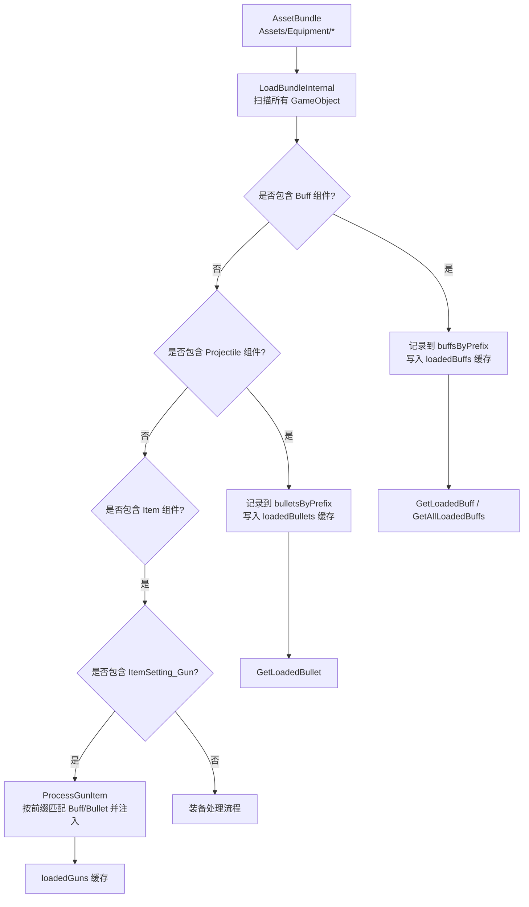
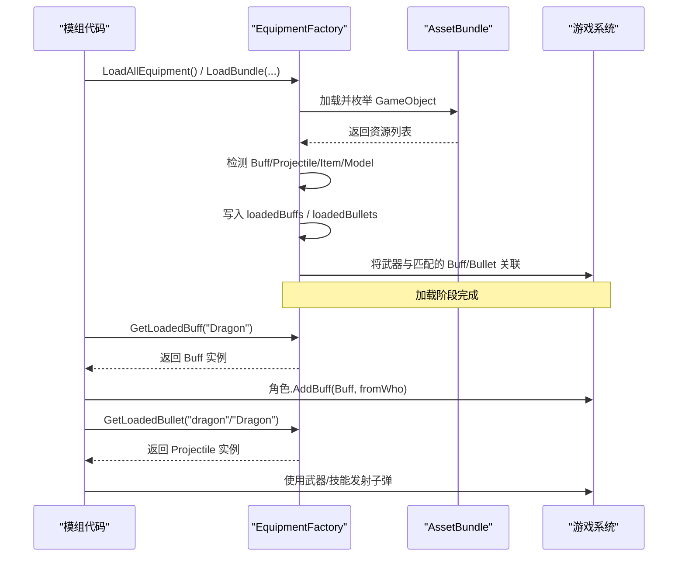
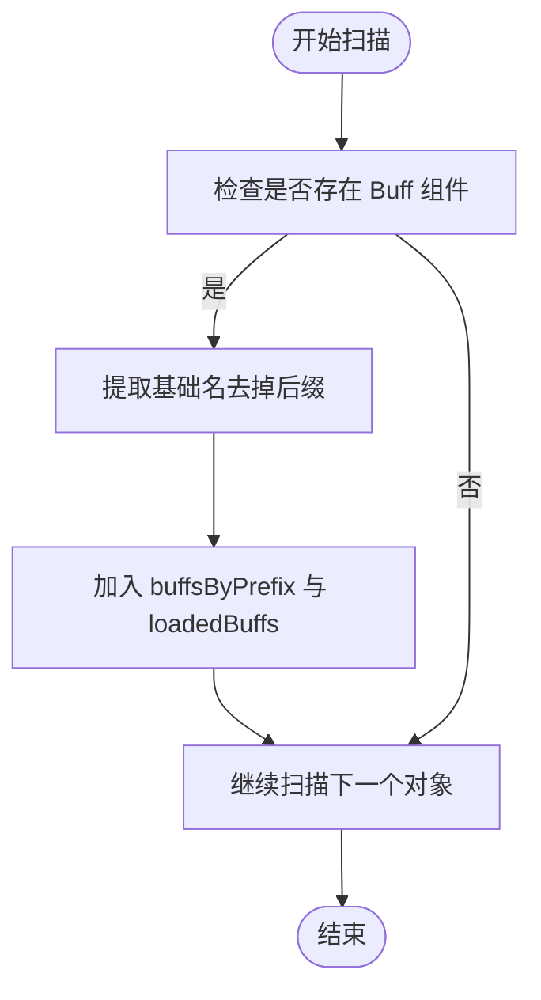
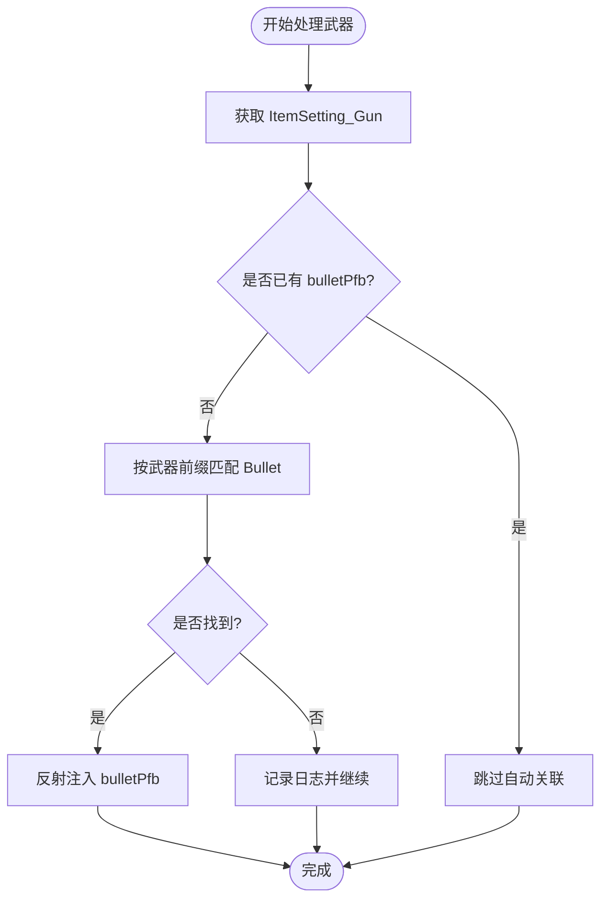
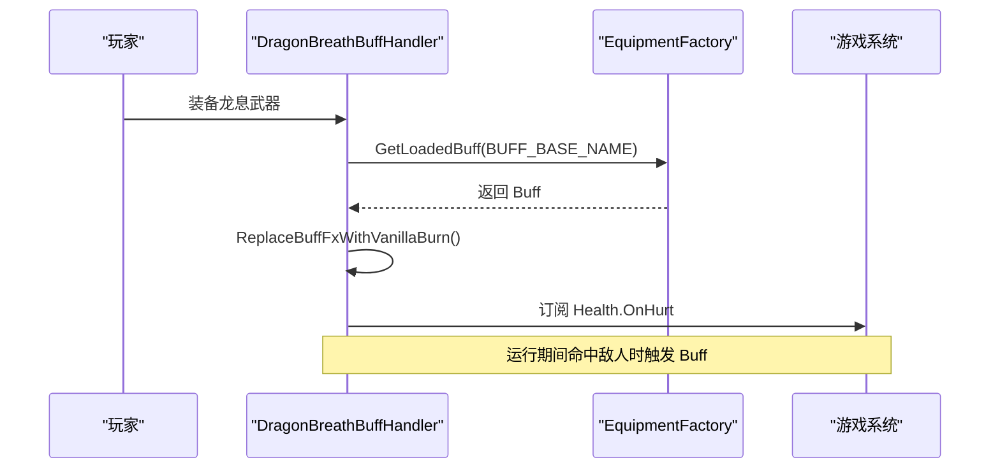
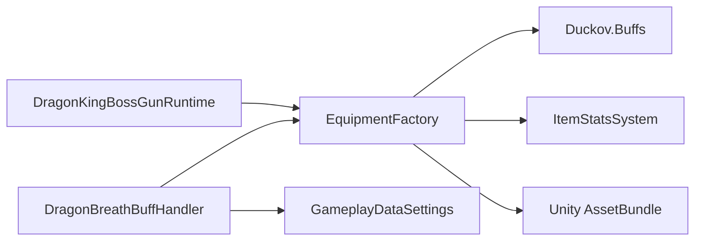

# Buff 与子弹系统

<cite>
**本文引用的文件**
- [EquipmentFactory.cs](file://Integration/EquipmentFactory.cs)
- [EquipmentFactory_ItemProcessing.cs](file://Integration/EquipmentFactory_ItemProcessing.cs)
- [DragonBreathBuffHandler.cs](file://Integration/DragonDescendant/DragonBreathBuffHandler.cs)
- [DragonKingBossGunRuntime.cs](file://Integration/DragonKing/Weapons/DragonKingBossGunRuntime.cs)
- [LocalizationInjector.cs](file://Localization/LocalizationInjector.cs)
</cite>

## 目录
1. [简介](#简介)
2. [项目结构](#项目结构)
3. [核心组件](#核心组件)
4. [架构总览](#架构总览)
5. [详细组件分析](#详细组件分析)
6. [依赖关系分析](#依赖关系分析)
7. [性能考量](#性能考量)
8. [故障排查指南](#故障排查指南)
9. [结论](#结论)
10. [附录：配置与开发指南](#附录：配置与开发指南)

## 简介
本文件系统性说明 BossRushMod 中“Buff 与子弹”系统的自动发现、注册、缓存与查询机制，并给出 Buff 预制体与子弹预制体的配置要求、本地化键约定以及自定义扩展的开发指引。重点覆盖：
- Buff 预制体的自动发现与注册（组件检测、ID 管理、缓存存储）
- 子弹预制体的识别与关联（Projectile 组件识别、命名匹配、资源注入）
- GetLoadedBuff / GetLoadedBullet 等查询方法的使用场景
- 自定义 Buff 与子弹的落地步骤与注意事项

## 项目结构
该子系统围绕 EquipmentFactory 实现，负责从 AssetBundle 扫描并分类加载资源，自动识别 Buff 与 Projectile，并在武器 ItemSetting_Gun 上完成自动关联；同时提供全局缓存字典供运行时查询。

图表来源
- [EquipmentFactory.cs:501-741](file://Integration/EquipmentFactory.cs#L501-L741)
- [EquipmentFactory_ItemProcessing.cs:154-222](file://Integration/EquipmentFactory_ItemProcessing.cs#L154-L222)

章节来源
- [EquipmentFactory.cs:132-174](file://Integration/EquipmentFactory.cs#L132-L174)
- [EquipmentFactory_ItemProcessing.cs:114-147](file://Integration/EquipmentFactory_ItemProcessing.cs#L114-L147)

## 核心组件
- 资源扫描与分类：LoadBundleInternal 遍历 Bundle 内所有 GameObject，依据组件类型分类为 Buff、Projectile、Item、Model，并按基础名建立临时映射表。
- 缓存体系：
  - loadedBuffs：基础名 -> Buff 预制体
  - loadedBullets：基础名 -> Projectile 预制体
  - loadedGuns：TypeID -> Item
  - loadedModels / loadedModelsByBaseName：模型缓存
- 自动关联：对武器 Item，若未显式配置 buff/bulletPfb，则根据武器基础名前缀匹配同名 _Buff/_Bullet 并注入。
- 查询 API：GetLoadedBuff、GetLoadedBuffById、GetLoadedBullet、GetAllLoadedBuffs。

章节来源
- [EquipmentFactory.cs:143-153](file://Integration/EquipmentFactory.cs#L143-L153)
- [EquipmentFactory.cs:255-304](file://Integration/EquipmentFactory.cs#L255-L304)
- [EquipmentFactory.cs:521-555](file://Integration/EquipmentFactory.cs#L521-L555)
- [EquipmentFactory_ItemProcessing.cs:182-205](file://Integration/EquipmentFactory_ItemProcessing.cs#L182-L205)

## 架构总览
Buff 与子弹的生命周期分为“加载期”和“运行期”。加载期由 EquipmentFactory 完成；运行期通过查询 API 获取已注册的 Buff/Projectile 进行应用或发射。

图表来源
- [EquipmentFactory.cs:180-249](file://Integration/EquipmentFactory.cs#L180-L249)
- [EquipmentFactory.cs:501-741](file://Integration/EquipmentFactory.cs#L501-L741)
- [EquipmentFactory.cs:255-291](file://Integration/EquipmentFactory.cs#L255-L291)
- [DragonKingBossGunRuntime.cs:1083-1089](file://Integration/DragonKing/Weapons/DragonKingBossGunRuntime.cs#L1083-L1089)

## 详细组件分析

### Buff 自动发现与注册
- 组件检测：在 LoadBundleInternal 中对每个 GameObject 调用 GetComponent<Buff>()，若存在则视为 Buff 预制体。
- ID 管理：Buff 的 ID 来自其自身组件字段，用于运行时唯一标识与查找；工厂内部以“基础名”作为主键缓存。
- 缓存存储：匹配到的 Buff 存入 buffsByPrefix 临时表，并立即写入全局 loadedBuffs，以便后续查询。
- 日志输出：记录发现的 Buff 名称、ID 与前缀，便于调试。

图表来源
- [EquipmentFactory.cs:535-544](file://Integration/EquipmentFactory.cs#L535-L544)
- [EquipmentFactory.cs:456-476](file://Integration/EquipmentFactory.cs#L456-L476)

章节来源
- [EquipmentFactory.cs:535-544](file://Integration/EquipmentFactory.cs#L535-L544)
- [EquipmentFactory.cs:456-476](file://Integration/EquipmentFactory.cs#L456-L476)

### 子弹自动识别与武器关联
- 组件识别：对每个 GameObject 调用 GetComponent<Projectile>()，若存在则视为子弹预制体。
- 命名匹配：子弹基础名用于建立 bulletsByPrefix 映射；武器处理时根据武器基础名前缀（如 Dragon_Gun -> Dragon）匹配同名 _Bullet。
- 资源关联：若武器未显式设置 bulletPfb，则通过反射注入匹配的 Projectile。
- 缓存存储：匹配到的 Projectile 写入全局 loadedBullets。

图表来源
- [EquipmentFactory_ItemProcessing.cs:154-205](file://Integration/EquipmentFactory_ItemProcessing.cs#L154-L205)
- [EquipmentFactory_ItemProcessing.cs:244-262](file://Integration/EquipmentFactory_ItemProcessing.cs#L244-L262)

章节来源
- [EquipmentFactory_ItemProcessing.cs:154-205](file://Integration/EquipmentFactory_ItemProcessing.cs#L154-L205)
- [EquipmentFactory_ItemProcessing.cs:244-262](file://Integration/EquipmentFactory_ItemProcessing.cs#L244-L262)

### 查询方法与使用场景
- GetLoadedBuff(baseName)：按基础名获取已加载的 Buff 预制体，常用于运行时手动给角色施加 Buff。
- GetLoadedBuffById(buffId)：按 Buff ID 反查，适用于已知 ID 的场景。
- GetLoadedBullet(baseName)：按基础名获取已加载的 Projectile，常用于自定义发射逻辑或 Boss 技能。
- GetAllLoadedBuffs()：只读访问全部已加载 Buff，用于统计或调试。

示例用法参考：
- 龙息武器处理器在订阅事件时按需获取 Buff 并替换特效。
- 龙王武器运行时通过不同大小写前缀尝试获取子弹。

章节来源
- [EquipmentFactory.cs:255-304](file://Integration/EquipmentFactory.cs#L255-L304)
- [DragonBreathBuffHandler.cs:44-71](file://Integration/DragonDescendant/DragonBreathBuffHandler.cs#L44-L71)
- [DragonKingBossGunRuntime.cs:1083-1089](file://Integration/DragonKing/Weapons/DragonKingBossGunRuntime.cs#L1083-L1089)

### 运行时 Buff 触发与特效替换（龙息示例）
- 事件订阅：在玩家装备龙息武器时订阅伤害事件，首次使用时懒加载 Buff 引用。
- 特效替换：通过反射将自定义 Buff 的命中特效替换为原版点燃 Buff 的特效，保持视觉一致性。
- 生命周期：提供 Unsubscribe/Cleanup/ClearStaticCache，确保场景切换或卸载时正确释放。

图表来源
- [DragonBreathBuffHandler.cs:44-71](file://Integration/DragonDescendant/DragonBreathBuffHandler.cs#L44-L71)
- [DragonBreathBuffHandler.cs:77-121](file://Integration/DragonDescendant/DragonBreathBuffHandler.cs#L77-L121)

章节来源
- [DragonBreathBuffHandler.cs:44-71](file://Integration/DragonDescendant/DragonBreathBuffHandler.cs#L44-L71)
- [DragonBreathBuffHandler.cs:77-121](file://Integration/DragonDescendant/DragonBreathBuffHandler.cs#L77-L121)

## 依赖关系分析
- EquipmentFactory 依赖 Unity 的 AssetBundle 与组件系统，依赖 Duckov.Buffs 与 ItemStatsSystem。
- 武器处理依赖 ItemSetting_Gun 组件及反射能力，以动态注入 buff 与 bulletPfb。
- 龙息 Buff 处理器依赖 Health 事件系统与 GameplayDataSettings，用于获取原版 Buff 特效。
- 龙王武器运行时直接调用 EquipmentFactory.GetLoadedBullet 获取子弹。

图表来源
- [EquipmentFactory.cs:101-110](file://Integration/EquipmentFactory.cs#L101-L110)
- [DragonBreathBuffHandler.cs:19-23](file://Integration/DragonDescendant/DragonBreathBuffHandler.cs#L19-L23)
- [DragonKingBossGunRuntime.cs:1083-1089](file://Integration/DragonKing/Weapons/DragonKingBossGunRuntime.cs#L1083-L1089)

章节来源
- [EquipmentFactory.cs:101-110](file://Integration/EquipmentFactory.cs#L101-L110)
- [DragonBreathBuffHandler.cs:19-23](file://Integration/DragonDescendant/DragonBreathBuffHandler.cs#L19-L23)
- [DragonKingBossGunRuntime.cs:1083-1089](file://Integration/DragonKing/Weapons/DragonKingBossGunRuntime.cs#L1083-L1089)

## 性能考量
- 加载期一次性扫描与分类，避免重复 IO；使用 Dictionary 缓存提升查询效率。
- 反射仅在必要时执行（注入组件字段），并对反射结果进行缓存以减少开销。
- 事件订阅采用懒加载与条件订阅，减少无谓回调。
- 日志输出控制在关键路径，避免高频字符串拼接影响低端设备。

[本节为通用指导，不直接分析具体文件]

## 故障排查指南
- 未检测到 Buff：确认预制体包含 Buff 组件且名称符合 {名称}_Buff；检查日志中的“发现 Buff”条目。
- 未关联子弹：确认武器基础名前缀与子弹基础名一致（例如 Dragon_Gun -> Dragon_Bullet）；检查 ProcessGunItem 日志。
- 查询为空：确认已调用 LoadAllEquipment 或 LoadBundle；检查 GetLoadedBuff/GetLoadedBullet 返回值是否为 null。
- 特效异常：检查 DragonBreathBuffHandler 的特效替换是否成功，关注反射字段与原版 Buff 可用性。

章节来源
- [EquipmentFactory.cs:535-555](file://Integration/EquipmentFactory.cs#L535-L555)
- [EquipmentFactory_ItemProcessing.cs:182-205](file://Integration/EquipmentFactory_ItemProcessing.cs#L182-L205)
- [DragonBreathBuffHandler.cs:77-121](file://Integration/DragonDescendant/DragonBreathBuffHandler.cs#L77-L121)

## 结论
BossRushMod 的 Buff 与子弹系统通过 EquipmentFactory 实现了从 AssetBundle 到游戏资源的自动化装配与缓存管理。借助命名约定与组件检测，开发者只需遵循规范即可让 Buff 与子弹被自动发现、注册与关联；配合查询 API 可在运行时灵活应用。对于高级需求（如事件驱动 Buff 触发、特效替换），可基于现有处理器模式扩展。

[本节为总结性内容，不直接分析具体文件]

## 附录：配置与开发指南

### Buff 预制体配置要求
- 必须包含 Buff 组件（来自 Duckov.Buffs）。
- 设置 id（唯一）、maxLayers（最大层数）、displayName/description（本地化键名）、limitedLifeTime/totalLifeTime（持续时间）、effects（可选）。
- 命名格式：{名称}_Buff，例如 Dragon_Buff。
- 本地化键：displayName/description 应指向 LocalizationInjector 或其他本地化源中的键。

章节来源
- [EquipmentFactory.cs:72-78](file://Integration/EquipmentFactory.cs#L72-L78)
- [EquipmentFactory.cs:535-544](file://Integration/EquipmentFactory.cs#L535-L544)
- [LocalizationInjector.cs:1-200](file://Localization/LocalizationInjector.cs#L1-L200)

### 子弹预制体配置要求
- 必须包含 Projectile 组件。
- 设置 radius（碰撞半径）、hitFx（命中特效，可选）。
- 命名格式：{名称}_Bullet，例如 Dragon_Bullet。
- 武器关联：若武器未显式设置 bulletPfb，系统将按武器基础名前缀自动匹配同名子弹。

章节来源
- [EquipmentFactory.cs:80-84](file://Integration/EquipmentFactory.cs#L80-L84)
- [EquipmentFactory_ItemProcessing.cs:196-205](file://Integration/EquipmentFactory_ItemProcessing.cs#L196-L205)

### 武器与 Buff/Bullet 的自动匹配规则
- 武器基础名去除 _Gun/_Weapon/_Rifle/_Pistol/_Shotgun/_SMG 等后缀得到前缀。
- 使用该前缀匹配同名 _Buff 与 _Bullet。
- 若武器未配置 buff 或 bulletPfb，将通过反射注入对应资源。

章节来源
- [EquipmentFactory.cs:478-494](file://Integration/EquipmentFactory.cs#L478-L494)
- [EquipmentFactory_ItemProcessing.cs:182-205](file://Integration/EquipmentFactory_ItemProcessing.cs#L182-L205)

### 查询方法使用场景
- GetLoadedBuff("Dragon")：在运行时手动给目标施加 Buff（如龙息武器命中后）。
- GetLoadedBuffById(id)：已知 Buff ID 时反查。
- GetLoadedBullet("dragon"/"Dragon")：Boss 或自定义逻辑中发射子弹（支持大小写前缀）。
- GetAllLoadedBuffs()：调试或统计用途。

章节来源
- [EquipmentFactory.cs:255-304](file://Integration/EquipmentFactory.cs#L255-L304)
- [DragonBreathBuffHandler.cs:44-71](file://Integration/DragonDescendant/DragonBreathBuffHandler.cs#L44-L71)
- [DragonKingBossGunRuntime.cs:1083-1089](file://Integration/DragonKing/Weapons/DragonKingBossGunRuntime.cs#L1083-L1089)

### 自定义 Buff 开发步骤
- 创建 Buff 预制体，添加 Buff 组件并填写必要属性（id、maxLayers、持续时间、本地化键等）。
- 命名为 {名称}_Buff，放入 Assets/Equipment 下的某个 AssetBundle。
- 调用 EquipmentFactory.LoadAllEquipment() 或 LoadBundle(...) 完成加载。
- 在运行时通过 GetLoadedBuff 获取并应用到目标。

章节来源
- [EquipmentFactory.cs:72-78](file://Integration/EquipmentFactory.cs#L72-L78)
- [EquipmentFactory.cs:180-249](file://Integration/EquipmentFactory.cs#L180-L249)
- [EquipmentFactory.cs:255-263](file://Integration/EquipmentFactory.cs#L255-L263)

### 自定义子弹开发步骤
- 创建 Projectile 预制体，添加 Projectile 组件并设置半径与命中特效。
- 命名为 {名称}_Bullet，放入 Assets/Equipment 下的某个 AssetBundle。
- 若为武器子弹，确保武器基础名前缀与子弹基础名一致，以便自动关联。
- 在运行时通过 GetLoadedBullet 获取并用于发射。

章节来源
- [EquipmentFactory.cs:80-84](file://Integration/EquipmentFactory.cs#L80-L84)
- [EquipmentFactory_ItemProcessing.cs:196-205](file://Integration/EquipmentFactory_ItemProcessing.cs#L196-L205)
- [EquipmentFactory.cs:283-291](file://Integration/EquipmentFactory.cs#L283-L291)

### 本地化键配置建议
- Buff 的 displayName/description 建议使用统一的本地化键，便于多语言管理。
- 可在 LocalizationInjector 中集中维护键值，或在其他本地化模块中注册。
- 确保键名与 UI/提示文本一致，避免显示空白或错误信息。

章节来源
- [LocalizationInjector.cs:1-200](file://Localization/LocalizationInjector.cs#L1-L200)