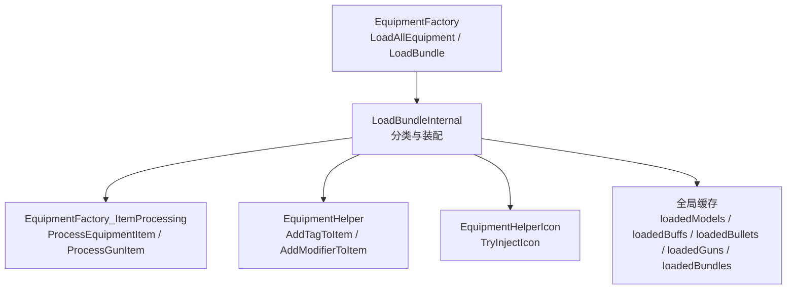
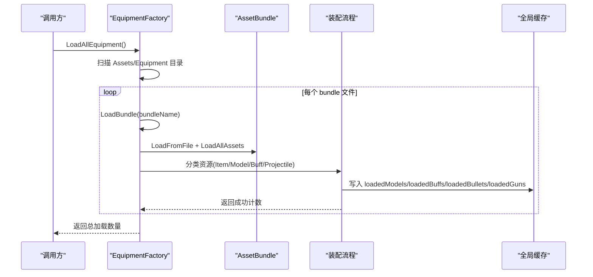
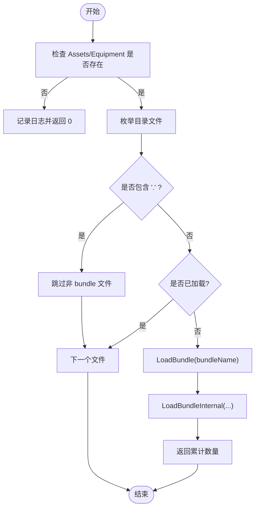
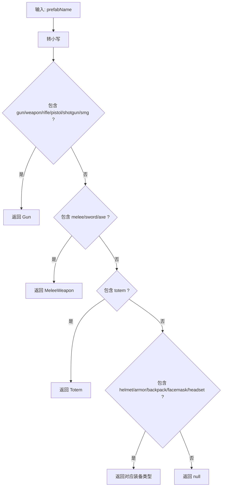
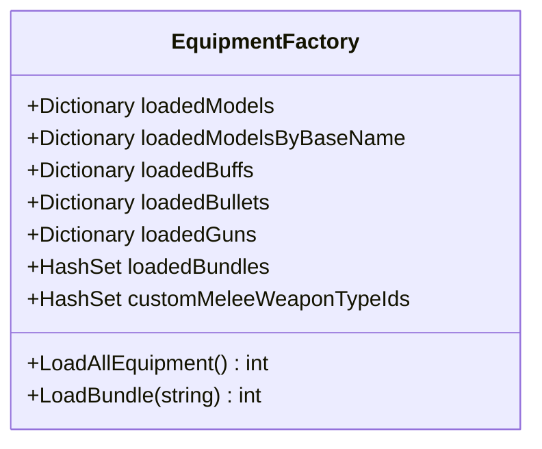
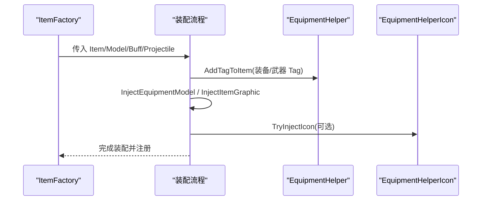
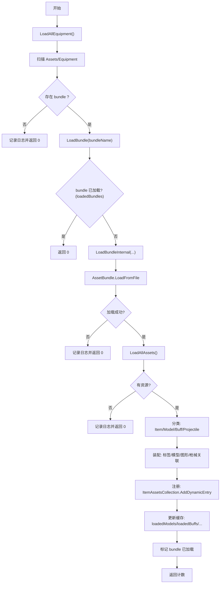
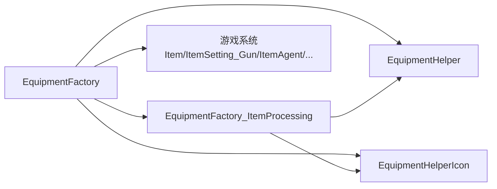

# 工厂核心架构

<cite>
**本文引用的文件**
- [EquipmentFactory.cs](file://Integration/EquipmentFactory.cs)
- [EquipmentFactory_ItemProcessing.cs](file://Integration/EquipmentFactory_ItemProcessing.cs)
- [EquipmentHelper.cs](file://Integration/EquipmentHelper.cs)
- [EquipmentHelperIcon.cs](file://Integration/EquipmentHelperIcon.cs)
- [EquipmentFactoryStaticCacheReset.cs](file://Integration/EquipmentFactoryStaticCacheReset.cs)
</cite>

## 目录
1. [简介](#简介)
2. [项目结构](#项目结构)
3. [核心组件](#核心组件)
4. [架构总览](#架构总览)
5. [详细组件分析](#详细组件分析)
6. [依赖关系分析](#依赖关系分析)
7. [性能考虑](#性能考虑)
8. [故障排查指南](#故障排查指南)
9. [结论](#结论)
10. [附录](#附录)

## 简介
本文件面向“装备工厂”的核心架构，聚焦 EquipmentFactory 的设计与实现，涵盖：
- AssetBundle 自动扫描机制
- 资源类型识别算法（命名规范匹配、后缀处理、基础名提取）
- 缓存管理策略（模型、Buff、子弹、武器、Bundle 去重）
- LoadAllEquipment() 与 LoadBundle() 的实现原理（目录遍历、文件过滤、重复加载防护）
- 物品类型解析逻辑 ParseEquipmentTypeFromName
- 完整的资源加载流程图与错误处理机制
- 性能优化建议与内存管理最佳实践

## 项目结构
该模块由多个协作的静态类组成，职责清晰、边界明确：
- EquipmentFactory：入口与核心流程（扫描、加载、分类、注册）
- EquipmentFactory_ItemProcessing：具体资源注入与装配（标签、模型、图形、枪械关联等）
- EquipmentHelper：通用辅助（属性修改器、常量、标签、宝石槽位）
- EquipmentHelperIcon：图标注入（PNG 或 Bundle 内 Sprite/Texture 的多路径加载）
- EquipmentFactoryStaticCacheReset：静态缓存重置（便于热重载/测试）

图表来源
- [EquipmentFactory.cs:176-249](file://Integration/EquipmentFactory.cs#L176-L249)
- [EquipmentFactory.cs:498-749](file://Integration/EquipmentFactory.cs#L498-L749)
- [EquipmentFactory_ItemProcessing.cs:118-222](file://Integration/EquipmentFactory_ItemProcessing.cs#L118-L222)
- [EquipmentHelper.cs:121-178](file://Integration/EquipmentHelper.cs#L121-L178)
- [EquipmentHelperIcon.cs:73-104](file://Integration/EquipmentHelperIcon.cs#L73-L104)

章节来源
- [EquipmentFactory.cs:176-249](file://Integration/EquipmentFactory.cs#L176-L249)
- [EquipmentFactory.cs:498-749](file://Integration/EquipmentFactory.cs#L498-L749)

## 核心组件
- EquipmentFactory
  - 提供 LoadAllEquipment() 与 LoadBundle() 两个对外 API
  - 维护多类缓存：模型、Buff、子弹、武器、已加载 Bundle、自定义近战武器 TypeID
  - 负责目录扫描、AssetBundle 加载、资源分类、类型识别、最终注册到游戏系统
- EquipmentFactory_ItemProcessing
  - 将 Item、Model、Buff、Projectile 进行装配与注入
  - 为装备添加 Tag、注入 EquipmentModel 与 ItemGraphic
  - 为枪械自动关联 Buff 与 Bullet，并修复 Sockets/Muzzle/Tec 等节点位置
- EquipmentHelper
  - 统一添加 Tag、Modifier、Constant、宝石槽位等通用能力
- EquipmentHelperIcon
  - 从 PNG 或 AssetBundle 中加载图标并注入到 Item.Icon
- EquipmentFactoryStaticCacheReset
  - 清空所有静态缓存，支持调试与热重载场景

章节来源
- [EquipmentFactory.cs:134-173](file://Integration/EquipmentFactory.cs#L134-L173)
- [EquipmentFactory_ItemProcessing.cs:118-222](file://Integration/EquipmentFactory_ItemProcessing.cs#L118-L222)
- [EquipmentHelper.cs:25-178](file://Integration/EquipmentHelper.cs#L25-L178)
- [EquipmentHelperIcon.cs:26-104](file://Integration/EquipmentHelperIcon.cs#L26-L104)
- [EquipmentFactoryStaticCacheReset.cs:5-16](file://Integration/EquipmentFactoryStaticCacheReset.cs#L5-L16)

## 架构总览
整体采用“扫描-分类-装配-注册”的分阶段流水线：
- 扫描阶段：枚举 Assets/Equipment 下的无扩展名 bundle 文件
- 加载阶段：AssetBundle.LoadFromFile 并 LoadAllAssets<GameObject>()
- 分类阶段：按组件与命名规则识别 Item、Model、Buff、Projectile，并计算基础名与前缀
- 装配阶段：根据类型注入标签、模型、图形、枪械关联、套装配置等
- 注册阶段：加入 ItemAssetsCollection，更新全局缓存

图表来源
- [EquipmentFactory.cs:176-249](file://Integration/EquipmentFactory.cs#L176-L249)
- [EquipmentFactory.cs:498-749](file://Integration/EquipmentFactory.cs#L498-L749)

## 详细组件分析

### 自动扫描与加载流程（LoadAllEquipment / LoadBundle）
- 自动扫描
  - 定位 modDirectory（首次通过反射获取程序集所在目录）
  - 拼接固定路径 Assets/Equipment，检查是否存在
  - 使用 Directory.GetFiles 枚举文件，跳过含点号的文件（如 .manifest），避免误加载非 bundle 文件
  - 通过 loadedBundles HashSet 防止重复加载同一 bundle
- 单包加载
  - 校验 bundlePath 存在性
  - 调用内部 LoadBundleInternal 执行分类与装配
  - 成功后记录到 loadedBundles

图表来源
- [EquipmentFactory.cs:176-249](file://Integration/EquipmentFactory.cs#L176-L249)
- [EquipmentFactory.cs:498-749](file://Integration/EquipmentFactory.cs#L498-L749)

章节来源
- [EquipmentFactory.cs:176-249](file://Integration/EquipmentFactory.cs#L176-L249)
- [EquipmentFactory.cs:498-749](file://Integration/EquipmentFactory.cs#L498-L749)

### 资源类型识别算法（ParseEquipmentTypeFromName / ExtractBaseName / ExtractWeaponPrefix）
- 命名规范
  - 格式：{自定义名}_{类型}_{后缀}
  - 支持装备（头盔、护甲、背包、面罩、耳机）、武器（枪/步枪/手枪/霰弹/冲锋/近战/剑/斧）、图腾等
- 类型识别
  - 优先检测武器相关关键字（gun/weapon/rifle/pistol/shotgun/smg）
  - 其次检测近战（melee/sword/axe）
  - 再检测图腾（totem）
  - 最后检测装备（helmet/armor/platecarrier/backpack/bag/facemask/mask/headset）
- 基础名提取
  - 去除常见后缀：_Item、_Model、_Bullet、_Buff、_FX、_Effect
- 武器前缀提取
  - 去除 _Gun/_Weapon/_Rifle/_Pistol/_Shotgun/_SMG，得到用于匹配同名 Buff/Bullet 的前缀

图表来源
- [EquipmentFactory.cs:418-454](file://Integration/EquipmentFactory.cs#L418-L454)
- [EquipmentFactory.cs:456-494](file://Integration/EquipmentFactory.cs#L456-L494)

章节来源
- [EquipmentFactory.cs:418-454](file://Integration/EquipmentFactory.cs#L418-L454)
- [EquipmentFactory.cs:456-494](file://Integration/EquipmentFactory.cs#L456-L494)

### 缓存管理策略
- 模型缓存
  - loadedModels：TypeID -> ItemAgent，用于快速按 ID 查找模型
  - loadedModelsByBaseName：BaseName -> ItemAgent，支持模型与物品分桶加载与复用
- Buff/子弹缓存
  - loadedBuffs：BaseName -> Buff
  - loadedBullets：BaseName -> Projectile
- 武器缓存
  - loadedGuns：TypeID -> Item
- Bundle 去重
  - loadedBundles：HashSet<string>，避免重复加载同一 bundle
- 自定义近战武器白名单
  - customMeleeWeaponTypeIds：防止被误识别为枪械

图表来源
- [EquipmentFactory.cs:134-173](file://Integration/EquipmentFactory.cs#L134-L173)

章节来源
- [EquipmentFactory.cs:134-173](file://Integration/EquipmentFactory.cs#L134-L173)

### 装配与注入（装备与武器）
- 装备装配
  - 添加对应 Tag（如 Helmat、Armor、Backpack、FaceMask、Headset、Totem）
  - 若缺少 EquipmentModel，则注入；同时注入 ItemGraphic（备用显示路径）
  - 图腾额外添加绑定标签 DontDropOnDeadInSlot
- 武器装配
  - 添加 Gun Tag
  - 自动关联 Buff 与 Bullet（基于武器前缀）
  - 注入 ItemGraphicInfo_Gun，设置 handAnimationType=gun，修复 Sockets/Muzzle/Tec 节点位置
  - 对特定龙息武器做局部偏移调整
- 模型包装与层/着色器修复
  - 为缺少 DuckovItemAgent 的模型创建运行时副本并添加组件
  - 递归设置 Layer 为 CHARACTER_LAYER，替换不兼容 Shader

图表来源
- [EquipmentFactory_ItemProcessing.cs:118-222](file://Integration/EquipmentFactory_ItemProcessing.cs#L118-L222)
- [EquipmentHelper.cs:121-178](file://Integration/EquipmentHelper.cs#L121-L178)
- [EquipmentHelperIcon.cs:73-104](file://Integration/EquipmentHelperIcon.cs#L73-L104)

章节来源
- [EquipmentFactory_ItemProcessing.cs:118-222](file://Integration/EquipmentFactory_ItemProcessing.cs#L118-L222)
- [EquipmentHelper.cs:121-178](file://Integration/EquipmentHelper.cs#L121-L178)
- [EquipmentHelperIcon.cs:73-104](file://Integration/EquipmentHelperIcon.cs#L73-L104)

### 完整资源加载流程图（含错误处理）

图表来源
- [EquipmentFactory.cs:176-249](file://Integration/EquipmentFactory.cs#L176-L249)
- [EquipmentFactory.cs:498-749](file://Integration/EquipmentFactory.cs#L498-L749)

章节来源
- [EquipmentFactory.cs:176-249](file://Integration/EquipmentFactory.cs#L176-L249)
- [EquipmentFactory.cs:498-749](file://Integration/EquipmentFactory.cs#L498-L749)

## 依赖关系分析
- EquipmentFactory 依赖：
  - Unity 文件系统（Directory/File）与 AssetBundle
  - 游戏系统：Item、ItemSetting_Gun、ItemAgent、ItemGraphicInfo、ItemGraphicInfo_Gun、Projectile、Buff、ItemAssetsCollection
  - 工具与配置：EquipmentHelper、EquipmentHelperIcon、DragonKingBossGunConfig、各类 SetConfig
- 耦合与内聚
  - 高内聚：装配逻辑集中在 EquipmentFactory_ItemProcessing
  - 低耦合：通过 EquipmentHelper 抽象通用操作，减少重复代码
- 外部依赖
  - 游戏版本差异可能导致字段名变化（通过反射访问私有字段），需关注兼容性

图表来源
- [EquipmentFactory.cs:498-749](file://Integration/EquipmentFactory.cs#L498-L749)
- [EquipmentFactory_ItemProcessing.cs:118-222](file://Integration/EquipmentFactory_ItemProcessing.cs#L118-L222)
- [EquipmentHelper.cs:25-178](file://Integration/EquipmentHelper.cs#L25-L178)
- [EquipmentHelperIcon.cs:26-104](file://Integration/EquipmentHelperIcon.cs#L26-L104)

章节来源
- [EquipmentFactory.cs:498-749](file://Integration/EquipmentFactory.cs#L498-L749)
- [EquipmentFactory_ItemProcessing.cs:118-222](file://Integration/EquipmentFactory_ItemProcessing.cs#L118-L222)
- [EquipmentHelper.cs:25-178](file://Integration/EquipmentHelper.cs#L25-L178)
- [EquipmentHelperIcon.cs:26-104](file://Integration/EquipmentHelperIcon.cs#L26-L104)

## 性能考虑
- 避免重复加载
  - 使用 loadedBundles 去重，显著降低 I/O 与内存压力
- 缓存复用
  - 模型、Buff、子弹、武器均按 Key 缓存，避免重复实例化
- 批量处理
  - 第一遍分类、第二遍装配，减少多次遍历
- 资源体积控制
  - 图标 PNG 与模型尽量压缩，减少 AssetBundle 大小
- 渲染优化
  - 统一 Layer 与 Shader，减少渲染状态切换
- 内存管理
  - 注意不要过早 Unload AssetBundle（当前注释说明资源仍在使用）
  - 图标加载时设置 HideFlags.DontSave，避免序列化开销
- 建议
  - 在启动阶段预加载常用 bundle，分散帧负载
  - 对大型 bundle 使用异步加载（若平台支持）
  - 定期统计缓存命中率与内存占用，评估是否需要拆分 bundle

[本节为通用指导，不直接分析具体文件]

## 故障排查指南
- 常见问题
  - 目录不存在：记录日志并返回 0，检查 Assets/Equipment 路径是否正确
  - bundle 未找到：检查文件名与路径，确保无扩展名且存在于正确目录
  - 资源为空：确认 bundle 内包含有效 GameObject
  - 类型识别失败：检查命名是否符合约定（如 _Gun_Item、_Helmet_Model）
  - 模型显示异常：检查是否注入了 EquipmentModel 与 ItemGraphic，Layer/Shader 是否正确
  - 枪械特效错位：检查 Sockets/Muzzle/Tec 节点是否在正确父节点下
- 诊断步骤
  - 查看 DevLog 输出，定位失败阶段（扫描/加载/分类/装配/注册）
  - 使用 ResetStaticCaches() 清理缓存后重试
  - 验证 Prefab 组件完整性（Item、ItemSetting_Gun、Buff、Projectile）
- 恢复策略
  - 修正命名与组件配置
  - 补充缺失的模型或图标
  - 必要时重新构建 AssetBundle

章节来源
- [EquipmentFactory.cs:176-249](file://Integration/EquipmentFactory.cs#L176-L249)
- [EquipmentFactory.cs:498-749](file://Integration/EquipmentFactory.cs#L498-L749)
- [EquipmentFactory_ItemProcessing.cs:313-352](file://Integration/EquipmentFactory_ItemProcessing.cs#L313-L352)
- [EquipmentFactoryStaticCacheReset.cs:5-16](file://Integration/EquipmentFactoryStaticCacheReset.cs#L5-L16)

## 结论
EquipmentFactory 通过清晰的扫描-分类-装配-注册流水线，结合强大的命名识别与缓存机制，实现了高效的自定义装备/武器加载。其模块化设计使装配逻辑可复用、可扩展，并通过完善的错误处理与日志输出提升可维护性。配合性能优化与内存管理最佳实践，可在大规模内容扩展时保持良好运行表现。

[本节为总结，不直接分析具体文件]

## 附录
- 命名规范速查
  - 装备：{名称}_Helmet_Item / _Armor_Item / _Backpack_Item / _FaceMask_Item / _Headset_Item
  - 武器：{名称}_Gun_Item（可选 _Model）、{名称}_Bullet、{名称}_Buff
  - 图腾：{名称}_Totem_Item
- 关键 API
  - LoadAllEquipment()：自动扫描并加载所有 bundle
  - LoadBundle(bundleName)：手动加载指定 bundle
  - GetLoadedBuff(baseName/id)、GetLoadedBullet(baseName)、GetLoadedGun(typeId)：查询已加载资源
  - RegisterMeleeWeapon(typeId)：注册自定义近战武器，避免误识别

[本节为参考信息，不直接分析具体文件]