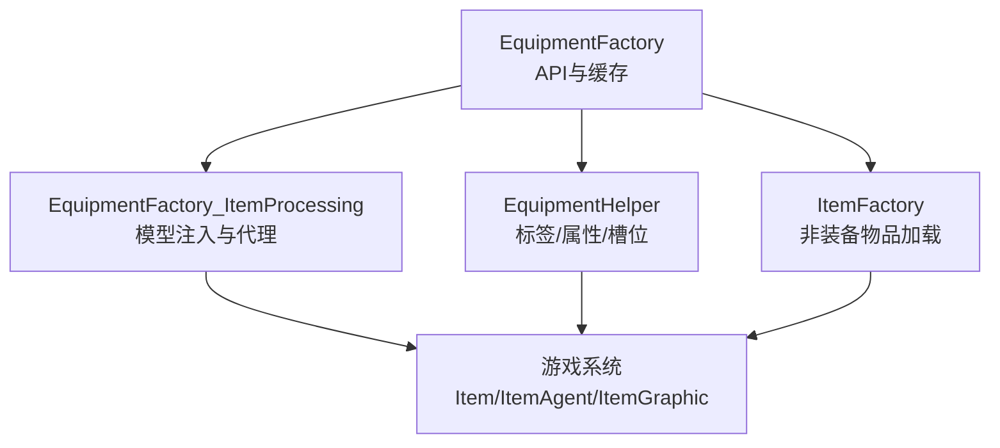
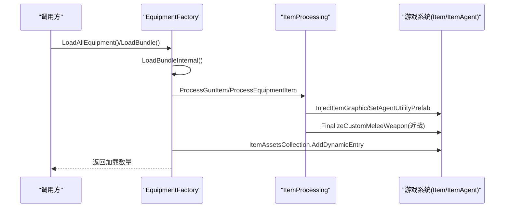
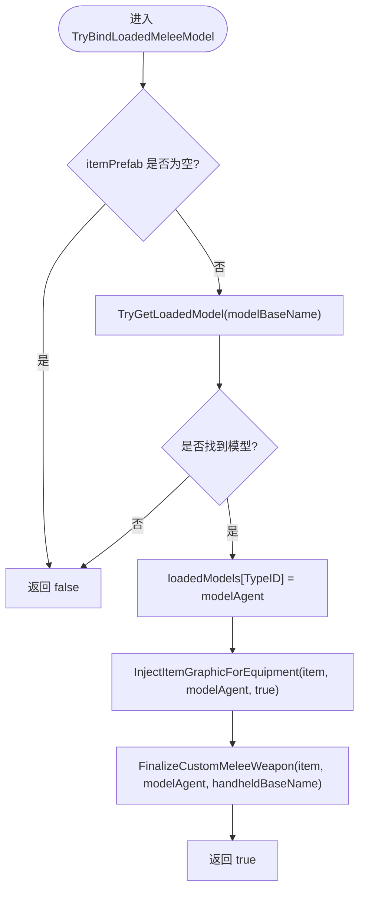
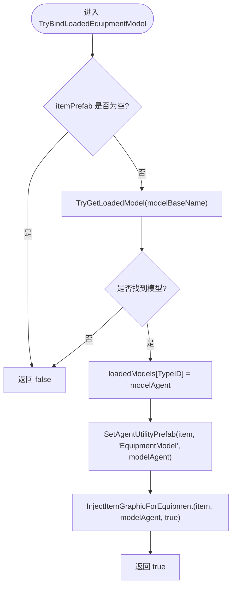
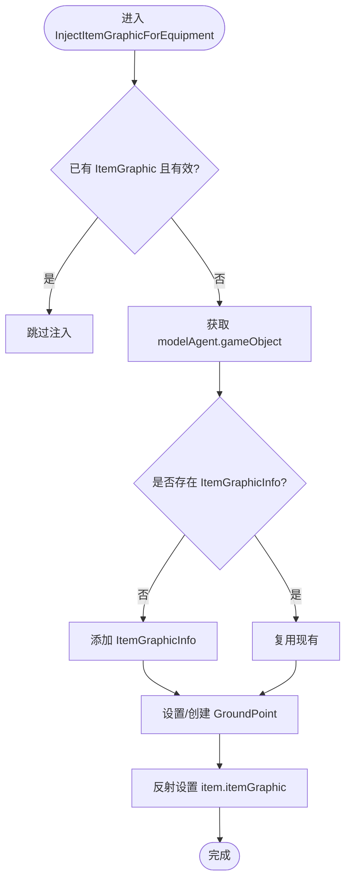
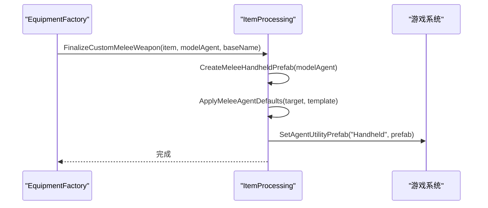
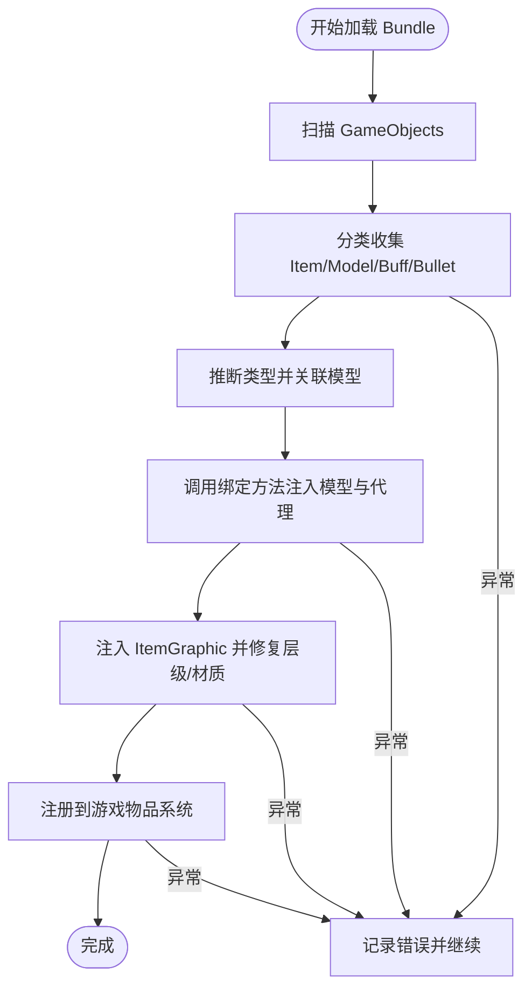
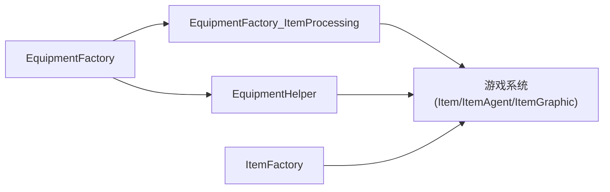

# 模型绑定系统

<cite>
**本文引用的文件**
- [EquipmentFactory.cs](file://Integration/EquipmentFactory.cs)
- [EquipmentFactory_ItemProcessing.cs](file://Integration/EquipmentFactory_ItemProcessing.cs)
- [EquipmentHelper.cs](file://Integration/EquipmentHelper.cs)
- [ItemFactory.cs](file://Integration/ItemFactory.cs)
</cite>

## 目录
1. [简介](#简介)
2. [项目结构](#项目结构)
3. [核心组件](#核心组件)
4. [架构总览](#架构总览)
5. [详细组件分析](#详细组件分析)
6. [依赖关系分析](#依赖关系分析)
7. [性能考量](#性能考量)
8. [故障排查指南](#故障排查指南)
9. [结论](#结论)
10. [附录：自定义模型集成指南](#附录自定义模型集成指南)

## 简介
本模块为 BossRushMod 的“模型绑定系统”，负责从 AssetBundle 加载并注入自定义装备、武器与 Buff，完成以下关键任务：
- 将已加载的 3D 模型（ItemAgent）绑定到物品预制体（Item），确保在背包、掉落、手持、假人等场景正确显示。
- 对近战武器进行 Handheld 代理处理，生成可被游戏引擎识别的手持模板。
- 维护模型缓存，避免重复实例化与资源浪费。
- 通过 ItemGraphic 注入修复掉落与手持路径，保证渲染层级与材质一致。

## 项目结构
该子系统由三个核心文件组成：
- EquipmentFactory.cs：对外 API、缓存管理、加载流程入口、类型解析与注册。
- EquipmentFactory_ItemProcessing.cs：具体模型注入、Handheld 代理创建、ItemGraphic 设置、层级与材质修复。
- EquipmentHelper.cs：通用辅助方法（标签、属性修改器、槽位配置）。
- ItemFactory.cs：非装备类物品的加载与缓存（与本系统配合使用）。

图表来源
- [EquipmentFactory.cs:134-173](file://Integration/EquipmentFactory.cs#L134-L173)
- [EquipmentFactory_ItemProcessing.cs:121-147](file://Integration/EquipmentFactory_ItemProcessing.cs#L121-L147)
- [EquipmentHelper.cs:121-178](file://Integration/EquipmentHelper.cs#L121-L178)
- [ItemFactory.cs:54-75](file://Integration/ItemFactory.cs#L54-L75)

章节来源
- [EquipmentFactory.cs:134-173](file://Integration/EquipmentFactory.cs#L134-L173)
- [EquipmentFactory_ItemProcessing.cs:121-147](file://Integration/EquipmentFactory_ItemProcessing.cs#L121-L147)
- [EquipmentHelper.cs:121-178](file://Integration/EquipmentHelper.cs#L121-L178)
- [ItemFactory.cs:54-75](file://Integration/ItemFactory.cs#L54-L75)

## 核心组件
- 模型缓存
  - loadedModels：按 TypeID 缓存 ItemAgent，便于快速查找与替换。
  - loadedModelsByBaseName：按基础名缓存 ItemAgent，支持模型与物品分桶加载与复用。
  - 其他缓存：loadedBuffs、loadedBullets、loadedGuns、loadedBundles。
- 模型绑定入口
  - TryBindLoadedMeleeModel：绑定近战模型并补齐 Handheld 代理。
  - TryBindLoadedEquipmentModel：绑定普通装备模型，覆盖克隆源外观。
- 模型注入与修复
  - InjectItemGraphicForEquipment：为装备注入 ItemGraphicInfo，设置 groundPoint，修复假人与掉落显示。
  - SetAgentUtilityPrefab：通过反射向 Item.agentUtilities 写入 AgentKeyPair，注册 EquipmentModel 或 Handheld 代理。
  - FinalizeCustomMeleeWeapon：为近战武器补齐标签、组件，并生成 Handheld 模板。
- 工具方法
  - FixModelLayerAndShader：统一层级与 Shader，避免渲染异常。
  - CreateModelWrapper / TryCreateEmbeddedMeleeModel：为缺少 DuckovItemAgent 的模型创建运行时包装或内嵌近战模型。
  - EquipmentHelper：添加 Tag、Modifier、槽位等。

章节来源
- [EquipmentFactory.cs:134-173](file://Integration/EquipmentFactory.cs#L134-L173)
- [EquipmentFactory.cs:331-370](file://Integration/EquipmentFactory.cs#L331-L370)
- [EquipmentFactory_ItemProcessing.cs:313-352](file://Integration/EquipmentFactory_ItemProcessing.cs#L313-L352)
- [EquipmentFactory_ItemProcessing.cs:359-401](file://Integration/EquipmentFactory_ItemProcessing.cs#L359-L401)
- [EquipmentFactory_ItemProcessing.cs:406-477](file://Integration/EquipmentFactory_ItemProcessing.cs#L406-L477)
- [EquipmentFactory_ItemProcessing.cs:491-565](file://Integration/EquipmentFactory_ItemProcessing.cs#L491-L565)
- [EquipmentFactory_ItemProcessing.cs:571-638](file://Integration/EquipmentFactory_ItemProcessing.cs#L571-L638)
- [EquipmentFactory_ItemProcessing.cs:808-858](file://Integration/EquipmentFactory_ItemProcessing.cs#L808-L858)
- [EquipmentFactory_ItemProcessing.cs:1001-1101](file://Integration/EquipmentFactory_ItemProcessing.cs#L1001-L1101)
- [EquipmentHelper.cs:121-178](file://Integration/EquipmentHelper.cs#L121-L178)

## 架构总览
整体流程分为“加载—分类—绑定—注入—注册”五个阶段：
1. 加载 AssetBundle，扫描所有 GameObject。
2. 分类收集 Item、ItemAgent、Buff、Projectile 等资源。
3. 根据命名规则推断类型，关联模型与物品。
4. 调用绑定方法注入模型与代理，设置 ItemGraphic。
5. 注册到游戏物品系统，加入动态条目集合。

图表来源
- [EquipmentFactory.cs:180-249](file://Integration/EquipmentFactory.cs#L180-L249)
- [EquipmentFactory.cs:501-749](file://Integration/EquipmentFactory.cs#L501-L749)
- [EquipmentFactory_ItemProcessing.cs:121-222](file://Integration/EquipmentFactory_ItemProcessing.cs#L121-L222)
- [EquipmentFactory_ItemProcessing.cs:808-858](file://Integration/EquipmentFactory_ItemProcessing.cs#L808-L858)

## 详细组件分析

### TryBindLoadedMeleeModel 实现
职责：
- 校验输入与模型存在性。
- 将模型缓存到 loadedModels（TypeID -> ItemAgent）。
- 注入 ItemGraphic 用于掉落与假人显示。
- 最终化近战武器：补齐标签、组件，生成 Handheld 代理并注册到 Item.agentUtilities。

关键点：
- 若未找到模型则直接返回失败，避免空引用。
- 注入后调用 FinalizeCustomMeleeWeapon，确保游戏引擎能将其识别为近战手持。

图表来源
- [EquipmentFactory.cs:331-348](file://Integration/EquipmentFactory.cs#L331-L348)
- [EquipmentFactory_ItemProcessing.cs:808-858](file://Integration/EquipmentFactory_ItemProcessing.cs#L808-L858)

章节来源
- [EquipmentFactory.cs:331-348](file://Integration/EquipmentFactory.cs#L331-L348)
- [EquipmentFactory_ItemProcessing.cs:808-858](file://Integration/EquipmentFactory_ItemProcessing.cs#L808-L858)

### TryBindLoadedEquipmentModel 实现
职责：
- 校验输入与模型存在性。
- 将模型缓存到 loadedModels。
- 通过 SetAgentUtilityPrefab 将模型作为 EquipmentModel 注入到 Item.agentUtilities。
- 注入 ItemGraphic 以修复假人与掉落显示。

差异点：
- 不生成 Handheld 代理，仅覆盖装备栏与掉落外观。
- 适合头盔、护甲、背包等非手持装备。

图表来源
- [EquipmentFactory.cs:353-370](file://Integration/EquipmentFactory.cs#L353-L370)
- [EquipmentFactory_ItemProcessing.cs:491-565](file://Integration/EquipmentFactory_ItemProcessing.cs#L491-L565)
- [EquipmentFactory_ItemProcessing.cs:571-638](file://Integration/EquipmentFactory_ItemProcessing.cs#L571-L638)

章节来源
- [EquipmentFactory.cs:353-370](file://Integration/EquipmentFactory.cs#L353-L370)
- [EquipmentFactory_ItemProcessing.cs:491-565](file://Integration/EquipmentFactory_ItemProcessing.cs#L491-L565)
- [EquipmentFactory_ItemProcessing.cs:571-638](file://Integration/EquipmentFactory_ItemProcessing.cs#L571-L638)

### InjectItemGraphicForEquipment 工作原理
职责：
- 检查现有 ItemGraphic 是否有效；若无效或强制替换，则创建/更新。
- 为模型 GameObject 添加或获取 ItemGraphicInfo。
- 设置 groundPoint（掉落定位点），缺失时自动创建。
- 通过反射设置 item.itemGraphic 私有字段，使游戏引擎读取。

影响范围：
- 假人显示：CharacterEquipmentController 可能依赖 ItemGraphic 作为备用显示路径。
- 掉落显示：PickupAgent 创建时会调用 CreateGraphic，依赖 ItemGraphic。

图表来源
- [EquipmentFactory_ItemProcessing.cs:571-638](file://Integration/EquipmentFactory_ItemProcessing.cs#L571-L638)

章节来源
- [EquipmentFactory_ItemProcessing.cs:571-638](file://Integration/EquipmentFactory_ItemProcessing.cs#L571-L638)

### Handheld 代理处理（近战武器）
职责：
- 为近战武器生成 Handheld 模板（ItemAgent_MeleeWeapon），确保游戏引擎能正确挂载到角色手部。
- 应用默认参数：handheldSocket、handAnimationType、音效键、斩击特效延迟等。
- 将生成的模板注册到 Item.agentUtilities，键名为 "Handheld"。

关键点：
- 若模型不存在，会尝试从物品内嵌渲染节点创建内嵌近战模型。
- 运行时复制模型并调整层级与位置，避免模板污染场景。

图表来源
- [EquipmentFactory_ItemProcessing.cs:808-858](file://Integration/EquipmentFactory_ItemProcessing.cs#L808-L858)
- [EquipmentFactory_ItemProcessing.cs:860-898](file://Integration/EquipmentFactory_ItemProcessing.cs#L860-L898)
- [EquipmentFactory_ItemProcessing.cs:900-972](file://Integration/EquipmentFactory_ItemProcessing.cs#L900-L972)
- [EquipmentFactory_ItemProcessing.cs:1001-1101](file://Integration/EquipmentFactory_ItemProcessing.cs#L1001-L1101)

章节来源
- [EquipmentFactory_ItemProcessing.cs:808-858](file://Integration/EquipmentFactory_ItemProcessing.cs#L808-L858)
- [EquipmentFactory_ItemProcessing.cs:860-898](file://Integration/EquipmentFactory_ItemProcessing.cs#L860-L898)
- [EquipmentFactory_ItemProcessing.cs:900-972](file://Integration/EquipmentFactory_ItemProcessing.cs#L900-L972)
- [EquipmentFactory_ItemProcessing.cs:1001-1101](file://Integration/EquipmentFactory_ItemProcessing.cs#L1001-L1101)

### 模型缓存机制（loadedModels 与 loadedModelsByBaseName）
- loadedModels（TypeID -> ItemAgent）
  - 用途：按物品 ID 快速查找对应模型，用于绑定与替换。
  - 场景：TryBindLoadedMeleeModel/TryBindLoadedEquipmentModel 中写入；IsCustomEquipment 查询。
- loadedModelsByBaseName（BaseName -> ItemAgent）
  - 用途：按基础名缓存模型，支持模型与物品分桶加载与复用。
  - 场景：LoadBundleInternal 中收集模型时写入；TryGetLoadedModel 查询。

优势：
- 避免重复实例化与资源占用。
- 支持多物品共享同一模型（如不同品质变体）。

章节来源
- [EquipmentFactory.cs:134-173](file://Integration/EquipmentFactory.cs#L134-L173)
- [EquipmentFactory.cs:309-326](file://Integration/EquipmentFactory.cs#L309-L326)
- [EquipmentFactory.cs:501-749](file://Integration/EquipmentFactory.cs#L501-L749)

### 完整绑定流程与错误处理
流程概览：
1. 加载 AssetBundle，扫描 GameObject。
2. 分类收集 Item、ItemAgent、Buff、Projectile。
3. 推断类型并关联模型。
4. 调用绑定方法注入模型与代理。
5. 设置 ItemGraphic，修复层级与材质。
6. 注册到游戏物品系统。

错误处理策略：
- 空引用保护：对所有输入参数进行空检查。
- 反射安全：通过 try-catch 包裹反射操作，失败时记录日志并继续。
- 资源缺失：当模型或组件缺失时，记录日志并跳过相关步骤。
- 异常捕获：关键路径均包裹 try-catch，避免崩溃。

图表来源
- [EquipmentFactory.cs:501-749](file://Integration/EquipmentFactory.cs#L501-L749)
- [EquipmentFactory_ItemProcessing.cs:313-352](file://Integration/EquipmentFactory_ItemProcessing.cs#L313-L352)
- [EquipmentFactory_ItemProcessing.cs:571-638](file://Integration/EquipmentFactory_ItemProcessing.cs#L571-L638)

章节来源
- [EquipmentFactory.cs:501-749](file://Integration/EquipmentFactory.cs#L501-L749)
- [EquipmentFactory_ItemProcessing.cs:313-352](file://Integration/EquipmentFactory_ItemProcessing.cs#L313-L352)
- [EquipmentFactory_ItemProcessing.cs:571-638](file://Integration/EquipmentFactory_ItemProcessing.cs#L571-L638)

## 依赖关系分析
- EquipmentFactory 依赖 EquipmentFactory_ItemProcessing 完成具体注入逻辑。
- EquipmentFactory 依赖 EquipmentHelper 添加标签与属性。
- 两者共同依赖游戏系统（Item、ItemAgent、ItemGraphic、ItemSetting_*）。
- ItemFactory 提供非装备物品的加载能力，与本系统协同工作。

图表来源
- [EquipmentFactory.cs:134-173](file://Integration/EquipmentFactory.cs#L134-L173)
- [EquipmentFactory_ItemProcessing.cs:121-147](file://Integration/EquipmentFactory_ItemProcessing.cs#L121-L147)
- [EquipmentHelper.cs:121-178](file://Integration/EquipmentHelper.cs#L121-L178)
- [ItemFactory.cs:54-75](file://Integration/ItemFactory.cs#L54-L75)

章节来源
- [EquipmentFactory.cs:134-173](file://Integration/EquipmentFactory.cs#L134-L173)
- [EquipmentFactory_ItemProcessing.cs:121-147](file://Integration/EquipmentFactory_ItemProcessing.cs#L121-L147)
- [EquipmentHelper.cs:121-178](file://Integration/EquipmentHelper.cs#L121-L178)
- [ItemFactory.cs:54-75](file://Integration/ItemFactory.cs#L54-L75)

## 性能考量
- 缓存复用：loadedModels 与 loadedModelsByBaseName 避免重复实例化。
- 反射优化：仅在必要时使用反射，并对结果进行缓存（如 gameShader）。
- 资源管理：AssetBundle 不立即卸载，避免频繁加载开销；在 Shutdown 时统一清理。
- 渲染优化：统一层级与 Shader，减少渲染状态切换。
- 热路径保护：避免在高频路径中实例化物品或执行昂贵操作。

## 故障排查指南
常见问题与解决：
- 模型未显示
  - 检查 TryGetLoadedModel 是否返回有效模型。
  - 确认 InjectItemGraphicForEquipment 是否成功设置 item.itemGraphic。
  - 验证 Layer 与 Shader 是否正确修复。
- 手持位置错误
  - 检查 Sockets 节点是否存在，Muzzle/Tec 是否移入 Sockets。
  - 确认 Handheld 模板已注册到 Item.agentUtilities。
- 掉落显示异常
  - 确认 ItemGraphicInfo 的 groundPoint 已设置。
  - 检查是否有有效的 Renderer 子对象。
- 反射失败
  - 查看日志中的异常信息，确认字段名与类型匹配。
  - 逐步缩小问题范围，定位具体反射步骤。

章节来源
- [EquipmentFactory_ItemProcessing.cs:313-352](file://Integration/EquipmentFactory_ItemProcessing.cs#L313-L352)
- [EquipmentFactory_ItemProcessing.cs:571-638](file://Integration/EquipmentFactory_ItemProcessing.cs#L571-L638)
- [EquipmentFactory_ItemProcessing.cs:645-806](file://Integration/EquipmentFactory_ItemProcessing.cs#L645-L806)
- [EquipmentFactory_ItemProcessing.cs:1001-1101](file://Integration/EquipmentFactory_ItemProcessing.cs#L1001-L1101)

## 结论
本模型绑定系统通过缓存、注入与代理机制，实现了自定义装备与武器的无缝集成。其设计兼顾了性能与稳定性，提供了完善的错误处理与调试支持。遵循本文档的集成指南与最佳实践，可高效扩展新的自定义内容。

## 附录：自定义模型集成指南
- 资源组织
  - 将 AssetBundle 放入 Assets/Equipment 目录。
  - 遵循命名规范：{名称}_{类型}_{后缀}。
- Prefab 配置
  - 装备：包含 Item 组件与 typeID。
  - 武器：包含 Item 与 ItemSetting_Gun 组件。
  - 模型：包含 ItemAgent 或可被包装的渲染节点。
- 集成步骤
  - 调用 LoadAllEquipment 或 LoadBundle 加载资源。
  - 使用 TryBindLoadedMeleeModel 或 TryBindLoadedEquipmentModel 绑定模型。
  - 如需近战手持，确保传入 handheldBaseName。
- 最佳实践
  - 保持模型层级与材质一致。
  - 为枪械设置正确的 Sockets 节点。
  - 避免在热路径中实例化物品。

章节来源
- [EquipmentFactory.cs:17-79](file://Integration/EquipmentFactory.cs#L17-L79)
- [EquipmentFactory.cs:180-249](file://Integration/EquipmentFactory.cs#L180-L249)
- [EquipmentFactory.cs:331-370](file://Integration/EquipmentFactory.cs#L331-L370)
- [EquipmentFactory_ItemProcessing.cs:645-806](file://Integration/EquipmentFactory_ItemProcessing.cs#L645-L806)