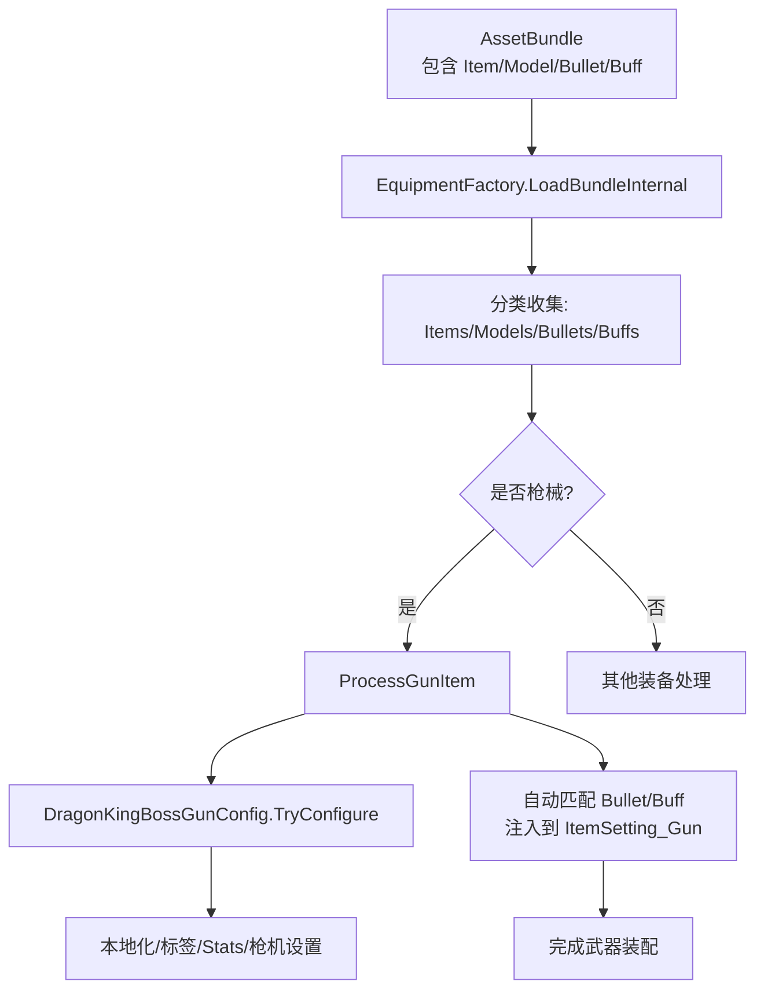
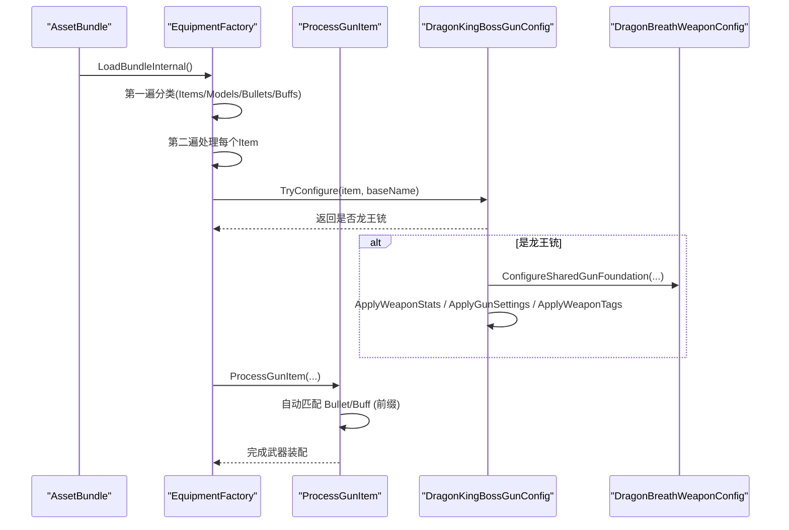
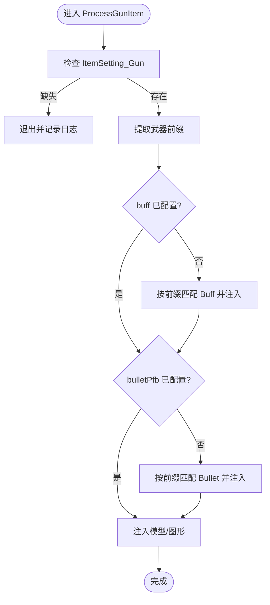
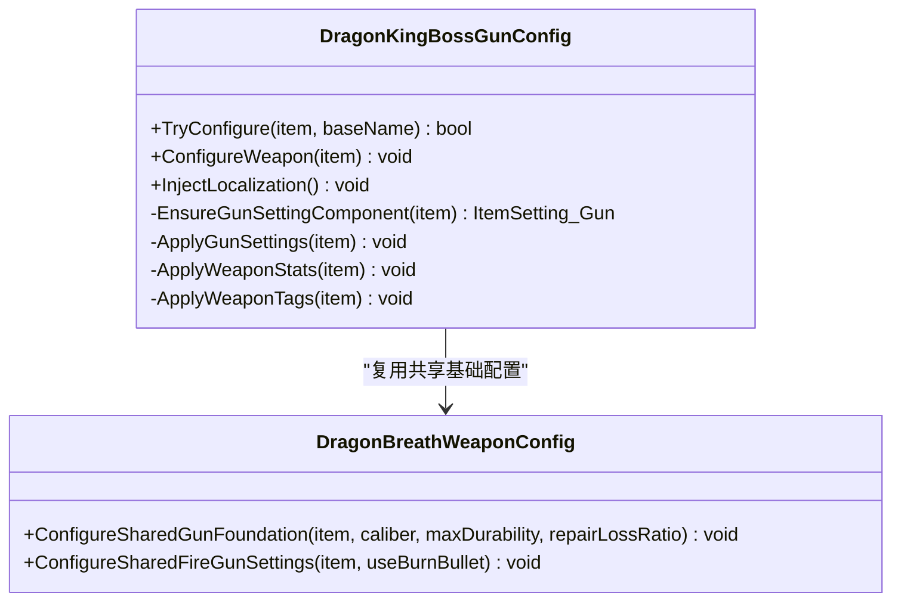
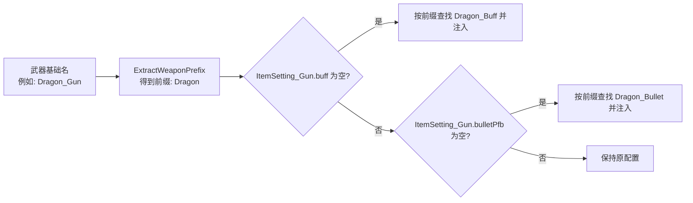
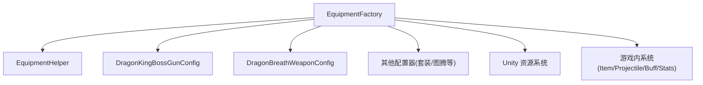

# 武器处理系统

<cite>
**本文引用的文件**
- [EquipmentFactory.cs](file://Integration/EquipmentFactory.cs)
- [EquipmentFactory_ItemProcessing.cs](file://Integration/EquipmentFactory_ItemProcessing.cs)
- [DragonKingBossGunConfig.cs](file://Integration/DragonKing/Weapons/DragonKingBossGunConfig.cs)
- [DragonBreathWeaponConfig.cs](file://Integration/DragonDescendant/DragonBreathWeaponConfig.cs)
- [CODE_REVIEW_FINDINGS.md](file://CODE_REVIEW_FINDINGS.md)
</cite>

## 目录
1. [简介](#简介)
2. [项目结构](#项目结构)
3. [核心组件](#核心组件)
4. [架构总览](#架构总览)
5. [详细组件分析](#详细组件分析)
6. [依赖关系分析](#依赖关系分析)
7. [性能考量](#性能考量)
8. [故障排查指南](#故障排查指南)
9. [结论](#结论)
10. [附录：新武器开发指南与调试技巧](#附录：新武器开发指南与调试技巧)

## 简介
本文件面向“武器处理系统”，聚焦以下目标：
- 深入解释 ProcessGunItem 方法的实现，包括枪械识别、子弹预制体关联、Buff 自动注入。
- 详细说明 DragonKingBossGunConfig.TryConfigure 的工作机制，包括武器配置、属性设置、特殊能力绑定。
- 解释子弹和 Buff 的自动匹配逻辑（命名约定、前缀提取、资源关联）。
- 提供武器配置的完整流程与验证机制。
- 给出新武器开发指南与调试技巧。

## 项目结构
武器处理系统由“装备工厂”与“龙王铳配置器”两大模块协作完成：
- 装备工厂负责从 AssetBundle 加载物品、模型、子弹、Buff，并基于命名规范进行自动匹配与注入。
- 龙王铳配置器对特定武器（焚天龙铳）进行强类型识别与专属配置（本地化、标签、统计、枪机设置等）。

图表来源
- [EquipmentFactory.cs:501-749](file://Integration/EquipmentFactory.cs#L501-L749)
- [EquipmentFactory_ItemProcessing.cs:154-222](file://Integration/EquipmentFactory_ItemProcessing.cs#L154-L222)
- [DragonKingBossGunConfig.cs:105-167](file://Integration/DragonKing/Weapons/DragonKingBossGunConfig.cs#L105-L167)

章节来源
- [EquipmentFactory.cs:176-249](file://Integration/EquipmentFactory.cs#L176-L249)
- [EquipmentFactory_ItemProcessing.cs:154-222](file://Integration/EquipmentFactory_ItemProcessing.cs#L154-L222)

## 核心组件
- EquipmentFactory：资产加载、类型识别、自动匹配与注入的核心入口。
- ProcessGunItem：枪械专用处理流程，负责 Tag、ItemSetting_Gun、模型、Bullet、Buff 的装配。
- DragonKingBossGunConfig：焚天龙铳的专属配置器，负责识别、本地化、标签、统计、枪机设置。
- DragonBreathWeaponConfig：龙息武器通用配置器，提供共享基础配置（口径、耐久、槽位、音效等），被龙王铳复用。

章节来源
- [EquipmentFactory.cs:114-173](file://Integration/EquipmentFactory.cs#L114-L173)
- [EquipmentFactory_ItemProcessing.cs:154-222](file://Integration/EquipmentFactory_ItemProcessing.cs#L154-L222)
- [DragonKingBossGunConfig.cs:13-167](file://Integration/DragonKing/Weapons/DragonKingBossGunConfig.cs#L13-L167)
- [DragonBreathWeaponConfig.cs:209-258](file://Integration/DragonDescendant/DragonBreathWeaponConfig.cs#L209-L258)

## 架构总览
装备工厂在加载 Bundle 时执行两遍扫描：第一遍分类收集所有资源；第二遍按类型处理并调用各配置器。枪械路径会先尝试龙王铳专属配置，再走通用枪械装配流程。

图表来源
- [EquipmentFactory.cs:501-749](file://Integration/EquipmentFactory.cs#L501-L749)
- [EquipmentFactory_ItemProcessing.cs:154-222](file://Integration/EquipmentFactory_ItemProcessing.cs#L154-L222)
- [DragonKingBossGunConfig.cs:105-167](file://Integration/DragonKing/Weapons/DragonKingBossGunConfig.cs#L105-L167)
- [DragonBreathWeaponConfig.cs:209-258](file://Integration/DragonDescendant/DragonBreathWeaponConfig.cs#L209-L258)

## 详细组件分析

### ProcessGunItem：枪械识别、子弹与Buff自动注入
- 枪械识别：通过名称解析或已检测到的类型判断是否为枪械；若存在 ItemSetting_Gun 则视为枪械。
- 前缀提取：从武器基础名中去除 _Gun/_Weapon/_Rifle/_Pistol/_Shotgun/_SMG 等后缀，得到用于匹配 Bullet/Buff 的前缀。
- 自动匹配：
  - 若 ItemSetting_Gun.buff 为空，则根据前缀查找 buffsByPrefix 并注入。
  - 若 ItemSetting_Gun.bulletPfb 为空且非龙王铳（避免覆盖其自定义弹种逻辑），则根据前缀查找 bulletsByPrefix 并注入。
- 模型注入：为枪械注入 ItemGraphicInfo_Gun，确保手持与掉落显示正确；必要时创建运行时包装器以修复只读 AssetBundle 对象。

图表来源
- [EquipmentFactory_ItemProcessing.cs:154-222](file://Integration/EquipmentFactory_ItemProcessing.cs#L154-L222)
- [EquipmentFactory_ItemProcessing.cs:227-262](file://Integration/EquipmentFactory_ItemProcessing.cs#L227-L262)
- [EquipmentFactory_ItemProcessing.cs:645-800](file://Integration/EquipmentFactory_ItemProcessing.cs#L645-L800)

章节来源
- [EquipmentFactory_ItemProcessing.cs:154-222](file://Integration/EquipmentFactory_ItemProcessing.cs#L154-L222)
- [EquipmentFactory_ItemProcessing.cs:227-262](file://Integration/EquipmentFactory_ItemProcessing.cs#L227-L262)
- [EquipmentFactory_ItemProcessing.cs:645-800](file://Integration/EquipmentFactory_ItemProcessing.cs#L645-L800)

### DragonKingBossGunConfig.TryConfigure：龙王铳识别与专属配置
- 识别条件：TypeID 等于常量或 baseName 等于预设名称（不区分大小写）。
- 配置步骤：
  - 注入本地化键值（名称、描述、未知口径文本）。
  - 修正 TypeID 与名称，保证后续系统能正确识别。
  - 补齐 ItemSetting_Gun 组件（射击/换弹按键、触发模式、元素类型等）。
  - 调用共享基础配置（口径、耐久、维修损耗、显示口径等）。
  - 应用武器 Stats（伤害、射速、弹匣、射程、散布、后坐力等），并控制 UI 显示字段。
  - 应用枪机设置（元素、Buff 置空、按键映射等）。
  - 添加标签（Weapon/Gun/Special/DragonKing）与可维修标签。

图表来源
- [DragonKingBossGunConfig.cs:105-167](file://Integration/DragonKing/Weapons/DragonKingBossGunConfig.cs#L105-L167)
- [DragonKingBossGunConfig.cs:169-185](file://Integration/DragonKing/Weapons/DragonKingBossGunConfig.cs#L169-L185)
- [DragonKingBossGunConfig.cs:198-253](file://Integration/DragonKing/Weapons/DragonKingBossGunConfig.cs#L198-L253)
- [DragonKingBossGunConfig.cs:255-319](file://Integration/DragonKing/Weapons/DragonKingBossGunConfig.cs#L255-L319)
- [DragonBreathWeaponConfig.cs:209-258](file://Integration/DragonDescendant/DragonBreathWeaponConfig.cs#L209-L258)

章节来源
- [DragonKingBossGunConfig.cs:105-167](file://Integration/DragonKing/Weapons/DragonKingBossGunConfig.cs#L105-L167)
- [DragonKingBossGunConfig.cs:169-185](file://Integration/DragonKing/Weapons/DragonKingBossGunConfig.cs#L169-L185)
- [DragonKingBossGunConfig.cs:198-253](file://Integration/DragonKing/Weapons/DragonKingBossGunConfig.cs#L198-L253)
- [DragonKingBossGunConfig.cs:255-319](file://Integration/DragonKing/Weapons/DragonKingBossGunConfig.cs#L255-L319)
- [DragonBreathWeaponConfig.cs:209-258](file://Integration/DragonDescendant/DragonBreathWeaponConfig.cs#L209-L258)

### 子弹与 Buff 的自动匹配逻辑
- 命名约定：
  - 武器：{名称}_Gun_Item
  - 子弹：{名称}_Bullet
  - Buff：{名称}_Buff
- 前缀提取：从武器基础名中去掉 _Gun/_Weapon/_Rifle/_Pistol/_Shotgun/_SMG 等后缀，得到统一前缀。
- 资源关联：
  - 第一遍扫描时，将 Buff 与 Projectile 按前缀存入字典。
  - 第二遍处理枪械时，若未显式配置 buff/bulletPfb，则按前缀匹配并注入。
- 例外：龙王铳跳过自动子弹注入，保留其自定义弹种切换逻辑。

图表来源
- [EquipmentFactory_ItemProcessing.cs:182-205](file://Integration/EquipmentFactory_ItemProcessing.cs#L182-L205)
- [EquipmentFactory_ItemProcessing.cs:478-494](file://Integration/EquipmentFactory_ItemProcessing.cs#L478-L494)
- [EquipmentFactory.cs:521-555](file://Integration/EquipmentFactory.cs#L521-L555)

章节来源
- [EquipmentFactory_ItemProcessing.cs:182-205](file://Integration/EquipmentFactory_ItemProcessing.cs#L182-L205)
- [EquipmentFactory_ItemProcessing.cs:478-494](file://Integration/EquipmentFactory_ItemProcessing.cs#L478-L494)
- [EquipmentFactory.cs:521-555](file://Integration/EquipmentFactory.cs#L521-L555)

### 武器配置的完整流程与验证机制
- 加载阶段：
  - 扫描 AssetBundle，分类收集 Item/Model/Bullet/Buff。
  - 对枪械调用 DragonKingBossGunConfig.TryConfigure 与 ProcessGunItem。
  - 对其他装备调用相应配置器（套装、图腾等）。
- 验证要点：
  - 确保 ItemSetting_Gun 存在且必要字段已设置。
  - 确保 Stats 存在且关键属性已写入（伤害、射速、弹匣、射程、散布、后坐力等）。
  - 确保标签正确（Weapon/Gun/Special/DragonKing）。
  - 确保本地化键值可用（名称、描述、未知口径）。
  - 确保模型与图形信息有效（ItemGraphicInfo_Gun、Sockets 节点）。

章节来源
- [EquipmentFactory.cs:501-749](file://Integration/EquipmentFactory.cs#L501-L749)
- [DragonKingBossGunConfig.cs:105-167](file://Integration/DragonKing/Weapons/DragonKingBossGunConfig.cs#L105-L167)
- [EquipmentFactory_ItemProcessing.cs:154-222](file://Integration/EquipmentFactory_ItemProcessing.cs#L154-L222)

## 依赖关系分析
- EquipmentFactory 依赖：
  - EquipmentHelper：添加标签、工具方法。
  - DragonKingBossGunConfig：龙王铳专属配置。
  - DragonBreathWeaponConfig：共享基础配置。
  - 其他配置器：套装、图腾、逆鳞、飞行图腾等。
- 内部缓存：
  - 已加载模型、武器、子弹、Buff 的字典缓存，避免重复加载与查找。
- 外部依赖：
  - Unity 资源系统（AssetBundle、GameObject、Renderer）。
  - 游戏内系统（Item、ItemSetting_Gun、Projectile、Buff、StatCollection）。

图表来源
- [EquipmentFactory.cs:501-749](file://Integration/EquipmentFactory.cs#L501-L749)
- [EquipmentFactory_ItemProcessing.cs:154-222](file://Integration/EquipmentFactory_ItemProcessing.cs#L154-L222)

章节来源
- [EquipmentFactory.cs:114-173](file://Integration/EquipmentFactory.cs#L114-L173)
- [EquipmentFactory.cs:501-749](file://Integration/EquipmentFactory.cs#L501-L749)

## 性能考量
- 反射缓存：龙王铳配置器使用 FieldInfo 缓存减少反射开销。
- 高射速优化：代码审查指出龙王铳射击热路径曾每发重复写 Stat，已通过 TryApplyAmmoProfile 的跳过逻辑修复，避免在高射速下放大开销。
- 资源复用：子弹与 Buff 按前缀缓存，避免重复查找。
- 模型渲染：为枪械注入 ItemGraphicInfo_Gun 并确保 Sockets 节点正确，减少运行时错误与额外计算。

章节来源
- [DragonKingBossGunConfig.cs:298-319](file://Integration/DragonKing/Weapons/DragonKingBossGunConfig.cs#L298-L319)
- [CODE_REVIEW_FINDINGS.md:54-88](file://CODE_REVIEW_FINDINGS.md#L54-L88)

## 故障排查指南
- 常见问题定位：
  - 缺少 ItemSetting_Gun：ProcessGunItem 会记录日志并跳过。
  - 无法注入 Buff/Bullet：检查命名是否符合约定，前缀是否正确。
  - 模型显示异常：检查 ItemGraphicInfo_Gun 是否注入成功，Sockets 节点是否存在。
  - 龙王铳属性异常：确认 TryConfigure 是否被调用，Stats 与标签是否正确设置。
- 日志关键字：
  - “[EquipmentFactory] 武器缺少 ItemSetting_Gun 组件”
  - “[EquipmentFactory] 自动关联 Buff/Bullet”
  - “[DragonKingBossGun] 配置失败/已按 bundle 预制体完成配置”
- 建议步骤：
  - 打开 DevLog，搜索上述关键字定位问题。
  - 检查 AssetBundle 中资源命名与组件配置。
  - 验证前缀提取结果与字典匹配情况。

章节来源
- [EquipmentFactory_ItemProcessing.cs:176-180](file://Integration/EquipmentFactory_ItemProcessing.cs#L176-L180)
- [EquipmentFactory_ItemProcessing.cs:186-205](file://Integration/EquipmentFactory_ItemProcessing.cs#L186-L205)
- [DragonKingBossGunConfig.cs:161-166](file://Integration/DragonKing/Weapons/DragonKingBossGunConfig.cs#L161-L166)

## 结论
武器处理系统通过装备工厂的统一加载流程与龙王铳专属配置器，实现了枪械的自动化装配与特性注入。命名约定与前缀提取简化了资源关联，反射缓存与热路径优化保障了性能。遵循本文的开发指南与排查步骤，可高效扩展新武器并稳定集成到系统中。

## 附录：新武器开发指南与调试技巧
- 资源准备：
  - 在 Assets/Equipment 目录下放置 AssetBundle（无扩展名）。
  - 按命名规范准备 Weapon、Bullet、Buff 预制体。
- 配置要求：
  - 武器需包含 Item 与 ItemSetting_Gun 组件。
  - 可省略 bulletPfb 与 buff，系统将自动匹配同名资源。
  - 如需自定义弹种（如龙王铳），请绕过自动匹配并在配置器中显式设置。
- 调试技巧：
  - 启用 DevLog，观察加载与匹配过程。
  - 检查前缀提取结果与字典匹配情况。
  - 验证 Stats、标签、本地化键值是否正确设置。
  - 对于高射速武器，关注热路径日志与 Stat 覆盖行为。

章节来源
- [EquipmentFactory.cs:176-249](file://Integration/EquipmentFactory.cs#L176-L249)
- [EquipmentFactory_ItemProcessing.cs:154-222](file://Integration/EquipmentFactory_ItemProcessing.cs#L154-L222)
- [DragonKingBossGunConfig.cs:105-167](file://Integration/DragonKing/Weapons/DragonKingBossGunConfig.cs#L105-L167)
- [CODE_REVIEW_FINDINGS.md:54-88](file://CODE_REVIEW_FINDINGS.md#L54-L88)