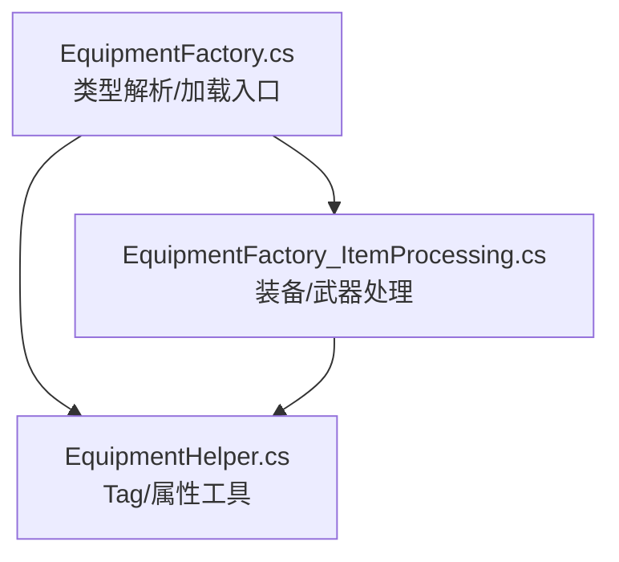
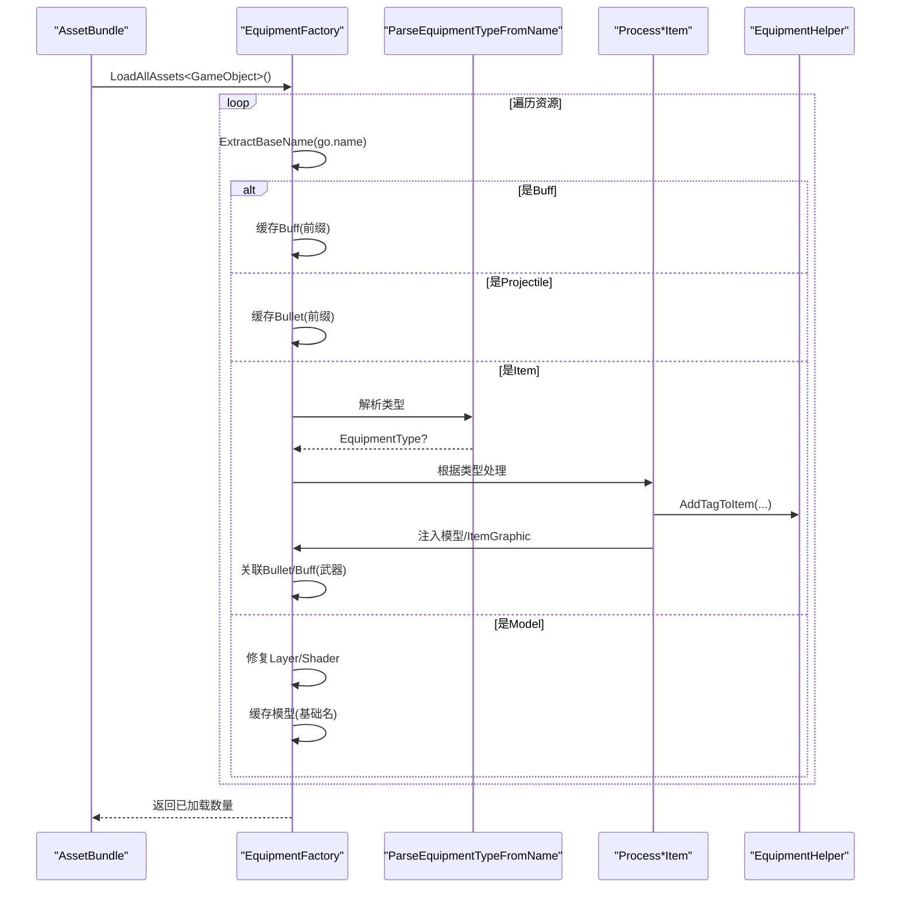
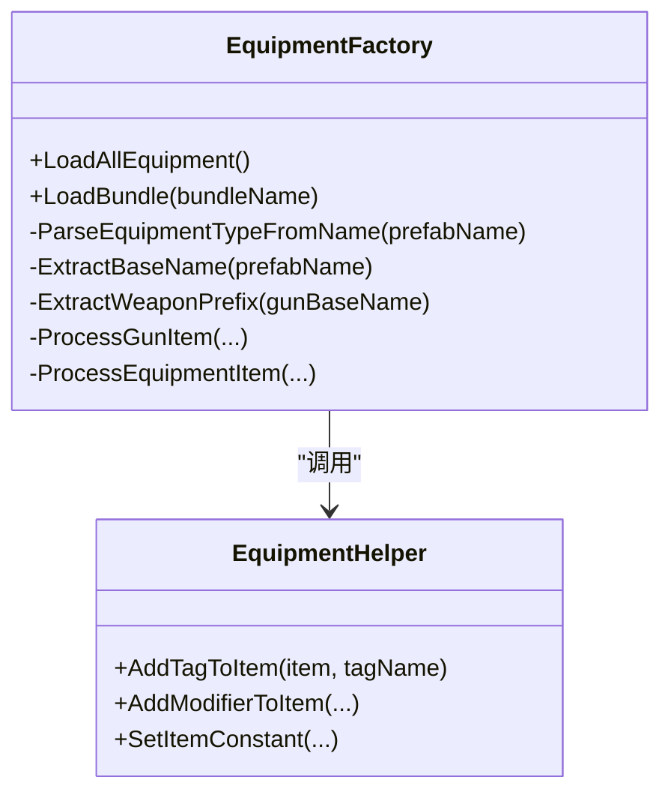

# 物品类型识别系统

<cite>
**本文引用的文件**
- [EquipmentFactory.cs](file://Integration/EquipmentFactory.cs)
- [EquipmentFactory_ItemProcessing.cs](file://Integration/EquipmentFactory_ItemProcessing.cs)
- [EquipmentHelper.cs](file://Integration/EquipmentHelper.cs)
</cite>

## 目录
1. [简介](#简介)
2. [项目结构](#项目结构)
3. [核心组件](#核心组件)
4. [架构总览](#架构总览)
5. [详细组件分析](#详细组件分析)
6. [依赖关系分析](#依赖关系分析)
7. [性能考量](#性能考量)
8. [故障排查指南](#故障排查指南)
9. [结论](#结论)
10. [附录：命名规范与扩展指南](#附录：命名规范与扩展指南)

## 简介
本系统为 BossRushMod 的“物品类型识别系统”，负责从 AssetBundle 中加载自定义装备、武器与 Buff，并基于 Prefab 名称自动推断其类型（枪械、近战、头盔、护甲、背包、面罩、耳机、图腾等），随后完成标签注入、模型绑定、子弹/Buff 自动关联以及最终注册到游戏物品系统。

核心方法包括：
- ParseEquipmentTypeFromName：从 Prefab 名称解析物品类型
- ExtractBaseName：移除常见后缀得到基础名
- ExtractWeaponPrefix：从武器基础名提取前缀以匹配同名 Bullet/Buff

## 项目结构
该子系统由三个关键文件组成：
- EquipmentFactory.cs：定义 EquipmentType 枚举、类型解析、基础名/武器前缀提取、Bundle 加载主流程
- EquipmentFactory_ItemProcessing.cs：实现装备/武器的具体处理逻辑（标签注入、模型绑定、ItemGraphic 注入、近战武器收尾）
- EquipmentHelper.cs：提供通用的 Tag 添加、属性修改器、槽位配置等工具方法

图表来源
- [EquipmentFactory.cs:117-127](file://Integration/EquipmentFactory.cs#L117-L127)
- [EquipmentFactory.cs:422-494](file://Integration/EquipmentFactory.cs#L422-L494)
- [EquipmentFactory_ItemProcessing.cs:121-222](file://Integration/EquipmentFactory_ItemProcessing.cs#L121-L222)
- [EquipmentHelper.cs:121-178](file://Integration/EquipmentHelper.cs#L121-L178)

章节来源
- [EquipmentFactory.cs:1-174](file://Integration/EquipmentFactory.cs#L1-L174)
- [EquipmentFactory_ItemProcessing.cs:1-115](file://Integration/EquipmentFactory_ItemProcessing.cs#L1-L115)
- [EquipmentHelper.cs:1-29](file://Integration/EquipmentHelper.cs#L1-L29)

## 核心组件
- 类型枚举 EquipmentType：统一表示支持的物品类别（头盔、护甲、背包、面罩、耳机、枪械、图腾、近战武器）
- 类型解析器 ParseEquipmentTypeFromName：按优先级检测名称中的关键词，返回对应类型
- 名称处理器 ExtractBaseName / ExtractWeaponPrefix：用于资源匹配与关联
- 标签映射 GetTagName：将内部类型映射到游戏内 Tag 名称（注意“Helmat”拼写）
- 处理管线 ProcessEquipmentItem / ProcessGunItem：根据类型执行差异化处理

章节来源
- [EquipmentFactory.cs:117-127](file://Integration/EquipmentFactory.cs#L117-L127)
- [EquipmentFactory.cs:402-494](file://Integration/EquipmentFactory.cs#L402-L494)
- [EquipmentFactory_ItemProcessing.cs:121-222](file://Integration/EquipmentFactory_ItemProcessing.cs#L121-L222)

## 架构总览
整体加载与识别流程如下：

图表来源
- [EquipmentFactory.cs:501-741](file://Integration/EquipmentFactory.cs#L501-L741)
- [EquipmentFactory_ItemProcessing.cs:121-222](file://Integration/EquipmentFactory_ItemProcessing.cs#L121-L222)
- [EquipmentHelper.cs:121-178](file://Integration/EquipmentHelper.cs#L121-L178)

## 详细组件分析

### 类型解析：ParseEquipmentTypeFromName
- 输入：Prefab 名称（小写化后）
- 规则与优先级：
  - 武器优先检测：包含 _gun_/_weapon_/_rifle_/_pistol_/_shotgun_/_smg_ 即判定为 Gun
  - 近战武器：包含 _melee_/_sword_/_axe_ 即判定为 MeleeWeapon
  - 图腾：包含 _totem_ 或 totem 即判定为 Totem
  - 装备：包含 _helmet_/_armor_/_platecarrier_/_backpack_/_bag_/_facemask_/_mask_/_headset_ 分别映射到 Helmet/Armor/Backpack/FaceMask/Headset
  - 未命中则返回 null
- 设计要点：
  - 武器优先于其他类型，避免误判
  - 支持大小写不敏感匹配
  - 对“Helmet”采用游戏原版拼写“Helmat”作为 Tag 输出

章节来源
- [EquipmentFactory.cs:422-454](file://Integration/EquipmentFactory.cs#L422-L454)

### 名称处理：ExtractBaseName 与 ExtractWeaponPrefix
- ExtractBaseName：
  - 移除常见后缀：_Item、_Model、_Bullet、_Buff、_FX、_Effect
  - 用于统一资源键（如 Dragon_Gun_Item -> Dragon_Gun）
- ExtractWeaponPrefix：
  - 从武器基础名去除武器类后缀：_Gun、_Weapon、_Rifle、_Pistol、_Shotgun、_SMG
  - 用于匹配同名 Bullet/Buff（如 Dragon_Gun -> 匹配 Dragon_Bullet/Dragon_Buff）

章节来源
- [EquipmentFactory.cs:460-494](file://Integration/EquipmentFactory.cs#L460-L494)
- [EquipmentFactory_ItemProcessing.cs:183-205](file://Integration/EquipmentFactory_ItemProcessing.cs#L183-L205)

### 标签映射：GetTagName
- 将内部 EquipmentType 映射到游戏 Tag 名称：
  - Helmet -> "Helmat"（注意拼写）
  - Armor -> "Armor"
  - Backpack -> "Backpack"
  - FaceMask -> "FaceMask"
  - Headset -> "Headset"
  - Gun -> "Gun"
  - Totem -> "Totem"
  - MeleeWeapon -> "Weapon"

章节来源
- [EquipmentFactory.cs:402-416](file://Integration/EquipmentFactory.cs#L402-L416)

### 装备处理：ProcessEquipmentItem
- 为装备添加对应 Tag（通过 EquipmentHelper.AddTagToItem）
- 若为图腾，额外添加 DontDropOnDeadInSlot 标签
- 注入 EquipmentModel（若未配置）
- 为所有装备注入 ItemGraphic（备用显示路径，修复假人显示问题）

章节来源
- [EquipmentFactory_ItemProcessing.cs:121-147](file://Integration/EquipmentFactory_ItemProcessing.cs#L121-L147)

### 武器处理：ProcessGunItem
- 添加 Gun 标签
- 获取 ItemSetting_Gun 组件（若缺失则记录日志并跳过）
- 使用 ExtractWeaponPrefix 提取前缀，自动关联同名 Bullet/Buff（若未配置）
- 注入模型与 ItemGraphic（枪械专用 ItemGraphicInfo_Gun），确保手持与掉落显示正常
- 调整 Sockets 节点（Muzzle/Tec 等）位置，保证枪口特效正确挂载

章节来源
- [EquipmentFactory_ItemProcessing.cs:154-222](file://Integration/EquipmentFactory_ItemProcessing.cs#L154-L222)
- [EquipmentFactory_ItemProcessing.cs:645-806](file://Integration/EquipmentFactory_ItemProcessing.cs#L645-L806)

### 近战武器收尾：FinalizeCustomMeleeWeapon
- 添加 Weapon 与 MeleeWeapon 标签
- 设置 IsMeleeWeapon 标志
- 补齐 ItemSetting_MeleeWeapon 组件（若缺失）
- 创建 Handheld 预制体并注入到 Item 的 AgentUtilities
- 应用默认近战参数（动画类型、音效键、斩击延迟等）

章节来源
- [EquipmentFactory_ItemProcessing.cs:808-972](file://Integration/EquipmentFactory_ItemProcessing.cs#L808-L972)

### 类型映射表与匹配优先级
- 类型枚举与 Tag 映射：
  - Helmet -> Helmat
  - Armor -> Armor
  - Backpack -> Backpack
  - FaceMask -> FaceMask
  - Headset -> Headset
  - Gun -> Gun
  - Totem -> Totem
  - MeleeWeapon -> Weapon
- 名称匹配优先级（从高到低）：
  1) 武器类：_gun_/_weapon_/_rifle_/_pistol_/_shotgun_/_smg_
  2) 近战类：_melee_/_sword_/_axe_
  3) 图腾类：_totem_ 或 totem
  4) 装备类：_helmet_/_armor_/_platecarrier_/_backpack_/_bag_/_facemask_/_mask_/_headset_
  5) 未匹配返回 null

章节来源
- [EquipmentFactory.cs:117-127](file://Integration/EquipmentFactory.cs#L117-L127)
- [EquipmentFactory.cs:402-454](file://Integration/EquipmentFactory.cs#L402-L454)

## 依赖关系分析
- EquipmentFactory 依赖 EquipmentHelper 进行 Tag 添加
- 武器处理依赖 ItemSetting_Gun、ItemGraphicInfo_Gun、Projectile、Buff
- 近战武器处理依赖 ItemAgent_MeleeWeapon、HandheldSocketTypes、HandheldAnimationType
- 模型处理依赖 DuckovItemAgent、Renderer、Shader

图表来源
- [EquipmentFactory.cs:176-249](file://Integration/EquipmentFactory.cs#L176-L249)
- [EquipmentFactory_ItemProcessing.cs:121-222](file://Integration/EquipmentFactory_ItemProcessing.cs#L121-L222)
- [EquipmentHelper.cs:121-178](file://Integration/EquipmentHelper.cs#L121-L178)

章节来源
- [EquipmentFactory.cs:176-249](file://Integration/EquipmentFactory.cs#L176-L249)
- [EquipmentFactory_ItemProcessing.cs:121-222](file://Integration/EquipmentFactory_ItemProcessing.cs#L121-L222)
- [EquipmentHelper.cs:121-178](file://Integration/EquipmentHelper.cs#L121-L178)

## 性能考量
- 批量加载与分类：先收集所有资源再二次处理，减少重复查找
- 缓存策略：
  - loadedModelsByBaseName：按基础名缓存模型，避免重复实例化
  - loadedBuffs/loadedBullets：按前缀缓存 Buff/Bullet，加速武器关联
  - loadedGuns：按 TypeID 缓存武器
- 反射开销：多处使用反射访问私有字段（如 agentUtilities、itemGraphic），需注意在热路径外调用
- 渲染优化：统一修复 Layer 与 Shader，避免运行时着色器切换开销

[本节为通用性能讨论，无需特定文件引用]

## 故障排查指南
- 未找到 Tag：检查 GameplayDataSettings.Tags.AllTags 是否包含目标 Tag；确认 GetTagName 映射是否正确
- 武器缺少 ItemSetting_Gun：日志会提示缺失，需确保武器 Prefab 已配置该组件
- 模型未显示：检查是否成功注入 ItemGraphic/EquipmentModel；确认 Renderer 存在且 Layer/Shader 正确
- 近战武器无法手持：确认 FinalizeCustomMeleeWeapon 是否成功创建 Handheld 预制体并注入
- 自动关联失败：确认武器基础名前缀与 Bullet/Buff 前缀一致（例如 Dragon_Gun -> Dragon_Bullet/Dragon_Buff）

章节来源
- [EquipmentHelper.cs:121-178](file://Integration/EquipmentHelper.cs#L121-L178)
- [EquipmentFactory_ItemProcessing.cs:154-222](file://Integration/EquipmentFactory_ItemProcessing.cs#L154-L222)
- [EquipmentFactory_ItemProcessing.cs:808-972](file://Integration/EquipmentFactory_ItemProcessing.cs#L808-L972)

## 结论
本系统通过严格的命名约定与优先级匹配，实现了从 Prefab 名称到游戏类型的稳定识别，并自动化完成标签注入、模型绑定、子弹/Buff 关联与注册。其模块化设计与缓存机制在保证功能完整性的同时兼顾了性能。对于新增类型或扩展，建议遵循现有命名规范并在 ParseEquipmentTypeFromName 中添加相应匹配规则。

[本节为总结性内容，无需特定文件引用]

## 附录：命名规范与扩展指南

### 命名规范
- 格式：{自定义名}_{类型}_{后缀}
- 装备类示例：
  - 头盔：MyGear_Helmet_Item / MyGear_Helmet_Model
  - 护甲：MyGear_Armor_Item / MyGear_Armor_Model
  - 背包：MyGear_Backpack_Item / MyGear_Backpack_Model
  - 面罩：MyGear_FaceMask_Item / MyGear_FaceMask_Model
  - 耳机：MyGear_Headset_Item / MyGear_Headset_Model
  - 图腾：FlightTotem_Lv1_Item / FlightTotem_Lv1_Model
- 武器类示例：
  - 枪械：Dragon_Gun_Item / Dragon_Gun_Model（可选）
  - 子弹：Dragon_Bullet
  - Buff：Dragon_Buff

章节来源
- [EquipmentFactory.cs:17-49](file://Integration/EquipmentFactory.cs#L17-L49)

### 匹配优先级说明
- 武器优先：_gun_/_weapon_/_rifle_/_pistol_/_shotgun_/_smg_
- 近战次之：_melee_/_sword_/_axe_
- 图腾再次：_totem_ 或 totem
- 装备最后：_helmet_/_armor_/_platecarrier_/_backpack_/_bag_/_facemask_/_mask_/_headset_

章节来源
- [EquipmentFactory.cs:422-454](file://Integration/EquipmentFactory.cs#L422-L454)

### 自定义类型扩展指南
- 新增类型步骤：
  1) 在 EquipmentType 枚举中添加新类型
  2) 在 GetTagName 中映射到游戏 Tag
  3) 在 ParseEquipmentTypeFromName 中添加名称匹配规则（注意优先级）
  4) 在 ProcessEquipmentItem 或 ProcessGunItem 中实现差异化处理（标签、模型、ItemGraphic 等）
  5) 如需近战特性，参考 FinalizeCustomMeleeWeapon 的流程补齐组件与 Handheld
- 调试方法：
  - 启用 DevLog 观察加载过程（发现 Item/Model/Buff/Bullet 的日志）
  - 检查 Tag 是否成功添加（EquipmentHelper.AddTagToItem）
  - 验证模型 Layer/Shader 是否正确（FixModelLayerAndShader）
  - 确认武器前缀与 Bullet/Buff 前缀一致（ExtractWeaponPrefix）

章节来源
- [EquipmentFactory.cs:117-127](file://Integration/EquipmentFactory.cs#L117-L127)
- [EquipmentFactory.cs:402-494](file://Integration/EquipmentFactory.cs#L402-L494)
- [EquipmentFactory_ItemProcessing.cs:121-222](file://Integration/EquipmentFactory_ItemProcessing.cs#L121-L222)
- [EquipmentFactory_ItemProcessing.cs:808-972](file://Integration/EquipmentFactory_ItemProcessing.cs#L808-L972)
- [EquipmentHelper.cs:121-178](file://Integration/EquipmentHelper.cs#L121-L178)