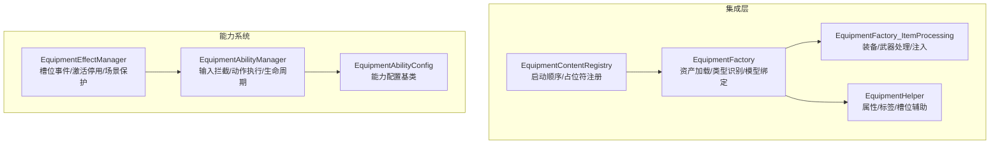
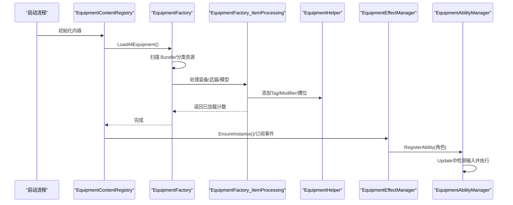
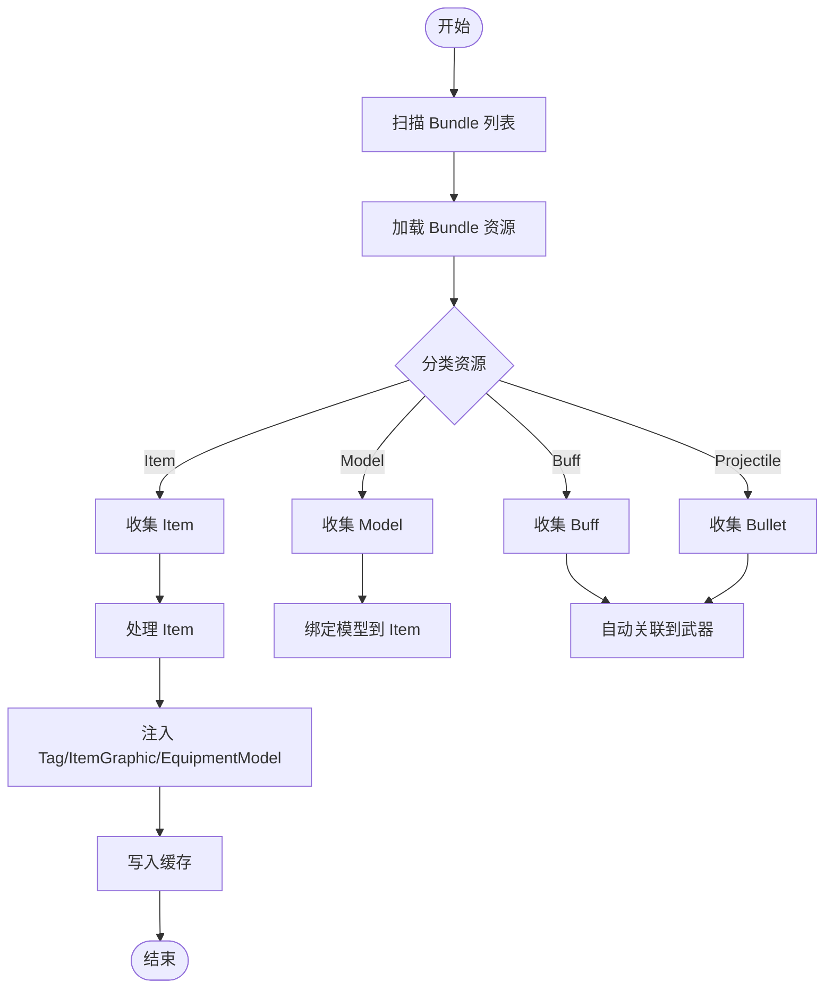
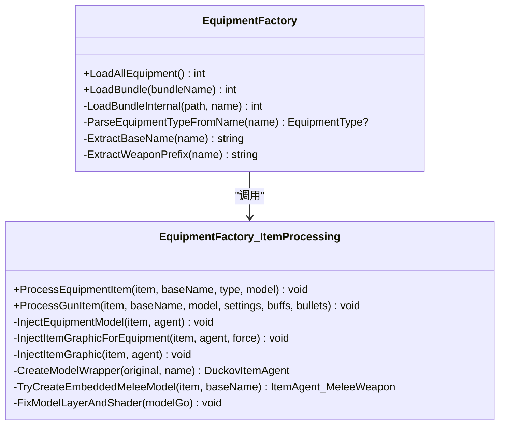
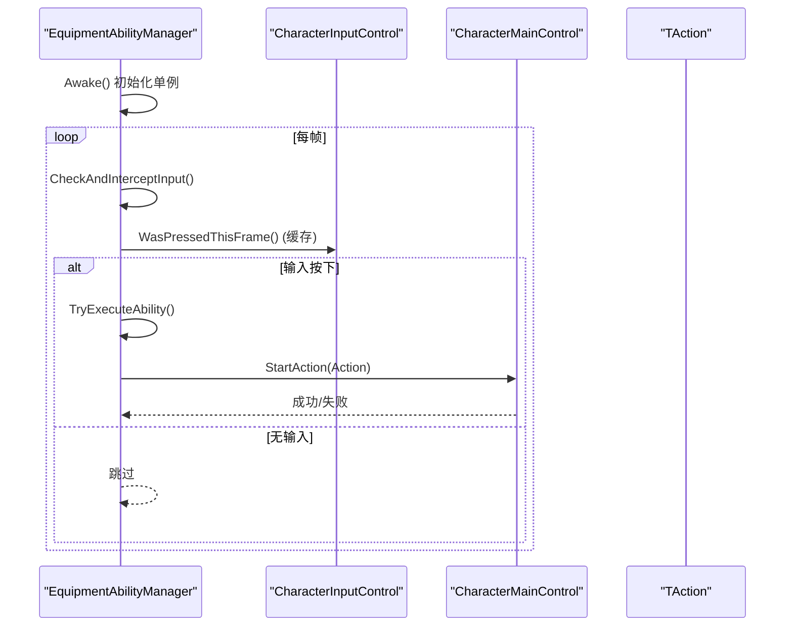
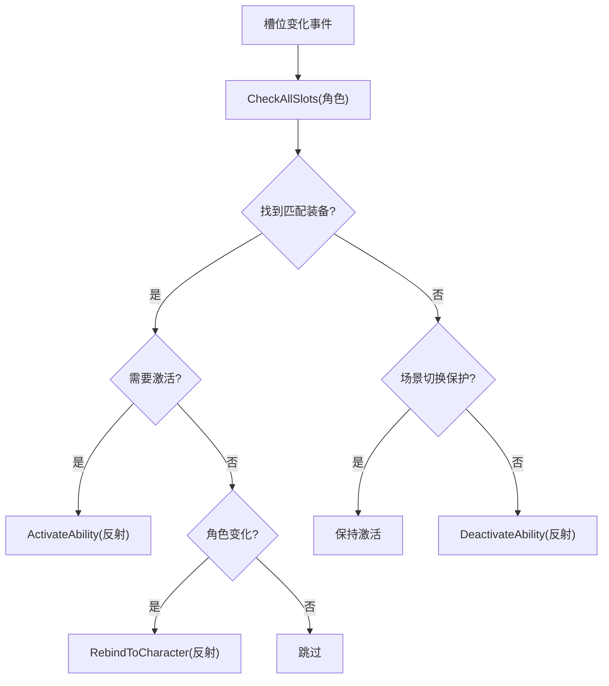
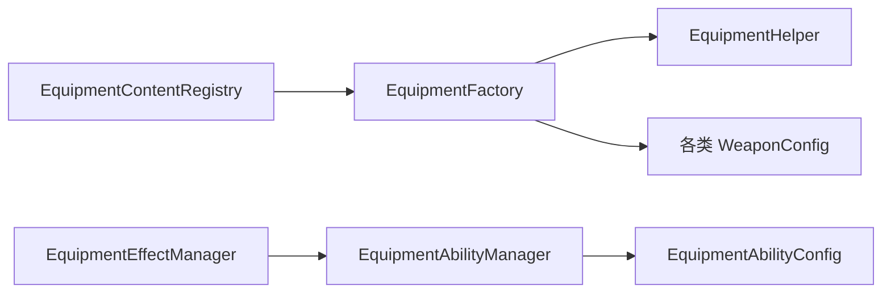

# 装备框架与工厂系统

<cite>
**本文引用的文件**
- [EquipmentFactory.cs](file://Integration/EquipmentFactory.cs)
- [EquipmentFactory_ItemProcessing.cs](file://Integration/EquipmentFactory_ItemProcessing.cs)
- [EquipmentFactoryStaticCacheReset.cs](file://Integration/EquipmentFactoryStaticCacheReset.cs)
- [EquipmentHelper.cs](file://Integration/EquipmentHelper.cs)
- [EquipmentContentRegistry.cs](file://Integration/EquipmentContentRegistry.cs)
- [EquipmentAbilityManager.cs](file://Common/Equipment/EquipmentAbilityManager.cs)
- [EquipmentEffectManager.cs](file://Common/Equipment/EquipmentEffectManager.cs)
- [EquipmentAbilityConfig.cs](file://Common/Equipment/EquipmentAbilityConfig.cs)
</cite>

## 目录
1. [简介](#简介)
2. [项目结构](#项目结构)
3. [核心组件](#核心组件)
4. [架构总览](#架构总览)
5. [详细组件分析](#详细组件分析)
6. [依赖关系分析](#依赖关系分析)
7. [性能考量](#性能考量)
8. [故障排查指南](#故障排查指南)
9. [结论](#结论)
10. [附录：新装备开发完整指南](#附录新装备开发完整指南)

## 简介
本文件系统性地梳理并文档化 BossRush Mod 的“装备框架与工厂系统”。重点包括：
- EquipmentFactory 的核心架构：AssetBundle 自动加载、物品类型识别算法、模型绑定与注入、缓存管理。
- 装备能力系统（EquipmentAbilityManager）的工作原理：能力注册、输入拦截与触发、效果计算与生命周期管理。
- 预制体命名规范、Prefab 配置要求、组件注入流程。
- 新装备开发指南：资源准备、配置步骤、调试方法。
- 性能优化建议与常见问题解决方案。

## 项目结构
围绕装备系统的代码主要分布在 Integration 与 Common/Equipment 两个区域：
- Integration：负责 AssetBundle 加载、物品处理、辅助工具、内容注册与启动顺序控制。
- Common/Equipment：提供能力系统与效果系统的通用基类，用于各具体装备能力的扩展。

图表来源
- [EquipmentFactory.cs:114-753](file://Integration/EquipmentFactory.cs#L114-L753)
- [EquipmentFactory_ItemProcessing.cs:116-800](file://Integration/EquipmentFactory_ItemProcessing.cs#L116-L800)
- [EquipmentHelper.cs:25-292](file://Integration/EquipmentHelper.cs#L25-L292)
- [EquipmentContentRegistry.cs:8-91](file://Integration/EquipmentContentRegistry.cs#L8-L91)
- [EquipmentAbilityManager.cs:18-577](file://Common/Equipment/EquipmentAbilityManager.cs#L18-L577)
- [EquipmentEffectManager.cs:22-438](file://Common/Equipment/EquipmentEffectManager.cs#L22-L438)
- [EquipmentAbilityConfig.cs:16-102](file://Common/Equipment/EquipmentAbilityConfig.cs#L16-L102)

章节来源
- [EquipmentFactory.cs:114-753](file://Integration/EquipmentFactory.cs#L114-L753)
- [EquipmentFactory_ItemProcessing.cs:116-800](file://Integration/EquipmentFactory_ItemProcessing.cs#L116-L800)
- [EquipmentHelper.cs:25-292](file://Integration/EquipmentHelper.cs#L25-L292)
- [EquipmentContentRegistry.cs:8-91](file://Integration/EquipmentContentRegistry.cs#L8-L91)
- [EquipmentAbilityManager.cs:18-577](file://Common/Equipment/EquipmentAbilityManager.cs#L18-L577)
- [EquipmentEffectManager.cs:22-438](file://Common/Equipment/EquipmentEffectManager.cs#L22-L438)
- [EquipmentAbilityConfig.cs:16-102](file://Common/Equipment/EquipmentAbilityConfig.cs#L16-L102)

## 核心组件
- EquipmentFactory：从 AssetBundle 自动扫描并加载装备/武器/Buff/子弹；按名称解析类型；将模型与 Item 关联；注入 ItemGraphic/EquipmentModel；维护全局缓存。
- EquipmentFactory_ItemProcessing：实现装备与武器的具体处理逻辑，包括 Tag 添加、Buff/Bullet 自动关联、ItemGraphic 注入、近战内嵌模型创建等。
- EquipmentHelper：为 Item 添加 Modifier、Constant、Tag，以及宝石槽位配置。
- EquipmentContentRegistry：在启动阶段调用 EquipmentFactory.LoadAllEquipment，并注册占位符与后续能力系统初始化。
- EquipmentAbilityManager：抽象泛型能力管理器，负责输入拦截、动作创建与执行、生命周期钩子、场景切换重绑。
- EquipmentEffectManager：监听角色槽位变化事件，自动激活/停用能力，支持场景切换保护与反射式 Rebind。
- EquipmentAbilityConfig：定义能力的基础信息、冷却、体力消耗、音效键与日志前缀等。

章节来源
- [EquipmentFactory.cs:114-753](file://Integration/EquipmentFactory.cs#L114-L753)
- [EquipmentFactory_ItemProcessing.cs:116-800](file://Integration/EquipmentFactory_ItemProcessing.cs#L116-L800)
- [EquipmentHelper.cs:25-292](file://Integration/EquipmentHelper.cs#L25-L292)
- [EquipmentContentRegistry.cs:8-91](file://Integration/EquipmentContentRegistry.cs#L8-L91)
- [EquipmentAbilityManager.cs:18-577](file://Common/Equipment/EquipmentAbilityManager.cs#L18-L577)
- [EquipmentEffectManager.cs:22-438](file://Common/Equipment/EquipmentEffectManager.cs#L22-L438)
- [EquipmentAbilityConfig.cs:16-102](file://Common/Equipment/EquipmentAbilityConfig.cs#L16-L102)

## 架构总览
装备系统由“资源加载与装配”和“运行时能力管理”两条主线组成：
- 资源加载与装配：EquipmentFactory 在启动时扫描 Assets/Equipment 下的所有 AssetBundle，分类收集 Item、Model、Buff、Projectile，并通过名称匹配规则完成自动关联与注入。
- 运行时能力管理：EquipmentEffectManager 监听槽位变化，根据配置判断是否激活对应能力；EquipmentAbilityManager 负责输入拦截与动作执行；EquipmentAbilityConfig 提供统一配置。

图表来源
- [EquipmentContentRegistry.cs:8-91](file://Integration/EquipmentContentRegistry.cs#L8-L91)
- [EquipmentFactory.cs:176-249](file://Integration/EquipmentFactory.cs#L176-L249)
- [EquipmentFactory_ItemProcessing.cs:121-222](file://Integration/EquipmentFactory_ItemProcessing.cs#L121-L222)
- [EquipmentHelper.cs:35-178](file://Integration/EquipmentHelper.cs#L35-L178)
- [EquipmentEffectManager.cs:107-124](file://Common/Equipment/EquipmentEffectManager.cs#L107-L124)
- [EquipmentAbilityManager.cs:118-140](file://Common/Equipment/EquipmentAbilityManager.cs#L118-L140)

## 详细组件分析

### EquipmentFactory：资产加载与类型识别
- 自动加载：LoadAllEquipment 扫描 mod 目录下的 Assets/Equipment，跳过非 bundle 文件，逐个 LoadBundle。
- 类型识别：ParseEquipmentTypeFromName 通过名称关键字识别 Gun/MeleeWeapon/Totem/头盔/护甲/背包/面罩/耳机等。
- 基础名提取：ExtractBaseName 去除 _Item/_Model/_Bullet/_Buff 等后缀；ExtractWeaponPrefix 用于武器前缀匹配 Buff/Bullet。
- 资源分类：第一遍遍历收集 Item/Model/Buff/Projectile，第二遍处理每个 Item 并完成关联与注入。
- 缓存管理：loadedModels、loadedModelsByBaseName、loadedBuffs、loadedBullets、loadedGuns、loadedBundles、customMeleeWeaponTypeIds。
- 静态缓存重置：ResetStaticCaches 清空所有缓存，便于热重载或测试。

图表来源
- [EquipmentFactory.cs:176-249](file://Integration/EquipmentFactory.cs#L176-L249)
- [EquipmentFactory.cs:399-494](file://Integration/EquipmentFactory.cs#L399-L494)
- [EquipmentFactory.cs:498-749](file://Integration/EquipmentFactory.cs#L498-L749)
- [EquipmentFactoryStaticCacheReset.cs:5-16](file://Integration/EquipmentFactoryStaticCacheReset.cs#L5-L16)

章节来源
- [EquipmentFactory.cs:114-753](file://Integration/EquipmentFactory.cs#L114-L753)
- [EquipmentFactoryStaticCacheReset.cs:5-16](file://Integration/EquipmentFactoryStaticCacheReset.cs#L5-L16)

### EquipmentFactory_ItemProcessing：装备与武器处理
- 装备处理：ProcessEquipmentItem 添加对应 Tag（如 Helmat/Armor/Backpack/FaceMask/Headset），图腾额外添加 DontDropOnDeadInSlot；注入 EquipmentModel 与 ItemGraphic。
- 武器处理：ProcessGunItem 添加 Gun Tag，获取 ItemSetting_Gun；若未配置则自动关联同名 Buff/Bullet；注入 ItemGraphicInfo_Gun，设置动画类型为 gun，整理 Sockets 节点（Muzzle/Muzzle2/Tec）。
- 模型包装：CreateModelWrapper 为缺少 DuckovItemAgent 的模型创建运行时副本并添加组件，避免直接修改只读模板。
- 近战内嵌模型：TryCreateEmbeddedMeleeModel 为近战物品创建内嵌 Handheld 源，确保渲染与层级正确。
- 图层与着色器：FixModelLayerAndShader 递归设置 Character Layer 并替换不兼容 Shader。

图表来源
- [EquipmentFactory.cs:498-749](file://Integration/EquipmentFactory.cs#L498-L749)
- [EquipmentFactory_ItemProcessing.cs:121-800](file://Integration/EquipmentFactory_ItemProcessing.cs#L121-L800)

章节来源
- [EquipmentFactory_ItemProcessing.cs:121-800](file://Integration/EquipmentFactory_ItemProcessing.cs#L121-L800)

### EquipmentHelper：属性、标签与槽位
- AddModifierToItem：为 Item 添加 ModifierDescription，支持 Add/PercentageAdd，可显示于 UI。
- SetItemConstant：设置常量值（如 MaxDurability）。
- AddTagToItem：动态查找并添加 Tag（如 Weapon/Gun/Repairable）。
- ConfigureGemSlots：为 Item 添加 Gem 槽位，需存在 Gem Tag。

章节来源
- [EquipmentHelper.cs:35-178](file://Integration/EquipmentHelper.cs#L35-L178)
- [EquipmentHelper.cs:198-292](file://Integration/EquipmentHelper.cs#L198-L292)

### EquipmentContentRegistry：启动顺序与占位符
- LoadEquipmentContent：先调用 EquipmentFactory.LoadAllEquipment，再注册新武器与套装占位符，随后初始化龙铳运行时与预热弹种缓存，最后对特定武器进行模型绑定与配置。
- InitializeEarly/Late/Cleanup：分阶段初始化与清理各装备能力系统，确保生命周期安全。

章节来源
- [EquipmentContentRegistry.cs:8-91](file://Integration/EquipmentContentRegistry.cs#L8-L91)

### EquipmentAbilityManager：能力管理与输入拦截
- 单例与生命周期：Awake 保证唯一实例，Update 每帧检测输入并尝试执行能力。
- 输入拦截：TryCacheInputAction 通过反射缓存 CharacterInputControl 的 InputAction 字段，IsInputPressed 优先使用缓存，否则回退到键盘检测。
- 能力注册：RegisterAbility 设置目标角色、创建动作对象与 TAction 组件，启用能力；UnregisterAbility 清理状态。
- 场景切换：OnSceneChanged 与 RebindToCharacter 重建动作并重新绑定到新角色。
- 执行流程：TryExecuteAbility 检查就绪条件后调用 targetCharacter.StartAction(abilityAction)。

图表来源
- [EquipmentAbilityManager.cs:118-140](file://Common/Equipment/EquipmentAbilityManager.cs#L118-L140)
- [EquipmentAbilityManager.cs:197-331](file://Common/Equipment/EquipmentAbilityManager.cs#L197-L331)
- [EquipmentAbilityManager.cs:339-428](file://Common/Equipment/EquipmentAbilityManager.cs#L339-L428)

章节来源
- [EquipmentAbilityManager.cs:18-577](file://Common/Equipment/EquipmentAbilityManager.cs#L18-L577)

### EquipmentEffectManager：槽位事件与能力激活
- 事件订阅：OnEnable 订阅 OnMainCharacterSlotContentChangedEvent 与场景加载/卸载事件。
- 槽位检查：CheckAllSlots 遍历角色槽位，查找匹配装备；根据是否找到装备决定 Activate/Deactivate 或 Rebind。
- 场景保护：场景卸载时设置 sceneTransitionProtection，防止误停用；加载完成后清除保护并延迟检查。
- 反射调用：通过反射调用能力管理器的 RegisterAbility/RebindToCharacter/UnregisterAbility，解耦具体实现。

图表来源
- [EquipmentEffectManager.cs:107-124](file://Common/Equipment/EquipmentEffectManager.cs#L107-L124)
- [EquipmentEffectManager.cs:205-304](file://Common/Equipment/EquipmentEffectManager.cs#L205-L304)
- [EquipmentEffectManager.cs:311-364](file://Common/Equipment/EquipmentEffectManager.cs#L311-L364)

章节来源
- [EquipmentEffectManager.cs:22-438](file://Common/Equipment/EquipmentEffectManager.cs#L22-L438)

### EquipmentAbilityConfig：能力配置基类
- 定义物品基础信息（TypeID、名称、描述、品质、标签、图标）。
- 能力参数（冷却时间、起始体力消耗、持续体力消耗）。
- 音效键（开始/循环/结束）。
- 日志前缀，便于追踪。

章节来源
- [EquipmentAbilityConfig.cs:16-102](file://Common/Equipment/EquipmentAbilityConfig.cs#L16-L102)

## 依赖关系分析
- EquipmentFactory 依赖 EquipmentHelper 进行属性/标签/槽位操作，依赖各类 WeaponConfig（如 DragonKingBossGunConfig、FrostThunderSetConfig 等）完成特定装备的配置。
- EquipmentEffectManager 依赖 EquipmentAbilityManager 的具体实现，通过反射调用其生命周期方法。
- EquipmentContentRegistry 协调启动顺序，确保资源加载后再注册占位符与初始化能力系统。

图表来源
- [EquipmentContentRegistry.cs:8-91](file://Integration/EquipmentContentRegistry.cs#L8-L91)
- [EquipmentFactory.cs:498-749](file://Integration/EquipmentFactory.cs#L498-L749)
- [EquipmentEffectManager.cs:205-364](file://Common/Equipment/EquipmentEffectManager.cs#L205-L364)
- [EquipmentAbilityManager.cs:339-428](file://Common/Equipment/EquipmentAbilityManager.cs#L339-L428)

章节来源
- [EquipmentContentRegistry.cs:8-91](file://Integration/EquipmentContentRegistry.cs#L8-L91)
- [EquipmentFactory.cs:498-749](file://Integration/EquipmentFactory.cs#L498-L749)
- [EquipmentEffectManager.cs:205-364](file://Common/Equipment/EquipmentEffectManager.cs#L205-L364)
- [EquipmentAbilityManager.cs:339-428](file://Common/Equipment/EquipmentAbilityManager.cs#L339-L428)

## 性能考量
- 缓存复用：EquipmentFactory 使用多个字典缓存已加载的模型、Buff、子弹、武器与 bundle，避免重复加载与查找。
- 反射优化：EquipmentAbilityManager 首次缓存 InputAction 与方法引用，减少每帧反射开销。
- 场景切换保护：EquipmentEffectManager 在场景切换期间避免误停用能力，减少不必要的状态切换。
- 资源校验：注入 ItemGraphic 时检查已有组件有效性，避免无效覆盖导致的渲染问题。
- 建议：
  - 合理拆分 AssetBundle，避免单个 bundle 过大导致加载耗时。
  - 控制 Buff/Bullet 数量与特效复杂度，降低运行时开销。
  - 使用 EquipmentHelper 的批量配置接口，减少重复反射调用。

[本节为通用性能讨论，无需特定文件来源]

## 故障排查指南
- 未找到 AssetBundle：检查路径是否正确，bundle 名称是否包含扩展名（应无扩展名）。
- 类型识别失败：确认 Prefab 名称符合 {名称}_{类型}_{后缀} 规范，关键字匹配是否生效。
- 模型未显示：检查是否注入了 EquipmentModel 与 ItemGraphic，图层与着色器是否修复。
- 武器无子弹/Buff：确认同名资源是否存在，前缀匹配是否正确。
- 能力未触发：检查 InputAction 缓存是否成功，角色是否已注册能力，场景切换后是否重新绑定。
- 槽位事件未生效：确认已订阅事件，角色 Item 组件是否可用，匹配逻辑是否正确。

章节来源
- [EquipmentFactory.cs:176-249](file://Integration/EquipmentFactory.cs#L176-L249)
- [EquipmentFactory_ItemProcessing.cs:313-401](file://Integration/EquipmentFactory_ItemProcessing.cs#L313-L401)
- [EquipmentAbilityManager.cs:197-331](file://Common/Equipment/EquipmentAbilityManager.cs#L197-L331)
- [EquipmentEffectManager.cs:205-304](file://Common/Equipment/EquipmentEffectManager.cs#L205-L304)

## 结论
本装备框架通过标准化的资源加载与装配流程，结合灵活的能力管理系统，实现了可扩展的自定义装备体系。EquipmentFactory 提供了强大的自动化工具链，而 EquipmentAbilityManager 与 EquipmentEffectManager 则确保了运行时行为的稳定与可维护性。遵循命名规范与配置要求，开发者可以快速集成新装备并享受完善的调试与性能优化支持。

[本节为总结，无需特定文件来源]

## 附录：新装备开发完整指南

### 资源准备
- 在 Assets/Equipment 目录下准备 AssetBundle（无扩展名），包含以下资源：
  - 装备 Item Prefab：必须包含 Item 组件与唯一 TypeID（建议 600000+）。
  - 装备 Model Prefab：可选，若无则系统会尝试创建运行时包装器。
  - 武器相关：ItemSetting_Gun、Bullet、Buff（可选，系统会自动关联同名资源）。
  - 图腾：Item 组件、TypeID（建议 600100+）、displayName、quality。
  - Buff：Buff 组件、id、maxLayers、持续时间、effects。
  - Bullet：Projectile 组件、radius、hitFx。

### 命名规范
- 格式：{名称}_{类型}_{后缀}
- 示例：
  - 装备：MyGear_Helmet_Item、MyGear_Armor_Model
  - 武器：Dragon_Gun_Item、Dragon_Bullet、Dragon_Buff
  - 图腾：FlightTotem_Lv1_Item、FlightTotem_Lv1_Model

### 配置步骤
- 在 Unity 中为 Item 配置必要组件与属性（typeID、displayName、quality 等）。
- 若为武器，确保 ItemSetting_Gun 的基础属性（triggerMode、reloadMode 等）正确。
- 运行 EquipmentFactory.LoadAllEquipment() 自动加载并处理资源。
- 如需近战武器，调用 RegisterMeleeWeapon(typeId) 防止被误识别为枪械。

### 调试方法
- 查看日志输出，确认资源分类与注入结果。
- 使用 GetLoadedBuff/GetLoadedBullet/GetLoadedGun 验证资源是否加载成功。
- 检查 ItemGraphic 与 EquipmentModel 是否注入有效。
- 对于能力系统，检查 InputAction 缓存与角色绑定状态。

### 性能优化建议
- 拆分 AssetBundle，避免单次加载过多资源。
- 控制特效与粒子数量，降低运行时开销。
- 使用缓存机制，避免重复查找与反射调用。

### 常见问题解决方案
- 模型不显示：检查图层与着色器修复逻辑，确保 GroundPoint 与 Sockets 节点正确。
- 武器无子弹/Buff：确认同名资源存在且前缀匹配正确。
- 能力未触发：检查输入拦截缓存与角色绑定，必要时调用 RebindToCharacter。
- 槽位事件失效：确认事件订阅与角色 Item 组件可用性。

章节来源
- [EquipmentFactory.cs:17-98](file://Integration/EquipmentFactory.cs#L17-L98)
- [EquipmentFactory.cs:176-249](file://Integration/EquipmentFactory.cs#L176-L249)
- [EquipmentFactory_ItemProcessing.cs:121-222](file://Integration/EquipmentFactory_ItemProcessing.cs#L121-L222)
- [EquipmentAbilityManager.cs:197-331](file://Common/Equipment/EquipmentAbilityManager.cs#L197-L331)
- [EquipmentEffectManager.cs:205-304](file://Common/Equipment/EquipmentEffectManager.cs#L205-L304)