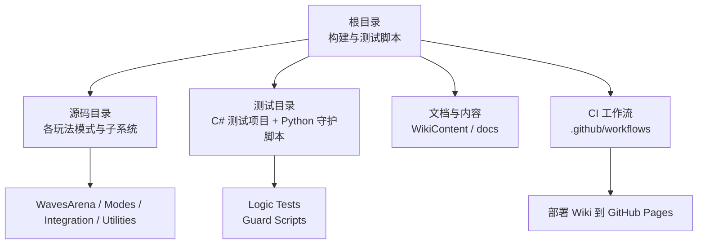
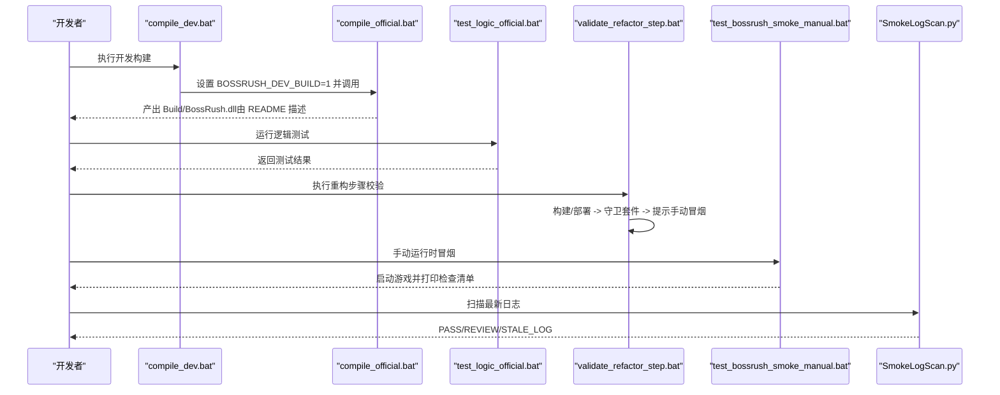
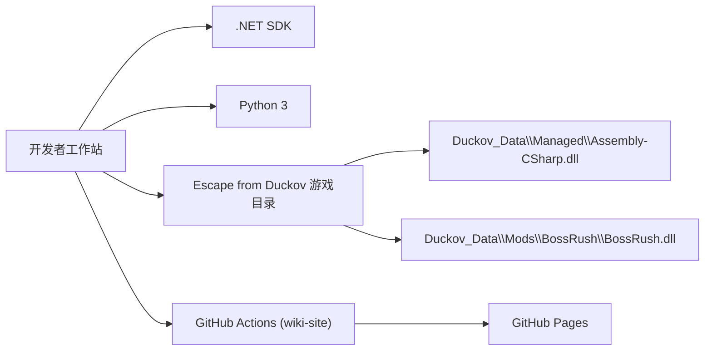
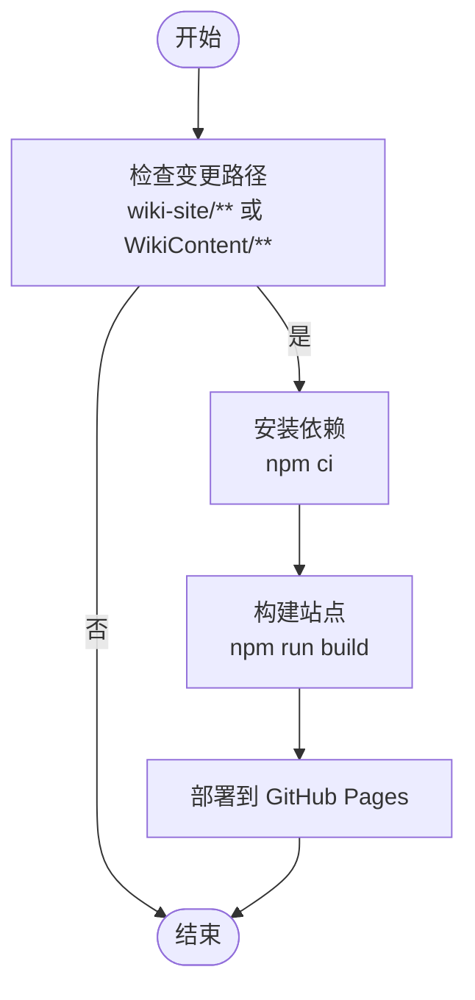

# 构建系统

## 2026-09-20 生产图标、异步预载与 F3 采样

- `tools/production_icon_manifest.json` 登记原 PNG 地址；`python tools/optimize_unity_resources.py --stage IconsBuild --output Build/resource-production-20260920` 只重打两只旧物品包和 production_icons。随后使用同目录 `--stage Recompress`，构建回执未完整不得重压。该流程不执行 LOD、远景替换或旧网格优化阶段。
- `ProductionIconBuilder.cs.txt` 在 Unity 中检查 Sprite 类型、实际 BC7/尺寸、关闭 Read/Write/Crunch；历史 Item Prefab 恢复需要本地作者 MonoScript，构建后必须验证 Item 组件和非空 Sprite，不能只检查 GameObject 数量。
- schema 2 发布清单增加 production_icons。`Deploy-ResourceBundles.ps1` 检查整个目标的未知 bundle，包含伪装扩展名与 Assets 外文件，写入前失败；工作区保留的历史资源不应用游戏目标清单去批量删除。新 PNG 需登记生产图标清单，不能依赖正式包存在时的 raw fallback。
- 工厂按原注册顺序异步预载 Bundle/Prefab，SkyIslandRaidLease 分帧驱动并释放原生迟到结果；同步公开 GetPrefab 兼容入口保留且记录成本。加载观测与缓存位于 ResourceBundleLoader / ProductionIconCache，由既有 runtime owner 清理。
- Dev/F3 原只读入口产出 RESOURCE_BASE_10S / RESOURCE_SKY_10S，`BossRushTestReports/<runId>/` 内 manifest.json、summary.md、resource-performance.json。GPU 无数据写 unavailable；完整采样 PASS 不是流畅度合格。纯统计判据在执行回归运行；真机数据必须 owner 实际跑出。
- 正式构建必须移除 `BOSSRUSH_DEV_BUILD` 环境变量：脚本按“是否定义”门控，设置成 0 仍是 Dev。`check_dll_identifiers.py` 同时检查自动验收与资源采样类型，Dev present 和正式 absent 两次都要实跑。

详细结果：`docs/制作教程/20260920_资源生产化续作交付.md`。与同日首轮网格/贴图优化分开记录，最终 SHA-256 以本轮机器报告为准。

## 2026-09-20 资源构建与发布补充

以下是当前资源交付事实；正文中旧的脚本片段属于快照，执行入口以 `compile_official.bat` 和 `tools/` 为准。

- [resource_release_manifest.json](file://tools/resource_release_manifest.json) 是正式资源清单。涵盖运行时使用的 bundle，排除历史 `sky_island_world`；新增发布包同步清单，不能只放进 `Assets/`。
- [Deploy-ResourceBundles.ps1](file://tools/Deploy-ResourceBundles.ps1) 在正式编译的部署阶段执行：先检查全部源包，再备份并复制有差异的目标，最后逐包比对 SHA-256。缺包、复制失败或哈希不一致使构建返回失败；回执为 `Build/resource-release-verification.json`，备份位于 `Build/resource-release-backups/`。
- 作者工程和 Editor 通过 [unity_project_path.py](file://tools/unity_project_path.py) 查找，可用 `BOSSRUSH_UNITY_PROJECT` / `BOSSRUSH_UNITY_EDITOR` 指定；引擎版本匹配 `ProjectVersion.txt`。
- [optimize_unity_resources.py](file://tools/optimize_unity_resources.py) 的 `Inspect` / `Build` / `Recompress` 阶段使用显式 `--output` 暂存目录。本轮为 `Build/resource-optimization-20260920/`；`rebuilt/` 保存目标重打包，`release/Assets/` 保存待交付包，构建回执将 profile 与重打包的哈希绑定，失败后不能拿半成品继续重压。
- 构建器默认使用 `ChunkBasedCompression`；已有包通过 Unity LZ4 重压。发布前运行 [verify_unity_resource_release.py](file://tools/verify_unity_resource_release.py)，检查实际压缩块、无 Crunch、纹理可读性、能量盾面数、Mode G 规格与天空岛导航。用 `--work` 比较重压前后解压流；磁盘变小不等于游戏性能已经通过。
- **保留头盔校验**：资源优化不改装备挂载/子节点校准，不绕过 `HelmetFitUtility` / `HelmetFitBundleBuilder`。天空岛继续校验 Deferred GBuffer，并记录作者导出、仓库和游戏目标三方哈希。
- Mode G 徽记固定为 256×256（确认页 84×84），横幅为 1024×576，包体上限仍为 256 KiB；专用策略排在通用徽记规则之前。专用构建器回读尺寸，避免通用策略把徽记重新放大到 512。

## 2026-09-20 基地建筑模型生产包

- `tools/building_model_manifest.json` 锁定 `output/building_concepts/` 四个 GLB 的 SHA-256、建筑 ID、prefab 名和尺寸盒：`439d…` 报箱、`61ee…` 公告栏、`b592…` 展示柜、`d6da…` 遗种巢。源 GLB 保留，不生成 LOD 或远景替换。
- `python tools/import_building_models.py --output Build/buildings-20260920 --build` 使用作者工程与 Unity 2022.3.62f3，生成 `Assets/BaseBuildings/` 的网格、贴图、材质和 prefab，分别重打四个 `Assets/buildings/*` 包；构建器回载检查命名 prefab、地面原点、单 Renderer、无 Collider/MonoBehaviour/LODGroup、BC7/不可读贴图和 `UniversalGBuffer`。
- 公告栏和展示柜的运行时入口先由 `FactoryResourceLoading.RunSpecial` 按场景预载，再由 `BuildingModelHelper.TryInstantiateBundle` 转交 bundle 租约；缺包、坏包、实例化异常和 owner 清理保留程序化 fallback。建筑 ID、交互组件、存档身份与建造费用未改变。
- 交付包进入 `resource_release_manifest.json`，正式编译的 `Deploy-ResourceBundles.ps1` 统一部署并核对 SHA-256。具体四方哈希、包体、UnityPy 回读和回退备份见 `Build/buildings-20260920/final-hashes.json` 与同目录的 `unitypy-validation.json`。

```powershell
python tools/optimize_unity_resources.py --stage Inspect --output Build/resource-optimization-review
python tools/verify_unity_resource_release.py --root Build/resource-optimization-20260920/release --work Build/resource-optimization-20260920 --report Build/resource-optimization-20260920/release-validation.json
& "$PWD/tools/Deploy-ResourceBundles.ps1" -SourceRoot "$PWD" -TargetRoot "<实际游戏 Mod 目录>" -VerifyOnly
```

具体方案和本轮数字见 `docs/设计提案/20260920_Unity资源全面优化方案.md`、`docs/制作教程/20260920_Unity资源优化交付.md`。L1/L2 之后仍由 owner 做 L3 画面和性能采样。


<cite>
**本文引用的文件**
- [compile_dev.bat](file://compile_dev.bat)
- [test_bossrush_smoke_manual.bat](file://test_bossrush_smoke_manual.bat)
- [test_logic_official.bat](file://test_logic_official.bat)
- [validate_refactor_step.bat](file://validate_refactor_step.bat)
- [README.md](file://README.md)
- [deploy.yml](file://.github/workflows/deploy.yml)
- [tests/README.md](file://tests/README.md)
- [tests/LegacyBossLootProbabilityTests.csproj](file://tests/LegacyBossLootProbabilityTests.csproj)
- [tests/SmokeLogScan.py](file://tests/SmokeLogScan.py)
</cite>

## 目录
1. [简介](#简介)
2. [项目结构](#项目结构)
3. [核心组件](#核心组件)
4. [架构总览](#架构总览)
5. [详细组件分析](#详细组件分析)
6. [依赖分析](#依赖分析)
7. [性能考虑](#性能考虑)
8. [故障排除指南](#故障排除指南)
9. [结论](#结论)
10. [附录](#附录)

## 简介
本构建系统围绕一个非标准 .NET 工程组织：源码通过 Windows 批处理脚本调用已安装的 .NET SDK 的 Roslyn 编译器进行编译，产物为 Unity 可加载的 DLL。仓库提供开发构建、逻辑测试、运行时冒烟验证与重构步骤校验等工具链，并包含面向 Wiki 站点发布的 GitHub Actions 工作流。本文档聚焦以下目标：
- 说明编译脚本（compile_dev.bat）的使用方法、依赖管理与版本控制流程
- 详细介绍测试脚本（test_bossrush_smoke_manual.bat、test_logic_official.bat、validate_refactor_step.bat）的功能和执行方式
- 解释构建环境要求、第三方依赖安装、Unity 项目配置
- 提供常见构建问题的故障排除指南和性能优化建议
- 给出自动化构建流程和持续集成配置示例

## 项目结构
仓库采用“按功能域分目录”的组织方式，根目录集中放置构建与测试脚本，源码按模块划分（如 ModeD、ModeE、ModeF、Integration、WavesArena 等），测试代码位于 tests/ 目录，包含 C# 单元测试项目与大量 Python 守护脚本。CI 相关配置位于 .github/workflows/。



图表来源
- [README.md:150-168](file://README.md#L150-L168)
- [tests/README.md:1-115](file://tests/README.md#L1-L115)

章节来源
- [README.md:150-168](file://README.md#L150-L168)
- [tests/README.md:1-115](file://tests/README.md#L1-L115)

## 核心组件
- 开发构建入口：compile_dev.bat
  - 设置开发构建标志后调用 compile_official.bat，完成编译与部署准备
- 官方构建与部署：compile_official.bat（由 README 描述，被 compile_dev.bat 调用）
- 逻辑测试：test_logic_official.bat
  - 清理输出目录，依次运行多个 C# 测试项目（Release 模式）
- 手动运行时冒烟：test_bossrush_smoke_manual.bat
  - 检测游戏路径与 DLL，打印检查清单，可选择启动游戏并通过 Steam URL 打开
- 重构步骤校验：validate_refactor_step.bat
  - 三步流水线：构建部署 -> 守卫套件（Python 守护）-> 提示手动运行时冒烟
- 日志扫描辅助：tests/SmokeLogScan.py
  - 扫描最新游戏日志，识别 BossRush 相关错误块，支持 STALE_LOG/PASS/REVIEW 状态码

章节来源
- [compile_dev.bat:1-6](file://compile_dev.bat#L1-L6)
- [test_logic_official.bat:1-86](file://test_logic_official.bat#L1-L86)
- [test_bossrush_smoke_manual.bat:1-153](file://test_bossrush_smoke_manual.bat#L1-L153)
- [validate_refactor_step.bat:1-48](file://validate_refactor_step.bat#L1-L48)
- [tests/SmokeLogScan.py:1-142](file://tests/SmokeLogScan.py#L1-L142)
- [README.md:150-168](file://README.md#L150-L168)

## 架构总览
构建与测试的整体流程如下：开发者在 Windows 环境下执行 compile_dev.bat 触发编译；随后通过 test_logic_official.bat 运行逻辑测试；再使用 validate_refactor_step.bat 串联构建、部署与守卫套件；最后通过 test_bossrush_smoke_manual.bat 进行手动运行时冒烟，并用 SmokeLogScan.py 扫描日志。



图表来源
- [compile_dev.bat:1-6](file://compile_dev.bat#L1-L6)
- [test_logic_official.bat:1-86](file://test_logic_official.bat#L1-L86)
- [validate_refactor_step.bat:1-48](file://validate_refactor_step.bat#L1-L48)
- [test_bossrush_smoke_manual.bat:1-153](file://test_bossrush_smoke_manual.bat#L1-L153)
- [tests/SmokeLogScan.py:1-142](file://tests/SmokeLogScan.py#L1-L142)
- [README.md:150-168](file://README.md#L150-L168)

## 详细组件分析

### 编译脚本：compile_dev.bat
- 作用：设置开发构建标志并调用官方构建脚本，便于本地快速迭代
- 行为要点：
  - 切换编码为 UTF-8，定位到脚本所在目录
  - 设置环境变量以启用开发构建模式
  - 调用 compile_official.bat 完成编译与部署准备
- 使用方式：在 Windows 终端中直接执行该批处理文件

章节来源
- [compile_dev.bat:1-6](file://compile_dev.bat#L1-L6)
- [README.md:170-192](file://README.md#L170-L192)

### 逻辑测试：test_logic_official.bat
- 作用：清理测试输出并顺序运行多个 C# 测试项目（Release 模式）
- 行为要点：
  - 检查 dotnet 是否可用
  - 清理 tests/bin 与 tests/obj
  - 依次运行 LegacyBossLootProbabilityTests、PhantomWitchPerformancePolicyTests、SimpleJsonHelperTests、AffinityJsonSerializerTests、F3DebugCheatMathTests、F3DebugCheatLifecycleTests、VictoryRewardShadowMathTests、AwenLootSweepMathTests
  - 任一失败立即退出并报告
- 依赖：.NET SDK（dotnet 命令可用）

章节来源
- [test_logic_official.bat:1-86](file://test_logic_official.bat#L1-L86)
- [tests/LegacyBossLootProbabilityTests.csproj:1-16](file://tests/LegacyBossLootProbabilityTests.csproj#L1-L16)

### 手动运行时冒烟：test_bossrush_smoke_manual.bat
- 作用：提供游戏内冒烟测试的检查清单，并可启动游戏
- 行为要点：
  - 自动探测或读取 GAME_PATH，校验游戏可执行文件与 Mod DLL
  - 生成或展示检查清单文件，列出需验证的关键路径（地图选择、BossRush 竞技场、Mode D/E/F、Zombie Mode、商店 UI、近战特效等）
  - 可选通过 Steam URL 启动游戏
  - 提示使用 SmokeLogScan.py 扫描最新日志
- 依赖：Windows 环境、Steam 客户端、已部署的 BossRush.dll

章节来源
- [test_bossrush_smoke_manual.bat:1-153](file://test_bossrush_smoke_manual.bat#L1-L153)
- [tests/SmokeLogScan.py:1-142](file://tests/SmokeLogScan.py#L1-L142)

### 重构步骤校验：validate_refactor_step.bat
- 作用：将构建、部署、守卫套件与手动冒烟提示串联成一步式流水线
- 行为要点：
  - 第一步：调用 test_bossrush_official.bat（由 README 描述）完成构建与部署
  - 第二步：运行 tests/*Guard.py 与 tests/*PropertyTest.py，确保静态不变式不被破坏
  - 第三步：提示执行手动运行时冒烟，并在完成后用 SmokeLogScan.py 扫描日志
- 依赖：Python 3（py -3）、已部署的 BossRush.dll

章节来源
- [validate_refactor_step.bat:1-48](file://validate_refactor_step.bat#L1-L48)
- [tests/README.md:1-115](file://tests/README.md#L1-L115)

### 日志扫描：tests/SmokeLogScan.py
- 作用：扫描最新游戏日志，提取 BossRush 相关错误块，辅助冒烟结果判定
- 行为要点：
  - 查找最新 .log 文件
  - 若日志时间早于已部署的 BossRush.dll，返回 STALE_LOG
  - 统计错误块数量，输出 BossRush 相关错误块
  - 返回码：0=PASS，1=REVIEW，2=NO_LOG，3=STALE_LOG
- 依赖：Python 3

章节来源
- [tests/SmokeLogScan.py:1-142](file://tests/SmokeLogScan.py#L1-L142)

## 依赖分析
- 构建与运行时依赖
  - Windows 操作系统
  - .NET SDK（用于编译与运行 C# 测试项目）
  - Unity 游戏目录（Duckov_Data\Managed\Assembly-CSharp.dll 作为存在性校验）
  - Harmony 库（通过 Workshop 路径下的 0Harmony.dll 引用，项目内多处使用 HarmonyPatch）
  - Python 3（用于运行守护脚本与日志扫描）
- 外部服务与工具
  - Steam 客户端（用于通过 steam://rungameid 启动游戏）
  - GitHub Actions（用于 Wiki 站点构建与发布）



图表来源
- [README.md:150-168](file://README.md#L150-L168)
- [test_bossrush_smoke_manual.bat:1-153](file://test_bossrush_smoke_manual.bat#L1-L153)
- [deploy.yml:1-54](file://.github/workflows/deploy.yml#L1-L54)

章节来源
- [README.md:150-168](file://README.md#L150-L168)
- [test_bossrush_smoke_manual.bat:1-153](file://test_bossrush_smoke_manual.bat#L1-L153)
- [deploy.yml:1-54](file://.github/workflows/deploy.yml#L1-L54)

## 性能考虑
- 构建阶段
  - 使用 Release 模式运行测试项目，减少调试开销
  - 清理 tests/bin 与 tests/obj 避免增量构建带来的不一致
- 运行时冒烟
  - 优先关注主菜单到 Base_SceneV2 的过渡卡顿与资源加载峰值
  - 注意近战武器命中/挥砍特效的性能表现（如 FenHuangHalberd、Frostmourne、PhantomWitch 镰刀）
- 守卫套件
  - 守护脚本覆盖缓存复用、热路径分配、对象生命周期等不变式，有助于防止回归性性能问题
- CI 发布
  - Wiki 站点构建使用 Node.js 20 与 npm ci，确保依赖锁定与可重复构建

章节来源
- [test_logic_official.bat:1-86](file://test_logic_official.bat#L1-L86)
- [test_bossrush_smoke_manual.bat:1-153](file://test_bossrush_smoke_manual.bat#L1-L153)
- [tests/README.md:1-115](file://tests/README.md#L1-L115)
- [deploy.yml:1-54](file://.github/workflows/deploy.yml#L1-L54)

## 故障排除指南
- 未找到 dotnet
  - 现象：test_logic_official.bat 报告无法运行逻辑测试
  - 解决：安装 .NET SDK 并确保 dotnet 命令可用
- 未找到游戏路径或可执行文件
  - 现象：test_bossrush_smoke_manual.bat 报错或未检测到 Duckov.exe
  - 解决：设置 GAME_PATH 环境变量指向游戏根目录，或调整脚本中的默认路径
- 未找到已部署的 BossRush.dll
  - 现象：冒烟脚本警告未找到 DLL
  - 解决：先执行官方构建/部署流程，再重新运行冒烟脚本
- 日志陈旧（STALE_LOG）
  - 现象：SmokeLogScan.py 返回 STALE_LOG
  - 解决：重新进入游戏产生新日志后再扫描
- 守卫套件失败
  - 现象：validate_refactor_step.bat 在 Python 守护阶段失败
  - 解决：根据失败脚本输出的不变式信息修复对应代码或配置
- Harmony 补丁与反射绑定失效
  - 现象：编译通过但运行时出现异常
  - 解决：结合游戏内冒烟与日志扫描定位问题；参考 README 关于 Harmony 补丁契约稳定性的说明

章节来源
- [test_logic_official.bat:1-86](file://test_logic_official.bat#L1-L86)
- [test_bossrush_smoke_manual.bat:1-153](file://test_bossrush_smoke_manual.bat#L1-L153)
- [tests/SmokeLogScan.py:1-142](file://tests/SmokeLogScan.py#L1-L142)
- [validate_refactor_step.bat:1-48](file://validate_refactor_step.bat#L1-L48)
- [README.md:150-168](file://README.md#L150-L168)

## 结论
本构建系统以批处理脚本为核心，配合 C# 测试项目与 Python 守护脚本，形成“编译 -> 逻辑测试 -> 守卫套件 -> 手动运行时冒烟 -> 日志扫描”的闭环流程。虽然项目不是标准 .csproj 工程，但通过明确的脚本约定与环境约束，能够在 Windows 环境下高效地进行开发与验证。CI 工作流专注于 Wiki 站点的构建与发布，保证文档内容的持续更新与可访问性。

## 附录

### 构建环境要求
- 操作系统：Windows
- 工具链：
  - .NET SDK（用于编译与运行测试）
  - Python 3（用于守护脚本与日志扫描）
  - Steam 客户端（用于启动游戏）
- 游戏目录：
  - 必须存在 Duckov_Data\Managed\Assembly-CSharp.dll
  - 构建产物需部署至 Duckov_Data\Mods\BossRush\BossRush.dll

章节来源
- [README.md:170-192](file://README.md#L170-L192)
- [test_bossrush_smoke_manual.bat:1-153](file://test_bossrush_smoke_manual.bat#L1-L153)

### 第三方依赖安装
- .NET SDK：从微软官网安装并加入 PATH
- Python 3：安装并确认 py -3 可用
- Harmony：通过 Workshop 路径下的 0Harmony.dll 引用（无需额外安装）

章节来源
- [README.md:150-168](file://README.md#L150-L168)

### Unity 项目配置
- 本项目不直接管理 Unity 工程文件，而是以 Mod 形式注入游戏
- 关键路径：
  - 游戏数据目录：Duckov_Data\Managed\
  - Mod 目录：Duckov_Data\Mods\BossRush\
- 构建产物：Build/BossRush.dll（由 README 描述）

章节来源
- [README.md:150-168](file://README.md#L150-L168)

### 自动化构建流程与持续集成示例
- 本地自动化：
  - 使用 validate_refactor_step.bat 串联构建、部署、守卫套件与手动冒烟提示
- CI 示例（Wiki 站点）：
  - 基于 GitHub Actions，监听 wiki-site 与 WikiContent 变更
  - 使用 Node.js 20 与 npm ci 构建 VitePress 站点
  - 部署到 GitHub Pages



图表来源
- [deploy.yml:1-54](file://.github/workflows/deploy.yml#L1-L54)

章节来源
- [deploy.yml:1-54](file://.github/workflows/deploy.yml#L1-L54)

## 2026-09-20 第三轮：散装音效改为整树部署（OPERATIONAL）

`compile_official.bat` 原先用一串**逐文件夹**的 xcopy 部署 `Assets\Sounds`，只列了
BGM / SkyIsland / SetBonus / NewWeapons 四个；而代码实际会读 Achievement、DragonKing、
Goblin、Nurse、items、lottery 另外六个。那六个在 owner 的游戏目录里存在，是早年手工拷进去的，
于是：

- 本机跑起来有声音，**干净安装没有**；
- 失败是静默的（文件不在就跳过播放），编译、守卫、部署全绿，玩家只是听不见。

许愿台大奖音乐与遗种巢异色揭晓复用的就是 `Assets/Sounds/lottery/special.mp3`，
正好落在没被部署的那六个里。

现在改成一条 `xcopy /E /Y /I "Assets\Sounds"` 整树拷贝，后面跟一个**逐文件夹的缺失告警**
循环（整树拷贝掩盖不了「源目录里本来就没有」，所以必须逐个点名，fail-loud）。
新增音效文件夹不必再改脚本。

守卫 `tests/LooseSoundDeploymentGuard.py`：从 C# 里抽出所有被读取的 `Assets/Sounds/<Folder>`，
断言脚本会去拷（整树或专用二选一）且每个都在缺失告警清单里。
`SkyIslandMosquitoGuard` 里原本写死「必须有一条 SkyIsland 专用 xcopy」的断言同步改成
同一条不变式。两个反向探针均转红。
