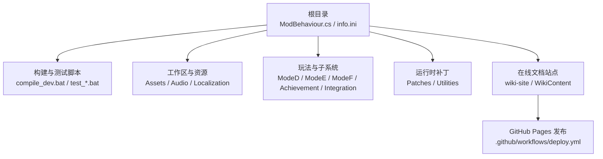
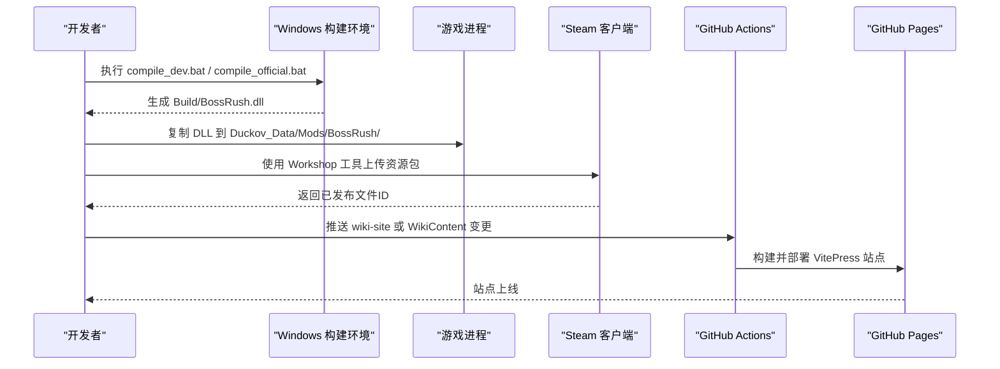
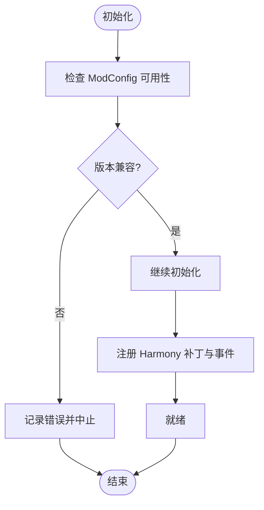
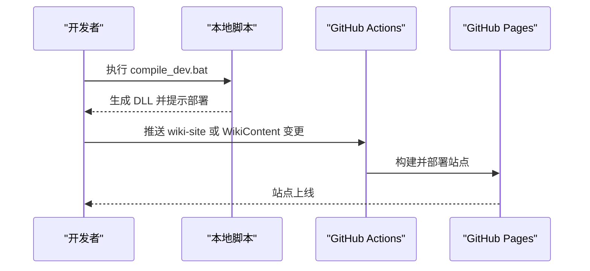
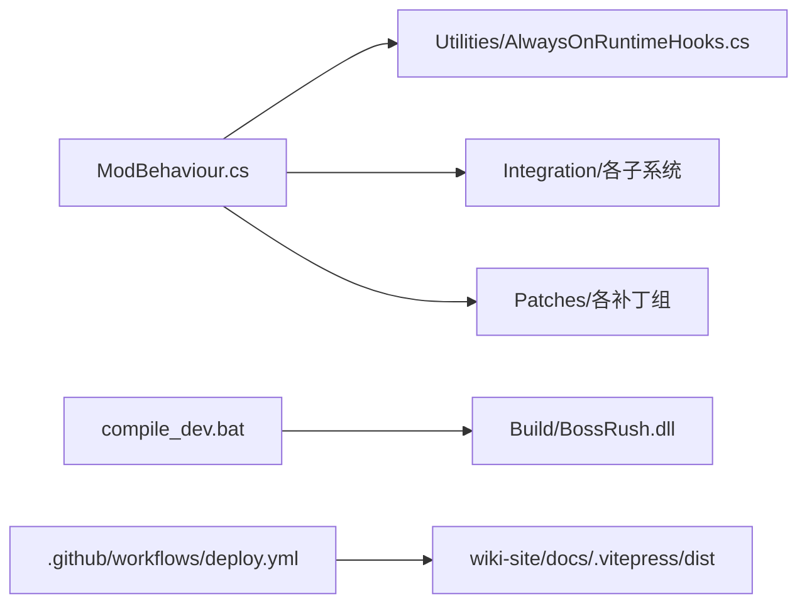

# 部署与发布

<cite>
**本文引用的文件**
- [README.md](file://README.md)
- [AGENTS.md](file://AGENTS.md)
- [ModBehaviour.cs](file://ModBehaviour.cs)
- [ModConfigApi.cs](file://ModConfigApi.cs)
- `info.ini`（本机制品，不随源码纳管）
- [compile_dev.bat](file://compile_dev.bat)
- [test_bossrush_smoke_manual.bat](file://test_bossrush_smoke_manual.bat)
- [test_zombiemode_goal_windows.bat](file://test_zombiemode_goal_windows.bat)
- [.github/workflows/deploy.yml](file://.github/workflows/deploy.yml)
</cite>

## 目录
1. [简介](#简介)
2. [项目结构](#项目结构)
3. [核心组件](#核心组件)
4. [架构总览](#架构总览)
5. [详细组件分析](#详细组件分析)
6. [依赖关系分析](#依赖关系分析)
7. [性能考量](#性能考量)
8. [故障排查指南](#故障排查指南)
9. [结论](#结论)
10. [附录](#附录)

## 简介
本指南面向 BossRushMod 的发布与维护，覆盖 Steam Workshop 发布流程、模组打包与资源管理、版本与兼容性策略、Git 工作流与代码审查、元数据与描述文件编写、截图与预览图制作、发布前检查清单、回滚策略、用户反馈处理，以及自动化发布脚本与 CI/CD 流水线配置示例。内容基于仓库内现有构建脚本、工作流与文档约定整理而成，确保可操作且与当前工程一致。

## 项目结构
BossRushMod 采用“按功能域分目录”的组织方式：主入口与全局状态集中在根目录；玩法模式（Mode D/E/F/G）、集成子系统（装备/NPC/成就/Wiki/重铸等）、运行时补丁（Harmony）、配置与数据、工具与测试脚本各自独立。构建产物输出到 Build 目录，Wiki 站点位于 wiki-site，CI 仅负责 Wiki 站点构建与发布。

图表来源
- [ModBehaviour.cs:1-120](file://ModBehaviour.cs#L1-L120)
- `info.ini`（本机制品，不随源码纳管）
- [.github/workflows/deploy.yml:1-54](file://.github/workflows/deploy.yml#L1-L54)

章节来源
- [README.md:15-224](file://README.md#L15-L224)
- [AGENTS.md:25-45](file://AGENTS.md#L25-L45)

## 核心组件
- 主入口与生命周期：ModBehaviour 负责模块初始化、场景门控、运行时钩子调度、模式状态管理与清理。
- 配置与兼容性：ModConfigApi 提供与 ModConfig 的交互与版本兼容性检查，避免不兼容环境运行。
- 构建与验证：compile_dev.bat 用于开发构建；test_bossrush_smoke_manual.bat 与 test_zombiemode_goal_windows.bat 辅助本地 smoke 测试。
- 发布元数据：info.ini 定义名称、显示名、描述、版本、标签与 Workshop 文件 ID。
- 文档站点发布：.github/workflows/deploy.yml 将 wiki-site 构建为静态站点并部署至 GitHub Pages。

章节来源
- [ModBehaviour.cs:598-797](file://ModBehaviour.cs#L598-L797)
- [ModConfigApi.cs:40-123](file://ModConfigApi.cs#L40-L123)
- [compile_dev.bat:1-6](file://compile_dev.bat#L1-L6)
- [test_bossrush_smoke_manual.bat:1-41](file://test_bossrush_smoke_manual.bat#L1-L41)
- [test_zombiemode_goal_windows.bat:1-39](file://test_zombiemode_goal_windows.bat#L1-L39)
- `info.ini`（本机制品，不随源码纳管）
- [.github/workflows/deploy.yml:1-54](file://.github/workflows/deploy.yml#L1-L54)

## 架构总览
下图展示从源码到最终发布的整体链路：Windows 编译生成 DLL → 复制到游戏 Mods 目录 → 可选地通过 Steam 客户端上传至 Workshop → 同时触发 Wiki 站点构建与发布。

图表来源
- [compile_dev.bat:1-6](file://compile_dev.bat#L1-L6)
- [test_zombiemode_goal_windows.bat:10-24](file://test_zombiemode_goal_windows.bat#L10-L24)
- [.github/workflows/deploy.yml:20-54](file://.github/workflows/deploy.yml#L20-L54)

## 详细组件分析

### Steam Workshop 发布流程
- 准备阶段
  - 确认 info.ini 的版本号、描述、标签与 publishedFileId 正确。
  - 准备预览图与大图（preview.png、big_preview.png），确保尺寸与格式符合 Steam 要求。
  - 更新 README 中的 Workshop 链接与版本号。
- 打包与校验
  - 在 Windows 环境下执行 compile_dev.bat 或 compile_official.bat 生成 Build/BossRush.dll。
  - 使用 test_bossrush_smoke_manual.bat 打印本地 smoke 检查清单，必要时启动游戏进行人工验证。
  - 对涉及 ZombieMode 的改动，执行 test_zombiemode_goal_windows.bat 完成编译与部署 smoke 前置检查。
- 上传与发布
  - 使用 Steam 客户端或命令行工具将包含 DLL、资源与说明文件的压缩包上传至 Workshop。
  - 填写标题、描述、标签、分类与可见性，提交发布。
- 版本管理
  - 每次发布需递增 info.ini 中的 version，并在 README 与 Wiki 中记录变更摘要。
  - 若存在破坏性变更，需在描述中明确影响范围与回滚方案。

章节来源
- `info.ini`（本机制品，不随源码纳管）
- [README.md:151-192](file://README.md#L151-L192)
- [test_bossrush_smoke_manual.bat:1-41](file://test_bossrush_smoke_manual.bat#L1-L41)
- [test_zombiemode_goal_windows.bat:10-39](file://test_zombiemode_goal_windows.bat#L10-L39)

### 兼容性检查与依赖关系处理
- 运行时版本检查
  - ModConfigApi 在初始化时尝试读取 ModBehaviour 的 VERSION 字段并进行比对，若不匹配则记录错误并阻止后续功能加载，避免不兼容环境导致崩溃。
- Harmony 与反射绑定
  - 项目大量使用 HarmonyPatch 与反射访问游戏内部类型与方法，官方更新可能破坏绑定。发布前应结合 AGENTS.md 的契约稳定性文档进行回归检查。
- 外部服务与协议
  - 如星愿许愿台等外部 API 调用，新增字段需保持向后兼容，避免破坏已有请求。

图表来源
- [ModConfigApi.cs:40-123](file://ModConfigApi.cs#L40-L123)
- [AGENTS.md:128-140](file://AGENTS.md#L128-L140)

章节来源
- [ModConfigApi.cs:40-123](file://ModConfigApi.cs#L40-L123)
- [AGENTS.md:128-140](file://AGENTS.md#L128-L140)

### 更新发布策略
- 小步快跑：优先以修复与增量功能为主，减少破坏性变更。
- 灰度发布：先在社区测试服或内测群验证，再全量发布。
- 回滚预案：保留上一稳定版本的压缩包与发布记录，出现问题快速回退。
- 文档同步：更新 README、Wiki 与变更日志，明确新特性与已知问题。

[本节为通用策略说明，不直接分析具体文件]

### Git 工作流、分支管理与代码审查
- 分支策略
  - main：稳定分支，仅合并经过验证的发布候选。
  - develop：集成分支，日常开发与测试在此进行。
  - feature/*：功能分支，完成后发起 PR 到 develop。
  - hotfix/*：紧急修复分支，直接从 main 切出，修复后合并回 main 与 develop。
- 代码审查
  - 所有 PR 至少一名 reviewer 批准后方可合并。
  - 审查重点：TypeID 分配、本地化注入、Harmony 绑定、事件订阅生命周期、配置 schema 变更。
  - 使用 CODE_REVIEW.md 与 CODE_REVIEW_FINDINGS.md 记录审查发现与修复跟踪。
- 提交规范
  - 中文简短摘要，避免英文 conventional-commit。
  - 提交前确认新增 .cs 已登记到 compile_official.bat，TypeID 已登记，不包含敏感信息。

章节来源
- [AGENTS.md:222-231](file://AGENTS.md#L222-L231)
- [CODE_REVIEW.md](file://CODE_REVIEW.md)
- [CODE_REVIEW_FINDINGS.md](file://CODE_REVIEW_FINDINGS.md)

### 模组元数据配置、描述文件与预览图
- 元数据
  - info.ini：name、displayName、description、version、tags、publishedFileId。
  - README.md：项目概览、玩法模式、地图支持、关键物品与系统、技术栈与构建方式、调试热键、文档索引。
- 描述文件
  - Workshop 描述应包含：功能概述、安装方式、兼容性说明、已知问题、回滚指引。
- 截图与预览图
  - preview.png：Workshop 列表页缩略图。
  - big_preview.png：详情页大图。
  - 建议尺寸：至少 600x400，推荐 1920x1080；格式 PNG/JPG。

章节来源
- `info.ini`（本机制品，不随源码纳管）
- [README.md:15-224](file://README.md#L15-L224)

### 发布前检查清单
- 构建与静态检查
  - Windows 编译通过：compile_official.bat 成功生成 Build/BossRush.dll。
  - Python guard 通过：tests/*.py 无断言失败。
- 运行时验证
  - 使用 test_bossrush_smoke_manual.bat 打印检查清单并手工验证波次、UI、本地化、刷怪与过图性能。
  - 涉及 ZombieMode 的改动执行 test_zombiemode_goal_windows.bat 完成前置检查。
- 文档与资源
  - info.ini 版本号递增，描述准确。
  - README 与 Wiki 更新变更日志。
  - 预览图与截图齐全且清晰。
- 兼容性
  - 确认 Harmony 目标未变动，反射绑定有效。
  - 外部 API 请求字段兼容旧版本。

章节来源
- [AGENTS.md:169-177](file://AGENTS.md#L169-L177)
- [test_bossrush_smoke_manual.bat:1-41](file://test_bossrush_smoke_manual.bat#L1-L41)
- [test_zombiemode_goal_windows.bat:10-39](file://test_zombiemode_goal_windows.bat#L10-L39)

### 回滚策略
- 版本快照：每次发布前打 tag 并保存构建产物与压缩包。
- 快速回退：若新版本出现严重问题，立即恢复上一稳定版本压缩包并重新发布。
- 数据兼容：避免删除或重命名存档 key、配置 key 与 TypeID；如需变更，提供迁移脚本与说明。

[本节为通用策略说明，不直接分析具体文件]

### 用户反馈处理
- 收集渠道：Steam 讨论区、Discord/QQ 群、Issue 追踪。
- 分类与优先级：崩溃类高优，功能异常中优，体验优化低优。
- 复现与修复：记录复现步骤、Player.log 与截图；修复后回归验证并更新 FIX_TRACKER.md。

[本节为通用策略说明，不直接分析具体文件]

### 自动化发布脚本与 CI/CD 流水线
- 本地构建脚本
  - compile_dev.bat：设置开发标志并调用 compile_official.bat。
  - test_bossrush_smoke_manual.bat：打印本地 smoke 检查清单并可启动游戏。
  - test_zombiemode_goal_windows.bat：先编译再部署 smoke 辅助，随后提示人工验证。
- CI/CD 流水线
  - .github/workflows/deploy.yml：监听 wiki-site 与 WikiContent 变更，构建 VitePress 站点并部署至 GitHub Pages。
  - 注意：当前流水线仅负责 Wiki 站点发布，不包含 C# 构建与 Workshop 上传。

图表来源
- [compile_dev.bat:1-6](file://compile_dev.bat#L1-L6)
- [.github/workflows/deploy.yml:20-54](file://.github/workflows/deploy.yml#L20-L54)

章节来源
- [compile_dev.bat:1-6](file://compile_dev.bat#L1-L6)
- [test_bossrush_smoke_manual.bat:1-41](file://test_bossrush_smoke_manual.bat#L1-L41)
- [test_zombiemode_goal_windows.bat:10-39](file://test_zombiemode_goal_windows.bat#L10-L39)
- [.github/workflows/deploy.yml:1-54](file://.github/workflows/deploy.yml#L1-L54)

## 依赖关系分析
- 运行时依赖
  - Unity Mono 运行时与游戏程序集（Duckov_Data\Managed）。
  - Harmony 库（Workshop 路径下的 0Harmony.dll）用于补丁注入。
- 构建依赖
  - Windows .NET SDK 与 Roslyn csc.dll。
  - 本地游戏目录与 Workshop/Harmony 路径。
- 文档站点依赖
  - Node.js 20 与 VitePress。
  - GitHub Pages 环境。

图表来源
- [ModBehaviour.cs:598-797](file://ModBehaviour.cs#L598-L797)
- [compile_dev.bat:1-6](file://compile_dev.bat#L1-L6)
- [.github/workflows/deploy.yml:20-54](file://.github/workflows/deploy.yml#L20-L54)

章节来源
- [README.md:151-192](file://README.md#L151-L192)
- [AGENTS.md:59-67](file://AGENTS.md#L59-L67)

## 性能考量
- 运行时性能
  - 避免每帧分配与频繁对象查找，使用缓存与复用列表。
  - 热路径日志需谨慎，避免噪声影响性能。
- 构建与部署
  - 控制资源体积，合理拆分 AssetBundle。
  - 预加载关键资源，减少首次进入延迟。

[本节为通用性能建议，不直接分析具体文件]

## 故障排查指南
- 常见构建问题
  - 新增 .cs 未加入 compile_official.bat：grep 搜索新文件名确认是否被纳入编译。
  - 路径硬编码：换机器或盘符需调整脚本路径。
- 运行时问题
  - Harmony 目标失效：对照官方更新日志与 docs/架构说明/Harmony补丁契约稳定性.md 复查。
  - 反射绑定失败：检查 AccessTools 字段与方法名是否变更。
- 日志与诊断
  - 保留 Player.log 与控制台输出。
  - 使用 test_bossrush_smoke_manual.bat 打印检查清单并记录结果。

章节来源
- [AGENTS.md:49-67](file://AGENTS.md#L49-L67)
- [test_bossrush_smoke_manual.bat:1-41](file://test_bossrush_smoke_manual.bat#L1-L41)

## 结论
BossRushMod 的发布流程以 Windows 构建为核心，配合本地 smoke 测试与 Wiki 站点 CI 发布。发布前需严格遵循版本管理、兼容性检查与文档同步；发布后需建立回滚机制与用户反馈闭环。通过规范的 Git 工作流与代码审查，可保障发布质量与长期维护效率。

## 附录
- 常用命令
  - 构建：compile_dev.bat
  - Smoke 测试：test_bossrush_smoke_manual.bat
  - ZombieMode 验证：test_zombiemode_goal_windows.bat
- 关键文件
  - 元数据：info.ini
  - 主入口：ModBehaviour.cs
  - 兼容性：ModConfigApi.cs
  - 文档站点：wiki-site/.github/workflows/deploy.yml

[本节为补充信息，不直接分析具体文件]