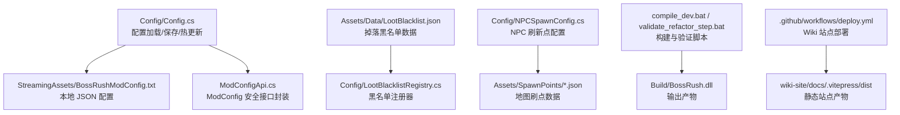
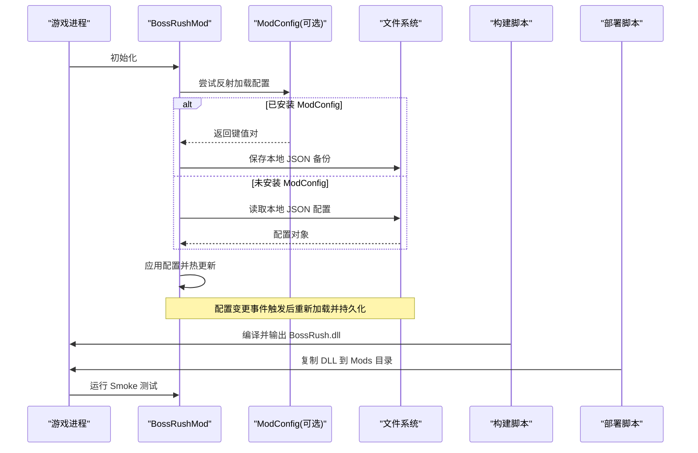
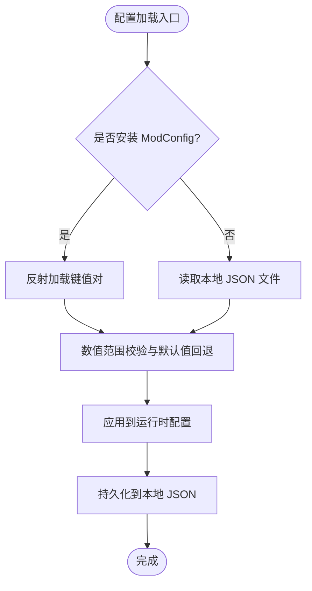
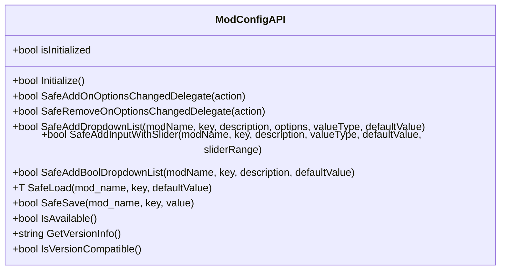
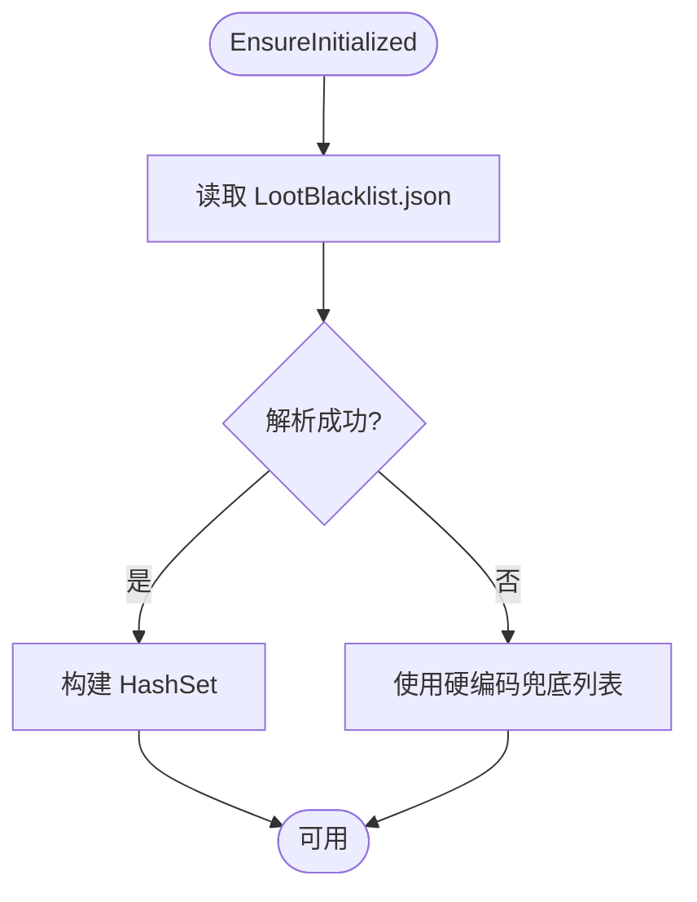
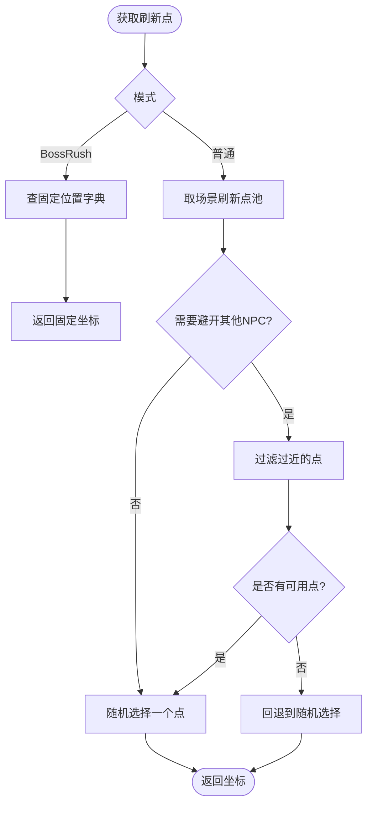
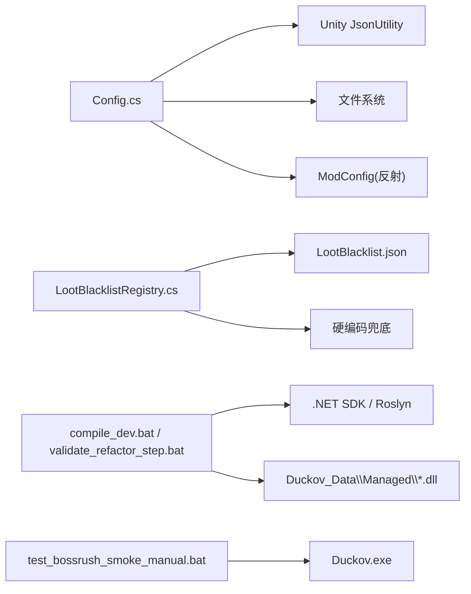

# 配置与部署

<cite>
**本文引用的文件**
- [Config.cs](file://Config/Config.cs)
- [ModConfigApi.cs](file://ModConfigApi.cs)
- [LootBlacklistRegistry.cs](file://Config/LootBlacklistRegistry.cs)
- [NPCSpawnConfig.cs](file://Config/NPCSpawnConfig.cs)
- [LootBlacklist.json](file://Assets/Data/LootBlacklist.json)
- [README.md](file://README.md)
- [AGENTS.md](file://AGENTS.md)
- [compile_dev.bat](file://compile_dev.bat)
- [test_bossrush_smoke_manual.bat](file://test_bossrush_smoke_manual.bat)
- [test_zombiemode_goal_windows.bat](file://test_zombiemode_goal_windows.bat)
- [validate_refactor_step.bat](file://validate_refactor_step.bat)
- [deploy.yml](file://.github/workflows/deploy.yml)
</cite>

## 目录
1. [简介](#简介)
2. [项目结构](#项目结构)
3. [核心组件](#核心组件)
4. [架构总览](#架构总览)
5. [详细组件分析](#详细组件分析)
6. [依赖关系分析](#依赖关系分析)
7. [性能考量](#性能考量)
8. [故障排除指南](#故障排除指南)
9. [结论](#结论)
10. [附录](#附录)

## 简介
本文件聚焦 BossRushMod 的配置系统与构建部署流程，覆盖：
- 配置管理系统、配置文件格式、运行时配置选项与热重载机制
- 构建系统（编译脚本、依赖管理、版本控制约束）
- 部署流程与环境要求
- 配置验证机制与默认值管理
- Steam Workshop 发布相关流程与兼容性检查建议
- 配置调优与故障排除

## 项目结构
BossRushMod 采用“按功能域分目录”的组织方式，配置与部署相关内容主要分布在以下位置：
- Config：运行时配置、数据注册表与 NPC 刷新点配置
- Assets/Data：JSON 数据（如掉落黑名单）
- 根目录：构建与测试脚本、仓库级规则文档
- .github/workflows：在线 Wiki 站点部署流水线（非 Mod 二进制发布）

图表来源
- [Config.cs:100-232](file://Config/Config.cs#L100-L232)
- [ModConfigApi.cs:92-154](file://ModConfigApi.cs#L92-L154)
- [LootBlacklistRegistry.cs:21-63](file://Config/LootBlacklistRegistry.cs#L21-L63)
- [NPCSpawnConfig.cs:20-75](file://Config/NPCSpawnConfig.cs#L20-L75)
- [deploy.yml:20-54](file://.github/workflows/deploy.yml#L20-L54)

章节来源
- [README.md:123-168](file://README.md#L123-L168)
- [AGENTS.md:47-140](file://AGENTS.md#L47-L140)

## 核心组件
- 配置系统（Config.cs）
  - 支持从本地 JSON 文件加载配置，并保存到 StreamingAssets 下的配置文件
  - 通过反射与 ModConfig 模组集成，提供运行时配置项的读取、写入与变更事件处理
  - 对数值型配置进行范围校验与默认值回退
- 配置 API（ModConfigApi.cs）
  - 为 ModConfig 提供安全的反射封装，避免异常传播到宿主
  - 提供初始化、版本兼容检查、添加配置项、订阅配置变更等能力
- 数据注册表（LootBlacklistRegistry.cs）
  - 从 JSON 加载掉落黑名单，解析失败时回退到硬编码列表
  - 提供 Contains 查询接口供掉落逻辑使用
- NPC 刷新点配置（NPCSpawnConfig.cs）
  - 集中管理多场景下不同 NPC 的固定或随机刷新点
  - 提供避开其他 NPC 的安全选择算法

章节来源
- [Config.cs:36-81](file://Config/Config.cs#L36-L81)
- [Config.cs:155-232](file://Config/Config.cs#L155-L232)
- [Config.cs:234-407](file://Config/Config.cs#L234-L407)
- [Config.cs:586-704](file://Config/Config.cs#L586-L704)
- [ModConfigApi.cs:92-154](file://ModConfigApi.cs#L92-L154)
- [LootBlacklistRegistry.cs:21-63](file://Config/LootBlacklistRegistry.cs#L21-L63)
- [NPCSpawnConfig.cs:20-75](file://Config/NPCSpawnConfig.cs#L20-L75)

## 架构总览
配置与部署的整体流程如下：
- 启动时优先尝试从 ModConfig 加载配置；若未安装则回退到本地 JSON 文件
- 配置变更后通过事件回调实时生效，并持久化到本地文件
- 构建阶段由 Windows 批处理脚本调用 Roslyn 编译器生成 DLL
- 部署阶段将 DLL 复制到游戏 Mods 目录，并通过手工 smoke 测试验证
- Wiki 站点通过 GitHub Actions 自动构建并发布到 Pages

图表来源
- [Config.cs:155-232](file://Config/Config.cs#L155-L232)
- [Config.cs:234-407](file://Config/Config.cs#L234-L407)
- [Config.cs:586-704](file://Config/Config.cs#L586-L704)
- [compile_dev.bat:1-6](file://compile_dev.bat#L1-L6)
- [test_bossrush_smoke_manual.bat:1-41](file://test_bossrush_smoke_manual.bat#L1-L41)

## 详细组件分析

### 配置系统（Config.cs）
- 配置数据结构
  - 包含波次间隔、掉落随机化、原版概率、掩体行为、无间炼狱参数、Boss 倍率、里程碑休息奖励、Mode D 敌人数、禁用 Boss 列表、权重因子、龙冲刺开关、成就热键、狼模型开关、死亡亡魂系统开关、变异词条开关与数量等
- 配置文件路径
  - 位于 StreamingAssets 下的 BossRushModConfig.txt
- 加载与保存
  - 从 JSON 反序列化为配置对象，缺失字段使用默认值
  - 保存时使用 JsonUtility 序列化，确保目录存在
- ModConfig 集成
  - 通过反射查找 OptionsManager_Mod 类型，动态加载各类型配置项
  - 对数值型配置进行范围钳制（例如波次间隔 2-60 秒、Boss 倍率 0.1-10）
- 热重载
  - 监听配置变更事件，仅重载对应键，并持久化到本地文件
  - 部分配置（如波次间隔）在倒计时过程中可立即生效

图表来源
- [Config.cs:155-232](file://Config/Config.cs#L155-L232)
- [Config.cs:234-407](file://Config/Config.cs#L234-L407)
- [Config.cs:586-704](file://Config/Config.cs#L586-L704)

章节来源
- [Config.cs:36-81](file://Config/Config.cs#L36-L81)
- [Config.cs:100-232](file://Config/Config.cs#L100-L232)
- [Config.cs:234-407](file://Config/Config.cs#L234-L407)
- [Config.cs:586-704](file://Config/Config.cs#L586-L704)

### 配置 API（ModConfigApi.cs）
- 安全初始化
  - 扫描已加载程序集，定位 ModConfig.ModBehaviour 与 OptionsManager_Mod
  - 检查必要方法是否存在，并进行版本兼容检查
- 配置项注册与事件
  - 提供添加下拉列表、滑条输入框、布尔下拉列表等方法
  - 安全地添加/移除选项变更委托，避免异常传播
- 配置读写
  - 泛型 SafeLoad/SafeSave 封装反射调用，统一键名前缀
  - 错误日志记录便于排查

图表来源
- [ModConfigApi.cs:92-154](file://ModConfigApi.cs#L92-L154)
- [ModConfigApi.cs:213-442](file://ModConfigApi.cs#L213-L442)
- [ModConfigApi.cs:448-498](file://ModConfigApi.cs#L448-L498)

章节来源
- [ModConfigApi.cs:92-154](file://ModConfigApi.cs#L92-L154)
- [ModConfigApi.cs:213-442](file://ModConfigApi.cs#L213-L442)
- [ModConfigApi.cs:448-498](file://ModConfigApi.cs#L448-L498)

### 掉落黑名单注册表（LootBlacklistRegistry.cs）
- 数据源
  - 优先从 LootBlacklist.json 读取 itemIds
  - 解析失败或为空时回退到硬编码列表
- 解析逻辑
  - 简单字符串解析，提取数组内容并转换为整数集合
  - 非法值会记录警告并回退
- 使用方式
  - 提供 Contains 接口用于掉落过滤

图表来源
- [LootBlacklistRegistry.cs:21-63](file://Config/LootBlacklistRegistry.cs#L21-L63)
- [LootBlacklistRegistry.cs:65-112](file://Config/LootBlacklistRegistry.cs#L65-L112)
- [LootBlacklistRegistry.cs:114-171](file://Config/LootBlacklistRegistry.cs#L114-L171)
- [LootBlacklist.json:1-23](file://Assets/Data/LootBlacklist.json#L1-L23)

章节来源
- [LootBlacklistRegistry.cs:21-63](file://Config/LootBlacklistRegistry.cs#L21-L63)
- [LootBlacklistRegistry.cs:65-112](file://Config/LootBlacklistRegistry.cs#L65-L112)
- [LootBlacklistRegistry.cs:114-171](file://Config/LootBlacklistRegistry.cs#L114-L171)
- [LootBlacklist.json:1-23](file://Assets/Data/LootBlacklist.json#L1-L23)

### NPC 刷新点配置（NPCSpawnConfig.cs）
- 固定与随机刷新
  - BossRush 模式提供固定位置字典
  - 普通模式提供每场景的刷新点数组，支持随机选择
- 安全选择
  - 通用算法可避开其他 NPC 的位置，保证最小距离
- 扩展性
  - 新增场景只需添加配置字典条目与刷新点数组

图表来源
- [NPCSpawnConfig.cs:57-75](file://Config/NPCSpawnConfig.cs#L57-L75)
- [NPCSpawnConfig.cs:213-253](file://Config/NPCSpawnConfig.cs#L213-L253)
- [NPCSpawnConfig.cs:385-445](file://Config/NPCSpawnConfig.cs#L385-L445)

章节来源
- [NPCSpawnConfig.cs:20-75](file://Config/NPCSpawnConfig.cs#L20-L75)
- [NPCSpawnConfig.cs:213-253](file://Config/NPCSpawnConfig.cs#L213-L253)
- [NPCSpawnConfig.cs:385-445](file://Config/NPCSpawnConfig.cs#L385-L445)

## 依赖关系分析
- 配置系统依赖
  - Unity JsonUtility 用于 JSON 序列化/反序列化
  - 反射机制访问 ModConfig 类型与方法
  - 文件系统读写本地配置
- 数据注册表依赖
  - JSON 数据文件与解析逻辑
  - 硬编码兜底列表保证可用性
- 构建与部署依赖
  - Windows .NET SDK 与 Roslyn csc.dll
  - 游戏 Managed 目录中的依赖程序集
  - Workshop/Harmony 环境用于加载 Mod

图表来源
- [Config.cs:155-232](file://Config/Config.cs#L155-L232)
- [Config.cs:234-407](file://Config/Config.cs#L234-L407)
- [LootBlacklistRegistry.cs:21-63](file://Config/LootBlacklistRegistry.cs#L21-L63)
- [compile_dev.bat:1-6](file://compile_dev.bat#L1-L6)
- [validate_refactor_step.bat:1-47](file://validate_refactor_step.bat#L1-L47)
- [test_bossrush_smoke_manual.bat:1-41](file://test_bossrush_smoke_manual.bat#L1-L41)

章节来源
- [AGENTS.md:47-67](file://AGENTS.md#L47-L67)
- [README.md:150-168](file://README.md#L150-L168)

## 性能考量
- 配置加载
  - 首次加载时进行 JSON 解析与范围校验，后续变更仅重载受影响键
  - 避免在热路径中频繁 IO，必要时缓存结果
- 黑名单注册
  - 使用 HashSet 提升 Contains 查询效率
  - 解析失败快速回退，避免阻塞主流程
- NPC 刷新点选择
  - 复用缓冲列表减少分配
  - 距离过滤仅在需要时执行，降低开销

[本节为通用指导，不直接分析具体文件]

## 故障排除指南
- 配置无法加载
  - 检查 ModConfig 是否安装且版本兼容
  - 确认本地 JSON 文件路径与权限
  - 查看日志中的警告信息（如解析失败、回退到硬编码）
- 配置变更未生效
  - 确认事件委托是否正确注册
  - 检查键名是否与代码中定义一致
  - 观察是否在倒计时过程中被修改，部分配置需立即重算
- 构建失败
  - 确保在 Windows 环境运行
  - 检查 compile_official.bat 是否包含新文件
  - 确认 .NET SDK 与游戏依赖路径正确
- 部署后运行异常
  - 使用 smoke 测试脚本打印检查清单并手动验证
  - 保留最新 Player.log 以便排查
  - 关注 Harmony 补丁与反射绑定是否因官方更新失效

章节来源
- [Config.cs:155-232](file://Config/Config.cs#L155-L232)
- [Config.cs:586-704](file://Config/Config.cs#L586-L704)
- [LootBlacklistRegistry.cs:21-63](file://Config/LootBlacklistRegistry.cs#L21-L63)
- [test_bossrush_smoke_manual.bat:1-41](file://test_bossrush_smoke_manual.bat#L1-L41)
- [validate_refactor_step.bat:1-47](file://validate_refactor_step.bat#L1-L47)

## 结论
BossRushMod 的配置系统以本地 JSON 与 ModConfig 双通道为核心，具备完善的默认值管理、范围校验与热重载能力。构建与部署流程围绕 Windows 环境与 Roslyn 编译展开，配合 Python guard 与手工 smoke 测试保障稳定性。对于 Steam Workshop 发布，建议遵循仓库级规则与兼容性分类，并在发布前完成编译、guard、部署与人工 smoke 的全链路验证。

[本节为总结，不直接分析具体文件]

## 附录

### 构建与部署流程
- 构建
  - 使用 compile_dev.bat 设置开发标志并调用 compile_official.bat
  - 产出 Build/BossRush.dll
- 部署
  - 使用 test_bossrush_smoke_manual.bat 打印检查清单并启动游戏进行手工验证
  - 使用 test_zombiemode_goal_windows.bat 串联编译与部署步骤，并提示人工 smoke
- 自动化验证
  - validate_refactor_step.bat 串联构建、部署、guard 套件与手工 smoke 提示

章节来源
- [compile_dev.bat:1-6](file://compile_dev.bat#L1-L6)
- [test_bossrush_smoke_manual.bat:1-41](file://test_bossrush_smoke_manual.bat#L1-L41)
- [test_zombiemode_goal_windows.bat:1-39](file://test_zombiemode_goal_windows.bat#L1-L39)
- [validate_refactor_step.bat:1-47](file://validate_refactor_step.bat#L1-L47)

### 在线 Wiki 站点部署
- 工作流
  - 当 wiki-site 或 WikiContent 发生推送时触发
  - 使用 Node 20 安装依赖并构建 VitePress 站点
  - 上传构建产物并发布到 GitHub Pages

章节来源
- [deploy.yml:1-54](file://.github/workflows/deploy.yml#L1-L54)

### 配置项参考（节选）
- waveIntervalSeconds：波次间休息时间
- enableRandomBossLoot：启用 Boss 随机掉落加成
- useLegacyBossLootProbabilities：标准 Boss 战利品箱使用原版概率区间
- useInteractBetweenWaves：波次间改为手动交互开下一波
- lootBoxBlocksBullets：掉落箱是否可作为掩体挡子弹
- infiniteHellBossesPerWave：无间炼狱每波 Boss 数
- bossStatMultiplier：Boss 全局数值倍率
- modeDEnemiesPerWave：白手起家每波敌人数
- disabledBosses：被禁用的 Boss 列表
- bossInfiniteHellFactors：无间炼狱 Boss 刷新权重因子
- enableDragonDash：是否启用龙冲刺相关能力
- achievementHotkey：成就面板热键
- useWolfModelForWildHorn：荒野号角是否使用狼模型
- enableDeathWraithSystem：死亡亡魂系统开关
- milestoneRestBonusSeconds：每 5 波额外休息时间

章节来源
- [README.md:123-149](file://README.md#L123-L149)

### Steam Workshop 发布与兼容性检查建议
- 发布前检查
  - 完成 Windows 编译与部署
  - 运行 Python guard 套件
  - 执行手工 smoke 测试并记录结果
- 兼容性分类
  - 区分 SAFE、COMPAT、SCHEMA+/-、WIRE+/-、BREAKING、OPERATIONAL
  - 高风险变更需 owner 明确确认
- 版本与契约
  - 保持 TypeID、存档 key、配置 key 稳定
  - 关注 Harmony 补丁与反射绑定的稳定性

章节来源
- [AGENTS.md:142-157](file://AGENTS.md#L142-L157)
- [AGENTS.md:169-181](file://AGENTS.md#L169-L181)